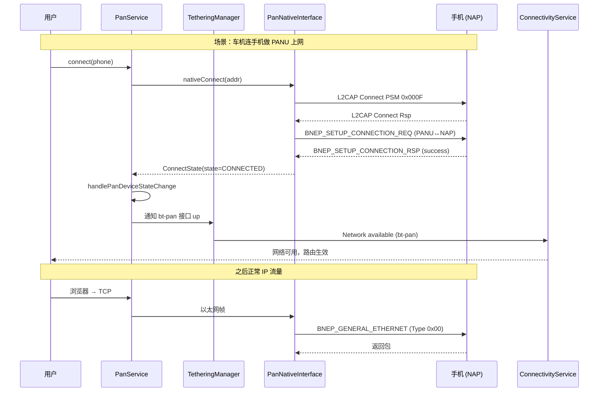

# 15.2 PAN / BNEP

> **速通摘要**：PAN (Personal Area Networking) 把蓝牙变成"网络接入"——通过蓝牙让设备共享数据网络。Android 实现两个角色：① **PANU** (PAN User)——本机当客户端，借手机网络上网；② **NAP** (Network Access Point)——本机当热点（蓝牙网络共享/Tethering）。底层走 **BNEP** (Bluetooth Network Encapsulation Protocol) 把以太网帧装进 L2CAP。核心源码 `PanService.java:62`，通过 `TetheringManager` 与 Android 网络栈接合。车机典型用法：手机当 NAP / 车机当 PANU，借手机蓝牙网络做"应急上网"（4G 信号差时）。

---

## 学习目标

读完本节后，你能：
1. 区分 PANU、NAP、GN 三种角色（车机大多用 PANU + NAP 二选一）。
2. 解释 BNEP 与 L2CAP 的关系（BNEP 是 L2CAP 上的"以太网仿真"）。
3. 找到 PAN 与 Android `TetheringManager` 接合的代码位置。
4. 排查"蓝牙网络共享开了但没网"的常见问题。

---

## 前置知识

- [05.6 L2CAP](../05_Native栈基础/05.6_L2CAP.md)
- Android `TetheringManager` 基本概念（外部依赖）

---

## 场景故事

车主开车到郊区，4G 信号差。手机能搜到 2G/3G，但车机自带 4G 模块完全没信号。打开手机的"蓝牙共享网络"，车机蓝牙连过去——车机的导航/在线音乐又能用了。

这个流程的角色：
- 手机 = NAP（提供网络）
- 车机 = PANU（消费网络）
- 中间走 BNEP 协议在 L2CAP 上仿真以太网

---

## 一、三种角色

| 角色 | 全称 | 行为 | 典型设备 |
|------|------|------|---------|
| **PANU** | PAN User | 客户端，借用别人的网络 | 车机 / 电脑 |
| **NAP** | Network Access Point | "热点"模式，把自己的网络共享出去 | 手机（蓝牙共享） |
| **GN** | Group ad-hoc Network | P2P 群组（两台 PANU 互连，无外网） | 极少用 |

Android 同时支持 PANU + NAP，但**一次只能扮演一种**：

```java
// android.bluetooth.BluetoothPan
public static final int LOCAL_PANU_ROLE = 1;  // 本机当 PANU
public static final int LOCAL_NAP_ROLE  = 2;  // 本机当 NAP
public static final int REMOTE_PANU_ROLE = 1; // 对端是 PANU
public static final int REMOTE_NAP_ROLE  = 2; // 对端是 NAP
```

`PanService.java:67-69` 的角色组合：
```java
// 车机连手机的蓝牙网络共享：
LOCAL_PANU_ROLE × REMOTE_NAP_ROLE

// 车机开蓝牙热点给手机：
LOCAL_NAP_ROLE × REMOTE_PANU_ROLE
```

---

## 二、BNEP 协议

BNEP（Bluetooth Network Encapsulation Protocol）是 PAN 的核心：

```
┌──────────────────────────────────┐
│ 上层 (TCP/IP)                     │
├──────────────────────────────────┤
│ 以太网帧（MAC 地址 + EtherType）   │
├──────────────────────────────────┤
│ BNEP 头（类型 + 压缩选项）         │
├──────────────────────────────────┤
│ L2CAP (PSM 0x000F)                │
├──────────────────────────────────┤
│ ACL                               │
└──────────────────────────────────┘
```

**BNEP 头部类型**（最常用）：
| Type | 含义 |
|------|------|
| 0x00 | General Ethernet（完整以太网帧） |
| 0x01 | Ethernet with Compressed Source（省源 MAC） |
| 0x02 | Ethernet with Compressed Dest（省目标 MAC） |
| 0x03 | Both Compressed | 

设备协商后，可以省略两个 MAC（双方都知道对方），只传 EtherType + 数据，节省 12 字节/包。

---

## 三、源码导读

### 3.1 类与入口

```java
// android/app/src/com/android/bluetooth/pan/PanService.java:62
public class PanService extends ConnectableProfile {

    // :65
    private static final int BLUETOOTH_MAX_PAN_CONNECTIONS = 5;

    // :67-69
    private static final int MESSAGE_CONNECT              = 1;
    private static final int MESSAGE_DISCONNECT           = 2;
    private static final int MESSAGE_CONNECT_STATE_CHANGED = 11;

    // :245 主动连接（PANU 角色）
    public boolean connect(BluetoothDevice device) {
        if (mUserManager.isGuestUser()) {
            // 访客用户不允许改 WiFi/网络共享
            return false;
        }
        Message msg = mHandler.obtainMessage(MESSAGE_CONNECT, device);
        mHandler.sendMessage(msg);
        return true;
    }

    // :260
    public boolean disconnect(BluetoothDevice device) {
        Message msg = mHandler.obtainMessage(MESSAGE_DISCONNECT, device);
        mHandler.sendMessage(msg);
        return true;
    }

    // :280 NAP 角色开关
    void setBluetoothTethering(IBluetoothPanCallback callback, int id, int callerUid, boolean value) {
        if (mUserManager.hasUserRestriction(UserManager.DISALLOW_CONFIG_TETHERING) && value) {
            throw new SecurityException("DISALLOW_CONFIG_TETHERING is enabled for this user.");
        }
        // 维护回调表、切换 mTetherOn、断开旧连接、广播状态变化
    }
}
```

### 3.2 与 TetheringManager 的接合

```java
// PanService.java:118 构造时拿系统 TetheringManager
mTetheringManager = requireNonNull(obtainSystemService(TetheringManager.class));

// :87 注册 Tethering 事件回调
final TetheringManager.TetheringEventCallback mTetheringCallback =
    new TetheringManager.TetheringEventCallback() {
        @Override
        public void onError(TetheringInterface iface, int error) {
            if (mIsTethering && iface.getType() == TetheringManager.TETHERING_BLUETOOTH) {
                Log.e(TAG, "Error setting up tether interface: " + error);
                // 全部断开
                for (BluetoothDevice device : mPanDevices.keySet()) {
                    mNativeInterface.disconnect(...);
                }
                mPanDevices.clear();
                mIsTethering = false;
            }
        }
    };
```

注意 `TetheringManager` 在 system_server 中，是 Android 网络栈的入口。蓝牙 PAN 在这里只是"网络接口提供者"——具体 IP 分配、NAT、DNS 都由系统的 Tethering 子系统处理。

### 3.3 网络工厂

```java
// android/app/src/com/android/bluetooth/pan/BluetoothTetheringNetworkFactory.java
// 当作为 PANU 时，注册 NetworkFactory 让 ConnectivityService 识别这条蓝牙网络
```

车机当 PANU 时：
1. BNEP 建链成功 → 创建虚拟网卡 `bt-pan` 接口
2. `BluetoothTetheringNetworkFactory` 向 ConnectivityService 注册这个网络
3. 系统按优先级决定要不要用这个网络（一般低于 WiFi 高于 Cellular Roaming）

---

## 四、连接时序



---

## 五、调用链

```
[App: 网络请求]
     ↓
android Networking Stack (TCP/IP)
     ↓
bt-pan 虚拟网卡
     ↓
BluetoothTetheringNetworkFactory (BluetoothTetheringNetworkFactory.java)
     ↓
android.bluetooth.BluetoothPan (Framework, 外部依赖)
     ↓ AIDL
PanService.java:62
     ↓
PanNativeInterface.java (JNI)
     ↓
system/btif/src/btif_pan.cc
     ↓
system/bta/pan/bta_pan_*.cc
     ↓
system/stack/pan/pan_*.cc  (BNEP 实现)
     ↓
L2CAP (PSM 0x000F)
     ↓
HCI → Controller
```

---

## 六、调试方法

```bash
# 看 PAN 服务状态
adb shell dumpsys bluetooth_manager | grep -A 15 "PanService"

# 看蓝牙 PAN 接口
adb shell ifconfig | grep -A 4 "bt-pan"

# 看 Tethering 状态
adb shell dumpsys tethering | grep -i bluetooth

# logcat
adb logcat -s PanService:V BluetoothPanJni:V BluetoothTetheringNetworkFactory:V

# 看 BNEP L2CAP 包
adb logcat -s bt_l2cap:V | grep "0x000F\|PSM_BNEP"

# 检查 ConnectivityService 是否识别 bt-pan
adb shell dumpsys connectivity | grep -A 3 "bt-pan"

# 测试连通性（连上手机 NAP 后）
adb shell ping -c 3 -I bt-pan 8.8.8.8

# 关键指标
adb shell ip route show table all | grep bt-pan
```

---

## 七、常见问题

### 7.1 蓝牙网络共享开了但没网

排查顺序：
1. 看 `dumpsys` 中 PAN STATE 是否 CONNECTED
2. 看 `ifconfig bt-pan` 是否有 IPv4 地址（手机做 DHCP Server）
3. 看 `dumpsys tethering` 是否报错
4. 试 `ping -I bt-pan 192.168.44.1`（手机 NAP 默认网关地址）

### 7.2 多设备限制

```java
// PanService.java:65
private static final int BLUETOOTH_MAX_PAN_CONNECTIONS = 5;
```

最多 5 台 PANU 同时连一台 NAP，但也受 `config_max_pan_devices`（可通过 overlay 改）限制。

### 7.3 与 A2DP 共存

蓝牙带宽紧张时 PAN 大流量会挤压 A2DP——表现为听音乐卡顿。原因：L2CAP 调度公平但 ACL 带宽就那么多。建议：车机如果开 PAN，不要同时跑 A2DP。

---

## FAQ

**Q1：为什么 Android 默认不允许 Guest 用户用 PAN？**
`PanService.connect()` 在 :246 检查 `isGuestUser()`，访客模式无权改网络配置（隔离原则）。这是 Android Multi-user 框架的标准限制。

**Q2：蓝牙网络共享和 WiFi 热点哪个快？**
WiFi 远远快（54-300Mbps vs 蓝牙 1-2Mbps），但蓝牙更省电（功率 ~10mW vs WiFi ~500mW）。车机用 BT PAN 只在 WiFi 受限的应急场景。

**Q3：BNEP 包大小限制是多少？**
BNEP MTU 默认 1691 字节（Bluetooth spec），考虑以太网帧头后实际 payload ~1500。L2CAP MTU 决定上限，可以在 Setup 时协商更大。

**Q4：car机里 PAN 是不是常被砍掉？**
经常被砍。原因：① 大多车机有自带 4G/5G 模块；② BNEP 数据率低，体验差；③ 占用 L2CAP 资源。`sysprop` 中可以通过 `BluetoothProperties.isProfilePanPanuEnabled()` 关掉（PanService.java:138）。

---

## 上路任务

1. 打开 `android/app/src/com/android/bluetooth/pan/PanService.java:184` 的 `handleMessage`，把 3 个 MESSAGE 的处理路径理清。
2. 在手机端打开"蓝牙共享网络"，车机端 connect 后用 `adb shell ifconfig` 找到 `bt-pan` 接口，记录其 MTU 和 IP。
3. 找到 `PanService.java:280` 的 `setBluetoothTethering`，看 NAP 模式的开关流程，找到 `mTetherOn` 是怎么联动 `disconnect()` 全部连接的。
