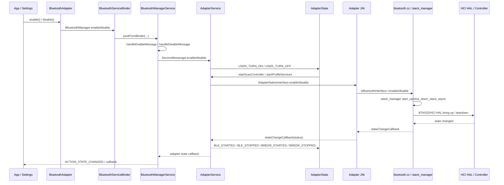
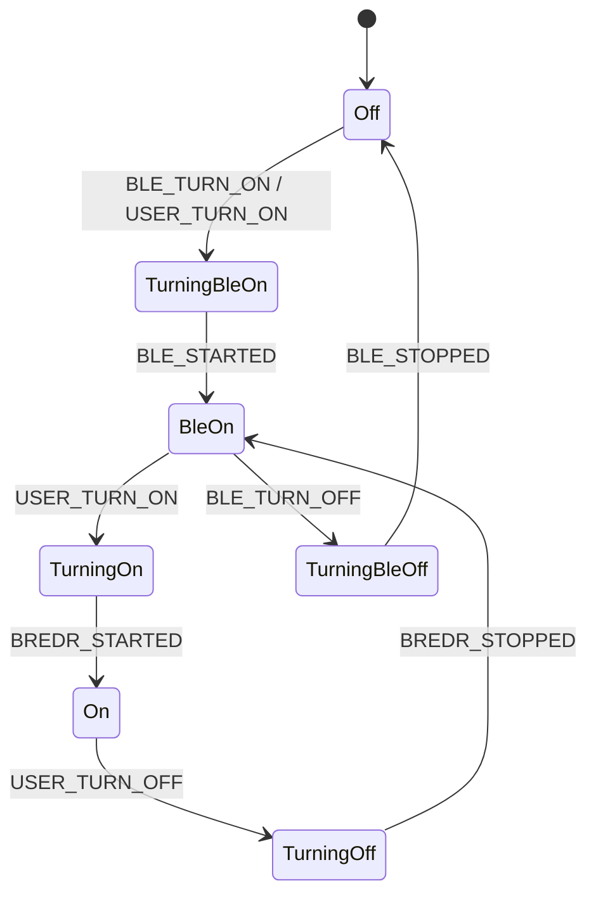

# 16-定向代码阅读报告：Enable / Disable

## 1. 阅读目标

本报告聚焦蓝牙总开关：`BluetoothAdapter.enable()` / `disable()` 如何经过 Framework 管理层、`AdapterService`、`AdapterState`、JNI 和 native stack 完成异步开关机。

读完后要能定位：

- 设置页点开蓝牙后长时间停在“正在开启”。
- `BluetoothAdapter` 状态广播顺序异常，App 看到 `STATE_BLE_ON` 但看不到 `STATE_ON`。
- BLE-only 模式、完整 BR/EDR ON 模式混淆导致 Profile 没启动。
- 蓝牙关闭后仍有 scan/GATT 残留回调、Profile 没停干净。
- Native stack enable/disable 卡住，Java 侧只有超时或状态不回。

## 2. 适用场景

- 车机冷启动后蓝牙不可用，`BluetoothAdapter.getDefaultAdapter()` 不为空但状态不是 `STATE_ON`。
- 打开蓝牙失败，需要判断卡在 Framework 管理层、`AdapterService`、JNI、BTIF/BTA 还是 Controller/HAL。
- 定制开机默认打开、飞行模式联动、低功耗 BLE-only 保活、用户开关记忆策略。
- 排查“关闭蓝牙后又被自动拉起”“Profile 服务没有跟随 Adapter 状态启动/停止”等问题。

## 3. 调用链全景图



核心判断：Java API 返回成功只代表请求被接收，真正状态以后续 `ACTION_STATE_CHANGED`、`dumpsys bluetooth_manager`、`dumpsys bluetooth` 和 native log 为准。

## 4. 关键类与源码入口

| 层级 | 源码 | 关键入口 |
| --- | --- | --- |
| Framework API | `framework/java/android/bluetooth/BluetoothAdapter.java` | `enable()`、`disable()`、`STATE_OFF`、`STATE_BLE_ON`、`STATE_ON` 等状态常量 |
| system_server 入口 | `service/src/BluetoothService.kt` | `HandlerThread("BluetoothSystemServer")`，承载管理服务异步处理 |
| Binder 边界 | `service/src/com/android/server/bluetooth/BluetoothServiceBinder.java` | `enable(...)`、`disable(...)`、`postFromBinder(...)`、`getServiceMessenger()` |
| 管理层 | `service/src/com/android/server/bluetooth/BluetoothManagerService.java` | `enable(...)`、`disable(...)`、`handleEnableMessage(...)`、`handleDisableMessage()`、`handleEnable()`、`handleDisableDelayed()`、`dump(...)` |
| 管理层状态 | `service/src/com/android/server/bluetooth/AdapterState.kt` | system_server 侧 Adapter 状态封装 |
| 消息桥 | `service/src/ServiceMessenger.kt` | 向蓝牙进程发送 enable/disable 消息 |
| 蓝牙进程服务 | `android/app/src/com/android/bluetooth/btservice/AdapterService.java` | `enable()`、`disable()`、`startScanController()`、`stopScanController()`、`startProfileServices()`、`stopProfileServices()`、`stateChangeCallback(...)`、`updateAdapterState(...)` |
| 蓝牙进程状态机 | `android/app/src/com/android/bluetooth/btservice/AdapterState.java` | `OffState`、`TurningBleOnState`、`BleOnState`、`TurningOnState`、`OnState`、`TurningOffState`、`TurningBleOffState` |
| Native Interface | `android/app/src/com/android/bluetooth/btservice/AdapterNativeInterface.java` | `enable()` -> `enableNative()`，`disable()` -> `disableNative()` |
| JNI | `android/app/jni/com_android_bluetooth_btservice_AdapterService.cpp` | `enableNative()`、`disableNative()`、`stateChangeCallback`、`sBluetoothInterface->dump(...)` |
| Native stack | `system/btif/src/bluetooth.cc` | `enable()`、`disable()`、`dump()` |
| Stack manager | `system/btif/src/stack_manager.cc` | `start_up_stack_async(...)`、`shut_down_stack_async(...)`、`module_management_start()`、`module_management_stop()` |
| BTA DM | `system/bta/dm/bta_dm_act.cc` | `bta_dm_enable(...)`、`BTA_dm_on_hw_on()`、`BTA_dm_on_hw_off()` |

## 5. 状态机详解

Framework 暴露的主要状态包括：

| 状态 | 含义 | 定位重点 |
| --- | --- | --- |
| `STATE_OFF` | 蓝牙关闭 | 正常关闭终点；如果关闭后又跳转，查谁再次调用 enable |
| `STATE_BLE_TURNING_ON` | BLE 控制器启动中 | Scan controller/native enable 正在进行 |
| `STATE_BLE_ON` | BLE-only 可用 | 可承载 BLE，但 BR/EDR Profile 未必可用 |
| `STATE_TURNING_ON` | 完整蓝牙启动中 | Profile Service 正在启动 |
| `STATE_ON` | 完整蓝牙可用 | A2DP/HFP/AVRCP/GATT 等常规能力可用 |
| `STATE_TURNING_OFF` | 完整蓝牙关闭中 | Profile Service 正在停止 |
| `STATE_BLE_TURNING_OFF` | BLE 控制器关闭中 | Native stack teardown 进行中 |

`AdapterState` 的主状态图如下：



关键阅读点：

- `AdapterService.startScanController()` 会调用 `AdapterNativeInterface.enable()`，这是 BLE/native stack 启动入口。
- `AdapterState.TurningOnState.enter()` 会调用 `AdapterService.startProfileServices()`，完整 `STATE_ON` 依赖 Profile 启动完成。
- `AdapterState.TurningOffState.enter()` 会调用 `AdapterService.stopProfileServices()`，Profile 未停完时不要直接判定蓝牙已完全关闭。
- `AdapterService.stateChangeCallback(int status)` 接收 native enable/disable 回调后，向状态机发送 `BLE_STARTED` 或 `BLE_STOPPED`。

## 6. 线程模型与回调分发

| 线程/队列 | 负责内容 | 排查意义 |
| --- | --- | --- |
| Binder 线程池 | 接收 App/System 调用 `IBluetoothManager` | 不应在这里做重活，`BluetoothServiceBinder.postFromBinder(...)` 会转异步 |
| `BluetoothSystemServer` HandlerThread | `BluetoothManagerService` 处理 enable/disable、绑定蓝牙进程、广播状态 | 如果状态卡在管理层，先看该线程消息是否堆积 |
| 蓝牙 App 主服务线程/Handler | `AdapterService`、ProfileService 生命周期和状态更新 | Profile 启停慢会拖住 `STATE_ON`/`STATE_OFF` |
| `AdapterState` 状态机线程 | Adapter 内部状态转换 | 需要结合状态机 event 判断是 BLE 阶段还是 BREDR/Profile 阶段 |
| Native stack manager thread | `stack_manager.cc` 异步 start/stop stack | Native 卡住时 Java 侧只看到状态不回或超时 |
| Binder callback 线程 | 状态广播、App callback 分发 | App 收到状态晚，不一定代表底层晚，要对齐 framework/native 时间戳 |

关键锁与异步边界不要混淆：管理层 `mState` 表示 system_server 观察到的 Adapter 状态；蓝牙进程 `AdapterState` 才是启动/停止动作的核心状态机；native stack 还有自己的异步线程。

## 7. 权限检查点与 Binder 边界

开关机调用跨越两个 Binder 边界：

1. App/Settings -> `IBluetoothManager`：`BluetoothAdapter.enable()`、`disable()` 通过 `BluetoothManagerService` 管理蓝牙全局状态。
2. system_server -> 蓝牙进程：`BluetoothManagerService` 绑定蓝牙服务后，通过 `ServiceMessenger` 发送 enable/disable。

阅读时重点看：

- `BluetoothAdapter.enable()` / `disable()` 的调用方是否有系统权限或处于允许的系统场景。
- `BluetoothServiceBinder.enable(...)`、`disable(...)` 是否记录调用方包名和 attribution 信息。
- `BluetoothManagerService.enable(int reason, String packageName)` 是否受持久化开关、飞行模式、用户限制、quiet mode、BLE app count 影响。
- `disable(String packageName, boolean persist)` 的 `persist` 参数会影响用户开关记忆，车机默认开关策略不要随意改。

## 8. JNI / Native / Vendor 边界

JNI 层路径：

```text
AdapterService.startScanController()
  -> AdapterNativeInterface.enable()
  -> enableNative()
  -> sBluetoothInterface->enable()
  -> bluetooth.cc enable()
  -> stack_manager_get_interface()->start_up_stack_async(...)
```

关闭路径：

```text
AdapterService.stopScanController()
  -> AdapterNativeInterface.disable()
  -> disableNative()
  -> sBluetoothInterface->disable()
  -> bluetooth.cc disable()
  -> stack_manager_get_interface()->shut_down_stack_async(...)
```

边界判断：

- Java/JNI 边界问题：native method 未注册、`sBluetoothInterface` 为空、JNI 回调方法 ID 初始化失败。
- BTIF/BTA 边界问题：`bluetooth.cc` 能收到 enable，但 `stack_manager` start/stop 没有完成。
- Vendor/HAL 问题：native stack 已开始打开 HCI/GD/HAL，但 controller 不响应、固件下载失败、HCI reset 超时。
- 车厂定制问题：如果要接厂商蓝牙芯片电源、复位脚、日志开关，优先放在 HAL/vendor 层，不要在 `BluetoothAdapter` 或 `BluetoothManagerService` 里硬编码芯片时序。

## 9. 可能失败点

| 现象 | 优先怀疑 | 观察点 |
| --- | --- | --- |
| `enable()` 返回但状态不变 | Binder/管理层未真正投递，或用户限制/策略拦截 | `BluetoothServiceBinder`、`BluetoothManagerService` active logs |
| 卡在 `BLE_TURNING_ON` | native stack enable 未回 `BLE_STARTED` | `AdapterService.stateChangeCallback`、`bluetooth.cc enable`、`stack_manager` |
| 卡在 `BLE_ON` | Profile 未启动或只进入 BLE-only | `AdapterState` event、`startProfileServices()`、ProfileService 日志 |
| 卡在 `TURNING_ON` | Profile Service 启动失败/超时 | A2DP/HFP/AVRCP/GATT service log 与 `dumpsys bluetooth` |
| 关闭卡住 | Profile stop 或 native disable 未完成 | `stopProfileServices()`、`stopScanController()`、`BLE_STOPPED` |
| 开关反复跳变 | 多调用方竞态、自动回开策略、BLE app 保活 | `ActiveLogs`、调用方包名、用户/系统策略 |

## 10. dumpsys / logcat / bugreport 观察点

常用命令：

```bash
adb shell dumpsys bluetooth_manager
adb shell dumpsys bluetooth
adb logcat -b all -v threadtime | grep -E "BluetoothManagerService|BluetoothServiceBinder|AdapterService|AdapterState|bt_stack|bt_btif|BTA|HCI"
```

重点字段：

- `dumpsys bluetooth_manager`：当前 Adapter 状态、enable/disable active logs、绑定蓝牙服务状态、最近调用方。
- `dumpsys bluetooth`：`AdapterService` dump、`AdapterState` dump、Profile service 状态、native dump。
- native dump：`bluetooth.cc dump()` 会继续输出 connection、bond、link key、GATT、device config、wakelock、alarm、connection manager 等信息。
- bugreport：对齐 `ACTION_STATE_CHANGED` 广播时间、`AdapterState` event、native stack enable/disable 时间和 HCI snoop 中 controller reset/command complete。

## 11. 定制修改思路

### 11.1 开机默认打开蓝牙

不要直接在 App 侧循环调用 `BluetoothAdapter.enable()`。更稳的设计是：

- 策略入口放在系统设置/车机初始化服务，调用管理层公开能力。
- 只在用户允许、非飞行模式、当前用户解锁、车机电源状态满足时触发。
- 每次触发写入 reason/packageName，便于 `ActiveLogs` 排查。
- 禁止在 `STATE_TURNING_ON` 或 `STATE_TURNING_OFF` 期间重复触发。

涉及文件：`BluetoothManagerService.java`、车机系统策略服务、Settings/车厂设置模块。

### 11.2 BLE-only 保活

如果车机要关闭经典蓝牙但保留 BLE 外设唤醒，需要区分：

- `STATE_BLE_ON` 可以支持 BLE scan/GATT 的一部分能力。
- `STATE_ON` 才代表 Profile 完整启动。
- 定制 UI 文案、状态判断和 Profile 启动条件时，不要把 `BLE_ON` 误显示成完整蓝牙已开。

涉及文件：`AdapterState.java`、`AdapterService.java`、Settings/状态显示模块、BLE 业务服务。

### 11.3 开关机诊断增强

建议增加结构化日志，而不是只加零散 `Log.d`：

- 记录调用方、reason、persist、当前状态、目标状态。
- 记录每个阶段耗时：Manager 收到请求、绑定服务、发送 message、native enable、BLE started、Profile started。
- 在 `dumpsys bluetooth_manager` 中保留最近 N 次开关机流水。

涉及文件：`BluetoothManagerService.java`、`ActiveLogs.kt`、`AdapterService.java`、`AdapterState.java`。

## 12. 最容易踩的坑

- 把 `enable()` 返回值当成“蓝牙已打开”。它只代表请求被接受，最终状态要看广播/dumpsys。
- 看到 `STATE_BLE_ON` 就启动 A2DP/HFP 业务。BLE-only 不是完整 `STATE_ON`。
- 在开关中间态重复调用 enable/disable，制造状态机竞态。
- 只看 Java log，不看 native `bt_stack` / `bt_btif` / HCI，导致误判为 Framework 问题。
- 关闭时直接杀蓝牙进程，绕过 Profile stop 和 native shutdown，后续可能留下连接状态、wakelock 或 controller 异常。
- 把车厂芯片上电时序写进 Framework API 层，后续换芯片或升级 HAL 时难以维护。

## 13. 练习题与参考答案

### 练习 1：如何判断卡在 BLE 阶段还是 Profile 阶段？

参考答案：

1. 看 `ACTION_STATE_CHANGED` 最近状态。如果停在 `STATE_BLE_TURNING_ON`，优先查 native enable 与 `BLE_STARTED`。
2. 如果已到 `STATE_BLE_ON` 但没有 `STATE_TURNING_ON` / `STATE_ON`，查是否只请求了 BLE-only，或 `USER_TURN_ON` 未进入状态机。
3. 如果停在 `STATE_TURNING_ON`，查 `AdapterState.TurningOnState.enter()` 后 `startProfileServices()` 是否完成，以及是否发送 `BREDR_STARTED`。
4. 对齐 `dumpsys bluetooth_manager` active logs、`dumpsys bluetooth` 的 `AdapterState` dump 和 Profile service 日志。

### 练习 2：用户抱怨“蓝牙开关点了没反应”，你怎么分层排查？

参考答案：

1. Framework API：确认调用是否到达 `BluetoothAdapter.enable()` / `disable()`，调用方是否有权限。
2. Binder 管理层：看 `BluetoothServiceBinder.enable/disable` 是否记录调用方并投递到 `BluetoothManagerService`。
3. 状态策略：看用户限制、飞行模式、persist 开关、当前状态是否阻止请求。
4. 蓝牙进程：看 `AdapterService` 是否收到 enable/disable message。
5. 状态机：看 `AdapterState` 当前状态和最近 event。
6. Native：看 `AdapterNativeInterface.enable/disable`、JNI、`bluetooth.cc`、`stack_manager` 是否继续推进。
7. Controller/HAL：看 HCI snoop、vendor log、固件和 reset 是否正常。

### 练习 3：如何设计“开关机耗时统计”？

参考答案：

- 在 `BluetoothManagerService.enable/disable` 记录请求开始时间、调用方和目标状态。
- 在发送 `ServiceMessenger` message 前后记录管理层耗时。
- 在 `AdapterService.startScanController()`、`stateChangeCallback()` 记录 native enable/disable 耗时。
- 在 `startProfileServices()` / `stopProfileServices()` 记录每个 Profile 的启停耗时。
- 在 `dumpsys bluetooth_manager` 输出最近流水，字段包括 requestId、packageName、reason、fromState、toState、阶段耗时和失败阶段。

## 14. 案例库映射

可沉淀到 `97-真实案例库.md` 的案例：

- 冷启动后蓝牙停在 `STATE_BLE_TURNING_ON`：重点收集 native stack 和 HCI reset 证据。
- 用户关闭蓝牙后又自动开启：重点收集 `ActiveLogs` 调用方和车机策略服务日志。
- OTA 后蓝牙打开慢：重点比较 `startScanController()`、native enable、Profile 启动耗时。
- 关闭蓝牙后 A2DP/HFP 状态残留：重点检查 `stopProfileServices()`、Profile state machine 和 native shutdown。
