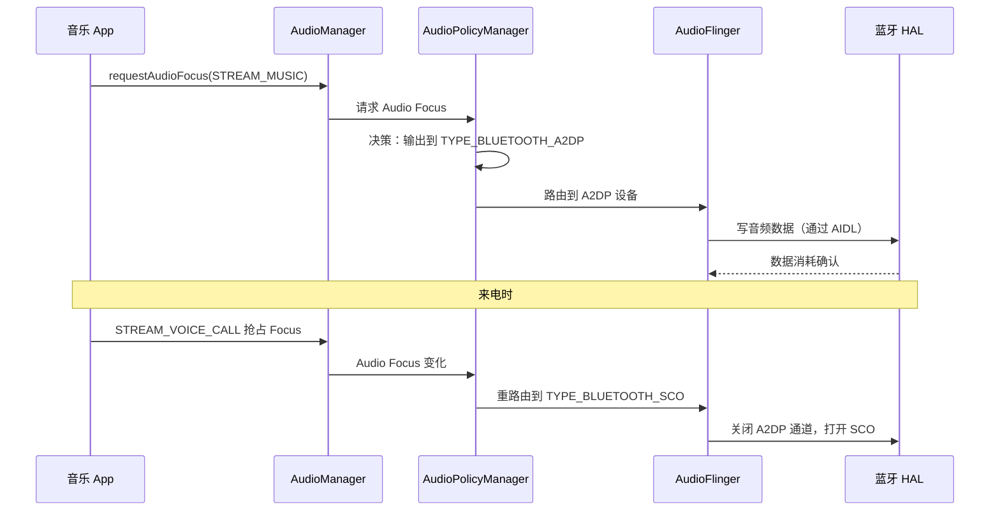

# 16.1 AudioFlinger / AudioPolicyManager / AudioManager 三件套与蓝牙的接合

> **速通摘要**：Android 音频路由由三层共同决定：`AudioManager`（App 层，发请求）→ `AudioPolicyManager`（框架层，决策路由）→ `AudioFlinger`（混音引擎，实际输出）。蓝牙作为一类音频设备，通过 Audio HAL 接口接入这个体系，`BluetoothAudioClientInterface`（`system/audio_hal_interface/`）是蓝牙模块与 Audio HAL 之间的桥梁。

---

## 学习目标

读完本节后，你能：
1. 描述一次音频从 App 到蓝牙耳机的完整路由决策链。
2. 找到 `BluetoothAudioClientInterface` 的源码位置并理解其作用。
3. 解释为什么车机上蓝牙音频路由问题经常在 `AudioPolicyManager` 层爆发。
4. 用 `dumpsys audio` 定位当前活动的蓝牙音频输出设备。

---

## 前置知识

- [06.1 A2DP 架构总览](../06_A2DP与AVRCP/06.1_A2DP架构总览.md) — A2DP 音频传输基础
- [07.3 SCO 音频建立/释放](../07_HFP/07.3_SCO音频建立释放.md) — HFP 音频通路
- [12.1 LE Audio 全景](../12_LE_Audio/12.1_LE_Audio全景.md) — LE Audio 通路

---

## 场景故事

用户在车上边听音乐（A2DP）边接到电话（HFP），手机通话声音从车机扬声器出来，挂掉电话后音乐自动回到蓝牙耳机。这个"自动切换"背后是 Android 音频框架的路由策略在工作：

1. 来电时，`AudioPolicyManager` 检测到 `STREAM_VOICE_CALL` 使用场景变化。
2. 评估输出设备优先级：通话时 HFP SCO > A2DP。
3. 通知 `AudioFlinger` 把音频路由从 A2DP 切换到 SCO 输出设备。
4. 挂断后，再切回 A2DP。

一旦这个过程出错（如切换后 HFP 没有声音，或回不去 A2DP），根因几乎都在这三件套的交互里。

---

## 三件套职责划分

| 组件 | 所在进程 | 核心职责 |
|------|---------|---------|
| `AudioManager` | App 进程 | 请求 Audio Focus，设置音频属性（Stream Type / Usage / Content Type） |
| `AudioPolicyManager` | `mediaserver` / `audioserver` 进程 | 根据策略和设备列表选择最优输出设备，管理设备连接/断开事件 |
| `AudioFlinger` | `audioserver` 进程 | 混音、重采样、实际写数据到 HAL（通过 HIDL/AIDL） |

> 注意：`AudioPolicyManager` 和 `AudioFlinger` 均为**外部依赖**（在 `frameworks/av/` 仓库，非本仓库），此处通过接口边界分析。

---

## 蓝牙在音频框架中的位置

```
App → AudioManager.requestAudioFocus()
         ↓ Binder
      AudioPolicyManager（外部依赖：frameworks/av/services/audiopolicy）
         ↓ 选择输出设备（TYPE_BLUETOOTH_A2DP / TYPE_BLUETOOTH_SCO / TYPE_BLE_HEADSET 等）
         ↓ 通知设备可用/不可用
      AudioFlinger（外部依赖：frameworks/av/services/audioflinger）
         ↓ AIDL / HIDL
      Bluetooth Audio HAL
         ↓ BluetoothAudioClientInterface（本仓库边界）
      ┌──────────────────────────────────────────┐
      │  system/audio_hal_interface/aidl/         │
      │  BluetoothAudioClientInterface:89         │
      │  A2DP / HFP / LE Audio Transport 实现     │
      └──────────────────────────────────────────┘
         ↓
      蓝牙协议栈（BTIF / BTA / Stack）
         ↓
      蓝牙控制器（ACL / CIS / BIS）
```

---

## 源码导读：BluetoothAudioClientInterface

```cpp
// system/audio_hal_interface/aidl/a2dp/client_interface_aidl.h:89
class BluetoothAudioClientInterface {
 public:
  // 开始音频会话（通知 HAL 蓝牙音频路由已激活）
  int StartSession();         // :116

  // 结束音频会话
  int EndSession();           // :123

  // 更新音频配置（如切换编解码器参数）
  bool UpdateAudioConfig(const AudioConfiguration& audioConfig);  // :125

  // 设置允许的延迟模式（Free-running / Low-latency 等）
  bool SetAllowedLatencyModes(...);  // :127
};
```

**三种 Transport 实现**：

| 传输类 | 文件 | 对应场景 |
|--------|------|---------|
| A2DP Transport | `system/audio_hal_interface/aidl/a2dp/` | 经典蓝牙音乐（SBC/AAC/aptX） |
| HFP Transport | `system/audio_hal_interface/aidl/hfp_client_interface_aidl.h:88` | 蓝牙通话（SCO/HFP Offload） |
| LE Audio Transport | `system/audio_hal_interface/aidl/le_audio_software_aidl.h:75` | LE Audio 通话和媒体 |

---

## 设备连接事件流

当蓝牙 A2DP 连接成功后，蓝牙服务会通知 AudioPolicyManager 有新设备可用：

```java
// android/.../a2dp/A2dpService.java:460
public boolean setActiveDevice(@NonNull BluetoothDevice device) {
    // 1. 通知 Native 层（通过 JNI → BTIF）切换活动设备
    mNativeInterface.setActiveDevice(device);  // :512
    // 2. AudioManager.setBluetoothA2dpDeviceConnectionStateSuppressNoisyIntent()
    //    → AudioPolicyManager 更新设备列表 → AudioFlinger 重路由
}
```

---

## Audio Focus 与蓝牙的关系



---

## 调试方法

```bash
# 查看当前音频路由状态（最重要的命令）
adb shell dumpsys audio | grep -A 5 "Output devices\|Bluetooth\|A2DP\|SCO"

# 查看 AudioPolicyManager 的设备列表（外部依赖，但可以从 dumpsys 看结果）
adb shell dumpsys audio | grep -i "available devices\|selected device"

# 查看蓝牙音频 HAL 会话状态
adb logcat -s bt_a2dp_hw:V BluetoothAudio:V | grep -i "StartSession\|EndSession\|UpdateAudioConfig"

# 查看 A2DP 活动设备设置
adb logcat -s A2dpService:V | grep -i "setActiveDevice\|native\|audio"

# 查看音频焦点
adb shell dumpsys audio | grep -A 10 "Audio Focus"
```

---

## FAQ

**Q1：`AudioPolicyManager` 是在哪个进程里的？车机能定制它吗？**
`AudioPolicyManager` 运行在 `audioserver` 进程（`frameworks/av/`，外部依赖）。车机厂商通常通过实现 `AudioPolicyManagerCustomInterface` 或自定义 `AudioPolicyConfiguration.xml` 来定制路由策略，而不是直接修改 AOSP 代码。

**Q2：为什么有时候拔掉蓝牙耳机后手机扬声器没有声音？**
这是 `AudioPolicyManager` 的设备切回逻辑出了问题，通常是 `removeDevice` 事件没有正确触发，导致路由还指向已断开的设备。查看 `adb shell dumpsys audio | grep "Output devices"` 确认当前路由指向。

**Q3：`BluetoothAudioClientInterface` 是 HAL 接口的哪一侧？**
它是蓝牙模块（本仓库）实现的 AIDL Client 侧，对应的 Server 侧在 Bluetooth Audio HAL 进程（`hardware/interfaces/bluetooth/audio/`，AOSP 另一仓库）。两者通过 AIDL Binder 通信。

---

## 上路任务

1. 运行 `adb shell dumpsys audio | grep -A 3 "Output"` 查看当前系统的音频输出设备列表，找到蓝牙相关条目（`TYPE_BLUETOOTH_A2DP` / `TYPE_BLE_HEADSET`）。
2. 打开 `system/audio_hal_interface/aidl/a2dp/client_interface_aidl.h:89`，找到 `BluetoothAudioClientInterface` 的成员变量，了解它持有哪些 Transport 对象和 HAL 接口引用。
3. 在 `android/.../a2dp/A2dpService.java:512` 附近找到 `mNativeInterface.setActiveDevice(device)` 调用，追踪其最终调到哪个 Native 函数（提示：经 JNI → `btif_a2dp_source_start_session`）。
