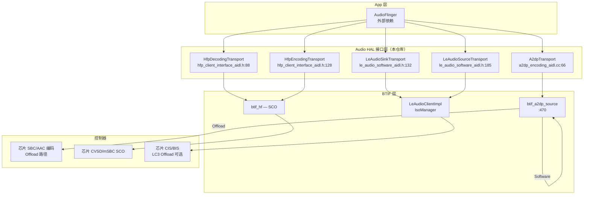

# 16.2 A2DP / HFP / LE Audio 三种 Offload 路径

> **速通摘要**：Android 蓝牙音频有两种处理路径：**软件路径**（CPU 编解码，数据经 `btif` → 协议栈 → 控制器）和 **Offload 路径**（芯片直接处理编解码，CPU 只做控制面）。三种主流场景（A2DP / HFP SCO / LE Audio）各有独立的 Offload 接口实现，都在 `system/audio_hal_interface/aidl/` 下。选对路径直接影响功耗和延迟。

---

## 学习目标

读完本节后，你能：
1. 区分软件路径和 Offload 路径的数据流差异。
2. 找到 A2DP / HFP / LE Audio 各自的 Transport 类实现文件和行号。
3. 理解 `btif_av_is_a2dp_offload_enabled()` 如何决定走哪条路径。
4. 说出 Offload 不可用时的 fallback 机制。

---

## 前置知识

- [16.1 三件套与蓝牙的接合](16.1_AudioFlinger_AudioPolicyManager_AudioManager三件套.md)
- [06.2 A2DP 连接全链路](../06_A2DP与AVRCP/06.2_A2DP连接全链路.md)
- [07.3 SCO 音频建立/释放](../07_HFP/07.3_SCO音频建立释放.md)

---

## 场景故事

车机集成 QualComm 蓝牙芯片，支持 A2DP Offload（芯片内完成 SBC/AAC 编码）。开机后音乐播放功耗 30 mA。但有用户反馈：连接某款耳机后，功耗异常到 80 mA，还有轻微卡顿。

排查发现：该耳机上报的编解码器能力超出了芯片 Offload 支持范围，`btif_a2dp_source` 自动 fallback 到软件路径（CPU 编码），CPU 占用翻倍导致功耗上升。

理解 Offload 路径，就能快速定位这类"编解码路径选错"的功耗/性能问题。

---

## 三种路径对比

| 场景 | 路径类型 | Transport 类 | 文件 |
|------|---------|-------------|------|
| **A2DP（软件）** | CPU 编码 SBC/AAC | `A2dpTransport` | `system/audio_hal_interface/aidl/a2dp/a2dp_encoding_aidl.cc:66` |
| **A2DP（Offload）** | 芯片编码 | 同上，配置不同 | `system/btif/src/btif_a2dp_source.cc:470` |
| **HFP Decoding** | 解码（下行，手机→耳机方向） | `HfpDecodingTransport` | `system/audio_hal_interface/aidl/hfp_client_interface_aidl.h:88` |
| **HFP Encoding** | 编码（上行，耳机→手机方向） | `HfpEncodingTransport` | `system/audio_hal_interface/aidl/hfp_client_interface_aidl.h:128` |
| **LE Audio Sink** | LC3 解码（放音） | `LeAudioSinkTransport` | `system/audio_hal_interface/aidl/le_audio_software_aidl.h:132` |
| **LE Audio Source** | LC3 编码（录音） | `LeAudioSourceTransport` | `system/audio_hal_interface/aidl/le_audio_software_aidl.h:185` |

---

## 分层调用链

### A2DP 软件路径

```
AudioFlinger 写 PCM 数据
    ↓
A2dp Audio HAL（AIDL Server，外部依赖）
    ↓ AIDL
A2dpTransport（system/audio_hal_interface/aidl/a2dp/a2dp_encoding_aidl.cc:66）
    ↓ 回调通知
btif_a2dp_source_start_session_delayed（system/btif/src/btif_a2dp_source.cc:486）
    ↓ 拉取 PCM 数据，用软件编码 SBC/AAC
btif_a2dp_source 编码线程
    ↓
AVDT（AVDTP 协议，传输编码后的 A2DP 帧）
    ↓
HCI ACL
```

### A2DP Offload 路径

```
AudioFlinger 写 PCM 数据
    ↓
A2dp Audio HAL（AIDL Server）
    ↓ 直接传给芯片
Bluetooth 控制器（芯片内完成 SBC/AAC 编码）
    ↓ 已编码数据通过 HCI ACL 发出
```

**开关判断（A2DP）**：

```cpp
// system/btif/src/btif_av.cc:433
bool A2dpOffloadEnabled() const { return a2dp_offload_enabled_; }

// :1150
a2dp_offload_enabled_ =
    GetInterfaceToProfiles()->config->isA2DPOffloadEnabled();
```

### HFP Offload 路径

```
mic 数据（上行）→ HfpEncodingTransport（:128）→ HAL → 芯片 SCO 编码
耳机数据（下行）→ HfpDecodingTransport（:88）→ HAL → AudioFlinger → 扬声器
```

**软件/Offload 切换**：

```cpp
// system/audio_hal_interface/aidl/hfp_client_interface_aidl.h:120
class HfpDecodingTransport {
  // 两套 HAL 接口，一套软件，一套 Offload
  static inline BluetoothAudioSourceClientInterface* software_hal_interface   = nullptr;
  static inline BluetoothAudioSourceClientInterface* offloading_hal_interface = nullptr;
  static inline BluetoothAudioSourceClientInterface* active_hal_interface     = nullptr;
  // 连接时根据 HAL 能力选 active_hal_interface
};
```

### LE Audio 路径

```
LC3 编码（软件路径）：
AudioFlinger PCM → LeAudioSinkTransport（:132）→ LC3 软件编码 → ISO 数据
                                                                       ↓
芯片直接发到 CIS（Unicast）或 BIS（Broadcast）

LC3 Offload 路径：
AudioFlinger PCM → LeAudioSinkTransport → HAL → 芯片内 LC3 编码 → CIS/BIS
```

---

## 源码导读

### btif_a2dp_source_start_session（关键入口）

```cpp
// system/btif/src/btif_a2dp_source.cc:470
bool btif_a2dp_source_start_session(const RawAddress& peer_address,
                                    std::promise<void> peer_ready_promise) {
  // 投递到主线程执行
  do_in_main_thread(base::BindOnce(
      &btif_a2dp_source_start_session_delayed, peer_address,
      std::move(peer_ready_promise)));
  return true;
}

// :486（延迟执行实际初始化）
static void btif_a2dp_source_start_session_delayed(
    const RawAddress& peer_address, std::promise<void> peer_ready_promise) {
  bool offload = btif_av_is_a2dp_offload_enabled();
  if (offload) {
    // 用 BluetoothAudioClientInterface 的 offload 模式 StartSession()
  } else {
    // 用软件 codec 路径，启动 btif_a2dp_source 编码线程
  }
}
```

### LeAudioSinkTransport（LE Audio 核心路径）

```cpp
// system/audio_hal_interface/aidl/le_audio_software_aidl.h:132
class LeAudioSinkTransport
    : public ::bluetooth::audio::aidl::IBluetoothSinkTransportInstance {
  // 从 AudioFlinger 接收 PCM 数据
  // 压入 LE Audio 数据管道（最终发到 ISO 通道）
  virtual void SetPendingCmd(const StreamCallbacks::GetPendingCmd& func) = 0;
};

// :185
class LeAudioSourceTransport
    : public ::bluetooth::audio::aidl::IBluetoothSourceTransportInstance {
  // 麦克风数据（上行，CIS Source → AudioFlinger）
};
```

---

## 三种路径架构图



---

## 调试方法

```bash
# 查看 A2DP Offload 是否开启
adb logcat -s btif_av:V | grep -i "offload"
# 或
adb shell getprop persist.bluetooth.a2dp_offload.disabled

# 查看当前 A2DP 使用软件还是 Offload 路径
adb logcat -s btif_a2dp_source:V | grep -i "start_session\|offload\|software"

# 查看 HFP Transport 初始化
adb logcat -s BluetoothAudio:V | grep -i "hfp\|StartSession\|EndSession"

# 查看 LE Audio Transport
adb logcat -s LeAudioSinkTransport:V LeAudioSourceTransport:V

# 查看整体 HAL 会话状态
adb shell dumpsys bluetooth_manager | grep -i "audio_hal\|transport\|offload"
```

---

## FAQ

**Q1：A2DP Offload 需要什么前提？**
需要：① 蓝牙控制器支持 A2DP Offload；② `persist.bluetooth.a2dp_offload.disabled` 属性为 `false`（或不设置）；③ 当前连接的耳机使用的编解码器在芯片支持的 Offload 编解码器列表中。

**Q2：HFP 的 Offload 和软件路径区别在哪儿？**
HFP 软件路径：Android 做 CVSD/mSBC 的编解码，数据经 RFCOMM/HCI SCO 通道传；Offload 路径：芯片直接处理 SCO 数据，延迟更低、CPU 占用更小，但需要 Audio HAL 明确支持。

**Q3：LE Audio 的 LC3 能 Offload 吗？**
目前（Android 16）大多数场景用软件 LC3，但 `LeAudioSinkTransport` 设计上预留了 Offload 路径（通过 `provider_info.cc` 查询 HAL 能力决定）。具体支持情况取决于芯片厂商的 Audio HAL 实现。

---

## 上路任务

1. 打开 `system/btif/src/btif_av.cc:1150`，找到 `isA2DPOffloadEnabled()` 的实现，理解它最终读取的是哪个系统属性或配置。
2. 对比 `system/audio_hal_interface/aidl/hfp_client_interface_aidl.h:88` 的 `HfpDecodingTransport` 和 `:128` 的 `HfpEncodingTransport`，找出两者在 `GetPendingCmd` 实现上的区别，理解上行（麦克风）和下行（扬声器）数据流的不同处理方式。
3. 运行 `adb shell getprop persist.bluetooth.a2dp_offload.disabled`，确认当前设备的 A2DP 路径，再连接一个 A2DP 耳机播放音乐，用 `adb logcat -s btif_a2dp_source:V` 验证走的是 Offload 还是软件路径。
