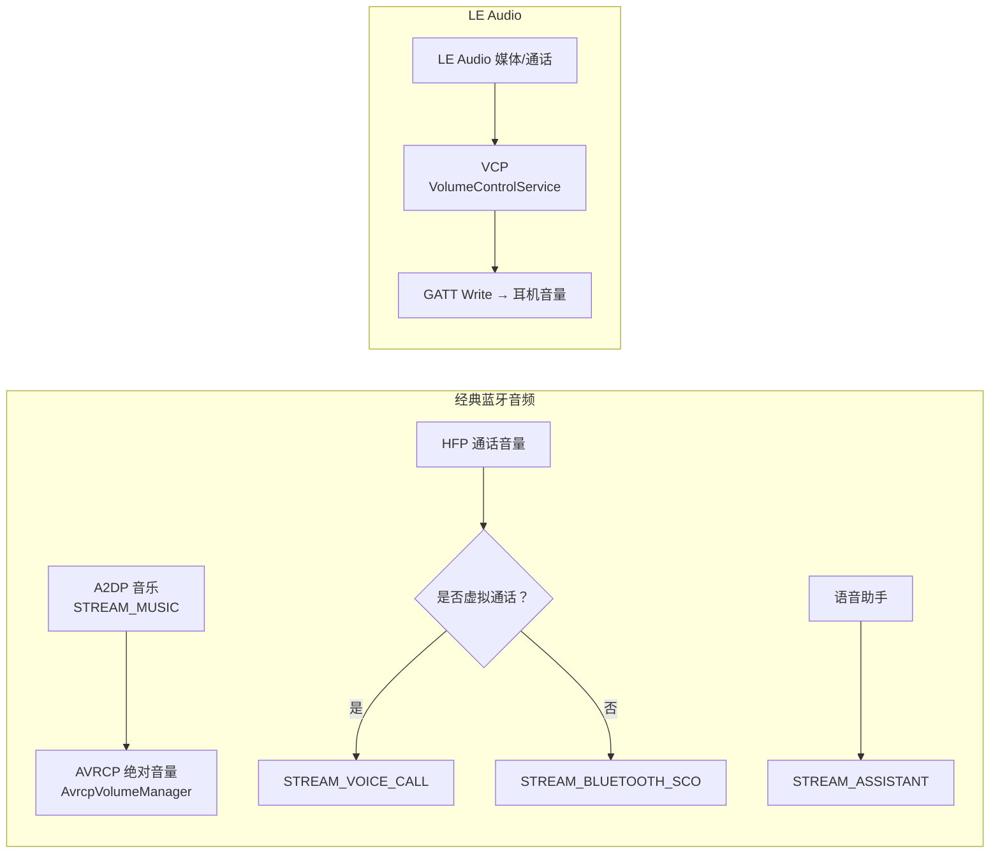

# 16.3 STREAM_MUSIC / STREAM_BLUETOOTH_SCO / STREAM_VOICE_CALL 类型与音量

> **速通摘要**：Android 音量控制以 Stream Type 为单元，不同的蓝牙场景用不同的 Stream：A2DP 音乐走 `STREAM_MUSIC`，HFP 通话走 `STREAM_VOICE_CALL`（有时是 `STREAM_BLUETOOTH_SCO`），LE Audio 音量则通过 VCP Profile 走 `VolumeControlService`。车机工程师经常因为 Stream Type 选错导致"音量条对不上"或"音量无法调节"。

---

## 学习目标

读完本节后，你能：
1. 区分 `STREAM_MUSIC` / `STREAM_BLUETOOTH_SCO` / `STREAM_VOICE_CALL` 的适用场景。
2. 找到 HFP 音量控制中 Stream Type 选择逻辑的源码位置。
3. 理解 AVRCP 绝对音量与 `STREAM_MUSIC` 的关系。
4. 用 `dumpsys audio` 定位音量类型异常。

---

## 前置知识

- [16.1 三件套与蓝牙的接合](16.1_AudioFlinger_AudioPolicyManager_AudioManager三件套.md)
- [06.4 绝对音量同步原理与坑点](../06_A2DP与AVRCP/06.4_绝对音量同步.md)
- [07.4 通话状态同步](../07_HFP/07.4_通话状态同步.md)

---

## 场景故事

车机厂商反馈："用户用蓝牙通话时，音量条显示的是媒体音量（STREAM_MUSIC），调节音量只改变了音乐音量，不影响通话音量。"

根因：`AudioPolicyManager` 在通话状态下应该把音量条绑定到 `STREAM_VOICE_CALL`，但车机厂商的 OEM 音量策略文件配置错误，导致 Stream Type 选错。

理解 Stream Type，就能快速定位车机上这类"调音量没用"的问题。

---

## Stream Type 对照表

| Stream Type | 值 | 蓝牙场景 | 受控组件 |
|-------------|-----|---------|---------|
| `STREAM_MUSIC` | 3 | A2DP 媒体播放 | AVRCP 绝对音量、`AvrcpVolumeManager` |
| `STREAM_VOICE_CALL` | 0 | HFP 通话（主线路） | `HeadsetService.java:260` |
| `STREAM_BLUETOOTH_SCO` | 6 | HFP 蓝牙 SCO（独立控制） | `HeadsetService.java:504` |
| `STREAM_ASSISTANT` | 10 | 语音助手（车机常用） | `HeadsetService.java:266` |

---

## 源码定位

### A2DP：STREAM_MUSIC 与 AVRCP 绝对音量

```java
// android/.../avrcp/AvrcpVolumeManager.java:186
mDeviceMaxVolume = mAudioManager.getStreamMaxVolume(AudioManager.STREAM_MUSIC);
// AVRCP 绝对音量（0-127）映射到 STREAM_MUSIC 的本地音量范围

// :298
AudioManager.STREAM_MUSIC, // 最终写的目标 Stream
```

```java
// android/.../avrcpcontroller/AvrcpControllerStateMachine.java:1180
int maxLocalVolume = mAudioManager.getStreamMaxVolume(AudioManager.STREAM_MUSIC);
int curLocalVolume = mAudioManager.getStreamVolume(AudioManager.STREAM_MUSIC);
// 把远端 AVRCP 音量换算成本地 STREAM_MUSIC 音量值
```

### HFP：STREAM_BLUETOOTH_SCO vs STREAM_VOICE_CALL

```java
// android/.../hfp/HeadsetService.java:504
int volStream = AudioManager.STREAM_BLUETOOTH_SCO;
// :506
if (isScoUsingVirtualVoiceCall) {
    volStream = AudioManager.STREAM_VOICE_CALL;
}
// HFP 音量：
// - 如果是"虚拟语音通话"模式（如 Google Assistant），用 STREAM_VOICE_CALL
// - 否则用 STREAM_BLUETOOTH_SCO

// :260（服务初始化时注册支持的音量流）
new VolumeInfo.Builder(AudioManager.STREAM_VOICE_CALL)
    .setMaxVolumeIndex(audioManager.getStreamMaxVolume(AudioManager.STREAM_VOICE_CALL))
    .build()

// :266
new VolumeInfo.Builder(AudioManager.STREAM_ASSISTANT)
    .setMaxVolumeIndex(audioManager.getStreamMaxVolume(AudioManager.STREAM_ASSISTANT))
    .build()
```

### LE Audio：VCP 替代 Stream 音量

LE Audio 场景不走 `STREAM_*` 直接调音量，而是通过 `VolumeControlService` 发 GATT Write 给耳机：

```java
// android/.../vc/VolumeControlService.java:79
// setGroupVolume(groupId, volume) — 统一调节整个 CSIP 设备组的音量
// 与 STREAM_MUSIC 的映射由 ActiveDeviceManager 协调
```

---

## 音量类型关系图



---

## 常见坑点

### 坑 1：调音量没反应（车机通话场景）

**现象**：通话时推音量键，音量条变化但通话音量不变。

**定位**：
```bash
adb logcat -s HeadsetService:V | grep -i "volume\|STREAM"
# 检查 volStream 用的是 STREAM_BLUETOOTH_SCO 还是 STREAM_VOICE_CALL
# 和系统当前音量策略是否匹配
```

### 坑 2：挂断通话后 STREAM_BLUETOOTH_SCO 残留

**现象**：通话结束后，音量条还是 SCO 档，媒体音量调不了。

**定位**：
```bash
adb shell dumpsys audio | grep -i "stream\|mode\|focus"
# 确认 AudioMode 是否已从 MODE_IN_COMMUNICATION 恢复到 MODE_NORMAL
```

### 坑 3：AVRCP 绝对音量失效

**现象**：`setStreamVolume(STREAM_MUSIC, ...)` 发出但耳机音量不变。

**定位**：
```bash
adb logcat -s AvrcpVolumeManager:V | grep -i "volumeChanged\|setAbsVolume\|nativeIsDeviceSilenced"
# 确认 AVRCP 绝对音量回调已正确注册
```

---

## 调试方法

```bash
# 查看当前所有 Stream 的音量状态
adb shell dumpsys audio | grep -A 3 "Stream Volume\|STREAM"

# 查看 HFP 音量控制逻辑
adb logcat -s HeadsetService:V | grep -i "volume\|stream\|sco"

# 查看 AVRCP 绝对音量映射
adb logcat -s AvrcpVolumeManager:V AvrcpTargetService:V

# 查看当前 Audio Mode
adb shell dumpsys audio | grep "Audio mode"
# MODE_NORMAL=0 / MODE_IN_CALL=2 / MODE_IN_COMMUNICATION=3

# 查看 LE Audio 音量控制
adb logcat -s VolumeControlService:V | grep -i "volume\|group"
```

---

## FAQ

**Q1：`STREAM_BLUETOOTH_SCO` 和 `STREAM_VOICE_CALL` 有什么本质区别？**
`STREAM_VOICE_CALL` 是系统级的通话流，与 Telecom 框架联动，受 AudioFocus 优先级最高保护；`STREAM_BLUETOOTH_SCO` 是专门给蓝牙 SCO 场景设计的流，有独立的音量级别，优先级略低。实践中：运营商电话走 `STREAM_VOICE_CALL`，VoIP/语音助手走 `STREAM_BLUETOOTH_SCO`。

**Q2：车机为什么要把语音助手音量（STREAM_ASSISTANT）单独注册？**
STREAM_ASSISTANT 允许语音助手有独立的音量调节，不干扰正在播放的音乐（STREAM_MUSIC）。`HeadsetService` 注册它是为了让语音助手触发 HFP 连接时使用正确的音量通道（`HeadsetService.java:266`）。

**Q3：LE Audio 设备切换为 VCP 后，物理音量键还有效吗？**
有效，但需要 `ActiveDeviceManager` 在 LE Audio 活动时把音量键事件的 Stream Type 映射到 VCP 调节。如果没有正确配置，音量键只改本地 `STREAM_MUSIC` 的软件音量，不真正控制耳机硬件音量。

---

## 上路任务

1. 打开 `android/.../hfp/HeadsetService.java:504`，找到 `isScoUsingVirtualVoiceCall` 的赋值逻辑，弄清楚什么条件下会选 `STREAM_VOICE_CALL`，什么条件下选 `STREAM_BLUETOOTH_SCO`。
2. 在 `android/.../avrcpcontroller/AvrcpControllerStateMachine.java:1200` 找到 `setStreamVolume` 调用，理解 AVRCP Controller 如何把远端音量值映射到本地 `STREAM_MUSIC` 音量范围。
3. 连接 A2DP 耳机，用 `adb shell dumpsys audio | grep -A 5 "STREAM_MUSIC"` 查看当前 STREAM_MUSIC 的音量值，然后调节耳机音量，再次查看是否变化。
