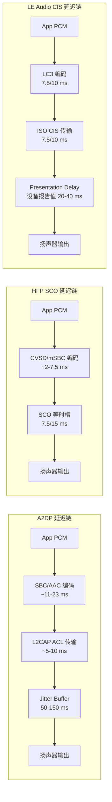

# 16.4 音频延迟（A2DP buffer / HFP SCO / LE Audio Presentation Delay）

> **速通摘要**：车机蓝牙音频延迟由三部分叠加：编解码时间 + 传输时间 + 对端缓冲时间。A2DP 典型延迟 100–200 ms（Jitter Buffer 为主），HFP SCO 最快约 7.5–30 ms，LE Audio CIS 可达 < 40 ms。车机工程师需要理解每个场景的延迟来源，才能正确调整音视频同步（A/V Sync）和回声消除参数。

---

## 学习目标

读完本节后，你能：
1. 解释 A2DP 延迟为什么比 HFP SCO 高一个数量级。
2. 找到 LE Audio Presentation Delay 的源码位置并理解其含义。
3. 理解 SCO 的 7.5 ms / 15 ms 发包间隔与延迟的关系。
4. 用 `dumpsys bluetooth_manager` 查看当前 LE Audio Presentation Delay。

---

## 前置知识

- [12.3 CIS / BIS / ISO Channel](../12_LE_Audio/12.3_CIS_BIS_ISO通道.md) — ISO 等时传输
- [07.3 SCO 音频建立/释放](../07_HFP/07.3_SCO音频建立释放.md) — HFP SCO 通道
- [16.2 三种 Offload 路径](16.2_A2DP_HFP_LEAudio三种Offload路径.md) — 编解码路径选择

---

## 场景故事

车机视频通话（HFP）时嘴唇动作和声音有明显不同步，延迟约 200 ms。工程师发现音频走的是 A2DP 路径而不是 HFP SCO——UI 上选择了蓝牙音乐耳机作为通话设备，导致通话音频错走了延迟更高的 A2DP 路径。

修复方案：确保通话场景强制切换到 HFP SCO 路径（`AudioPolicyManager` 策略调整）。

理解各路径的延迟来源，是准确判断"延迟高不高"和"走没走对路径"的前提。

---

## 三种路径延迟来源对比

| 路径 | 典型端到端延迟 | 主要来源 |
|------|------------|---------|
| **A2DP（SBC）** | 100–250 ms | Jitter Buffer（50–150 ms）+ SBC 编码（~11 ms/帧）+ A2DP 帧队列 |
| **A2DP（AAC/aptX）** | 120–200 ms | 编码帧时长更长（AAC ~23 ms）+ Jitter Buffer |
| **HFP SCO（CVSD）** | 15–30 ms | SCO 发包间隔（7.5 ms 或 15 ms）× 缓冲窗口 |
| **HFP SCO（mSBC）** | 7.5–15 ms | mSBC 7.5 ms 帧 + 单帧缓冲 |
| **LE Audio CIS（LC3）** | 20–40 ms | ISO Interval（7.5/10 ms）+ Presentation Delay（设备报告值） |
| **LE Audio BIS** | 40–100 ms | BIG 广播延迟（无 ACK 补偿）+ Presentation Delay |

---

## A2DP 延迟：Jitter Buffer 是主犯

A2DP 走 L2CAP 连接，底层是 Best Effort（不保时），因此接收端需要 **Jitter Buffer** 来平滑网络抖动。Jitter Buffer 越大，延迟越高，但抗抖动越好。

车机侧（A2DP Sink）：Jitter Buffer 在音频 HAL / AudioFlinger 层（外部依赖），典型默认 50–150 ms，可通过 Audio Policy 配置调小。

---

## HFP SCO 延迟：发包间隔决定

SCO 用等时槽（每隔固定时间发包），CVSD 默认 2 ms 发包间隔（但实际 7.5–15 ms 算上往返），mSBC 为 7.5 ms 帧时长。

关键：SCO 没有 Jitter Buffer，天生低延迟，但对 BLE 干扰敏感。

---

## LE Audio Presentation Delay：设备自报告

LE Audio 引入 **Presentation Delay** 机制：设备在 QoS 协商时上报自己能接受的播放延迟范围（`PreferredPresentationDelayMin / Max`），车机按此设置 ISO 通道的 `Transport_Delay`，确保所有设备在同一时刻播放。

### 源码位置

```cpp
// system/bta/le_audio/device_groups.cc:831
bool LeAudioDeviceGroup::GetPresentationDelay(
    uint32_t* delay, uint8_t direction) const {
  // 遍历设备组所有成员，取最大的 preferred delay 作为公共 delay
  // 确保左右耳同步
}

// :881
uint32_t presentation_delay;
// :892
remote_delay_ms = presentation_delay / 1000;  // 单位从微秒换算到毫秒

// :2695
GetPresentationDelay(&sink_delay, kLeAudioDirectionSink);    // 放音延迟
GetPresentationDelay(&source_delay, kLeAudioDirectionSource); // 录音延迟
```

**Broadcast Presentation Delay**：

```cpp
// system/bta/le_audio/broadcaster/broadcaster.cc:203
announcement.presentation_delay_us = 40000; /* us */
// Broadcast 场景默认 40 ms 呈现延迟
```

---

## 延迟测量与分析图



---

## 调试方法

```bash
# 查看 LE Audio Presentation Delay（微秒）
adb shell dumpsys bluetooth_manager | grep -i "presentation_delay"
# 输出示例：presentation_delay for sink (speaker): 20000 us

# 查看当前 LE Audio 组的延迟设置
adb logcat -s LeAudioDeviceGroup:V | grep -i "delay\|presentation"

# 查看 A2DP Jitter Buffer 延迟（需要 audio dumpsys）
adb shell dumpsys audio | grep -i "jitter\|latency\|delay" | head -20

# 查看 HFP SCO 帧时长（btsnoop）
# 在 Wireshark 过滤 HCI_SYNCHRONOUS_CONN_COMPLETE 事件
# 查看 Tx/Rx Packet Type 字段（HV3=CVSD 3 slots, EV3=eSCO CVSD, T2=mSBC eSCO）

# 测量实际延迟（比较视频帧和音频包时间戳）
adb shell dumpsys media.audio_flinger | grep -i "latency"
```

---

## 常见调优建议

| 场景 | 问题 | 调优方向 |
|------|------|---------|
| A2DP 音视频不同步 | Jitter Buffer 过大 | 减小 AudioFlinger 输出延迟（Audio Policy XML 配置） |
| HFP 通话有回声 | SCO 延迟 > AEC 窗口 | 确认走 mSBC 而非 CVSD（更短帧时长），或增大 AEC 缓冲 |
| LE Audio 左右耳不同步 | Presentation Delay 不一致 | 检查 `GetPresentationDelay` 取最大值逻辑，确认 CSIP 组内所有设备上报相同 delay |
| LE Audio Broadcast 延迟高 | BIG Transport Delay 过大 | 调整 `presentation_delay_us`（`broadcaster.cc:203`），协商更短的 Presentation Delay |

---

## FAQ

**Q1：车机做 A2DP Sink 时能控制 Jitter Buffer 大小吗？**
可以，通过 `AudioPolicyConfiguration.xml` 里的 `attached_input_sources`/`attached_output_devices` 中的延迟参数，或 HAL 实现中的缓冲区大小配置。但改动需要谨慎——缓冲过小会导致爆音。

**Q2：LE Audio Presentation Delay 是固定的吗？**
不是。每次 QoS 协商时，`LeAudioDeviceGroup::GetPresentationDelay()` 会取设备组内所有成员的 `PreferredPresentationDelayMax` 的最大值，所以接一个延迟高的耳机会拉高整组的延迟。

**Q3：为什么 HFP 通话延迟有时会突然变大？**
HFP SCO 走 2.4 GHz 频段，当 Wi-Fi 和蓝牙共存时会出现频段竞争，导致 SCO 包重传，实际延迟从 7.5 ms 增加到 30–100 ms。用 `btsnoop` 看 SCO 包的重传次数可以确认。

---

## 上路任务

1. 打开 `system/bta/le_audio/device_groups.cc:831`，阅读 `GetPresentationDelay` 的实现，找出它如何从设备组内多个设备中选出最终延迟值（取最大值还是最小值？为什么？）。
2. 打开 `system/bta/le_audio/broadcaster/broadcaster.cc:203`，找到 `presentation_delay_us = 40000` 这一行，确认其注释，理解为什么 Broadcast 场景默认选 40 ms 而不是更低的值。
3. 连接 A2DP 耳机和 HFP 耳机，分别播放一段视频，用手机摄像机录下视频，目测音视频同步差距——通常 A2DP 明显滞后。用 `adb shell dumpsys audio | grep latency` 找出两者的报告延迟数值。
