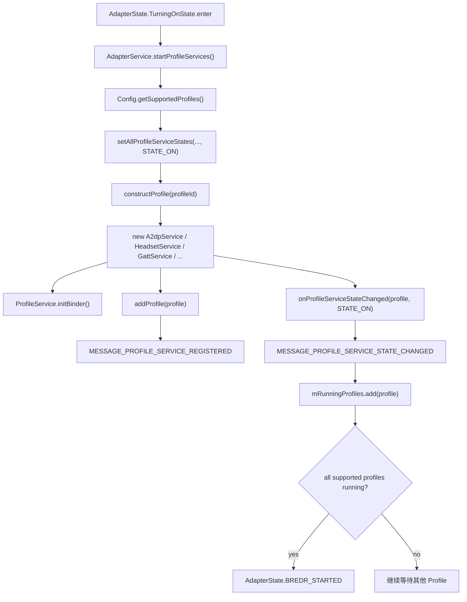
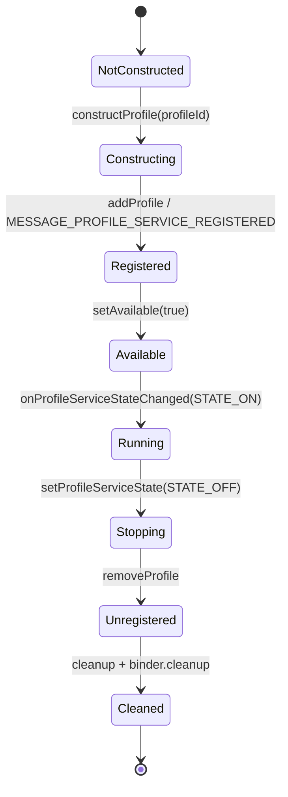

# 17-定向代码阅读报告：Profile Service 生命周期

## 1. 阅读目标

本报告聚焦蓝牙 Profile Service 的启动、停止、注册、运行态聚合、Binder 暴露、状态回调和 dumpsys 输出。Profile 是车载蓝牙定制最常改的区域：A2DP、HFP、AVRCP、PBAP、MAP、PAN、GATT、LE Audio 等都以 `ProfileService` 为共同抽象。

读完后要能定位：

- 蓝牙已到 `STATE_BLE_ON`，但一直进不了 `STATE_ON`。
- 某个 Profile 没有启动、启动顺序不对、Binder 不可用。
- 关闭蓝牙时 Profile 没停干净，导致回连、音频或电话状态残留。
- 车厂新增/裁剪 Profile 后，启动依赖、资源开关和 dumpsys 不一致。

## 2. 适用场景

- A2DP/HFP/AVRCP 服务没有随蓝牙打开而启动。
- PBAP/MAP/PAN/GATT 服务定制后，Binder 可见但业务不可用。
- LE Audio、TBS、MCP、VAPS 等新 Profile 与 GATT 依赖关系异常。
- 车机要裁剪不用的 Profile，或根据车型动态开关某些 Profile。
- `dumpsys bluetooth` 中 Profile 状态与用户看到的连接状态不一致。

## 3. 调用链全景图



关闭链路相反：`AdapterState.TurningOffState.enter()` -> `AdapterService.stopProfileServices()` -> `setProfileServiceState(..., STATE_OFF)` -> `profile.cleanup()` / binder cleanup -> 所有 Profile 停止后发送 `BREDR_STOPPED`。

## 4. 关键类与源码入口

| 层级 | 源码 | 关键入口 |
| --- | --- | --- |
| Profile 基类 | `android/app/src/com/android/bluetooth/btservice/ProfileService.java` | `initBinder()`、`cleanup()`、`setAvailable(...)`、`dump(...)`、`IProfileServiceBinder.cleanup()` |
| Profile 配置 | `android/app/src/com/android/bluetooth/btservice/Config.java` | `PROFILE_SERVICES_AND_FLAGS`、`init(...)`、`getSupportedProfiles()`、`setProfileEnabled(...)` |
| 启停总控 | `android/app/src/com/android/bluetooth/btservice/AdapterService.java` | `startProfileServices()`、`stopProfileServices()`、`setAllProfileServiceStates(...)`、`constructProfile(...)`、`setProfileServiceState(...)` |
| 注册与运行态 | `AdapterService.java` | `mRegisteredProfiles`、`mRunningProfiles`、`addProfile(...)`、`removeProfile(...)`、`processProfileServiceStateChanged(...)` |
| Adapter 状态机 | `android/app/src/com/android/bluetooth/btservice/AdapterState.java` | `TurningOnState.enter()`、`TurningOffState.enter()`、`BREDR_STARTED`、`BREDR_STOPPED` |
| Binder 示例 | `android/app/src/com/android/bluetooth/a2dp/A2dpServiceBinder.java`、`hfp/HeadsetServiceBinder.java`、`gatt/GattServiceBinder.java` | 每个 Profile 对外暴露自己的 AIDL/Binder |
| 策略服务 | `android/app/src/com/android/bluetooth/btservice/PhonePolicy.java`、`ActiveDeviceManager.java` | 蓝牙 `STATE_ON` 后处理自动连接、active device、连接策略 |
| dumpsys | `AdapterService.java` 与各 Profile `dump(...)` | `dumpsys bluetooth` 中 Profile 段落 |

## 5. 生命周期详解



启动细节：

- `Config.init(...)` 会根据资源开关、sysprop、平台类型调整 Profile 支持状态。
- `Config.PROFILE_SERVICES_AND_FLAGS` 的顺序有依赖意义，`GattService` 被放在前面，注释明确说明部分 Profile 构造时依赖 GATT。
- `AdapterService.startProfileServices()` 获取 `Config.getSupportedProfiles()`，逐个调用 `setProfileServiceState(profileId, STATE_ON)`。
- `setProfileServiceState(..., STATE_ON)` 构造 Profile、加入 `mStartedProfiles`、调用 `addProfile(...)`、设置 available，再发 `STATE_ON`。
- `processProfileServiceStateChanged(...)` 把 Profile 放入 `mRunningProfiles`，当已注册和已运行数量都等于 supported profile 数量时，发送 `AdapterState.BREDR_STARTED`。

停止细节：

- `stopProfileServices()` 会先 `cancelDiscovery()`，并把 scan mode 设为 none。
- 每个 Profile 停止时先 `setAvailable(false)`，再通知 `STATE_OFF`，随后 `removeProfile(...)`、`profile.cleanup()`、`binder.cleanup()`。
- 当 `mRunningProfiles` 清空，或只剩特殊处理的 GATT 时，发送 `AdapterState.BREDR_STOPPED`。

## 6. 线程模型与回调分发

| 线程/队列 | 负责内容 | 排查意义 |
| --- | --- | --- |
| `AdapterState` 状态机线程 | 进入 `TurningOnState` / `TurningOffState` 并触发 Profile 启停 | 判断是否已进入 Profile 阶段 |
| `AdapterService` Handler | 处理 `MESSAGE_PROFILE_SERVICE_REGISTERED`、`MESSAGE_PROFILE_SERVICE_STATE_CHANGED` | `mRegisteredProfiles` 和 `mRunningProfiles` 的真实更新发生在这里 |
| Profile 内部 Handler/StateMachine | A2DP、HFP、AVRCP、GATT 等各自业务状态 | 某 Profile 卡住通常要进对应模块继续查 |
| Binder 线程池 | App 通过 Profile Binder 调用连接、查询、设置策略 | Binder 可用不等于 Profile running，要看 `isAvailable()` 和 Adapter 状态 |
| 回调 Executor/Handler | 如 `registerBluetoothStateCallback(...)`、连接状态 callback | active device、PhonePolicy 等策略可能在 Adapter ON 后继续调度 |

易错点：`setProfileServiceState()` 中构造 Profile 是同步的，但注册与运行态更新通过 `AdapterService` Handler 消息聚合；看日志时要按时间线串起来，不要只看构造成功。

## 7. 权限检查点与 Binder 边界

Profile Service 生命周期本身主要由蓝牙进程内部驱动，对外 Binder 调用才进行权限检查：

- `AdapterServiceBinder.getSupportedProfiles(...)` 会返回 `Config.getSupportedProfiles()`。
- A2DP/HFP/GATT/PBAP/MAP 等各自 Binder 类通常先取 service，再做 `Utils.checkConnectPermissionForDataDelivery(...)` 或相关权限校验。
- Profile `isAvailable()` 常用于判断 service 是否处于可用状态；定制 Binder 时不要绕过该判断。
- App 侧通过 `BluetoothAdapter.getProfileProxy(...)` 看到 proxy，不代表底层连接能力已经 ready；仍要结合 Adapter 状态和 Profile service 状态。

定制建议：新增 Profile Binder 时，权限检查、调用方 attribution、空 service 处理和 `cleanup()` 后拒绝调用都要与现有 Binder 风格一致。

## 8. 依赖顺序与裁剪规则

`Config.PROFILE_SERVICES_AND_FLAGS` 是 Profile 生命周期的总开关表，包含：

- GATT、A2DP、A2DP Sink、AVRCP Target/Controller。
- Bass Client、Battery、CSIP、HAP、HFP AG/Client、Hearing Aid。
- HID Device/Host、TBS、MAP/MAP Client、MCP、OPP、PAN、PBAP/PBAP Client、SAP。
- Volume Control、LE Audio、LE Audio Broadcast、VAPS。

裁剪时必须遵守：

- 不要随意调整启动顺序，尤其是 GATT 与依赖 GATT 的 TBS/MCP/VAPS 等。
- 车机裁剪 ASHA、LE Audio、MAP/PBAP 时，要同时检查资源开关、sysprop、Settings UI、连接策略和测试用例。
- 如果只裁剪 Java Profile 但 native/profile policy 仍认为支持，会出现 UI 可见、SDP/UUID 不一致或自动连接异常。
- 如果启用新的 LE Audio 组合，要同时看 `setLeAudioProfileStatus(...)` 和 `setLeAudioBroadcastProfileStatus(...)`。

## 9. 可能失败点

| 现象 | 可能原因 | 观察点 |
| --- | --- | --- |
| 进不了 `STATE_ON` | 某个 supported Profile 未注册或未运行 | `mRegisteredProfiles`、`mRunningProfiles`、`processProfileServiceStateChanged` |
| 某 Profile Binder 返回空 | Profile 未构造、已 cleanup、`isAvailable=false` | 对应 `*ServiceBinder.getService()` 和 Adapter 状态 |
| 关闭蓝牙卡住 | Profile stop 未发 `STATE_OFF`，或 cleanup 阻塞 | `stopProfileServices()`、对应 Profile cleanup log |
| GATT 相关 Profile 崩溃 | 启动顺序破坏，构造时 `mGattService` 为空 | `Config.PROFILE_SERVICES_AND_FLAGS` 顺序 |
| 车机裁剪后仍自动连接 | `PhonePolicy`、数据库连接策略、Profile support 不一致 | `PhonePolicy`、`DatabaseManager`、`Config.getSupportedProfiles()` |
| dumpsys 显示 running 但业务不可用 | Profile running 只代表服务层已启动，设备连接状态另有状态机 | 进入 A2DP/HFP/GATT 自身 state machine |

## 10. dumpsys / logcat / bugreport 观察点

常用命令：

```bash
adb shell dumpsys bluetooth
adb shell dumpsys bluetooth_manager
adb logcat -b all -v threadtime | grep -E "AdapterService|ProfileService|A2dpService|HeadsetService|GattService|PhonePolicy|ActiveDeviceManager"
```

观察顺序：

1. `AdapterState` 是否从 `TurningOn` 到 `On`。
2. `AdapterService.startProfileServices()` 是否出现。
3. `Config.init` 是否打印目标 Profile enabled。
4. 每个 `setProfileServiceState(profile, STATE_ON)` 是否 completed。
5. 是否出现 `BREDR_STARTED`。
6. `dumpsys bluetooth` 中 `Profile:` 段落是否包含目标 Profile。
7. 如果是连接问题，再进入对应 Profile 的 connection state / native log。

## 11. 定制修改思路

### 11.1 裁剪某个 Profile

推荐路径：

- 优先通过资源开关、feature flag 或 sysprop 影响 `isEnabled()` / `Config.init(...)`。
- 同步调整 Settings UI、自动连接策略、测试配置和产品需求文档。
- 验证 `getSupportedProfiles()`、`dumpsys bluetooth`、SDP/UUID、自动回连行为。

涉及文件：`Config.java`、对应 `*Service.java`、Settings/车厂配置、`PhonePolicy.java`。

### 11.2 新增车厂自定义 Profile

关键步骤：

- 定义 Profile ID 或内部服务标识，明确是否要暴露给 App。
- 新建继承 `ProfileService` 的服务类，实现 `initBinder()`、`cleanup()`、`dump()`。
- 在 `constructProfile(...)` 增加构造分支，在 `Config.PROFILE_SERVICES_AND_FLAGS` 加入开关。
- 如果依赖 GATT 或某个 Profile，放在依赖之后，并在构造函数中做空值保护。
- 在 `dumpsys bluetooth` 输出状态，便于量产排查。

涉及文件：`ProfileService.java`、`Config.java`、`AdapterService.java`、自定义 `*Service` / `*ServiceBinder`。

### 11.3 Profile 启动耗时诊断

可在现有 `setProfileServiceState(...) completed in Xms` 基础上增强：

- 为每次蓝牙 enable 生成 requestId。
- 输出每个 Profile 构造、注册、running、cleanup 耗时。
- 在 `dumpsys bluetooth` 汇总最近一次开关机 Profile 阶段耗时。
- 对超过阈值的 Profile 打印 warning，并带上依赖 Profile 状态。

涉及文件：`AdapterService.java`、各 Profile `cleanup()` / 构造初始化逻辑、`97-真实案例库.md`。

## 12. 最容易踩的坑

- 把 `ProfileService` 当 Android manifest Service 看。当前基类继承 `ContextWrapper`，生命周期由 `AdapterService` 直接构造和管理。
- 调整 `Config.PROFILE_SERVICES_AND_FLAGS` 顺序时忽略依赖，导致构造期空指针。
- 只改 UI 隐藏某 Profile，没有改 `Config`、连接策略和 SDP/UUID，结果后台仍会回连。
- Profile `cleanup()` 做阻塞 I/O，拖慢蓝牙关闭。
- Binder `cleanup()` 后仍保留旧 service 引用，App 调用出现偶现空指针或旧状态。
- 把 `mRunningProfiles` 全部 running 当成设备已连接；它只表示服务启动，不表示远端设备连接成功。

## 13. 练习题与参考答案

### 练习 1：蓝牙打开卡在 `STATE_TURNING_ON`，如何判断是哪一个 Profile 拖住？

参考答案：

1. 看 log 中 `startProfileServices()` 是否出现。
2. 搜索 `setProfileServiceState(`，确认每个 supported Profile 是否都有 `starting profile` 与 `completed in Xms`。
3. 看 `MESSAGE_PROFILE_SERVICE_REGISTERED` 和 `MESSAGE_PROFILE_SERVICE_STATE_CHANGED` 对应的 `mRegisteredProfiles`、`mRunningProfiles` 是否数量相等。
4. 与 `Config.getSupportedProfiles()` 对照，找出缺失的 Profile。
5. 进入缺失 Profile 的构造函数、`initBinder()`、native init 和 `cleanup()` 反查。

### 练习 2：车机项目要求禁用 MAP，但不能影响 PBAP，怎么改？

参考答案：

- 优先确认产品需求：MAP 是短信访问，PBAP 是电话簿访问，两者不要混为一个开关。
- 修改 MAP 对应 `BluetoothMapService.isEnabled()` 的资源或 feature 开关，让 `Config.getSupportedProfiles()` 不包含 `BluetoothProfile.MAP`。
- 不要删除 `BluetoothPbapService`、`BluetoothPbapServiceBinder` 或 PBAP 权限逻辑。
- 验证 `dumpsys bluetooth` 无 MAP Profile、有 PBAP Profile。
- 验证手机端不会再请求短信授权，但电话簿同步仍正常。

### 练习 3：新增 Profile 时为什么要实现 `dump()`？

参考答案：

量产问题多数没有复现环境，只能依赖 bugreport。`dump()` 至少应输出 service available/running、连接设备、状态机状态、最近错误、关键配置和队列长度。这样 `dumpsys bluetooth` 能直接告诉排查者：服务有没有启动、业务卡在哪、是否收到远端事件。

## 14. 案例库映射

可沉淀到 `97-真实案例库.md` 的案例：

- OTA 后 A2DP 不自动启动：检查 `Config` 开关、`setProfileServiceState(A2DP)` 和 `PhonePolicy`。
- 蓝牙关闭慢：定位某 Profile `cleanup()` 耗时过长。
- 裁剪 MAP 后短信授权仍弹出：检查 Settings/UI、Profile support、旧连接策略是否未同步。
- LE Audio 打开后 TBS 崩溃：检查 GATT 是否先于 TBS 构造，启动顺序是否被改动。
