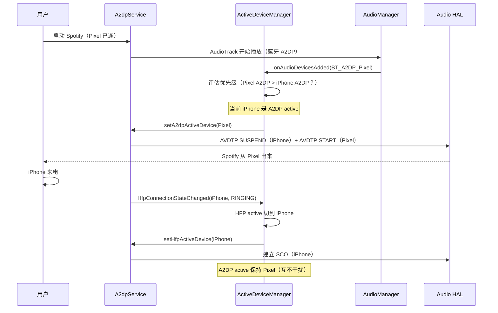

# 17.1 ActiveDeviceManager 深度

> **速通摘要**：`ActiveDeviceManager` 是 Android 蓝牙的"音频路由仲裁中心"——当多台手机同时连接车机（A2DP/HFP/LE Audio）时，它决定**音乐播给谁、电话接谁**。规则核心：① "最后一次主动播放的设备" 优先；② Hearing Aid > LE Audio > A2DP/HFP（同设备双模时优选 LE Audio）；③ 切换 active 设备时必须把另一类（如 A2DP 切到 LE Audio）的旧 active 设为 null 防止冲突。实现在 `android/app/src/com/android/bluetooth/btservice/ActiveDeviceManager.java:111`。

---

## 学习目标

读完本节后，你能：
1. 解释 "Active Device" 与 "Connected Device" 的差异。
2. 找到 A2DP / HFP / LE Audio / Hearing Aid 四类的 setXxxActiveDevice 入口。
3. 理解 Dual Mode 设备（同时支持 A2DP 和 LE Audio）的优选逻辑。
4. 用 dumpsys 看当前每类的 active device。

---

## 前置知识

- [16.1 AudioFlinger 三件套与蓝牙](../16_音频路由与AudioHAL/16.1_AudioFlinger等三件套与蓝牙的接合.md)
- [06.2 A2DP 连接全链路](../06_A2DP与AVRCP/06.2_A2DP连接全链路.md)

---

## 场景故事

副驾的 iPhone 已连车机听音乐，主驾的 Android 也连上车机后启动 Spotify。**音乐应该播谁的？**
- 朴素直觉：谁后启动播谁的（"最近活动优先"）
- 实际：车机厂商有更复杂策略（如优先主驾、或一次只让一台播）

`ActiveDeviceManager` 就是这套策略的执行者。错配会出现：
- 主驾插耳机后还在播副驾的歌
- 来电时本该切到主驾接，结果连副驾的 HFP

---

## "Connected" vs "Active" vs "Connection Policy"

| 概念 | 含义 | 谁来管 |
|------|------|--------|
| **Connection Policy** | 允许/禁止某设备的某 Profile 自动连接 | `PhonePolicy` + `ProfileService.setConnectionPolicy()` |
| **Connected** | Profile 物理上已连接（ACL + Profile signaling 完成） | 各 ProfileService（A2dpService 等） |
| **Active** | 当前**音频路由**指向该设备（同类下唯一） | `ActiveDeviceManager` |

例：同时连了 iPhone（A2DP+HFP）和 Pixel（A2DP+HFP），4 个连接都"Connected"，但 A2DP Active 只能是其中一台（iPhone 或 Pixel），HFP Active 也只能是一台。两台可以同时 connected 但**只有一台 active 能发声**。

---

## 类结构与入口

```java
// android/app/src/com/android/bluetooth/btservice/ActiveDeviceManager.java:111
public class ActiveDeviceManager
        implements AdapterService.BluetoothStateCallback {

    // 监听蓝牙状态变化
    // :168
    public void onBluetoothStateChange(int prevState, int newState) { ... }

    // 音频设备插拔回调（来自 AudioManager）
    // :978
    public void onAudioDevicesAdded(AudioDeviceInfo[] addedDevices) { ... }
    // :990
    public void onAudioDevicesRemoved(AudioDeviceInfo[] removedDevices) { ... }
}
```

---

## 四套 setActiveDevice 入口

```java
// ActiveDeviceManager.java（行号示例，搜索 set*ActiveDevice）
private boolean setA2dpActiveDevice(BluetoothDevice device);
private boolean setHfpActiveDevice(BluetoothDevice device);
private boolean setLeAudioActiveDevice(BluetoothDevice device, boolean hasFallbackDevice);
private boolean setHearingAidActiveDevice(BluetoothDevice device);
```

它们最终都会调用对应 ProfileService 的 `setActiveDevice()`，例如：
- `A2dpService.setActiveDevice(device)` → JNI → BTIF → BTA AVDTP 切流
- `HeadsetService.setActiveDevice(device)` → JNI → BTIF → SCO 路由
- `LeAudioService.setActiveDevice(device)` → JNI → LE Audio ASE 重新配置

---

## 切换时的"互斥处理"

最关键的逻辑：**当一个新设备成为 active 时，把"对立类别"的 active 设为 null**。例如：

```java
// ActiveDeviceManager.java:507（伪代码示例）
if (setHearingAidActiveDevice(device)) {
    // 助听器优先级最高 → 把 A2DP / HFP 都让出来
    setA2dpActiveDevice(null, true);   // :508
    setHfpActiveDevice(null);           // :509
}
```

```java
// :379 当 A2DP/HFP 类设备成为 active 时
boolean a2dpMadeActive = setA2dpActiveDevice(device);
boolean hfpMadeActive = setHfpActiveDevice(device);
if (a2dpMadeActive || hfpMadeActive) {
    // 把 LE Audio 让出来（Dual Mode 设备避免双路径冲突）
    setLeAudioActiveDevice(null, true);  // :382
}
```

---

## 优先级矩阵

```
Hearing Aid 助听器
       ↑ 最高优先（医学辅助设备）
       │
LE Audio CIS Unicast（如 LE Audio 耳机）
       ↑
       │ 对同一 Dual Mode 设备，Android 默认优先 LE Audio
       │
A2DP / HFP（Classic）
```

**Dual Mode 设备优选 LE Audio**：

```java
// ActiveDeviceManager.java:698
private void updateLeAudioActiveDeviceIfDualMode(BluetoothDevice device, ...) {
    // 如果设备同时支持 A2DP 和 LE Audio：
    // - 优先切到 LE Audio（更低延迟、更高码率）
    // - 把 A2DP 让出来（避免同时两路音频）
}
```

---

## 触发时机

`ActiveDeviceManager` 在以下事件下重新评估 active：

1. **Profile 连接状态变化**（A2dp Connected / Disconnected）
2. **A2DP 开始播放**（onAudioDevicesAdded — AudioManager 通知）
3. **来电**（HFP 准备建立 SCO 时）
4. **Hearing Aid 连接**（直接切到助听器）
5. **用户在设置 UI 显式切换**（BluetoothA2dp.setActiveDevice 由 UI 调用）

---

## 时序图：从插入耳机到音频切换



---

## dumpsys 查看 active

```bash
# 查看蓝牙总状态
adb shell dumpsys bluetooth_manager | grep -A 2 -i "active"

# 看四类 active device
adb shell dumpsys bluetooth_manager | grep -E "mA2dpActiveDevice|mHfpActiveDevice|mLeAudioActiveDevice|mHearingAidActiveDevice"

# 看 ActiveDeviceManager 详细日志
adb logcat -s BluetoothActiveDeviceManager:V ActiveDeviceManager:V

# 看 A2DP 当前 active（Profile 视角）
adb shell dumpsys bluetooth_manager | grep -A 5 "A2dpService" | grep -i "active"

# 看 LE Audio active
adb shell dumpsys bluetooth_manager | grep -A 5 "LeAudioService" | grep -i "active\|group"
```

---

## 常见配置点

车机厂商如果想改变默认仲裁策略，关注：

| 想法 | 改哪里 |
|------|--------|
| 默认主驾设备优先（地址匹配） | 在 `ActiveDeviceManager` 决策处插入主驾设备 ID 过滤 |
| 一次只允许一台设备 Connected | `PhonePolicy.processProfileStateChanged()` 拒绝第二台连接 |
| 拒绝自动切换（用户不手动就不切） | 改 `onAudioDevicesAdded()` 为 no-op |
| 蓝牙音乐和导航同时出声 | 不能改这里——是 AudioPolicyManager 决定，见 16.3 |

---

## FAQ

**Q1：为什么有时设置里两台都显示"已连接"，但只有一台能播音乐？**
因为"Connected"和"Active"是两层概念。两台都 connected 是正常的，但 Active 只能有一台，没被选中的那台只是握手完成、没建立音频流。

**Q2：Hearing Aid 为什么优先级最高？**
助听器是医学辅助设备，用户对中断有强烈不适感（突然听不到提示音可能造成危险）。Bluetooth SIG 和 Android 都规定：助听器一旦连接，必须立刻成为 active 输出，其他音频源让出。

**Q3：Dual Mode 设备同时显示 A2DP + LE Audio active 怎么办？**
正常情况不应同时出现。如果 `dumpsys` 看到两者都 active，说明 `updateLeAudioActiveDeviceIfDualMode()` 没正确把 A2DP 置 null。可能原因：① aconfig flag 关闭了 Dual Mode 优选；② Profile 连接顺序异常。

**Q4：`hasFallbackDevice` 参数是什么意思？**
`setLeAudioActiveDevice(null, true)` 中 `true` 表示"我让出，但还有别的设备可以接替（不是断音）"；`false` 表示"没人接替，可能要静音"。Audio HAL 会根据这个参数决定是直接切流还是先淡出。

---

## 上路任务

1. 打开 `android/app/src/com/android/bluetooth/btservice/ActiveDeviceManager.java:111`，找到所有 `setXxxActiveDevice(null, ...)` 的调用（grep `set.*ActiveDevice(null`），统计有多少处"互斥让出"。
2. 用 `adb shell dumpsys bluetooth_manager | grep -i "active"` 在两台手机都连接时观察 active 列表，再断开其中一台，对比 active 变化。
3. 找到 `:698 updateLeAudioActiveDeviceIfDualMode`，读懂"Dual Mode 设备优选 LE Audio"的判定条件（提示：通常需要双 Profile UUID 都已发现）。
