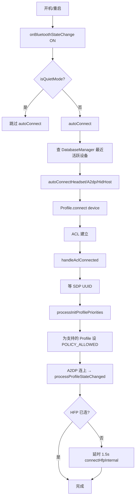

# 17.2 PhonePolicy 深度

> **速通摘要**：`PhonePolicy` 是 Android 蓝牙的"自动重连大脑"——当一台已配对手机出现在车机周围时，它决定**自动重连哪些 Profile**（不是全连，而是按优先级和上次状态）。核心逻辑：① ACL 已建立时根据 UUID 反推连哪些 Profile（`processInitProfilePriorities`）；② 蓝牙开机时自动重连"最近活动设备"（`autoConnect`）；③ A2DP/HFP 中一个 Profile 连上时，1.5 秒后尝试连另一个（"Profile Stickiness"）。实现在 `android/app/src/com/android/bluetooth/btservice/PhonePolicy.java:70`。

---

## 学习目标

读完本节后，你能：
1. 解释 "Connection Policy" 与"自动连接策略"的关系。
2. 找到 PhonePolicy 关键三个方法：`handleAclConnected` / `processInitProfilePriorities` / `autoConnect`。
3. 理解 "Profile Sticky Connect"（连了 A2DP 也要拉起 HFP）的实现。
4. 知道 Quiet Mode 如何影响自动连接。

---

## 前置知识

- [17.1 ActiveDeviceManager 深度](17.1_ActiveDeviceManager深度.md)
- [03.4 连接（ACL + Profile）](../03_核心流程/03.4_连接ACL_Profile.md)

---

## 场景故事

司机上车，手机蓝牙自动连上车机。车机后台无声地在做以下事：
1. ACL 链路建立 → PhonePolicy 收到 `handleAclConnected`
2. SDP 查 UUID → 发现支持 A2DP / HFP / PBAP / MAP
3. `processInitProfilePriorities` 设置每个 Profile 的 `CONNECTION_POLICY_ALLOWED`
4. 让 A2dpService / HeadsetService 启动 Profile 连接
5. A2DP 先连上 → 等 1.5s → HFP 也接上（用户没动手）

如果策略出错，可能：A2DP 自动连上但 HFP 没连，导致来电不能用车机接听。

---

## Connection Policy 三档

```java
// android.bluetooth.BluetoothProfile
CONNECTION_POLICY_UNKNOWN    = -1   // 未设置（首次配对前）
CONNECTION_POLICY_FORBIDDEN  =  0   // 禁止自动连接（用户在设置里关了）
CONNECTION_POLICY_ALLOWED    = 100  // 允许自动连接（默认）
```

每个 (Device × Profile) 都有自己的 Policy，存储在 BTIF 的设备配置文件中。

---

## 类结构与关键事件

```java
// android/app/src/com/android/bluetooth/btservice/PhonePolicy.java:70
public class PhonePolicy
        implements AdapterService.BluetoothStateCallback {

    // 蓝牙开机时触发自动重连
    // :112
    public void onBluetoothStateChange(...) {
        autoConnect();
    }

    // ACL 建立时，初始化新设备的 Profile 优先级
    // :138
    public void handleAclConnected(BluetoothDevice device) { ... }

    // Profile 状态变化时（连接/断开），决定要不要拉起其他 Profile
    // :125
    public void onProfileConnectionStateChanged(int profile, BluetoothDevice device,
                                                 int fromState, int toState) {
        mHandler.post(() -> processProfileStateChanged(profile, device, fromState, toState));
    }
}
```

---

## 关键方法详解

### 1. `processInitProfilePriorities`（首次连接 / 新设备）

```java
// PhonePolicy.java:272
private void processInitProfilePriorities(BluetoothDevice device, ParcelUuid[] uuids) {
    // 根据 SDP 拿到的 UUID 集合，决定本机要为该设备启用哪些 Profile
    // - 设备支持 A2DP_SINK UUID → 给本机 A2DP Source 设 ALLOWED
    // - 设备支持 HFP_HF UUID    → 给本机 HFP_AG 设 ALLOWED
    // - 设备支持 HID 等          → 类推

    // 设置完后，由 ProfileService 的 connect() 触发实际连接
}
```

`uuids` 来自 SDP 查询结果。如果用户之前在设置里手动 disable 了某个 Profile（POLICY_FORBIDDEN），不会被这里改写。

### 2. `autoConnect`（蓝牙开机 / 模式切换）

```java
// PhonePolicy.java:730
void autoConnect() {
    // :733 蓝牙没开 → 退出
    if (!mAdapterService.isEnabled()) return;

    // :737 Quiet Mode（飞行模式期间临时开启等）→ 不自动连
    if (mAdapterService.isQuietModeEnabled()) return;

    // :745 找最近活跃的 A2DP/HFP 设备
    BluetoothDevice mostRecentlyActiveA2dpDevice = ...;

    // :746
    autoConnectHeadset(mostRecentlyActiveA2dpDevice);
    autoConnectA2dp(mostRecentlyActiveA2dpDevice);
    autoConnectHidHost(mostRecentlyActiveA2dpDevice);
    // ...
}
```

"最近活跃设备"由 `DatabaseManager` 持久化（每次断开时更新时间戳）。开机后只重连这一台，而非全部已配对设备——避免抢占多个设备的资源。

### 3. `processProfileStateChanged`（Profile Sticky）

```java
// PhonePolicy.java:590
private void processProfileStateChanged(int profile, BluetoothDevice device,
                                         int fromState, int toState) {
    // 例如：A2DP 刚 Connected
    if (profile == BluetoothProfile.A2DP && toState == STATE_CONNECTED) {
        // 检查 HFP 是否也应该连
        if (蓝牙HFP的 ConnectionPolicy 是 ALLOWED 且 当前未连接) {
            // 延迟 1.5 秒后启动 HFP 连接（Sticky 行为）
            mHandler.postDelayed(() -> connectHfpInternal(device), DELAY);
        }
    }
}
```

这就是为什么用户经常发现"连 A2DP 后 HFP 也跟着连上"——是 PhonePolicy 主动拉起的，不是手机端推的。

---

## Quiet Mode（静默模式）

```java
// PhonePolicy.java:737
if (mAdapterService.isQuietModeEnabled()) {
    Log.i(TAG, log + "Bluetooth is in quiet mode. Cancelling autoConnect");
    return;
}
```

Quiet Mode 通常在以下情况启用：
- 飞行模式开启时蓝牙被临时唤醒（仅本地 GATT，不与外界通信）
- 设置里用户切换 BT 开关时的"过渡期"
- BluetoothManagerService 的 satellite mode

Quiet Mode 下，蓝牙允许开但不主动建立任何外向连接。

---

## 完整流程图



---

## 调试方法

```bash
# 查看 PhonePolicy 决策日志（重点）
adb logcat -s PhonePolicy:V

# 查看 ConnectionPolicy 设置
adb shell dumpsys bluetooth_manager | grep -A 3 "Phone Policy"

# 查看每个设备每个 Profile 的 Policy
adb shell dumpsys bluetooth_manager | grep -B 1 "connectionPolicy"

# 看最近活跃设备记录
adb shell dumpsys bluetooth_manager | grep -i "most recently active\|mostRecent"

# 修改某 Profile 的 Policy（用户操作模拟）
# 实际通过 BluetoothA2dp.setConnectionPolicy() API，没有直接 adb 命令
# 调试时可通过 BluetoothDevice.setConnectionPolicy() 触发
```

---

## FAQ

**Q1：为什么有时配对成功后没自动连？**
最常见的原因：① 该 Profile 的 Policy 是 UNKNOWN 或 FORBIDDEN（用户在设置里关过）；② Quiet Mode 开启；③ "最近活跃设备" 是另一台，本机不在自动重连列表中。看 `PhonePolicy:V` 日志的 `autoConnect()` 输出。

**Q2：为什么有时 A2DP 连上但 HFP 一直没连？**
检查 `processProfileStateChanged()` 的 1.5 秒延时是否被中途取消（如设备又断开），或者 HFP 的 ConnectionPolicy 是 FORBIDDEN。也可能是手机端拒绝 HFP 连接（如 iPhone 在"未授权车载电话"时）。

**Q3：车机想让所有已配对设备都自动重连怎么改？**
默认只连"最近活跃"是为了防止多台设备抢占资源。如果要改：在 `autoConnect()` 中遍历所有 `getMostRecentlyConnectedDevices()`（而不是只取第一个），但要注意 Profile 资源限制（如同时 HFP 连接数有上限）。

**Q4：能不能完全禁用 PhonePolicy？**
能。在 AdapterService 中可以传 null PhonePolicy（测试用），但生产中不推荐——这样所有连接都得用户手动触发，体验很差。更合理的做法是覆盖 PhonePolicy 的特定方法（继承类）。

---

## 上路任务

1. 打开 `android/app/src/com/android/bluetooth/btservice/PhonePolicy.java:730`，把 `autoConnect()` 完整读一遍，理解为什么先连 Headset 再连 A2DP（提示：HFP 建链对时序敏感）。
2. 找到 `processInitProfilePriorities()` 中对 UUID 的判定逻辑，看一下都判定了哪些 UUID（A2DP_SINK / HFP_HF / HID / PAN ...）。
3. 用 `adb logcat -s PhonePolicy:V` 在配对一台新手机时抓日志，确认 `processInitProfilePriorities` 给哪些 Profile 设了 POLICY_ALLOWED。
