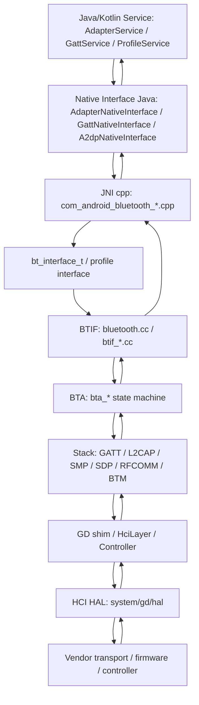

# 18-定向代码阅读报告：HAL / JNI / Native 边界

## 1. 阅读目标

本报告聚焦 Java/Kotlin 蓝牙服务如何通过 JNI 进入 native 蓝牙协议栈，以及 native 栈如何继续下沉到 BTIF、BTA、Stack、GD、HCI HAL 和 Controller。它不是重复讲某个单点功能，而是建立“跨语言边界地图”：遇到问题时能判断应该继续看 Java、JNI、BTIF/BTA、legacy stack、GD HCI 还是 vendor/HAL。

读完后要能定位：

- Java native 方法调用失败、native method 未注册、`sBluetoothInterface` 为空。
- BLE Scan/GATT/A2DP/HFP 等 Profile 从 JNI 进入 native 后应该去哪一层继续读。
- native 回调如何回到 Java service，再变成 Framework callback 或广播。
- HCI 命令已经发出但 controller 不回、vendor log 与 Framework log 对不上。

## 2. 适用场景

- 蓝牙打开、扫描、连接、配对、GATT 操作在 Java 侧只有失败码，需要继续往 native 查。
- 车厂集成新蓝牙芯片、替换 HAL、调试 controller 固件下载、HCI reset、低功耗唤醒。
- 定制 A2DP/HFP/GATT native 参数，判断应改 JNI、BTIF、BTA、Stack 还是 GD。
- 分析 bugreport 中 Java log、native log、HCI snoop 和 vendor log 的时间线。

## 3. 边界全景图



核心原则：Java 层看到的是请求和回调，JNI 层负责类型转换和接口表调用，BTIF/BTA/Stack/GD/HAL 才是协议、状态机、HCI 命令和 vendor 行为的主要发生地。

## 4. 关键类与源码入口

| 层级 | 源码 | 关键入口 |
| --- | --- | --- |
| Java Native Interface | `android/app/src/com/android/bluetooth/btservice/AdapterNativeInterface.java` | `init()`、`enable()`、`disable()`、bond、discovery、dump 等 native 声明 |
| GATT Native Interface | `android/app/src/com/android/bluetooth/gatt/GattNativeInterface.java` | GATT client/server、scan、advertise、MTU、notification 等 native 声明 |
| JNI 总入口 | `android/app/jni/com_android_bluetooth_btservice_AdapterService.cpp` | `JNI_OnLoad(...)`、`register_com_android_bluetooth_*`、`hal_util_load_bt_library(...)` |
| Adapter JNI | `com_android_bluetooth_btservice_AdapterService.cpp` | `initNative()`、`enableNative()`、`disableNative()`、`stateChangeCallback`、`dumpNative()` |
| GATT JNI | `android/app/jni/com_android_bluetooth_gatt.cpp` | `initNative()`、`sGattIf`、GATT client/server native methods |
| Scan JNI | `android/app/jni/com_android_bluetooth_scan.cpp` | scan / periodic scan native registration |
| Profile JNI | `com_android_bluetooth_a2dp.cpp`、`hfp.cpp`、`avrcp_target.cpp`、`le_audio.cpp` 等 | `initNative()`、`cleanupNative()`、profile callbacks |
| C 接口表 | `system/include/hardware/bluetooth.h` | `bt_interface_t`、`BLUETOOTH_INTERFACE_STRING` |
| GATT 接口表 | `system/include/hardware/bt_gatt.h` | `btgatt_interface_t` |
| BTIF 总入口 | `system/btif/src/bluetooth.cc` | `bluetoothInterface`、`enable()`、`disable()`、`get_profile_interface()`、`dump()` |
| Stack 管理 | `system/btif/src/stack_manager.cc` | `start_up_stack_async(...)`、`shut_down_stack_async(...)`、`GetInterfaceToProfiles()` |
| HCI/GD | `system/gd/hci/hci_layer.cc`、`system/gd/hci/hci_layer.h` | `HciLayer`、`EnqueueCommand(...)`、event handler、ACL/SCO/ISO queue |
| HAL | `system/gd/hal/hci_hal.h`、`system/gd/hal/hci_hal_impl*.cc` | `HciHal`、incoming packet callback、controller transport |
| legacy HCI | `system/hci/include/hci_layer.h`、`system/stack/btu/btu_hcif.cc` | legacy stack 到 HCI command/event 的桥 |

## 5. JNI 注册与接口表

JNI 总注册在蓝牙 native library 加载时完成：

```text
JNI_OnLoad(...)
  -> register_com_android_bluetooth_btservice_AdapterService(...)
  -> register_com_android_bluetooth_scan(...)
  -> register_com_android_bluetooth_hfp(...)
  -> register_com_android_bluetooth_a2dp(...)
  -> register_com_android_bluetooth_gatt(...)
  -> register_com_android_bluetooth_le_audio(...)
  -> ...
```

每个 `register_com_android_bluetooth_*` 内部都有 `JNINativeMethod methods[]`，把 Java 中声明的 `native` 方法绑定到 C++ 函数。例如 Adapter：

```text
AdapterNativeInterface.enable()
  -> enableNative()
  -> sBluetoothInterface->enable()
```

接口表来源：

- `hal_util_load_bt_library(&sBluetoothInterface)` 获取 `bt_interface_t`。
- 当前仓库中 `system/btcore/src/hal_util.cc` 直接把接口指向 `bluetoothInterface`。
- `system/btif/src/bluetooth.cc` 导出 `bt_interface_t bluetoothInterface`。
- Profile JNI 通过 `btInf->get_profile_interface(BT_PROFILE_XXX_ID)` 获取 A2DP、HFP、GATT、LE Audio 等接口。

最容易出错的点是签名不匹配：Java native 声明、`JNINativeMethod` 字符串签名和 C++ 函数参数必须完全一致。

## 6. Native 分层地图

| 层级 | 作用 | 典型源码 | 阅读方法 |
| --- | --- | --- | --- |
| JNI | Java/C++ 类型转换、回调到 Java、调用接口表 | `android/app/jni/com_android_bluetooth_*.cpp` | 看参数是否正确、callback method id、全局引用生命周期 |
| BTIF | Android 蓝牙接口层，面向 JNI/Profile 的 C API 实现 | `system/btif/src/bluetooth.cc`、`btif_dm.cc`、`btif_gatt.cc` | 看请求是否进入 native、是否投递到栈线程、是否回调 Java |
| BTA | 协议 profile 状态机与业务动作 | `system/bta/dm`、`system/bta/gatt`、`system/bta/av` | 看状态机 event、action function、失败码 |
| Stack | Bluetooth Core 协议层 | `system/stack/gatt`、`l2cap`、`smp`、`sdp`、`btm` | 看协议时序、连接/配对/ATT/L2CAP 状态 |
| GD/shim | 新架构模块、HCI 管理、Controller 能力封装 | `system/gd/hci`、`system/gd/hal`、`system/main/shim` | 看 HCI command/event、queue、controller capability |
| HCI HAL/Vendor | 与芯片/传输/固件交互 | `system/gd/hal`、厂商 HAL/vendor log | 看 HCI reset、firmware、transport、vendor event |

## 7. 典型调用路径

### 7.1 Adapter enable

```text
AdapterService.startScanController()
  -> AdapterNativeInterface.enable()
  -> enableNative()
  -> sBluetoothInterface->enable()
  -> bluetooth.cc enable()
  -> stack_manager_get_interface()->start_up_stack_async(...)
  -> BTA/GD/HCI HAL
```

### 7.2 GATT client

```text
BluetoothGatt API
  -> GattService
  -> GattNativeInterface
  -> com_android_bluetooth_gatt.cpp
  -> sGattIf = btIf->get_profile_interface(BT_PROFILE_GATT_ID)
  -> BTA_GATTC / GATT / ATT
  -> L2CAP / HCI
```

### 7.3 Classic discovery

```text
AdapterService.startDiscovery()
  -> AdapterNativeInterface.startDiscovery()
  -> startDiscoveryNative()
  -> sBluetoothInterface->start_discovery()
  -> btif_dm / BTM inquiry
  -> HCI Inquiry / inquiry result event
```

### 7.4 A2DP / HFP Profile

```text
A2dpService / HeadsetService
  -> A2dpNativeInterface / HeadsetNativeInterface
  -> com_android_bluetooth_a2dp.cpp / hfp.cpp
  -> get_profile_interface(...)
  -> btif_av / btif_hf
  -> BTA AV / BTA AG
  -> L2CAP / RFCOMM / SCO / Audio HAL
```

## 8. 回调路径

native 回调一般反向穿过同一条边界：

```text
Controller event
  -> HCI HAL incoming packet
  -> HciLayer event handler / legacy BTU
  -> Stack protocol callback
  -> BTA action callback
  -> BTIF callback
  -> JNI CallVoidMethod / callback helper
  -> Java NativeInterface callback
  -> AdapterService / GattService / ProfileService
  -> Binder callback / broadcast / app callback
```

阅读重点：

- JNI 是否保存了正确的 Java object/global ref。
- callback 是否切回正确线程，是否 attach/detach JVM。
- native status 是否被 Java 层重新映射，导致原始错误码丢失。
- 回调是否可能在 cleanup 后到达，导致空 service 或旧对象引用。

## 9. 线程模型与关键锁

| 线程/队列 | 负责内容 | 排查意义 |
| --- | --- | --- |
| Java Binder/Handler | 接收 App 调用、投递到 service 状态机 | Java API 成功只代表请求进入服务层 |
| JNI 调用线程 | 从 Java 进入 C++ 的当前线程 | 不应在 JNI 长时间阻塞 |
| BTIF / stack manager thread | stack start/stop、BTIF 事件处理 | enable/disable 卡住时重点看 |
| BTA/BTU main thread | legacy stack 状态机、协议事件 | discovery、pairing、classic profile 常在这里推进 |
| GD module handler | HciLayer、ACL manager、LE scanning/advertising 等 | BLE/HCI 新模块问题重点看 |
| HAL callback thread | HCI packet 从 controller 回到 host | command timeout、transport 断连、vendor event 重点看 |

锁的问题通常表现为“日志停在某个 callback 前后”。排查时不要只看最后一行 log，要结合线程名、native backtrace 和 HCI snoop。

## 10. 权限、Binder 与 Native 边界

权限检查原则：

- App 权限和 AppOps 必须在 Framework/Service/Binder 层完成。
- JNI/native 层默认相信上层已经做过权限检查，更多处理协议状态和参数合法性。
- 不能把 Java 层权限判断迁到 native，因为 native 难以完整表达 Android 调用方身份、attribution 和 AppOps。

边界建议：

- Java 层负责用户、包名、权限、策略、生命周期。
- JNI 层负责最薄的桥接和日志。
- BTIF/BTA/Stack 负责协议语义和状态机。
- HAL/vendor 负责芯片电源、firmware、transport、HCI 命令实际收发。

## 11. 可能失败点

| 现象 | 可能原因 | 观察点 |
| --- | --- | --- |
| native 方法找不到 | `JNINativeMethod` 名称/签名不匹配 | `JNI_OnLoad`、register 函数、Java native 声明 |
| `sBluetoothInterface is null` | native init 失败或 cleanup 后调用 | `initNative()`、`hal_util_load_bt_library()`、Profile 生命周期 |
| GATT JNI 初始化失败 | `get_profile_interface(BT_PROFILE_GATT_ID)` 返回空 | `bluetooth.cc get_profile_interface`、`btif_gatt_get_interface()` |
| Java 收不到 callback | JNI method id/global ref/线程 attach 问题，或 native 未触发 | 对应 `CallVoidMethod`、callback 注册、native event |
| HCI command timeout | controller/HAL/transport 问题，或 stack queue 卡住 | HCI snoop、`HciLayer` timeout、vendor log |
| native dump 空 | stack 未 running 或 interface cleanup | `bluetooth.cc dump()`、`stack_manager_get_interface()->get_stack_is_running()` |

## 12. dumpsys / logcat / bugreport 观察点

常用命令：

```bash
adb shell dumpsys bluetooth
adb shell dumpsys bluetooth_manager
adb bugreport /data/local/tmp/bt_bugreport.zip
adb logcat -b all -v threadtime | grep -E "AdapterService|GattService|bt_btif|bt_stack|BTA|GATT|L2CAP|HciLayer|HciHal|HCI"
```

建议时间线：

1. Java 请求时间：App/Framework/Service log。
2. JNI 入口时间：`*NativeInterface` 与 `com_android_bluetooth_*.cpp` log。
3. BTIF/BTA/Stack 时间：`bt_btif`、`bt_stack`、BTA/GATT/L2CAP log。
4. HCI 时间：btsnoop 中 command/event。
5. vendor 时间：厂商 HAL/firmware log。
6. Java 回调时间：状态广播、Binder callback、Profile callback。

## 13. 定制修改思路

### 13.1 新增 native 参数

推荐顺序：

- 先确认参数属于策略还是协议。策略参数留在 Java/Service，协议参数才下沉 native。
- 修改 Java `NativeInterface` 方法签名。
- 修改 JNI `JNINativeMethod` 签名和 C++ 函数参数。
- 修改 `bt_interface_t` 或 profile interface 时要评估 ABI/API 影响。
- 在 BTIF/BTA/Stack 中保持默认值，避免旧调用路径崩溃。

### 13.2 接入厂商 vendor debug

建议放置位置：

- HCI vendor event 解析：优先在 HCI/GD 或 vendor specific interface。
- controller debug 开关：优先通过 HAL/vendor 能力，不要写到 Framework API。
- Java 可见诊断：通过 `dumpsys bluetooth` 输出摘要，原始 vendor log 保留在 bugreport。

### 13.3 修改 HCI 行为

动手前必须确认：

- 是标准 HCI 命令、vendor specific command，还是 HAL transport 行为。
- 是否影响认证、功耗、兼容性和蓝牙 SIG 行为。
- 是否需要 btsnoop 证明修改前后的 command/event 差异。

## 14. 最容易踩的坑

- 以为 JNI 是业务层，往 JNI 塞复杂策略。JNI 应尽量薄。
- 改 Java native 声明后忘记改 `JNINativeMethod` 签名，运行时才崩。
- cleanup 后仍调用 native interface，导致 `sBluetoothInterface` 或 profile interface 为空。
- 只看 Framework log，不看 btsnoop，误把 controller timeout 当成 Java 问题。
- 误改 `bt_interface_t`/profile interface 结构，破坏接口表兼容。
- vendor 芯片问题绕到 Framework 层 hardcode，后续换芯片成本很高。

## 15. 练习题与参考答案

### 练习 1：`AdapterNativeInterface.enable()` 返回 false，如何分层查？

参考答案：

1. 看 Java 是否已完成 `initNative()`。
2. 看 JNI `sBluetoothInterface` 是否为空。
3. 看 `enableNative()` 调用 `sBluetoothInterface->enable()` 的返回值。
4. 进入 `system/btif/src/bluetooth.cc enable()`，确认是否调用 `stack_manager_get_interface()->start_up_stack_async(...)`。
5. 看 `stack_manager.cc` start 流程、BTA/GD/HCI HAL 是否继续推进。

### 练习 2：GATT native callback 到 Java 丢了，优先看哪里？

参考答案：

- 先看 `com_android_bluetooth_gatt.cpp` 是否注册 callback，并保存了正确 Java object。
- 再看 BTA GATTC/GATTS 是否真正触发 callback。
- 检查 callback 线程是否 attach JVM，method id 是否正确。
- 检查 Java `GattNativeInterface` / `GattService` 是否在 cleanup 后丢弃回调。

### 练习 3：怎么证明问题在 Controller/HAL 而不是 Framework？

参考答案：

- Framework/JNI/BTIF 日志显示请求已下发。
- btsnoop 中可见 HCI command，但没有对应 command complete/status/event，或 event status 为 controller 错误。
- vendor log 同期出现 firmware、transport、reset、LPM、UART/USB/PCIe 异常。
- Java 回调只是底层失败后的结果，不是根因。

## 16. 案例库映射

可沉淀到 `97-真实案例库.md` 的案例：

- HCI reset timeout 导致蓝牙打不开：证据链从 `enableNative()` 到 HCI snoop。
- GATT 注册成功但 native interface 为空：检查 `get_profile_interface(BT_PROFILE_GATT_ID)`。
- A2DP offload 参数下发后无声：区分 Java profile 参数、BTIF AV、Audio HAL、vendor codec。
- vendor event 未解析导致诊断缺失：补 HCI vendor specific dump 与 bugreport 摘要。
