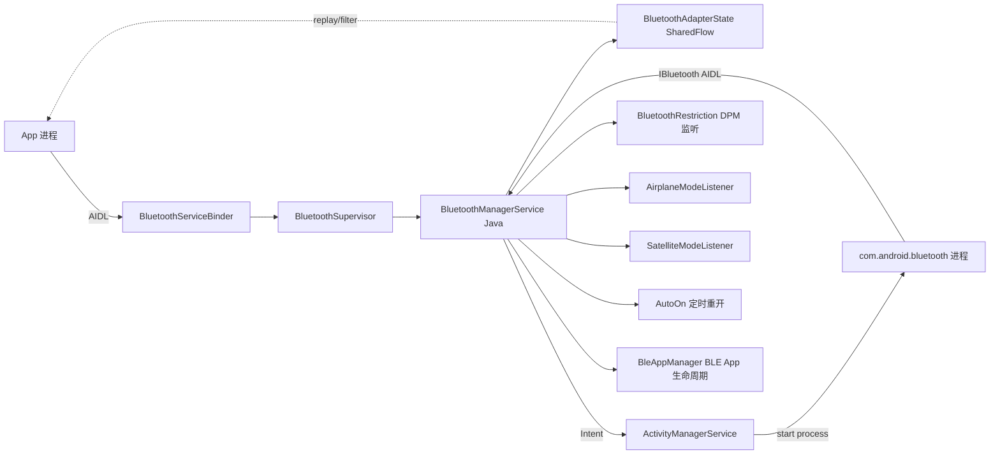

# 18.1 BluetoothService.kt / AdapterState.kt 拆解

> **速通摘要**：`service/src/` 是 Kotlin 写的"蓝牙系统服务层"，位于 system_server 进程，扮演 framework API 与蓝牙 App 之间的桥梁。核心类四件套：① `BluetoothService.kt:34`——`SystemService` 子类，负责生命周期；② `BluetoothSupervisor.kt:24`——单线程保护壳，把所有调用锁在 BluetoothSystemServer looper 上；③ `BluetoothManagerService`（Java 类，由 Supervisor 实例化）——真正的 BMS 业务逻辑；④ `BluetoothAdapterState`（`AdapterState.kt:32`）——线程安全的状态机，基于 `MutableSharedFlow` 实现可等待的状态变化。整层用 Kotlin 协程 + Flow，与 Java 旧 BMS 完全不同。

---

## 学习目标

读完本节后，你能：
1. 解释 `service/src/` 与 `android/app/` 两层的关系（system_server vs com.android.bluetooth 进程）。
2. 看懂 `BluetoothService.kt` 的 onStart / onUserStarting / onUserSwitching 三阶段生命周期。
3. 找到 BluetoothManagerService（Java）的实例化位置（在 Supervisor 里）。
4. 理解 `BluetoothAdapterState` 用 SharedFlow 替代 LiveData / synchronized 的设计。
5. 知道 Kotlin 协程 + Handler dispatcher 模式。

---

## 前置知识

- [02.1 BluetoothAdapter 详解](../02_Framework_API导读/02.1_BluetoothAdapter.md)
- [03.1 蓝牙开关](../03_核心流程/03.1_蓝牙开关.md)
- [00.1 Android 蓝牙分层架构总览](../00_总览与架构/00.1_Android蓝牙分层架构总览.md)

---

## 场景故事

新人问："手机里那个`com.android.bluetooth`进程是蓝牙服务吗？"——是，但只是一部分。真正调度它生死、传 Intent、监听飞行模式 / 用户切换的是 system_server 进程里的 `BluetoothManagerService`。从 Android 14 开始，这层被用 Kotlin 重写到 `service/src/` 目录。

调用流：
1. App 调 `BluetoothManager.getAdapter().enable()`
2. → AIDL 跨进程到 system_server 的 `BluetoothManagerService`
3. → 启动 `com.android.bluetooth` 进程（Profile Service 在那里）
4. → Profile 加载完成回调

`service/src/` 就是步骤 2-4 的 Kotlin 实现。

---

## 一、目录与角色对照

| 目录 | 进程 | 语言 | 职责 |
|------|------|------|------|
| `framework/java/` | App 进程 | Java | 公开 API（BluetoothAdapter / BluetoothDevice） |
| **`service/src/`** | **system_server** | **Kotlin** | **BluetoothManagerService、状态机、飞行模式 / 用户切换 / DPM 限制联动** |
| `android/app/` | com.android.bluetooth | Java | Profile Service、BTIF 桥接 |
| `system/` | com.android.bluetooth | C++ | Native 栈 |

为什么要分两层 Service？
- system_server 不能崩——蓝牙 Profile Service（Java/C++）有 bug 时不能拖死整个手机
- `com.android.bluetooth` 进程死了，system_server 还活着，可以 respawn
- Kotlin 层只做"管家"，不做协议处理

---

## 二、`BluetoothService.kt` 拆解

```kotlin
// service/src/BluetoothService.kt:34
class BluetoothService(context: Context) : SystemService(context) {
    private val looper = HandlerThread("BluetoothSystemServer").apply { start() }.looper  // :35
    private val serviceDispatcher = Handler(looper).asCoroutineDispatcher()              // :36
    private val scope = CoroutineScope(serviceDispatcher + SupervisorJob())              // :37

    private var supervisor: BluetoothSupervisor                                          // :39
    private var mInitialized = false

    init {
        // 构造时立即创建 Supervisor，但要在 BluetoothSystemServer 线程上
        supervisor = runBlocking(serviceDispatcher) {
            BluetoothSupervisor(context, looper, bluetoothComponent)                     // :53
        }
    }

    private fun runOnBmsThread(block: suspend CoroutineScope.() -> Unit)
        = scope.launch { block() }                                                       // :64

    // —— 生命周期三阶段 ——
    override fun onStart() {                                                              // :66
        publishBinderService(
            SERVICE_NAME,                                       // "bluetooth_manager"
            BluetoothServiceBinder(looper, supervisor.api(), context),
        )
    }

    override fun onUserStarting(user: TargetUser) {                                       // :73
        // 用户登录后初始化 BMS（非系统用户也可能触发）
        runOnBmsThread { supervisor.handleOnBootPhase(user.userHandle) }
        mInitialized = true
    }

    override fun onUserSwitching(_from: TargetUser?, to: TargetUser) {                    // :105
        // 切用户时（多用户场景），通知 BMS 重新加载用户相关配置
        runOnBmsThread { supervisor.onUserSwitching(to.userHandle) }
    }
}
```

**关键点**：
- 继承 `SystemService`（system_server 模块的标准基类）。
- 自己起一个 HandlerThread：所有 BMS 调用都在 `BluetoothSystemServer` 线程上跑——避免 system_server 主线程被蓝牙阻塞。
- 用 Kotlin 协程 + `asCoroutineDispatcher()` 把 Handler 包装成协程 Dispatcher。这样可以 `scope.launch { ... }` 后台跑，而不阻塞调用方。
- `runBlocking(serviceDispatcher) { ... }` 是构造期间唯一的同步等待——因为构造完成前不能让别的线程访问。

---

## 三、`BluetoothSupervisor.kt` 单线程闸门

```kotlin
// service/src/BluetoothSupervisor.kt:24
class BluetoothSupervisor(
    context: Context,
    val looper: Looper,
    bluetoothComponent: BluetoothComponent?,
) {
    private val bms: BluetoothManagerService           // ⭐ Java 旧 BMS

    init {
        val hciInstance =
            if (Flags.hciInstanceNameUseInjected()) {
                BluetoothHciInstance().getInstance()
            } else {
                "default"
            }
        bms = BluetoothManagerService(context, looper, hciInstance, bluetoothComponent)  // :39
    }

    fun api(): BluetoothManagerServiceApi = bms.api                                       // :43

    fun onBluetoothDisallowed() {
        enforceCorrectThread()
        bms.onBluetoothDisallowed()
    }

    fun handleOnBootPhase(userHandle: UserHandle) {
        enforceCorrectThread()
        bms.handleOnBootPhase(userHandle)
    }

    fun onUserSwitching(userHandle: UserHandle) {
        enforceCorrectThread()
        bms.onUserSwitching(userHandle)
    }

    // 防御性检查：所有 supervisor 方法必须在 BMS looper 上调
    private fun enforceCorrectThread() {                                                  // :62
        if (looper == Looper.myLooper()) return
        throw IllegalThreadStateException("Must be called on BluetoothSystemServer looper")
    }
}
```

**Supervisor 的作用**：
1. **持有 BluetoothManagerService 实例**（注意：BMS 本体是 Java 类，在 `service/java/` 目录，外部依赖）。
2. **强制线程边界**：每个方法首行 `enforceCorrectThread()`，跨线程调用直接抛异常。
3. **配置注入**：HCI Instance 名字（用于多 HCI 场景，详见 ch23）由 Supervisor 在构造时解析。

---

## 四、`BluetoothAdapterState` 状态机

```kotlin
// service/src/AdapterState.kt:32
class BluetoothAdapterState {
    // 用 SharedFlow 而非 StateFlow，因为 StateFlow 会"合并相同值"，我们要保留状态历史
    private val _uiState = MutableSharedFlow<Int>(1 /* replay only most recent value*/)  // :34

    init { set(State.OFF) }                                                              // :37

    fun set(s: Int) = runBlocking {                                                       // :40
        _uiState.emit(s)
        // 通知 IPC 缓存失效：让所有 App 端的 BluetoothAdapter#getState() 重新跨进程取
        if (!disableCacheForTesting) {
            IpcDataCache.invalidateCache(IPC_CACHE_MODULE_SYSTEM, GET_SYSTEM_STATE_API)
        }
    }

    fun get(): Int = _uiState.replayCache.get(0)                                          // :47

    fun oneOf(vararg states: Int): Boolean = states.contains(get())                       // :49

    // 关键：可挂起的等待 ⭐
    suspend fun waitForState(timeout: Duration, vararg states: Int): Boolean =            // :57
        withTimeoutOrNull(timeout) {
            _uiState.filter { states.contains(it) }.first()
        } != null
}
```

### 4.1 状态值

`android.bluetooth.State` 定义（外部依赖）：
| 值 | 名称 |
|----|------|
| 10 | OFF |
| 11 | TURNING_ON |
| 12 | ON |
| 13 | TURNING_OFF |
| 14 | BLE_TURNING_ON |
| 15 | BLE_ON |
| 16 | BLE_TURNING_OFF |

注意 BLE_ON 是"只开 BLE 不开 Classic"的中间状态，BMS 用于支持后台扫描型 App 在主开关关闭时仍能跑。

### 4.2 为什么用 SharedFlow 不用 LiveData？

| 维度 | LiveData | SharedFlow（这里用的） | StateFlow |
|------|----------|-----------------------|-----------|
| 主线程绑定 | 是 | 否 | 否 |
| 协程友好 | 否 | 是（`collect()`） | 是 |
| 相同值会合并？ | 是 | 否（手动控制） | **是**（会丢中间状态） |
| 支持`waitFor` | 需要 lambda | `filter().first()` | 同 |

`BluetoothAdapterState` 要等待"TURNING_ON → ON"序列时，不能丢任何一个中间状态——`StateFlow` 会合并，`SharedFlow(replay=1)` 不会。

### 4.3 IpcDataCache 失效

```kotlin
IpcDataCache.invalidateCache(IPC_CACHE_MODULE_SYSTEM, GET_SYSTEM_STATE_API)
```

Android 12+ 引入 `IpcDataCache`：App 端缓存跨进程查询的结果（如 `BluetoothAdapter.getState()`），避免高频跨进程调用。BMS 每次状态变化都要主动失效，否则 App 拿到的是旧状态。

---

## 五、调用链：App 调 enable() 的完整路径

```
App (BluetoothAdapter.enable())
     ↓ AIDL → system_server
BluetoothServiceBinder.kt → BluetoothManagerServiceApi.kt
     ↓
BluetoothManagerService.java (旧 Java 类，service/java/)
     ↓ Handler post (BluetoothSystemServer looper)
处理 MSG_ENABLE_BLUETOOTH
     ↓
检查 飞行模式 / 卫星模式 / DPM 限制 (BluetoothRestriction)
     ↓
启动 com.android.bluetooth 进程（Intent → ActivityManager）
     ↓
等 IBluetooth callback (蓝牙进程 ready)
     ↓
state.set(TURNING_ON)  ← BluetoothAdapterState.kt:40
     ↓
BTIF init complete → state.set(ON)
     ↓
通知所有 IBluetoothCallback 监听器
```

---

## 六、Mermaid：组件协作



---

## 七、调试方法

```bash
# 看 BMS 状态
adb shell dumpsys bluetooth_manager | head -50

# 看 state 历史和 callback 注册
adb shell dumpsys bluetooth_manager | grep -E "State |Callback"

# Kotlin BMS 日志（标签：Bluetooth）
adb logcat -s Bluetooth:V BluetoothSystemServer:V

# Supervisor / Service 日志
adb logcat | grep -E "BluetoothService\b|BluetoothSupervisor"

# 看 BMS 在哪个线程
adb shell ps -T -p $(pidof system_server) | grep -i bluetooth
# 应该有：BluetoothSystemServer
```

---

## 八、Java↔Kotlin 互调点

Kotlin BMS 要调老 Java BMS：
- `BluetoothManagerService` 仍是 Java 类（行业稳定性考虑）
- Kotlin `BluetoothSupervisor` 直接 `new BluetoothManagerService(...)`
- BMS 内部方法保持 Java 签名，外部 Kotlin 调用透明

注意 Kotlin `runBlocking` + Java synchronized 混用可能死锁——所以 Supervisor 用 `enforceCorrectThread()` 把所有调用都强制在同一线程上，根本不需要锁。

---

## FAQ

**Q1：为什么 BluetoothManagerService 还是 Java，不全改 Kotlin？**
Android 团队的策略：① 保持核心稳定性，逐步迁移；② BMS 内部状态机复杂，重写风险大；③ 先迁移外围（Service、State、Listener），核心慢慢来。预计 Android 17/18 会继续迁。

**Q2：`runBlocking` 在 init 块里用安全吗？**
有限度地安全。`BluetoothService.init` 中用 `runBlocking(serviceDispatcher)` 等 Supervisor 构造完成——因为这是冷启动，没人会等这条线程。但日常代码不能用 `runBlocking`，会卡 system_server。

**Q3：`SharedFlow(replay=1)` 和 `Channel` 选哪个？**
SharedFlow：多消费者（多个 IBluetoothCallback 同时收）、需要"最新值快照"。Channel：单生产者单消费者、不重复消费。BMS 选 SharedFlow 因为有多个 framework 订阅者。

**Q4：onUserSwitching 时蓝牙会断开重连吗？**
不一定。看 PhonePolicy 是否给新用户存了上次的设备列表。BMS 自己只切配置（如 DPM 限制可能不同），具体设备重连由 PhonePolicy 决定，见 17.2。

---

## 上路任务

1. 打开 `service/src/BluetoothService.kt:34`，把 init、onStart、onUserStarting、onUserSwitching 四个方法读一遍，画出生命周期时序。
2. 找到 `AdapterState.kt:53` 的 `waitForState`，理解 `withTimeoutOrNull + filter + first` 三件套实现 "等到某状态出现或超时" 的协程套路。
3. 用 `adb shell ps -T -p $(pidof system_server) | grep -i bluetooth` 确认 `BluetoothSystemServer` 线程确实存在。
