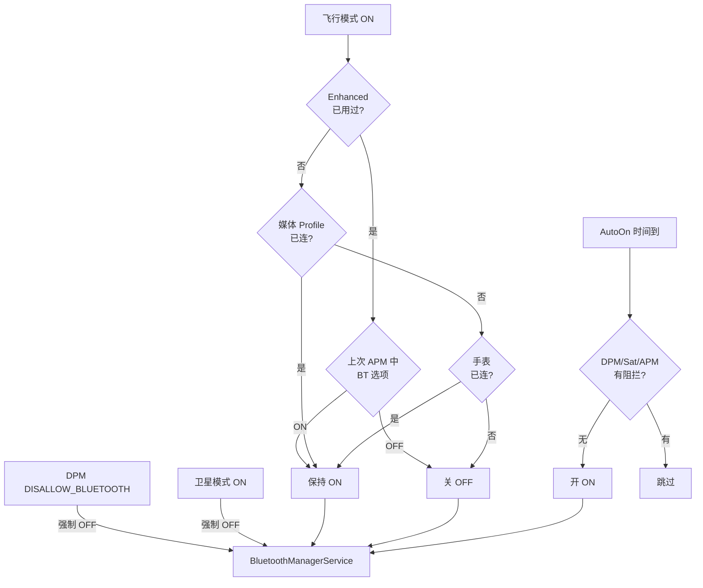

# 18.2 AutoOn / 飞行模式 / 卫星模式 / DPM 限制联动

> **速通摘要**：BMS 不仅管开关，还要响应 4 个**外部模式信号**自动开关蓝牙：① **飞行模式**（`airplane/ModeListener.kt:64`）——传统行为关蓝牙，"飞行增强模式"下保留用户选择；② **卫星模式**（`satellite/ModeListener.kt:45`）——卫星通话期间强制关蓝牙避免射频干扰；③ **AutoOn**（`AutoOn.kt:49`）——用户关蓝牙后定时自动重开（默认次日重置）；④ **DPM 限制**（`BluetoothRestriction.kt:30`）——企业管理员可禁用蓝牙（`DISALLOW_BLUETOOTH`）。每个模块独立监听系统 Settings 变化，回调通知 BMS。

---

## 学习目标

读完本节后，你能：
1. 解释 4 种"自动开关"信号的优先级与冲突解决。
2. 找到飞行模式 enhanced mode 的逻辑（媒体连接时不关蓝牙）。
3. 理解 AutoOn 用 AlarmManager 实现定时器的"睡眠后还能触发"机制。
4. 知道 DPM 的 `DISALLOW_BLUETOOTH` 来自何处、何时检查。

---

## 前置知识

- [18.1 BluetoothService.kt / AdapterState.kt 拆解](18.1_BluetoothService_AdapterState.md)
- [03.1 蓝牙开关](../03_核心流程/03.1_蓝牙开关.md)

---

## 场景故事

司机起飞前打开飞行模式——车机/手机蓝牙瞬间关掉。但有些用户在飞行模式下还想用蓝牙耳机听音乐——Android 11+ 引入 "Airplane Enhancement Mode"：允许在飞行模式下手动重新打开蓝牙，且这个选择被记住，下次飞行模式自动跟随。

类似地：
- 出隧道用卫星电话时，蓝牙强制关（避免干扰）
- 用户晚上关蓝牙省电，第二天早上 BMS 自动重开（AutoOn）
- 公司发的工作手机，IT 部门通过 MDM 禁用蓝牙（DPM）

这一节梳理这四类机制的代码与冲突优先级。

---

## 一、四种模式的优先级矩阵

```
高 ┌───────────────────────────────────────────────────────────┐
   │ DPM DISALLOW_BLUETOOTH       │ 用户永远关不开（设置灰色）  │
   │                              │ 应用层 enable() 直接拒     │
   ├───────────────────────────────────────────────────────────┤
   │ 卫星模式 isOn = true          │ BMS 强制关，恢复后回到原状  │
   ├───────────────────────────────────────────────────────────┤
   │ 飞行模式 + 非 enhanced       │ 关（默认行为）              │
   │ 飞行模式 + enhanced + media  │ 不关（媒体连接保留）        │
   │ 飞行模式 + enhanced + 用户   │ 跟随用户上次飞行模式中的选择 │
   ├───────────────────────────────────────────────────────────┤
   │ AutoOn 定时                  │ 时间到自动开，被以上任一    │
   │                              │ 信号阻断时不生效            │
低 └───────────────────────────────────────────────────────────┘
```

---

## 二、飞行模式

### 2.1 `airplane/ModeListener.kt` 拆解

```kotlin
// service/src/airplane/ModeListener.kt:16  @file:JvmName("AirplaneModeListener")

// :40 暴露的全局状态
var isOnOverrode = false
    private set       // 真正影响 BT 的"应该关吗"
var isOn = false
    private set       // 系统飞行模式开关原始值

// :64 初始化入口（被 BMS 在 boot 时调用）
fun initialize(
    looper: Looper,
    systemResolver: ContentResolver,
    state: BluetoothAdapterState,
    modeCallback: (m: Boolean) -> Unit,        // BMS 收到通知后真正去关/开 BT
    notificationCallback: (state: String) -> Unit,  // 显示给用户的通知
    getUser: () -> Context,
    timeSource: TimeSource,
) {
    // 让 Settings 知道蓝牙支持 APM Enhanced
    Settings.Global.putInt(systemResolver, APM_ENHANCEMENT, ...)  // :78

    initializeRadioModeListener(
        looper, systemResolver,
        Settings.Global.AIRPLANE_MODE_RADIOS,
        Settings.Global.AIRPLANE_MODE_ON,
        fun(newMode: Boolean) {                                    // :90
            isOn = newMode
            val isBluetoothOn = state.oneOf(State.ON, State.TURNING_ON, State.TURNING_OFF)
            isOnOverrode = airplaneModeValueOverride(...)          // :95
            // 触发回调，BMS 决定开关
            modeCallback(isOnOverrode)
        },
    )
}
```

### 2.2 Enhanced Mode 决策

```kotlin
// service/src/airplane/ModeListener.kt:180
private fun airplaneModeValueOverride(...): Boolean {
    // :188 飞行模式关 或 蓝牙原本就没开 → 不 override
    if (!currentAirplaneMode || currentBluetoothStatus == false) {
        return currentAirplaneMode
    }
    // :192 Enhanced Mode 开 且 用户用过这个 toggle
    if (isApmEnhancementEnabled(resolver) && hasUserToggledApm(getUser())) {
        if (isBluetoothOnAPM(getUser)) {
            // 用户上次在飞行模式下选择 BT ON → 这次也 ON
            return false  // 不 override = 不关
        }
        return true  // 用户上次选 OFF → 这次也 OFF
    }
    // 旧逻辑：媒体 Profile 连接时不关
    if (isMediaProfileConnected) {                                  // :213
        return false  // 不 override
    }
    // 旧逻辑：手表连接时不关
    if (watchConnectionState) {                                     // :222
        return false
    }
    return true  // 标准飞行模式：关
}
```

### 2.3 媒体连接信号源

```kotlin
// service/src/airplane/ModeListener.kt:157
fun setIsMediaProfileConnected(connected: Boolean) {
    isMediaProfileConnected = connected
}
```

BMS 监听 A2DP / Hearing Aid / LE Audio 连接状态，调这个方法更新。飞行模式触发瞬间读这个变量，决定要不要 override。

---

## 三、卫星模式

```kotlin
// service/src/satellite/ModeListener.kt:30
internal const val SETTINGS_SATELLITE_MODE_RADIOS  = "satellite_mode_radios"
internal const val SETTINGS_SATELLITE_MODE_ENABLED = "satellite_mode_enabled"

var isOn = false
    private set

// :45
fun initialize(looper: Looper, resolver: ContentResolver, callback: (m: Boolean) -> Unit) {
    isOn = initializeRadioModeListener(
        looper, resolver,
        SETTINGS_SATELLITE_MODE_RADIOS,
        SETTINGS_SATELLITE_MODE_ENABLED,
        fun(newMode: Boolean) {
            val previousMode = isOn
            isOn = newMode
            if (previousMode == isOn) return
            callback(isOn)            // 通知 BMS 卫星模式变化
        },
    )
}
```

**与飞行模式的差异**：
- 卫星模式**强制关**蓝牙，没有 enhanced override
- 用途：卫星通话频段与 BT/WiFi 接近，射频干扰严重
- 切换更迅速：不考虑媒体 Profile，直接关

---

## 四、AutoOn 自动重开

### 4.1 类与触发

```kotlin
// service/src/AutoOn.kt:49
class AutoOn(
    private val looper: Looper,
    private val context: Context,
    private val user: UserHandle,
    private val state: BluetoothAdapterState,
    private val callback_on: () -> Unit,         // BMS 提供的"开蓝牙"回调
) {
    @VisibleForTesting internal var timer: Timer? = null

    // :60 重置定时器
    fun resetAutoOnTimer() {
        timer?.cancel(); timer = null

        if (!isEnabledUnchecked()) return                      // 用户禁用了 AutoOn
        if (state.oneOf(State.ON)) return                      // 已经开了
        if (isSatelliteModeOn) return                          // 卫星模式优先
        if (isAirplaneModeOn) {                                // 飞行模式特殊
            if (!hasUserToggledApm(context)) return
            // 飞行 enhanced 已被用户用过 → 跳过限制
        }

        val now = LocalDateTime.now()
        val target = getDateFromStorage(contentResolver) ?: nextTimeout(now)
        val timeToSleep = now.until(target, ChronoUnit.NANOS).toDuration(...)

        if (timeToSleep.isNegative()) {
            // 已经过了目标时间 → 立即开
            callback_on()
            resetStorage(contentResolver)
            return
        }

        timer = Timer(looper, context, receiver, callback_on, now, target, timeToSleep)
    }

    // :113 蓝牙开了之后，写下"下次自动开的时间"
    fun notifyBluetoothOn() {
        timer?.cancel(); timer = null
        if (!isSupported()) {
            val defaultFeatureValue = true
            setEnabledUnchecked(defaultFeatureValue)
        }
        // 算出下一个 5:00 AM（次日早上）写入 storage
    }
}
```

### 4.2 Timer：用 AlarmManager 跨睡眠定时

```kotlin
// AutoOn.kt 内部 Timer 类
// 用 AlarmManager.setExactAndAllowWhileIdle() 而不是 Handler.postDelayed
// 原因：Handler 在设备 doze / 深睡时会被挂起，AlarmManager 会唤醒
```

### 4.3 默认行为

- 用户关蓝牙 → BMS 触发 `AutoOn.notifyBluetoothOn` 失败时取消
- 下次开机或某条件触发 `resetAutoOnTimer` → 算出"下次自动开"时间
- 默认计算：下个早上 5:00（避开通勤高峰，又是醒来后用蓝牙耳机的时间）
- 飞行/卫星模式生效时被跳过

---

## 五、DPM 限制

```kotlin
// service/src/BluetoothRestriction.kt:30
object BluetoothRestriction {
    @JvmStatic
    var isBluetoothAllowed: Boolean = false
        @VisibleForTesting set

    // :36 BMS 启动时初始化
    @JvmStatic
    fun initialize(context: Context, looper: Looper, callback: () -> Unit) {
        val receiver = object : BroadcastReceiver() {
            override fun onReceive(ctx: Context, intent: Intent) {
                if (intent.action == UserManager.ACTION_USER_RESTRICTIONS_CHANGED) {
                    handleRestrictionChange(context, callback)
                }
            }
        }
        // 注册系统用户的限制变更监听
        context.registerReceiver(receiver, IntentFilter(...), null, Handler(looper))
        isBluetoothAllowed = !hasBluetoothRestriction(context)
    }

    // :60
    fun handleRestrictionChange(context: Context, callback: () -> Unit) {
        val wasBluetoothAllowed = isBluetoothAllowed
        isBluetoothAllowed = !hasBluetoothRestriction(context)
        if (!isBluetoothAllowed && wasBluetoothAllowed) {
            callback()  // 通知 BMS 关蓝牙
        }
    }

    // :72
    private fun hasBluetoothRestriction(systemContext: Context): Boolean =
        systemContext
            .getSystemService(UserManager::class.java)
            .hasUserRestriction(UserManager.DISALLOW_BLUETOOTH)
}
```

**特点**：
- `object` 单例（Kotlin），全局唯一限制状态
- 监听 `ACTION_USER_RESTRICTIONS_CHANGED` 系统广播
- 只在"从允许变为禁止"时回调（`!isBluetoothAllowed && wasBluetoothAllowed`），避免重复关

---

## 六、Mermaid：四模式协作



---

## 七、调试方法

```bash
# 飞行模式状态
adb shell settings get global airplane_mode_on
adb shell settings get global airplane_mode_radios

# Enhanced Mode 是否开
adb shell settings get global apm_enhancement_enabled
adb shell settings get secure bluetooth_apm_state
adb shell settings get secure apm_user_toggled_bluetooth

# 卫星模式
adb shell settings get global satellite_mode_enabled
adb shell settings get global satellite_mode_radios

# DPM 限制
adb shell dumpsys user | grep -A 3 DISALLOW_BLUETOOTH

# AutoOn 状态
adb shell settings get secure bluetooth_automatic_turn_on

# 关键日志
adb logcat -s AirplaneModeListener:V SatelliteModeListener:V AutoOn:V BluetoothRestriction:V

# 模拟开关飞行模式
adb shell cmd connectivity airplane-mode enable
adb shell cmd connectivity airplane-mode disable
```

---

## 八、车机定制点

| 想法 | 改哪里 |
|------|--------|
| 飞行模式下永远不关蓝牙（车机不在飞机上） | `airplane/ModeListener.kt:180` `airplaneModeValueOverride` 直接 return false |
| 取消 AutoOn 减少功耗 | sysprop / setting `bluetooth_automatic_turn_on=0` |
| 完全禁止 DPM 影响（车机不需要 MDM） | 不调用 `BluetoothRestriction.initialize` |
| 启动时强制开蓝牙 | BMS boot 阶段调 enable() 不等用户操作 |

---

## FAQ

**Q1：飞行模式开启后蓝牙耳机怎么不断？**
看 `isMediaProfileConnected`——如果 A2DP/Hearing Aid/LE Audio 任一连接，旧逻辑 override 不关蓝牙。新逻辑（Enhanced Mode）则尊重用户上次选择。所以"飞行模式下蓝牙耳机不断"是设计如此。

**Q2：DPM DISALLOW_BLUETOOTH 是谁设的？**
企业 MDM 配置（Device Owner / Profile Owner App）通过 `DevicePolicyManager.addUserRestriction()` 设置。车机如果不接 MDM，永远不会触发。

**Q3：AutoOn 默认时间是怎么算的？**
看 `AutoOn.nextTimeout()`——默认次日凌晨 5:00（早上唤醒用户）。可通过 storage 自定义。如果触发时已过 5:00，会推到下个 5:00。

**Q4：4 种信号冲突时谁赢？**
看优先级表：DPM > 卫星 > 飞行 > AutoOn。BMS 收到信号时依次评估：先看 DPM 是否允许，再看卫星/飞行是否要求关，最后 AutoOn 在前者都允许时才生效。

---

## 上路任务

1. 打开 `service/src/airplane/ModeListener.kt:180`，把 `airplaneModeValueOverride` 函数读完，画出"飞行模式 → 是否 override"的决策树。
2. 找到 `AutoOn.kt:60` 的 `resetAutoOnTimer`，列出 4 个 "提前 return" 的条件（已启用？已 ON？卫星？飞行+未 enhanced？）。
3. 用 `adb shell settings put global airplane_mode_on 1` 切飞行模式，观察 `logcat -s AirplaneModeListener:V` 输出，确认 `isOnOverrode` 是否符合预期。
