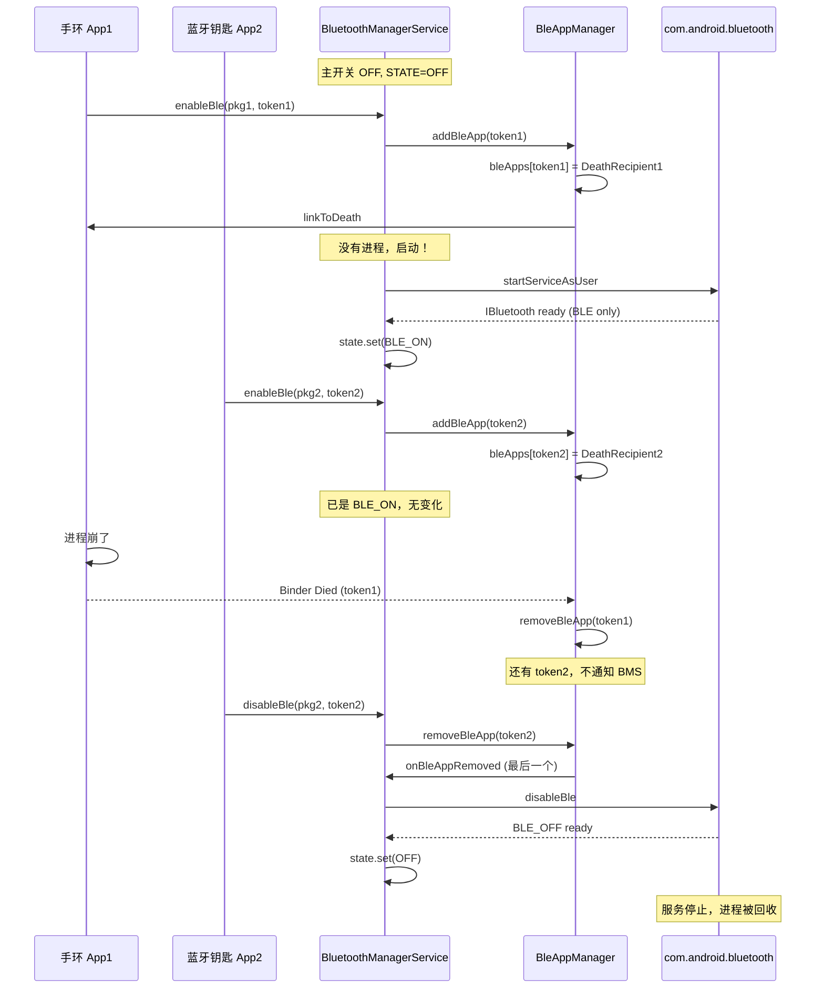

# 18.3 蓝牙 App 进程生命周期管理

> **速通摘要**：BMS 不仅管"蓝牙状态"，还管 `com.android.bluetooth` 进程的拉起与回收：① 主开关 ON → 启动进程；② 主开关 OFF → 杀进程；③ 主开关 OFF 但 BLE 类 App 在用（如手环 App）→ **BLE-only 模式**保留进程。后者由 `BleAppManager.kt:27` 维护 BLE App 注册表，挂 binder DeathRecipient 监听 App 进程死亡时自动清理。`enableBle()` / `disableBle()` API 让 App 在主开关关时仍能用 BLE，但 BMS 必须确保没有"幽灵 App"占着进程不放。本节讲清楚这套"半开机"机制。

---

## 学习目标

读完本节后，你能：
1. 区分 "Classic + BLE 全开" 与 "BLE-only" 两种蓝牙运行状态。
2. 解释 `BleAppManager` 的 binder DeathRecipient 模式。
3. 找到 enableBle / disableBle 的入口，理解何时由系统自动调。
4. 知道 `com.android.bluetooth` 进程的拉起/回收时机。

---

## 前置知识

- [18.1 BluetoothService.kt / AdapterState.kt](18.1_BluetoothService_AdapterState.md)
- [03.1 蓝牙开关](../03_核心流程/03.1_蓝牙开关.md)
- Android Binder DeathRecipient 基础

---

## 场景故事

用户日常关蓝牙省电，但手环 App（如小米运动）需要持续后台扫描寻找手环连接。怎么让"主开关关 + 手环依然扫得到"？

答案是 **BLE-only 模式**：
1. 用户主开关 OFF → `STATE_OFF`
2. 手环 App 调 `BluetoothAdapter.enableBle()`
3. BMS 把进程拉起来，状态进入 `STATE_BLE_ON`（只有 LE 栈活跃，Classic 模块不加载）
4. 手环 App 进程崩了？BMS 通过 binder DeathRecipient 感知，自动 `disableBle()`
5. 没有其他 BLE App 时，BMS 把进程杀掉，状态回 `STATE_OFF`

`BleAppManager.kt` 就是这套引用计数 + 死亡监听的核心。

---

## 一、三种"蓝牙开启"程度

| 状态 | Classic 栈 | LE 栈 | 进程 | 触发 |
|------|-----------|-------|------|------|
| `STATE_OFF` | ❌ | ❌ | 不存在 | 默认 / 主开关 OFF + 无 BLE App |
| `STATE_BLE_ON` | ❌ | ✅ | 存在 | 主开关 OFF + 至少 1 个 BLE App 调 enableBle() |
| `STATE_ON` | ✅ | ✅ | 存在 | 主开关 ON |

中间过渡态：
- `BLE_TURNING_ON` / `BLE_TURNING_OFF`
- `TURNING_ON` / `TURNING_OFF`

---

## 二、`BleAppManager.kt` 拆解

### 2.1 整体结构

```kotlin
// service/src/BleAppManager.kt:27
class BleAppManager(
    private val looper: Looper,
    private val onBleAppRemoved: (Int, String) -> Unit,   // BMS 提供的回调
) {
    // 注册表：每个 BLE App 一个 token（IBinder），关联一个 DeathRecipient
    private val bleApps = mutableMapOf<IBinder, ClientDeathRecipient>()  // :31

    // :33 内部类，监听 App 进程死亡
    private inner class ClientDeathRecipient(val packageName: String, val token: IBinder) :
            IBinder.DeathRecipient {
        override fun binderDied() {
            Log.w(TAG, "Binder is dead - posting the unregister of $packageName")
            Handler(looper).post {
                removeBleApp(ENABLE_DISABLE_REASON_APPLICATION_DIED, token, packageName)
            }
        }
    }

    // :46 注册 BLE App
    fun addBleApp(token: IBinder, packageName: String): Boolean {
        if (bleApps.containsKey(token)) return true   // 已注册
        val deathRec = ClientDeathRecipient(packageName, token)
        try {
            token.linkToDeath(deathRec, 0)            // 挂死亡监听
        } catch (ex: RemoteException) {
            // 已经死了
            return false
        }
        bleApps[token] = deathRec
        return true
    }

    // :64 反注册
    fun removeBleApp(reason: Int, token: IBinder, packageName: String) {
        val removedApp = bleApps[token] ?: return
        token.unlinkToDeath(removedApp, 0)
        bleApps.remove(token)
        if (isBleAppPresent()) return        // 还有别的 BLE App → 不通知 BMS
        onBleAppRemoved(reason, packageName)  // 最后一个 BLE App → 通知 BMS 可关
    }

    fun isBleAppPresent() = bleApps.isNotEmpty()        // :86
    fun clearBleApps() { ... }                          // :81
}
```

### 2.2 引用计数模式

`bleApps` Map 就是 "BLE 引用计数器"——只要不空，BMS 就要保持 BLE-only 状态。Key 是 `IBinder`（App 端拿到的 token），保证不同 App / 不同次调用都是独立条目。

DeathRecipient 是 Binder 的标准机制：当 App 进程死亡，远端 Binder 触发 `binderDied()` 回调，让 system_server 端清理资源。**没有这个机制，App crash 后 BMS 永远不知道，进程留着浪费内存**。

### 2.3 `onBleAppRemoved` 回调

```kotlin
// 由 BMS 注入的 lambda
val bleAppManager = BleAppManager(looper) { reason, packageName ->
    // 最后一个 BLE App 没了，BMS 决定怎么办
    if (state.get() == State.BLE_ON) {
        // 关 BLE
        bms.startBleOff()
    }
}
```

---

## 三、`enableBle` / `disableBle` Framework API

```java
// android.bluetooth.BluetoothAdapter（外部依赖）
public boolean enableBle(String packageName, IBinder token)
public boolean disableBle(String packageName, IBinder token)
```

App 调用流程：
1. App 创建一个 `IBinder` token（如 `new Binder()`）
2. 调 `enableBle(packageName, token)`
3. → BMS 通过 AIDL 收到
4. → `BleAppManager.addBleApp(token, packageName)`
5. → 如果当前 STATE_OFF，BMS 触发 `BLE_TURNING_ON` 流程
6. App 用完调 `disableBle(packageName, token)` 显式释放

如果 App 忘记调 disableBle：
- App 进程活着 → token 持有，BLE-only 状态保留（资源浪费但功能正常）
- App 进程死 → DeathRecipient 触发，自动 removeBleApp

---

## 四、`com.android.bluetooth` 进程的拉起

BMS 通过 Intent 启动进程：

```java
// BluetoothManagerService (Java, service/java/) 中的伪代码
Intent i = new Intent(IBluetooth.class.getName());
i.setComponent(new ComponentName(
    "com.android.bluetooth",
    "com.android.bluetooth.btservice.AdapterService"
));
context.startServiceAsUser(i, UserHandle.SYSTEM);
```

进程启动后：
1. `AdapterService.onCreate()` → 加载所有 Profile Service（A2DP / HFP / GATT...）
2. `AdapterService.start()` → JNI 加载 native 栈（btif → bta → stack）
3. 注册 `IBluetooth` AIDL 回调给 BMS
4. BMS 收到 ready 信号，把 `BluetoothAdapterState` 设为 ON 或 BLE_ON

进程的关闭：
1. BMS 触发 `disable()` 或 `disableBle()`
2. AdapterService 主动停 native 栈、注销 Profile
3. AdapterService 退出 → 进程被 system 回收（无组件保持时）

---

## 五、Mermaid：BLE-only 引用计数流程



---

## 六、调用链：主开关 OFF + BLE App 启动

```
App1: BluetoothAdapter.enableBle("pkg1", new Binder())
     ↓ AIDL
BluetoothManagerService.enableBle(pkg1, token1)
     ↓
BleAppManager.addBleApp(token1, "pkg1")
     ↓
检查当前 state
     ↓
如果 OFF: 启动 com.android.bluetooth 进程
     ↓ Intent
ActivityManagerService.startServiceAsUser
     ↓
com.android.bluetooth/AdapterService.onCreate
     ↓
AdapterService.bringUpBle (跳过 Classic 部分)
     ↓
BTA / Stack 初始化（只 LE 部分）
     ↓
回调 BMS: IBluetoothCallback.onBluetoothStateChange(BLE_TURNING_ON → BLE_ON)
     ↓
BluetoothAdapterState.set(State.BLE_ON)
     ↓
广播 ACTION_BLE_STATE_CHANGED 给所有监听 App
```

---

## 七、调试方法

```bash
# 看当前 BLE App 注册表
adb shell dumpsys bluetooth_manager | grep -A 5 "BleAppManager\|bleApps"

# 看 com.android.bluetooth 进程是否存在
adb shell pidof com.android.bluetooth

# 看 BLE-only 状态
adb shell dumpsys bluetooth_manager | grep -i "state\|ble_on"

# 强制杀进程测试 DeathRecipient
adb shell am force-stop com.android.bluetooth
# 然后看 BMS 是否清空 BleAppManager 并尝试重启进程

# 看 BLE App 注册/注销日志
adb logcat -s BleAppManager:V

# 查询有哪些 App 持有 BLE token（dumpsys 中）
adb shell dumpsys bluetooth_manager | grep -B 1 "addBleApp\|removeBleApp"

# 模拟 BLE-only 流程（需要 root）
# 直接调用 cmd（部分版本支持）：
adb shell cmd bluetooth_manager enable-ble com.example.test
```

---

## 八、常见问题

### 8.1 进程反复重启

现象：`com.android.bluetooth` 进程不停启动 → 崩溃 → 重启。
原因：① Native 栈初始化时 crash（看 tombstone）；② 某 BLE App 持续 enableBle 但每次 token 不同；③ 蓝牙芯片硬件不响应。

### 8.2 BLE App 持续未释放

车机典型场景：开发者忘记在 onDestroy 调 disableBle。检查方法：
```bash
adb shell dumpsys bluetooth_manager | grep -A 3 "bleApps" | head -20
```
看 packageName 列表是否合理。

### 8.3 主开关 OFF 但仍有 BLE 流量

正常：BLE App 用 `enableBle` 维持。看 `BleAppManager` 列表是否解释得通。

---

## FAQ

**Q1：为什么不用 `WeakReference` 取代 DeathRecipient？**
WeakReference 是 Java 进程内的引用机制，无法感知跨进程的 App 死亡。Binder DeathRecipient 是 Android 跨进程的"对端死亡通知"标准方式，由 binder driver 在内核层触发。

**Q2：BLE-only 模式下 Classic 完全不工作吗？**
是。STATE_BLE_ON 时 Classic 模块不加载，BR/EDR 扫描/连接 API 全部返回错误。只有 GATT、LE Scan 等 LE 类 API 可用。

**Q3：用户主开关 ON 时，原来 BLE-only 的 App 怎么办？**
状态从 BLE_ON 升级为 ON（不需要重启进程，只是加载 Classic 部分）。`BleAppManager` 中的 token 保留，主开关再关时回到 BLE_ON 而非 OFF（因为还有 BLE App）。

**Q4：BMS 怎么知道哪个 App 在做 BLE 扫描？**
通过 `BluetoothAdapter.enableBle` 时传的 packageName。但具体的扫描操作走 `GattService`，那里也有自己的 App 注册（`mScanClients`）。两套统计独立但目标一致。

---

## 上路任务

1. 打开 `service/src/BleAppManager.kt:27`，理解 `bleApps` Map 的两次访问点（add 和 remove），画出"引用计数 → 通知 BMS"的判定。
2. 写个 demo App：在 onCreate 中调 `enableBle`，在 onDestroy 中调 `disableBle`，主开关 OFF 时观察 `dumpsys bluetooth_manager` 中 BLE App 列表的变化。
3. 用 `adb shell am force-stop` 杀 demo App 进程，看 `logcat -s BleAppManager:V` 是否出现 "Binder is dead" 日志，确认 DeathRecipient 触发成功。
