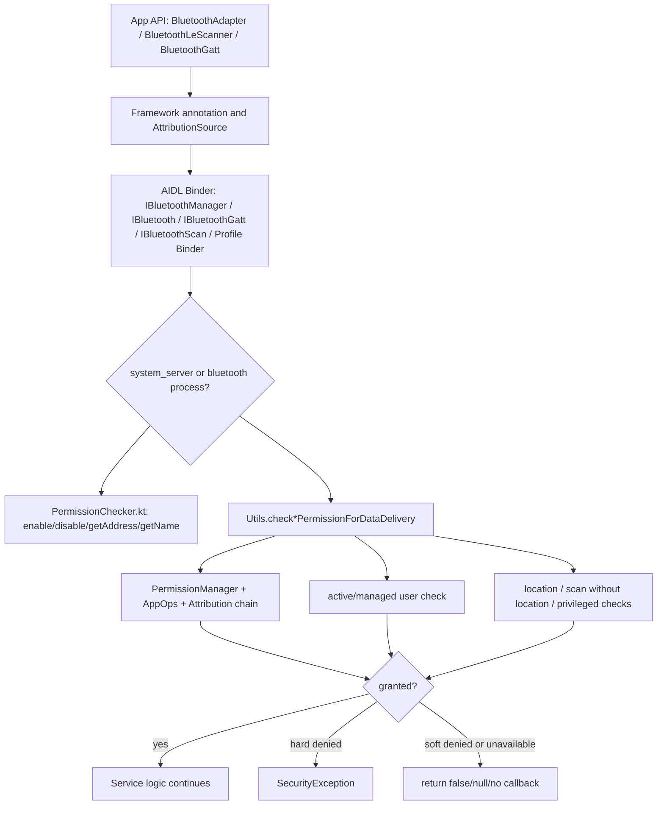

# 19-定向代码阅读报告：Permission / AppOps

## 1. 阅读目标

本报告聚焦蓝牙 Framework 的权限、AppOps、`AttributionSource`、Binder 调用方身份和多用户边界。蓝牙问题里“没有回调”“扫描为空”“连接失败”经常不是协议问题，而是请求在 Binder 服务层被权限检查静默丢弃或软拒绝。

读完后要能定位：

- App 有蓝牙权限但 BLE scan 没结果。
- 三方 App 调用 GATT connect、read/write、Profile API 没反应。
- 系统 App 能打开蓝牙，普通 App 不能打开/关闭。
- 车机多用户、托管用户、后台应用、位置权限、`neverForLocation` 导致行为不一致。

## 2. 适用场景

- BLE Scan、GATT、Classic Discovery、Profile connect/query 权限失败。
- 车厂 App 需要系统权限、priv-app 白名单、签名权限或 `BLUETOOTH_PRIVILEGED`。
- 将蓝牙能力开放给业务 App，需要判断用公开 API、系统 API 还是自定义 system service。
- 分析 bugreport 中 `SecurityException`、permission soft denied、AppOps denied、active user denied。

## 3. 调用链全景图



核心判断：Framework 注解告诉调用者“应该具备什么权限”，运行时是否允许要看 Binder 服务层的真实检查。

## 4. 关键类与源码入口

| 层级 | 源码 | 关键入口 |
| --- | --- | --- |
| Framework API 注解 | `framework/java/android/bluetooth/BluetoothAdapter.java` | `@RequiresPermission(BLUETOOTH_CONNECT/SCAN/ADVERTISE)`、`mAttributionSource` |
| BLE Scanner API | `framework/java/android/bluetooth/le/BluetoothLeScanner.java` | `startScan(...)`、`registerScanner(...)`、`mAttributionSource` |
| Advertiser API | `framework/java/android/bluetooth/le/BluetoothLeAdvertiser.java` | `BLUETOOTH_ADVERTISE` 与 privileged advertise API |
| system_server 权限 | `service/src/PermissionChecker.kt` | `enableAllowed(...)`、`disableAllowed(...)`、`getAddressAllowed(...)`、`enforceConnectPermission(...)` |
| system_server Binder | `service/src/com/android/server/bluetooth/BluetoothServiceBinder.java` | enable/disable/getAddress/getName 等入口 |
| 蓝牙进程工具 | `android/app/src/com/android/bluetooth/Utils.java` | `checkConnectPermissionForDataDelivery(...)`、`checkScanPermissionForDataDelivery(...)`、`checkAdvertisePermissionForDataDelivery(...)`、`callerIsSystemOrActiveOrManagedUser(...)` |
| GATT Binder | `android/app/src/com/android/bluetooth/gatt/GattServiceBinder.java` | `getServiceAndEnforceConnect(...)`、HID characteristic privileged 检查 |
| Scan Binder | `android/app/src/com/android/bluetooth/le_scan/ScanBinder.kt` | `checkScanPermissionForDataDelivery(...)`、scan settings/filter privileged 检查 |
| Scan Controller | `android/app/src/com/android/bluetooth/le_scan/ScanController.java` | AppOps package 校验、位置权限、scan-without-location、target SDK 差异 |
| Profile Binder | `android/app/src/com/android/bluetooth/*/*ServiceBinder.java` | 每个 Profile 的 connect/query/set policy 权限检查 |

## 5. 权限模型分层

| 权限/边界 | 典型用途 | 失败表现 |
| --- | --- | --- |
| `BLUETOOTH_CONNECT` | 连接、查询已连接设备、GATT connect/read/write、Profile API | GATT/Profile 调用被拒或无回调 |
| `BLUETOOTH_SCAN` | BLE scan、Classic discovery、扫描结果广播 | scan 注册失败、结果为空、发现广播不可见 |
| `BLUETOOTH_ADVERTISE` | BLE advertise | advertise start 失败 |
| `BLUETOOTH_PRIVILEGED` | 系统级能力、连接策略、特殊 scan/filter、HID 受保护数据 | 三方 App 调用直接失败或抛异常 |
| `LOCAL_MAC_ADDRESS` | 读取本机蓝牙地址 | `getAddress()` 被拒 |
| 位置权限 | BLE scan 与位置相关结果 | 有 scan 权限但过滤/结果受限 |
| active/managed user | 当前用户或托管用户约束 | 多用户车机上后台用户调用被拒 |
| AppOps/Attribution | 数据交付审计、链式归因 | 权限看似 granted，但 data delivery soft denied |

## 6. system_server 权限检查

`PermissionChecker.kt` 主要覆盖管理层 API：

- `enableAllowed(source, foregroundRequired)` / `disableAllowed(...)`：检查蓝牙用户限制、特殊 UID、包名归属、前台用户、兼容变更和 `BLUETOOTH_CONNECT`。
- `getAddressAllowed(...)`：除 `BLUETOOTH_CONNECT` 外，还检查前台用户和 `LOCAL_MAC_ADDRESS`。
- `getNameAllowed(...)`：检查 `BLUETOOTH_CONNECT` 和前台用户。
- `enforcePrivileged(uid)`：检查 `BLUETOOTH_PRIVILEGED`。

开关机的特别点：

- system/root/shell/NFC 等特殊 UID 有旁路。
- 普通应用会受到 `RESTRICT_ENABLE_DISABLE` 兼容变更和前台要求影响。
- Device Owner / Profile Owner / privileged / system app 有豁免逻辑。

## 7. 蓝牙进程权限检查

`Utils.java` 是蓝牙进程内的权限工具中心：

- `checkConnectPermissionForDataDelivery(...)`：用于 GATT、Profile、socket、设备查询等连接类数据。
- `checkScanPermissionForDataDelivery(...)`：用于 BLE scan、Classic discovery、scan result 交付。
- `checkAdvertisePermissionForDataDelivery(...)`：用于 BLE advertise。
- `callerIsSystemOrActiveOrManagedUser(...)`：用于限制非当前用户调用。
- `checkCallerHasFineLocation(...)`、`checkCallerHasScanWithoutLocationPermission(...)`、`checkCallerHasNetworkSettingsPermission(...)`：用于 scan 结果、定位与系统豁免。

`DataDelivery` 与 `Preflight` 的区别：

- Preflight 更像“能不能尝试调用”。
- Data delivery 代表要把蓝牙数据交给调用方，会走更完整的 attribution/AppOps 审计。

## 8. BLE Scan 权限重点

BLE Scan 是最容易踩权限坑的模块：

```text
BluetoothLeScanner.startScan(...)
  -> IBluetoothScan.startScan(..., AttributionSource)
  -> ScanBinder.getController(...)
  -> checkScanPermissionForDataDelivery(...)
  -> ScanController.startScan(...)
  -> AppOps / location / target SDK / scan setting checks
```

重点规则：

- `BLUETOOTH_SCAN` 是基础门槛。
- 某些 scan 结果仍与位置相关，位置权限或 `neverForLocation` 会影响可见结果。
- `ScanBinder.needsPrivilegedPermissionForScan(...)` 会对 BLE-only 状态、ambient discovery、batch truncated 等场景要求 `BLUETOOTH_PRIVILEGED`。
- `ScanFilter` 使用非公开地址类型/IRK 等系统 API 时也会要求 privileged。
- `ScanController` 会做包名/AppOps 校验和 target SDK 差异处理。

## 9. GATT / Profile 权限重点

GATT Binder 的常见模式：

```text
GattServiceBinder.getServiceAndEnforceConnect(source)
  -> checkServiceAvailable(...)
  -> checkConnectPermissionForDataDelivery(...)
  -> GattService.xxx(...)
```

特点：

- GATT client connect、disconnect、service discovery、read/write、notify 注册都要求 `BLUETOOTH_CONNECT`。
- 读取 HID 相关 characteristic 可能额外要求 `BLUETOOTH_PRIVILEGED`，且会根据 target SDK 决定抛异常还是静默返回。
- Profile Binder 通常先检查 service available、active/managed user、connect permission，再进入业务方法。
- set connection policy、active device、SCO、特殊音频路由等常要求 `BLUETOOTH_PRIVILEGED`、`MODIFY_PHONE_STATE` 或系统签名权限。

## 10. Binder 边界与调用方身份

权限排查时一定要记录：

- Binder 调用方 UID、packageName、userId。
- `AttributionSource` 链条是否正确传递。
- 调用是否来自当前前台用户或其托管用户。
- App target SDK，旧应用可能是兼容返回，新应用直接抛异常。
- 是公开 API、SystemApi、hidden API，还是车厂自定义 Binder。

典型误判：系统 App 在源码里调用成功，不代表量产 APK 能成功。是否放在 `/system/priv-app`、是否有 privapp-permissions 白名单、是否平台签名、是否属于当前用户，都要同时成立。

## 11. 可能失败点

| 现象 | 可能原因 | 观察点 |
| --- | --- | --- |
| `startScan()` 成功但无结果 | location/AppOps/scan setting 限制，或结果被过滤 | `ScanBinder`、`ScanController`、AppOps、target SDK |
| `connectGatt()` 无回调 | `BLUETOOTH_CONNECT` data delivery 被拒，或 service unavailable | `GattServiceBinder.getServiceAndEnforceConnect` |
| 普通 App 不能开蓝牙 | enable/disable 受 compat、前台、系统/DO/PO/privileged 限制 | `PermissionChecker.enableAllowed/disableAllowed` |
| `getAddress()` 返回默认/失败 | 缺 `LOCAL_MAC_ADDRESS` 或非前台用户 | `PermissionChecker.getAddressAllowed` |
| Profile set policy 失败 | 缺 `BLUETOOTH_PRIVILEGED` | 对应 `*ServiceBinder.setConnectionPolicy` |
| 车机多用户调用失败 | 非 active/managed user | `callerIsSystemOrActiveOrManagedUser`、`ActivityManager.getCurrentUser()` |

## 12. 调试建议

常用命令：

```bash
adb shell dumpsys package <package>
adb shell appops get <package>
adb shell dumpsys bluetooth_manager
adb shell dumpsys bluetooth
adb logcat -b all -v threadtime | grep -E "PermissionChecker|BluetoothServiceBinder|GattServiceBinder|ScanBinder|ScanController|AppOps|SecurityException"
```

排查顺序：

1. 确认 App manifest 是否声明目标权限。
2. 确认运行时权限是否 granted。
3. 确认 AppOps 是否 allow。
4. 确认调用方 UID/packageName 与 `AttributionSource` 一致。
5. 确认当前用户、托管用户、后台限制。
6. 确认是否触发 privileged、location、scan-without-location、target SDK 特殊分支。
7. 最后再进入协议层排查。

## 13. 定制修改思路

### 13.1 给车厂 App 开放蓝牙能力

优先级从高到低：

- 使用公开 API 和公开权限。
- 如果必须系统能力，使用平台签名 + priv-app + privapp-permissions 白名单。
- 如果是车厂内部能力，设计专用 system service，由系统服务代为调用蓝牙公开/系统 API。
- 避免直接放宽 `Utils.check*PermissionForDataDelivery`，那会影响所有 App。

### 13.2 BLE 扫描白名单

建议不要绕过 `BLUETOOTH_SCAN`。可以做：

- 明确业务是否需要位置相关广播内容。
- 对系统级扫描使用 privileged/system UID，并在 dumpsys 记录调用方。
- 对后台长扫增加速率限制和功耗审计。
- 对特定车厂 App 增加可配置白名单时，必须同时输出日志和安全评审说明。

### 13.3 权限失败可观测性

建议增强：

- 在 Binder 层统一记录 method、uid、package、permission、hard/soft denied。
- 在 `dumpsys bluetooth` 增加最近权限拒绝流水。
- 对 scan/GATT 这类容易“无回调”的路径，返回明确错误码或 callback error，避免业务误判为协议失败。

## 14. 最容易踩的坑

- 只看 manifest，不看运行时权限和 AppOps。
- 三方 App 用了 `BLUETOOTH_SCAN`，但缺位置权限或设置了 `neverForLocation` 后抱怨结果少。
- 把 `@RequiresPermission` 当成运行时检查；真正检查在 Binder 服务侧。
- 忽略 `AttributionSource`，代理服务替 App 调用时归因链断了。
- 车机多用户下只在主用户测试，量产切用户后失败。
- 为一个车厂 App 放宽全局权限工具函数，导致所有 App 权限边界被打开。

## 15. 练习题与参考答案

### 练习 1：BLE 扫描没有结果，但 App 权限界面显示“附近设备已允许”，怎么查？

参考答案：

1. 查 `BLUETOOTH_SCAN` 是否 granted。
2. 查 AppOps：`adb shell appops get <package>`。
3. 查是否需要位置相关结果，是否缺 `ACCESS_FINE_LOCATION` 或使用了 `neverForLocation`。
4. 查 `ScanBinder` 是否因为 scan setting/filter 要求 `BLUETOOTH_PRIVILEGED`。
5. 查 target SDK 分支和后台/屏幕状态策略。
6. 如果权限都通过，再看 scan native/HCI。

### 练习 2：车厂系统 App 调 `BluetoothAdapter.disable(false)` 失败，可能缺什么？

参考答案：

- 至少要有 `BLUETOOTH_CONNECT`。
- `disable(boolean persist)` 还涉及 privileged/system 语义，普通 App 不能随意调用。
- 检查 APK 是否平台签名、是否在 priv-app、是否有 privapp-permissions 白名单。
- 检查是否当前用户、是否被 `RESTRICT_ENABLE_DISABLE` 兼容变更限制。
- 看 `PermissionChecker.disableAllowed(...)` 日志。

### 练习 3：代理服务代表业务 App 调 GATT，为什么要传 `AttributionSource`？

参考答案：

蓝牙数据属于可审计数据交付。代理服务如果只用自己的身份调用，会让权限、AppOps、隐私归因都落到代理服务，既不安全也不利于排查。正确做法是构造包含业务 App 的 attribution 链，让 `PermissionManager.checkPermissionForDataDeliveryFromDataSource(...)` 能审计真实接收方。

## 16. 案例库映射

可沉淀到 `97-真实案例库.md` 的案例：

- 车厂 App 后台 BLE 长扫无结果：权限通过但 AppOps/后台扫描策略限制。
- GATT 读 HID characteristic 被拒：缺 `BLUETOOTH_PRIVILEGED` 且 target SDK 新。
- 多用户车机副用户蓝牙查询失败：active/managed user 检查未通过。
- 量产签名变更后无法设置 Profile connection policy：privileged 权限白名单缺失。
