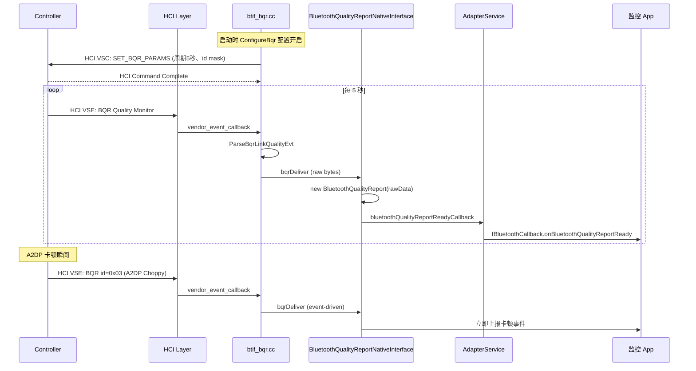

# 19.1 BQR（Bluetooth Quality Report）协议与上报路径

> **速通摘要**：BQR（Bluetooth Quality Report）是 Bluetooth 5.2 规范引入的 **Vendor Specific HCI Event**，让 Controller 主动周期上报链路质量指标（RSSI、SNR、重传次数、缓冲溢出、AFH 信道占用、能量消耗…），Host 端聚合后供应用层使用。Android 通过 `system/btif/src/btif_bqr.cc` 解析 VSE 子事件，通过 `BluetoothQualityReportNativeInterface.java:30` 桥接到 Java，最终由 `BluetoothQualityReport` 类（framework）打包后通过 callback 投递给应用。本节梳理 BQR 子事件类型、解析流程、上报链路。

---

## 学习目标

读完本节后，你能：
1. 列出 BQR 5 大子事件（Quality Monitoring / Approach LSTO / A2DP Audio Choppy / SCO Voice Choppy / Discoverable…）。
2. 找到 BQR Vendor Specific HCI Event 的注册与回调位置。
3. 解释 BQR 从 Controller → btif → JNI → Framework 的完整链路。
4. 知道如何使用 dumpsys / aconfig 开启 BQR 上报。

---

## 前置知识

- [05.5 HCI 层](../05_Native栈基础/05.5_HCI层.md)
- [04 JNI 桥接机制](../04_JNI桥接机制/)

---

## 场景故事

车机刚出 4S 店没几天，用户反馈"开车经过桥洞时蓝牙音乐每次都卡 2-3 秒"。开发想知道：
- 卡的瞬间 RSSI 是多少？
- AFH 自适应跳频有没有避开 WiFi 信道？
- Controller buffer 有没有溢出？
- 是 ACL 重传过多还是 SCO 包丢失？

这些信息**不在 logcat 也不在 btsnoop**——它们存在于 Controller 内部。BQR 就是让 Controller 把这些指标"吐"给 Host 的标准机制。

---

## 一、BQR 是什么

```
┌──────────────────────┐ HCI ┌─────────────────────┐
│   Host (Android)     │ ←── │   Controller        │
│  - btif_bqr.cc       │ VSE │  - 内部统计 RSSI    │
│  - BluetoothQualityReportNativeInterface         │
│  - BluetoothQualityReport (framework)            │
└──────────────────────┘     └─────────────────────┘
```

- 走 HCI Vendor Specific Event（VSE）通道
- Controller 周期触发（如每 5 秒）或事件驱动（如 Approach LSTO）
- 不属于核心 BT spec，**是 BT SIG 推荐的 Vendor 扩展**（不同芯片厂略有差异）

---

## 二、BQR 子事件类型（Android 实现）

```cpp
// system/btif/src/btif_bqr.cc 包含的事件类型
// （根据 quality_report_id 字段区分）
constexpr uint8_t QUALITY_REPORT_ID_MONITOR_MODE     = 0x01;  // 周期性链路质量
constexpr uint8_t QUALITY_REPORT_ID_APPROACH_LSTO    = 0x02;  // 即将链路超时
constexpr uint8_t QUALITY_REPORT_ID_A2DP_AUDIO_CHOPPY = 0x03; // A2DP 卡顿事件
constexpr uint8_t QUALITY_REPORT_ID_SCO_VOICE_CHOPPY  = 0x04; // SCO 通话卡顿
constexpr uint8_t QUALITY_REPORT_ID_DISCOVERABLE_AUDIO_CHOPPY = 0x05;
constexpr uint8_t QUALITY_REPORT_ID_CONNECT_FAIL      = 0x06;
constexpr uint8_t QUALITY_REPORT_ID_RF_STATS          = 0x07; // 射频统计
constexpr uint8_t QUALITY_REPORT_ID_VENDOR_SPECIFIC   = 0x10;
constexpr uint8_t QUALITY_REPORT_ID_LMP_LL_MESSAGE_TRACE = 0x11;
constexpr uint8_t QUALITY_REPORT_ID_BT_SCHEDULING_TRACE  = 0x12;
constexpr uint8_t QUALITY_REPORT_ID_CONTROLLER_DBG_INFO  = 0x13;
constexpr uint8_t QUALITY_REPORT_ID_ENERGY_MONITOR     = 0x14; // 能量监控
```

最常用的两类：
- **QUALITY_REPORT_ID_MONITOR_MODE (0x01)**：周期性，每 5 秒一次（车机典型），包含 RSSI / SNR / 重传 / AFH / 缓冲
- **QUALITY_REPORT_ID_A2DP_AUDIO_CHOPPY (0x03)**：事件驱动，A2DP 卡顿时 Controller 主动报，用来定位卡顿根因

---

## 三、Quality Monitoring 事件字段（最重要的子事件）

```cpp
// system/btif/src/btif_bqr.cc:79 ParseBqrLinkQualityEvt
// 解析后填充到 bqr_link_quality_event_ 结构体的字段：
struct BqrLinkQualityEvent {
    uint8_t  quality_report_id;            // 0x01
    uint8_t  packet_types;                 // 当前用的 ACL 包类型
    uint16_t connection_handle;            // ACL handle
    uint8_t  connection_role;              // Master/Slave
    int8_t   tx_power_level;               // 本机 TX 功率
    int8_t   rssi;                         // 对端 RSSI
    uint8_t  snr;                          // 信噪比
    uint8_t  unused_afh_channel_count;     // AFH 跳频未使用信道数
    uint8_t  afh_select_unideal_channel_count; // AFH 选了不理想信道数
    uint16_t lsto;                         // Link Supervision Timeout
    uint32_t connection_piconet_clock;
    uint32_t retransmission_count;         // ⭐ 重传次数
    uint32_t no_rx_count;                  // ⭐ 应收没收的次数
    uint32_t nak_count;                    // NAK 次数
    uint32_t last_tx_ack_timestamp;
    uint32_t flow_off_count;
    uint32_t last_flow_on_timestamp;
    uint32_t buffer_overflow_bytes;        // ⭐ Controller 缓冲溢出
    uint32_t buffer_underflow_bytes;       // Controller 缓冲下溢

    // BQR v5.0 新增
    RawAddress bdaddr;
    uint8_t    cal_failed_item_count;

    // BQR ISO（LE Audio 相关）新增
    uint32_t tx_total_packets;
    uint32_t tx_unacked_packets;
    uint32_t tx_flushed_packets;
    uint32_t tx_last_subevent_packets;
    uint32_t crc_error_packets;
    uint32_t rx_duplicate_packets;

    // BQR v6.0 新增
    uint32_t rx_unreceived_packets;
    uint16_t coex_info_mask;               // 与 WiFi 共存信息
};
```

**车机诊断的关键字段**：
- `rssi` 突变 → 信号衰减（穿桥洞）
- `retransmission_count` 飙升 → 干扰严重
- `buffer_overflow_bytes` > 0 → Controller 处理不过来
- `crc_error_packets` 多 → 物理层干扰（WiFi、微波炉）

---

## 四、上报链路

### 4.1 Native 层：注册 VSE Handler

```cpp
// system/btif/src/btif_bqr.cc:473
void EnableBtQualityReport(common::PostableContext* to_bind) {
    // 注册 VSE Sub-Event 回调到 HCI 层
    // 上行 VSE Event 到达时，进入 BqrVseSubEvt::ParseBqrLinkQualityEvt 等解析
}

// :495
void ConfigureBqr(const BqrConfiguration& bqr_config) {
    // 通过 Vendor Specific HCI Command 配置 Controller：
    // - 上报哪些 quality_report_id
    // - 上报周期
    // - 阈值
}
```

### 4.2 解析 → 上报

```
[Controller VSE Event]
     ↓ HCI
hci_event_handler / vendor_event
     ↓
btif_bqr.cc: 根据 quality_report_id 分发
     ↓
ParseBqrLinkQualityEvt / ParseBqrEnergyMonitorEvt / ParseBqrRFStatsEvt
     ↓
存到 BqrVseSubEvt 对象
     ↓
BluetoothQualityReportInterfaceImpl::bqrDeliver (btif_bqr.cc:981)
     ↓ JNI
android/app/src/com/android/bluetooth/btservice/BluetoothQualityReportNativeInterface.java:54
private void bqrDeliver(byte[] remoteAddr, int lmpVer, int lmpSubVer, int manufacturerId, byte[] bqrRawData)
     ↓
new BluetoothQualityReport.Builder(bqrRawData)...build()  ← framework 类
     ↓
AdapterService.bluetoothQualityReportReadyCallback(device, bqr)
     ↓
通过 IBluetoothCallback → 监听该回调的 system App / OEM 监控 App
```

### 4.3 Java 桥接代码

```java
// android/app/src/com/android/bluetooth/btservice/BluetoothQualityReportNativeInterface.java:30
public class BluetoothQualityReportNativeInterface {

    // :44 init/cleanup
    void init() { initNative(); }
    void cleanup() { cleanupNative(); }

    // :54 来自 native 的回调（每次 BQR 事件触发）
    private void bqrDeliver(byte[] remoteAddr, int lmpVer, int lmpSubVer,
                             int manufacturerId, byte[] bqrRawData) {
        String remoteAddress = Utils.getAddressStringFromByte(remoteAddr);
        BluetoothDevice device = mAdapterService.getRemoteDevice(remoteAddress);
        BluetoothClass remoteClass = new BluetoothClass(mAdapterService.getRemoteClass(device));

        // :67 用 Builder 模式封装
        BluetoothQualityReport bqr = new BluetoothQualityReport.Builder(bqrRawData)
                .setRemoteAddress(remoteAddress)
                .setLmpVersion(lmpVer)
                .setLmpSubVersion(lmpSubVer)
                .setManufacturerId(manufacturerId)
                .setRemoteName(mAdapterService.getRemoteName(device))
                .setBluetoothClass(remoteClass)
                .build();

        // :83 投递给 AdapterService
        mAdapterService.bluetoothQualityReportReadyCallback(device, bqr);
    }

    private native void initNative();
    private native void cleanupNative();
}
```

---

## 五、Mermaid：BQR 端到端时序



---

## 六、调试方法

```bash
# 看 BQR 配置/状态
adb shell dumpsys bluetooth_manager | grep -A 10 -i "bqr"

# logcat 查 BQR 解析日志
adb logcat -s bluetooth-quality-report:V BluetoothQualityReport:V \
          BluetoothQualityReportNativeInterface:V

# 看 btif_bqr 解析日志（native）
adb logcat -s bt_btif_bqr:V

# 触发一次 BQR Vendor Capability 查询
# （需要 root 或 system app 权限）
adb shell dumpsys bluetooth_manager | grep -i "vendor_cap_supported_version"

# 看是否支持各 BQR 版本
adb shell dumpsys bluetooth_manager | grep -E "kBqrVersion|bqr_supported"

# btsnoop 抓 VSE Event
# Wireshark filter: btvendor 或者 hci_h4.type == 0x04 && hci_evt.opcode == 0xff
```

---

## 七、aconfig flag 与 sysprop

```bash
# 是否启用 BQR
adb shell device_config get bluetooth bqr_enabled

# BQR 上报间隔（毫秒）
adb shell device_config get bluetooth bqr_quality_monitor_interval_ms

# BQR 上报哪些 quality_report_id
adb shell device_config get bluetooth bqr_quality_report_id_mask
```

车机通常会调小上报间隔（1-2 秒）以便快速发现问题；商用机为节省日志/电量保持 5-10 秒。

---

## 八、车机用例

### 8.1 实时监控大屏
车机厂可以写一个系统级 App 订阅 `IBluetoothCallback.onBluetoothQualityReportReady`，在工程模式下显示实时 RSSI / 重传曲线，帮助调试。

### 8.2 自动降级策略
当 `rssi < -80 dBm` 持续 10 秒：
- A2DP 自动从 LDAC 降到 SBC
- LE Audio Unicast 切到更低码率 LC3 配置
- 这是车机厂的差异化能力（AOSP 默认不做）

### 8.3 故障数据采集
车机厂可以把 BQR 事件 + 时间戳写入 sql.db 或 statsd，用户报障时上传，工程师快速定位"卡顿瞬间的 RF 状况"。

---

## FAQ

**Q1：BQR 一定是 Vendor 扩展吗？标准 BT spec 里有吗？**
BQR 的格式是 BT SIG 定义的（QSG, Quality Statistics Group），但**传输通道用的是 Vendor Specific HCI Event**（不同芯片厂的 VSE Opcode 不同）。所以本质是"标准内容 + 厂商封装"。

**Q2：所有蓝牙芯片都支持 BQR 吗？**
否。需要 Controller 固件支持 + Android 端 vendor lib 支持。低端芯片（如老款 RTL8723）不支持；主流芯片（QCA6390 等高通系、CYW43xxx 等 Cypress 系、UWB7800 等联发科）支持。Android `vendor_cap_supported_version` 字段记录芯片支持哪个 BQR 版本。

**Q3：BQR 与 dumpsys metrics 的区别？**
- BQR：**Controller 内部统计**，实时反映 RF/链路状态
- dumpsys metrics（Statsd）：**Host 端统计**，连接/断开/卡顿计数等
两者互补：BQR 看微观，metrics 看宏观。

**Q4：BQR 上报会影响功耗吗？**
会，但很轻微：每秒/每5秒一次 HCI Event，Host CPU 消耗 < 1%。如果生产环境节能，把周期调大到 10-30 秒即可。

---

## 上路任务

1. 打开 `system/btif/src/btif_bqr.cc:79`，把 `BqrLinkQualityEvent` 结构体字段抄下来，理解每个字段对应的物理含义。
2. 在 `android/app/src/com/android/bluetooth/btservice/BluetoothQualityReportNativeInterface.java:54` 加一行 `Log.i(TAG, "RSSI=" + bqr.getQualityReport().getRssi());` 重新编译，调试 BQR 实时数据。
3. 用 `adb shell dumpsys bluetooth_manager | grep -i bqr` 看本机是否启用 BQR；如关闭，找到对应 `device_config` 开启它。
