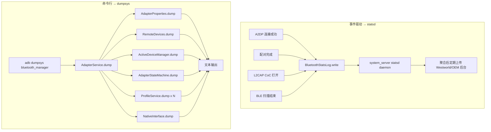

# 19.2 Statsd 蓝牙指标 + dumpsys metrics

> **速通摘要**：Android 通过两套机制收集蓝牙运行指标——① **Statsd**（系统级 atom 上报）：`MetricsLogger.java:113` 单例统一封装，调用 `BluetoothStatsLog.write(...)` 把事件以预定义 atom 形式发给 system_server 的 statsd 守护进程，最后汇入 Google Westworld / OEM 自有 BI；② **dumpsys**：本地 on-demand 快照，`AdapterService.java:4369 dump()` 串联 AdapterProperties / RemoteDevices / ActiveDeviceManager / AdapterStateMachine / 各 ProfileService / NativeInterface 的 dump 方法，输出文本给 `adb shell dumpsys bluetooth_manager`。前者跨设备聚合，后者单机即时诊断。本节梳理两者的 atom 定义、关键调用点、车机用例。

---

## 学习目标

读完本节后，你能：
1. 列出 5 类核心 Statsd atom：连接状态变化、配对、设备名上报、扫描、CoC。
2. 找到 `BluetoothStatsLog.write` 在 stack 中的关键调用点。
3. 看懂 `dumpsys bluetooth_manager` 输出的层次结构。
4. 解释 `getMetricId` 隐私机制（用整数替代真实 MAC）。

---

## 前置知识

- [03 核心流程](../03_核心流程/)
- [19.1 BQR](19.1_BQR协议与上报路径.md)
- 了解 Android Statsd 基础（atom = 一条结构化事件）

---

## 场景故事

车机厂希望知道全国 100 万台车机里 A2DP 连接平均花多久、HFP SCO 失败率多高、哪类手机配对失败最多。这种"宏观分布"指标不可能靠 logcat 抓——抓回来谁分析？答案是：把每次连接的关键事件、时长、错误码写成 statsd atom，让 OEM 数据后台聚合。

而当某一台车上报"我蓝牙开不了"，车间工程师又需要在 30 秒内看到当下状态——这就是 `dumpsys bluetooth_manager`。

---

## 一、两套机制对比

| 维度 | Statsd | dumpsys |
|------|--------|---------|
| 触发 | 事件驱动（连接、配对、扫描时） | 命令行 on-demand |
| 存储 | system_server statsd daemon，定期上传 | 仅当前快照（不持久化） |
| 隐私 | 必须脱敏（hashedMac） | 包含完整 MAC（仅本地可见） |
| 聚合 | 跨设备、跨用户 | 单机 |
| 受众 | OEM 后台 / Google | 现场工程师 |
| 文件 | `MetricsLogger.java` | `AdapterService.dump()` |

---

## 二、Statsd 关键 atom 列表（Android 16）

```java
// 来自 com.android.bluetooth.BluetoothStatsLog 常量（外部生成）
// 各业务模块按需调 write()

BLUETOOTH_CONNECTION_STATE_CHANGED    // 任意 Profile 连接状态变化
BLUETOOTH_DEVICE_NAME_REPORTED        // 设备名（受白名单）
BLUETOOTH_HASHED_DEVICE_NAME_REPORTED // 设备名 sha256
BLUETOOTH_CROSS_LAYER_EVENT_REPORTED  // 跨层事件（配对、连接关联）
BLUETOOTH_L2CAP_COC_SERVER_CONNECTION // L2CAP CoC 服务端
BLUETOOTH_L2CAP_COC_CLIENT_CONNECTION // L2CAP CoC 客户端
BLUETOOTH_CODE_PATH_COUNTER           // 代码路径计数器
BLUETOOTH_DEVICE_INFO_REPORTED        // 设备 OUI、Class
BLUETOOTH_BOND_STATE_CHANGED          // 配对状态变化
LE_APP_SCAN_STATE_CHANGED             // BLE App 扫描开关
LE_RADIO_SCAN_STOPPED                 // 物理 radio 扫描结束
LE_ADV_STATE_CHANGED                  // BLE 广播开关
HEARING_DEVICE_ACTIVE_EVENT_REPORTED  // 助听器活跃时间
CHANNEL_SOUNDING_TYPES_SUPPORTED      // BLE 5.4 测距能力
```

> 完整 atom 列表见 AOSP `frameworks/proto_logging/stats/atoms/bluetooth/*.proto`（外部依赖）。

---

## 三、`MetricsLogger.java` 拆解

```java
// android/app/src/com/android/bluetooth/btservice/MetricsLogger.java:113
public class MetricsLogger {
    private static volatile MetricsLogger sInstance = null;
    private HashMap<Integer, Long> mCounters = new HashMap<>();           // :127
    // 6 小时定时把 mCounters 批量 drain 到 statsd
    private static final long BLUETOOTH_COUNTER_METRICS_ACTION_DURATION_MILLIS = 6L * 3600L * 1000L;

    public static MetricsLogger getInstance() { /* :147 单例 */ }

    void init(AdapterService adapterService, RemoteDevices remoteDevices) {  // :251
        mAdapterService = adapterService;
        mRemoteDevices = remoteDevices;
        scheduleDrains();                       // 起 AlarmManager 周期 drain
        initBloomFilter(BLOOMFILTER_FULL_PATH); // 加载设备名白名单 Bloom filter
        initMedicalDeviceBloomFilter(...);
        // :271 监听所有 Profile 连接广播
        filter.addAction(BluetoothA2dp.ACTION_CONNECTION_STATE_CHANGED);
        filter.addAction(BluetoothHeadset.ACTION_CONNECTION_STATE_CHANGED);
        // ... 共 16 个 ACTION_CONNECTION_STATE_CHANGED
        mAdapterService.registerReceiver(mReceiver, filter);
    }

    // :372 处理所有 Profile 连接变化的统一入口
    private void logConnectionStateChanges(int profile, Intent connIntent) {
        BluetoothDevice device = connIntent.getParcelableExtra(BluetoothDevice.EXTRA_DEVICE);
        int state = connIntent.getIntExtra(BluetoothProfile.EXTRA_STATE, -1);
        int metricId = mAdapterService.getMetricId(device);          // 关键：用整数替代 MAC
        if (state == STATE_CONNECTING) {
            String deviceName = mRemoteDevices.getName(device);
            BluetoothStatsLog.write(
                BluetoothStatsLog.BLUETOOTH_DEVICE_NAME_REPORTED, metricId, deviceName);
            logAllowlistedDeviceNameHash(metricId, deviceName);     // sha256 上报
        }
        BluetoothStatsLog.write(
            BluetoothStatsLog.BLUETOOTH_CONNECTION_STATE_CHANGED,
            state, 0, profile,
            mAdapterService.obfuscateAddress(device),  // ⭐ 用 AES 脱敏 MAC
            metricId, 0, -1);
    }

    public boolean count(int key, long count) {                     // :431
        // 计数类指标：每次累加，6 小时一次性 drain
        BluetoothStatsLog.write(BluetoothStatsLog.BLUETOOTH_CODE_PATH_COUNTER, key, count);
        return true;
    }

    protected void drainBufferedCounters() {                         // :444
        synchronized (sLock) {
            for (int key : mCounters.keySet()) count(key, mCounters.get(key));
            mCounters.clear();
        }
    }
}
```

### 3.1 关键设计：BloomFilter 设备名脱敏

```java
// 只允许"已知设备厂商列表"中的名字明文上报
// 比如 "BMW 5er-X" 在 BloomFilter 中 → 报明文
// 否则只报 sha256 hash
protected void statslogBluetoothDeviceNames(int metricId, String matchedString) {
    String sha256 = getSha256String(matchedString);
    BluetoothStatsLog.write(
        BluetoothStatsLog.BLUETOOTH_HASHED_DEVICE_NAME_REPORTED, metricId, sha256);   // :778
}
```

车机自定义设备（如"老张的小米手机"）永远进不了 BloomFilter，故只上报 hash——这是 GDPR / Android 隐私合规要求。

---

## 四、`getMetricId`：用整数替代真实 MAC

```cpp
// system/metrics/src/metric_id_manager.h:31
class MetricIdManager {
    // 内存中维护 Address → id 的映射
    // 配对设备的 id 持久化到 btif_config.conf
    // 已配对设备：kMinId..kMaxId（如 1..2147483646）
    // 未配对临时：单独范围

    bool Init(const std::unordered_map<hci::Address, int>& paired_device_map,
              Callback save_id_callback,        // id 分配后写入 btif_config
              Callback forget_device_callback); // unpair 时清除 id

    static const size_t kMaxNumUnpairedDevicesInMemory;
    static const size_t kMaxNumPairedDevicesInMemory;
};
```

```java
// AdapterService.java:4769
public int getMetricId(BluetoothDevice device) {
    return mNativeInterface.getMetricId(Utils.getByteAddress(device));
}
```

**为什么不直接上报 MAC？**
- MAC 是 PII（个人可识别信息）→ Google Play Protect / GDPR 禁止上报
- 用 metricId（int）替代后：可以追踪"同一台设备的多次连接"，但不能反查到具体哪部手机
- forget 设备时 metricId 也被释放，进一步切断关联

---

## 五、各 Profile 的 statsd 调用点（示例）

```java
// A2dpStateMachine.java:284  - 连接成功时
BluetoothStatsLog.write(
    BluetoothStatsLog.BLUETOOTH_A2DP_PLAYBACK_STATE_CHANGED, ...);

// BondStateMachine.java:421  - 配对成功
BluetoothStatsLog.write(
    BluetoothStatsLog.BLUETOOTH_BOND_STATE_CHANGED, ...);

// HeadsetStateMachine.java:385  - HFP SCO 状态变化
BluetoothStatsLog.write(
    BluetoothStatsLog.BLUETOOTH_SCO_CONNECTION_STATE_CHANGED, ...);

// GattService.java:2738  - GATT 操作
BluetoothStatsLog.write(
    BluetoothStatsLog.BLUETOOTH_LE_SESSION_CONNECTED, ...);

// AdapterService.java:1551  - L2CAP CoC 服务端连接
BluetoothStatsLog.write(
    BluetoothStatsLog.BLUETOOTH_L2CAP_COC_SERVER_CONNECTION,
    mAdapterService.obfuscateAddress(device),
    metricId,
    /* port */ psm,
    /* result */ ...);
```

---

## 六、`dumpsys bluetooth_manager` 结构

```java
// AdapterService.java:4369
protected void dump(FileDescriptor fd, PrintWriter writer, String[] args) {
    if (args.length == 0) {
        writer.println("Skipping dump in APP SERVICES, see bluetooth_manager section.");
        return;
    }
    // ↓ 顺序输出每个子模块
    mAdapterSuspend.dump(fd, writer, args);            // :4387 Suspend 状态
    mAdapterProperties.dump(fd, writer, args);          // :4391 地址、名字、Class、UUIDs
    mRemoteDevices.dump(writer);                        // :4392 所有已知远端设备
    mActiveDeviceManager.dump(writer);                  // :4394 当前活跃设备
    writer.println("ScanMode: " + scanModeName(getScanMode()));
    writer.println("sSnoopLogSettingAtEnable = " + sSnoopLogSettingAtEnable);

    writer.println("Enabled Profile Services:");         // :4406 列已加载的 Profile
    for (int profileId : Config.getSupportedProfiles()) {
        writer.println("  " + BluetoothProfile.getProfileName(profileId));
    }

    mAdapterStateMachine.dump(fd, writer, args);        // :4418 适配器状态机
    mSilenceDeviceManager.dump(stringBuilder);          // :4422
    mDatabaseManager.dump(stringBuilder);               // :4423 配对设备数据库

    for (ProfileService profile : mRegisteredProfiles) {  // :4425 每个 Profile 自己 dump
        profile.dump(stringBuilder);
    }

    final var scanController = getBluetoothScanController();
    if (scanController != null) {
        scanController.forceRunSyncOnScanThread(() -> scanController.dump(stringBuilder));
    }

    writer.write(stringBuilder.toString());

    if (currentState != STATE_OFF && ...) {
        mNativeInterface.dump(fd, args);                // :4447 ⭐ Native 栈 dump
    }
}
```

### 典型输出（节选）

```
$ adb shell dumpsys bluetooth_manager
Bluetooth Status
  enabled: true
  state: ON
  address: XX:XX:XX:XX:XX:XX
  name: Pixel 8
  Foreground User: 0

ScanMode: SCAN_MODE_CONNECTABLE

Enabled Profile Services:
  HEADSET
  A2DP
  HID_HOST
  PAN
  GATT
  AVRCP
  ...

AdapterStateMachine: ON
  Total transitions: 14
    [...]

A2dpService:
  mCurrentDevice = XX:XX:XX:XX:XX:01
  mCodec = LDAC
  ...

[Native Stack Dump]
  HCI stats:
    Tx commands: 1428
    Rx events: 1539
  L2CAP channels: 5
  ...
```

---

## 七、Mermaid：Statsd vs dumpsys



---

## 八、调试方法

```bash
# 完整 dumpsys
adb shell dumpsys bluetooth_manager

# 只看 BMS（system_server 端的 Kotlin BMS）
adb shell dumpsys bluetooth_manager | head -100

# 只看 AdapterService（需 --print 触发）
adb shell dumpsys activity service com.android.bluetooth/.btservice.AdapterService --print

# 只看 A2DP 状态
adb shell dumpsys bluetooth_manager | grep -A 20 "A2dpService"

# 看 Statsd atom 实时上报（需 root）
adb shell cmd stats print-stats
adb shell cmd stats dump-report

# 触发一次 statsd 收集
adb shell statsd_testdrive 9999

# 查看蓝牙 atom 历史（root + statsd-cli）
adb shell statsd-cli pull com.google.android.bluetooth.connectionstatechanged

# 看 MetricsLogger 日志
adb logcat -s MetricsLogger:V

# 看 ServiceMetrics 调试
adb shell setprop persist.log.tag.MetricsLogger DEBUG

# 查看 metric_id 映射（root）
adb shell cat /data/misc/bluedroid/bt_config.conf | grep -i metric_id
```

---

## 九、车机典型用法

### 9.1 OEM 监控大盘

```
后端 BI 聚合的关键 atom：
- BLUETOOTH_CONNECTION_STATE_CHANGED → 连接成功率
- BLUETOOTH_BOND_STATE_CHANGED → 配对失败比例
- BLUETOOTH_SCO_CONNECTION_STATE_CHANGED → HFP 通话建立时长
- BLUETOOTH_CODE_PATH_COUNTER → 代码路径异常次数

可以看出"某市某型号车机的 HFP 失败率高于全国平均"，定位到固件版本问题。
```

### 9.2 4S 店现场诊断

```bash
# 蓝牙工程师到现场，电脑接车机 adb：
adb shell dumpsys bluetooth_manager > bt.log
adb logcat -b all -d > full.log
adb pull /data/misc/bluetooth/logs/btsnoop_hci.log

# 用 dumpsys 一眼看到当前 state、active device、连接历史
# 用 logcat 看故障瞬间日志
# 用 btsnoop 在 Wireshark 中重现 HCI 时序
```

### 9.3 OEM 定制 atom

车机厂可以**新增**自己的 Statsd atom（如"蓝牙音乐切歌延迟"），通过：
1. 在 `frameworks/proto_logging/stats/atoms.proto` 加 atom 定义（修 AOSP）
2. 在 Bluetooth 模块代码调 `BluetoothStatsLog.write(MY_ATOM, ...)`
3. 后台 statsd config push 订阅这个 atom
4. BI 系统收数据

---

## FAQ

**Q1：MetricsLogger 单例为什么用 double-check locking？**
经典并发模式：`if(sInstance==null) { synchronized(sLock) { if(sInstance==null) sInstance = new MetricsLogger(); } }`。volatile + double-check 既保证只构造一次，又避免每次 getInstance 都加锁。

**Q2：obfuscateAddress 用什么算法？**
HMAC-SHA1（key 是设备唯一秘钥），不是 base64 / xor 等弱混淆。即使后台拿到 obfuscated address，也无法反推真实 MAC。

**Q3：Statsd atom 上报频率会影响电量吗？**
极小。所有 atom 先在 statsd daemon 累积，按规则 batch 上传（默认 24h 一次）。代码路径计数器还有 6 小时的本地累计层（`MetricsLogger.mCounters`），进一步减少跨进程开销。

**Q4：dumpsys 内容如何脱敏？**
dumpsys 默认包含完整 MAC——只在本地 `adb` 可见，被认为是 trusted 环境。如果要把 dumpsys 上传到云端，OEM 必须自己做脱敏（如正则替换 `XX:XX:XX:XX:XX:XX`）。

**Q5：为什么 PAN / OPP / SAP 没有 statsd 调用？**
不是没有——是统一通过 `MetricsLogger.logConnectionStateChanges()`（监听 broadcast）处理，不需要在每个 Service 里单独调 write。看 `MetricsLogger.java:271-289` 注册的 Action 列表，PAN/SAP/OPP 都包含在内。

---

## 上路任务

1. 打开 `MetricsLogger.java:372`，把 `logConnectionStateChanges` 完整读一遍。理解 `metricId` 与 `obfuscateAddress(device)` 的双重身份机制。
2. 在 `AdapterService.java:4369` 找到 `dump` 方法，列出它依次调用的 7 个子模块的 dump，把它们的 file:line 标出来。
3. 用 `adb shell dumpsys bluetooth_manager > bt.log` 抓一次自己手机的 dumpsys，找一找 "Active devices" / "Bond state" / "A2dpService" 三段，理解车机现场排障时该看哪里。
