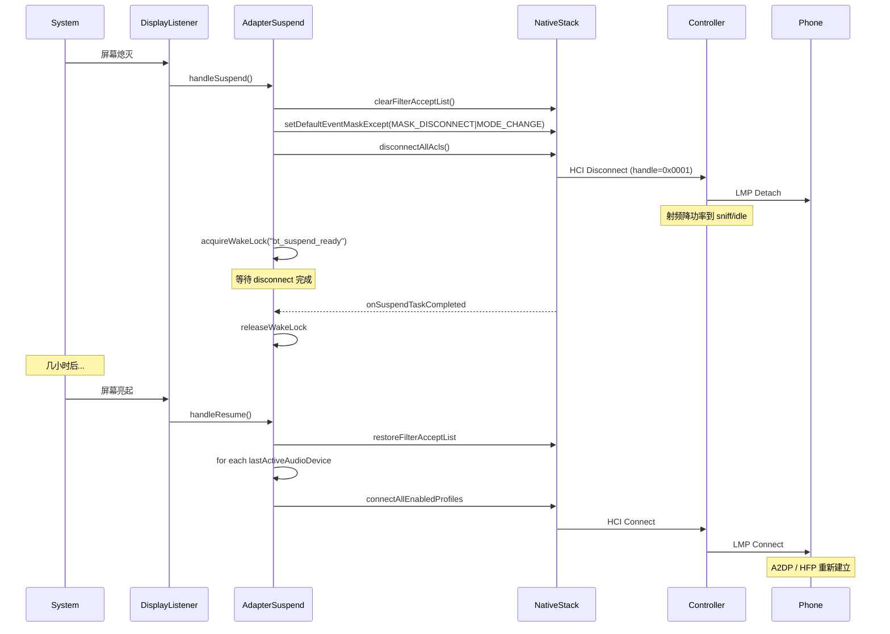

# 19.3 蓝牙功耗分析

> **速通摘要**：蓝牙功耗的"三大金主"——① **持续 BLE 扫描**（低占空比也耗电，被 `BluetoothProtoEnums.LE_SCAN_RADIO_DURATION_*` 量化）；② **SCO/eSCO 通话**（射频持续打开 + Codec 计算）；③ **A2DP 播放**（Codec 编码 + ACL 高速发包）。Android 16 用 `AdapterSuspend.java:55` 在 SystemReady 屏幕灭屏时收紧蓝牙活动：暂停广告、停 LE 扫描、断 ACL、清 filter accept list；屏幕亮时反向恢复。本节梳理功耗来源、suspend/resume 机制、车机的取舍。

---

## 学习目标

读完本节后，你能：
1. 列出蓝牙耗电的 3 大来源（射频、计算、唤醒锁）。
2. 解释 LE 扫描 mode 与功耗的关系（LOW_POWER / BALANCED / LOW_LATENCY）。
3. 看懂 `AdapterSuspend` 在屏幕灭时做哪些动作。
4. 知道 BLE 扫描"加权时长"的计算公式。

---

## 前置知识

- [03.2 设备扫描](../03_核心流程/03.2_设备扫描.md)
- [08.1 BLE 扫描](../08_BLE_GATT/08.1_BLE扫描.md)
- [19.1 BQR](19.1_BQR协议与上报路径.md)（其中 ENERGY_MONITOR 子事件）

---

## 场景故事

车机用户反馈："停车息屏后蓝牙耗电异常，过夜整体掉电 8% 都是蓝牙"——但蓝牙不应该一直在跑啊？打开 `dumpsys batterystats` 一看：
- BLE scan time 6 小时（停车息屏期间）
- A2DP playback 0
- ACL connected to 2 phones whole night

结论：手机端某后台 App（如某外卖、某出行）狂调 startScan，车机端被动响应每次扫描结果都唤醒 CPU。这是典型的"被动功耗"——车机自己没主动用蓝牙，但 BLE 扫描代价被放在了车机上。

---

## 一、蓝牙功耗三大金主

| 来源 | 量级（手机参考） | 车机典型场景 |
|------|------------------|-------------|
| 持续 BLE 扫描（LOW_LATENCY） | 100-300 mW | 手机端寻找手环/Beacon |
| SCO 通话 | 80-150 mW | HFP 蓝牙通话 |
| A2DP 播放（SBC/AAC） | 30-80 mW | 蓝牙音乐 |
| A2DP 播放（LDAC 990k） | 80-150 mW | 高码率音乐 |
| LE Audio 播放 | 15-40 mW | LE 耳机（LC3 高效编码） |
| Idle ACL 连接（无数据） | 5-10 mW | 待机蓝牙保持连接 |
| 蓝牙广播（BLE Adv） | 1-5 mW | 配对模式 / 设备广告 |
| 周期 BQR 上报 | < 1 mW | Controller VSE 事件 |

> **物理本质**：射频 PA（功放）开启耗电最多 → 扫描/通话/A2DP 三者都是"持续射频"。LE Audio 优势在于 ISO 的 SubRate 让射频更精确开关。

---

## 二、LE 扫描 Mode 与权重

```java
// android/app/src/com/android/bluetooth/le_scan/ScanUtil.java（外部依赖）
public static int weightForScanMode(int scanMode) {
    switch (scanMode) {
        case SCAN_MODE_LOW_POWER:    return 5;    // 5%   占空比
        case SCAN_MODE_BALANCED:     return 25;   // 25%
        case SCAN_MODE_LOW_LATENCY:  return 100;  // 100% 全开
        case SCAN_MODE_AMBIENT_DISCOVERY: return 25;
        ...
    }
}
```

```java
// android/app/src/com/android/bluetooth/le_scan/ScanRadioStats.java:140
double scanWeight = ScanUtil.weightForScanMode(mRadioScanMode) * 0.01;
long weightedDuration = (long) (radioScanDuration * scanWeight);
```

**功耗换算**：`实际功耗 ≈ 持续时长 × scanWeight × 单位功耗系数`

例：App 启动 10 分钟 LOW_LATENCY → 实际累计 "10 min × 1.0 = 10 min 满功率"，耗电相当于看 10 分钟视频。

---

## 三、`AdapterSuspend` 屏幕熄灭时省电

```java
// android/app/src/com/android/bluetooth/btservice/AdapterSuspend.java:55
public class AdapterSuspend {
    // :74 4 个 sysprop 控制 suspend 行为
    static final String BLUETOOTH_SUSPEND_DISCONNECT_ACL =
            "bluetooth.power.suspend.disconnect_acl.enabled";
    static final String BLUETOOTH_SUSPEND_SCAN_MODE_NONE =
            "bluetooth.power.suspend.scan_mode_none.enabled";
    static final String BLUETOOTH_SUSPEND_STOP_LE_SCAN =
            "bluetooth.power.suspend.stop_le_scan.enabled";
    static final String BLUETOOTH_SUSPEND_PAUSE_ADVERTISEMENT =
            "bluetooth.power.suspend.pause_advertisement.enabled";

    // :259 屏幕熄灭时进入 suspend
    void handleSuspend(boolean allowWakeByHid) {
        // 1. HCI 事件过滤：只留 disconnect_cmplt 和 mode_change
        long mask = MASK_DISCONNECT_CMPLT | MASK_MODE_CHANGE;   // :260

        // 2. 不可发现：关闭对外可见
        if (mScanModeNoneOnSuspend) {
            mAdapterService.setScanMode(SCAN_MODE_NONE, "handleSuspend");
        }

        // 3. 停止 BLE 扫描
        if (mStopLeScanOnSuspend) {
            scanController.onSystemSuspendChanged(true);
        }

        // 4. 断 ACL（最激进）
        if (mDisconnectAclOnSuspend) {
            mAdapterNativeInterface.setDefaultEventMaskExcept(mask, 0);
            mAdapterNativeInterface.clearEventFilter();         // 不接受 inbound 连接
            mAdapterNativeInterface.clearFilterAcceptList();    // 清白名单
            storeActiveAudioDevices();                          // 记下待恢复的设备
            disconnectAllAcls();                                // 断所有 ACL
        }

        // 5. 暂停 BLE 广告
        if (mPauseAdvertisementOnSuspend) {
            gattService.getAdvertiseManager().enterSuspend();
        }

        // 6. 如果还有事在处理，拿 wake lock 保住进程
        if (!isSuspendReady()) {
            mAdapterService.acquireWakeLock("bt_suspend_ready");  // :311
        }
    }

    // :315 屏幕亮时反向恢复
    void handleResume() {
        if (mDisconnectAclOnSuspend) {
            mAdapterNativeInterface.restoreFilterAcceptList();  // 恢复白名单 → 自动重连
            for (BluetoothDevice device : mLastActiveAudioDevices) {
                mAdapterService.connectAllEnabledProfiles(device);  // 主动连
            }
        }
        if (mStopLeScanOnSuspend) {
            scanController.onSystemSuspendChanged(false);
        }
        if (mScanModeNoneOnSuspend) {
            mAdapterService.setScanMode(mScanModeOnLastSuspend, "handleResume");
        }
        if (Flags.adapterSuspendAdvertisement()) {
            gattService.getAdvertiseManager().exitSuspend();
        }
    }
}
```

### 3.1 触发源

```java
// AdapterSuspend.java:169 DisplayListener
@Override
public void onDisplayChanged(int displayId) {
    boolean interactive = mPowerManager.isInteractive();
    boolean screenOn = isScreenOn();
    if (interactive != screenOn) return;        // 两个信号不一致先不动
    if (screenOn) {
        mSuspendStateMachine.sendMessage(MSG_SCREEN_ON);
    } else {
        mSuspendStateMachine.sendMessage(MSG_SCREEN_OFF);
    }
}
```

DisplayListener + PowerManager.isInteractive() 双信号——只有两者一致才认为是"真正灭屏"，避免被各种边缘场景（亮屏但 dim、动画过渡）抖动触发。

---

## 四、ScanRadioStats：BLE 扫描功耗记账

```java
// android/app/src/com/android/bluetooth/le_scan/ScanRadioStats.java:29
class ScanRadioStats {
    private boolean mIsRadioStarted = false;
    private boolean mIsScreenOn = false;
    private long mRadioStartTime = 0;
    private int mRadioScanMode;                              // LOW_POWER / BALANCED / ...

    // :65 一次物理 scan 开始
    boolean recordScanRadioStart(int scanMode, ...) {
        mRadioStartTime = mTimeProvider.elapsedRealtime();
        mRadioScanMode = scanMode;
        mIsRadioStarted = true;
    }

    // :134 一次物理 scan 结束 → 把"加权时长"上报
    private void recordScanRadioDurationMetrics() {
        long radioScanDuration = currentTime - mRadioStartTime;
        double scanWeight = ScanUtil.weightForScanMode(mRadioScanMode) * 0.01;
        long weightedDuration = (long) (radioScanDuration * scanWeight);

        logger.logRadioScanStopped(...);  // 发 statsd atom LE_RADIO_SCAN_STOPPED

        if (weightedDuration > 0) {
            // 累计到 BluetoothProtoEnums.LE_SCAN_RADIO_DURATION_REGULAR
            logger.cacheCount(LE_SCAN_RADIO_DURATION_REGULAR, weightedDuration);
            if (mIsScreenOn) {
                logger.cacheCount(LE_SCAN_RADIO_DURATION_REGULAR_SCREEN_ON, weightedDuration);
            } else {
                logger.cacheCount(LE_SCAN_RADIO_DURATION_REGULAR_SCREEN_OFF, weightedDuration);
            }
        }
    }
}
```

**关键**：分别记 "screen on" 与 "screen off" 的扫描时长——前者无所谓（反正屏开着），**后者是省电优化的重点**：背景扫描在息屏期间的累计就是"用户感知不到的功耗"。

---

## 五、车机的取舍

| 维度 | 手机（AOSP 默认） | 车机定制 |
|------|------------------|---------|
| 灭屏断 ACL | 默认开（省电）| **关闭**（车机不息屏，要保持手机连接） |
| 灭屏停 LE 扫描 | 默认开 | **关闭**（车机需要持续扫描钥匙、手环） |
| 灭屏暂停广告 | 默认开 | **关闭**（车机要被搜到） |
| 周期 BQR 上报间隔 | 5-10 秒 | 1-2 秒（更频繁监控） |
| `STATE_BLE_ON` 模式 | 常用 | 几乎不用（车机要保持 Classic） |

**车机的功耗哲学**：电源来自车辆 12V，比手机电池"奢侈"得多——优先保**功能不可中断**，省电策略全开会带来"用户连接手机要 5 秒"的体验问题。

---

## 六、Mermaid：suspend/resume 时序



---

## 七、调试方法

```bash
# 查看 batterystats 中蓝牙明细
adb shell dumpsys batterystats --charged | grep -A 30 "Bluetooth"

# 关键字段：
# - Bluetooth controller idle/tx/rx/sleep time
# - Bluetooth scan time + count
# - Bluetooth wake locks

# 看蓝牙 wakelock
adb shell dumpsys power | grep -i bluetooth

# 看当前 LE 扫描
adb shell dumpsys bluetooth_manager | grep -A 30 "ScanController\|AppScanStats"

# 看 AdapterSuspend 状态
adb shell dumpsys bluetooth_manager | grep -A 10 "AdapterSuspend"

# 关键 sysprop（默认未开 = 车机典型）
adb shell getprop bluetooth.power.suspend.disconnect_acl.enabled
adb shell getprop bluetooth.power.suspend.scan_mode_none.enabled
adb shell getprop bluetooth.power.suspend.stop_le_scan.enabled
adb shell getprop bluetooth.power.suspend.pause_advertisement.enabled

# 手动开启 suspend disconnect（测试）
adb shell setprop bluetooth.power.suspend.disconnect_acl.enabled true
# 然后熄屏看是否断 ACL

# AdapterSuspend 日志
adb logcat -s AdapterSuspend:V AdapterSuspendStateMachine:V

# 统计某 App 的扫描耗电（uidstats）
adb shell dumpsys batterystats --uid=10123 | grep -A 5 "Bluetooth scan"
```

---

## 八、车机功耗排查清单

### 8.1 怀疑 BLE 扫描耗电
```bash
adb shell dumpsys bluetooth_manager | grep -A 5 "AppScanStats"
# 重点看：
#   - mScanMode  → 是不是 LOW_LATENCY（最耗电）
#   - mTotalScanTimeMs / mScansStarted → 频繁短扫描 vs 长扫描
#   - mWorkSource → 哪个 App 触发的
```

### 8.2 怀疑 ACL idle 耗电
```bash
# 一般 idle ACL 走 sniff mode 很省电
# 如果发现 idle 也耗电，看是否进入了 sniff
adb shell dumpsys bluetooth_manager | grep -i "sniff\|active mode"
# 配合 btsnoop 看 HCI Mode_Change Event
```

### 8.3 怀疑 SCO 通话耗电
```bash
# HFP SCO 一开就 100+ mW，看是否在通话结束后没及时释放
adb shell dumpsys bluetooth_manager | grep -A 5 "HeadsetService"
# mAudioState 应该是 AUDIO_DISCONNECTED
```

### 8.4 用 BQR Energy Monitor
```bash
# 19.1 中提到的 QUALITY_REPORT_ID_ENERGY_MONITOR (0x14)
# Controller 自报"过去 X 秒消耗了多少能量"
adb logcat -s bt_btif_bqr:V | grep -i "Energy"
```

---

## FAQ

**Q1：为什么屏幕熄灭后断 ACL 反而省电？**
ACL 即使 idle，也要按 LSTO（如 6 秒）周期发 NULL/POLL 维持链路。如果连接 5 个设备，5 倍开销。断开后 idle 完全无射频。但代价：恢复时要 1-2 秒重连。

**Q2：LE 扫描的 LOW_POWER 真的省电吗？**
是。LOW_POWER mode 是 5120ms 周期、512ms 窗口（占空比 10%），相比 LOW_LATENCY 4096ms/4096ms（占空比 100%），耗电差 10 倍。但发现新设备的延迟也对应增加。

**Q3：A2DP 用哪个 Codec 最省电？**
LDAC > AAC > SBC（耗电 LDAC 最多）。原因：LDAC 码率 990 kbps，SBC 320 kbps，更高码率 → 更频繁 ACL 包 → 射频更忙。但 LDAC 音质最好。车机用户选择听谁。

**Q4：BQR Energy Monitor 数据准确吗？**
取决于芯片厂校准。高通 QCA / Cypress / 联发科都有这个 VSE，但精度可能有 ±20% 误差。用于"趋势分析"足够，用于"绝对值标定"还需厂商专用工具。

**Q5：车机蓝牙耗电难道完全无关紧要？**
不是。即便不影响主功能，发动机熄火后 OBC（On-board Charger）的"驻车待机蓝牙"仍要保持手机连接（迎宾 / 自动播音乐）。如果蓝牙耗电 100 mW × 12V × 24h ≈ 30Wh，多日驻车会显著消耗 12V 电池。

---

## 上路任务

1. 打开 `AdapterSuspend.java:259`，把 `handleSuspend` 完整读一遍，列出 5 个动作（mask 设置 / 不可发现 / 停 LE 扫描 / 断 ACL / 暂停广告）的开关条件。
2. 自己手机 `adb shell dumpsys batterystats --charged | grep -A 30 Bluetooth`，看蓝牙扫描时长 / wakelock 占比；如果是车机，对比同样输出，理解差异。
3. 写一段实验：APP 中以 LOW_LATENCY mode 启动 BLE 扫描 1 分钟，再以 LOW_POWER mode 启动 1 分钟，dumpsys 看两次的 `LE_SCAN_RADIO_DURATION` 计数差异。
