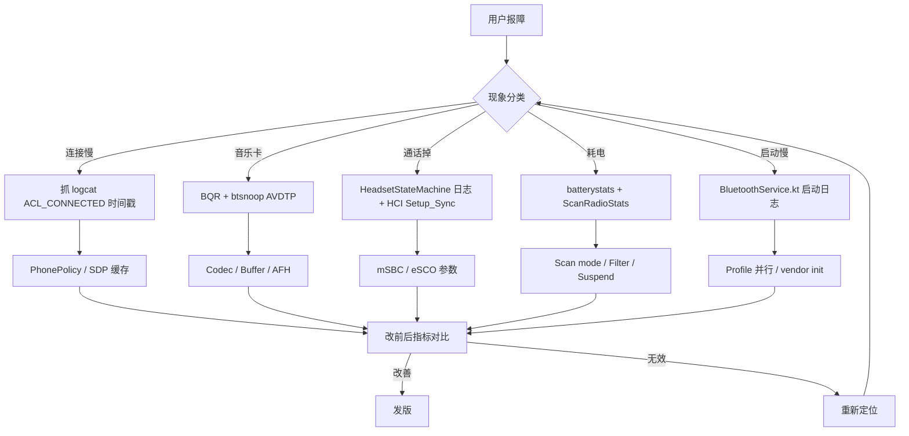

# 19.4 蓝牙性能优化清单

> **速通摘要**：蓝牙性能优化 = "找到瓶颈 → 选合适指标 → 验证改善"。本节给出**车机视角**的 8 大类常见性能问题与对应优化手段：① 连接慢（配对前置 / SDP 缓存）；② A2DP 卡顿（Codec 选型 / Buffer 调整 / AFH）；③ HFP SCO 失败（mSBC 协商 / SCO 重试）；④ LE 扫描功耗（mode 降级 / batch）；⑤ 多设备共存（PhonePolicy 优先级 / 共存仲裁）；⑥ 启动慢（init 阶段并行化）；⑦ Native 内存（智能指针 + RAII）；⑧ AIDL 跨进程开销（缓存 + binder thread pool）。每条都给"症状-定位-改动点"三件套。

---

## 学习目标

读完本节后，你能：
1. 把"用户反馈"翻译成"可测量指标"。
2. 对照清单逐条排查蓝牙性能问题。
3. 知道每类问题对应的代码改动位置。
4. 区分"AOSP 默认行为"与"OEM 可定制项"。

---

## 前置知识

- 通读第 11 章 [故障排查手册](../11_故障排查手册/)
- [19.1 BQR](19.1_BQR协议与上报路径.md) / [19.2 Statsd](19.2_Statsd_dumpsys_metrics.md) / [19.3 功耗](19.3_功耗分析.md)

---

## 性能优化方法论

```
症状（用户语言）
   ↓
指标（可量化）
   ↓
定位（dumpsys / btsnoop / BQR）
   ↓
改动点（代码 / 配置 / flag）
   ↓
回归（重复指标测量）
```

每个优化必须有"前 vs 后"的对比数字，否则不算"已优化"。

---

## 一、连接速度优化

### 症状
- 用户："上车后蓝牙要 5-8 秒才连上手机"
- 指标：从 `ACTION_ACL_CONNECTED` 到 `A2DP STATE_CONNECTED` 的时间

### 定位
```bash
adb logcat -s BluetoothA2dp:V BluetoothHeadset:V Bluetooth:V \
    | grep -E "STATE_CONNECTING|STATE_CONNECTED|ACL_CONNECTED"
```
看时间戳分布，找到最长的间隔。

### 常见优化点

| 阶段 | 慢 | 改动 |
|------|----|------|
| SDP 服务发现 | 每次连接都做完整 SDP | 启用 SDP cache（默认开） |
| 配对前置 | 第一次连接要弹配对框 | 车机自定义引导流程，扫描时自动配对 |
| Profile 自动连接 | 一个个串行连 | 看 `PhonePolicy` 顺序，部分并行 |
| Page Scan / Inquiry Scan 间隔 | 手机端 Page Scan 慢 | 提示用户手机端"打开蓝牙设置页"（页面活跃时 Page Scan 间隔短） |

代码切入点：
- `android/app/src/com/android/bluetooth/btservice/PhonePolicy.java` — Profile 连接顺序
- `system/btif/src/btif_dm.cc` — DM_BL_SUCCESS 通知 framework
- `system/stack/sdp/sdp_*.cc` — SDP 缓存逻辑

---

## 二、A2DP 卡顿/无声

### 症状
- "蓝牙音乐每隔 30 秒卡 1 秒"
- 指标：BQR `QUALITY_REPORT_ID_A2DP_AUDIO_CHOPPY` (0x03) 事件次数

### 定位
```bash
# 1. BQR 看 RSSI / retransmission
adb logcat -s bt_btif_bqr:V

# 2. dumpsys 看 buffer 状态
adb shell dumpsys bluetooth_manager | grep -A 20 "A2dpService"

# 3. btsnoop 看 AVDTP 流
adb shell setprop persist.bluetooth.btsnooplogmode full
# 重启蓝牙后抓 /data/misc/bluetooth/logs/btsnoop_hci.log
```

### 优化点

| 原因 | 改动 |
|------|------|
| 距离远 RSSI < -80 dBm | 降码率（LDAC 990k → LDAC 660k → SBC） |
| 周边 WiFi 干扰 | AFH 自适应跳频已自动；车机可禁用 2.4G WiFi 共存 |
| Buffer 太小 | `bluetooth.a2dp.sink_offload.aac_disabled` 等 prop |
| Codec 协商失败 | 看 `A2dpStateMachine.java:284` 的 Codec 切换日志 |
| Sink 端慢 | 不是 Host 端问题，提示用户换设备 |

代码切入点：
- `system/btif/src/btif_a2dp_source.cc` — 编码、PCM 读取
- `android/app/src/com/android/bluetooth/a2dp/A2dpService.java:870` — Codec 切换 statsd 上报
- `system/stack/a2dp/a2dp_codec_*.cc` — Codec 实现

---

## 三、HFP SCO 通话失败/无声

### 症状
- 通话时 1-2 秒无声 / 通话直接挂断
- 指标：HFP SCO 建立成功率，HFP `BluetoothStatsLog.BLUETOOTH_SCO_CONNECTION_STATE_CHANGED`

### 定位
```bash
# 看 SCO 建立过程
adb logcat -s HeadsetStateMachine:V HeadsetService:V

# btsnoop 看 HCI Setup_Synchronous_Connection
# Wireshark filter: hci_cmd.opcode == 0x0428
```

### 优化点

| 原因 | 改动 |
|------|------|
| mSBC 不支持但被启用 | aconfig flag `hfp_codec_aptx_voice` 控制 |
| SCO 路径冲突 | 看 audio HAL，A2DP 与 SCO 不能同时走耳机 |
| eSCO 参数不兼容 | 降级到 SCO（CVSD），看 `bta_ag_sco.cc` |
| SCO 重试不够 | 修 `bta_ag_sco_event` 重试次数 |

代码切入点：
- `system/bta/ag/bta_ag_sco.cc` — SCO/eSCO 状态机
- `android/app/src/com/android/bluetooth/hfp/HeadsetStateMachine.java:385` — Java 端 SCO state

---

## 四、BLE 扫描功耗优化

### 症状
- 后台 App 持续扫描，息屏耗电异常
- 指标：`BluetoothProtoEnums.LE_SCAN_RADIO_DURATION_REGULAR_SCREEN_OFF`

### 优化点

| 改动 | 收益 |
|------|------|
| App 使用 `SCAN_MODE_LOW_POWER` | 占空比从 100% → 5% |
| App 使用 `setReportDelay(> 0)` | 触发 batch scan，硬件离线积累 |
| 加 `ScanFilter` UUID 过滤 | Controller 端过滤，不唤醒 Host |
| 屏幕关时停止扫描 | `bluetooth.power.suspend.stop_le_scan.enabled=true` |
| 限制后台 App 扫描 | Android Doze + 蓝牙 OPSTR_BLUETOOTH_SCAN |

代码切入点：
- `android/app/src/com/android/bluetooth/le_scan/ScanController.java`
- `android/app/src/com/android/bluetooth/le_scan/AppScanStats.java`
- `system/btif/src/btif_ble_scanner.cc`

---

## 五、多设备共存

### 症状
- "连第二个手机时第一个掉了"
- "切换 Active 设备时声音断 3 秒"

### 优化点

| 改动 | 收益 |
|------|------|
| 提升 ACL slots 上限 | 默认 7，Controller 固件决定 |
| `ActiveDeviceManager` 平滑切换 | 17.1 章节，先停旧音频再起新音频 |
| 多手机 HFP 共存 | 当前一个时间只能一个 SCO，无法优化 |
| 不让 BLE 扫描挤占 ACL | Controller 的"radio scheduler" |

代码切入点：
- `android/app/src/com/android/bluetooth/btservice/ActiveDeviceManager.java`
- `android/app/src/com/android/bluetooth/btservice/PhonePolicy.java`

---

## 六、启动时间

### 症状
- 开机后蓝牙要 8 秒才能用
- 指标：从 BootCompleted 到 `STATE_ON` 的时间

### 定位
```bash
adb logcat -s Bluetooth:V BluetoothSystemServer:V AdapterService:V \
    | grep -E "BluetoothManagerService|AdapterService|onCreate|enable"
```

### 优化点

| 阶段 | 慢 | 改动 |
|------|----|------|
| BMS 启动 | system_server 阶段无法优化 | 看 `BluetoothService.kt:73` `onUserStarting` |
| Profile 加载 | 串行加载 16 个 Profile | `AdapterService.setAllProfileServiceStates` 并行 |
| Native 栈 init | btif → bta → stack 链路长 | C++ 优化空间小，主要是芯片 firmware 加载 |
| HCI Init | 厂商扩展命令多 | 精简 vendor init script |

代码切入点：
- `service/src/BluetoothService.kt` — Kotlin SystemService
- `android/app/src/com/android/bluetooth/btservice/AdapterService.java:onCreate` — Profile 加载
- `system/main/shim/btm.cc` — Native init 顺序

---

## 七、Native 内存与性能

### 高频 C++ 反模式
1. **裸 new/delete** → 用 `std::unique_ptr` / `std::shared_ptr`
2. **`std::string` 复制** → 用 `std::string_view`
3. **Lambda 捕获大对象** → 显式 `&` 或 `std::move`
4. **回调 Vector 拷贝** → 用 `std::move` + 引用传递

### 优化点

| 模式 | 改前 | 改后 |
|------|------|------|
| 字符串 | `void Foo(std::string s)` | `void Foo(std::string_view s)` |
| 容器 | `for (auto x : vec)` | `for (const auto& x : vec)` |
| 回调 | `std::function<void(std::vector<int>)>` | `std::function<void(const std::vector<int>&)>` |
| 锁 | `std::mutex.lock()` 手动 | `std::lock_guard<std::mutex>` |
| 资源 | 手动 `close(fd)` | `unique_fd` / RAII wrapper |

代码切入点：见 10 章 [C++ 补课附录](../10_C++补课附录/)

---

## 八、AIDL 跨进程开销

### 症状
- App 调 `BluetoothAdapter.getState()` 高频卡顿
- 原因：每次都跨进程到 system_server

### 优化点

| 改动 | 收益 |
|------|------|
| `IpcDataCache` | App 端本地缓存，命中率 95%+ |
| `Bluetooth*.cache_query_result()` | 跨进程结果本地化 |
| Binder thread pool 扩容 | system_server bluetooth thread 默认 16 |
| 批量 API | `getConnectedDevices` vs 多次 `getConnectionState` |

代码切入点：
- `framework/java/android/bluetooth/BluetoothAdapter.java` — Java API 层
- `service/src/AdapterState.kt:43` — `IpcDataCache.invalidateCache` 调用点
- 应用侧：用 `BluetoothManager.getAdapter()` 缓存 Adapter 单例

---

## 九、Mermaid：性能优化决策树



---

## 十、调试方法

```bash
# 综合性能 dumpsys
adb shell dumpsys bluetooth_manager > bt.dump

# 看启动时序
adb logcat -d -v threadtime -s Bluetooth:V BluetoothSystemServer:V AdapterService:V \
    | head -200

# 看连接耗时
adb logcat -v threadtime | grep -E "ACL_CONNECTED|STATE_CONNECTING|STATE_CONNECTED"

# 启用 verbose 蓝牙日志
adb shell setprop persist.log.tag.bluetooth VERBOSE
adb shell setprop persist.log.tag.BluetoothService VERBOSE
# 重启 bt

# 蓝牙 thread 利用率
adb shell ps -T -p $(pidof com.android.bluetooth) | head -50

# CPU profile（需 simpleperf）
adb shell simpleperf record -p $(pidof com.android.bluetooth) -d 30
adb pull /data/local/tmp/perf.data
```

---

## 十一、车机优化大表

| 项 | AOSP 默认 | 车机推荐 |
|----|----------|---------|
| Suspend disconnect ACL | false | false（不改）|
| Suspend stop LE scan | false | false（不改）|
| 默认 Codec 优先级 | aptX > AAC > SBC | aptX-HD / LDAC > AAC > SBC（看车机解码能力） |
| BQR 上报间隔 | 5 秒 | 1-2 秒 |
| Profile 自动连 timeout | 30 秒 | 10 秒（快速失败重试）|
| 多手机 HFP 共存 | 单 SCO | 单 SCO（限制）|
| 启动后自动连最近设备 | 是 | 是（车机重要）|
| 屏幕熄灭暂停广告 | true | false（车机要被搜到） |
| Page Scan 间隔 | 1.28s | 600ms（找设备更快）|

---

## FAQ

**Q1：性能优化项太多，从哪里开始？**
优先级矩阵：用户感知 × 出现频率 × 修复成本。最高优先级永远是"连接慢"+"音乐卡顿"——直接影响用户感受。耗电、启动时间次之。Native 内存、AIDL 是底层优化，跑顺序最后。

**Q2：BQR 数据如何转成优化决策？**
看 RSSI 趋势：< -75 dBm 长时间 → 提示用户调整设备位置；retransmission > 10% → 干扰严重，建议关闭附近 2.4G WiFi；buffer_overflow > 0 → A2DP buffer 太小，调大编码 buffer。

**Q3：能直接修改 AOSP 源码吗？**
车机 OEM 通常 fork 一份做定制（如 `BLUETOOTH_SUSPEND_DISCONNECT_ACL` 永远不开）。但要注意：① 修改要打 patch 而非直接改，方便后续合并 AOSP 更新；② 重大改动用 aconfig flag 包起来；③ 测试要覆盖原行为不影响。

**Q4：性能测试有标准用例吗？**
有，AOSP Test 套件：① CTS 蓝牙模块（功能正确性）；② `bluetooth_performance_tests`（CI 跑的微基准）；③ Bumble 自动化测试。OEM 还需要加车机特有用例：① 上车 5 秒内连接；② 行驶中音乐不卡；③ 通话清晰度。

---

## 上路任务

1. 找到 `dumpsys bluetooth_manager` 的输出，挑 5 个"明显异常"的字段（如 RSSI 异常、buffer overflow > 0、SCO 失败计数），记下并尝试给出优化方向。
2. 自选本章八大优化点中的一个（推荐"连接速度"），用真车 + 真手机做"前 vs 后"测试，记录两次的时间戳分布。
3. 完成本章后，回头读 11.4 / 11.5（A2DP / HFP 故障排查），把"故障排查"与"性能优化"两个视角对齐——它们是同一个问题的两面（前者修崩、后者优化未崩）。
