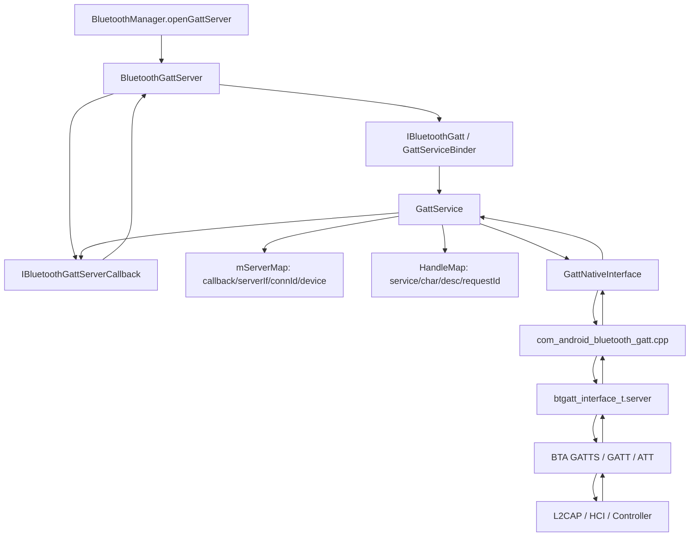
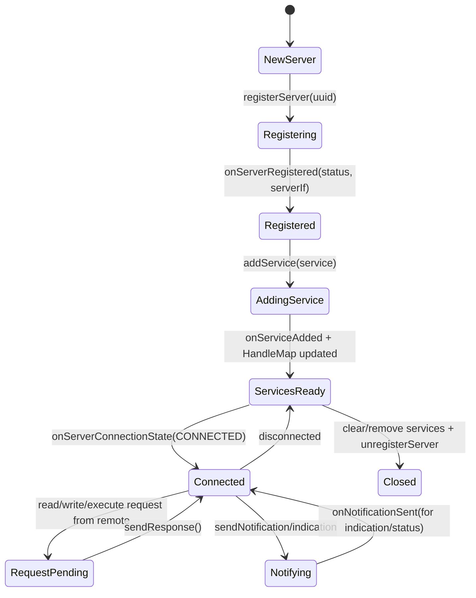

# 20-定向代码阅读报告：GATT Server

## 1. 阅读目标

本报告聚焦 Android 作为 BLE GATT Server 时的源码链路：注册 server、发布 service、维护 attribute handle、接收远端 read/write request、发送 response、发送 notification/indication，以及这些动作如何穿过 `BluetoothGattServer`、`GattServiceBinder`、`GattService`、JNI 和 BTA GATTS。

读完后要能定位：

- `openGattServer()` 成功但 `onServerRegistered()` 不回。
- `addService()` 后 `onServiceAdded()` 不回或 handle 不正确。
- 远端读写请求进来了，但 App 忘记 `sendResponse()` 导致对端超时。
- `notifyCharacteristicChanged()` 成功返回但远端收不到 notification/indication。
- GATT Server 与 Advertise、连接状态、权限和 CCCD 写入之间的边界。

## 2. 适用场景

- 车机作为 BLE 外设，给手机/钥匙/传感器暴露自定义 GATT 服务。
- 车机 BLE OTA、诊断通道、认证握手、数字钥匙辅助通道。
- 排查远端 App 读写车机特征失败、长包/prepare write 失败、通知丢失。
- 设计厂商自定义 GATT 服务的 handle、权限、状态机和调试输出。

## 3. 调用链全景图



## 4. 关键类与源码入口

| 层级 | 源码 | 关键入口 |
| --- | --- | --- |
| Framework API | `framework/java/android/bluetooth/BluetoothGattServer.java` | `registerCallback()`、`addService()`、`sendResponse()`、`notifyCharacteristicChanged()`、`close()` |
| Framework Callback | `framework/java/android/bluetooth/BluetoothGattServerCallback.java` | `onServiceAdded()`、`onCharacteristicReadRequest()`、`onCharacteristicWriteRequest()`、`onExecuteWrite()`、`onNotificationSent()` |
| Binder | `android/app/src/com/android/bluetooth/gatt/GattServiceBinder.java` | `registerServer()`、`serverConnect()`、`addService()`、`sendResponse()`、`sendNotification()` |
| Service | `android/app/src/com/android/bluetooth/gatt/GattService.java` | `registerServer()`、`addService()`、`onServerReadCharacteristicFromNative()`、`sendResponse()`、`sendNotification()` |
| Context | `android/app/src/com/android/bluetooth/gatt/ContextMap.java` | server app、callback、connId、device 映射 |
| Handle | `android/app/src/com/android/bluetooth/gatt/HandleMap.java` | service/characteristic/descriptor handle、request context |
| Native Interface | `android/app/src/com/android/bluetooth/gatt/GattNativeInterface.java` | `gattServerAddService()`、`gattServerSendResponse()`、`gattServerSendNotification()` |
| JNI | `android/app/jni/com_android_bluetooth_gatt.cpp` | `gattServer*Native`、`onServerReadCharacteristic`、`onServerWriteCharacteristic` |
| Native Stack | `system/bta/gatt`、`system/stack/gatt` | BTA GATTS、ATT request/response、notification/indication |

## 5. 生命周期与状态机



关键点：

- `BluetoothGattServer` 注册后会等待 `onServerRegistered()`，内部有 callback registration timeout。
- `addService()` 的 handle 不是 App 自己决定的，native 添加成功后通过 `onServiceAdded()` 回填 service/characteristic/descriptor instance id。
- 读写请求到达时，`GattService` 先用 `HandleMap` 找到 handle 对应的 server，再给 App 分配 requestId。
- App 必须对需要 response 的 read/write/execute request 调 `sendResponse()`，否则对端 ATT 会超时。

## 6. 关键操作链路

### 6.1 注册 Server

```text
BluetoothGattServer.registerCallback()
  -> IBluetoothGatt.registerServer(...)
  -> GattServiceBinder.registerServer(...)
  -> GattService.registerServer(...)
  -> mServerMap.add(...)
  -> GattNativeInterface.gattServerRegisterApp(...)
  -> JNI / BTA_GATTS_AppRegister
  -> onServerRegisteredFromNative(...)
```

### 6.2 添加 Service

```text
BluetoothGattServer.addService(service)
  -> GattService.addService(callback, service)
  -> convert service/char/desc to GattDbElement list
  -> GattNativeInterface.gattServerAddService(serverIf, db)
  -> onServiceAddedFromNative(status, serverIf, serviceDb)
  -> HandleMap.addService/addCharacteristic/addDescriptor
  -> callback.onServiceAdded(status, serviceAdded)
```

### 6.3 远端读写请求

```text
Remote ATT Read/Write
  -> BTA GATTS callback
  -> JNI onServerRead/Write...
  -> GattNativeInterface callback
  -> GattService.onServerRead/Write...FromNative
  -> HandleMap.addRequestContext(...)
  -> IBluetoothGattServerCallback.onCharacteristicRead/WriteRequest(...)
  -> App BluetoothGattServerCallback
  -> App calls sendResponse(...)
  -> GattService.sendResponse(...)
  -> gattServerSendResponseNative(...)
```

### 6.4 Notification / Indication

```text
BluetoothGattServer.notifyCharacteristicChanged(...)
  -> IBluetoothGatt.sendNotification(...)
  -> GattService.sendNotification(...)
  -> verify server registered, connection exists, handle exists
  -> gattServerSendNotification/IndicationNative(...)
  -> ATT Handle Value Notification/Indication
```

## 7. 线程模型与回调分发

| 线程/队列 | 负责内容 | 排查意义 |
| --- | --- | --- |
| App callback 线程 | `BluetoothGattServerCallback` 回调 | App 逻辑慢会拖慢响应 |
| Binder 线程池 | App 调 `addService/sendResponse/notify` | 入参校验、权限检查、跨进程边界 |
| `GattService` Handler/内部线程 | server map、handle map、native callback 分发 | requestId/handle 映射错误重点看这里 |
| JNI callback 线程 | BTA/GATT 事件回到 Java | cleanup 后回调、method id、对象引用问题 |
| Native stack thread | ATT/GATT/L2CAP/HCI | 对端超时、MTU、拥塞、indication ack 重点看 |

## 8. 权限检查点与 Binder 边界

GATT Server API 主要要求 `BLUETOOTH_CONNECT`：

- `GattServiceBinder.registerServer/addService/sendResponse/sendNotification` 先走 `getServiceAndEnforceConnect(source)`。
- `BluetoothGattServer` 持有 `AttributionSource`，回调中会给 `BluetoothDevice` 设置 attribution。
- 特殊 profile/特征如果涉及 HID、系统认证、钥匙等敏感数据，应在业务层额外做授权，不要只依赖通用 GATT 权限。

定制建议：厂商自定义 GATT 服务不要默认信任任意已连接设备，至少要有 bonding、加密状态、应用层认证或白名单。

## 9. 可能失败点

| 现象 | 可能原因 | 观察点 |
| --- | --- | --- |
| `onServerRegistered()` 不回 | GATT native 未初始化、callback timeout、权限被拒 | `GattService.registerServer`、JNI `onServerRegistered` |
| `onServiceAdded()` 不回 | service db 非法、native add service 失败 | `GattDbElement`、`onServiceAddedFromNative` |
| 远端读超时 | App 没调用 `sendResponse()` 或 requestId 丢失 | `HandleMap.addRequestContext/getRequestContext` |
| 写请求无效 | handle 不存在、offset/prepare write 未处理 | `onServerWriteCharacteristicFromNative` |
| notify 成功但远端收不到 | 未连接、handle 错、CCCD 未写、对端未订阅 | `sendNotification()`、连接列表、CCCD 业务状态 |
| indication 卡住 | 对端未 ack、拥塞、链路断开 | `onNotificationSent`、`onServerCongestion` |

## 10. dumpsys / logcat / bugreport 观察点

常用命令：

```bash
adb shell dumpsys bluetooth
adb logcat -b all -v threadtime | grep -E "GattService|GattServiceBinder|BluetoothGattServer|HandleMap|ContextMap|BTA_GATTS|GATT"
```

重点看：

- `mServerMap` 中是否有 server app、serverIf、connId、device。
- `HandleMap` 中 service/characteristic/descriptor handle 是否和 App 预期一致。
- read/write request 是否生成 requestId。
- `sendResponse()` 是否能找到 request context。
- notify/indication 前是否有连接和正确 handle。

## 11. 定制修改思路

### 11.1 车厂自定义 GATT 服务

建议结构：

- 单独业务模块维护服务定义、认证状态和连接设备白名单。
- `BluetoothGattServer` 只做协议出口，不承载复杂业务状态。
- 每个 characteristic 明确 read/write/notify 权限、是否需要加密、是否需要 bonding、最大长度和 offset 行为。
- dumpsys 输出 server registered、service handles、connected clients、last request、last response。

### 11.2 OTA / 大数据传输

建议：

- 不要依赖单次 write 写大包，按 MTU 和 ATT 限制分片。
- 需要确认 `onCharacteristicWriteRequest` 的 `isPrep/needRsp/offset`。
- 对每个 request 做超时保护，未收到完整包时清理状态。
- 对 notification/indication 做队列和拥塞处理，不要无限制发送。

### 11.3 安全认证

建议：

- 对数字钥匙、诊断、车辆控制类服务，GATT 连接只是传输层，不是认证。
- 使用 bonding/encryption + 应用层 challenge-response。
- 对未认证设备只暴露最小服务或拒绝敏感 characteristic。

## 12. 最容易踩的坑

- 忘记 `sendResponse()`，导致远端读写超时。
- 使用添加前的 characteristic instance id，当作 native handle。
- 没写 CCCD 业务状态，就盲目发送 notification。
- 把 notification 当可靠传输；需要可靠确认时用 indication 或应用层 ack。
- 没处理 offset/prepare write，长写或可靠写失败。
- GATT Server 和 Advertise 生命周期没有联动，服务没准备好就开始广播。

## 13. 练习题与参考答案

### 练习 1：远端读 characteristic 超时，如何查？

参考答案：

1. 看 `onServerReadCharacteristicFromNative` 是否出现。
2. 看 `HandleMap.getByHandle(handle)` 是否找到条目。
3. 看是否生成 requestId 并回调 App 的 `onCharacteristicReadRequest`。
4. 看 App 是否调用 `sendResponse(device, requestId, status, offset, value)`。
5. 看 `sendResponse()` 是否找到 request context，并调用 native `gattServerSendResponse`。

### 练习 2：notify 返回成功但手机收不到，可能是什么？

参考答案：

- 手机没有写 CCCD，业务层不应发送。
- serverIf/handle/device 不匹配。
- `mServerMap` 中没有该 device 连接。
- 对端只支持较小 MTU，value 过长。
- 链路拥塞或断开，需看 `onServerCongestion` 和 HCI。

### 练习 3：如何设计一个车机诊断 GATT 服务？

参考答案：

- 一个 control characteristic 用于命令写入，要求加密连接和应用层认证。
- 一个 status characteristic 用于读状态。
- 一个 notify characteristic 用于异步事件，只有 CCCD enabled 后发送。
- 对 write request 必须快速 `sendResponse()`，耗时任务异步执行。
- dumpsys 输出当前认证设备、最近命令、错误码、notify 队列长度。

## 14. 案例库映射

可沉淀到 `97-真实案例库.md` 的案例：

- BLE 数字钥匙认证写入后手机超时：App 未 `sendResponse()`。
- OTA notify 丢包：notification 过快且无拥塞/ack 控制。
- 新增服务后 handle 错乱：使用了添加前的 instance id。
- 广播可见但服务发现为空：advertise 早于 `onServiceAdded()`。
