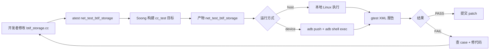

# 20.1 蓝牙 gtest 单元测试

> **速通摘要**：Android Bluetooth native 栈使用 **gtest + gmock** 做单元测试，源码与生产代码分离在各模块的 `test/` 子目录（本仓库切片未包含 test 目录，原 AOSP 路径如 `packages/modules/Bluetooth/system/btif/test/btif_storage_test.cc`）。每个测试模块编为独立 `cc_test` Soong 目标，通过 `atest <module>` 或 `adb shell /data/nativetest64/<module>` 跑。Mock 大量使用 gmock 把外部依赖（btif_config / native API / HCI）替换为 Mock，保证测试纯 in-process。本节梳理 gtest 在蓝牙模块的目录约定、Mock 策略、典型用例结构。

---

## 学习目标

读完本节后，你能：
1. 解释蓝牙 native 栈的测试目录约定与 Soong 构建规则。
2. 区分单元测试（gtest）、Mocking（gmock）、集成测试（blueberry）。
3. 看懂典型 `_test.cc` 文件的结构（TEST/TEST_F/Mock 类）。
4. 知道 `atest` / `adb push + run` 两种执行方式。

---

## 前置知识

- C++ 基础（10 章 [C++ 补课附录](../10_C++补课附录/)）
- Soong 构建系统基础（外部依赖）
- gtest 框架基础（Google Test 官方文档）

---

## 场景故事

蓝牙工程师改了 `btif_storage.cc` 中保存配对设备的逻辑。要怎么知道这次改动没破坏其它路径？答案是：跑该模块的 gtest——几百个用例 5 秒内告诉你"哪个 case fail 了、为什么、调用栈"。

但蓝牙栈高度依赖外部（HCI / Controller / system_server），不可能在测试机上接真蓝牙硬件——所以测试时把这些"外部世界"全部 Mock。

---

## 一、Bluetooth 测试金字塔

```
        ┌───────────────────────┐
        │   E2E 真机自动化      │  ← Bumble + Mobly + Blueberry
        │   (跨进程、真实射频)  │     (20.3)
        ├───────────────────────┤
        │   CTS / GTS / VTS     │  ← Google 合规测试套件
        │   (Java API 兼容)     │     (20.2)
        ├───────────────────────┤
        │  集成测试 / Robolectric│  ← Java 层、不需真机
        │  (Service + Mock JNI) │     (本节末)
        ├───────────────────────┤
        │  gtest 单元测试       │  ← Native C++ 最小单元
        │  (函数级、Mock 依赖)  │     ⭐ 本节重点
        └───────────────────────┘
```

越底层数量越多、越快、越独立。

---

## 二、目录约定（AOSP 实际布局）

> **本仓库切片不含 `test/` 目录**，路径来自上游 AOSP `packages/modules/Bluetooth/`：

```
system/btif/
├── src/btif_storage.cc                    # 生产代码
├── include/btif_storage.h
└── test/                                   # ← 测试源码
    ├── btif_storage_test.cc                # gtest 用例
    ├── btif_hh_test.cc
    └── Android.bp                          # cc_test 目标

system/bta/
└── test/
    ├── bta_dm_test.cc
    └── ...

system/stack/
└── test/
    ├── btm_test.cc
    └── ...

system/gd/
└── hci/                                    # GD 模块测试与代码同目录
    ├── acl_manager.cc
    └── acl_manager_test.cc                 # ← 同级测试文件
```

模块化栈（GD）与传统栈测试位置不同，但都用 gtest。

---

## 三、cc_test Soong 模块

```python
# 典型 Android.bp（外部依赖）
cc_test {
    name: "net_test_btif_storage",
    test_suites: ["device-tests"],
    srcs: [
        "btif_storage_test.cc",
    ],
    static_libs: [
        "libbt-platform-protos-lite",
        "libgmock",
        "libgtest",
        "libbluetooth-types",
        "libbtcore",
        "libbtif",
    ],
    shared_libs: [
        "libbase",
        "libchrome",
        "liblog",
    ],
    sanitize: { cfi: true },
    // 关键：把生产 .cc 也加入测试构建，链接成单个 test binary
}
```

`atest net_test_btif_storage` → 在主机或连 device 时自动 push + run + 上报结果。

---

## 四、典型 _test.cc 结构

```cpp
// 伪代码示意：btif_storage_test.cc
#include <gtest/gtest.h>
#include <gmock/gmock.h>
#include "btif/include/btif_storage.h"

// 1. Mock 外部依赖
class MockBtifConfig {
public:
  MOCK_METHOD(bool, GetString, (const std::string& section,
                                const std::string& key,
                                std::string* value));
  MOCK_METHOD(bool, SetString, (const std::string& section,
                                const std::string& key,
                                const std::string& value));
};

// 2. Test Fixture
class BtifStorageTest : public ::testing::Test {
protected:
  void SetUp() override {
    // 注入 Mock，替换全局函数指针
    mock_config_ = std::make_unique<MockBtifConfig>();
    btif_config::test::SetInstance(mock_config_.get());
  }

  void TearDown() override {
    btif_config::test::SetInstance(nullptr);
  }

  std::unique_ptr<MockBtifConfig> mock_config_;
};

// 3. 用例 1：写入流程
TEST_F(BtifStorageTest, SaveBondedDevice) {
  using ::testing::_;
  using ::testing::Return;

  // 预设 Mock 行为：SetString 被调用时返回 true
  EXPECT_CALL(*mock_config_,
              SetString("XX:XX:XX:XX:XX:XX", "LinkKey", _))
      .WillOnce(Return(true));

  // 执行
  RawAddress addr = ParseAddr("XX:XX:XX:XX:XX:XX");
  bool ok = btif_storage_set_bonded_device(addr, kLinkKey);

  // 断言
  EXPECT_TRUE(ok);
}

// 4. 用例 2：读取失败路径
TEST_F(BtifStorageTest, LoadBondedDevice_NotFound) {
  EXPECT_CALL(*mock_config_, GetString(_, _, _))
      .WillOnce(Return(false));

  RawAddress addr = ParseAddr("XX:XX:XX:XX:XX:XX");
  LinkKey key;
  bool ok = btif_storage_get_link_key(addr, &key);

  EXPECT_FALSE(ok);
}

// 5. 入口
int main(int argc, char** argv) {
  ::testing::InitGoogleTest(&argc, argv);
  return RUN_ALL_TESTS();
}
```

### 4.1 五要素

| 元素 | 作用 |
|------|------|
| `TEST_F` | 带 fixture 的用例（共享 SetUp/TearDown） |
| `TEST` | 简单用例 |
| `EXPECT_CALL` | 设定 Mock 的调用预期 |
| `EXPECT_*` / `ASSERT_*` | 断言（前者继续，后者立即停） |
| `.WillOnce()` / `.WillRepeatedly()` | Mock 返回值控制 |

---

## 五、Mock 策略

### 5.1 全局函数 Mock

蓝牙代码大量用全局函数指针（"plugin"模式），测试时把指针指向 Mock：

```cpp
// 生产代码：btif/include/btif_config.h
namespace btif_config::test {
  void SetInstance(IBtifConfig* mock_or_real);
}

// 测试 SetUp：注入 Mock
btif_config::test::SetInstance(&mock_config);
```

### 5.2 osi Mock

`osi`（OS Interface）层（线程、定时器、socket）有专门的 mock 实现：

```cpp
// system/osi/test/...  mock_osi_alarm.cc 等
// 通过 alarm_set_on_mloop / alarm_cancel Mock 化时间
```

### 5.3 HCI 层 Mock

HCI 命令/事件用 `hci_layer_mock` 替换，测试可控制"收到什么 event"，让上层 BTA / Stack 跑各种状态分支。

---

## 六、执行方式

### 6.1 atest（推荐）

```bash
# 单测
atest net_test_btif_storage

# 单个 case
atest net_test_btif_storage:BtifStorageTest.SaveBondedDevice

# 全部蓝牙 native 测试
atest --test-mapping packages/modules/Bluetooth
```

### 6.2 手动 push + run

```bash
# build
m net_test_btif_storage

# push
adb push out/target/product/<device>/data/nativetest64/\
         net_test_btif_storage/net_test_btif_storage \
         /data/local/tmp/

# run
adb shell /data/local/tmp/net_test_btif_storage \
    --gtest_filter=BtifStorageTest.*
```

### 6.3 主机端跑（最快）

部分模块支持 `host_supported: true` → 在 Linux 主机直接编译、直接跑，秒级反馈：

```bash
m host net_test_btif_storage
out/host/linux-x86/nativetest64/net_test_btif_storage/net_test_btif_storage
```

---

## 七、Robolectric / Java 层测试

蓝牙 Java 部分（`android/app/`、`service/src/`）用 Android JUnit + Robolectric：

```java
@RunWith(AndroidJUnit4.class)
public class AdapterServiceTest {
    @Rule public ServiceRule mServiceRule = new ServiceRule();

    @Mock private AdapterProperties mMockProperties;

    @Test
    public void enable_callsNativeEnable() {
        AdapterService service = new AdapterService(...);
        service.enable();
        verify(mMockProperties).onAdapterEnabled();
    }
}
```

- Robolectric 在 JVM 中跑 Android 框架，不需要真机或模拟器
- 测试 `BluetoothManagerService` 的 Kotlin 部分用 Mockito + coroutine test

---

## 八、Mermaid：测试执行流



---

## 九、调试方法

```bash
# 看 gtest 用例列表
adb shell /data/local/tmp/net_test_btif_storage --gtest_list_tests

# 跑特定 case 并打印详细 log
adb shell /data/local/tmp/net_test_btif_storage \
    --gtest_filter=BtifStorageTest.SaveBondedDevice \
    --gtest_color=yes \
    -v

# 让 gtest 在第一个失败处停下
adb shell /data/local/tmp/net_test_btif_storage --gtest_break_on_failure

# 看测试覆盖率（需 clang 配合）
m COVERAGE=true net_test_btif_storage
# 跑完后 llvm-cov 出报告

# 调试 native 测试（lldb）
adb shell setprop debug.atrace.tags.enableflags 0
adb shell stop bluetooth
adb shell lldbserver platform --listen "*:2345" &
adb forward tcp:2345 tcp:2345
lldb -o "platform select remote-android" -o "platform connect connect://localhost:2345"
```

---

## 十、写一个新测试

```cpp
// 1. 在 system/btif/test/ 新建 my_new_test.cc
#include <gtest/gtest.h>
#include "btif/include/my_new_module.h"

TEST(MyNewModuleTest, BasicSanity) {
    EXPECT_EQ(2 + 2, 4);
}

// 2. 在 Android.bp 加 cc_test
cc_test {
    name: "net_test_my_new_module",
    srcs: ["my_new_test.cc"],
    static_libs: ["libgtest", "libbtif"],
}

// 3. 运行
//   atest net_test_my_new_module
```

---

## FAQ

**Q1：gtest 单测为什么不直接连 Controller？**
单测的目的是**测一个函数/类的逻辑分支**，不是测系统集成。连 Controller 会引入硬件不稳定、固件差异、时序问题，让"逻辑 bug" 与"硬件兼容性问题"混在一起。集成测试在 20.3 Blueberry / E2E 中做。

**Q2：MOCK_METHOD 与 MOCK_METHOD0 / MOCK_METHOD1 区别？**
gmock 1.10+ 引入新语法 `MOCK_METHOD(returnType, methodName, (args), (qualifiers))`，旧的 `MOCK_METHOD0..MOCK_METHOD10` 已 deprecated。新代码统一用新语法。

**Q3：Robolectric 与 Mockito 是什么关系？**
Robolectric：在 JVM 中模拟整个 Android 框架（Context、Resources、Looper、Handler 都用 shadow 实现）。Mockito：通用 Java mock 库，与 Robolectric 互补——前者模拟环境，后者模拟对象。

**Q4：gtest 测试能跑得多快？**
单个测试 binary 通常 < 5 秒，跑完所有 native 测试 < 5 分钟（CI 集群）。这是为什么蓝牙团队 PR 要求 100% gtest 跑通——本地秒级反馈。

**Q5：为什么本仓库没有 test 目录？**
本仓库是"学习用切片"，删掉了 test 目录省空间。看真实测试代码请到 AOSP `packages/modules/Bluetooth/system/*/test/`。

---

## 上路任务

1. 在 [AOSP gerrit](https://android.googlesource.com/platform/packages/modules/Bluetooth/+/refs/heads/main/system/btif/test/) 浏览 `btif_storage_test.cc` 真实内容，对照本节的"五要素"找出 `TEST_F` / `EXPECT_CALL` / `EXPECT_TRUE` 的实际用法。
2. 自己写一个最小 gtest：1 个 `TEST(SanityTest, MathWorks) { EXPECT_EQ(1+1, 2); }`，加 cc_test 目标，跑 `atest` 看输出。
3. 进 AOSP 跑 `atest net_test_btif_storage`，对比"全跑过"与"故意改一行代码导致 fail"两种结果输出差异，理解 gtest 报告格式。
