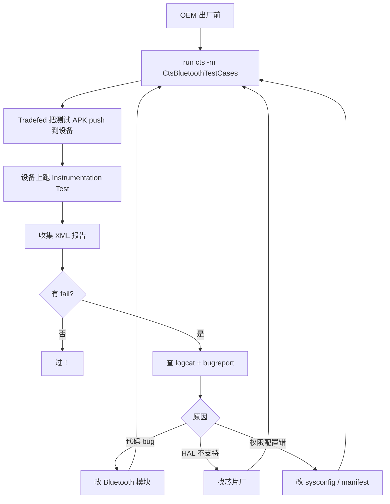

# 20.2 Android CTS Verifier / GTS / VTS 蓝牙模块

> **速通摘要**：Android 设备出厂必须通过三大测试套件才能拿到认证：① **CTS（Compatibility Test Suite）**——验证 framework API 行为符合 CDD 文档（如 `BluetoothAdapter.enable()` 真的会触发蓝牙开），自动跑；② **CTS Verifier**——人工操作部分，扫码 / 配对等需要真人介入；③ **GTS（Google Test Suite）**——Google 服务专属（GMS 设备才需要），如 GMS 蓝牙 Beacon；④ **VTS（Vendor Test Suite）**——验证 HAL 接口实现（车机芯片厂必过）。本节梳理蓝牙相关的 CTS 用例分类、车机厂常踩的 fail 点、定位修复思路。

---

## 学习目标

读完本节后，你能：
1. 区分 CTS / CTS Verifier / GTS / VTS 四套测试的目的与覆盖范围。
2. 列出蓝牙模块在 CTS 中的主要测试包。
3. 知道车机厂"过不了 CTS"时如何定位失败 case。
4. 看懂 CDD 文档中"蓝牙必选项"。

---

## 前置知识

- [20.1 gtest 单元测试](20.1_蓝牙gtest单元测试.md)
- 了解 Android CDD（Compatibility Definition Document）

---

## 场景故事

车机出厂前，OEM 工程师跑一轮 CTS，发现 30 个 case fail，其中蓝牙 6 个：
- `BluetoothAdapterTest#test_getName` 超时
- `BluetoothGattTest#test_connect` 连不上
- `BluetoothLeAudioTest#test_createBroadcast` 返回错误

不修这些 case，车机拿不到 Android 认证，不能 OTA Google 服务，无法用 Play Store——所以必须逐条排查、修代码、回归。本节讲思路。

---

## 一、4 套测试对比

| 套件 | 全称 | 范围 | 触发 | 必选？ |
|------|------|------|------|--------|
| CTS | Compatibility Test Suite | Framework Java API 行为 | 自动 | 是（出厂必过） |
| CTS Verifier | CTS 手动部分 | 涉及人交互的（扫码、配对） | 人工 | 是（部分车机可豁免） |
| GTS | Google Test Suite | GMS 服务（Play / Beacon / Nearby） | 自动 | 仅 GMS 设备必过 |
| VTS | Vendor Test Suite | HAL 接口（BT HAL / Audio HAL） | 自动 | 是（Treble 必过） |

---

## 二、CTS 蓝牙测试包

```
cts/tests/tests/bluetooth/
├── src/android/bluetooth/cts/
│   ├── BluetoothAdapterTest.java            # Adapter 通用 API
│   ├── BluetoothDeviceTest.java             # Device 配对、UUID
│   ├── BluetoothGattTest.java               # GATT 客户端
│   ├── BluetoothGattServerTest.java         # GATT 服务端
│   ├── BluetoothHidHostTest.java            # HID
│   ├── BluetoothA2dpTest.java               # A2DP Source
│   ├── BluetoothHeadsetTest.java            # HFP AG
│   ├── BluetoothLeScannerTest.java          # BLE 扫描
│   ├── BluetoothLeAdvertiserTest.java       # BLE 广告
│   ├── BluetoothLeBroadcastTest.java        # LE Audio Broadcast
│   ├── BluetoothLeAudioTest.java            # LE Audio Unicast
│   └── BluetoothMapTest.java                # MAP
└── AndroidManifest.xml
```

> 真实路径：AOSP `cts/tests/tests/bluetooth/`，本仓库未包含。

---

## 三、典型 CTS 用例结构

```java
// 示意（外部依赖 cts/tests/tests/bluetooth/）
@RunWith(AndroidJUnit4.class)
public class BluetoothAdapterTest {

    private BluetoothAdapter mAdapter;

    @Before
    public void setUp() {
        BluetoothManager manager = (BluetoothManager)
            getInstrumentation().getContext()
                .getSystemService(Context.BLUETOOTH_SERVICE);
        mAdapter = manager.getAdapter();
        assumeNotNull(mAdapter);              // 不是蓝牙设备直接跳过
    }

    @Test
    public void test_enable_disable() {
        // 不能在 CTS 中真开关蓝牙影响其他用例
        // 通常用 @RequiresPermission 验证调用者权限
        assertNotNull(mAdapter);
        assertNotNull(mAdapter.getName());
        assertNotNull(mAdapter.getAddress());
    }

    @Test
    public void test_getBondedDevices_returnsSet() {
        Set<BluetoothDevice> devices = mAdapter.getBondedDevices();
        assertNotNull(devices);              // 必须返回非 null（哪怕空）
    }

    @Test
    public void test_startScan_requiresPermission() {
        try {
            mAdapter.getBluetoothLeScanner().startScan(new ScanCallback() {});
            fail("Should require BLUETOOTH_SCAN permission");
        } catch (SecurityException expected) {
            // OK
        }
    }
}
```

---

## 四、车机常见 fail 模式

| Fail Case | 根因 | 修复 |
|-----------|------|------|
| `test_getName` 超时 | BMS 没启动到 ON 状态 | 检查启动流程，Profile 加载顺序 |
| `test_connect` 连不上 | CTS 测试设备 vs 车机配对状态不一致 | CTS 跑前确保无残留配对 |
| `test_le_scan_requires_permission` | 车机定制把 SCAN 权限改成 normal | 改回 dangerous |
| `test_advertiser` 失败 | Controller 不支持 BLE 5.x extended adv | 升级芯片固件 |
| `test_le_audio_broadcast` 失败 | LE Audio HAL 没接入 | 看 Audio HAL 配置 |
| `test_getAlias` 返回 null | 自定义 Bluetooth Storage 实现错 | 修 BluetoothDatabaseProvider |

---

## 五、CTS Verifier（人工 CTS）

应用形式：手机端 APK，里面是一系列"测试任务"，需要人工照做：

```
CTS Verifier 蓝牙相关项：
├── Bluetooth Test
│   ├── Discoverable / Discovery
│   ├── HID Test (插键盘连蓝牙)
│   ├── Out of Band Pairing (扫 QR 码配对)
│   └── Secure Connections
├── BLE Test
│   ├── Insecure Connection Oriented Channel
│   ├── Connection Oriented Channel
│   ├── Privacy Tests
│   └── Encrypted Server
└── Wifi/Bluetooth Coexistence
```

每个测试人手操作完 → 标 PASS / FAIL → 提交 XML 报告。

> 车机厂可以申请豁免不适用的项（如车机没有屏幕扫码功能 → OOB Pairing 可豁免）。

---

## 六、VTS（HAL 验证）

VTS 验证 HAL 接口实现：

```
test/vts-testcase/hal/bluetooth/
├── audio/V2_0/host/AudioHidlHostTest.cpp        # Bluetooth Audio HAL
├── audio/V2_1/host/...
├── bluetooth/1.0/host/BluetoothHidlTest.cpp     # Bluetooth HAL
├── bluetooth/1.1/...
└── bluetooth/aidl/vts/                          # AIDL HAL（Android 14+）
```

VTS 用 Treble 接口验证 HAL：
- 直接调用 HAL AIDL/HIDL 方法
- 不经过 framework
- 主要确认"vendor 实现了 HAL 接口的所有 method 且行为正确"

车机芯片厂主跑这里——确认自家 vendor BT HAL 没漏方法、没返回错误码。

---

## 七、CDD 中的蓝牙必选项（Android 16 摘要）

```
7.4.3 Bluetooth
- [C-1-1] 设备如果声明支持 BT，必须实现 BluetoothAdapter API。
- [C-1-2] 必须保证 BluetoothAdapter.enable() 能成功开启蓝牙。
- [C-1-3] 必须支持 Just Works 配对方式。

7.4.3.1 Bluetooth Low Energy
- [C-1-1] 必须实现 BluetoothLeScanner / BluetoothLeAdvertiser API。
- [C-1-3] 必须支持至少 4 个并发 GATT 连接。

7.4.3.5 LE Audio
- [C-2-1] 如果声明支持 LE Audio Unicast，必须实现 BluetoothLeAudio API。
- [C-2-2] 必须支持 LC3 编码（48/32/24/16/8 kHz）。
```

> 实际条款见 AOSP `cdd/`。每个 [C-1-X] 都对应一个或多个 CTS test。

---

## 八、Mermaid：CTS 跑通流程



---

## 九、调试方法

```bash
# 跑特定 CTS 模块
run cts -m CtsBluetoothTestCases

# 跑特定 case
run cts -m CtsBluetoothTestCases -t \
    android.bluetooth.cts.BluetoothAdapterTest#test_getName

# 详细 log
run cts -m CtsBluetoothTestCases --log-level VERBOSE

# 跑完看报告（HTML 在 out/host/linux-x86/cts/android-cts/results/）
xdg-open out/host/linux-x86/cts/android-cts/results/latest/test_result.html

# 单独跑 instrumentation
adb shell am instrument -w -e class \
    android.bluetooth.cts.BluetoothAdapterTest \
    android.bluetooth.cts/androidx.test.runner.AndroidJUnitRunner

# 查看 fail case 的详细 trace
adb logcat | grep -E "AndroidJUnitRunner|TestRunner|Bluetooth"
```

---

## 十、CTS 跑前准备清单

1. **设备状态**：电量 > 50%，无锁屏，蓝牙处于初始状态
2. **配对清单**：清空 `Settings > Bluetooth > Paired devices`
3. **网络**：连接 WiFi（CTS 部分用例需联网）
4. **权限**：CTS 测试 APK 自动获取所有蓝牙权限
5. **辅助设备**：部分 CTS 用例需"对端蓝牙设备"（CTS Companion App 跑在另一台手机）
6. **Tradefed 版本**：与目标 Android 版本对齐（Android 16 用 CTS 16）

---

## FAQ

**Q1：CTS 与 CTS Verifier 的关系？**
CTS Verifier 是 CTS 的"人工部分"——某些测试无法自动化（扫码、按物理键、靠近 NFC），必须人在场。一起跑完才算完整 CTS PASS。车机由于没有人手操作的场景，可申请豁免大部分 Verifier。

**Q2：车机厂能改 CTS 用例吗？**
**不能**。CTS 是 Google 定义的"兼容性合同"，所有 OEM 跑同一份，结果上传 Google 审核。如果某 case 跑不过，必须修自家代码，不能改测试。

**Q3：VTS 与 CTS 的差别？**
- CTS 走 Java framework API，自上而下
- VTS 直接调 HAL（绕过 framework），自下而上
- CTS 验证"应用看到的行为"，VTS 验证"vendor 实现了 HAL 合同"

**Q4：CTS 失败如何快速定位？**
顺序：① 看 fail case 的 testRunStarted/testFailed 日志；② 在设备上单独跑一次该 case + 抓 logcat；③ 用 `bugreport` 看蓝牙状态；④ 必要时改测试 APK 加 log（仅本地调试）。

**Q5：通过率多少才能上市？**
官方要求 100%，但允许针对特定硬件特性的 case 申报 known issues（Google 审核通过后豁免）。车机厂典型情况通过率 98%+，剩余 2% 走 waiver 流程。

---

## 上路任务

1. 下载 [CTS 16 二进制包](https://source.android.com/docs/compatibility/cts/downloads)，在自己手机上跑 `run cts -m CtsBluetoothTestCases`，看测试报告 HTML。
2. 故意把 `BluetoothAdapter` 的某个方法（如 `getName`）改坏，重新编译刷机，跑一次 CTS，看哪个 case fail。
3. 阅读 AOSP CDD 第 7.4.3 节，列出所有 [C-1-X] / [C-2-X] 条款，对照自己手机看是否都满足。
