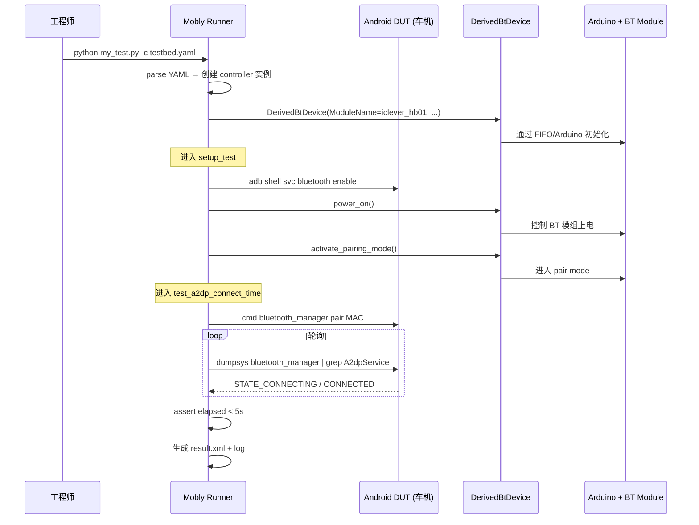

# 20.3 Bumble + 自动化测试

> **速通摘要**：**Bumble** 是 Google 开源的 Python 蓝牙协议栈，能模拟"虚拟蓝牙设备"——它通过 HCI socket 接到任何 Controller（真硬件 / 虚拟 root-canal / qemu）作为完整 Host，让自动化测试无需真实第二台设备。**Blueberry** 是 Google 的蓝牙自动化测试框架（基于 Mobly），跑在主机上，控制 Android DUT + 任意 BT 配件（蓝牙耳机、车机等）跑端到端用例。本仓库 `system/blueberry/` 包含部分 Blueberry 控制器（`derived_bt_device.py:34`、`bt_stub.py:17`），用户通过 YAML testbed 描述硬件，跑 Python 测试脚本。本节梳理 Bumble 架构、Blueberry 用法、Mobly 测试结构。

---

## 学习目标

读完本节后，你能：
1. 区分 Bumble（协议栈模拟）vs Blueberry（测试框架）vs Mobly（runner）。
2. 看懂 Blueberry testbed YAML 配置。
3. 解释 `DerivedBtDevice` 动态加载机制。
4. 写一个最小 Mobly 测试用例。

---

## 前置知识

- [20.1 gtest 单测](20.1_蓝牙gtest单元测试.md)
- [20.2 CTS](20.2_CTS_GTS_VTS蓝牙模块.md)
- Python 基础

---

## 场景故事

车机工程师想自动化测试"上车后蓝牙是否在 5 秒内连上手机"。手动测试要：① 关机；② 启动；③ 看时间；④ 记录。一天最多跑 100 次，且容易漏掉边角情况。

自动化方案：
1. Mobly 起脚本
2. 控制车机：`adb shell reboot`
3. 控制手机（或 Bumble 模拟）：通过 BT shell 命令打开广播
4. 测量从 "蓝牙服务 ready" 到 "ACL_CONNECTED" 的时间
5. 跑 1000 次出统计报告

这就是 Blueberry + Bumble + Mobly 的典型组合。

---

## 一、三个工具的关系

```
        ┌─────────────────────────────────────────┐
        │           Mobly (测试 runner)            │
        │   - 装载 testbed.yaml                    │
        │   - 实例化 controller                    │
        │   - 跑 *_test.py 中的 test_ 方法         │
        │   - 收集 result + log                    │
        └─────────────────────────────────────────┘
                          │
        ┌─────────────────┼─────────────────────┐
        │                 │                     │
   ┌────▼────┐      ┌─────▼─────┐         ┌────▼────┐
   │ Android │      │ Bumble    │         │ Hardware│
   │ Device  │      │ (虚拟 BT) │         │ BT Dev  │
   │ (DUT)   │      │ Python    │         │ (耳机)  │
   └─────────┘      └───────────┘         └─────────┘

        ┌─────────────────────────────────────────┐
        │       Blueberry (蓝牙专用 controller)    │
        │   - DerivedBtDevice (动态加载)          │
        │   - bt_stub (人工 fallback)             │
        │   - Android BT target device            │
        └─────────────────────────────────────────┘
```

---

## 二、Bumble：Python 蓝牙协议栈

```
特点：
- Python 实现整个 Host 栈（L2CAP / SDP / RFCOMM / SMP / GATT）
- 通过 HCI socket 接 Controller（真 USB dongle / root-canal 虚拟 / qemu）
- 可作为"虚拟 Peer"：模拟一个蓝牙耳机、模拟一台手机
- 在 CI/CD 中替代昂贵的真硬件

来源：https://github.com/google/bumble
```

### 2.1 典型用法（模拟蓝牙耳机）

```python
# pip install bumble
import asyncio
from bumble.core import AdvertisingData
from bumble.device import Device, Connection
from bumble.transport import open_transport_or_link
from bumble.profiles.a2dp import A2dpSink

async def main():
    async with await open_transport_or_link('usb:0') as (hci_source, hci_sink):
        device = Device.from_config_file_with_hci('config.json', hci_source, hci_sink)

        # 把自己包装成一个 A2DP Sink
        sink = A2dpSink(device)

        # 启动广告，可被发现
        await device.power_on()
        await device.start_advertising(advertising_data=...)

        await asyncio.Event().wait()  # 跑到天荒地老

asyncio.run(main())
```

### 2.2 root-canal

Bumble 通常配合 root-canal（虚拟 BT controller）使用：
- root-canal 是 AOSP 自带的"无线虚拟环境"
- 多个 Bumble 实例 + 多个 Android emulator 都接到 root-canal
- 在 CI 中模拟"两台手机互联"，全程无真实硬件

---

## 三、Blueberry：蓝牙测试框架

### 3.1 目录结构

```
system/blueberry/
├── controllers/                        # 控制器（设备代理）
│   ├── android_bt_target_device.py    # Android DUT 控制
│   ├── bt_stub.py                     # 人工 fallback ⭐
│   └── derived_bt_device.py           # 动态加载 ⭐
├── decorators/                         # 装饰器（功能扩展）
│   ├── android_bluetooth_client_decorator.py
│   ├── android_bluetooth_client_test_decorator.py
│   └── fitbit_app_decorator.py
├── grpc/                               # gRPC 接口
├── utils/
└── sample_testbed.yaml                 # 示例配置
```

### 3.2 `DerivedBtDevice`：插件式动态加载

```python
# system/blueberry/controllers/derived_bt_device.py:34
MOBLY_CONTROLLER_CONFIG_NAME = 'DerivedBtDevice'
MOBLY_CONTROLLER_CONFIG_MODULE_KEY = 'ModuleName'
MOBLY_CONTROLLER_CONFIG_CLASS_KEY = 'ClassName'
MOBLY_CONTROLLER_CONFIG_PARAMS_KEY = 'Params'

def create(configs: List[Dict[str, Any]]) -> List[Any]:
    """根据 YAML 配置动态 import vendor 控制器类"""
    devices = []
    for config in configs:
        module_name = config[MOBLY_CONTROLLER_CONFIG_MODULE_KEY]
        class_name = config[MOBLY_CONTROLLER_CONFIG_CLASS_KEY]
        params = yaml.safe_load(config[MOBLY_CONTROLLER_CONFIG_PARAMS_KEY])

        module = importlib.import_module(module_name)   # 动态 import
        cls = getattr(module, class_name)               # 拿类对象
        devices.append(cls(**params))                   # 实例化
    return devices
```

**好处**：蓝牙耳机厂、车机厂可以自带 `vendor_xxx_device.py`，testbed YAML 配一行就接入。

### 3.3 testbed.yaml

```yaml
# system/blueberry/sample_testbed.yaml
TestBeds:
  - Name: SampleTestBed
    Controllers:
      AndroidDevice:                    # 标准 Mobly Android 控制器
        - serial: 94GAZ00A5C
          phone_number: 12341234
      DerivedBtDevice:                  # 自定义 BT 设备
        - ModuleName: iclever_hb01
          ClassName: IcleverHb01
          Params: '{"config":{
                       "mac_address":"C4:45:67:02:94:F0",
                       "fifo_id":"AH06IVJP",
                       "arduino_port":"1"}}'
```

这个例子：用一个 Arduino 模拟"iclever HB01 蓝牙耳机"，通过 FIFO 远程控制 Arduino 上插的真蓝牙模组。**这才是 Blueberry 的精髓——用便宜硬件代替昂贵蓝牙设备**。

### 3.4 `BtStub`：人工 fallback

```python
# system/blueberry/controllers/bt_stub.py:17
class BtStub(object):
    """没有真实设备时，提示人工操作"""

    def power_off(self):
        six.moves.input('Power Off Bluetooth device, then press enter.')

    def power_on(self):
        six.moves.input('Power ON Bluetooth device, then press enter.')

    def activate_pairing_mode(self):
        six.moves.input('Put Bluetooth device into pairing mode, then press enter.')

    def get_bluetooth_mac_address(self) -> str:
        return six.moves.input('Enter BT MAC address, then press enter.')
```

特点：把每个方法的"动作"翻译成 console 提示，等待人按回车。开发期没真硬件时用它先把测试代码写起来，回头换真控制器。

---

## 四、Mobly 测试用例结构

```python
# my_a2dp_test.py
from mobly import base_test, test_runner
from mobly.controllers import android_device

class A2dpTest(base_test.BaseTestClass):

    def setup_class(self):
        # 加载控制器
        self.dut = self.register_controller(android_device)[0]
        self.bt_devices = self.register_controller(derived_bt_device)
        self.headset = self.bt_devices[0]

    def setup_test(self):
        self.dut.adb.shell('svc bluetooth disable')
        self.dut.adb.shell('svc bluetooth enable')
        self.headset.power_on()
        self.headset.activate_pairing_mode()

    def test_a2dp_connect_time(self):
        """测量从 enable BT 到 A2DP CONNECTED 的时间"""
        start = time.time()
        # 触发配对
        mac = self.headset.get_bluetooth_mac_address()
        self.dut.adb.shell(f'cmd bluetooth_manager pair {mac}')

        # 轮询 A2DP 状态
        while time.time() - start < 30:
            state = self.dut.adb.shell(
                'dumpsys bluetooth_manager | grep -A 2 A2dpService')
            if 'STATE_CONNECTED' in state:
                elapsed = time.time() - start
                assert elapsed < 5, f'A2DP took {elapsed}s (>5s)'
                return
            time.sleep(0.5)
        self.fail('A2DP never connected')

if __name__ == '__main__':
    test_runner.main()
```

跑：
```bash
python my_a2dp_test.py -c testbed.yaml --test_bed=SampleTestBed
```

---

## 五、Mermaid：Blueberry 自动化跑测时序



---

## 六、CI/CD 集成

```yaml
# 典型 GitHub Actions / Gerrit CI pipeline
stages:
  - name: gtest                # 5 分钟
    cmd: atest net_test_btif* net_test_bta*
  - name: robolectric          # 10 分钟
    cmd: atest BluetoothServiceTests
  - name: bumble_simulation    # 15 分钟（无需真硬件）
    cmd: pytest tests/bumble/
  - name: cts_smoke            # 30 分钟（rack 上真机）
    cmd: run cts -m CtsBluetoothTestCases
  - name: car_e2e_full         # 2 小时（车机 + 多手机）
    cmd: mobly tests/car_e2e/ -c rack01.yaml
```

每层时长不同，前两层每 PR 跑，后两层每日跑。

---

## 七、调试方法

```bash
# Mobly 详细 log
python my_test.py -c testbed.yaml --log_path /tmp/mobly_log -v

# 看测试结果
cat /tmp/mobly_log/latest/test_summary.yaml

# 手动跑 Blueberry controller（不通过 Mobly）
python -c "
from blueberry.controllers.derived_bt_device import create
devs = create([{'ModuleName':'iclever_hb01','ClassName':'IcleverHb01',
                'Params':'{\"config\":{}}'}])
devs[0].power_on()
"

# Bumble 装包与运行
pip install bumble
bumble-pairing usb:0 /tmp/device.json

# root-canal 启动（在 AOSP build 目录）
$ANDROID_BUILD_TOP/out/host/linux-x86/bin/root-canal &

# Bumble 连 root-canal
python -m bumble.apps.console hci-socket:127.0.0.1:6402
```

---

## 八、车机自动化典型案例

```python
class CarConnectionTest(base_test.BaseTestClass):
    """车机自动化：上车 → 连接 → 播放音乐 → 断开"""

    def setup_class(self):
        self.car = self.register_controller(android_device)[0]    # 车机
        self.phone = self.register_controller(android_device)[1]   # 手机

    def test_full_flow(self):
        # 1. 模拟上车：车机启动
        self.car.adb.shell('reboot')
        self.car.wait_for_boot_completion()

        # 2. 5 秒内应该自动连接最近设备
        self._wait_a2dp_connected(timeout=5)

        # 3. 播放音乐
        self.phone.adb.shell('am start -n com.spotify.music/com.spotify.MainActivity')
        self.phone.adb.shell('input keyevent KEYCODE_MEDIA_PLAY')

        # 4. 检查车机端 audio output 是 BT
        focus = self.car.adb.shell('dumpsys media_session | grep "AudioFocus"')
        assert 'BLUETOOTH' in focus

        # 5. 模拟下车：手机离开
        self.phone.adb.shell('svc bluetooth disable')
        time.sleep(2)

        # 6. 车机应在 5 秒内断开
        state = self.car.adb.shell('dumpsys bluetooth_manager | grep A2dpService')
        assert 'STATE_DISCONNECTED' in state
```

---

## FAQ

**Q1：Bumble 和 Bluez 的关系？**
两者都是 Linux 蓝牙 Host 栈，但定位不同：
- Bluez：Linux 桌面/服务器系统蓝牙栈，daemon 形式
- Bumble：Python 库，专为测试设计，可程序化模拟任意设备

**Q2：Blueberry 跟 ChromeBlueZ 一样吗？**
不一样。Blueberry 是 Google 的"蓝牙集成测试框架"，跑各种端到端用例。ChromeBlueZ 是 Chrome OS 用的 Bluez fork。

**Q3：为什么不直接用 CTS？**
CTS 验证"标准 API 行为"，但车机有大量"非标准但合理"的场景（上车自动连接、多手机切换、特定车型音频路由）——这些必须自己写测试。Blueberry 提供框架，OEM 自己写用例。

**Q4：testbed YAML 中 `DerivedBtDevice` 的 ModuleName 是哪个 Python module？**
是用户 PYTHONPATH 中的任意 module。比如车机厂可以写 `mycarcompany.bt.simulator`，里面有 `CarSimulator` 类。YAML 配 `ModuleName: mycarcompany.bt.simulator`，`ClassName: CarSimulator`。

**Q5：Bumble 用 Python 性能够吗？**
Bumble 不参与"高吞吐"路径（GATT 数据传输不会用它跑性能基准）。它主要做"协议正确性"测试——确认对端能否按 spec 正确响应 connect / disconnect / pair。Python 的 asyncio 足够。

---

## 上路任务

1. `pip install bumble`，按官方文档跑一遍 `bumble-controller-info`，看自己电脑能否枚举到本机蓝牙 dongle。
2. 打开 `system/blueberry/controllers/derived_bt_device.py:40` 的 `create` 函数，理解 `importlib.import_module` + `getattr` + `cls(**params)` 三件套是如何把 YAML 字符串变成 Python 对象的。
3. 用 `BtStub` 写一个最小 Mobly 测试：调 `power_on`、`activate_pairing_mode`、`get_bluetooth_mac_address`，跑起来观察 console 是否提示人工输入。
