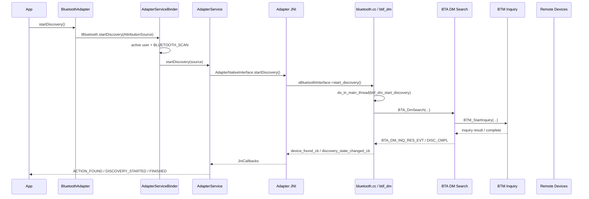
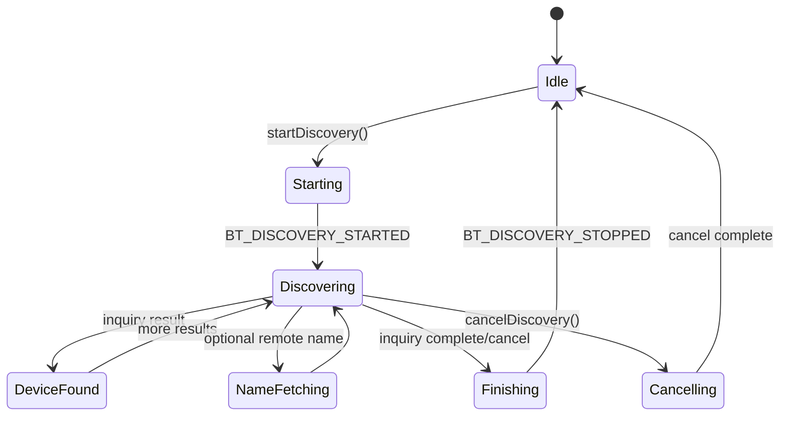

# 21-定向代码阅读报告：Classic Discovery / Scan

## 1. 阅读目标

本报告聚焦经典蓝牙发现流程：`BluetoothAdapter.startDiscovery()` 如何进入蓝牙进程、JNI、BTIF、BTA DM、BTM Inquiry，如何通过 `ACTION_DISCOVERY_STARTED`、`BluetoothDevice.ACTION_FOUND`、`ACTION_DISCOVERY_FINISHED` 回到应用，以及 discovery 与连接、配对、远端名称读取之间的关系。

读完后要能定位：

- App 调 `startDiscovery()` 返回 false。
- discovery started 了但没有 `ACTION_FOUND`。
- 搜到设备但名称为空、类型/地址类型不对。
- 正在 discovery 时连接 A2DP/HFP/Socket 慢或失败。
- 配对/服务发现与 discovery 排队、互相取消或抢占。

## 2. 适用场景

- 车机蓝牙设置页搜索手机、耳机、OBD、遥控器等 BR/EDR 设备。
- 搜索过程中自动配对、自动连接或读取远端 UUID。
- 排查“手机搜不到车机”与“车机搜不到手机”的方向差异。
- 优化车机扫描时长、搜索 UI、连接前取消 discovery 的策略。

## 3. 调用链全景图



## 4. 关键类与源码入口

| 层级 | 源码 | 关键入口 |
| --- | --- | --- |
| Framework API | `framework/java/android/bluetooth/BluetoothAdapter.java` | `startDiscovery()`、`cancelDiscovery()`、`isDiscovering()`、`ACTION_DISCOVERY_STARTED/FINISHED` |
| Device 广播 | `framework/java/android/bluetooth/BluetoothDevice.java` | `ACTION_FOUND`、`EXTRA_RSSI`、`EXTRA_DISCOVERY_RESULT_TYPE`、`EXTRA_CLASS` |
| Binder | `android/app/src/com/android/bluetooth/btservice/AdapterServiceBinder.java` | `startDiscovery(...)`、`cancelDiscovery(...)`、`isDiscovering(...)` |
| Service | `android/app/src/com/android/bluetooth/btservice/AdapterService.java` | `startDiscovery(...)`、连接/配对前 `cancelDiscovery()` |
| 状态与广播 | `android/app/src/com/android/bluetooth/btservice/AdapterProperties.java` | `discoveryStateChangeCallback(...)` -> started/finished broadcast |
| 设备缓存 | `android/app/src/com/android/bluetooth/btservice/RemoteDevices.java` | `deviceFoundCallback(...)`、`DeviceProperties`、`ACTION_FOUND` |
| JNI Callback | `android/app/src/com/android/bluetooth/btservice/JniCallbacks.java` | `deviceFoundCallback(...)`、`discoveryStateChangeCallback(...)` |
| JNI | `android/app/jni/com_android_bluetooth_btservice_AdapterService.cpp` | `startDiscoveryNative()`、`cancelDiscoveryNative()`、`device_found_callback` |
| BTIF | `system/btif/src/bluetooth.cc`、`system/btif/src/btif_dm.cc` | `start_discovery()`、`btif_dm_start_discovery()`、`invoke_device_found_cb(...)` |
| BTA | `system/bta/dm/bta_dm_api.cc`、`system/bta/dm/bta_dm_device_search.cc` | `BTA_DmSearch()`、`bta_dm_search_start()`、`bta_dm_search_sm_execute()` |
| BTM | `system/stack/btm/btm_inq.cc`、`btm_ble_gap.cc` | `BTM_StartInquiry()`、`BTM_CancelInquiry()`、BR/EDR 与 LE inquiry |

## 5. 状态机与生命周期



重点：

- Framework 文档明确 discovery 是重操作，通常包括约 12 秒 inquiry，并可能跟随 page scan/name request。
- `BluetoothAdapter.startDiscovery()` 要求当前状态是 `STATE_ON`，否则直接返回 false。
- 正在 bonding 时 discovery 请求可能被排队；已有排队请求会被忽略。
- 连接前应调用 `cancelDiscovery()`，否则带宽、时延和连接成功率都会受影响。

## 6. 权限检查点与 Binder 边界

Classic Discovery 使用扫描权限：

- Framework API 注解要求 `BLUETOOTH_SCAN`，并带 legacy admin/location 注解。
- `AdapterServiceBinder.startDiscovery(...)` 检查 service 可用、active/managed user、`checkScanPermissionForDataDelivery(...)`。
- `cancelDiscovery()`、`isDiscovering()` 同样检查 `BLUETOOTH_SCAN`。
- `ACTION_FOUND` 广播携带设备、RSSI、Class、name 等信息，接收方也受扫描权限/位置相关规则影响。

易错点：有 `BLUETOOTH_CONNECT` 不代表能 discovery；Classic discovery 属于 scan 数据交付路径。

## 7. Native / Inquiry 边界

主链路：

```text
AdapterNativeInterface.startDiscovery()
  -> startDiscoveryNative()
  -> sBluetoothInterface->start_discovery()
  -> bluetooth.cc start_discovery()
  -> do_in_main_thread(btif_dm_start_discovery)
  -> BTA_DmSearch(btif_dm_search_devices_evt)
  -> bta_dm_search_start(...)
  -> BTM_StartInquiry(...)
```

回调链路：

```text
BTM inquiry result / complete
  -> BTA DM search callback
  -> btif_dm_search_devices_evt
  -> invoke_device_found_cb / invoke_discovery_state_changed_cb
  -> JNI device_found_callback / discovery_state_changed_callback
  -> JniCallbacks
  -> RemoteDevices / AdapterProperties
  -> ACTION_FOUND / ACTION_DISCOVERY_STARTED / FINISHED
```

## 8. 发现结果与设备缓存

`RemoteDevices.deviceFoundCallback(...)` 的职责：

- 根据地址拿到或创建 `DeviceProperties`。
- 读取 name、alias、class、RSSI、UUID、device type、discovery result type 等属性。
- 构造 `BluetoothDevice.ACTION_FOUND` 广播。
- 根据权限发送给合适接收方。

需要区分：

- Classic inquiry result：通常来自 BR/EDR inquiry。
- LE inquiry/广告结果：部分路径会合入 inquiry database，但 BLE Scan 主要应看 `ScanController`。
- 远端名称：可能不是第一时间有，可能需要 remote name request。
- 已绑定设备：可能来自存储，不一定是本次 discovery 结果。

## 9. 可能失败点

| 现象 | 可能原因 | 观察点 |
| --- | --- | --- |
| `startDiscovery()` 返回 false | 蓝牙非 `STATE_ON`、service 不可用、权限失败 | `BluetoothAdapter.getState()`、`AdapterServiceBinder` |
| started 但搜不到 | 对端不可发现、controller inquiry 失败、权限/广播接收问题 | HCI inquiry、`BTM_StartInquiry`、`ACTION_FOUND` |
| 只搜到地址没名字 | remote name 未完成、对端不响应、互操作黑名单 | `bta_dm_discover_name`、`BTA_DM_NAME_READ_EVT` |
| 连接慢或失败 | discovery 未取消，占用控制器和链路资源 | 连接前 `cancelDiscovery()`、HCI snoop |
| 搜索结束广播不来 | cancel/complete 回调丢失、状态机卡住 | `BT_DISCOVERY_STOPPED`、`AdapterProperties.discoveryStateChangeCallback` |
| 配对/服务发现打断 discovery | BTA DM 会取消或排队搜索 | `btif_dm_cancel_discovery()`、BTA search state |

## 10. dumpsys / logcat / bugreport 观察点

常用命令：

```bash
adb shell dumpsys bluetooth
adb logcat -b all -v threadtime | grep -E "AdapterServiceBinder|AdapterService|AdapterProperties|RemoteDevices|bt_btif|bt_stack|BTA_DM|BTM_Inq|inquiry|ACTION_FOUND"
```

建议同时抓：

- `ACTION_DISCOVERY_STARTED/FINISHED` 时间。
- `ACTION_FOUND` 设备数量、RSSI、Class、name。
- `btif_dm_start_discovery` / `btif_dm_cancel_discovery`。
- `BTA_DmSearch`、`BTM_StartInquiry`、`BTM_CancelInquiry`。
- btsnoop 中 Inquiry、Inquiry Result、Remote Name Request。

## 11. 定制修改思路

### 11.1 车机搜索 UI

建议：

- 搜索按钮只在 `STATE_ON` 可用。
- UI 明确显示 started/finished，而不是只靠固定倒计时。
- 去重设备地址，分开展示 bonded、classic found、BLE found。
- 连接前自动 `cancelDiscovery()`，并等待 discovery stopped 或设置短暂保护。

### 11.2 搜索策略优化

可做：

- 限制重复 startDiscovery 频率。
- 搜索期间降低自动连接尝试，避免互相抢控制器。
- 对车机已知设备优先走 bonded list/自动回连，不依赖 discovery。
- 对“搜不到手机”的用户提示手机需要处于可发现模式。

### 11.3 诊断增强

建议在 dumpsys 中记录：

- 最近 discovery 调用方、开始/结束时间、结果数量。
- cancel 调用方和原因。
- 是否处于 bonding/service discovery/name request 阶段。
- 最近失败的 native status 或 inquiry complete status。

## 12. 最容易踩的坑

- 以为 discovery 能搜到所有设备。Classic 只能搜到对端处于 discoverable 的设备。
- 连接前不取消 discovery，导致连接慢、SCO/A2DP 建链失败或超时。
- 把 BLE Scan 和 Classic Discovery 混为一谈，权限、回调、结果结构都不同。
- 只看 App 没收到 `ACTION_FOUND`，不看广播权限和接收方运行状态。
- 搜索 UI 固定 12 秒结束，但 native 可能被取消、排队或提前完成。
- 将 bonded list 当作本次搜索结果，导致 UI 误导。

## 13. 练习题与参考答案

### 练习 1：`startDiscovery()` 返回 false，怎么查？

参考答案：

1. 查 `BluetoothAdapter.getState()` 是否为 `STATE_ON`。
2. 查调用方是否有 `BLUETOOTH_SCAN` 和必要位置/AppOps。
3. 查是否 active/managed user。
4. 看 `AdapterServiceBinder.startDiscovery` 是否进入。
5. 看 `AdapterService.startDiscovery` 是否调用 native。

### 练习 2：搜索期间为什么不建议连接？

参考答案：

Discovery 会让 controller 做 inquiry、remote name 等重操作，带宽和时延都会变差。Framework 文档也明确建议连接前 `cancelDiscovery()`。如果不取消，ACL/RFCOMM/A2DP/HFP 建链更容易超时或变慢。

### 练习 3：车机搜不到手机，但手机能搜到车机，说明什么？

参考答案：

这两个方向不是同一个问题。车机搜手机要求手机处于 discoverable；手机搜车机要求车机处于 discoverable/page scan/inquiry scan 配置正确。应分别检查手机可发现状态、车机 scan mode、HCI inquiry result 和 `ACTION_FOUND`。

## 14. 案例库映射

可沉淀到 `97-真实案例库.md` 的案例：

- 搜索中连接手机失败：连接前未 cancel discovery。
- 车机搜索不到手机：手机不处于 discoverable，HCI 无 inquiry result。
- 搜到设备无名称：remote name request 被取消或对端不响应。
- 搜索结束广播丢失：`BT_DISCOVERY_STOPPED` 未回到 `AdapterProperties`。
