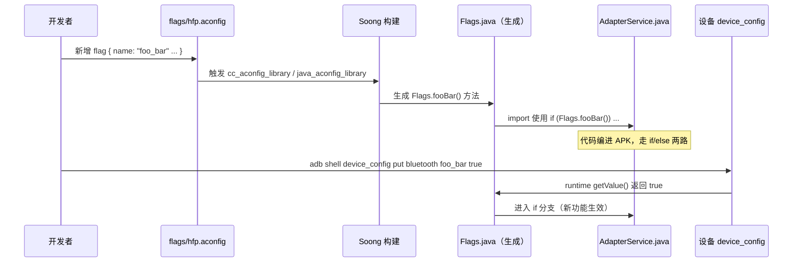

# 21.1 aconfig 系统机制

> **速通摘要**：**aconfig**（Android Config Flags）是 Android 13 引入的官方 feature flag 框架，替代了过去杂乱的 `DeviceConfig` / sysprop / build-time `#ifdef`。它用 `.aconfig` 文件定义 flag，Soong 自动生成 Java/C++ 常量访问类（`Flags.java` / `flags.h`），运行时可通过 `device_config` / `adb shell device_config` 覆盖。蓝牙模块在 `flags/` 目录下有 43 个 `.aconfig` 文件（约 200+ 个 flag），涵盖 A2DP、HFP、LE Audio、Socket、Security 等所有子模块。本节梳理 aconfig 的设计原则、生命周期、如何在代码里使用，以及车机 OEM 如何查询和修改 flag。

---

## 学习目标

读完本节后，你能：
1. 解释 aconfig flag 的设计目标（vs 旧 DeviceConfig）。
2. 看懂 `.aconfig` 文件语法（`flag{}`、`is_exported`、`metadata { purpose: PURPOSE_BUGFIX }`）。
3. 找到 `Flags.java` 调用点，理解 `Flags.someFlag()` 在 runtime 如何被覆盖。
4. 用 `adb shell device_config` 命令覆盖单个 flag 值。

---

## 前置知识

- [03 核心流程](../03_核心流程/) — 了解蓝牙开关基本流程
- Soong 构建系统基础

---

## 场景故事

车机工程师发现 Android 16 里新加了一个"SCO 由 Audio HAL 统一管理"的功能（`sco_managed_by_audio_remove_hfp_hal`），但车机芯片 HAL 还没适配。如果这个 flag 默认开启，通话会失败。

解决办法：在 factory image 里把该 flag 关掉，等 HAL 升级后再打开。这就是 aconfig 的典型用法——**安全地 rollout 新功能，出了问题可以立刻回滚**。

---

## 一、aconfig 的设计目标

| 旧方法 | 问题 | aconfig 解决方案 |
|--------|------|-----------------|
| `DeviceConfig.getBoolean("bluetooth", "key", false)` | 运行时字符串查找，类型不安全，文档散乱 | 编译期生成强类型访问类 |
| `SystemProperties.get("persist.bluetooth.xxx")` | sysprop 命名空间不规范 | 统一 namespace / package 管理 |
| `#ifdef BUILD_FLAG` in C++ | 构建时固定，不可运行时覆盖 | 运行时可覆盖（保留构建时优化） |
| 散落各处的 feature 开关 | 无法统一追踪 flag 生命周期 | 强制附带 `bug:` 追踪，区分 feature vs bugfix |

**核心设计原则**：
1. **类型安全**：Boolean/Integer/String 等类型在编译期确定
2. **可审计**：每个 flag 必须附带 bug 追踪号
3. **可测试**：测试代码可在 per-test 粒度覆盖 flag 值
4. **自动清理**：flag 进入 LAUNCHED 状态后工具自动提示清理

---

## 二、`.aconfig` 文件语法

```
# flags/hfp.aconfig（本仓库真实文件）
package: "com.android.bluetooth.flags"   # ← Java 包名 / C++ 命名空间前缀
container: "com.android.bt"             # ← APEX 容器名

flag {
    name: "sco_managed_by_audio_remove_hfp_hal"
    namespace: "bluetooth"               # ← device_config 命名空间
    description: "Deprecate the btm_sco_hfp_hal and migrate to IBluetoothAudio"
    bug: "417621867"                     # ← 强制追踪
}

flag {
    name: "fix_hfp_qual_1_9"
    namespace: "bluetooth"
    description: "Fix multiple issues in CVSD fallback logics"
    bug: "332650199"
    metadata {
        purpose: PURPOSE_BUGFIX          # ← 区分 feature vs bugfix
    }
}

flag {
    name: "support_zoomed_in_icon_metadata"
    namespace: "bluetooth"
    is_exported: true                    # ← 是公开 API，需要 SDK 兼容保证
    description: "Add api support for a zoomed in icon metadata"
    bug: "417245933"
}
```

### 关键字段说明

| 字段 | 含义 |
|------|------|
| `package` | 生成的 Java 类所在包；C++ 命名空间 |
| `container` | APEX 模块名（影响 flag 更新时机） |
| `name` | flag 名，生成方法名时转为 camelCase |
| `namespace` | `device_config` 命名空间（查询时用） |
| `is_exported` | 是否为公开 API flag，导出到 SDK |
| `metadata { purpose: PURPOSE_BUGFIX }` | 标记为 bugfix，不是新功能 |

---

## 三、Soong 生成的访问类

Soong 读取 `.aconfig` 文件后自动生成：

### Java（android/app 层）

```java
// 自动生成：out/.../com/android/bluetooth/flags/Flags.java
// （不在仓库源码里，是构建产物）
package com.android.bluetooth.flags;

public final class Flags {
    // 每个 flag 生成一个同名的静态方法
    public static boolean scoManagedByAudioRemoveHfpHal() {
        return FEATURE_SCO_MANAGED_BY_AUDIO_REMOVE_HFP_HAL.getValue();
    }

    public static boolean fixHfpQual19() {
        return FEATURE_FIX_HFP_QUAL_1_9.getValue();
    }

    // is_exported flag → 同时生成到 framework Flags.java，供 App 使用
    public static boolean supportZoomedInIconMetadata() {
        return FEATURE_SUPPORT_ZOOMED_IN_ICON_METADATA.getValue();
    }
    // ...
}
```

### C++（native 栈）

```cpp
// 自动生成：out/.../bluetooth_flags.h
namespace bluetooth::flags {
    bool sco_managed_by_audio_remove_hfp_hal();
    bool fix_hfp_qual_1_9();
}
```

---

## 四、生产代码中的使用方式

### 4.1 Java 层（AdapterService.java）

```java
// android/app/src/com/android/bluetooth/btservice/AdapterService.java
import com.android.bluetooth.flags.Flags;

// 用法 1：功能开关
if (Flags.adapterSuspendMgmt()) {
    // 新的 AdapterSuspend 逻辑（Android 16 新增）
    mAdapterSuspend.handleSuspend(isSuspend);
} else {
    // 旧的直接调用 setAdapterProperty
    nativeSetAdapterProperty(...);
}

// 用法 2：权限行为切换
if (Flags.rebokePermissionOnUnbond() && fromState == BOND_BONDED) {
    revokeBluetoothPermissions(device);
}
```

### 4.2 flag 在代码里变成 `camelCase` 方法名

`.aconfig` 里的 `name: "adapter_suspend_mgmt"` → Java 方法 `Flags.adapterSuspendMgmt()`

规则：snake_case → camelCase，首字母小写。

---

## 五、flag 的生命周期

```
DISABLED ──────────────────────────────────────────────────────►
    │ (默认值，代码里走 else 分支)                               │
    ▼                                                            │
ENABLED (per-device override 或 Mainline 更新)                  │
    │ (新功能逐步 rollout)                                       │
    ▼                                                            │
LAUNCHED (Google 宣布正式发布，default=true，不可再 disable)    │
    │                                                            │
    ▼                                                            │
CLEANUP (工具标记，提示删除 if/else 分支，只保留 true 路径)     │
    │                                                            ▼
DELETED (代码清理完成，flag 定义删除)                     ───────►
```

- **DISABLED 阶段**：OEM 可以安全关闭
- **LAUNCHED 阶段**：不可再关闭，必须兼容
- **PURPOSE_BUGFIX**：进入 DISABLED→ENABLED 更快，不经历正常的 ramp-up

---

## 六、运行时查询与覆盖

### 6.1 查询所有蓝牙 flag

```bash
# 查询 namespace=bluetooth 下的所有 flag
adb shell device_config list bluetooth

# 查询单个 flag
adb shell device_config get bluetooth sco_managed_by_audio_remove_hfp_hal
```

### 6.2 覆盖 flag 值（调试 / 车机 OEM）

```bash
# 临时覆盖（重启后失效）
adb shell device_config put bluetooth sco_managed_by_audio_remove_hfp_hal false

# 持久覆盖（重启后保留）
adb shell device_config put bluetooth sco_managed_by_audio_remove_hfp_hal false
# 然后需要重启蓝牙服务生效
adb shell am force-stop com.android.bluetooth
# 或者重启系统

# 重置为默认值
adb shell device_config delete bluetooth sco_managed_by_audio_remove_hfp_hal
```

### 6.3 在测试代码里覆盖 flag

```java
// 单元测试 / instrumentation test 中
import android.platform.test.flag.junit.SetFlagsRule;

@Rule
public SetFlagsRule mSetFlagsRule = new SetFlagsRule();

@Test
public void test_with_flag_disabled() {
    mSetFlagsRule.disableFlags(Flags.FLAG_SCO_MANAGED_BY_AUDIO_REMOVE_HFP_HAL);
    // 现在 Flags.scoManagedByAudioRemoveHfpHal() 返回 false
    // ...
}
```

---

## 七、`flags/` 目录总览（本仓库）

```
flags/
├── 25q2_exported_api_flags.aconfig  # 25Q2 正式发布的 API flag（已 LAUNCHED）
├── a2dp.aconfig                     # A2DP 相关（16 个 flag）
├── adapter.aconfig                  # Adapter 基础（14 个 flag）
├── framework.aconfig                # Framework 层（8 个 flag）
├── hfp.aconfig                      # HFP 相关（23 个 flag）
├── leaudio.aconfig                  # LE Audio（20+ flag）
├── native.aconfig                   # Native 栈通用（10 个 flag）
├── ranging.aconfig                  # Channel Sounding（2 个 flag）
├── security.aconfig                 # 安全（5 个 flag）
├── sockets.aconfig                  # Socket/L2CAP（17 个 flag）
└── ...（共 43 个文件，约 200+ flag）
```

---

## 八、Mermaid：aconfig flag 流转链路



---

## 九、调试方法

```bash
# 1. 列出所有 bluetooth namespace flag
adb shell device_config list bluetooth | sort

# 2. 查看某个 flag 的当前值（null = 走代码默认值）
adb shell device_config get bluetooth adapter_suspend_mgmt

# 3. 强制开启某个功能（测试新功能）
adb shell device_config put bluetooth adapter_suspend_mgmt true

# 4. 关闭某功能（规避问题）
adb shell device_config put bluetooth sco_managed_by_audio_remove_hfp_hal false

# 5. 重置 namespace 全部 flag 为默认
adb shell device_config reset trusted_defaults bluetooth

# 6. 查 flag 在代码中的引用（找 feature 分支）
grep -r "Flags\.scoManagedByAudioRemoveHfpHal" \
    android/app/src/com/android/bluetooth/

# 7. 编译时确认 flag 生成是否正确
# 检查产物路径（AOSP 构建后）
find out/ -name "Flags.java" -path "*/bluetooth/*" | head -3
```

---

## FAQ

**Q1：aconfig flag 和 `persist.bluetooth.*` sysprop 有什么区别？**
sysprop 是 OEM 配置（读设备属性，OEM 可在 `build.prop` / `vendor.prop` 写死），一般用于"硬件能力"或"厂商默认值"。aconfig flag 是 Google 用于功能 rollout 的动态开关，通过 `device_config`（Mainline 机制）更新，不需要 OTA。二者互补。

**Q2：`is_exported: true` 的 flag 有什么限制？**
已导出为公开 API 的 flag 一旦 LAUNCHED 就**永远不能删除或改变语义**，否则会破坏第三方 App 的二进制兼容。`25q2_exported_api_flags.aconfig` 就是专门存放"已 LAUNCHED 但还未清理"的 is_exported flag，以便和普通 flag 分开管理。

**Q3：车机 OEM 可以默认关掉某个 aconfig flag 吗？**
可以，在工厂烧录阶段通过 `device_config` 写入 flag 值，这样设备出厂时 flag 就是 OEM 指定的值。但 Google 可能在 Mainline OTA 后把 flag 改回 true（如果该 flag 已 LAUNCHED），所以 OEM 应追踪 flag 状态。

**Q4：如何在 C++ native 栈里使用 flag？**
```cpp
#include "bluetooth_flags.h"  // 自动生成
if (bluetooth::flags::sco_managed_by_audio_remove_hfp_hal()) {
    // 新逻辑
}
```
与 Java 侧完全对应，底层读同一个 `device_config` 值。

---

## 上路任务

1. 在设备上跑 `adb shell device_config list bluetooth | wc -l`，数一数当前有多少 flag 被覆盖（非 null）。
2. 找到 `flags/adapter.aconfig` 中的 `adapter_suspend_mgmt` flag，追踪它在代码里的所有使用点：`grep -r "adapterSuspendMgmt\|adapter_suspend_mgmt" android/ system/ --include="*.java" --include="*.cc"`。
3. 用 `SetFlagsRule` 写一个最小单元测试，分别测 `adapterSuspendMgmt=true` 和 `=false` 两个分支的代码路径。
