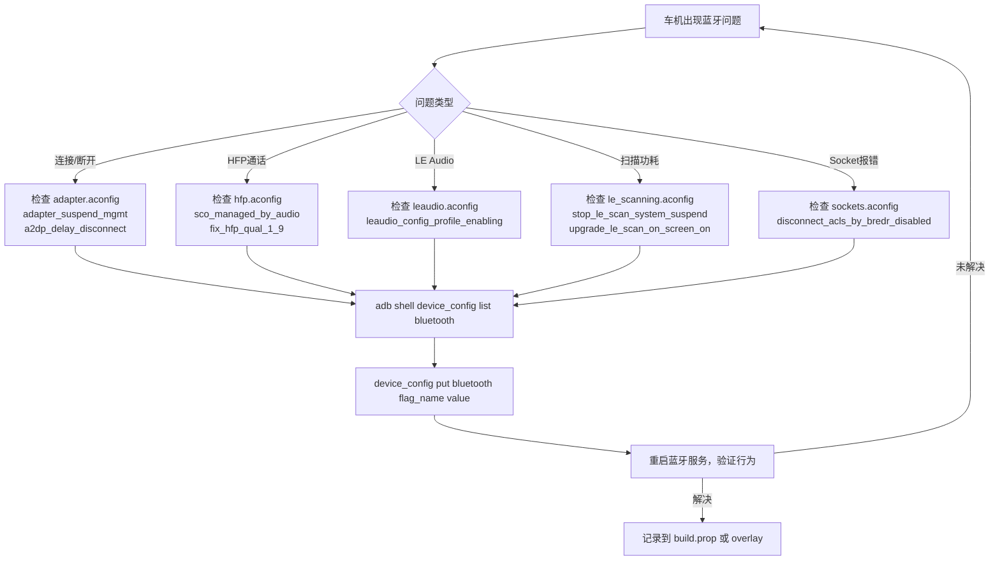

# 21.2 关键 Flag 速查

> **速通摘要**：本节把蓝牙模块约 200+ 个 aconfig flag 中，对**车机工程师最有影响力**的约 40 个 flag 按领域分组整理，每条给出：flag 名、所在 `.aconfig` 文件、影响范围、默认值方向、车机典型用法。有了这张速查表，遇到蓝牙行为异常时，可以迅速锁定"是不是某个 flag 导致的"，而无需逐行读代码。

---

## 学习目标

读完本节后，你能：
1. 快速定位某类问题对应的 flag 名。
2. 区分 feature flag 和 bugfix flag 的不同处理策略。
3. 知道哪些 flag 对车机场景影响最大。

---

## 前置知识

- [21.1 aconfig 系统机制](21.1_aconfig系统机制.md)

---

## 一、Adapter / 电源管理类

| Flag 名 | 文件 | 说明 | 车机影响 |
|---------|------|------|---------|
| `adapter_suspend_mgmt` | `adapter.aconfig` | 开启 AdapterSuspend 统一管理（screen-off 省电）| 车机通常屏幕常亮，关掉此 flag 可避免意外 suspend |
| `adapter_suspend_advertisement` | `adapter.aconfig` | suspend 时自动关闭广告 | 车机需要被手机搜到，建议保持默认（false → 不暂停） |
| `adapter_suspend_discoverability` | `adapter.aconfig` | suspend 时关可发现性 | 同上，车机建议关闭 |
| `ref_counted_native_wakelock` | `adapter.aconfig` | wakelock 引用计数，防重复释放 | bugfix，应开启 |
| `return_correct_ble_state` | `adapter.aconfig` | `getState()` 返回正确 BLE Only 状态 | BLE Only 模式的车机需要 |
| `watch_device_override_airplane_mode` | `adapter.aconfig` | Watch 类设备可绕过飞行模式 | 非穿戴场景无影响 |
| `use_data_store_storage` | `adapter.aconfig` | 用 DataStore 替换旧存储（支持 rollback）| 新架构，Android 16+ 推荐开启 |

```bash
# 查询 adapter 相关 flag 当前值
adb shell device_config list bluetooth | grep -E "adapter|wakelock|state"
```

---

## 二、A2DP / AVRCP 类

| Flag 名 | 文件 | 说明 | 车机影响 |
|---------|------|------|---------|
| `a2dp_delay_disconnect` | `a2dp.aconfig` | A2DP 断开时短暂延迟，提升互操作性 | 车机切换设备时避免音频闪断 |
| `a2dp_disconnect_reason_api` | `a2dp.aconfig` | `CONNECTION_STATE_CHANGED` intent 携带断连原因 | 便于 OEM App 诊断断连原因 |
| `a2dp_lhdc_api` | `a2dp.aconfig` | LHDC 编解码器 API 变更（is_exported） | 支持 LHDC 的车机需关注 |
| `lhdc_codec_support` | `a2dp.aconfig` | 实现 LHDCv5 编解码支持 | 高端车机音频 |
| `synchronize_codec_preferences_and_priority` | `a2dp.aconfig` | 修复必选 Codec 优先级错误（bugfix）| 应开启 |
| `avdt_wait_for_initial_delay_report_as_initiator` | `a2dp.aconfig` | 作为信令发起方时，先等 delay report 再 open | 解决部分 Sink 兼容问题 |
| `avrcp_16_default` | `avrcp.aconfig` | 默认使用 AVRCP 1.6（含 Browsing）| 支持 Browsing 的车机建议开启 |
| `unify_absolute_volume_management` | `avrcp.aconfig` | 统一绝对音量管理路径 | 车机绝对音量控制相关 |

```bash
adb shell device_config list bluetooth | grep -E "a2dp|avrcp|codec|lhdc"
```

---

## 三、HFP 类

| Flag 名 | 文件 | 说明 | 车机影响 |
|---------|------|------|---------|
| `sco_managed_by_audio_remove_hfp_hal` | `hfp.aconfig` | SCO 由 Audio HAL 统一管理，移除旧 HFP HAL | 车机 Audio HAL 未适配前须关闭 |
| `fix_hfp_qual_1_9` | `hfp.aconfig` | 修复 CVSD fallback 逻辑（HFP Qual 1.9 相关）| bugfix，应开启 |
| `maintain_call_index_after_conference` | `hfp.aconfig` | 多方通话挂出后保持 CLCC 索引 | 车机多方通话必要 bugfix |
| `non_conference_call_hangup` | `hfp.aconfig` | 保持通话时挂断活跃通话 | 通话管理场景 |
| `voice_recognition_fixes` | `hfp.aconfig` | 修复语音识别启停问题 | 车机语音助手必要 bugfix |
| `microphone_mute_status_sync` | `hfp.aconfig` | 同步外设麦克风静音状态 | 车机麦克风静音按键同步 |
| `hfp_sco_state_reset_when_profile_restart` | `hfp.aconfig` | Profile 重启不 shutdown 时重置 SCO 状态 | 车机异常恢复场景 |
| `sco_state_machine_cleanup` | `hfp.aconfig` | 耳机断开时清理 SCO 状态机 | bugfix，应开启 |

```bash
adb shell device_config list bluetooth | grep -E "hfp|sco|call|voice"
```

---

## 四、LE Audio 类

| Flag 名 | 文件 | 说明 | 车机影响 |
|---------|------|------|---------|
| `leaudio_config_profile_enabling` | `leaudio.aconfig` | 改变 LE Audio Profile 启用方式 | LE Audio 车机需要 |
| `leaudio_set_codec_config_preference` | `leaudio.aconfig` | 新 API：设置 Codec 配置偏好 | 开发自定义 Codec 偏好时用 |
| `leaudio_broadcast_monitor_source_sync_status` | `leaudio.aconfig` | 改进广播源同步状态 API（is_exported）| Auracast 车机 |
| `leaudio_multiple_vocs_instances_api` | `leaudio.aconfig` | 多音频输出音量偏移（is_exported）| 多区域音频车机 |
| `leaudio_dynamic_direction_opening` | `leaudio.aconfig` | 按需开启方向（bugfix）| 省电优化 |
| `leaudio_add_opus_codec_type` | `25q2_exported_api_flags.aconfig` | 新增 OPUS Codec 类型（is_exported）| 已 LAUNCHED（25Q2） |
| `channel_sounding` | `ranging.aconfig` | 启用 Channel Sounding 测距（is_exported）| UWB 替代方案，高端车机 |

---

## 五、安全类

| Flag 名 | 文件 | 说明 | 车机影响 |
|---------|------|------|---------|
| `btsec_cycle_irks` | `security.aconfig` | 全部解绑时轮换 IRK（spec 要求）| 隐私保护 bugfix，应开启 |
| `upgrade_temp_bonding_on_auth_req` | `security.aconfig` | 临时配对收到 auth request 时升级安全级别 | 修复配对兼容性问题 |
| `btsec_check_controller_sc_support` | `security.aconfig` | 断连前同时检查 host + controller SC 支持 | 修复 SC 误判问题 |
| `reboke_permission_on_unbond` | `security.aconfig` | 解绑时移除 PBAP/MAP/SAP 权限 | 隐私合规相关 |
| `retain_address_type` | `adapter.aconfig` | 解析地址时保留 address type | BLE Privacy 修复 |
| `identity_to_pseudo_addr` | `adapter.aconfig` | 用伪地址替换 identity addr 上报 | BLE 隐私地址处理 |

---

## 六、Socket / L2CAP 类

| Flag 名 | 文件 | 说明 | 车机影响 |
|---------|------|------|---------|
| `bt_socket_api_l2cap_cid` | `sockets.aconfig` | 新 API：获取 L2CAP channel ID（is_exported）| L2CAP CoC 应用开发 |
| `bt_offload_socket_api` | `sockets.aconfig` | 新 API：创建 offload socket（is_exported）| 音频 offload socket |
| `socket_settings_api` | `sockets.aconfig` | 新 socket settings 接口（加密专用 socket）| 安全传输需求 |
| `set_max_data_length_for_lecoc` | `sockets.aconfig` | LE CoC 连接时设最大数据长度（bugfix）| BLE 高吞吐场景 |
| `make_socket_read_behavior_consistent` | `sockets.aconfig` | RFCOMM/LECOC socket EOF 行为一致（bugfix）| 应开启 |
| `disconnect_acls_by_bredr_disabled` | `sockets.aconfig` | BREDR 禁用时断开 ACL 链路（bugfix）| 修复遗留连接泄漏 |

---

## 七、Framework / Scan 类

| Flag 名 | 文件 | 说明 | 车机影响 |
|---------|------|------|---------|
| `add_profile_as_intent_extra` | `framework.aconfig` | CONNECTION_STATE_CHANGED intent 携带 profile 字段 | OEM App 可直接读 profile 类型 |
| `hci_instance_name_use_injected` | `framework.aconfig` | inject HCI instance name（多 HCI 场景）| 23 章 Vendor 扩展相关 |
| `only_start_scan_during_ble_on` | `adapter.aconfig` | 只在 BLE ON 状态允许扫描（架构重构）| 扫描时序相关 |
| `upgrade_le_scan_on_screen_on` | `le_scanning.aconfig` | 亮屏时升级 LE 扫描模式 | 省电 vs 响应速度权衡 |
| `support_passive_scanning` | `le_scanning.aconfig` | 支持被动扫描（不发 ADV REQ）| 省电场景 |
| `stop_le_scan_system_suspend` | `le_scanning.aconfig` | 系统 suspend 时停止 LE 扫描 | 车机息屏功耗优化 |

---

## 八、已 LAUNCHED 的 API Flag（不可关闭）

文件 `flags/25q2_exported_api_flags.aconfig` 存放 **25Q2 已发布**的 API flag，这些 flag 已经 LAUNCHED，在 Android 16 上永远为 true：

| Flag 名 | 功能 |
|---------|------|
| `channel_sounding_25q2_apis` | Channel Sounding 新 API |
| `directed_advertising_api` | 定向广告新 API |
| `encryption_change_broadcast` | 加密变化广播 |
| `identity_address_type_api` | Identity Address 类型 API |
| `key_missing_public` | `ACTION_KEY_MISSING` 公开 API |
| `leaudio_add_opus_codec_type` | OPUS Codec 类型 |
| `support_bluetooth_quality_report_v6` | BQR v6 API |
| `support_metadata_device_types_apis` | 设备类型 metadata API |

> 这些 flag 在 25Q2 后不可再 disable，OEM 必须确保代码兼容这些 API 的新行为。

---

## 九、Mermaid：车机 flag 决策流



---

## 调试方法

```bash
# 1. 批量查看所有被覆盖（非 null）的蓝牙 flag
adb shell device_config list bluetooth

# 2. 统计 flag 覆盖数量
adb shell device_config list bluetooth | grep -v "^$" | wc -l

# 3. 关闭可能有问题的 feature flag（车机适配期常见操作）
adb shell device_config put bluetooth sco_managed_by_audio_remove_hfp_hal false
adb shell device_config put bluetooth adapter_suspend_mgmt false

# 4. 一键重置蓝牙 namespace（清除所有覆盖）
adb shell device_config reset trusted_defaults bluetooth

# 5. 在 build 阶段固化 flag（写入 vendor overlay）
# 在 device/<oem>/<product>/overlay/frameworks/base/core/res/res/values/config.xml
# 或通过 device_config_default.xml 写入默认值

# 6. 搜索特定 flag 在代码里的所有影响点
FLAG="adapter_suspend_mgmt"
# Java 调用（camelCase）
JAVA_FLAG=$(echo $FLAG | sed 's/_\([a-z]\)/\U\1/g' | sed 's/^./\l&/')
grep -r "Flags\.$JAVA_FLAG" android/app/src/ --include="*.java"
```

---

## FAQ

**Q1：如何判断一个 flag 是否默认开启？**
`.aconfig` 文件里没有 `value:` 字段——默认值由 Google Mainline 管理，本地无法直接看到。方法：① `adb shell device_config get bluetooth flag_name` 若返回 null 说明走编译时默认（通常 false）；② 看 AOSP 的 `android_bluetooth_enabled_flags.textproto` 文件（AOSP 仓库，本仓库没有）。

**Q2：`PURPOSE_BUGFIX` 的 flag 和普通 feature flag 有什么区别？**
`PURPOSE_BUGFIX` 标记表示这是一个修复已知 bug 的 flag，Google 会优先 rollout，且通过 Mainline 更新比 feature flag 更激进。OEM 一般应跟随 AOSP 默认（不关闭 bugfix flag）。

**Q3：OEM 能阻止 Google 通过 Mainline 更新 flag 吗？**
不能。Mainline 模块（`com.android.bt` APEX）由 Google 直接更新，OEM 无法阻止。但 OEM 可以在自己的 `device_config` overlay 写入覆盖值，在下次 Mainline 更新前强制使用某个值。

---

## 上路任务

1. 运行 `adb shell device_config list bluetooth` 看自己手机上有哪些 flag 被覆盖，和本节速查表对比。
2. 从 `flags/leaudio.aconfig` 中任选 3 个 flag，在 `android/app/src/com/android/bluetooth/` 里追踪它们的实际使用位置（`grep -r "Flags.<flagCamelCase>"` ）。
3. 尝试关闭 `adapter_suspend_mgmt` 后重启蓝牙服务，观察 `AdapterSuspend` 相关日志是否消失：`adb logcat -s AdapterSuspend:V Bluetooth:V`。
