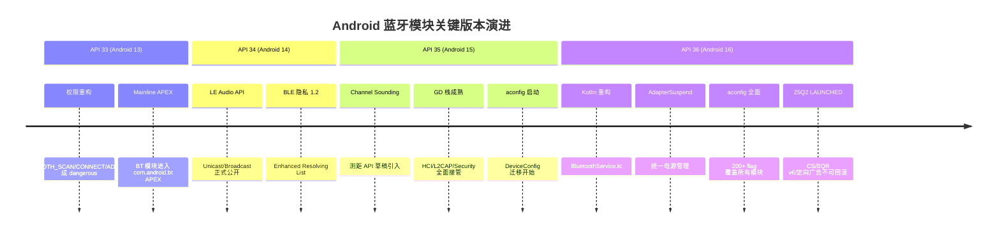

# 21.3 Android 13 → 14 → 15 → 16 蓝牙模块差异

> **速通摘要**：Android 蓝牙模块自 Android 13（API 33）起经历了三次大版本演进，每版都有影响车机开发的重大变化：① **Android 13**：权限模型重构（`BLUETOOTH_SCAN` / `BLUETOOTH_CONNECT` 成 dangerous）、蓝牙模块迁移进 Mainline APEX；② **Android 14**：LE Audio unicast/broadcast 正式 API 落地、`DeviceConfig`→aconfig 迁移启动；③ **Android 15**：GD（Generic Device）模块化栈成熟、Channel Sounding 引入；④ **Android 16**：aconfig flag 体系完善、`BluetoothService.kt` Kotlin 重构、AdapterSuspend 电源管理、多 APEX 容器。本节逐版列出对车机工程师影响最大的变化。

---

## 学习目标

读完本节后，你能：
1. 列出 Android 13/14/15/16 蓝牙模块的 4 大核心变化。
2. 解释权限重构对现有 OEM App 的影响及迁移方法。
3. 理解 Mainline APEX 对 OEM 定制能力的限制。
4. 知道 Channel Sounding / LE Audio API 从哪个版本起可用。

---

## 前置知识

- [21.1 aconfig 系统机制](21.1_aconfig系统机制.md)
- [02.1 BluetoothAdapter 详解](../02_Framework_API导读/02.1_BluetoothAdapter详解.md)
- [12.1 LE Audio 全景](../12_LE_Audio全景/12.1_LE_Audio全景.md)

---

## 场景故事

OEM 工程师负责把车机从 Android 13 升级到 Android 16。升级后发现：
- 自研蓝牙辅助 App 调 `startDiscovery()` 崩溃（权限问题）
- HFP SCO 路径行为变了（新 HAL 接入）
- LE Audio 相关 API 有了但 CTS 要求实现更多方法

每个版本的变化都要逐一消化，本节是这个"升级地图"。

---

## 一、版本速览表

| 版本 | API Level | 代号 | 蓝牙关键变化 |
|------|-----------|------|-------------|
| Android 13 | 33 | Tiramisu | 权限重构、Mainline BT APEX、LE Scan/Adv 权限拆分 |
| Android 14 | 34 | Upside Down Cake | LE Audio unicast API 正式、BLE 5.3 隐私增强 |
| Android 15 | 35 | Vanilla Ice Cream | Channel Sounding 引入、GD 栈成熟、aconfig 启动 |
| Android 16 | 36 | Baklava | aconfig 全面铺开、Kotlin 重构、AdapterSuspend、多 HCI |

---

## 二、Android 13（API 33）：权限重构

### 2.1 最大变化：蓝牙权限变为 dangerous

Android 12 以前：`BLUETOOTH` / `BLUETOOTH_ADMIN` 是 normal 权限，App 无需 runtime 授权。

Android 12/13 起：引入三个新 dangerous 权限：

| 权限 | 说明 | 涉及操作 |
|------|------|---------|
| `BLUETOOTH_SCAN` | 扫描附近设备 | `startDiscovery()` / `startScan()` |
| `BLUETOOTH_CONNECT` | 连接配对设备 | `connect()` / `createBond()` |
| `BLUETOOTH_ADVERTISE` | 发广播 | `startAdvertising()` |

旧的 `BLUETOOTH` / `BLUETOOTH_ADMIN` 仅作兼容保留（targetSdkVersion < 31 的 App 自动映射）。

### 2.2 对 OEM App 的影响

```java
// Android 12 以前的老写法（不再工作）
// <uses-permission android:name="android.permission.BLUETOOTH" />

// Android 13+ 正确写法
// AndroidManifest.xml
<uses-permission android:name="android.permission.BLUETOOTH_SCAN" />
<uses-permission android:name="android.permission.BLUETOOTH_CONNECT" />
<uses-permission android:name="android.permission.BLUETOOTH_ADVERTISE" />

// Java/Kotlin 代码中
if (ContextCompat.checkSelfPermission(ctx, Manifest.permission.BLUETOOTH_SCAN)
        != PackageManager.PERMISSION_GRANTED) {
    ActivityCompat.requestPermissions(activity,
        new String[]{Manifest.permission.BLUETOOTH_SCAN}, REQUEST_CODE);
}
```

CTS 里有专门验证权限的用例（见 20.2 节）：
```java
// android/app/.../gatt/GattServiceBinder.java
if (checkCallerTargetSdk(service, callingPackage, Build.VERSION_CODES.TIRAMISU)) {
    // targetSdk >= 33 的调用者必须有 BLUETOOTH_SCAN
    enforceBTScanPermission(service, source, callingPackage, callingFeatureId, "startScan");
}
```

### 2.3 蓝牙迁移进 Mainline APEX

从 Android 13 起，蓝牙模块（`com.android.bt`）作为 Mainline APEX 分发，Google 可通过 Play Store 更新，不需要 OEM OTA。

**对 OEM 的限制**：
- OEM 不能再随意修改 `packages/modules/Bluetooth` 的公开接口
- OEM 定制必须通过 HAL 接口或 vendor overlay（sysprop/resource overlay）
- 车机特有功能可以通过 aconfig flag + OEM App 实现

---

## 三、Android 14（API 34）：LE Audio API 正式落地

### 3.1 LE Audio Unicast 正式 API

Android 14 将 LE Audio Unicast 相关 API 从 `@hide` 提升为公开 API：

```java
// 新增：BluetoothLeAudio (Unicast)
BluetoothLeAudio leAudio = (BluetoothLeAudio) adapter.getProfileProxy(
    ctx, listener, BluetoothProfile.LE_AUDIO);
leAudio.setVolume(device, 50);  // 控制音量
leAudio.connect(device);

// 新增：BluetoothLeBroadcast (Broadcast / Auracast)
BluetoothLeBroadcast broadcast = ...;
broadcast.startBroadcast(contentMetadata, broadcastCode);
```

CDD 7.4.3.5 对应要求（见 20.2 节）在 Android 14 起生效。

### 3.2 BLE 5.3 隐私增强（Privacy 1.2）

- 引入 `ENHANCED_RESOLVING_LIST` 支持
- RPA 地址更新间隔优化
- `BluetoothDevice.getIdentityAddressType()` API（在 Android 16 的 `identity_address_type_api` flag 下 LAUNCHED）

### 3.3 A2DP Codec 扩展

- aptX Lossless 在 Android 14 起支持（需 flag `a2dp_lhdc_api`）
- 编解码器切换时通知改进（`CODE_SWITCHED_CODEC` event）

---

## 四、Android 15（API 35）：GD 栈成熟 + Channel Sounding

### 4.1 GD 模块化栈成熟

Android 15 里 GD（Gabeldorsche / Generic Device）模块化栈正式替代大量传统 C++ 代码：

- `system/gd/hci/` — HCI 模块（ACL 管理、地址管理）
- `system/gd/security/` — 安全模块（SMP、key store）
- `system/gd/l2cap/` — L2CAP 模块（CoC 支持完善）

**影响**：部分原来在 `system/stack/` 里的代码路径转移到 `system/gd/`，调试时需要注意新的 log tag（`bt_gd_*`）。

### 4.2 Channel Sounding 引入

Android 15 引入 Channel Sounding（CS）API 草稿，对应 `flags/ranging.aconfig` 里的 `channel_sounding` flag：

```java
// Android 15 引入（Android 16 LAUNCHED）
DistanceMeasurementManager dm = adapter.getDistanceMeasurementManager();
BluetoothCsAttributes csAttr = new BluetoothCsAttributes.Builder()
    .setSightType(BluetoothCsAttributes.CS_SIGHT_TYPE_LINE_OF_SIGHT)
    .build();
dm.startMeasurementSession(device, params, executor, callback);
```

### 4.3 aconfig 框架启动

Android 15 是 aconfig 大规模铺开的第一个版本，原有 `DeviceConfig.getBoolean("bluetooth", ...)` 调用开始迁移为 `Flags.xxx()`。

---

## 五、Android 16（API 36）：架构统一 + 电源管理

### 5.1 BluetoothService.kt Kotlin 重构

`service/src/BluetoothService.kt` 从 Java 重写为 Kotlin（见 18.1 节），引入协程和 Kotlin Flow 管理状态：

```kotlin
// service/src/com/android/server/bluetooth/BluetoothService.kt
class BluetoothService : SystemService {
    private val adapterState = AdapterState(...)
    
    // Kotlin coroutine 管理蓝牙开关
    fun enableBluetooth(quiet: Boolean) = coroutineScope.launch {
        adapterState.enable(quiet)
    }
}
```

### 5.2 AdapterSuspend 统一电源管理

`adapter_suspend_mgmt` flag（Android 16 新增，见 18.2 节）统一管理 screen-off 行为：

```java
// android/app/src/com/android/bluetooth/btservice/AdapterSuspend.java
// (Android 16 新文件，Android 15 无)
void handleSuspend(boolean isSuspend) {
    if (isSuspend) {
        setAdapterScanMode(SCAN_MODE_NONE);      // 不可发现
        stopLeScan();                             // 停止 LE 扫描
        pauseAllAdvertisements();                 // 暂停广告
    }
}
```

### 5.3 多 HCI 实例支持

`flags/framework.aconfig` 里的 `hci_instance_name_use_injected` flag 支持注入多个 HCI 实例名，为多蓝牙芯片场景铺路（见 23.2 节）。

### 5.4 已 LAUNCHED 的 25Q2 API（不可回滚）

`flags/25q2_exported_api_flags.aconfig` 中的所有 flag 在 Android 16 25Q2 时 LAUNCHED，包括：
- Channel Sounding API（`channel_sounding_25q2_apis`）
- BQR v6 API（`support_bluetooth_quality_report_v6`）
- 定向广告 API（`directed_advertising_api`）

这些 API 从 Android 16 起永远可用，OEM 必须确保兼容。

---

## 六、版本差异汇总表（车机视角）

| 特性 | Android 13 | Android 14 | Android 15 | Android 16 |
|------|-----------|-----------|-----------|-----------|
| 蓝牙权限 | dangerous（新）| 同 13 | 同 14 | 同 15 |
| BT Mainline APEX | 引入 | 稳定 | 成熟 | 多 APEX |
| LE Audio API | @hide | 正式公开 | 完善 | aconfig flag 控制 |
| Channel Sounding | 无 | 无 | 引入草稿 | LAUNCHED |
| aconfig flag | 无 | 少量 | 开始 | 全面铺开 |
| GD 模块化栈 | 试验 | 逐步接管 | 成熟 | 主要路径 |
| Kotlin 服务层 | 无 | 无 | 部分 | 全面 Kotlin |
| AdapterSuspend | 无 | 无 | 无 | 引入 |
| 多 HCI 支持 | 无 | 无 | 无 | flag 支持 |

---

## 七、Mermaid：版本演进时间线



---

## 八、调试方法

```bash
# 查看设备 API level
adb shell getprop ro.build.version.sdk

# 查看 BT APEX 版本（Mainline 更新版本）
adb shell pm list packages --apex-only | grep bluetooth
adb shell dumpsys package com.android.bt | grep versionName

# 查看当前 aconfig flag 覆盖情况
adb shell device_config list bluetooth

# Android 13+ 权限检查（调试 App 权限）
adb shell dumpsys package com.example.myapp | grep -A 5 "BLUETOOTH"

# Android 14+ LE Audio 检查
adb shell dumpsys bluetooth_manager | grep -E "LeAudio|Broadcast"

# Android 16 AdapterSuspend 日志
adb logcat -s AdapterSuspend:V Bluetooth:V | grep -E "suspend|resume|scan_mode"
```

---

## FAQ

**Q1：OEM App targetSdkVersion 还是 30，要升级到 33 会有什么问题？**
主要问题是蓝牙权限：原来 `<uses-permission android:name="android.permission.BLUETOOTH_ADMIN"/>` 覆盖的操作，现在需要分别申请 `BLUETOOTH_SCAN` / `BLUETOOTH_CONNECT`。升级前先梳理 App 里所有蓝牙 API 调用，对照权限表逐一补上 runtime 授权请求。

**Q2：Android 13 以后，Mainline 更新了蓝牙模块，OEM 的定制代码会不会被覆盖？**
如果 OEM 直接修改了 APEX 里的代码，Mainline 更新会把修改覆盖回去。正确做法是：① 功能差异用 aconfig flag + `device_config` overlay；② 硬件差异用 HAL 接口（AIDL）；③ 默认行为用 sysprop overlay。

**Q3：LE Audio API 从哪个版本起可以在量产 App 里用？**
Android 14（API 34）起 Unicast API 正式公开，Android 15 起 Broadcast API 稳定，Android 16 起相关 API flag 大部分已 LAUNCHED。建议 `minSdkVersion=34` 的 App 直接调用，低版本设备用 `Build.VERSION.SDK_INT` 做判断。

**Q4：GD 栈接管后，原来 `system/stack/` 的 log tag 还有效吗？**
部分有效，部分已换成 `bt_gd_*` 系列：`bt_gd_acl`、`bt_gd_security`、`bt_gd_l2cap` 等。建议抓 log 时同时加两组 tag：`adb logcat -s bt_btif:V bt_gd_acl:V bt_gd_l2cap:V`。

---

## 上路任务

1. 找一台 Android 13 的设备（或模拟器），确认 `adb shell pm list packages --apex-only | grep bluetooth` 是否有 `com.android.bt`，和 Android 10 设备对比。
2. 在你的 OEM App 的 AndroidManifest.xml 里检查蓝牙权限声明，确认是否已从 `BLUETOOTH_ADMIN` 迁移到 `BLUETOOTH_CONNECT` + `BLUETOOTH_SCAN`。
3. 在 Android 16 设备上运行 `adb shell device_config list bluetooth | wc -l`，对比 Android 14 设备的数量差异，感受 aconfig 的增速。
