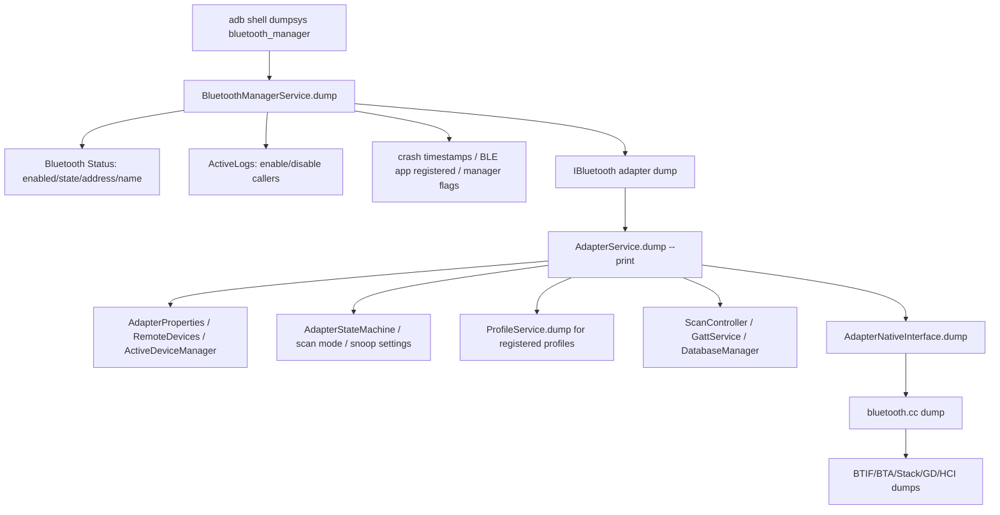

# 22-定向代码阅读报告：dumpsys 输出解读

## 1. 阅读目标

本报告聚焦蓝牙 dumpsys 的入口、层级、字段含义和排查顺序。目标不是背字段，而是看到一份 bugreport 后，能快速判断问题卡在 `bluetooth_manager` 管理层、蓝牙进程 Java 服务层、Profile 层、Scan/GATT 层，还是 native stack/HCI 层。

读完后要能定位：

- 蓝牙是否真的 enabled，还是只处于 BLE-only / turning 状态。
- 最近是谁打开/关闭蓝牙，是否有反复拉起。
- Profile 是否启动、设备是否连接、scan/GATT 是否有活跃客户端。
- native stack 是否可 dump，GATT/L2CAP/BTM/连接管理是否有异常证据。

## 2. 适用场景

- 用户只提供 bugreport，需要无设备复现地定位问题。
- 蓝牙打开失败、回连失败、GATT 无回调、A2DP/HFP 状态残留。
- 量产问题需要用统一模板沉淀到真实案例库。
- 定制新 Profile 或诊断能力后，需要补充 dumpsys 输出。

## 3. dumpsys 分层全景图



## 4. 关键源码入口

| 层级 | 源码 | 关键入口 |
| --- | --- | --- |
| system_server dump | `service/src/com/android/server/bluetooth/BluetoothManagerService.java` | `dump(...)`、`mActiveLogs.dump(...)`、crash timestamps、BLE app registered |
| Binder dump | `service/src/com/android/server/bluetooth/BluetoothServiceBinder.java` | `dump(...)` 转到 manager/service |
| 蓝牙进程 dump | `android/app/src/com/android/bluetooth/btservice/AdapterService.java` | `dump(...)`、`mRemoteDevices.dump(...)`、`mAdapterStateMachine.dump(...)`、`mNativeInterface.dump(...)` |
| Adapter 属性 | `android/app/src/com/android/bluetooth/btservice/AdapterProperties.java` | adapter state、scan mode、discovery state |
| 设备缓存 | `android/app/src/com/android/bluetooth/btservice/RemoteDevices.java` | bonded/found/ACL/device properties |
| Profile dump | 各 `*Service.java` | A2DP、HFP、GATT、PBAP、MAP、LE Audio 等各自状态 |
| GATT dump | `android/app/src/com/android/bluetooth/gatt/GattService.java` | client/server map、handle map、connections |
| Scan dump | `android/app/src/com/android/bluetooth/le_scan/ScanController.java` | scanner apps、scan settings、stats |
| Native dump | `android/app/src/com/android/bluetooth/btservice/AdapterNativeInterface.java`、`android/app/jni/...AdapterService.cpp` | `dumpNative()` -> `sBluetoothInterface->dump(...)` |
| Native stack dump | `system/btif/src/bluetooth.cc` | `btif_debug_*`、`gatt_tcb_dump`、`L2CA_Dumpsys`、`DumpsysBtm`、`bluetooth::shim::Dump` |

## 5. `bluetooth_manager` 怎么读

优先看：

- `enabled`：管理层认为蓝牙是否开启。
- `state`：当前 Adapter 状态，区分 `OFF`、`BLE_ON`、`TURNING_ON`、`ON`。
- `time since enabled`：判断是否刚启动、是否反复重启。
- `ActiveLogs`：最近 enable/disable 调用方、reason、时间。
- `Bluetooth crashed X times`：蓝牙进程是否重启。
- `Ble app registered`：是否有 BLE app 保活，导致关闭后仍保持 BLE-only。
- `mEnable/mQuietEnable/mEnableExternal`：用户/系统/quiet mode 状态。

判断规则：

- 如果 manager 显示 service not connected，先查蓝牙进程绑定/崩溃。
- 如果 state 停在 turning 状态，回到 Enable/Disable 报告查状态机。
- 如果 ActiveLogs 显示多个调用方交替 enable/disable，优先查策略竞态。

## 6. `bluetooth` / AdapterService 怎么读

`AdapterService.dump()` 会输出：

- `AdapterProperties`：本机地址、名称、状态、scan mode、discovery。
- `RemoteDevices`：远端设备缓存、属性、bond/ACL 信息。
- `ActiveDeviceManager`：A2DP/HFP/LE Audio active device。
- `ScanMode` 与 scan mode 变化记录。
- `Enabled Profile Services`：当前支持并启用的 Profile。
- `AdapterStateMachine`：Adapter 状态机 dump。
- `SilenceDeviceManager`、`DatabaseManager`。
- 每个已注册 Profile 的 `dump(StringBuilder)`。
- `ScanController` dump。
- native dump。

注意：`AdapterService.dump()` 默认无参数会提示 “Skipping dump in APP SERVICES”，通常由 `bluetooth_manager` 间接带参数触发完整 dump。

## 7. native dump 怎么读

`system/btif/src/bluetooth.cc` 的 native dump 会汇总：

- connection、bond event、link key type。
- AVRCP、A2DP、AV、AVDTP、socket。
- GATT TCB、BTA GATT client history。
- device config / interop config。
- HFP Client statistics。
- wakelock、alarm。
- CSIS、HearingAid、LE Audio、VolumeControl、VAPS。
- connection manager。
- BQR。
- AVCT、PAN、HID、BTA DM、SDP、L2CAP、BTM、GD shim、power telemetry。

如果当前状态是 `STATE_OFF`、`BLE_TURNING_ON`、`TURNING_OFF`、`BLE_TURNING_OFF`，`AdapterService` 可能跳过 native dump，避免 stack shutdown 期间不安全访问。

## 8. 专题排查入口

| 问题 | 先看 dumpsys 字段 | 再看专题 |
| --- | --- | --- |
| 蓝牙打不开 | manager state、crash、ActiveLogs、AdapterStateMachine | Enable/Disable、HAL/JNI |
| 关闭后又打开 | ActiveLogs、BLE app registered、mEnableExternal | Enable/Disable、Permission |
| BLE scan 无结果 | ScanController、scanner apps、AppScanStats | BLE Scan、Permission |
| GATT Client 无回调 | GattService client map、connections、native GATT dump | GATT Client、BLE Connect |
| GATT Server 超时 | GattService server map、HandleMap、request context | GATT Server |
| A2DP/HFP 异常 | Profile dump、ActiveDeviceManager、native av/hf dump | A2DP/HFP 专题 |
| 配对失败 | bond event dump、RemoteDevices、BondStateMachine | Pairing/Bonding |
| Classic 搜不到 | AdapterProperties discovery、RemoteDevices、BTA DM search dump | Classic Discovery |

## 9. 常用命令

```bash
adb shell dumpsys bluetooth_manager
adb shell dumpsys bluetooth --print
adb shell dumpsys bluetooth_manager > /data/local/tmp/bt_manager.txt
adb shell dumpsys bluetooth --print > /data/local/tmp/bt_stack.txt
adb bugreport /data/local/tmp/bt_bugreport.zip
```

建议现场保留：

- dumpsys 前后各一份，特别是复现前和复现后。
- 同时抓 logcat 和 btsnoop。
- 记录用户操作时间点，方便和 ActiveLogs 对齐。

## 10. 定制修改思路

### 10.1 新增诊断字段

建议每个新增车厂模块都输出：

- 当前状态。
- 最近一次请求和结果。
- 关键设备地址脱敏值。
- 队列长度、超时次数、最近错误码。
- 与 native/HCI 相关的 requestId 或 sequence。

### 10.2 避免 dumpsys 卡死

原则：

- dump 中不要做阻塞 I/O 或等待远端响应。
- 不要持有核心锁后调用复杂模块 dump。
- 大列表限制数量，必要时只输出最近 N 条。
- native stack shutdown 中要允许跳过 dump。

## 11. 最容易踩的坑

- 只看 `enabled=true`，不看真实 `state`。
- 忽略 ActiveLogs，导致找不到是谁反复开关蓝牙。
- 看到 Profile dump 存在就认为设备已连接；Profile running 不等于连接成功。
- 把 bonded devices 当成当前连接设备。
- native dump 缺失时误判为没有 native 问题，实际可能是状态不允许 dump。
- 新增车厂功能没有 dumpsys，量产后只能靠猜。

## 12. 练习题与参考答案

### 练习 1：bugreport 里蓝牙状态是 `BLE_ON`，A2DP 不工作正常吗？

参考答案：正常。`BLE_ON` 只表示 BLE-only 阶段，完整 BR/EDR Profile 需要 `STATE_ON`。继续查 `AdapterStateMachine` 为什么没有进入 `STATE_ON`，以及 `startProfileServices()` 是否完成。

### 练习 2：如何从 dumpsys 判断 GATT Server 是否忘记 response？

参考答案：看 `GattService` 的 server map 和 `HandleMap` request context。如果 request 生成了但没有对应 `sendResponse()` 删除记录，且 log 中远端超时，就说明 App 可能漏掉 response。

### 练习 3：为什么新增 Profile 必须实现 dump？

参考答案：量产问题通常只有 bugreport。没有 dump，就无法知道服务是否启动、连接谁、当前状态、最近错误和队列情况，只能回到现场复现，效率很低。

## 13. 案例库映射

可沉淀到 `97-真实案例库.md` 的案例：

- ActiveLogs 显示车厂策略服务反复拉起蓝牙。
- GATT request context 残留导致远端读写超时。
- native dump 中 L2CAP channel 残留导致关闭后状态不干净。
- Profile dump 显示服务 running 但连接策略为 forbidden。
