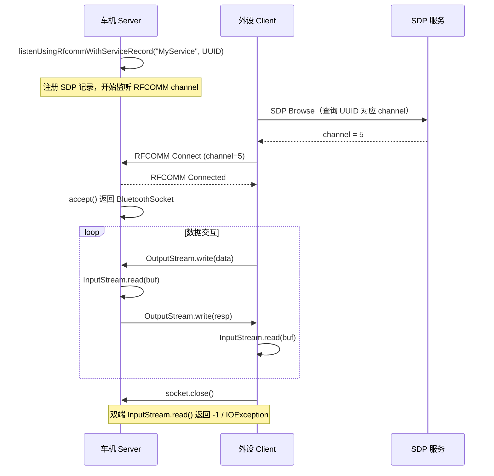

# 22.1 RFCOMM Socket 应用层完整指南

> **速通摘要**：`BluetoothSocket`（RFCOMM 类型）是 Android 蓝牙 SPP（Serial Port Profile）通信的标准接口，提供"TCP Socket"风格的字节流 API。服务端用 `BluetoothAdapter.listenUsingRfcommWithServiceRecord(name, uuid)` 创建 `BluetoothServerSocket`，accept 后得到 `BluetoothSocket`；客户端用 `BluetoothDevice.createRfcommSocketToServiceRecord(uuid)` 连接。数据通过 `getInputStream()` / `getOutputStream()` 以字节流方式传递。本节覆盖完整实现（服务端/客户端）、线程模型、错误处理、Android 13+ 权限要求。

---

## 学习目标

读完本节后，你能：
1. 实现一个完整的 RFCOMM Server（监听）和 Client（连接）。
2. 理解 `connect()` 阻塞模型与线程设计。
3. 处理常见的 `IOException`（连接失败、断开、超时）。
4. 遵循 Android 13+ 的 `BLUETOOTH_CONNECT` 权限要求。

---

## 前置知识

- [02.1 BluetoothAdapter 详解](../02_Framework_API导读/02.1_BluetoothAdapter详解.md)
- [02.2 BluetoothDevice 详解](../02_Framework_API导读/02.2_BluetoothDevice详解.md)
- [05.8 RFCOMM](../05_Native栈基础/05.8_RFCOMM.md)

---

## 场景故事

车机需要和一个外设（OBD 诊断仪、POS 机）通信。对方固件用蓝牙 SPP（UUID `00001101-...`）暴露接口。车机 App 充当 RFCOMM Client，连上后以 115200 波特率发 AT 命令，读取诊断数据。

RFCOMM Socket 就是为这个场景设计的——提供和 TCP Socket 一样简单的字节流接口。

---

## 一、API 全景

```
BluetoothAdapter                   BluetoothDevice
    │                                   │
    ▼                                   ▼
listenUsingRfcommWithServiceRecord   createRfcommSocketToServiceRecord
    │                                   │
    ▼                                   ▼
BluetoothServerSocket               BluetoothSocket
    │                                   │
    ▼                                   ▼
  accept() ─────────────────────► BluetoothSocket (connected)
                                        │
                              ┌─────────┴─────────┐
                              ▼                   ▼
                         InputStream         OutputStream
```

**类对应关系**（Java 类比）：

| Bluetooth | Java TCP |
|-----------|---------|
| `BluetoothServerSocket` | `ServerSocket` |
| `BluetoothSocket` | `Socket` |
| `getInputStream()` | `socket.getInputStream()` |
| `getOutputStream()` | `socket.getOutputStream()` |

---

## 二、服务端（Server / Host）实现

```java
// Server 端：在 worker 线程中运行
private static final UUID MY_UUID =
    UUID.fromString("fa87c0d0-afac-11de-8a39-0800200c9a66"); // 自定义 UUID

public class RfcommServer extends Thread {
    private final BluetoothServerSocket mServerSocket;

    public RfcommServer(BluetoothAdapter adapter) throws IOException {
        // 创建 RFCOMM ServerSocket，自动注册 SDP 记录
        // framework/java/android/bluetooth/BluetoothAdapter.java:2846
        mServerSocket = adapter.listenUsingRfcommWithServiceRecord(
            "MyService", MY_UUID);
    }

    @Override
    public void run() {
        BluetoothSocket socket;
        while (true) {
            try {
                // 阻塞，直到有客户端连入
                socket = mServerSocket.accept();
            } catch (IOException e) {
                // ServerSocket 被 close() 关掉时到这里
                break;
            }

            if (socket != null) {
                // 在独立线程里处理这个连接
                new ConnectedThread(socket).start();

                // 如果只允许一个客户端，连接成功后关闭 ServerSocket
                try { mServerSocket.close(); } catch (IOException ignored) {}
                break;
            }
        }
    }

    public void cancel() {
        try { mServerSocket.close(); } catch (IOException ignored) {}
    }
}
```

---

## 三、客户端（Client）实现

```java
public class RfcommClient extends Thread {
    private final BluetoothSocket mSocket;

    public RfcommClient(BluetoothDevice device) throws IOException {
        // 通过 SDP 查找 UUID 对应的 RFCOMM channel，然后连接
        // framework/java/android/bluetooth/BluetoothDevice.java:3110
        mSocket = device.createRfcommSocketToServiceRecord(MY_UUID);
    }

    @Override
    public void run() {
        try {
            // 阻塞直到连接建立或失败（默认超时约 12 秒）
            mSocket.connect();
        } catch (IOException connectException) {
            // 连接失败，关闭 socket
            try { mSocket.close(); } catch (IOException ignored) {}
            return;
        }

        // 连接成功，开始读写
        new ConnectedThread(mSocket).start();
    }

    public void cancel() {
        try { mSocket.close(); } catch (IOException ignored) {}
    }
}
```

### 3.1 绕过 SDP 直接指定 channel（高级用法）

```java
// 如果已知对端 RFCOMM channel（不做 SDP 查询）
// framework/java/android/bluetooth/BluetoothDevice.java:3020
BluetoothSocket socket = device.createRfcommSocket(channel);
// 直接调 connect()，不做 SDP 查询
```

---

## 四、数据传输（ConnectedThread）

```java
public class ConnectedThread extends Thread {
    private final BluetoothSocket mSocket;
    private final InputStream mInStream;
    private final OutputStream mOutStream;

    public ConnectedThread(BluetoothSocket socket) {
        mSocket = socket;
        InputStream is = null;
        OutputStream os = null;
        try {
            is = socket.getInputStream();
            os = socket.getOutputStream();
        } catch (IOException e) {
            Log.e(TAG, "Error opening streams", e);
        }
        mInStream = is;
        mOutStream = os;
    }

    @Override
    public void run() {
        byte[] buf = new byte[1024];
        int bytesRead;

        while (true) {
            try {
                // 阻塞读。RFCOMM 是字节流，没有"帧"概念
                bytesRead = mInStream.read(buf);
                if (bytesRead == -1) break; // 对端关闭
                processData(buf, 0, bytesRead);
            } catch (IOException e) {
                // 连接断开
                break;
            }
        }
        closeSocket();
    }

    public void write(byte[] data) {
        try {
            mOutStream.write(data);
        } catch (IOException e) {
            Log.e(TAG, "Error writing", e);
        }
    }

    private void closeSocket() {
        try { mSocket.close(); } catch (IOException ignored) {}
    }
}
```

---

## 五、Android 13+ 权限处理

```java
// AndroidManifest.xml
<uses-permission android:name="android.permission.BLUETOOTH_CONNECT" />

// 连接前检查权限
if (ActivityCompat.checkSelfPermission(ctx, Manifest.permission.BLUETOOTH_CONNECT)
        != PackageManager.PERMISSION_GRANTED) {
    // 申请权限
    ActivityCompat.requestPermissions(activity,
        new String[]{Manifest.permission.BLUETOOTH_CONNECT}, REQ_CODE);
    return;
}

// 权限正常后创建 socket
BluetoothSocket socket = device.createRfcommSocketToServiceRecord(MY_UUID);
```

> **注意**：`createRfcommSocketToServiceRecord` 本身标注了 `@RequiresNoPermission`（`framework/java/android/bluetooth/BluetoothDevice.java:3109`），但 `connect()` 的 SDP 查询和连接操作隐式需要 `BLUETOOTH_CONNECT`。建议全流程都先检查权限。

---

## 六、错误处理与重连

```java
// 常见异常及处理
try {
    socket.connect();
} catch (IOException e) {
    String msg = e.getMessage();
    if (msg != null) {
        if (msg.contains("Connection refused")) {
            // 对端没有在监听此 UUID，检查 UUID 是否匹配
        } else if (msg.contains("Host is down")) {
            // 设备不在范围内或已关机
        } else if (msg.contains("read failed")) {
            // 连接过程中 link 掉了（常见于 Android 4.x bug，现已修复）
        }
    }
    // 关闭再重连
    try { socket.close(); } catch (IOException ignored) {}
    // 可在 handler.postDelayed 里重试
}
```

---

## 七、BluetoothSocketSettings（Android 16 新增）

`framework/java/android/bluetooth/BluetoothSocketSettings.java` 提供了更灵活的 socket 创建方式：

```java
// 使用 BluetoothSocketSettings 创建 RFCOMM socket（新 API）
BluetoothSocketSettings settings = new BluetoothSocketSettings.Builder()
    .setSocketType(BluetoothSocket.TYPE_RFCOMM)
    .setRfcommServiceName("MyService")
    .setRfcommUuid(MY_UUID)
    .setEncryptionRequired(true)
    .setAuthenticationRequired(true)
    .build();

// 服务端
BluetoothServerSocket serverSocket =
    adapter.listenUsingSocketSettings(settings);

// 客户端
BluetoothSocket clientSocket =
    device.createUsingSocketSettings(settings);
```

**对应 flag**：`flags/sockets.aconfig` → `socket_settings_api`（is_exported，Android 16+）

---

## 八、Mermaid：RFCOMM 建连时序



---

## 九、调试方法

```bash
# 查看 RFCOMM 连接状态
adb shell dumpsys bluetooth_manager | grep -A 5 "RFCOMM\|rfcomm"

# btsnoop 抓包（看 RFCOMM 帧）
adb shell setprop persist.bluetooth.btsnooplogmode full
# 用 Wireshark 打开 btsnoop_hci.log，filter: rfcomm

# 查看 SDP 记录（RFCOMM UUID 是否注册）
adb shell dumpsys bluetooth_manager | grep -i "uuid\|sdp" | head -20

# 查看 socket 状态（日志 tag）
adb logcat -s BluetoothSocket:V bt_rfcomm:V | head -50

# 检查 BLUETOOTH_CONNECT 权限
adb shell dumpsys package <your.app.package> | grep "BLUETOOTH_CONNECT"
```

---

## FAQ

**Q1：RFCOMM socket 的最大吞吐量是多少？**
实际上取决于：① BDR 速率（1 Mbps），② 协议开销（L2CAP/RFCOMM 每帧 header），③ MTU（默认 990 字节/帧）。典型应用场景（OBD、POS）只需几 KB/s，远低于上限。如需高吞吐（MP3 流），请改用 A2DP。

**Q2：为什么 `connect()` 总是超时失败，但设备已配对？**
常见原因：① 对端没有 RFCOMM 服务在监听（UUID 不匹配，SDP 查不到）；② 对端 RFCOMM channel 满了（Android 最多 30 个，见 `MAX_RFCOMM_CHANNEL=30`）；③ ACL 已经连了但 profile 层没有打开。调试：用 `dumpsys bluetooth_manager` 确认 ACL 连接状态，用 `btsnoop` 看 SDP 应答。

**Q3：如何实现"一直监听，接受多个客户端"？**
`accept()` 只返回一次连接，要接受下一个，需要重新 `accept()`。建议用 `while(true)` 循环持续调用。注意：每次 `accept()` 返回后，旧的 `serverSocket` 还可以继续 `accept()`（不用重建）。

**Q4：车机场景下 RFCOMM Socket 的典型用途？**
① 车机与 OBD-II 诊断仪（SPP UUID）通信；② 车机与老旧 BLE-less 蓝牙打印机；③ 车机与某些厂商 GPS 外设。现代开发如果设备支持 BLE，优先用 L2CAP CoC（22.2 节）或 GATT。

---

## 上路任务

1. 在两台 Android 设备上分别运行 Server 和 Client 代码，测量 `connect()` 的耗时。
2. 故意用一个不存在的 UUID，观察 `connect()` 抛出什么异常信息。
3. 用 Wireshark 打开 btsnoop 日志，找到 SDP 查询请求和 RFCOMM SABM（建连帧），理解和 TCP SYN/SYN-ACK 的类比。
