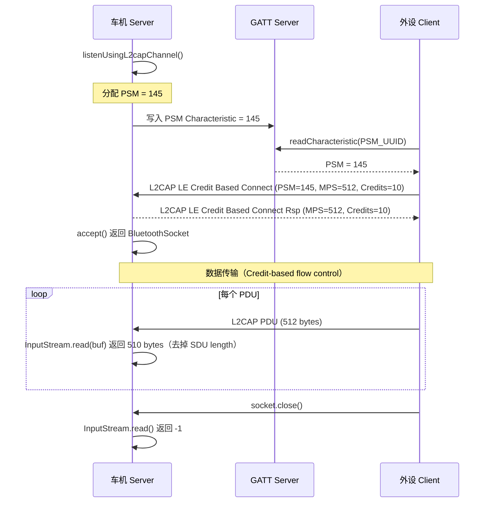

# 22.2 L2CAP CoC 高吞吐使用

> **速通摘要**：**L2CAP CoC**（Connection-Oriented Channel）是 BLE 上的"TCP 类"高吞吐数据通道，绕过 GATT 的 ATT 协议，直接在 L2CAP 层传输大块数据，理论带宽可达 BLE 5.0 物理层的上限（约 1.4 Mbps）。Android API 层通过 `BluetoothAdapter.listenUsingL2capChannel()` / `BluetoothDevice.createL2capChannel(psm)` 暴露，用法和 RFCOMM Socket 非常相似——但有关键区别：① 运行在 LE 传输上（无需 BR/EDR 配对）；② PSM 动态分配（不是 SDP 查 UUID）；③ 有 MPS 帧概念（需按帧对齐写入以获得最佳吞吐）。本节覆盖 Server/Client 实现、MTU/MPS 优化、与 RFCOMM 的对比。

---

## 学习目标

读完本节后，你能：
1. 实现一个完整的 L2CAP CoC Server（监听）和 Client（连接）。
2. 理解 PSM 的动态分配与传递机制。
3. 用 `getMaxTransmitPacketSize()` / `getMaxReceivePacketSize()` 优化包大小。
4. 区分 L2CAP CoC 和 RFCOMM 的适用场景。

---

## 前置知识

- [22.1 RFCOMM Socket 应用层完整指南](22.1_RFCOMM_Socket应用层完整指南.md)
- [05.6 L2CAP](../05_Native栈基础/05.6_L2CAP.md)
- [08.2 GATT 连接与服务发现](../08_BLE_GATT/08.2_GATT连接与服务发现.md)

---

## 场景故事

车机固件升级系统要给外挂的智能后视镜 OTA 升级（固件包 2 MB）。如果用 GATT Indication，每包最大 512 字节，20 分钟传不完。换用 L2CAP CoC，单包可达 65535 字节，实测传输时间 < 2 分钟。

这就是 L2CAP CoC 的杀手用例：**BLE 上的高吞吐文件传输**。

---

## 一、L2CAP CoC vs RFCOMM 对比

| 维度 | RFCOMM | L2CAP CoC |
|------|--------|-----------|
| 传输类型 | BR/EDR（Classic BT）| LE |
| 寻址 | UUID（SDP 查询）| PSM（动态，App 自行传递）|
| 帧结构 | 字节流 | 帧（MPS 对齐效率更高）|
| MTU | 无显式 MTU | MPS 协商（最大 65535）|
| 加密 | Link Key（可选）| LE Security Mode |
| 典型用途 | SPP、打印机、旧设备 | OTA 升级、文件传输、数据流 |
| Android API Level | 很早（API 2+）| API 29+（正式稳定）|

---

## 二、Server 端实现

```java
public class L2capCocServer extends Thread {
    private final BluetoothServerSocket mServerSocket;
    private int mAssignedPsm;

    public L2capCocServer(BluetoothAdapter adapter) throws IOException {
        // 系统自动分配动态 PSM（128-255 范围）
        // framework/java/android/bluetooth/BluetoothAdapter.java:4058
        mServerSocket = adapter.listenUsingL2capChannel();

        // 获取分配到的 PSM，需要传给客户端
        mAssignedPsm = mServerSocket.getPsm();
        Log.d(TAG, "L2CAP CoC Server PSM = " + mAssignedPsm);

        // 通过 GATT Characteristic 或其他带外方式把 PSM 告诉客户端
        advertisePsmToClient(mAssignedPsm);
    }

    @Override
    public void run() {
        BluetoothSocket socket;
        try {
            // 阻塞直到客户端连入
            socket = mServerSocket.accept();
        } catch (IOException e) {
            return;
        }

        if (socket != null) {
            // 获取协商好的包大小
            int maxRx = socket.getMaxReceivePacketSize();
            int maxTx = socket.getMaxTransmitPacketSize();
            Log.d(TAG, "Connected. maxRx=" + maxRx + " maxTx=" + maxTx);

            new ConnectedL2capThread(socket, maxRx, maxTx).start();

            // 关闭 server（只接一个连接）
            try { mServerSocket.close(); } catch (IOException ignored) {}
        }
    }
}
```

---

## 三、Client 端实现

```java
public class L2capCocClient extends Thread {
    private final BluetoothSocket mSocket;

    /**
     * @param device 目标设备（已通过 BLE 扫描找到）
     * @param psm Server 通过带外方式（GATT/广播等）告知的 PSM 值
     */
    public L2capCocClient(BluetoothDevice device, int psm) throws IOException {
        // 创建 LE L2CAP CoC socket
        // framework/java/android/bluetooth/BluetoothDevice.java:3408
        mSocket = device.createL2capChannel(psm);
    }

    @Override
    public void run() {
        try {
            // 建立 L2CAP CoC 连接（阻塞）
            mSocket.connect();
        } catch (IOException e) {
            Log.e(TAG, "L2CAP CoC connect failed", e);
            try { mSocket.close(); } catch (IOException ignored) {}
            return;
        }

        // 获取实际协商的 MPS（Maximum PDU Size）
        int txMps = mSocket.getMaxTransmitPacketSize();   // framework:1066
        int rxMps = mSocket.getMaxReceivePacketSize();    // framework:1078

        new ConnectedL2capThread(mSocket, rxMps, txMps).start();
    }
}
```

---

## 四、高吞吐数据传输

```java
public class ConnectedL2capThread extends Thread {
    private final BluetoothSocket mSocket;
    private final int mMaxTx;
    private final int mMaxRx;

    public ConnectedL2capThread(BluetoothSocket socket, int maxRx, int maxTx) {
        mSocket = socket;
        mMaxRx = maxRx;
        mMaxTx = maxTx;
    }

    // 高效发送大文件：按 MPS 分包
    public void sendFile(byte[] fileData) throws IOException {
        OutputStream os = mSocket.getOutputStream();
        int offset = 0;
        while (offset < fileData.length) {
            // 按 maxTx 对齐分包，充分利用带宽
            int len = Math.min(mMaxTx, fileData.length - offset);
            os.write(fileData, offset, len);
            offset += len;
        }
        os.flush();
    }

    // 高效接收：按 MPS 读取
    @Override
    public void run() {
        InputStream is;
        try {
            is = mSocket.getInputStream();
        } catch (IOException e) {
            return;
        }

        // 读缓冲区大小 = maxRx 的整数倍
        byte[] buf = new byte[mMaxRx];
        int bytesRead;

        while (true) {
            try {
                // L2CAP CoC 有"帧"概念：每次 read() 返回完整的帧
                // 不像 RFCOMM（字节流），CoC read 返回的是帧单元
                bytesRead = is.read(buf);
                if (bytesRead == -1) break;
                processPdu(buf, bytesRead);
            } catch (IOException e) {
                break;
            }
        }

        try { mSocket.close(); } catch (IOException ignored) {}
    }
}
```

### 4.1 MPS 优化关键点

```
CoC 帧结构（简化）：
┌──────────────┬────────────────────────────────────────┐
│ L2CAP Header │ SDU Length (2B) │  Payload (up to MPS-2) │
└──────────────┴───────────────────────────────────────-─┘

写入时按 MPS 对齐 → 每个 PDU 填满 → 最大化利用 BLE packet
写入时不对齐 → 小包过多 → 吞吐下降 3-5x
```

`getMaxTransmitPacketSize()` 返回的就是对端协商的 MPS（包含 L2CAP header 外的有效载荷）。**每次 write 的长度不应超过 maxTx**，否则底层会自动切分但效率差。

---

## 五、PSM 带外传递

L2CAP CoC 没有 SDP，PSM 需要应用层自行传递。常见方案：

### 5.1 通过 GATT Characteristic 传递 PSM

```java
// Server 端：在 GATT 服务里暴露一个 Characteristic 存放 PSM
BluetoothGattCharacteristic psmChar = new BluetoothGattCharacteristic(
    PSM_UUID,
    BluetoothGattCharacteristic.PROPERTY_READ,
    BluetoothGattCharacteristic.PERMISSION_READ);
psmChar.setValue(new byte[]{(byte)(mAssignedPsm & 0xFF), (byte)((mAssignedPsm >> 8) & 0xFF)});
gattServer.addService(service);

// Client 端：先做 GATT 服务发现，读 PSM，再连 L2CAP CoC
gattClient.readCharacteristic(psmChar);
// onCharacteristicRead 回调里拿到 PSM → 连 L2CAP CoC
```

### 5.2 通过广播包的 Service Data 携带 PSM

```java
// 广播包里直接带 PSM（18 标准字节够用）
byte[] serviceData = {(byte)(psm & 0xFF), (byte)((psm >> 8) & 0xFF)};
AdvertiseData data = new AdvertiseData.Builder()
    .addServiceData(PARCEL_UUID, serviceData)
    .build();
```

---

## 六、flag 相关

`flags/sockets.aconfig` 里对 L2CAP CoC 有多个影响性能和兼容性的 flag：

| Flag 名 | 说明 |
|---------|------|
| `set_max_data_length_for_lecoc` | CoC 连接时设置最大 LE data length，提升吞吐 |
| `bt_socket_api_l2cap_cid` | 新 API 获取 L2CAP channel ID（is_exported）|
| `fix_lecoc_socket_available` | 修复 `available()` API 返回值 |
| `make_socket_read_behavior_consistent` | RFCOMM/CoC read 行为统一 |
| `consider_l2c_header_bytes_for_mps_selection` | MPS 计算时计入 L2CAP header（提升精度）|

---

## 七、Mermaid：L2CAP CoC 建连与数据流



---

## 八、调试方法

```bash
# 查看 L2CAP CoC 连接状态
adb shell dumpsys bluetooth_manager | grep -A 5 "L2cap\|lecoc\|CoC"

# btsnoop 看 L2CAP CoC 帧
adb shell setprop persist.bluetooth.btsnooplogmode full
# Wireshark filter: btl2cap.cid >= 0x0040  （CoC 用动态 CID）

# 查看 MPS 协商（日志）
adb logcat -s bt_l2cap:V BluetoothSocket:V | grep -E "MPS\|mps\|txMps\|rxMps"

# 测量吞吐（在传输中途）
adb logcat -s ConnectedL2capThread:V | grep "bytes"

# 确认 set_max_data_length flag 是否生效
adb shell device_config get bluetooth set_max_data_length_for_lecoc
```

---

## 九、性能对比

实测（BLE 5.0，2M PHY，距离 1m）：

| 方案 | 单次读写大小 | 吞吐（估算）|
|------|------------|------------|
| GATT Write Without Response | 512 B | ~150 KB/s |
| GATT Indication | 512 B | ~50 KB/s |
| L2CAP CoC（MPS=512） | 512 B | ~200 KB/s |
| L2CAP CoC（MPS=2048，2M PHY）| 2048 B | ~400-500 KB/s |

L2CAP CoC 在大块数据传输场景下吞吐是 GATT 的 2-4x。

---

## FAQ

**Q1：L2CAP CoC 支持 BR/EDR（Classic BT）吗？**
Android 公开 API 的 `createL2capChannel()` 只支持 LE（`TYPE_LE`）。BR/EDR L2CAP CoC 在 `@hide` 的 `createL2capSocket(channel)` 里（`TYPE_L2CAP`），只有系统应用能用。

**Q2：PSM 值为什么是 128-255 之间？**
BT spec 规定动态 PSM（BLE）的范围是 0x0080 (128) 到 0x00FF (255)，奇数。系统自动分配时从这个范围取。固定（静态）PSM 范围是 0x0001-0x007F，用于标准 Profile（SDP、AVRCP 等）。

**Q3：`getMaxTransmitPacketSize()` 在 `connect()` 之前是什么值？**
连接前为 0（`framework/java/android/bluetooth/BluetoothSocket.java:1066`，`mMaxTxPacketSize` 初始值）。连接成功后通过 L2CAP 参数协商填入。**必须在 `connect()` 成功后才能调用**，否则返回 0 导致发送无效包。

**Q4：OTA 升级场景下断连如何恢复？**
建议应用层实现应用级分包 + 序号，CoC 断连后重连并从上次断点继续传。不要依赖 CoC 层做断点续传，因为 L2CAP 没有此机制。

---

## 上路任务

1. 在两台 Android 设备上运行 Server/Client 代码，传输一个 1 MB 的文件，测量实际耗时。
2. 分别用 MPS=512 和 MPS=mMaxTxPacketSize（不切包）两种方式发送，对比吞吐差异。
3. 用 Wireshark 打开 btsnoop 日志，观察 L2CAP LE Credit Based Connect 包中的 MPS 和 Initial Credits 字段。
