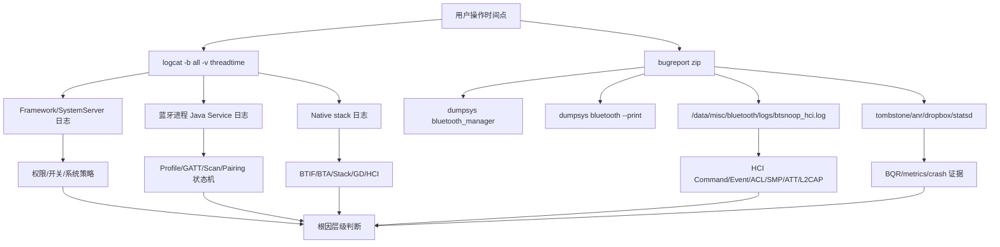
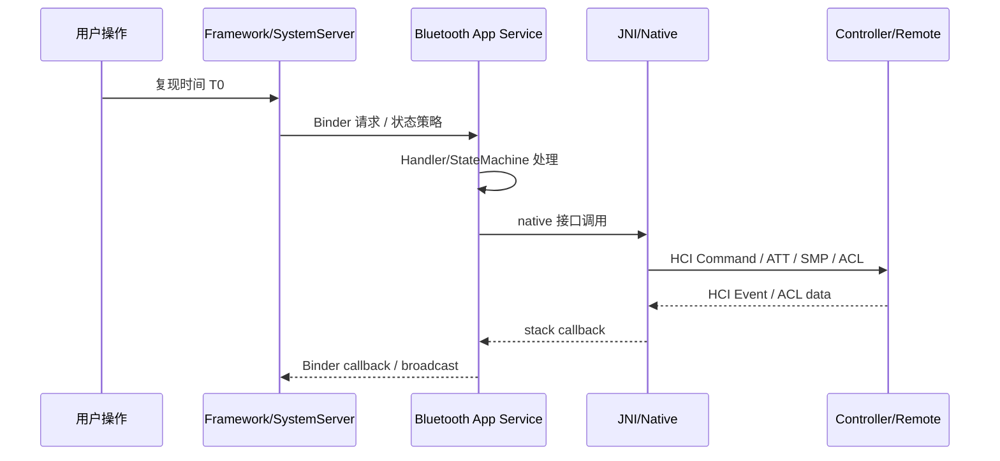

# 23-定向代码阅读报告：Log 与 Bugreport 分析

## 1. 阅读目标

本报告聚焦蓝牙问题的现场证据链：`logcat`、`bugreport`、`dumpsys bluetooth_manager`、`dumpsys bluetooth --print`、HCI snoop、BQR 和 statsd 指标如何互相印证。目标不是记住所有 tag，而是拿到一份问题日志后，能在 10 分钟内判断问题更可能发生在 App/权限、Framework Service、JNI/Native、Controller/Vendor，还是外设行为。

读完后要能做到：

- 按时间线串起用户操作、Framework 请求、Profile 状态机、native 回调和 HCI 事件。
- 判断“没有回调”到底是权限拒绝、Binder 没进服务、Java 状态机丢弃、native 返回失败，还是 controller 没有上报。
- 从 bugreport 中提取蓝牙关键证据，而不是只搜索一个错误关键字。
- 为车厂定制功能设计可长期维护的诊断日志和案例归档格式。

## 2. 适用场景

- 量产车机只回传 bugreport，现场无法马上复现。
- BLE scan/connect/GATT、Pairing、A2DP/HFP、Classic discovery 等问题需要跨层排查。
- 怀疑 controller、vendor HAL、射频环境或外设兼容性导致偶现失败。
- 新增车厂策略后，需要确认日志是否足够支持后续售后定位。

## 3. Log/Bugreport 分析全景图



分析顺序建议固定为：

1. 先确定问题发生的绝对时间点。
2. 再看 `bluetooth_manager` 是否有开关、崩溃、BLE-only、ActiveLogs 异常。
3. 然后看蓝牙进程 Java 服务层是否收到请求。
4. 接着看 JNI/native 是否收到并返回。
5. 最后用 HCI snoop、BQR、statsd 判断 controller/外设/射频侧证据。

## 4. 关键日志来源与源码入口

| 证据 | 源码入口 | 作用 |
| --- | --- | --- |
| Framework/system_server 日志 | `service/src/Log.kt`、`service/src/com/android/server/bluetooth/BluetoothManagerService.java` | 观察系统侧蓝牙开关、绑定蓝牙进程、snoop 设置、权限/用户策略 |
| enable/disable 活动记录 | `service/src/ActiveLogs.kt` | 记录调用方、reason、状态变化，并写入 `BluetoothStatsLog` |
| snoop 设置 Binder 链路 | `service/src/com/android/server/bluetooth/BluetoothServiceBinder.java`、`service/src/ServiceMessenger.kt` | `setBtHciSnoopLogMode()` / `getBtHciSnoopLogMode()` 进入蓝牙系统服务 |
| 蓝牙事件环形日志 | `android/app/src/com/android/bluetooth/BluetoothEventLogger.java` | `add()`、`logd()`、`logi()`、`logw()`、`loge()`、`dump()` 记录最近事件 |
| BLE Scan 统计 | `android/app/src/com/android/bluetooth/le_scan/AppScanStats.java` | 扫描启动、过滤、结果、超时、metrics |
| Adapter/Profile dump | `android/app/src/com/android/bluetooth/btservice/AdapterService.java`、各 `*Service.java` | bugreport 中还原当前状态和历史片段 |
| native dump | `system/btif/src/bluetooth.cc`、`system/main/shim/stack.cc` | BTIF/BTA/GATT/L2CAP/BTM/GD/HCI 侧状态 |
| HCI snoop 文件路径 | `system/gd/os/android/parameter_provider.cc` | 默认路径通常为 `/data/misc/bluetooth/logs/btsnoop_hci.log` |
| snoop logger | `system/gd/hal/snoop_logger*`、`system/main/shim/stack.cc` | HCI 包落盘、socket logger、snooz log dump |
| BQR 质量报告 | `system/btif/include/btif_bqr.h`、`system/btif/src/btif_bqr.cc` | controller vendor event、链路质量、能耗、RF stats |
| Bluetooth metrics | `system/metrics/src/android/metrics.cc` | `BluetoothMetrics` tag，写 statsd 与 BQR 指标 |

## 5. 常见 tag 分类

| 层级 | 常见 tag / 类名 | 重点观察 |
| --- | --- | --- |
| system_server | `BluetoothSystemServer`、`BluetoothManagerService`、`BluetoothServiceBinder`、`Messenger`、`PermissionChecker` | 开关请求、服务绑定、snoop 设置、权限拒绝 |
| Adapter | `AdapterService`、`AdapterState`、`AdapterProperties`、`RemoteDevices`、`ActiveDeviceManager` | Adapter 状态、设备缓存、ACL、active device |
| BLE/GATT | `GattService`、`GattServiceBinder`、`ScanBinder`、`ScanController`、`AppScanStats`、`ContextMap` | scanner/client/server 注册、连接、读写、notify |
| Pairing | `BondStateMachine`、`RemoteDevices`、`bt_btif_dm`、`smp` | bond 状态、PIN/SSP、SMP/BR pairing |
| Profile | `A2dpService`、`HeadsetClientService`、`AvrcpControllerService`、各 `*StateMachine` | 连接策略、状态机超时、active 切换、stack event |
| Native/BTIF | `bt_btif_core`、`bt_btif_dm`、`bt_btif_gattc`、`bt_btif_gatt`、`bluetooth-a2dp` | Java 请求是否进入 native、native 回调是否返回 |
| Stack/GD/HCI | `bt_stack_manager`、`BTA`、`GATT`、`L2CAP`、`BTM`、`HciLayer`、`HciHal`、`bt_gd_shim` | 协议状态、HCI 命令/事件、controller 边界 |
| Metrics | `BluetoothMetrics`、BQR 相关日志 | 链路质量、RF、能耗、statsd 写入失败 |

不要只盯 `E/`。蓝牙问题经常是 `I/` 或 `W/` 里已经给出状态拒绝、策略拒绝、权限拒绝、连接策略 forbidden、busy、timeout 等线索。

## 6. 时间线拼接方法

最可靠的分析方法是按同一设备地址、同一 client/server id、同一 scanner id、同一 request id 串起来。



排查时用五个问题校准：

- T0 前后蓝牙是否发生 enable/disable、进程重启、airplane/satellite/用户切换。
- App 请求是否真正进入 Binder 服务，还是被权限/AppOps/attribution 拦截。
- Java 状态机是否接收请求，还是因 busy、policy、bond state、quiet mode 拒绝。
- native 是否发出对应命令，是否有 callback/error status。
- HCI snoop 中远端是否响应，响应内容是否与 Java 看到的状态一致。

## 7. logcat、dumpsys、btsnoop、BQR 如何互证

| 现象 | logcat 证据 | dumpsys 证据 | btsnoop/BQR 证据 | 判断 |
| --- | --- | --- | --- | --- |
| App 说 scan 无结果 | ScanBinder/ScanController 是否 startScan | AppScanStats 是否有该 scanner | 广播包是否存在 | 没进服务是权限/调用问题；HCI 有包但 Java 无结果查过滤/回调 |
| GATT connect 超时 | GattService clientConnect、btif_gattc connect | client map 是否残留、连接状态 | LE Create Connection、LL/ATT 是否建立 | native 未发包查状态机；远端无响应查外设/射频 |
| Pairing 失败 | BondStateMachine、btif_dm、smp | bond event、RemoteDevices | SMP Pairing Failed / Link Key | 根据失败码区分权限、密钥、IO capability、外设拒绝 |
| A2DP 无声 | A2dpService/ActiveDeviceManager/AudioManager | active device、profile state | AVDTP/ACL 是否有媒体流 | Profile 已连但 audio 未路由查 Audio；HCI 无媒体流查 remote/profile |
| 蓝牙开关异常 | BluetoothManagerService、AdapterState | ActiveLogs、state、crash | HCI reset/command complete | system 策略反复开关与 controller bringup 失败要分开 |
| 偶发断连 | Profile state machine、btif_dm | ACL/device cache、native dump | Disconnection Complete reason、BQR | reason 是 remote/user/timeout/RF 不同层级 |

核心原则：任何单一证据都不要直接定根因。`logcat` 说明软件路径，`dumpsys` 说明当前/历史状态，`btsnoop` 说明空口与 controller 交互，BQR/metrics 补充链路质量。

## 8. 各专题排查模板

### 8.1 Enable/Disable

先查：

```bash
adb shell dumpsys bluetooth_manager
adb logcat -b all -v threadtime | grep -i -E "BluetoothManagerService|AdapterState|AdapterService|bt_stack_manager|Hci"
```

关注：

- `ActiveLogs` 里是谁调用 enable/disable。
- `state` 是否停在 `TURNING_ON`、`BLE_ON`、`TURNING_OFF`。
- 蓝牙进程是否崩溃重启。
- HCI reset、vendor init、controller ready 是否成功。

结论模板：

- manager 没发起：查系统策略/权限/用户限制。
- manager 发起但蓝牙进程没响应：查 service binding、进程崩溃。
- Java 已到 native 但 HCI 无 ready：查 HAL/vendor/controller bringup。

### 8.2 BLE Scan

先查：

- `ScanBinder` / `ScanController` 是否收到 `startScan`。
- `AppScanStats` 是否记录 app、scanner id、过滤条件。
- `dumpsys bluetooth --print` 中 scanner 是否活跃。
- HCI snoop 中是否有 LE advertising report。

常见判断：

- HCI 有广播、Java 无结果：查过滤条件、屏幕/后台策略、回调分发、AppOps。
- HCI 无广播：查 scan 是否真正开启、controller 状态、射频环境。

### 8.3 BLE Connect / GATT Client

先查：

- `connectGatt()` 对应 clientIf 是否注册成功。
- `GattService.clientConnect()` 参数中 `isDirect` / `transport` / `opportunistic`。
- native 是否出现 `btif_gattc` connect。
- HCI 是否有 LE Create Connection、Connection Complete、ATT MTU/Service Discovery。

常见判断：

- client 注册失败：多为权限、资源、service 未 ready。
- connect 发出但无 HCI 连接完成：查外设广播、地址类型、射频、controller。
- 已连接但无 GATT 回调：查 service discovery、`mDeviceBusy`、callback binder 是否死亡。

### 8.4 Pairing/Bonding

先查：

- `BondStateMachine` 的 create/remove/cancel 事件。
- `btif_dm` 与 `smp` 日志。
- `RemoteDevices` 中 bond state 与 device properties。
- HCI/SMP 失败码。

常见判断：

- UI 没弹窗：查 pairing variant、广播接收、前台用户。
- bond 成功但回连失败：查 link key、profile connection policy、remote trust。
- SMP failed：优先看失败码，不要只归因“兼容性问题”。

### 8.5 GATT Server

先查：

- serverIf 是否注册成功。
- service/characteristic/descriptor handle 是否发布成功。
- read/write request 是否进入 app。
- app 是否调用 `sendResponse()`。
- notification/indication 是否有 CCCD 与连接状态。

常见判断：

- request 到了但远端超时：多为 app 漏 response 或 response status/handle 错。
- notify 发了远端没收：查 CCCD、indication confirm、MTU、连接参数。

### 8.6 A2DP/HFP/Profile

先查：

- Profile service 是否 running。
- `okToConnect`、connection policy、quiet mode、bond state。
- state machine 是否收到 stack event。
- active device 是否被切换。
- HCI 中 ACL/SCO/AVDTP/RFCOMM 是否存在。

常见判断：

- Profile running 不等于已连接。
- A2DP connected 不等于音频已路由。
- HFP connected 不等于 SCO 已建立。

## 9. 常用命令

```bash
adb logcat -c
adb logcat -b all -v threadtime > bt.log
adb shell dumpsys bluetooth_manager > bt_manager.txt
adb shell dumpsys bluetooth --print > bt_stack.txt
adb bugreport /data/local/tmp/bt_bugreport.zip
adb shell getprop persist.bluetooth.btsnooplogmode
adb shell ls -l /data/misc/bluetooth/logs/
adb pull /data/misc/bluetooth/logs/btsnoop_hci.log .
```

复现前建议记录：

- 本机蓝牙状态、设备地址脱敏值、外设型号和固件版本。
- 用户操作步骤和精确时间。
- 是否刚开机、是否刚切换用户、是否飞行模式/热点/投屏/通话中。
- 是否打开 HCI snoop，是否拿到 bugreport。

## 10. Bugreport 快速拆解清单

拿到 bugreport 后按这个顺序查：

1. `dumpstate_board.txt` / 主 dump 中搜索 `DUMP OF SERVICE bluetooth_manager`。
2. 搜索 `DUMP OF SERVICE bluetooth`，确认 `AdapterService`、Profile、GATT、Scan、native dump 是否完整。
3. 搜索 `Bluetooth crashed`、`ActiveLogs`、`Bluetooth Status`。
4. 搜索目标设备地址的脱敏后缀或完整地址。
5. 搜索目标 tag：`GattService`、`BondStateMachine`、`bt_btif_dm`、`bt_btif_gattc`、`BluetoothMetrics`。
6. 查看 tombstone、anr、dropbox，确认蓝牙进程或 system_server 是否异常。
7. 解出 snoop 后用 Wireshark 按时间过滤 HCI/ATT/SMP/AVDTP/RFCOMM。

如果 bugreport 中没有完整 snoop，不要直接说“无法分析”。先用 logcat+dumpsys 判断软件层级，再把“缺少空口证据”写入案例记录。

## 11. 定制诊断日志规范

车厂定制代码建议遵守：

- 每条跨层请求带稳定 requestId 或 sessionId。
- 日志至少包含模块、动作、设备地址脱敏值、状态、错误码、耗时。
- state machine 的每次状态迁移都输出旧状态、新状态、触发事件。
- 失败日志要写“为什么拒绝”，例如 `policy=FORBIDDEN`、`bond=NONE`、`busy=true`。
- dumpsys 输出最近 N 条关键事件，避免只依赖 logcat。
- 不在普通日志输出完整蓝牙地址、联系人、短信、通话号码等隐私信息。
- 不在锁内做复杂字符串拼接或 I/O。

推荐格式：

```text
CarBtPolicy: req=1234 action=connect_profile profile=A2DP dev=XX:XX:XX:12:34:56 state=CONNECTING reason=user elapsedMs=35
CarBtPolicy: req=1234 result=reject reason=policy_forbidden bond=BONDED quiet=false
```

## 12. 可能失败点

- 复现时间点不准，导致分析错时间窗口。
- 只抓 main buffer，漏掉 system/events/crash buffer。
- HCI snoop 未开启或被覆盖。
- bugreport 在复现很久之后抓取，环形日志已丢。
- App 层地址使用随机地址，和 dumpsys/HCI 中地址类型没有对齐。
- 日志中设备地址被脱敏，无法与 snoop 直接关联。
- 只看当前 dumpsys，忽略 ActiveLogs、event logger 和历史状态。
- native 日志级别不足，无法看到协议细节。

## 13. 最容易踩的坑

- 把“logcat 没报错”当成“没有问题”。
- 把 “Profile connected” 当成 “业务可用”，忽略 audio route、SCO、GATT service discovery。
- 看到 HCI disconnection reason 就直接甩锅外设，没有核对谁先发起 disconnect。
- 忽略权限/AppOps，导致 BLE scan/GATT 问题被误判为 native。
- 忽略 `BLE_ON` 和 `STATE_ON` 的区别。
- 没有记录 requestId，跨线程/跨进程日志无法串起来。
- 修改日志时泄露完整设备地址或用户隐私。

## 14. 练习题与参考答案

### 练习 1：App 反馈 BLE scan 无结果，logcat 里没有明显 error，怎么查？

参考答案：先用 `dumpsys bluetooth --print` 看 `ScanController` 和 `AppScanStats`，确认 scanner 是否注册、过滤条件是否过窄、是否被后台策略限制。再看 logcat 中 `ScanBinder`/`ScanController` 是否收到 `startScan`。如果服务层正常，检查 HCI snoop 中是否有 LE Advertising Report。HCI 有包但 Java 无回调，优先查过滤、权限、callback binder；HCI 无包，查 scan enable、controller、射频和外设广播。

### 练习 2：GATT 连接超时，如何判断是 Framework 还是外设问题？

参考答案：先找 `GattService.clientConnect()` 和 `btif_gattc` connect 日志，确认请求进入 native。再用 snoop 看是否发出 LE Create Connection，以及是否收到 Connection Complete。如果 Java/native 没发起，查权限、clientIf、busy、地址类型和状态机。如果 HCI 发起但远端不响应，查外设广播间隔、地址类型、白名单、射频。如果连接完成但 GATT discovery 无结果，继续查 ATT 和 `mDeviceBusy`。

### 练习 3：配对失败只有一行 `BondStateMachine: bond failed`，够不够定根因？

参考答案：不够。要补看 `btif_dm`、`smp`、RemoteDevices、bond event dump 和 HCI snoop 中 SMP/SSP 失败码。`bond failed` 只是 Java 汇总结果，根因可能是用户拒绝、IO capability 不匹配、密钥丢失、外设主动断开、地址变化或 controller 错误。

### 练习 4：A2DP 显示 connected，但用户说没有声音，下一步看什么？

参考答案：先看 `ActiveDeviceManager` 和 A2DP dump，确认当前 active device 是否是目标设备；再看 AudioManager/AudioFlinger 侧路由；然后看 native A2DP/AVDTP 和 HCI 中是否有媒体流。A2DP connected 只说明 profile 连接，不保证音频焦点、active device 和音频路由都正确。

### 练习 5：为什么车厂定制功能不能只加 `Log.d`，还要补 dumpsys？

参考答案：logcat 是环形缓冲，bugreport 抓取较晚时关键日志可能已经丢失。dumpsys 能保留当前状态、最近事件、队列、错误计数和策略结果。量产售后通常只拿到 bugreport，因此车厂策略模块必须提供 dumpsys 证据，才能支持无现场复现分析。

## 15. 案例库映射

建议沉淀到 `97-真实案例库.md` 的案例：

- BLE scan 无结果：logcat 请求正常、HCI 有广播，最终定位为过滤条件与地址类型不匹配。
- GATT connect 偶发超时：Java/native 已发起，snoop 显示外设未响应 connect，BQR 显示链路质量差。
- 配对成功后回连失败：bond 存在，但 Profile connection policy 被车厂策略改为 forbidden。
- A2DP connected 无声：Profile 已连接，active device 被另一个设备切走。
- HFP 通话无声：HFP connected，但 SCO 没有建立或 Audio route 未切换。
- 蓝牙开关反复：`ActiveLogs` 显示车厂服务和系统策略交替 enable/disable。

每个案例至少要归档：复现时间、设备信息、logcat 片段、dumpsys 片段、snoop/BQR 是否可用、根因层级、修复文件、验证命令和回归结论。
