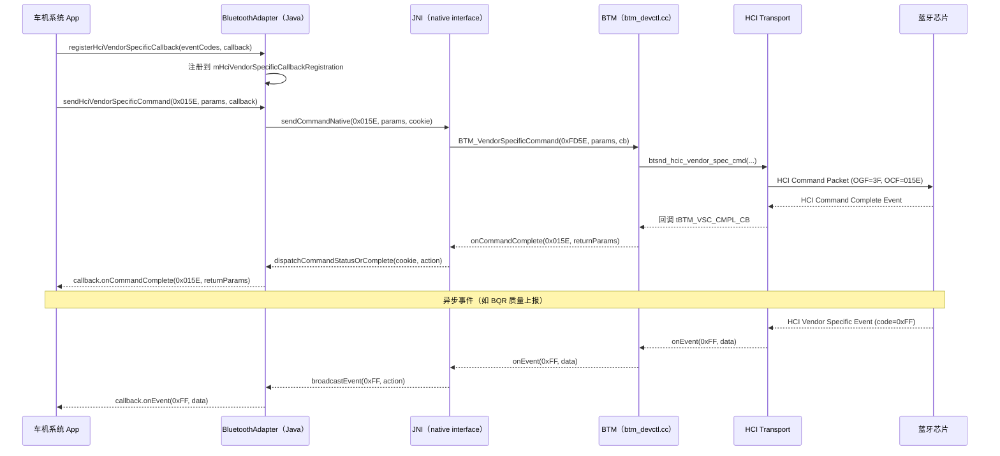

# 23.1 Vendor Specific HCI 命令体系

> **速通摘要**：**Vendor Specific HCI 命令**（VSC）是蓝牙标准在 OGF=0x3F 下预留的厂商自定义命令空间，让芯片厂（Qualcomm / Broadcom / MediaTek / UNISOC 等）可以暴露标准规格以外的特性（AFH 增强、功耗调参、BQR 上报、A2DP 硬件加速等）。Android 蓝牙模块在 native 层通过 `BTM_VendorSpecificCommand()` 下发 VSC，在 Java/framework 层（Android 16 新增）通过 `BluetoothAdapter.sendHciVendorSpecificCommand()` + `BluetoothHciVendorSpecificCallback` 暴露给特权 App。本节梳理 VSC 命令格式、Android 调用路径（Java→JNI→native BTM→HCI）、常见厂商命令、车机场景下的典型用途。

---

## 学习目标

读完本节后，你能：
1. 解释 HCI Vendor Specific 命令的 opcode 结构（OGF=0x3F，OCF 任意）。
2. 追踪 `BTM_VendorSpecificCommand()` 的调用链从 BTM 层到 HCI 物理层。
3. 理解 Android 16 新增的 `BluetoothHciVendorSpecificCallback` Java API。
4. 列出车机场景下常用的 VSC 类型（功耗、ACL 优先级、BQR）。

---

## 前置知识

- [05.5 HCI 层](../05_Native栈基础/05.5_HCI层.md)
- [05.2 BTA 中间层](../05_Native栈基础/05.2_BTA中间层.md)

---

## 场景故事

车机工程师发现 A2DP 音乐播放时，某个蓝牙芯片会把 BLE 扫描和 A2DP 放在同一个无线时间片竞争，导致音乐卡顿。芯片厂给了一个私有 HCI 命令 `0xFD95`（MediaTek: Set ACL Priority），可以把 A2DP 连接的 ACL 优先级提到最高，让芯片优先保障 A2DP 的射频时间。

这个命令不是蓝牙标准的一部分，只能通过 Vendor Specific HCI 命令下发。车机工程师需要在 Android 蓝牙源码里找到合适的位置注入这个调用。

---

## 一、HCI Vendor Specific 命令格式

```
HCI Command Packet:
┌──────────────┬──────────────┬─────────────────────────────────┐
│ Opcode (2B)  │ Param Len(1B)│ Parameters (0-255B)             │
│  OGF | OCF   │              │ (厂商自定义)                     │
└──────────────┴──────────────┴─────────────────────────────────┘

Opcode 结构：
  Bits 15:10 = OGF（Opcode Group Field）= 0x3F（63 decimal）
  Bits  9: 0 = OCF（Opcode Command Field）= 厂商自定义（0x000~0x3FF）

示例：
  HCI_GRP_VENDOR_SPECIFIC = (0x3F << 10) = 0xFC00
  HCI_CONTROLLER_BQR      = (0x015E | HCI_GRP_VENDOR_SPECIFIC) = 0xFD5E
  HCI_MTK_SET_ACL_PRIORITY = (0xFD95 | HCI_GRP_VENDOR_SPECIFIC) = 0xFFD95 ← 这里有点特殊，MTK 用了超出标准的 OCF
```

注：本仓库 `system/stack/include/hcidefs.h:46` 定义 `HCI_GRP_VENDOR_SPECIFIC = (0x3F << 10)`。

---

## 二、本仓库中已知的 VSC

```c
// system/stack/include/hcidefs.h（精选，已验证行号）
// ───────────────────────────────────────────────────────────────

// BLE 厂商能力查询（Google 系芯片扩展）
#define HCI_BLE_VENDOR_CAP       (0x0153 | HCI_GRP_VENDOR_SPECIFIC)  // :385

// Multi-ADV（多广播集支持）
#define HCI_BLE_MULTI_ADV        (0x0154 | HCI_GRP_VENDOR_SPECIFIC)  // :409

// 广播过滤器（ADV filter offload）
#define HCI_BLE_ADV_FILTER       (0x0157 | HCI_GRP_VENDOR_SPECIFIC)  // :412

// Energy info（功耗统计）
#define HCI_BLE_ENERGY_INFO      (0x0159 | HCI_GRP_VENDOR_SPECIFIC)  // :415

// Debug info（调试日志）
#define HCI_CONTROLLER_DEBUG_INFO (0x015B | HCI_GRP_VENDOR_SPECIFIC) // :418

// A2DP 硬件加速
#define HCI_CONTROLLER_A2DP      (0x015D | HCI_GRP_VENDOR_SPECIFIC)  // :421

// BQR（蓝牙质量报告）
#define HCI_CONTROLLER_BQR       (0x015E | HCI_GRP_VENDOR_SPECIFIC)  // :424

// DAB（Device Address Binding）
#define HCI_CONTROLLER_DAB       (0x015F | HCI_GRP_VENDOR_SPECIFIC)  // :427

// ACL 优先级（Broadcom / Synaptics / UNISOC 系列）
#define HCI_BRCM_SET_ACL_PRIORITY  (0x0057 | HCI_GRP_VENDOR_SPECIFIC) // :872
#define HCI_SYNA_SET_ACL_PRIORITY  (0x0057 | HCI_GRP_VENDOR_SPECIFIC) // :902
#define HCI_UNISOC_SET_ACL_PRIORITY (0x0057 | HCI_GRP_VENDOR_SPECIFIC) // :906

// ACL 优先级（MediaTek — 用了扩展 OCF）
#define HCI_MTK_SET_ACL_PRIORITY   (0xFD95 | HCI_GRP_VENDOR_SPECIFIC) // :912
```

---

## 三、Native 调用路径

```
App / BTA 层（如 bta_dm_pm.cc：想提升 A2DP ACL 优先级）
    │
    ▼
BTM_VendorSpecificCommand(opcode, param_len, p_param_buf, callback)
    │ system/stack/btm/btm_devctl.cc:350
    ▼
btsnd_hcic_vendor_spec_cmd(opcode, param_len, p_param_buf, callback)
    │ system/stack/hcic/hcicmds.cc
    ▼
HCI 传输层（GD: system/gd/hal/hci_hal_impl_android.h → /dev/btusb 或 UART）
    │
    ▼
蓝牙芯片 Controller
```

### 3.1 BTM_VendorSpecificCommand 签名

```c
// system/stack/btm/btm_devctl.cc:350
void BTM_VendorSpecificCommand(
    uint16_t opcode,           // OCF（自动 OR HCI_GRP_VENDOR_SPECIFIC）
    uint8_t param_len,         // 参数长度（字节）
    uint8_t* p_param_buf,      // 参数缓冲区
    tBTM_VSC_CMPL_CB* p_cb     // 完成回调（可为 nullptr）
);
```

### 3.2 实际使用示例（BQR 设置）

```c
// system/btif/src/btif_bqr.cc（示意，非精确行号）
uint8_t buf[4];
UINT32_TO_STREAM(buf, quality_mask);   // 设置 BQR 事件掩码
BTM_VendorSpecificCommand(
    HCI_CONTROLLER_BQR,                // VSC opcode for BQR
    sizeof(buf),
    buf,
    btif_bqr_vendor_cmd_cmpl_callback  // 异步完成回调
);
```

---

## 四、Java/Framework 层（Android 16 新增）

Android 16 通过 `BluetoothHciVendorSpecificNativeInterface` + `BluetoothAdapter` 把 VSC 能力暴露给特权系统 App（需要 `BLUETOOTH_PRIVILEGED` 权限）：

### 4.1 发送 VSC

```java
// 需要系统签名 App + BLUETOOTH_PRIVILEGED 权限

// 步骤 1：注册回调（监听 VSC 事件）
BluetoothHciVendorSpecificCallback callback = new BluetoothHciVendorSpecificCallback() {
    @Override
    public void onCommandStatus(int ocf, int status) {
        Log.d(TAG, "VSC ocf=0x" + Integer.toHexString(ocf) + " status=" + status);
    }

    @Override
    public void onCommandComplete(int ocf, byte[] returnParameters) {
        Log.d(TAG, "VSC complete ocf=0x" + Integer.toHexString(ocf));
        // 解析 returnParameters（厂商自定义格式）
    }

    @Override
    public void onEvent(int eventCode, byte[] data) {
        // VSC 异步事件（如 BQR 质量报告）
        Log.d(TAG, "VSC event code=0x" + Integer.toHexString(eventCode));
    }
};

// 注册监听的事件 code 列表（厂商文档定义）
adapter.registerHciVendorSpecificCallback(executor, Set.of(0xFF, 0xFE), callback);

// 步骤 2：发送命令
// OCF = 0x015E → BQR 命令
byte[] params = {0x01, 0x00, 0x00, 0x00};  // quality_mask
adapter.sendHciVendorSpecificCommand(
    0x015E,   // OCF（不含 OGF，底层自动 OR HCI_GRP_VENDOR_SPECIFIC）
    params,
    callback
);

// 步骤 3：清理
adapter.unregisterHciVendorSpecificCallback(callback);
```

### 4.2 注册/发送调用链（Java→JNI→native）

```
BluetoothAdapter.sendHciVendorSpecificCommand(ocf, params, callback)
    │ framework/java/android/bluetooth/BluetoothAdapter.java:5266
    ▼
IBluetooth (AIDL) → BluetoothServiceBinder
    ▼
BluetoothHciVendorSpecificNativeInterface.sendCommand(ocf, params, cookie)
    │ android/app/src/com/android/bluetooth/btservice/:37
    ▼
sendCommandNative(ocf, params, cookie)   // JNI
    ▼
BTM_VendorSpecificCommand(opcode | HCI_GRP_VENDOR_SPECIFIC, ...)
    │ system/stack/btm/btm_devctl.cc:350
    ▼
HCI 传输层 → 芯片
```

---

## 五、车机场景常用 VSC 类型

| VSC 用途 | 命令 | 触发场景 |
|---------|------|---------|
| BQR 质量报告开启 | `HCI_CONTROLLER_BQR` (0xFD5E) | 出厂 / 车机启动时 |
| ACL 优先级提升（A2DP 防卡顿）| 各芯片私有（Broadcom/MTK 等）| A2DP 连接建立后 |
| A2DP 硬件加速 offload | `HCI_CONTROLLER_A2DP` (0xFD5D) | A2DP offload 路径 |
| LE 功耗调参（scan interval）| 芯片私有 | 息屏后 BLE 功耗优化 |
| Host log level 设置 | `HCI_VS_HOST_LOG_OPCODE` (0xFC17) | 调试时开启详细日志 |
| 多广播（BLE multi-adv）| `HCI_BLE_MULTI_ADV` (0xFD54) | 需要同时多个广播集时 |

---

## 六、如何查找芯片厂 VSC 文档

```
1. Qualcomm：需要签 NDA 获取 BT_CHIPxxx_VSC.pdf
2. Broadcom：BT_VSC_Application_Guide（通常随 BSP 附带）
3. MediaTek：MTK BT VSC Spec（与 MTK Android SDK 包一起）
4. UNISOC：UNISOC BT Vendor Specific HCI Spec

注意：
- VSC 文档通常是保密的，不能分享
- OEM 需要在 android/app/src/com/android/bluetooth/btservice/ 或
  system/bta/ 里自行加注入点
- 建议单独维护 vendor patch，不要直接改 AOSP 代码
```

---

## 七、Mermaid：VSC 发送与回调时序



---

## 八、调试方法

```bash
# 查看 BTM_VendorSpecificCommand 调用（native log）
adb logcat -s bt_btm:V | grep -i "vendor\|VSC\|opcode"

# 确认 BQR VSC 是否下发成功
adb logcat -s bt_btif_bqr:V | grep -i "BQR\|vendor"

# btsnoop 抓 VSC（OGF = 0x3F 的 HCI command）
# Wireshark filter: hci_cmd.ogf == 0x3f

# 查看 BluetoothHciVendorSpecificDispatcher 注册情况（系统 App 调试）
adb logcat -s BluetoothHciVendorSpecificDispatcher:V | head -20

# 检查特权权限（VSC 需要 BLUETOOTH_PRIVILEGED）
adb shell dumpsys package <your.system.app> | grep "BLUETOOTH_PRIVILEGED"
```

---

## FAQ

**Q1：普通 App 能发 VSC 吗？**
**不能**。`sendHciVendorSpecificCommand()` 需要 `BLUETOOTH_PRIVILEGED` 权限，这是平台级权限，只有系统签名的 App 才能获得。第三方 App 无法直接发 VSC。

**Q2：在 native 层直接调用 `BTM_VendorSpecificCommand` 需要什么前提？**
在 BTIF 层及以下的 native 代码里可以直接调用，但需要在蓝牙已初始化（`mNativeAvailable = true`）后调用。通常挂在 A2DP 状态机连接成功、HFP 连接后等合适的回调里。

**Q3：如何处理不同芯片的 VSC 差异？**
推荐用 `#ifdef` 编译开关或运行时检测芯片型号（通过 `HCI_BLE_VENDOR_CAP` 响应里的能力字段判断），分别调用各芯片的 VSC。AOSP 里 `hcidefs.h` 里的多个 `SET_ACL_PRIORITY` 定义值相同（同一个 OCF，只是注释区分厂商），实际运行时不冲突，因为每个设备只有一颗芯片。

---

## 上路任务

1. 在 `system/stack/include/hcidefs.h` 里找出本仓库所有 `HCI_GRP_VENDOR_SPECIFIC` 相关定义，列出 OCF 值并对照芯片厂文档（若有）。
2. 在 `system/stack/btm/btm_devctl.cc:350` 处设置断点（或加 log），确认 BQR 启动时 `BTM_VendorSpecificCommand` 的 opcode 和参数。
3. 在系统 App 里注册 `BluetoothHciVendorSpecificCallback`，打印 `onEvent(code, data)` 接收到的所有事件，看芯片在正常连接过程中会触发哪些 VSC 事件。
