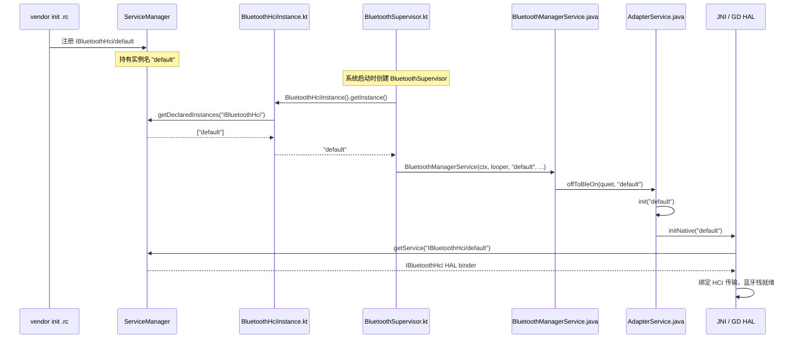

# 23.2 BluetoothHciInstance

> **速通摘要**：**`BluetoothHciInstance`** 是 Android 16 新引入的 Kotlin 工具类（`service/src/BluetoothHciInstance.kt:24`），用于从 ServiceManager 查询系统上注册了哪些 `android.hardware.bluetooth.IBluetoothHci` HAL 实例，从而支持"多蓝牙芯片"场景（如车机同时集成车内蓝牙和外置蓝牙 USB dongle）。当 `hci_instance_name_use_injected` flag 开启时，`BluetoothSupervisor` 不再硬编码使用 `"default"` 实例名，而是从 `BluetoothHciInstance.getInstance()` 动态读取。本节梳理 HCI 实例发现机制、多 HCI 场景的初始化路径，以及车机 OEM 如何配置多蓝牙芯片。

---

## 学习目标

读完本节后，你能：
1. 解释 `BluetoothHciInstance` 如何通过 ServiceManager 发现 HCI 实例。
2. 追踪从 `BluetoothSupervisor` 到 `AdapterService.init()` 的 HCI 实例名传递链路。
3. 知道 `hci_instance_name_use_injected` flag 的作用和开启条件。
4. 理解 VHAL HAL 实例注册格式（`IBluetoothHci/default` vs `IBluetoothHci/usb`）。

---

## 前置知识

- [23.1 Vendor Specific HCI 命令体系](23.1_Vendor_Specific_HCI命令体系.md)
- [18.1 BluetoothService.kt 拆解](../18_BluetoothManagerService深度/18.1_BluetoothService_AdapterState拆解.md)
- 了解 Android HIDL/AIDL HAL 机制

---

## 场景故事

高端车机配置两颗蓝牙芯片：
1. 主芯片（`default`）：负责车内所有 Classic BT 连接（HFP、A2DP）
2. 副芯片（`rear`）：专门服务后排娱乐屏的 BLE 外设连接

Android 16 以前，蓝牙系统只能连一颗芯片（硬编码 `"default"`）。`BluetoothHciInstance` 机制是多蓝牙芯片支持的第一步——让系统知道当前有哪些 HCI HAL 实例可用。

---

## 一、架构概览

```
ServiceManager（Binder 服务注册表）
    │
    ├── android.hardware.bluetooth.IBluetoothHci/default   ← 主 BT 芯片
    ├── android.hardware.bluetooth.IBluetoothHci/rear      ← 副 BT 芯片（若有）
    └── ...

BluetoothHciInstance（service/src/BluetoothHciInstance.kt:24）
    │  ServiceManager.getDeclaredInstances("android.hardware.bluetooth.IBluetoothHci")
    ▼
["default", "rear"]  → getInstance() → "default"（当前只取第一个）

BluetoothSupervisor（service/src/BluetoothSupervisor.kt:32）
    │  Flags.hciInstanceNameUseInjected() ? BluetoothHciInstance().getInstance() : "default"
    ▼
BluetoothManagerService(context, looper, hciInstanceName="default", ...)

BluetoothManagerService.propagateOffToBleOn(hciInstanceName)
    │  service/src/com/android/server/bluetooth/BluetoothManagerService.java:1788
    ▼
AdapterBinder.offToBleOn(quiet, "default")
    │  service/src/AdapterBinder.kt:44
    ▼
AdapterService.offToBleOn(quiet, "default")
    │  android/app/src/com/android/bluetooth/btservice/AdapterService.java:930
    ▼
AdapterService.init("default")
    │  android/app/src/com/android/bluetooth/btservice/AdapterService.java:956
    ▼
AdapterNativeInterface.init(this, ..., "default")
    │  android/app/src/com/android/bluetooth/btservice/AdapterNativeInterface.java:49
    ▼
JNI: initNative("default")
    ▼
GD HAL: IBluetoothHci/default  ← 绑定到这个芯片实例
```

---

## 二、`BluetoothHciInstance` 源码解析

```kotlin
// service/src/BluetoothHciInstance.kt:24
class BluetoothHciInstance {
    // BLUETOOTH_HCI_INTERFACE = "android.hardware.bluetooth.IBluetoothHci"
    // ServiceManager.getDeclaredInstances() 查询所有注册了此接口的实例名
    private val hciInstances: Array<String> =
        ServiceManager.getDeclaredInstances(BLUETOOTH_HCI_INTERFACE)

    init {
        // 启动时打印：Service manager declared bluetooth hci instances: [default, rear]
        Log.i("Service manager declared bluetooth hci instances: ${hciInstances.contentToString()}")
    }

    fun getInstance(): String {
        // 当前实现：只取第一个（多 HCI 完整支持是未来工作）
        return if (hciInstances.isEmpty()) HCI_DEFAULT_INSTANCE_NAME else hciInstances[0]
    }
}

private const val BLUETOOTH_HCI_INTERFACE = "android.hardware.bluetooth.IBluetoothHci"
private const val HCI_DEFAULT_INSTANCE_NAME = "default"
```

**关键点**：
- `getDeclaredInstances()` 是 ServiceManager 的 AIDL 服务发现接口
- 当前 `getInstance()` 只返回第一个——多 HCI 的完整切换/选择逻辑是 TODO
- 如果 ServiceManager 里没有注册任何实例，fallback 到 `"default"`

---

## 三、flag 控制

```kotlin
// service/src/BluetoothSupervisor.kt:32
val hciInstance =
    if (Flags.hciInstanceNameUseInjected()) {    // flags/framework.aconfig
        BluetoothHciInstance().getInstance()     // 动态查询
    } else {
        "default"                                // 旧行为（硬编码）
    }
```

对应 flag：`flags/framework.aconfig` 中的 `hci_instance_name_use_injected`：

```
flag {
    name: "hci_instance_name_use_injected"
    namespace: "bluetooth"
    description: "Inject service manager bluetooth hci instance name"
    bug: "413484664"
}
```

只有当 `adb shell device_config get bluetooth hci_instance_name_use_injected` 返回 `true` 时，才走动态发现路径。

---

## 四、HAL 实例注册（vendor 侧）

车机 OEM 需要在 vendor HAL 中注册对应实例。以 AIDL HAL 为例：

```
# 车机 vendor init script（rc 文件）
service bluetooth_hci_default /vendor/bin/hw/android.hardware.bluetooth-service.default
    class hal
    user bluetooth
    group bluetooth net_admin net_bt_admin
    ...

# 注册到 ServiceManager 的实例名：android.hardware.bluetooth.IBluetoothHci/default
```

如果要支持第二颗芯片：
```
service bluetooth_hci_rear /vendor/bin/hw/android.hardware.bluetooth-service.rear
    class hal
    user bluetooth
    ...

# 注册实例名：android.hardware.bluetooth.IBluetoothHci/rear
```

---

## 五、多 HCI 的完整愿景（当前 TODO）

**当前状态（Android 16）**：
- 只支持发现第一个 HCI 实例（`getInstance()` 只取 `[0]`）
- 多 HCI 切换、多 BluetoothService 共存尚未实现
- `BluetoothHciInstance` 是基础设施的第一步

**预计未来方向**：
1. 多个 `BluetoothManagerService` 实例，每个绑定一颗芯片
2. Framework API 支持 `getAdapter(instanceName)` 返回指定芯片的 Adapter
3. Profile 路由：A2DP/HFP 走主芯片，BLE 走副芯片

车机 OEM 可关注 `BluetoothHciInstance.kt` 的演进，在上游实现前自行扩展（需要在 `BluetoothSupervisor` 层做拆分）。

---

## 六、Mermaid：HCI 实例发现与初始化链路



---

## 七、调试方法

```bash
# 查看当前注册的蓝牙 HAL 实例
adb shell service list | grep bluetooth

# 查看 ServiceManager 中 IBluetoothHci 实例（Android 13+）
adb shell dumpsys servicemanager | grep "IBluetoothHci"

# 查看 BluetoothHciInstance 的日志
adb logcat -s BluetoothService:V | grep -i "hci instance\|hciInstance"

# 确认 flag 是否开启
adb shell device_config get bluetooth hci_instance_name_use_injected

# 查看 AdapterService.init() 接收的实例名
adb logcat -s bt_btservice_AdapterService:V | grep "init()"

# 车机多 HAL 场景：确认两个 HAL service 都在运行
adb shell ps | grep bluetooth
```

---

## FAQ

**Q1：现在（Android 16）车机能同时用两颗蓝牙芯片吗？**
**还不能完全做到**。`BluetoothHciInstance` 只发现第一个实例，完整的多 HAL 多 Service 支持尚在开发。车机 OEM 若需要多芯片，目前需要在 vendor 层自行拆分 Service 或使用芯片厂的私有方案。

**Q2：如何强制使用特定 HCI 实例进行调试？**
两种方法：① 关闭 `hci_instance_name_use_injected` flag（`adb shell device_config put bluetooth hci_instance_name_use_injected false`），强制走旧的 `"default"` 路径；② 修改 `BluetoothHciInstance.getInstance()` 返回特定实例名（需要 rebuild）。

**Q3：`getDeclaredInstances()` 和 `checkService()` 的区别？**
`getDeclaredInstances(interface)` 返回 ServiceManager 中声明了该接口的所有实例名列表（如 `["default", "rear"]`）。`checkService(name)` 是查询特定完整服务名（如 `android.hardware.bluetooth.IBluetoothHci/default`）是否存在。前者用于发现，后者用于绑定。

---

## 上路任务

1. 运行 `adb shell dumpsys servicemanager | grep bluetooth` 或 `adb shell service list | grep bluetooth`，数一数当前设备注册了哪些蓝牙 HAL 服务。
2. 打开 `service/src/BluetoothSupervisor.kt:32`，理解 `hciInstanceNameUseInjected` flag 的 if/else 分支，用 `adb shell device_config put bluetooth hci_instance_name_use_injected false` 切换后重启蓝牙，用 logcat 确认走了哪条分支。
3. 设想一个"车机 + 后排娱乐系统双蓝牙"的架构方案：需要修改哪些文件才能让两个 `BluetoothService` 各自绑定一颗芯片？把思路写成一个 TODO 清单。
