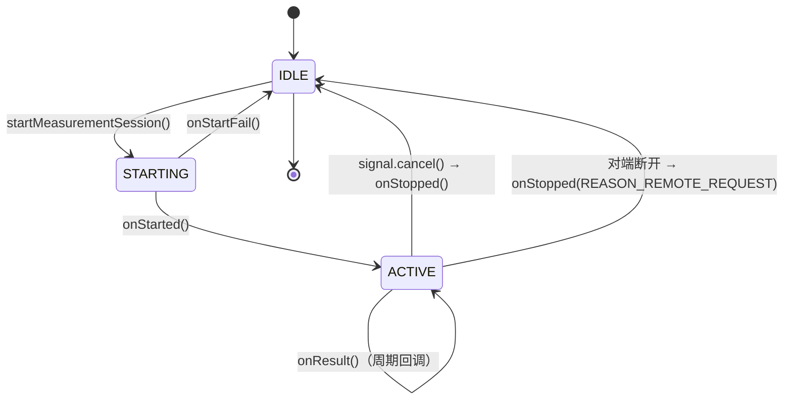

# 24.1 DistanceMeasurementManager 框架

> **速通摘要**：`DistanceMeasurementManager`（`android.bluetooth.le` 包）是 Android 对蓝牙测距能力的统一抽象接口，支持两种方法：① **RSSI**——基于接收信号强度的粗粒度估算（精度±1-3m）；② **Channel Sounding（CS）**——BLE 5.4 引入的高精度测距（精度±0.1m，需要硬件支持）。App 通过 `BluetoothAdapter.getDistanceMeasurementManager()` 获取实例，调用 `startMeasurementSession()` 启动测距，通过 `DistanceMeasurementSession.Callback` 接收测量结果（距离/方位角/仰角）。权限要求 `BLUETOOTH_PRIVILEGED`（当前为 SystemAPI）。本节梳理 API 使用、两种方法的对比、数据结构、调用链路。

---

## 学习目标

读完本节后，你能：
1. 调用 `DistanceMeasurementManager` 完成一次测距会话。
2. 区分 RSSI 方法和 Channel Sounding 方法的精度与用途。
3. 解析 `DistanceMeasurementResult` 返回的字段。
4. 理解 `REPORT_FREQUENCY_LOW/MEDIUM/HIGH` 对功耗的影响。

---

## 前置知识

- [08.1 BLE 扫描](../08_BLE_GATT/08.1_BLE扫描.md)
- [21.1 aconfig 系统机制](../21_aconfig_flag与版本演进/21.1_aconfig系统机制.md) — channel_sounding flag

---

## 场景故事

车机需要检测"手机是否在车厢内"（用于自动解锁车门）。GPS 精度不够（10m 误差），WiFi RTT 需要 WiFi 热点，UWB 需要专用硬件。

BLE Channel Sounding 提供了一个新选项：精度 ±10cm~±50cm，直接利用已有的蓝牙芯片，不需要额外硬件（只需要芯片支持 CS）。

Android 16 把这个能力通过 `DistanceMeasurementManager` 统一暴露，让系统 App 可以集成到车门解锁等场景。

---

## 一、API 全景

```
BluetoothAdapter
    │ getDistanceMeasurementManager()
    ▼
DistanceMeasurementManager
    │ getSupportedMethods()           ← 查询设备支持哪些测距方法
    │ startMeasurementSession(params, executor, callback)  ← 启动测距
    ▼
CancellationSignal                   ← 可取消的信号
    │ cancel() → session.stopSession()

DistanceMeasurementSession.Callback
    │ onStarted(session)             ← 测距会话已启动
    │ onStartFail(errorCode)         ← 启动失败
    │ onResult(device, result)       ← 测量结果（周期性回调）
    └ onStopped(session, reason)     ← 会话停止

DistanceMeasurementResult
    │ getResultMeters()              ← 距离（米）
    │ getErrorMeters()               ← 误差（米）
    │ getAzimuthAngle()              ← 方位角（0~360°，可选）
    └ getAltitudeAngle()             ← 仰角（-90~90°，可选）
```

---

## 二、测距方法对比

| 维度 | RSSI | Channel Sounding (CS) |
|------|------|-----------------------|
| API 常量 | `DISTANCE_MEASUREMENT_METHOD_RSSI = 1` | `DISTANCE_MEASUREMENT_METHOD_CHANNEL_SOUNDING = 2` |
| 精度 | ±1-3m（受反射影响大）| ±0.1-0.5m（相位测量，受遮挡影响小）|
| 芯片要求 | 所有 BLE 芯片支持 | 需要 BLE 5.4 CS 能力 |
| Android 版本 | API 33+ | API 36（Android 16，flag LAUNCHED）|
| 功耗 | 低 | 中（需要额外射频操作）|
| 方位角支持 | 不支持（RSSI 无方向信息）| 需要多天线（AoA/AoD），芯片能力决定 |
| 车机用途 | 粗判"手机在不在车内" | 精判"手机在哪个车门附近" |

---

## 三、API 使用示例

```java
// 需要 BLUETOOTH_PRIVILEGED（系统签名 App）

BluetoothAdapter adapter = BluetoothAdapter.getDefaultAdapter();
DistanceMeasurementManager dm = adapter.getDistanceMeasurementManager();

// 1. 检查支持的方法
List<DistanceMeasurementMethod> methods = dm.getSupportedMethods();
// framework/java/android/bluetooth/le/DistanceMeasurementManager.java:93
for (DistanceMeasurementMethod m : methods) {
    Log.d(TAG, "Supported method: " + m.getId());
    // getId() 返回 DISTANCE_MEASUREMENT_METHOD_RSSI(1) 或 _CHANNEL_SOUNDING(2)
}

// 2. 构造测距参数
DistanceMeasurementParams params = new DistanceMeasurementParams.Builder(device)
    .setMethodId(DistanceMeasurementMethod.DISTANCE_MEASUREMENT_METHOD_CHANNEL_SOUNDING)
    .setFrequency(DistanceMeasurementParams.REPORT_FREQUENCY_MEDIUM)  // 中频率
    // 如果用 Channel Sounding，可以指定额外参数
    .setChannelSoundingParams(
        new ChannelSoundingParams.Builder()
            .setSightType(ChannelSoundingParams.SIGHT_TYPE_LINE_OF_SIGHT)  // 直视
            .build())
    .build();
// framework/java/android/bluetooth/le/DistanceMeasurementParams.java

// 3. 启动测距会话
CancellationSignal signal = dm.startMeasurementSession(
    params,
    Executors.newSingleThreadExecutor(),
    new DistanceMeasurementSession.Callback() {
        @Override
        public void onStarted(@NonNull DistanceMeasurementSession session) {
            Log.d(TAG, "Distance measurement started");
        }

        @Override
        public void onStartFail(int reason) {
            Log.e(TAG, "Start failed: reason=" + reason);
        }

        @Override
        public void onResult(@NonNull BluetoothDevice device,
                             @NonNull DistanceMeasurementResult result) {
            // framework/java/android/bluetooth/le/DistanceMeasurementResult.java:161
            double distanceM = result.getResultMeters();
            double errorM = result.getErrorMeters();
            double azimuth = result.getAzimuthAngle();    // 0~360°
            double altitude = result.getAltitudeAngle();  // -90~90°

            Log.d(TAG, String.format(
                "Distance=%.2fm ±%.2fm azimuth=%.1f° alt=%.1f°",
                distanceM, errorM, azimuth, altitude));

            // 车机逻辑：手机 < 1m + 方位角对应驾驶座 → 解锁车门
            if (distanceM < 1.0 && azimuth < 30.0) {
                unlockDriverDoor();
            }
        }

        @Override
        public void onStopped(@NonNull DistanceMeasurementSession session, int reason) {
            Log.d(TAG, "Session stopped: reason=" + reason);
        }
    }
);

// 4. 停止测距
signal.cancel();  // 或等到 onStopped 自然结束
```

---

## 四、`DistanceMeasurementResult` 字段

```java
// framework/java/android/bluetooth/le/DistanceMeasurementResult.java

// 必填字段：
double getResultMeters()     // 测量距离（米），相对精度由方法决定
double getErrorMeters()      // 误差估计（米，≥0）

// 可选字段（仅部分芯片/方法支持，不支持时返回 NaN）：
double getAzimuthAngle()     // 方位角（0-360°，0=正北 or 对端方向）
double getErrorAzimuthAngle()// 方位角误差
double getAltitudeAngle()    // 仰角（-90~90°，0=水平）
double getErrorAltitudeAngle()// 仰角误差
int getDistanceMeasurementMethod()  // 本次用的方法（RSSI=1 / CS=2）
```

---

## 五、`REPORT_FREQUENCY` 对功耗的影响

| 频率 | 常量 | 典型上报间隔 | 功耗 | 用途 |
|------|------|------------|------|------|
| LOW | `REPORT_FREQUENCY_LOW = 0` | ~3s | 低 | 后台持续监控 |
| MEDIUM | `REPORT_FREQUENCY_MEDIUM = 1` | ~1s | 中 | 前景场景 |
| HIGH | `REPORT_FREQUENCY_HIGH = 2` | < 0.5s | 高 | 实时精准定位 |

车机解锁场景推荐 MEDIUM（平衡功耗与响应）；高端"无感进入"场景用 HIGH（需要应用在前台）。

---

## 六、调用链路（Java→JNI→Native）

```
DistanceMeasurementManager.startMeasurementSession(params, executor, callback)
    │ framework/java/android/bluetooth/le/DistanceMeasurementManager.java:131
    ▼
IDistanceMeasurement.startDistanceMeasurement(uuid, params, callbackWrapper, source)
    │ AIDL Binder 调用 → DistanceMeasurementBinder.kt
    ▼
DistanceMeasurementManager（android/app/）.startMeasurementSession(params)
    │ android/app/src/com/android/bluetooth/gatt/DistanceMeasurementManager.java
    ▼
DistanceMeasurementNativeInterface.startDistanceMeasurement(type, params)
    │ android/app/src/com/android/bluetooth/gatt/DistanceMeasurementNativeInterface.java
    ▼
JNI → GD: distance_measurement_manager.cc
    ▼
芯片 Channel Sounding 硬件 / RSSI 采样
```

---

## 七、flag 与版本支持

| flag | 文件 | 说明 |
|------|------|------|
| `channel_sounding` | `flags/ranging.aconfig` | 启用 CS API（is_exported） |
| `channel_sounding_offload` | `flags/ranging.aconfig` | CS offload 机制 |
| `channel_sounding_25q2_apis` | `flags/25q2_exported_api_flags.aconfig` | 25Q2 LAUNCHED，Android 16 永远 true |

```bash
# 确认芯片是否支持 Channel Sounding
adb shell device_config get bluetooth channel_sounding
# 如果返回 null 或 false，设备不支持（或 flag 未开）
```

---

## 八、Mermaid：测距会话生命周期



---

## 九、调试方法

```bash
# 查看 DistanceMeasurement 状态
adb shell dumpsys bluetooth_manager | grep -A 10 "DistanceMeasurement"

# 查看测距 log
adb logcat -s bt_gatt_distance_measurement:V BluetoothLeScanner:V | head -50

# 确认 CS flag 状态
adb shell device_config list bluetooth | grep channel_sounding

# 查询设备 CS 能力（需系统权限，在系统 App 里调用）
# dm.getSupportedMethods() 返回包含 CHANNEL_SOUNDING 则硬件支持

# 抓 HCI 包确认 CS 命令（CS Setup / CS Procedure）
adb shell setprop persist.bluetooth.btsnooplogmode full
# Wireshark filter: btcommon.eir_ad.entry.type == 0x2c  (CS)
```

---

## FAQ

**Q1：为什么 `DistanceMeasurementManager` 标注了 `@SystemApi` 还加了 `@hide`？**
它是 System API——只有系统签名的 App（OEM 车机 App、数字车钥匙 App）才能调用，普通 App 无法访问。`@hide` 和 `@SystemApi` 同时标注是 AOSP 的惯例：API 隐藏但对系统 App 可见。

**Q2：普通车机 App 如何使用测距功能？**
直接调用受到权限限制。推荐方案：① OEM 在系统服务里封装测距逻辑，通过自定义 AIDL 或 ContentProvider 暴露给三方 App；② 等待 Google 在未来版本把 API 开放给特定场景（如数字车钥匙）。

**Q3：Channel Sounding 精度 ±10cm 在实际车机场景靠谱吗？**
实验室条件：±10cm。真实车内（金属车身、座椅遮挡、多径效应）：通常 ±30-80cm。对于"判断手机在哪个车门附近"（分辨率 0.5m 级）已经足够。参考 Apple CarKey（UWB）和数字车钥匙联盟的测试数据。

---

## 上路任务

1. 调用 `dm.getSupportedMethods()` 在你的测试设备上打印支持的测距方法，看是否包含 Channel Sounding。
2. 用 RSSI 方法做一次 10 次测距，记录每次 `getResultMeters()` 的值，计算标准差，理解 RSSI 精度的不稳定性。
3. 阅读 `flags/ranging.aconfig`，理解 `channel_sounding` vs `channel_sounding_offload` 两个 flag 的区别，查阅 BLE 5.4 规格中 Channel Sounding 的 HADM 部分。
