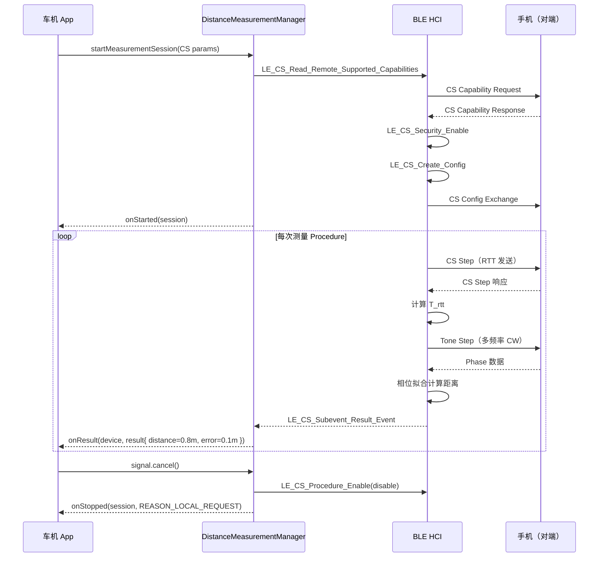

# 24.2 Channel Sounding / HADM

> **速通摘要**：**Channel Sounding（CS）**是 Bluetooth Core 6.0 中正式定义的高精度测距技术（原名 HADM：High Accuracy Distance Measurement），通过测量信号在两个设备间的往返时间（RTT）和相位差（Tone Phase）计算距离，精度可达 **±10cm~±50cm**。Android 16 通过 `ChannelSoundingParams` 和 `DistanceMeasurementManager` 暴露该能力，`flags/ranging.aconfig` 中的 `channel_sounding` 和 `channel_sounding_25q2_apis` flag 控制其可用性。本节覆盖 CS 的工作原理、安全级别（1-4级）、视线类型（LoS/NLoS）、与 RSSI 测距的选择策略，以及 native 层的测量上报链路。

---

## 学习目标

读完本节后，你能：
1. 解释 Channel Sounding 的两种测量模式（RTT 和 Tone-based Phase）。
2. 理解 CS Security Level 1-4 的差异及车机选择建议。
3. 知道 `ChannelSoundingParams.Builder` 各参数的含义。
4. 追踪从 Java API 到 `system/gd/hci/channel_sounding/` native 的调用链路。

---

## 前置知识

- [24.1 DistanceMeasurementManager 框架](24.1_DistanceMeasurementManager框架.md)
- [05.5 HCI 层](../05_Native栈基础/05.5_HCI层.md)

---

## 场景故事

数字车钥匙需要达到 CCC（Car Connectivity Consortium）数字钥匙标准：**离车门 30cm 内自动解锁，超出 2m 自动锁门**。RSSI 测距误差太大（±1-3m），经常出现"误解锁"（手机放在车旁的地上）或"误锁门"（在车内）。

Channel Sounding 安全级别 3（10ns RTT 精度，≈1.5m 分辨率）配合多次平均，可以将误判率降到 <1%，满足数字车钥匙场景。

---

## 一、Channel Sounding 工作原理

### 1.1 两种测量模式

```
模式 1：CS RTT（Round Trip Time 往返时间）
──────────────────────────────────────────
  设备 A                       设备 B
    │──── CS Step（测距帧）────►│
    │◄─── CS Step 响应 ─────────│
    │                           │
  测量往返时间 T_rtt
  距离 = T_rtt × c / 2 = T_rtt × 1.5×10⁸ m/s

  精度取决于时间分辨率：
  Level 2: 150ns → ±22.5m（粗）
  Level 3: 10ns  → ±1.5m
  Level 4: 10ns + Sounding Seq → ±0.5m（抗攻击）

模式 2：CS Tone Phase（相位差）
──────────────────────────────────────────
  在多个频率上发送和接收连续波（CW）
  测量接收相位角 φ(f) = 2π × f × τ × 2
  多频率拟合得到飞行时间 τ，进而得距离 d = c × τ

  精度：±10cm（理想条件），受多径效应影响会下降
```

### 1.2 与 RSSI 的根本区别

| 方面 | RSSI 测距 | CS 测距 |
|------|---------|---------|
| 测量量 | 接收信号强度（dBm）| 时间 / 相位（ns / 度）|
| 主要误差源 | 多径、遮挡、天线方向性 | 时钟精度、多径（Phase）|
| 测量速度 | 每次广播 / 连接事件 | 需专门 CS Procedure（ms 级延迟）|
| 实现复杂度 | 简单（已有 RSSI API）| 复杂（CS setup + procedure）|

---

## 二、`ChannelSoundingParams` 详解

```java
// framework/java/android/bluetooth/le/ChannelSoundingParams.java

ChannelSoundingParams params = new ChannelSoundingParams.Builder()
    .setSightType(ChannelSoundingParams.SIGHT_TYPE_LINE_OF_SIGHT)
    // SIGHT_TYPE_LINE_OF_SIGHT = 1（直视，优化算法假设无遮挡）
    // SIGHT_TYPE_NON_LINE_OF_SIGHT = 2（遮挡，使用保守算法）
    // SIGHT_TYPE_UNKNOWN = 0（自动判断）

    .setLocationType(ChannelSoundingParams.LOCATION_TYPE_INDOOR)
    // LOCATION_TYPE_INDOOR = 1（室内，更多多径修正）
    // LOCATION_TYPE_OUTDOOR = 2（室外，较少修正）
    // LOCATION_TYPE_UNKNOWN = 0（自动）

    .setCsSecurityLevel(ChannelSoundingParams.CS_SECURITY_LEVEL_THREE)
    // Level 1: CS Tone 或 RTT（任一）
    // Level 2: 150ns RTT + CS Tone
    // Level 3: 10ns RTT + CS Tone（car key 推荐）
    // Level 4: Level 3 + Sounding Sequence + NADM（抗中继攻击）
    .build();
```

---

## 三、CS Security Level 选择

| 级别 | RTT 精度 | Tone | 抗攻击 | 适用场景 | 功耗 |
|------|---------|------|--------|---------|------|
| 1 | - | ✓ 或 RTT | 无 | 粗测距（PoC 测试）| 低 |
| 2 | 150ns | ✓ | 基本 | 粗精度位置 | 中 |
| 3 | 10ns | ✓ | 中等 | **车钥匙（推荐）**| 中高 |
| 4 | 10ns | ✓ | 高（NADM）| 金融级安全（UWB 对标）| 高 |

> **NADM**（Normalized Attack Detector Metric）：BLE CS 防中继攻击的统计指标，Level 4 强制检测。

车机通常用 **Level 3**：既有 10ns RTT 精度（相当于 1.5m 理论分辨率），又不需要 Level 4 的 NADM 计算开销。

---

## 四、Native 层实现路径

```
DistanceMeasurementNativeInterface.startDistanceMeasurement()
    │ android/app/src/com/android/bluetooth/gatt/DistanceMeasurementNativeInterface.java
    ▼
JNI → GD DistanceMeasurementManager（C++，外部依赖，不在本仓库）
    ▼
GD HCI 模块 → CS Procedure 命令序列：
  1. LE_CS_Read_Local_Supported_Capabilities（查询本地能力）
  2. LE_CS_Read_Remote_Supported_Capabilities（查询对端能力）
  3. LE_CS_Security_Enable（建立安全参数）
  4. LE_CS_Set_Default_Settings（设置默认参数）
  5. LE_CS_Create_Config（创建 CS 配置）
  6. LE_CS_Procedure_Enable（启动测量过程）
    ▼
芯片 Channel Sounding 硬件执行 Steps（RTT + Tone Phase）
    ▼
LE_CS_Subevent_Result_Event（每次测量结果）
    ▼
GD 处理，调用 onResult(device, DistanceMeasurementResult)
    ▼
Java Callback → App
```

### 4.1 CS 指标上报（本仓库已有）

```c
// system/gd/hci/channel_sounding/cs_metrics.h:33
namespace bluetooth::hci::cs {
struct RequesterSessionMetrics {
    Address remote_addr;              // 对端地址
    std::vector<int32_t> app_uids;    // 发起 App 的 UID 列表
    int64_t setup_end_timestamp_nanos;    // Setup 完成时间戳
    int64_t ranging_start_timestamp_nanos; // 测距开始
    int64_t ranging_end_timestamp_nanos;   // 测距结束
    ChannelSoundingType cs_type;           // CS_BT_CORE60 等
    ChannelSoundingStopReason stop_reason; // 停止原因
    bool back_to_back;                     // 是否作为双向 Requester/Responder
};

// 上报到 Statsd
void LogMetricsChannelSoundingRequesterSessionReported(
    const RequesterSessionMetrics& metrics);
}
```

---

## 五、CS 与 UWB 对比（车机选型参考）

| 维度 | BLE Channel Sounding | UWB（FiRa）|
|------|---------------------|-----------|
| 频段 | 2.4GHz BLE | 6-8GHz UWB |
| 精度 | ±10-50cm | ±5-30cm |
| 覆盖范围 | ~10m | ~10m |
| 硬件要求 | BLE 5.4 CS 芯片 | 专用 UWB 芯片（额外成本）|
| Android 支持 | Android 16 | Android 12（UwbManager）|
| 车机适配难度 | 低（用现有 BT 芯片）| 高（新增 UWB 模块）|
| 安全性 | Level 4（NADM）| FiRa STS（更高）|
| 耗电 | 中 | 高 |

**车机建议**：预算充足 → UWB + BLE CS 双保险；中端车型 → BLE CS Level 3（够用）；低端入门 → RSSI（勉强接受）。

---

## 六、Mermaid：Channel Sounding 测量流



---

## 七、调试方法

```bash
# 检查 CS flag 是否开启
adb shell device_config get bluetooth channel_sounding

# 打开 channel_sounding（调试时）
adb shell device_config put bluetooth channel_sounding true

# CS 相关 HCI 命令（Wireshark）
# filter: hci_cmd.ogf == 0x8  (LE Controller)
# 找 opcode 0x2082 (LE CS Read Local Supported Capabilities)
#         0x2083 (LE CS Read Remote Supported Capabilities)
#         0x2090 (LE CS Procedure Enable)

# 查看 CS 测量指标
adb logcat -s bt_gd_channel_sounding:V bt_gatt_distance_measurement:V

# 查看 DistanceMeasurementTracker（测量状态）
adb shell dumpsys bluetooth_manager | grep -A 20 "DistanceMeasurement"
```

---

## FAQ

**Q1：Channel Sounding 需要设备之间提前配对吗？**
是的，CS 在 BLE ACL 连接的基础上运行，设备必须先建立 BLE 连接。通常车机和手机已经配对（通过 BLE 连接），CS 可以在现有连接上直接启动。

**Q2：CS Security Level 是由本地设备决定的还是两端协商的？**
两端协商。`LE_CS_Read_Remote_Supported_Capabilities` 和 `LE_CS_Security_Enable` 阶段双方会交换支持的级别，最终选择**双方都支持的最高级别**（或 App 指定级别）。如果对端不支持 Level 3，即使本地请求 Level 3，也会 fallback 到更低级别或失败。

**Q3：车机里 Channel Sounding 能同时测多台手机（多人上车）吗？**
理论上可以开多个 `DistanceMeasurementSession`（每个对应一台手机），但每个 Session 都会消耗射频时间。实际中建议限制在 2-3 个同时测距，避免互相干扰。

**Q4：CS 结果的 `getAzimuthAngle()` 在什么条件下才有值？**
方位角需要芯片支持 **AoA（Angle of Arrival）**或 **AoD（Angle of Departure）**——即多天线接收/发送。单天线芯片只能输出距离，方位角返回 `Double.NaN`。高端车门天线阵列可以支持 AoA 方位角。

---

## 上路任务

1. 查阅 Bluetooth SIG 官网 [Core 6.0 规格](https://www.bluetooth.com/specifications/specs/core-60-html/)，找到 Vol 6 Part H（Channel Sounding）章节，理解 CS Step 和 CS Procedure 的关系。
2. 在 `system/gd/hci/channel_sounding/cs_metrics.h` 中找到 `RequesterSessionMetrics`，理解每个字段在 CS 会话中对应的阶段。
3. 思考：如果手机在汽车后备箱（NLoS），你会怎么调整 `ChannelSoundingParams`（SightType + SecurityLevel），并在 `onResult` 里怎么处理更大的 `getErrorMeters()`？
