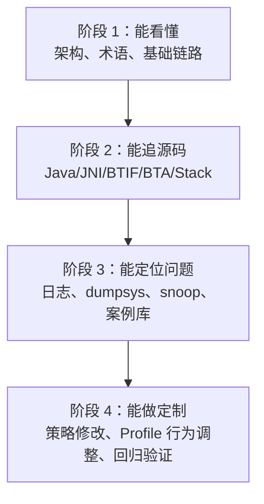

# 96. 成长路线与实战任务：从小白到蓝牙 Framework 定制专家

## 1. 定位

这套资料已经覆盖源码入口、调用链、Profile 专题、C++ 补课、故障排查和案例库。本章把它整理成一条“可执行成长路线”，目标是让 Android Framework 与 C++ 基础薄弱的开发者，逐步具备蓝牙 Framework 定制和车载问题定位能力。

## 2. 四阶段成长路线

| 阶段 | 能力目标 | 必读章节 | 产出物 |
| --- | --- | --- | --- |
| 阶段 1 | 知道 Android 蓝牙分层和常见车载场景 | `00`、`02`、`98` | 画出开关/扫描/配对总图 |
| 阶段 2 | 能从 Java 追到 JNI 和 Native | `03`、`04`、`09` | 写出 A2DP/HFP/GATT 三条调用链 |
| 阶段 3 | 能按现象定位问题 | `05`、`06`、`07`、`10`、`97` | 完成 3 张问题案例卡 |
| 阶段 4 | 能做定制和回归 | `08`、`99`、源码索引 | 提交 1 个小改动设计文档 |

## 3. 阶段 1：看懂架构

学习任务：

1. 读 `00-总览.md`，画出 App -> Framework -> JNI -> BTIF -> BTA -> Stack -> Controller 分层图。
2. 读 `02-基础功能链路.md`，追一遍扫描和配对。
3. 读 `98-术语表与阅读路线.md`，整理自己的术语表。

验收标准：

- 能解释 `BluetoothAdapter`、`BluetoothDevice`、`AdapterService`、`BondStateMachine` 的关系。
- 能说清 Classic discovery 和 BLE scan 不是同一条链路。
- 能说清配对成功不等于 Profile 已连接。

实战任务：

- 用 `rg -n "startDiscovery\\("` 找扫描入口，写出至少 5 个路径/函数。
- 用 `rg -n "createBond|BondStateMachine|btif_dm_create_bond"` 写出配对链路。

## 4. 阶段 2：能追源码

学习任务：

1. 读 `03-JNI桥接与回调.md`，掌握 native 注册和 callback。
2. 读 `04-Native协议栈入门.md`，掌握 BTIF/BTA/Stack 的边界。
3. 读 `09-C++源码阅读补课.md`，补齐 `std::move`、智能指针、线程投递、接口表。

验收标准：

- 能解释 `JNINativeMethod` 三个字段。
- 能从 `NativeInterface` 找到 `android/app/jni` 中的 native 实现。
- 能看到 `do_in_main_thread(...)` 后继续追目标函数。
- 能读懂接口表，例如 `btgattClientInterface`。

实战任务：

- 写出 A2DP connect 的 Java -> JNI -> BTIF 路线。
- 写出 HFP `connectAudio()` 到 Native 的路线。
- 写出 GATT `writeCharacteristic()` 到 `GATTC_Write()` 的路线。

## 5. 阶段 3：能定位问题

学习任务：

1. 读 `05-蓝牙音乐A2DP_AVRCP.md`，掌握“已连接但无声”的分层定位。
2. 读 `06-蓝牙电话HFP.md`，掌握 HFP SLC 与 SCO 的区别。
3. 读 `07-BLE_GATT与AIoT.md`，掌握 scan、connect、discover、read/write、notify、MTU。
4. 读 `10-故障排查手册.md` 和 `97-真实案例库.md`，按现象建立案例卡。

验收标准：

- 能把一个现象归到具体 Profile。
- 能区分 Java、JNI、BTIF/BTA/Stack、Controller、手机端、外部协议的责任边界。
- 能写出最小复现步骤和证据链。

实战任务：

- 用 `问题排查记录模板.md` 写 1 个 A2DP 无声案例。
- 用 `97-真实案例库.md` 写 1 个 BLE notify 不回案例。
- 用 `源码行号校准清单.md` 校验一条链路的行号。

## 6. 阶段 4：能做定制

学习任务：

1. 读 `08-手机互联.md`，明确厂商方案和蓝牙侧边界。
2. 读 `99-开发调试准备.md`，掌握编译、刷机、日志、snoop。
3. 选择一个小定制点，写设计、风险、验证方案。

适合小白进阶的定制题：

| 定制题 | 涉及模块 | 风险 |
| --- | --- | --- |
| 调整某类设备连接策略 | `AdapterService`、Profile Service | 可能影响自动回连 |
| 增加某类 Profile 日志 | Java Service、JNI、BTIF | 风险低，适合入门 |
| 改 A2DP active device 选择策略 | `ActiveDeviceManager`、`A2dpService` | 影响多设备音频 |
| 调整 BLE OTA 写入节奏 | `GattService`、上层业务 | 影响升级稳定性 |
| 增加 HFP 通话状态诊断日志 | `HeadsetClientService`、JNI、BTIF | 风险低 |

验收标准：

- 任何修改前都能写出影响范围。
- 能设计回归用例。
- 能从 logcat、dumpsys、snoop 证明修改有效。

## 7. 结业项目

选择一个项目完成即可：

### 项目 A：A2DP 无声诊断增强

目标：为 A2DP 无声问题设计一套日志和排查方案。

要求：

- 标出 `A2dpService`、`ActiveDeviceManager`、AVRCP、BTIF AV 的观察点。
- 写出“已连接但无声”的判断树。
- 设计至少 5 条回归用例。

### 项目 B：BLE OTA 稳定性方案

目标：设计 BLE OTA 分包、ack、重试、断点恢复方案。

要求：

- 标出 `GattService.writeCharacteristic()`、`configureMTU()`、notify 相关入口。
- 给出 MTU 247 时的分包策略。
- 给出超时、重试、降速和断点恢复策略。

### 项目 C：HFP 电话无声定位方案

目标：区分 HFP SLC 成功、SCO open 成功和音频路由成功。

要求：

- 标出 `connectAudio()`、`dial()`、`messageFromNative()` 的链路。
- 设计来电、去电、挂断、切换音源的回归用例。
- 给出手机端、车机端、协议栈端的责任边界。

## 8. 专家级能力清单

达到蓝牙 Framework 定制专家水平，至少应满足：

- 能独立读懂一个 Profile 的 Java/JNI/BTIF/BTA/Stack 主链路。
- 能用日志和 snoop 证明问题在哪一层。
- 能设计小范围修改并评估风险。
- 能写出清晰的回归测试方案。
- 能把厂商互联问题拆成蓝牙侧可验证与外部依赖两部分。
- 能指导新人按案例库沉淀问题。

