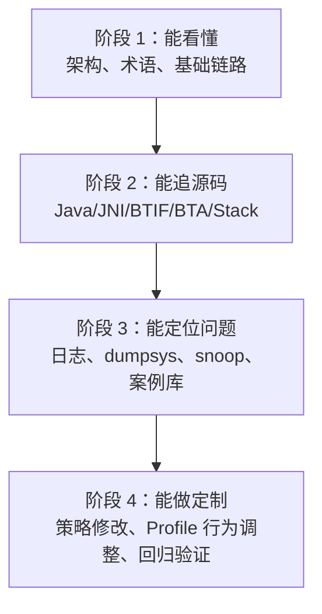
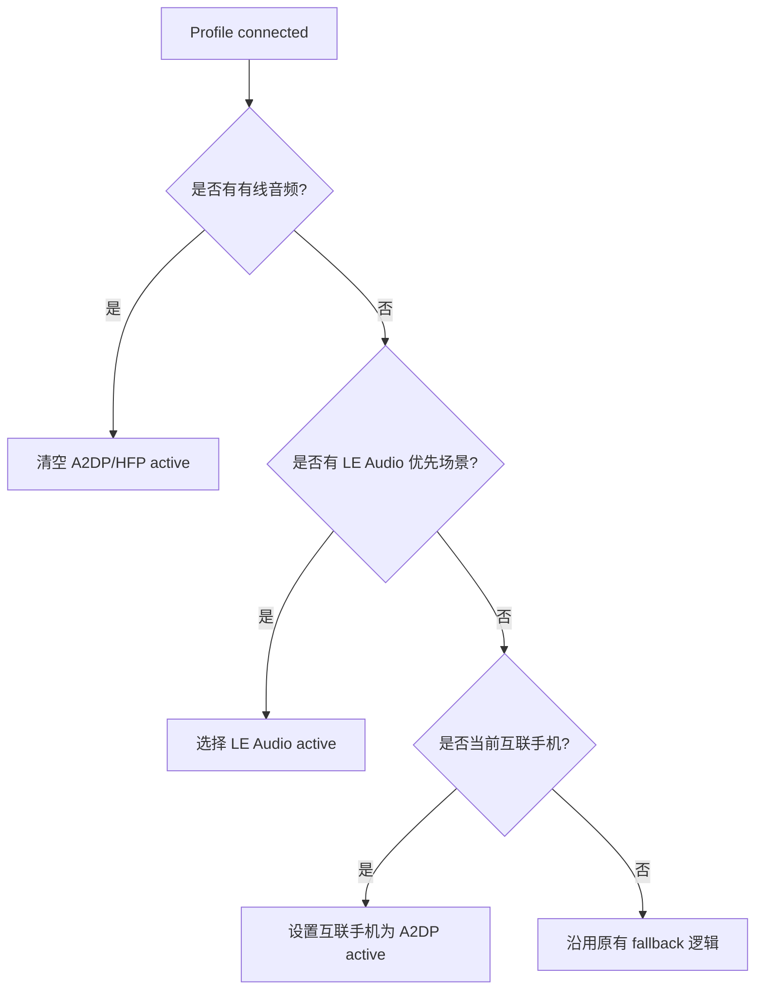
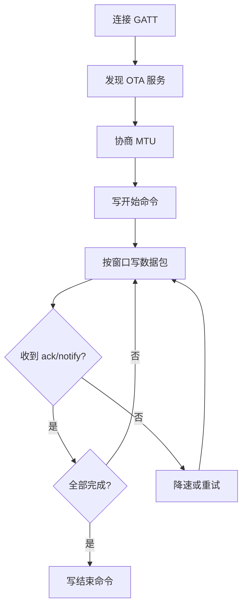
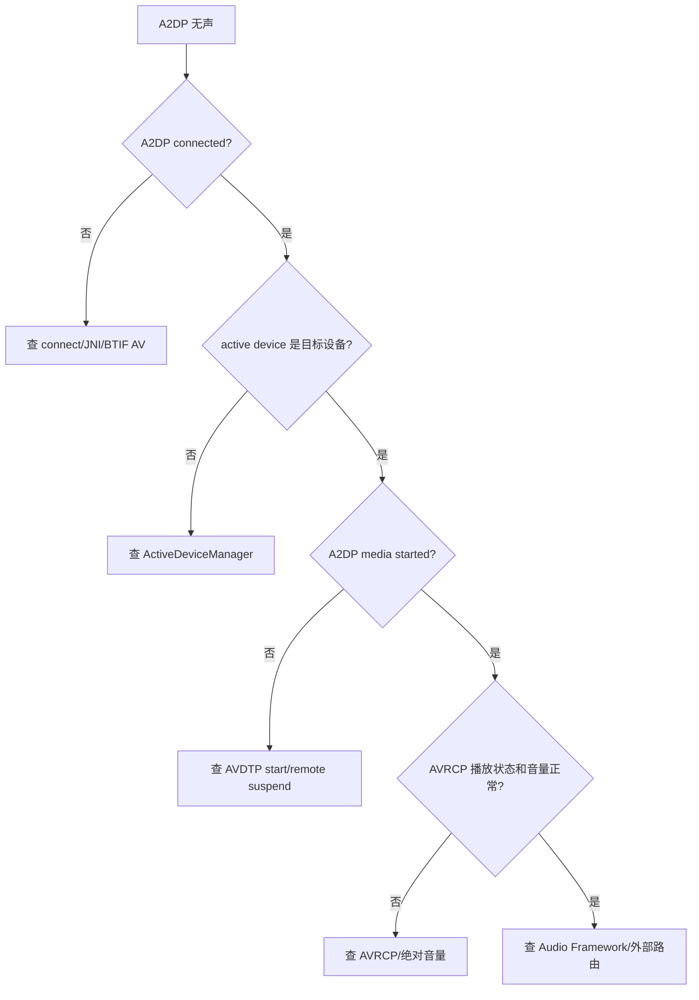
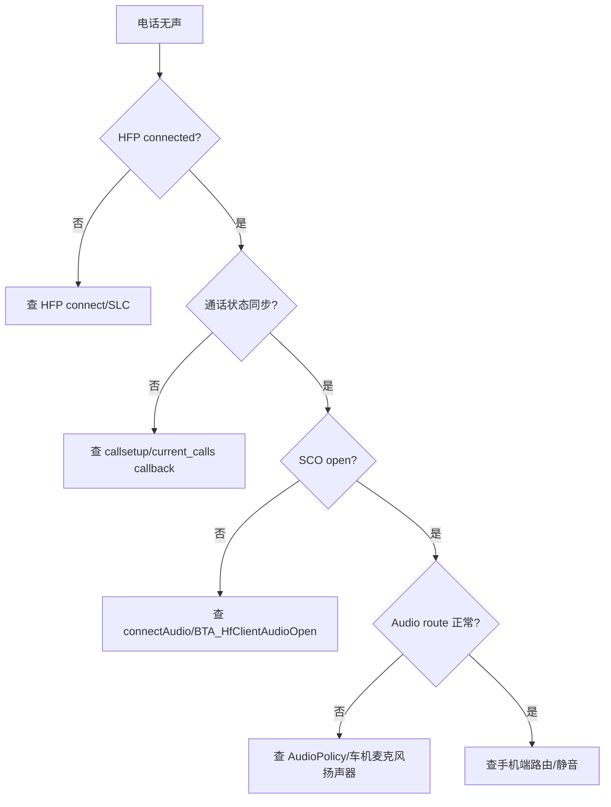

# 96. 成长路线与实战任务：从小白到蓝牙 Framework 定制专家

## 1. 定位

这套资料已经覆盖源码入口、调用链、Profile 专题、C++ 补课、故障排查和案例库。本章把它整理成一条“可执行成长路线”，目标是让 Android Framework 与 C++ 基础薄弱的开发者，逐步具备蓝牙 Framework 定制和车载问题定位能力。

## 2. 四阶段成长路线



| 阶段 | 能力目标 | 必读章节 | 产出物 |
| --- | --- | --- | --- |
| 阶段 1 | 知道 Android 蓝牙分层和常见车载场景 | `00`、`02`、`98` | 画出开关/扫描/配对总图 |
| 阶段 2 | 能从 Java 追到 JNI 和 Native | `03`、`04`、`09` | 写出 A2DP/HFP/GATT 三条调用链 |
| 阶段 3 | 能按现象定位问题 | `05`、`06`、`07`、`10`、`97` | 完成 3 张问题案例卡 |
| 阶段 4 | 能做定制和回归 | `08`、`99`、源码索引 | 提交 1 个小改动设计文档 |

## 3. 阶段 1：看懂架构

学习任务：

1. 读 `00-总览.md`，画出 App -> Framework -> JNI -> BTIF -> BTA -> Stack -> Controller 分层图。
2. 读 `02-基础功能链路.md`，追一遍扫描和配对。
3. 读 `98-术语表与阅读路线.md`，整理自己的术语表。

验收标准：

- 能解释 `BluetoothAdapter`、`BluetoothDevice`、`AdapterService`、`BondStateMachine` 的关系。
- 能说清 Classic discovery 和 BLE scan 不是同一条链路。
- 能说清配对成功不等于 Profile 已连接。

实战任务：

- 用 `rg -n "startDiscovery\\("` 找扫描入口，写出至少 5 个路径/函数。
- 用 `rg -n "createBond|BondStateMachine|btif_dm_create_bond"` 写出配对链路。

## 4. 阶段 2：能追源码

学习任务：

1. 读 `03-JNI桥接与回调.md`，掌握 native 注册和 callback。
2. 读 `04-Native协议栈入门.md`，掌握 BTIF/BTA/Stack 的边界。
3. 读 `09-C++源码阅读补课.md`，补齐 `std::move`、智能指针、线程投递、接口表。

验收标准：

- 能解释 `JNINativeMethod` 三个字段。
- 能从 `NativeInterface` 找到 `android/app/jni` 中的 native 实现。
- 能看到 `do_in_main_thread(...)` 后继续追目标函数。
- 能读懂接口表，例如 `btgattClientInterface`。

实战任务：

- 写出 A2DP connect 的 Java -> JNI -> BTIF 路线。
- 写出 HFP `connectAudio()` 到 Native 的路线。
- 写出 GATT `writeCharacteristic()` 到 `GATTC_Write()` 的路线。

## 5. 阶段 3：能定位问题

学习任务：

1. 读 `05-蓝牙音乐A2DP_AVRCP.md`，掌握“已连接但无声”的分层定位。
2. 读 `06-蓝牙电话HFP.md`，掌握 HFP SLC 与 SCO 的区别。
3. 读 `07-BLE_GATT与AIoT.md`，掌握 scan、connect、discover、read/write、notify、MTU。
4. 读 `10-故障排查手册.md` 和 `97-真实案例库.md`，按现象建立案例卡。

验收标准：

- 能把一个现象归到具体 Profile。
- 能区分 Java、JNI、BTIF/BTA/Stack、Controller、手机端、外部协议的责任边界。
- 能写出最小复现步骤和证据链。

实战任务：

- 用 `问题排查记录模板.md` 写 1 个 A2DP 无声案例。
- 用 `97-真实案例库.md` 写 1 个 BLE notify 不回案例。
- 用 `源码行号校准清单.md` 校验一条链路的行号。

## 6. 阶段 4：能做定制

学习任务：

1. 读 `08-手机互联.md`，明确厂商方案和蓝牙侧边界。
2. 读 `99-开发调试准备.md`，掌握编译、刷机、日志、snoop。
3. 选择一个小定制点，写设计、风险、验证方案。

适合小白进阶的定制题：

| 定制题 | 涉及模块 | 风险 |
| --- | --- | --- |
| 调整某类设备连接策略 | `AdapterService`、Profile Service | 可能影响自动回连 |
| 增加某类 Profile 日志 | Java Service、JNI、BTIF | 风险低，适合入门 |
| 改 A2DP active device 选择策略 | `ActiveDeviceManager`、`A2dpService` | 影响多设备音频 |
| 调整 BLE OTA 写入节奏 | `GattService`、上层业务 | 影响升级稳定性 |
| 增加 HFP 通话状态诊断日志 | `HeadsetClientService`、JNI、BTIF | 风险低 |

验收标准：

- 任何修改前都能写出影响范围。
- 能设计回归用例。
- 能从 logcat、dumpsys、snoop 证明修改有效。

## 7. 结业项目

选择一个项目完成即可：

### 项目 A：A2DP 无声诊断增强

目标：为 A2DP 无声问题设计一套日志和排查方案。

要求：

- 标出 `A2dpService`、`ActiveDeviceManager`、AVRCP、BTIF AV 的观察点。
- 写出“已连接但无声”的判断树。
- 设计至少 5 条回归用例。

### 项目 B：BLE OTA 稳定性方案

目标：设计 BLE OTA 分包、ack、重试、断点恢复方案。

要求：

- 标出 `GattService.writeCharacteristic()`、`configureMTU()`、notify 相关入口。
- 给出 MTU 247 时的分包策略。
- 给出超时、重试、降速和断点恢复策略。

### 项目 C：HFP 电话无声定位方案

目标：区分 HFP SLC 成功、SCO open 成功和音频路由成功。

要求：

- 标出 `connectAudio()`、`dial()`、`messageFromNative()` 的链路。
- 设计来电、去电、挂断、切换音源的回归用例。
- 给出手机端、车机端、协议栈端的责任边界。

## 8. 专家级能力清单

达到蓝牙 Framework 定制专家水平，至少应满足：

- 能独立读懂一个 Profile 的 Java/JNI/BTIF/BTA/Stack 主链路。
- 能用日志和 snoop 证明问题在哪一层。
- 能设计小范围修改并评估风险。
- 能写出清晰的回归测试方案。
- 能把厂商互联问题拆成蓝牙侧可验证与外部依赖两部分。
- 能指导新人按案例库沉淀问题。

## 9. 实战任务设计方案

本节不要求真的改源码，而是把“如果要改，应该改哪里、怎么改、怎么验证”写清楚。真实项目落地前还要结合产品需求、分支策略、测试资源和供应商协议进一步评审。

## 10. 定制题 1：调整某类设备连接策略

目标：例如车机希望某类手机、某类蓝牙外设或某个厂商设备默认允许/禁止自动连接。

涉及文件：

- `android/app/src/com/android/bluetooth/btservice/AdapterService.java`
- `android/app/src/com/android/bluetooth/btservice/BondStateMachine.java`
- `android/app/src/com/android/bluetooth/a2dp/A2dpService.java`
- `android/app/src/com/android/bluetooth/hfpclient/HeadsetClientService.java`
- `android/app/src/com/android/bluetooth/le_audio/LeAudioService.java`

核心思路：

1. 先确认设备分类依据：地址前缀、设备名称、UUID、Class of Device、厂商私有字段，还是项目配置表。
2. 配对完成后，不直接强连所有 Profile，而是按设备类型设置 connection policy。
3. Profile 连接入口仍保留原有策略检查，避免绕过系统权限和状态机。
4. 对于车机场景，至少区分手机、耳机、BLE 外设、车载固定外设。

建议改法：

- 在 `AdapterService` 增加一个小的设备分类辅助方法，例如 `getCarBluetoothDeviceCategory(device)`。
- 在配对完成或设备属性更新后，根据分类设置 A2DP/HFP/PBAP/MAP/GATT 相关策略。
- 在 `A2dpService.connect()`、`HeadsetClientService.connect()` 现有策略检查附近增加日志，不建议一开始就强行修改连接状态机。

伪代码示意：

```java
// AdapterService.java 附近新增辅助逻辑，实际实现需结合项目配置
private int getCarDeviceCategory(BluetoothDevice device) {
    ParcelUuid[] uuids = getRemoteUuids(device);
    if (Utils.arrayContains(uuids, BluetoothUuid.HFP_AG)) {
        return DEVICE_CATEGORY_PHONE;
    }
    if (Utils.arrayContains(uuids, BluetoothUuid.A2DP_SINK)) {
        return DEVICE_CATEGORY_MEDIA_PHONE;
    }
    return DEVICE_CATEGORY_UNKNOWN;
}
```

验证方案：

- 首次配对后检查 bond 状态和各 Profile connection policy。
- 重启蓝牙后检查是否自动回连。
- 双手机场景验证不会抢占错误设备。
- 删除配对后确认策略被清理。

风险：

- 自动连接策略改错会导致手机频繁抢连。
- 多设备 active device 切换可能受影响。
- 厂商手机 UUID 暴露不稳定，不能只依赖单一字段。

## 11. 定制题 2：增加 Profile 诊断日志

目标：在不改变行为的前提下，让现场问题更容易定位。适合初学者做第一类改动。

涉及文件：

- `android/app/src/com/android/bluetooth/a2dp/A2dpService.java`
- `android/app/src/com/android/bluetooth/hfpclient/HeadsetClientService.java`
- `android/app/src/com/android/bluetooth/gatt/GattService.java`
- `android/app/jni/com_android_bluetooth_a2dp.cpp`
- `android/app/jni/com_android_bluetooth_hfpclient.cpp`
- `android/app/jni/com_android_bluetooth_gatt.cpp`
- `system/btif/src/btif_av.cc`
- `system/btif/src/btif_hf_client.cc`
- `system/btif/src/btif_gatt_client.cc`

核心思路：

1. 日志要围绕“动作、设备、状态、返回值、原因”五要素。
2. Java 层记录 API 入参和状态机判断。
3. JNI 层记录 native 调用是否进入、接口指针是否为空、返回状态。
4. BTIF 层记录投递和 BTA 调用结果。
5. 不打印隐私敏感数据，例如完整通讯录、短信内容、认证密钥。

建议增加的日志点：

| 场景 | Java 日志 | JNI 日志 | BTIF 日志 |
| --- | --- | --- | --- |
| A2DP 连接 | `A2dpService.connect()` 入参、policy、UUID | `connectA2dpNative()` 返回值 | `btif_av_source_connect()` 状态 |
| HFP 音频 | `connectAudio()` 当前 call/audio state | `connectAudioNative()` 返回值 | `connect_audio` / SCO 状态 |
| GATT 写入 | `writeCharacteristic()` 的 `connId/handle/writeType` | `gattClientWriteCharacteristicNative()` value 长度 | `BTA_GATTC_WriteCharValue` 返回 |

示例日志风格：

```java
Log.i(TAG, "connect(): device=" + device
        + ", policy=" + getConnectionPolicy(device)
        + ", state=" + getConnectionState(device));
```

验证方案：

- 编译后跑一次连接、断开、失败场景。
- 确认日志能串起 Java -> JNI -> BTIF。
- 确认日志不会刷屏，尤其是 GATT 高频写入。

风险：

- 日志太多会影响性能和可读性。
- 地址、号码、联系人等敏感信息要脱敏。
- Native 高频路径不要加过重字符串拼接。

## 12. 定制题 3：改 A2DP active device 选择策略

目标：例如车机希望“当前互联手机优先成为 A2DP active device”，或者“通话手机优先保留 HFP active”。

涉及文件：

- `android/app/src/com/android/bluetooth/btservice/ActiveDeviceManager.java`
- `android/app/src/com/android/bluetooth/a2dp/A2dpService.java`
- `android/app/src/com/android/bluetooth/hfpclient/HeadsetClientService.java`
- `android/app/src/com/android/bluetooth/le_audio/LeAudioService.java`
- `android/app/src/com/android/bluetooth/avrcpcontroller/AvrcpControllerService.java`

核心思路：

1. `ActiveDeviceManager` 是主要修改点，不建议在多个 Profile 各自硬改。
2. 先定义优先级：有线音频、LE Audio、当前互联手机、最近播放手机、最近连接手机。
3. active device 变化必须同时考虑 A2DP、HFP、LE Audio，否则可能音乐正常但电话异常。
4. 每次策略切换都必须有日志，方便现场复盘。

建议改法：

- 在 `ActiveDeviceManager` 中引入一个小的策略判断函数，例如 `shouldPreferCarProjectionDevice(device)`。
- 在处理 profile connection state changed 时，先按原有逻辑收集候选设备，再应用项目优先级。
- 不要直接删除原有 fallback 逻辑，先以条件分支方式包住。

判断树示意：



验证方案：

- 单手机 A2DP 播放。
- 双手机同时连接。
- HFP 通话中连接第二台手机。
- 插入/拔出有线音频。
- LE Audio 与 A2DP 共存。

风险：

- active device 改错会导致无声、抢音、电话路由异常。
- 投屏/互联状态如果来自仓库外，需要清楚接口边界。
- 需要和 Audio Framework 策略一起验证。

## 13. 定制题 4：调整 BLE OTA 写入节奏

目标：降低 OTA busy、丢包、中断概率，提高车载外设升级稳定性。

涉及文件：

- `android/app/src/com/android/bluetooth/gatt/GattService.java`
- `android/app/src/com/android/bluetooth/gatt/GattNativeInterface.java`
- `android/app/jni/com_android_bluetooth_gatt.cpp`
- `system/btif/src/btif_gatt_client.cc`
- 上层 OTA 业务模块，当前仓库可能不包含。

核心思路：

1. 蓝牙栈提供 GATT 读写能力，但 OTA 分包策略通常在业务层。
2. `GattService.writeCharacteristic()` 中的 permit 说明写入已经有串行化约束。
3. 对 `WRITE_TYPE_NO_RESPONSE` 必须自己做窗口、ack、超时和重传。
4. MTU 247 时 ATT payload 常见上限是 244，但仍要以协商结果和外设能力为准。

建议策略：

| 参数 | 建议 |
| --- | --- |
| MTU | 先请求 247，失败则回落 |
| 分包大小 | `min(mtu - 3, 外设最大包长)` |
| 写入类型 | 关键命令用 default，数据包可用 no response |
| 窗口 | 初始 4 到 8 包，根据 ack 和失败率动态调整 |
| 超时 | 单包或窗口超时后重试 |
| 断点 | 外设保存 offset，车机重连后读取 offset |

伪流程：



验证方案：

- 小文件升级。
- 大文件升级。
- 中途断电/断连恢复。
- 低 RSSI 环境。
- 不同 MTU 下升级。

风险：

- 只改蓝牙栈不一定能解决业务层节奏问题。
- 外设固件缓冲区能力不同，不能只按 Android 侧最大吞吐设计。
- OTA 必须有校验和失败恢复，不能只追求速度。

## 14. 定制题 5：增加 HFP 通话状态诊断日志

目标：让“来电不同步、接听无效、挂断无效、通话无声”更容易定位。

涉及文件：

- `android/app/src/com/android/bluetooth/hfpclient/HeadsetClientService.java`
- `android/app/src/com/android/bluetooth/hfpclient/HeadsetClientStateMachine.java`
- `android/app/src/com/android/bluetooth/hfpclient/HeadsetClientNativeInterface.java`
- `android/app/jni/com_android_bluetooth_hfpclient.cpp`
- `system/btif/src/btif_hf_client.cc`

建议日志点：

- `HeadsetClientService.connect()` / `disconnect()`。
- `connectAudio()` / `disconnectAudio()`。
- `dial()`、`acceptCall()`、`rejectCall()`、`terminateCall()`。
- `HeadsetClientStateMachine` 处理 `CONNECT_AUDIO`、`DIAL_NUMBER`、`ACCEPT_CALL`、`TERMINATE_CALL` 的分支。
- Native callback：`current_calls_cb`、`callsetup_cb`、`callheld_cb`。

日志内容建议：

- 设备地址脱敏。
- 当前连接状态。
- 当前 call state。
- 当前 audio state。
- native 返回值。
- 拒绝操作的原因。

验证方案：

- 来电接听。
- 去电拨号。
- 三方通话或保持通话。
- 通话中断开蓝牙。
- 通话中切换音源。

风险：

- 电话号码、联系人名称必须脱敏。
- 通话状态日志过多时要控制级别。

## 15. 结业项目 A 方案：A2DP 无声诊断增强

目标：不是修改播放逻辑，而是做一套完整诊断增强方案。

关键文件：

- `android/app/src/com/android/bluetooth/a2dp/A2dpService.java`
- `android/app/src/com/android/bluetooth/a2dp/A2dpStateMachine.java`
- `android/app/src/com/android/bluetooth/btservice/ActiveDeviceManager.java`
- `android/app/src/com/android/bluetooth/avrcpcontroller/AvrcpControllerService.java`
- `android/app/jni/com_android_bluetooth_a2dp.cpp`
- `system/btif/src/btif_av.cc`

建议改动：

1. 在 `A2dpService.connect()`、`disconnect()`、`setActiveDevice()` 增加关键状态日志。
2. 在 `A2dpStateMachine` 的连接状态和音频状态事件处增加状态迁移日志。
3. 在 `ActiveDeviceManager` 中记录 active device 被谁设置、为什么切换。
4. 在 JNI connect/disconnect 回调处记录 native status。
5. 在 BTIF AV started/suspended/remote suspend 等关键状态点增加低频日志。

判断树：



回归用例：

1. 单手机连接播放。
2. 双手机连接后切换播放。
3. 插入有线音频后再播放。
4. 手机暂停/恢复播放。
5. 调整绝对音量。
6. 远端主动断开后重连。

交付物：

- 日志点清单。
- 判断树。
- 回归用例。
- 一张 `97-真实案例库.md` 格式的 A2DP 无声案例卡。

## 16. 结业项目 B 方案：BLE OTA 稳定性

关键文件：

- `android/app/src/com/android/bluetooth/gatt/GattService.java`
- `android/app/src/com/android/bluetooth/gatt/GattNativeInterface.java`
- `android/app/jni/com_android_bluetooth_gatt.cpp`
- `system/btif/src/btif_gatt_client.cc`
- 上层 OTA 业务模块。

建议设计：

1. 连接后发现 OTA service。
2. 请求 MTU。
3. 写入开始命令。
4. 按窗口发送数据。
5. 等待 notify ack。
6. 超时重试，失败降速。
7. 断点恢复时读取外设 offset。
8. 完成后写结束命令并等待校验。

关键参数：

- MTU：以协商回调为准。
- payload：`mtu - 3`，再与外设能力取最小。
- ack：每包 ack 或窗口 ack，取决于外设协议。
- retry：建议 3 次后降速，连续失败断开重连。
- checksum：每包 CRC + 全包 hash 更稳。

需要避免：

- 不等 `writeCharacteristic()` 回调就无限写。
- MTU 失败后仍按 244 字节分包。
- 只靠 `WRITE_TYPE_NO_RESPONSE` 提速，没有 ack 和恢复。

回归用例：

1. 低 RSSI 升级。
2. 升级中断电。
3. 升级中断开蓝牙。
4. 小 MTU 设备升级。
5. 外设主动重启后续传。

## 17. 结业项目 C 方案：HFP 电话无声定位

关键文件：

- `android/app/src/com/android/bluetooth/hfpclient/HeadsetClientService.java`
- `android/app/src/com/android/bluetooth/hfpclient/HeadsetClientStateMachine.java`
- `android/app/src/com/android/bluetooth/hfpclient/HeadsetClientNativeInterface.java`
- `android/app/jni/com_android_bluetooth_hfpclient.cpp`
- `system/btif/src/btif_hf_client.cc`

定位分层：

| 层级 | 判断问题 |
| --- | --- |
| HFP SLC | Profile 是否 connected |
| Call state | 来电/去电/接听/挂断是否同步 |
| SCO/eSCO | `connectAudio()` 后语音链路是否 open |
| Audio route | 车机麦克风和扬声器是否接到 SCO |
| 手机端 | 手机是否把通话路由给蓝牙 |

建议改动：

1. 在 `connectAudio()` 前后打印 call state 和 audio state。
2. 在 `dial()`、`acceptCall()`、`terminateCall()` 打印状态机是否允许该动作。
3. 在 JNI callback 处记录 callsetup/current calls。
4. 在 BTIF HFP Client 处记录 audio open/close 状态。

判断树：



回归用例：

1. 来电接听。
2. 车机拨号。
3. 手机端拨号后切到车机。
4. 通话中断开/重连蓝牙。
5. 通话中切换 A2DP 播放。
6. 通话中插入有线音频。

## 18. 设计文档模板

做任何蓝牙 Framework 定制前，先写这个模板：

```md
# 定制标题

## 1. 背景

## 2. 目标

## 3. 非目标

## 4. 涉及文件

## 5. 当前源码链路

## 6. 修改方案

## 7. 风险评估

## 8. 日志与可观测性

## 9. 回归用例

## 10. 回滚方案
```

## 19. 实战任务参考答案

本节给出“够交作业、够指导新人继续追源码”的参考答案。真实项目中还要用当前分支源码重新校准行号，并结合设备日志补证据。

### 19.1 阶段 1 参考答案：扫描入口

`startDiscovery()` 是经典蓝牙 discovery 入口，不是 BLE scan。参考链路：

1. App 调用 `framework/java/android/bluetooth/BluetoothAdapter.java` 的 `startDiscovery()`。
2. Framework 通过 `IBluetooth` Binder 进入蓝牙进程。
3. 蓝牙进程入口在 `android/app/src/com/android/bluetooth/btservice/AdapterService.java`。
4. Binder 权限和调用方检查通常在 `AdapterService` 内部 Binder 实现附近完成。
5. Java 层继续调用 `android/app/src/com/android/bluetooth/btservice/AdapterNativeInterface.java`。
6. JNI 进入 `android/app/jni/com_android_bluetooth_btservice_AdapterService.cpp`。
7. Native 侧再进入 `system/btif/src/btif_dm.cc`、BTA DM search/inquiry、BTM inquiry。
8. 设备发现后经 native callback 回到 `RemoteDevices`，再发 `BluetoothDevice.ACTION_FOUND`。

最小结论：

- Classic discovery 主要用于 BR/EDR 设备发现。
- 开始连接 Profile 前通常要取消 discovery，因为 inquiry 会影响连接速度和成功率。
- 搜不到设备时要同时看 scan mode、权限、inquiry 是否发出、远端是否 discoverable。

### 19.2 阶段 1 参考答案：配对链路

`createBond()` 参考链路：

1. App 调用 `BluetoothDevice.createBond()`。
2. Framework 通过 Binder 进入 `AdapterService`。
3. `AdapterService` 检查权限、设备地址、当前 adapter 状态。
4. 请求进入 `BondStateMachine`，状态从未绑定走向 bonding。
5. Java 调用 `AdapterNativeInterface.createBond()`。
6. JNI 进入 `com_android_bluetooth_btservice_AdapterService.cpp`。
7. Native 到 `system/btif/src/btif_dm.cc` 的 bond/create bond 逻辑。
8. BR/EDR 走 SSP/PIN，BLE 走 SMP。
9. bond 状态通过 native callback 回到 Java，最终广播 `ACTION_BOND_STATE_CHANGED`。

最小结论：

- 配对成功只代表密钥建立或保存成功，不代表 A2DP/HFP/GATT 已连接。
- 配对失败必须看失败原因和 SMP/SSP 失败码，不能只看 Java 层 `BOND_NONE`。

### 19.3 阶段 2 参考答案：A2DP Connect

参考链路：

1. App/Profile 客户端调用 A2DP connect API。
2. Binder 进入 `android/app/src/com/android/bluetooth/a2dp/A2dpService.java`。
3. `A2dpService.connect()` 检查 adapter 状态、设备合法性、connection policy、quiet mode 等。
4. 请求投递到 `A2dpStateMachine`。
5. Java 调用 `A2dpNativeInterface.connectA2dp()`。
6. JNI 进入 `android/app/jni/com_android_bluetooth_a2dp.cpp`。
7. Native 调用 A2DP profile interface。
8. BTIF 进入 `system/btif/src/btif_av.cc`。
9. 继续到 BTA AV、AVDTP、L2CAP，最终通过 HCI 与远端建立媒体通道。

检查点：

- Java 是否因为 policy/bond/quiet mode 拒绝。
- JNI native interface 是否为空。
- BTIF 是否真正发起 connect。
- HCI snoop 是否出现 AVDTP/L2CAP 交互。

### 19.4 阶段 2 参考答案：HFP `connectAudio()`

参考链路：

1. 上层调用 HFP Client 的 `connectAudio()`。
2. Binder 进入 `HeadsetClientService`。
3. 服务检查当前 device、连接状态、是否允许打开 audio。
4. 请求进入 `HeadsetClientStateMachine`。
5. 调用 `HeadsetClientNativeInterface.connectAudio()`。
6. JNI 进入 `android/app/jni/com_android_bluetooth_hfpclient.cpp`。
7. Native 到 `system/btif/src/btif_hf_client.cc`。
8. BTIF/BTA 打开 SCO/eSCO。
9. native callback 回到 `messageFromNative()`，Java 更新 audio state。

检查点：

- HFP connected 不等于 SCO 已 open。
- SCO open 不等于 AudioPolicy 已正确路由。
- 电话无声要同时看 call state、audio state、SCO 和 Audio route。

### 19.5 阶段 2 参考答案：GATT `writeCharacteristic()`

参考链路：

1. App 调用 `BluetoothGatt.writeCharacteristic()`。
2. Framework 通过 `IBluetoothGatt` Binder 进入蓝牙进程。
3. `GattService.writeCharacteristic()` 检查权限、clientIf、连接、handle、busy/permit。
4. Java 调用 `GattNativeInterface.gattClientWriteCharacteristicNative()`。
5. JNI 进入 `android/app/jni/com_android_bluetooth_gatt.cpp`。
6. Native 到 `system/btif/src/btif_gatt_client.cc`。
7. BTIF 调用 BTA GATTC 写入，协议层转成 ATT Write Request/Command。
8. 远端响应后 native callback 回到 Java，再分发到 App callback。

检查点：

- `WRITE_TYPE_DEFAULT` 要等 response。
- `WRITE_TYPE_NO_RESPONSE` 吞吐高，但业务层必须设计 ack/窗口/重试。
- OTA 卡顿常见原因是 MTU、busy、窗口过大或外设缓冲区不足。

### 19.6 阶段 3 参考答案：A2DP 无声案例

案例结论示例：

- 现象：手机显示蓝牙音乐已连接，车机无声。
- 归属 Profile：A2DP/AVRCP/Audio route。
- 关键证据：`A2dpService` 显示 connected；`ActiveDeviceManager` 中 active device 不是目标手机；AVRCP 播放状态正常；HCI 有 AVDTP 连接但 Audio route 未切到目标设备。
- 根因层级：Framework active device 策略或 Audio route，不是配对问题。
- 建议修复：在 `ActiveDeviceManager` 增加切换原因日志，核对多手机场景 active device 选择规则。
- 回归：单手机、双手机、播放中切换、插拔有线音频、重启蓝牙后播放。

### 19.7 阶段 3 参考答案：BLE Notify 不回案例

案例结论示例：

- 现象：车载 BLE 外设写入成功，但 App 收不到 notify。
- 归属模块：GATT Client。
- 关键证据：`GattService` 已连接并完成 service discovery；write 有 callback；HCI snoop 中没有 Handle Value Notification；或者有 notification 但 Java 无 callback。
- 分支判断：如果 HCI 没有 notification，查 CCCD 是否写成功、外设是否发送；如果 HCI 有 notification，查 handle 映射、client callback、权限和 Binder 死亡。
- 建议修复：业务层写 CCCD 后等待成功回调，再开始业务写入；增加 connId、handle、cccd state 日志。
- 回归：重连后 notify、低 RSSI、MTU 变化、后台 App、外设重启。

### 19.8 阶段 3 参考答案：行号校准

推荐做法：

1. 用 `rg -n "writeCharacteristic\\(" android framework` 找 Java/Framework 入口。
2. 用 `rg -n "gattClientWriteCharacteristicNative|WriteChar" android system` 找 JNI/Native 入口。
3. 把命中的文件、函数名、当前行号写入 `源码行号校准清单.md`。
4. 文档正文优先写稳定路径和函数名，行号只作为当前版本参考。

### 19.9 阶段 4 参考答案：小改动设计

推荐选择“增加 Profile 诊断日志”，因为风险最低。

设计摘要：

- 背景：现场 A2DP/HFP/GATT 问题缺少跨层证据。
- 目标：补 Java/JNI/BTIF 低频关键日志和 dumpsys 最近事件。
- 非目标：不改变连接策略、不改状态机行为。
- 涉及文件：目标 Profile 的 `*Service.java`、`*NativeInterface.java`、对应 JNI、对应 `btif_*.cc`。
- 修改方案：入口记录参数，拒绝分支记录 reason，native 记录返回值，callback 记录状态变化。
- 风险：日志刷屏、隐私泄露、native 高频路径性能。
- 验证：正常连接、失败连接、断开、重连、bugreport 中可看到证据。
- 回滚：删除新增日志和 dumpsys 字段，不影响行为。

## 20. 结业项目参考答案

### 20.1 项目 A：A2DP 无声诊断增强

合格答案应包含：

- 观察点：`A2dpService.connect()`、`A2dpStateMachine` 状态迁移、`ActiveDeviceManager` active 切换、`AvrcpControllerService` 播放状态、`com_android_bluetooth_a2dp.cpp`、`btif_av.cc`。
- 判断树：先判断 A2DP 是否 connected，再判断 active device，再判断 media started，再判断 AVRCP/音量，最后看 Audio Framework。
- 日志：每次 connect/disconnect/setActiveDevice 输出 device 脱敏值、旧状态、新状态、reason。
- dumpsys：输出当前 active device、最近 10 次 active 切换、最近一次 start/suspend 原因。
- 回归：单手机播放、双手机抢占、暂停恢复、绝对音量、插拔有线音频、远端主动断开。

一句话结论：A2DP 无声不能只查 A2DP connected，要把 active device、media start、AVRCP 状态和 Audio route 串起来。

### 20.2 项目 B：BLE OTA 稳定性方案

合格答案应包含：

- 观察点：`GattService.writeCharacteristic()`、`configureMTU()`、notify callback、`com_android_bluetooth_gatt.cpp`、`btif_gatt_client.cc`。
- 分包：以协商 MTU 为准，payload 使用 `min(mtu - 3, 外设最大包长)`。
- 节奏：`WRITE_TYPE_NO_RESPONSE` 使用窗口控制，窗口初始 4 到 8 包；收到 ack 后推进。
- 重试：超时重试 3 次，连续失败降速或断开重连。
- 断点：外设保存 offset，车机重连后读取 offset 再续传。
- 校验：每包 CRC 加整包 hash，结束命令后等待外设校验结果。
- 回归：低 RSSI、小 MTU、中途断连、外设重启、大文件、重复升级。

一句话结论：OTA 稳定性主要是业务协议和节奏控制，蓝牙栈只提供 GATT 通道，不能用无限写入替代可靠传输设计。

### 20.3 项目 C：HFP 电话无声定位

合格答案应包含：

- 观察点：`HeadsetClientService.connectAudio()`、`dial()`、`acceptCall()`、`terminateCall()`、`HeadsetClientStateMachine.messageFromNative()`、`com_android_bluetooth_hfpclient.cpp`、`btif_hf_client.cc`。
- 分层：先看 HFP SLC connected，再看 call state，再看 SCO/eSCO，再看 Audio route，最后看手机端路由。
- 日志：操作动作、call state、audio state、native status、拒绝原因、设备地址脱敏值。
- dumpsys：输出当前连接设备、通话状态、audio state、最近 audio open/close 记录。
- 回归：来电接听、车机拨号、手机拨号切车机、挂断、通话中断开重连、通话中切音源。

一句话结论：HFP connected 只说明控制链路成功，电话有声还必须同时满足通话状态同步、SCO 建立和 Audio route 正确。
