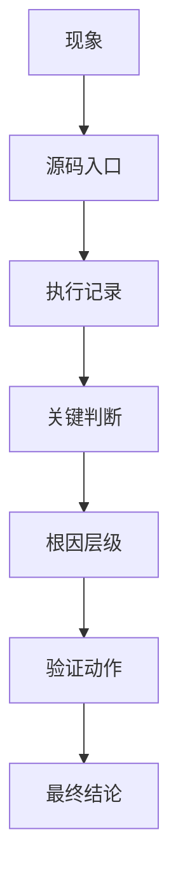

# 97. 真实案例库：源码锚定的典型问题

## 1. 使用方式

这个文档是“案例卡仓库”。每个案例先给出源码锚点、判断逻辑和验证方法，后续拿到真实日志后，再把日志证据、时间线和最终结论补进对应卡片。

统一格式：



## 2. 案例卡模板

复制下面模板创建新案例：

```md
## 案例 X：标题

现象：

适用范围：

源码入口：

- `path/to/file.java`
- `path/to/file.cpp`

执行记录：

| 时间 | 动作 | 观察 |
| --- | --- | --- |
|  |  |  |

关键判断：

- 
- 

日志证据：

```text
```

根因层级：

- [ ] Java/Framework
- [ ] JNI
- [ ] BTIF/BTA/Stack
- [ ] Controller/Firmware
- [ ] 手机端
- [ ] 外部 App / 厂商协议
- [ ] 暂未确认

验证动作：

最终结论：

回归结果：
```

## 3. 案例 1：BLE 扫描无结果

现象：

- 扫描接口返回成功，但没有任何设备结果。

适用范围：

- BLE 外设发现、低功耗设备配网、车载传感器发现。

源码入口：

- `android/app/src/com/android/bluetooth/le_scan/ScanController.java`
- `android/app/src/com/android/bluetooth/le_scan/ScanManager.java`
- `android/app/src/com/android/bluetooth/le_scan/ScanNativeInterface.java`
- `android/app/jni/com_android_bluetooth_scan.cpp`
- `system/stack/btm/btm_ble_scanner.cc`

执行记录：

| 时间 | 动作 | 观察 |
| --- | --- | --- |
| 复现开始 | 调用 BLE scan | Java 接口返回成功 |
| 扫描注册 | 观察 `onScannerRegistered(...)` | 注册成功或失败 |
| 扫描执行 | 看 `startRegularScan()` / `startBatchScan()` | 是否真正进入 native |
| HCI 观察 | 看 snoop/日志 | 是否有 advertising report |

关键判断：

- `ScanController.startScan(...)` 是否真正下发到 `ScanManager`。
- `ScanNativeInterface.onScannerRegistered(...)` 是否返回成功的 scannerId。
- HCI snoop 是否真的看到广告包。

日志证据：

```text
在这里填 `ScanController`、`ScanManager`、`ScanNativeInterface`、`com_android_bluetooth_scan.cpp` 的关键 logcat。
```

常见根因：

- filter 太窄。
- 外设广播地址类型变化。
- 系统扫描节流或后台限制。
- controller 没有上报 advertising report。

验证动作：

1. 先去掉大部分 filter。
2. 用一台已知稳定广播的 BLE 设备对照。
3. 同时抓 logcat 和 HCI snoop。

根因层级：

- [ ] Java/Framework
- [ ] JNI
- [ ] BTIF/BTA/Stack
- [ ] Controller/Firmware
- [ ] 手机端
- [ ] 外部 App / 厂商协议
- [x] 暂未确认

## 4. 案例 2：GATT 连接成功但服务发现为空

现象：

- `clientConnect()` 看似成功，服务列表为空或只有部分服务。

适用范围：

- BLE 外设读写、配置、认证、OTA 前置服务发现。

源码入口：

- `android/app/src/com/android/bluetooth/gatt/GattService.java`
- `android/app/src/com/android/bluetooth/gatt/GattNativeInterface.java`
- `android/app/jni/com_android_bluetooth_gatt.cpp`
- `system/btif/src/btif_gatt_client.cc`
- `system/bta/gatt/bta_gattc_api.cc`
- `system/stack/gatt/gatt_api.cc`

执行记录：

| 时间 | 动作 | 观察 |
| --- | --- | --- |
| 建链 | `clientConnect()` | `connId` 是否有效 |
| 发现 | `discoverServices()` | 全量还是 UUID 搜索 |
| 回调 | 服务发现回 Java | 列表是否为空 |
| 二次验证 | 延后后再发现 | 外设服务是否出现 |

关键判断：

- `connId` 是否有效。
- 发现请求是否过早。
- 外设是否要求先认证或先写入某个配置值。

日志证据：

```text
在这里贴 `discoverServices()`、`gattClientSearchServiceNative()`、`BTA_GATTC_ServiceSearch*()` 的日志。
```

常见根因：

- UUID 过滤错误。
- 外设服务表未准备好。
- 连接建立太早就发起发现。

验证动作：

1. 改成全量服务发现。
2. 延后发现时机。
3. 观察外设是否先要求认证或配对后才开放服务。

根因层级：

- [ ] Java/Framework
- [ ] JNI
- [ ] BTIF/BTA/Stack
- [ ] Controller/Firmware
- [ ] 手机端
- [ ] 外部 App / 厂商协议
- [x] 暂未确认

## 5. 案例 3：A2DP 已连接但无声

现象：

- 设备连接成功，媒体状态也有变化，但车机扬声器无声。

适用范围：

- 车机播放手机音乐、音频路由切换、绝对音量不同步。

源码入口：

- `android/app/src/com/android/bluetooth/a2dp/A2dpService.java`
- `android/app/src/com/android/bluetooth/btservice/ActiveDeviceManager.java`
- `android/app/src/com/android/bluetooth/avrcpcontroller/AvrcpControllerService.java`
- `android/app/src/com/android/bluetooth/avrcp/AvrcpTargetService.java`
- `android/app/jni/com_android_bluetooth_a2dp.cpp`
- `system/btif/src/btif_av.cc`

执行记录：

| 时间 | 动作 | 观察 |
| --- | --- | --- |
| 建链 | A2DP connect | 是否 connected |
| 切活跃设备 | `setActiveDevice()` | 是否切到当前手机 |
| 播放 | 播放音乐 | 是否进入 started |
| 音量 | 调整音量 | AVRCP 是否同步 |

关键判断：

- active device 是否是当前手机。
- 媒体状态是否 started。
- 是否被其他音频设备抢占 active。

日志证据：

```text
贴 `A2dpService`、`ActiveDeviceManager`、`AvrcpControllerService`、`btif_av.cc` 的关键日志。
```

常见根因：

- active device 切换失败。
- codec 协商异常。
- 音频焦点或路由在外部系统。

验证动作：

1. 断开其他音频设备。
2. 查 `ActiveDeviceManager` 日志。
3. 对比播放前后 A2DP 与 AVRCP 状态。

根因层级：

- [ ] Java/Framework
- [ ] JNI
- [ ] BTIF/BTA/Stack
- [ ] Controller/Firmware
- [ ] 手机端
- [ ] 外部 App / 厂商协议
- [x] 暂未确认

## 6. 案例 4：HFP 可连但电话无声

现象：

- 电话显示已连接，拨号成功，但听不到对方声音或对方听不到车机。

适用范围：

- 车机电话、SCO/eSCO、来电/去电、接听/挂断。

源码入口：

- `android/app/src/com/android/bluetooth/hfpclient/HeadsetClientService.java`
- `android/app/src/com/android/bluetooth/hfpclient/HeadsetClientNativeInterface.java`
- `android/app/jni/com_android_bluetooth_hfpclient.cpp`
- `system/btif/src/btif_hf_client.cc`

执行记录：

| 时间 | 动作 | 观察 |
| --- | --- | --- |
| 建链 | HFP connect | SLC 是否建立 |
| 开音频 | `connectAudio()` | SCO 是否 open |
| 拨号/接听 | `dial()` / `acceptCall()` | 状态机是否允许 |
| 语音验证 | 通话中说话 | 双向音频是否正常 |

关键判断：

- `connectAudio()` 是否成功。
- SCO 是否真正建立。
- 来电/去电状态是否同步。

日志证据：

```text
贴 `HeadsetClientService`、`HeadsetClientStateMachine`、`btif_hf_client.cc` 的音频与通话状态日志。
```

常见根因：

- SCO 没建立。
- 手机端通话权限或路由限制。
- 车机 active device 被其他音频设备切走。

验证动作：

1. 分别测试 connect、connectAudio、dial 三个动作。
2. 观察 SCO 建链日志。
3. 排除蓝牙音频和有线音频冲突。

根因层级：

- [ ] Java/Framework
- [ ] JNI
- [ ] BTIF/BTA/Stack
- [ ] Controller/Firmware
- [ ] 手机端
- [ ] 外部 App / 厂商协议
- [x] 暂未确认

## 7. 案例 5：OTA 写入频繁 busy

现象：

- BLE OTA 分包写入过程中频繁失败、busy 或卡顿。

适用范围：

- 固件升级、分包写入、notify ack、断点续传。

源码入口：

- `android/app/src/com/android/bluetooth/gatt/GattService.java`
- `android/app/src/com/android/bluetooth/gatt/GattNativeInterface.java`
- `android/app/jni/com_android_bluetooth_gatt.cpp`
- `system/stack/gatt/gatt_api.cc`

执行记录：

| 时间 | 动作 | 观察 |
| --- | --- | --- |
| 协商 | `configureMTU()` | MTU 是否生效 |
| 开写 | `writeCharacteristic()` | permit 是否拿到 |
| ack | notify/indicate | 是否收到应答 |
| 恢复 | 断点重发 | 是否能继续 |

关键判断：

- `writeCharacteristic()` 的 permit 是否拿到。
- MTU 是否已经协商。
- 写入类型是 `WRITE_TYPE_DEFAULT` 还是 `WRITE_TYPE_NO_RESPONSE`。

日志证据：

```text
贴 `configureMTU()`、`writeCharacteristic()`、notify 回调和外设应答日志。
```

常见根因：

- 分包过快。
- 上层没等回调。
- 外设缓冲区太小。

验证动作：

1. 降低发送速率。
2. 确认 MTU。
3. 增加超时和重试。

根因层级：

- [ ] Java/Framework
- [ ] JNI
- [ ] BTIF/BTA/Stack
- [ ] Controller/Firmware
- [ ] 手机端
- [ ] 外部 App / 厂商协议
- [x] 暂未确认

## 8. 案例 6：联系人不同步

现象：

- 手机互联已连上，但联系人或通话记录没有同步。

适用范围：

- PBAP、MAP、OBEX、联系人/消息同步。

源码入口：

- `android/app/src/com/android/bluetooth/pbapclient/PbapClientService.java`
- `android/app/src/com/android/bluetooth/pbapclient/obex/PbapClientObexClient.java`
- `android/app/src/com/android/bluetooth/mapclient/MapClientService.java`
- `android/app/src/com/android/bluetooth/mapclient/MasClient.java`

执行记录：

| 时间 | 动作 | 观察 |
| --- | --- | --- |
| 连接 | PBAP/MAP connect | socket 是否成功 |
| 授权 | 手机弹窗 | 是否允许通讯录/消息 |
| 拉取 | 拉联系人/短信 | 是否有条目返回 |
| 复测 | 重新连接 | 是否恢复 |

关键判断：

- OBEX socket 是否建立。
- 手机端是否授权联系人/消息访问。
- SDP/端口信息是否正确。

日志证据：

```text
贴 PBAP/MAP connect、socket、OBEX session 和手机授权相关日志。
```

常见根因：

- 手机隐私授权拒绝。
- OBEX session 建链失败。
- 对端服务能力不完整。

验证动作：

1. 先验证 PBAP 再验证 MAP。
2. 看 socket / OBEX 连接日志。
3. 确认手机端权限弹窗状态。

根因层级：

- [ ] Java/Framework
- [ ] JNI
- [ ] BTIF/BTA/Stack
- [ ] Controller/Firmware
- [ ] 手机端
- [ ] 外部 App / 厂商协议
- [x] 暂未确认

## 9. 真实日志写法

当你真的拿到日志时，建议按下面顺序写进案例卡：

1. 现象描述，最好只写一句话。
2. 复现步骤，尽量可重复。
3. 关键时间点，最好精确到秒。
4. logcat 摘录，优先保留蓝牙相关 tag。
5. dumpsys 结果，保留状态、设备和 active device。
6. HCI snoop 结果，保留最能说明问题的包。
7. 最终结论，写清是 Java、JNI、BTIF/BTA/Stack、Controller、手机端还是外部协议。
8. 回归结果，写修复后是否稳定。

## 10. 新增规则

以后新增案例时，必须补齐：

- 现象。
- 适用范围。
- 源码入口。
- 执行记录。
- 关键判断。
- 日志证据。
- 根因层级。
- 验证动作。
- 最终结论。

