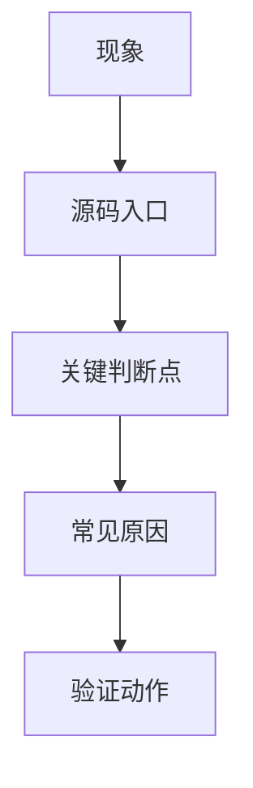

# 97. 真实案例库首版：源码锚定的典型问题

## 1. 使用方式

这不是最终的真实日志库，而是“先按源码把典型案例的骨架立住”。后续拿到现场日志后，直接往对应条目里补 `logcat`、`dumpsys`、`snoop` 和结论即可。

每个案例都按同一格式记录：

## 2. 案例 1：BLE 扫描无结果

现象：

- 扫描接口返回成功，但没有任何设备结果。

源码入口：

- `android/app/src/com/android/bluetooth/le_scan/ScanController.java`
- `android/app/src/com/android/bluetooth/le_scan/ScanManager.java`
- `android/app/src/com/android/bluetooth/le_scan/ScanNativeInterface.java`
- `android/app/jni/com_android_bluetooth_scan.cpp`
- `system/stack/btm/btm_ble_scanner.cc`

关键判断点：

- `startScan()` 是否真的进入 `startRegularScan()` 或 `startBatchScan()`。
- `onScannerRegistered(...)` 是否成功。
- HCI snoop 是否出现 LE Advertising Report。

常见原因：

- filter 太窄。
- 外设广播地址类型变化。
- 系统扫描节流。
- controller 能力不足或未启用 offload。

验证动作：

- 先去掉大部分 filter。
- 观察 `adb logcat` 和 snoop。
- 直接用已知可广播设备做对照。

## 3. 案例 2：GATT 连接成功但服务发现为空

现象：

- `clientConnect()` 看似成功，服务列表为空或只有部分服务。

源码入口：

- `android/app/src/com/android/bluetooth/gatt/GattService.java`
- `android/app/src/com/android/bluetooth/gatt/GattNativeInterface.java`
- `android/app/jni/com_android_bluetooth_gatt.cpp`
- `system/btif/src/btif_gatt_client.cc`
- `system/bta/gatt/bta_gattc_api.cc`
- `system/stack/gatt/gatt_api.cc`

关键判断点：

- `connId` 是否有效。
- `discoverServices()` 调用的是全量搜索还是 UUID 搜索。
- 外设是否在连接后才暴露目标 service。

常见原因：

- UUID 过滤错误。
- 外设服务表没准备好。
- 连接刚建立就发起发现，节奏太快。

验证动作：

- 改为全量服务发现。
- 延后发现时机。
- 查看外设侧是否要求先认证或先写入配置。

## 4. 案例 3：A2DP 已连接但无声

现象：

- 设备连接成功，媒体状态也有变化，但车机扬声器无声。

源码入口：

- `android/app/src/com/android/bluetooth/a2dp/A2dpService.java`
- `android/app/src/com/android/bluetooth/btservice/ActiveDeviceManager.java`
- `android/app/src/com/android/bluetooth/avrcpcontroller/AvrcpControllerService.java`
- `android/app/src/com/android/bluetooth/avrcp/AvrcpTargetService.java`
- `android/app/jni/com_android_bluetooth_a2dp.cpp`
- `system/btif/src/btif_av.cc`

关键判断点：

- `setActiveDevice()` 是否真的切到目标设备。
- 媒体状态是否已 started。
- 是否被其他音频设备抢占 active。

常见原因：

- active device 切换失败。
- codec 协商异常。
- 音频焦点或路由在外部系统。

验证动作：

- 先断开其他音频设备。
- 查 `ActiveDeviceManager` 日志。
- 观察 AVRCP 媒体状态变化。

## 5. 案例 4：HFP 可连但电话无声

现象：

- 电话显示已连接，拨号成功，但听不到对方声音或对方听不到车机。

源码入口：

- `android/app/src/com/android/bluetooth/hfpclient/HeadsetClientService.java`
- `android/app/src/com/android/bluetooth/hfpclient/HeadsetClientNativeInterface.java`
- `android/app/jni/com_android_bluetooth_hfpclient.cpp`
- `system/btif/src/btif_hf_client.cc`

关键判断点：

- `connectAudio()` 是否成功。
- SCO 是否真正建立。
- 来电/去电状态是否同步。

常见原因：

- SCO 没建立。
- 手机端通话权限或路由限制。
- 车机 active device 被其他音频设备切走。

验证动作：

- 分别测试 connect、connectAudio、dial 三个动作。
- 观察 SCO 建链日志。
- 排除蓝牙音频和有线音频冲突。

## 6. 案例 5：OTA 写入频繁 busy

现象：

- BLE OTA 分包写入过程中频繁失败、busy 或卡顿。

源码入口：

- `android/app/src/com/android/bluetooth/gatt/GattService.java`
- `android/app/src/com/android/bluetooth/gatt/GattNativeInterface.java`
- `android/app/jni/com_android_bluetooth_gatt.cpp`
- `system/stack/gatt/gatt_api.cc`

关键判断点：

- `writeCharacteristic()` 的 permit 是否拿到。
- MTU 是否已经协商。
- 写入类型是 `WRITE_TYPE_DEFAULT` 还是 `WRITE_TYPE_NO_RESPONSE`。

常见原因：

- 分包过快。
- 上层没等回调。
- 外设缓冲区太小。

验证动作：

- 降低发送速率。
- 确认 MTU。
- 增加超时和重试。

## 7. 案例 6：联系人不同步

现象：

- 手机互联已连上，但联系人或通话记录没有同步。

源码入口：

- `android/app/src/com/android/bluetooth/pbapclient/PbapClientService.java`
- `android/app/src/com/android/bluetooth/pbapclient/obex/PbapClientObexClient.java`
- `android/app/src/com/android/bluetooth/mapclient/MapClientService.java`
- `android/app/src/com/android/bluetooth/mapclient/MasClient.java`

关键判断点：

- OBEX socket 是否建立。
- 手机端是否授权联系人/消息访问。
- SDP/端口信息是否正确。

常见原因：

- 手机隐私授权拒绝。
- OBEX session 建链失败。
- 对端服务能力不完整。

验证动作：

- 先验证 PBAP 再验证 MAP。
- 看 socket / OBEX 连接日志。
- 确认手机端权限弹窗状态。

## 8. 后续填充规则

后续每增加一个真实案例，都补齐：

- 现象描述。
- 复现步骤。
- 日志证据。
- 源码入口。
- 根因层级。
- 验证动作。
- 结论和回归结果。

