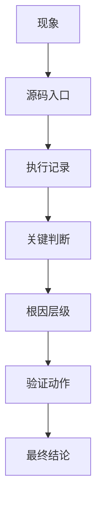

# 97. 真实案例库：源码锚定的典型问题

## 1. 使用方式

这个文档是“案例卡仓库”。每个案例先给出源码锚点、判断逻辑和验证方法，后续拿到真实日志后，再把日志证据、时间线和最终结论补进对应卡片。

统一格式：



## 2. 案例卡模板

复制下面模板创建新案例：

```md
## 案例 X：标题

现象：

适用范围：

源码入口：

- `path/to/file.java`
- `path/to/file.cpp`

执行记录：

| 时间 | 动作 | 观察 |
| --- | --- | --- |
|  |  |  |

关键判断：

- 
- 

日志证据：

```text
```

根因层级：

- [ ] Java/Framework
- [ ] JNI
- [ ] BTIF/BTA/Stack
- [ ] Controller/Firmware
- [ ] 手机端
- [ ] 外部 App / 厂商协议
- [ ] 暂未确认

验证动作：

最终结论：

回归结果：
```

## 3. 案例 1：BLE 扫描无结果

现象：

- 扫描接口返回成功，但没有任何设备结果。

适用范围：

- BLE 外设发现、低功耗设备配网、车载传感器发现。

源码入口：

- `android/app/src/com/android/bluetooth/le_scan/ScanController.java`
- `android/app/src/com/android/bluetooth/le_scan/ScanManager.java`
- `android/app/src/com/android/bluetooth/le_scan/ScanNativeInterface.java`
- `android/app/jni/com_android_bluetooth_scan.cpp`
- `system/stack/btm/btm_ble_scanner.cc`

执行记录：

| 时间 | 动作 | 观察 |
| --- | --- | --- |
| 复现开始 | 调用 BLE scan | Java 接口返回成功 |
| 扫描注册 | 观察 `onScannerRegistered(...)` | 注册成功或失败 |
| 扫描执行 | 看 `startRegularScan()` / `startBatchScan()` | 是否真正进入 native |
| HCI 观察 | 看 snoop/日志 | 是否有 advertising report |

关键判断：

- `ScanController.startScan(...)` 是否真正下发到 `ScanManager`。
- `ScanNativeInterface.onScannerRegistered(...)` 是否返回成功的 scannerId。
- HCI snoop 是否真的看到广告包。

日志证据：

```text
在这里填 `ScanController`、`ScanManager`、`ScanNativeInterface`、`com_android_bluetooth_scan.cpp` 的关键 logcat。
```

常见根因：

- filter 太窄。
- 外设广播地址类型变化。
- 系统扫描节流或后台限制。
- controller 没有上报 advertising report。

验证动作：

1. 先去掉大部分 filter。
2. 用一台已知稳定广播的 BLE 设备对照。
3. 同时抓 logcat 和 HCI snoop。

根因层级：

- [ ] Java/Framework
- [ ] JNI
- [ ] BTIF/BTA/Stack
- [ ] Controller/Firmware
- [ ] 手机端
- [ ] 外部 App / 厂商协议
- [x] 暂未确认

## 4. 案例 2：GATT 连接成功但服务发现为空

现象：

- `clientConnect()` 看似成功，服务列表为空或只有部分服务。

适用范围：

- BLE 外设读写、配置、认证、OTA 前置服务发现。

源码入口：

- `android/app/src/com/android/bluetooth/gatt/GattService.java`
- `android/app/src/com/android/bluetooth/gatt/GattNativeInterface.java`
- `android/app/jni/com_android_bluetooth_gatt.cpp`
- `system/btif/src/btif_gatt_client.cc`
- `system/bta/gatt/bta_gattc_api.cc`
- `system/stack/gatt/gatt_api.cc`

执行记录：

| 时间 | 动作 | 观察 |
| --- | --- | --- |
| 建链 | `clientConnect()` | `connId` 是否有效 |
| 发现 | `discoverServices()` | 全量还是 UUID 搜索 |
| 回调 | 服务发现回 Java | 列表是否为空 |
| 二次验证 | 延后后再发现 | 外设服务是否出现 |

关键判断：

- `connId` 是否有效。
- 发现请求是否过早。
- 外设是否要求先认证或先写入某个配置值。

日志证据：

```text
在这里贴 `discoverServices()`、`gattClientSearchServiceNative()`、`BTA_GATTC_ServiceSearch*()` 的日志。
```

常见根因：

- UUID 过滤错误。
- 外设服务表未准备好。
- 连接建立太早就发起发现。

验证动作：

1. 改成全量服务发现。
2. 延后发现时机。
3. 观察外设是否先要求认证或配对后才开放服务。

根因层级：

- [ ] Java/Framework
- [ ] JNI
- [ ] BTIF/BTA/Stack
- [ ] Controller/Firmware
- [ ] 手机端
- [ ] 外部 App / 厂商协议
- [x] 暂未确认

## 5. 案例 3：A2DP 已连接但无声

现象：

- 设备连接成功，媒体状态也有变化，但车机扬声器无声。

适用范围：

- 车机播放手机音乐、音频路由切换、绝对音量不同步。

源码入口：

- `android/app/src/com/android/bluetooth/a2dp/A2dpService.java`
- `android/app/src/com/android/bluetooth/btservice/ActiveDeviceManager.java`
- `android/app/src/com/android/bluetooth/avrcpcontroller/AvrcpControllerService.java`
- `android/app/src/com/android/bluetooth/avrcp/AvrcpTargetService.java`
- `android/app/jni/com_android_bluetooth_a2dp.cpp`
- `system/btif/src/btif_av.cc`

执行记录：

| 时间 | 动作 | 观察 |
| --- | --- | --- |
| 建链 | A2DP connect | 是否 connected |
| 切活跃设备 | `setActiveDevice()` | 是否切到当前手机 |
| 播放 | 播放音乐 | 是否进入 started |
| 音量 | 调整音量 | AVRCP 是否同步 |

关键判断：

- active device 是否是当前手机。
- 媒体状态是否 started。
- 是否被其他音频设备抢占 active。

日志证据：

```text
贴 `A2dpService`、`ActiveDeviceManager`、`AvrcpControllerService`、`btif_av.cc` 的关键日志。
```

常见根因：

- active device 切换失败。
- codec 协商异常。
- 音频焦点或路由在外部系统。

验证动作：

1. 断开其他音频设备。
2. 查 `ActiveDeviceManager` 日志。
3. 对比播放前后 A2DP 与 AVRCP 状态。

根因层级：

- [ ] Java/Framework
- [ ] JNI
- [ ] BTIF/BTA/Stack
- [ ] Controller/Firmware
- [ ] 手机端
- [ ] 外部 App / 厂商协议
- [x] 暂未确认

## 6. 案例 4：HFP 可连但电话无声

现象：

- 电话显示已连接，拨号成功，但听不到对方声音或对方听不到车机。

适用范围：

- 车机电话、SCO/eSCO、来电/去电、接听/挂断。

源码入口：

- `android/app/src/com/android/bluetooth/hfpclient/HeadsetClientService.java`
- `android/app/src/com/android/bluetooth/hfpclient/HeadsetClientNativeInterface.java`
- `android/app/jni/com_android_bluetooth_hfpclient.cpp`
- `system/btif/src/btif_hf_client.cc`

执行记录：

| 时间 | 动作 | 观察 |
| --- | --- | --- |
| 建链 | HFP connect | SLC 是否建立 |
| 开音频 | `connectAudio()` | SCO 是否 open |
| 拨号/接听 | `dial()` / `acceptCall()` | 状态机是否允许 |
| 语音验证 | 通话中说话 | 双向音频是否正常 |

关键判断：

- `connectAudio()` 是否成功。
- SCO 是否真正建立。
- 来电/去电状态是否同步。

日志证据：

```text
贴 `HeadsetClientService`、`HeadsetClientStateMachine`、`btif_hf_client.cc` 的音频与通话状态日志。
```

常见根因：

- SCO 没建立。
- 手机端通话权限或路由限制。
- 车机 active device 被其他音频设备切走。

验证动作：

1. 分别测试 connect、connectAudio、dial 三个动作。
2. 观察 SCO 建链日志。
3. 排除蓝牙音频和有线音频冲突。

根因层级：

- [ ] Java/Framework
- [ ] JNI
- [ ] BTIF/BTA/Stack
- [ ] Controller/Firmware
- [ ] 手机端
- [ ] 外部 App / 厂商协议
- [x] 暂未确认

## 7. 案例 5：OTA 写入频繁 busy

现象：

- BLE OTA 分包写入过程中频繁失败、busy 或卡顿。

适用范围：

- 固件升级、分包写入、notify ack、断点续传。

源码入口：

- `android/app/src/com/android/bluetooth/gatt/GattService.java`
- `android/app/src/com/android/bluetooth/gatt/GattNativeInterface.java`
- `android/app/jni/com_android_bluetooth_gatt.cpp`
- `system/stack/gatt/gatt_api.cc`

执行记录：

| 时间 | 动作 | 观察 |
| --- | --- | --- |
| 协商 | `configureMTU()` | MTU 是否生效 |
| 开写 | `writeCharacteristic()` | permit 是否拿到 |
| ack | notify/indicate | 是否收到应答 |
| 恢复 | 断点重发 | 是否能继续 |

关键判断：

- `writeCharacteristic()` 的 permit 是否拿到。
- MTU 是否已经协商。
- 写入类型是 `WRITE_TYPE_DEFAULT` 还是 `WRITE_TYPE_NO_RESPONSE`。

日志证据：

```text
贴 `configureMTU()`、`writeCharacteristic()`、notify 回调和外设应答日志。
```

常见根因：

- 分包过快。
- 上层没等回调。
- 外设缓冲区太小。

验证动作：

1. 降低发送速率。
2. 确认 MTU。
3. 增加超时和重试。

根因层级：

- [ ] Java/Framework
- [ ] JNI
- [ ] BTIF/BTA/Stack
- [ ] Controller/Firmware
- [ ] 手机端
- [ ] 外部 App / 厂商协议
- [x] 暂未确认

## 8. 案例 6：联系人不同步

现象：

- 手机互联已连上，但联系人或通话记录没有同步。

适用范围：

- PBAP、MAP、OBEX、联系人/消息同步。

源码入口：

- `android/app/src/com/android/bluetooth/pbapclient/PbapClientService.java`
- `android/app/src/com/android/bluetooth/pbapclient/obex/PbapClientObexClient.java`
- `android/app/src/com/android/bluetooth/mapclient/MapClientService.java`
- `android/app/src/com/android/bluetooth/mapclient/MasClient.java`

执行记录：

| 时间 | 动作 | 观察 |
| --- | --- | --- |
| 连接 | PBAP/MAP connect | socket 是否成功 |
| 授权 | 手机弹窗 | 是否允许通讯录/消息 |
| 拉取 | 拉联系人/短信 | 是否有条目返回 |
| 复测 | 重新连接 | 是否恢复 |

关键判断：

- OBEX socket 是否建立。
- 手机端是否授权联系人/消息访问。
- SDP/端口信息是否正确。

日志证据：

```text
贴 PBAP/MAP connect、socket、OBEX session 和手机授权相关日志。
```

常见根因：

- 手机隐私授权拒绝。
- OBEX session 建链失败。
- 对端服务能力不完整。

验证动作：

1. 先验证 PBAP 再验证 MAP。
2. 看 socket / OBEX 连接日志。
3. 确认手机端权限弹窗状态。

根因层级：

- [ ] Java/Framework
- [ ] JNI
- [ ] BTIF/BTA/Stack
- [ ] Controller/Firmware
- [ ] 手机端
- [ ] 外部 App / 厂商协议
- [x] 暂未确认

## 9. 案例 7：BLE 看得到广播但 connectGatt 失败

现象：

- 扫描列表里能看到目标设备，但点击连接或发起 `connectGatt()` 后失败。

适用范围：

- BLE 配网、传感器连接、车载 AIoT 外设。

源码入口：

- `framework/java/android/bluetooth/BluetoothDevice.java`
- `android/app/src/com/android/bluetooth/gatt/GattService.java`
- `android/app/src/com/android/bluetooth/gatt/GattNativeInterface.java`
- `android/app/jni/com_android_bluetooth_gatt.cpp`
- `system/btif/src/btif_gatt_client.cc`
- `system/bta/gatt/bta_gattc_api.cc`

执行记录：

| 时间 | 动作 | 观察 |
| --- | --- | --- |
| 扫描 | 看到广播 | 设备地址和类型是否稳定 |
| 连接 | `connectGatt()` | 是否进入 `clientConnect()` |
| 下钻 | `gattClientConnectNative()` | native 是否拿到正确地址 |
| 失败 | 连接回调失败 | status 是超时、拒绝还是地址问题 |

关键判断：

- 扫描到的地址是不是 random/private address。
- `connectGatt()` 用的 transport/PHY 是否和设备匹配。
- 外设是不是只在短窗口允许连接。

日志证据：

```text
在这里填 `connectGatt()`、`clientConnect()`、`BTA_GATTC_Open()` 和失败 status 的日志。
```

常见根因：

- 地址类型不对。
- 外设只在短广播窗口可连。
- 连接参数或 PHY 不匹配。
- 外设主动拒绝或超时。

验证动作：

1. 记录广播地址类型和连接用地址是否一致。
2. 尝试 direct connect 与 autoConnect 对比。
3. 对比不同 PHY 和 transport 的结果。

根因层级：

- [ ] Java/Framework
- [ ] JNI
- [ ] BTIF/BTA/Stack
- [ ] Controller/Firmware
- [ ] 手机端
- [ ] 外部 App / 厂商协议
- [x] 暂未确认

## 10. 案例 8：GATT 订阅通知成功但收不到回调

现象：

- `registerForNotifications()` 返回成功，但后续没有 notify/indicate。

适用范围：

- 传感器实时数据、设备状态变化、OTA ack。

源码入口：

- `android/app/src/com/android/bluetooth/gatt/GattService.java`
- `android/app/src/com/android/bluetooth/gatt/GattNativeInterface.java`
- `android/app/jni/com_android_bluetooth_gatt.cpp`
- `system/btif/src/btif_gatt_client.cc`
- `system/bta/gatt/bta_gattc_api.cc`

执行记录：

| 时间 | 动作 | 观察 |
| --- | --- | --- |
| 订阅 | `registerForNotifications()` | 是否返回成功 |
| 写 CCCD | descriptor 写入 | 是否真的写到 0x2902 |
| 等待 | 外设推送 | 是否有 handle value notification |
| 对照 | 读状态 characteristic | 外设值是否其实已变 |

关键判断：

- CCCD 是否真的写成功。
- handle 是否是正确的 characteristic handle。
- 外设是否要求写某个启动命令后才会开始 notify。

日志证据：

```text
在这里填 CCCD 写入日志、notify 回调日志和外设状态变化日志。
```

常见根因：

- 只调用订阅接口，没有成功写 CCCD。
- handle 错误。
- 外设未进入 notify 模式。
- 外设发的是 indicate，但上层只按 notify 理解。

验证动作：

1. 直接读取对应 characteristic 验证外设状态。
2. 确认 CCCD 写入成功后再等回调。
3. 检查外设协议文档是否要求先发启动命令。

根因层级：

- [ ] Java/Framework
- [ ] JNI
- [ ] BTIF/BTA/Stack
- [ ] Controller/Firmware
- [ ] 手机端
- [ ] 外部 App / 厂商协议
- [x] 暂未确认

## 11. 案例 9：A2DP 已连但 active device 被切走

现象：

- 手机音乐连接正常，但播放一会儿就没声音，或切到另一台蓝牙设备上。

适用范围：

- 车机多音频设备场景、双手机、多媒体音源切换。

源码入口：

- `android/app/src/com/android/bluetooth/a2dp/A2dpService.java`
- `android/app/src/com/android/bluetooth/btservice/ActiveDeviceManager.java`
- `android/app/src/com/android/bluetooth/le_audio/LeAudioService.java`
- `android/app/src/com/android/bluetooth/avrcpcontroller/AvrcpControllerService.java`

执行记录：

| 时间 | 动作 | 观察 |
| --- | --- | --- |
| 连接 | 手机 A 连接 A2DP | active device 是 A |
| 插入/连接别的设备 | 切换音源 | active device 是否改成 B |
| 观察 | 播放中断点 | 是否收到 active device change |
| 恢复 | 重新切回 A | 是否恢复播放 |

关键判断：

- `ActiveDeviceManager.profileConnectionStateChanged(...)` 是否触发切换。
- 是否有 LE Audio 或有线音频抢占 active。
- `setA2dpActiveDevice(...)` 是否被置空。

日志证据：

```text
在这里贴 `ActiveDeviceManager` 的切换日志、A2DP active device 日志和 AVRCP 媒体状态日志。
```

常见根因：

- 其他音频设备抢占 active。
- LE Audio 优先级更高。
- 车机音频策略把原设备置空。

验证动作：

1. 断开其它音频设备后复测。
2. 观察切换发生的时间点。
3. 对比 A2DP、HFP、LE Audio 的 active 逻辑。

根因层级：

- [ ] Java/Framework
- [ ] JNI
- [ ] BTIF/BTA/Stack
- [ ] Controller/Firmware
- [ ] 手机端
- [ ] 外部 App / 厂商协议
- [x] 暂未确认

## 12. 案例 10：HFP SLC 成功但 SCO 不 open

现象：

- 电话连接成功，拨号或接听也看起来正常，但音频始终不通。

适用范围：

- 车机电话、免提语音、来电接听。

源码入口：

- `android/app/src/com/android/bluetooth/hfpclient/HeadsetClientService.java`
- `android/app/src/com/android/bluetooth/hfpclient/HeadsetClientStateMachine.java`
- `android/app/src/com/android/bluetooth/hfpclient/HeadsetClientNativeInterface.java`
- `android/app/jni/com_android_bluetooth_hfpclient.cpp`
- `system/btif/src/btif_hf_client.cc`

执行记录：

| 时间 | 动作 | 观察 |
| --- | --- | --- |
| 建链 | HFP connect | SLC 是否成功 |
| 开音频 | `connectAudio()` | 是否进入 audio connecting |
| 超时 | 等待 SCO | 是否有 open 成功或失败 |
| 回退 | 断开再连 | 是否恢复 |

关键判断：

- `connectAudio()` 是否被状态机拒绝。
- SCO open 是否超时。
- 手机端是否要求先接听再开音频。

日志证据：

```text
在这里填 `audio connecting`、`SCO open`、`BTA_HfClientAudioOpen` 和失败原因日志。
```

常见根因：

- 手机端音频路由限制。
- SCO open 超时。
- 状态机当前 call state 不允许开音频。

验证动作：

1. 分别测试来电和去电场景。
2. 观察 `connectAudio()` 返回值与后续回调。
3. 排除 A2DP/有线音频占用问题。

根因层级：

- [ ] Java/Framework
- [ ] JNI
- [ ] BTIF/BTA/Stack
- [ ] Controller/Firmware
- [ ] 手机端
- [ ] 外部 App / 厂商协议
- [x] 暂未确认

## 13. 案例 11：PBAP/MAP 授权后仍不同步

现象：

- 手机已经点了授权，但联系人/短信还是拉不下来。

适用范围：

- 手机互联、联系人同步、消息同步。

源码入口：

- `android/app/src/com/android/bluetooth/pbapclient/PbapClientService.java`
- `android/app/src/com/android/bluetooth/pbapclient/obex/PbapClientObexClient.java`
- `android/app/src/com/android/bluetooth/mapclient/MapClientService.java`
- `android/app/src/com/android/bluetooth/mapclient/MasClient.java`

执行记录：

| 时间 | 动作 | 观察 |
| --- | --- | --- |
| 授权 | 手机允许访问 | 授权状态是否真的生效 |
| 拉取 | 开始同步 | socket 是否已连上 |
| 观察 | 等待结果 | 是否有条目返回 |
| 重连 | 重启连接 | 是否恢复 |

关键判断：

- 授权是否只是弹窗点过，但手机系统仍限制读取。
- SDP/OBEX 连接是否真的成功。
- PBAP 和 MAP 是否其中一个失败、另一个成功。

日志证据：

```text
在这里贴 PBAP/MAP connect、OBEX session 和手机授权状态日志。
```

常见根因：

- 手机厂商权限策略限制。
- OBEX session 没成功。
- 对端只支持部分 profile 能力。

验证动作：

1. 分别单独测试 PBAP 和 MAP。
2. 重新取消授权再授权一次。
3. 对比不同手机系统版本。

根因层级：

- [ ] Java/Framework
- [ ] JNI
- [ ] BTIF/BTA/Stack
- [ ] Controller/Firmware
- [ ] 手机端
- [ ] 外部 App / 厂商协议
- [x] 暂未确认

## 14. 案例 12：配对成功后无法自动回连

现象：

- 设备已经配对成功，但重启蓝牙、重启车机或重新进入车内后没有自动回连。

适用范围：

- 车机常驻设备、手机重连、Profile 自动连接策略。

源码入口：

- `framework/java/android/bluetooth/BluetoothDevice.java`
- `android/app/src/com/android/bluetooth/btservice/BondStateMachine.java`
- `android/app/src/com/android/bluetooth/btservice/AdapterService.java`
- `android/app/src/com/android/bluetooth/a2dp/A2dpService.java`
- `android/app/src/com/android/bluetooth/hfpclient/HeadsetClientService.java`
- `android/app/src/com/android/bluetooth/le_audio/LeAudioService.java`

执行记录：

| 时间 | 动作 | 观察 |
| --- | --- | --- |
| 配对 | 完成 bond | 是否保存成功 |
| 重启 | 蓝牙或车机重启 | 是否恢复 bonded |
| 回连 | 观察 profile 自动连接 | 是否发起 A2DP/HFP connect |
| 失败 | 检查连接策略 | connection policy 是否允许 |

关键判断：

- bond 是否真的保存在设备缓存里。
- Profile connection policy 是否允许自动回连。
- 车机是否被其他 active device 策略抢占。

日志证据：

```text
在这里填 bond 保存、Profile 自动连接尝试、回连失败原因的日志。
```

常见根因：

- 连接策略被设置成 forbidden。
- 手机端没进入可自动连接状态。
- 设备缓存没恢复或被清掉。
- 其他 active device 抢占。

验证动作：

1. 检查 connection policy。
2. 确认 bond 后是否真的重启仍存在。
3. 对比重启前后自动连接日志。

根因层级：

- [ ] Java/Framework
- [ ] JNI
- [ ] BTIF/BTA/Stack
- [ ] Controller/Firmware
- [ ] 手机端
- [ ] 外部 App / 厂商协议
- [x] 暂未确认

## 15. 后续填充规则

以后如果拿到真实问题，优先把它归到上面的某个案例卡，然后补：

- 精确现象。
- 复现步骤。
- 时间对齐的 logcat。
- `dumpsys bluetooth_manager` / `dumpsys bluetooth`。
- HCI snoop 证据。
- 根因层级。
- 修复或规避方案。
- 回归结果。

建议真实日志案例写法：

1. 先写“现象 + 设备型号 + 时间”。
2. 再写 3 到 5 个关键日志片段。
3. 最后写源码结论，不要倒着写。
