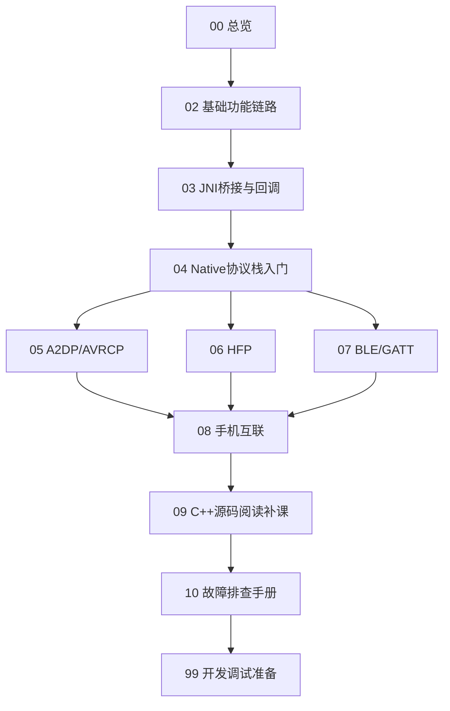

# 98. 术语表与阅读路线

## 1. 推荐阅读路线

如果你是第一次读 Android 蓝牙源码，建议按下面顺序：

如果你带着问题来排查，可以直接跳：

| 问题 | 优先章节 |
| --- | --- |
| 不知道源码怎么分层 | `00-总览.md`、`04-Native协议栈入门.md` |
| 蓝牙开关、扫描、配对 | `02-基础功能链路.md` |
| Java 到 Native 看不懂 | `03-JNI桥接与回调.md` |
| 音乐无声、卡顿、音量不同步 | `05-蓝牙音乐A2DP_AVRCP.md` |
| 电话无声、拨号失败、SCO 异常 | `06-蓝牙电话HFP.md` |
| BLE 扫描、GATT 读写、OTA | `07-BLE_GATT与AIoT.md` |
| 手机互联问题归因 | `08-手机互联.md` |
| C++ 语法和异步回调看不懂 | `09-C++源码阅读补课.md` |
| 现场问题快速定位 | `10-故障排查手册.md`、`99-开发调试准备.md` |

## 2. 核心术语表

| 术语 | 含义 | 常见源码位置 |
| --- | --- | --- |
| Adapter | 蓝牙适配器，总开关和基础能力入口 | `BluetoothAdapter.java`、`AdapterService.java` |
| Profile | 蓝牙功能配置文件，例如 A2DP/HFP/GATT | `BluetoothProfile.java`、各 Profile Service |
| BTIF | Bluetooth Interface，JNI/Profile 到 Native 的适配层 | `system/btif` |
| BTA | Bluetooth Application layer，Profile/DM 状态机层 | `system/bta` |
| Stack | 协议核心层，例如 L2CAP、GATT、RFCOMM、SDP | `system/stack` |
| GD | Gabeldorsche，新一代蓝牙栈模块 | `system/gd` |
| HCI | Host Controller Interface，Host 与蓝牙芯片通信接口 | `system/gd/hci`、`system/stack/hcic` |
| ACL | 异步无连接逻辑链路，承载多数数据通道 | `system/stack/acl` |
| L2CAP | 逻辑链路控制与适配协议，上承 GATT/AVDTP/RFCOMM 等 | `system/stack/l2cap` |
| SDP | Service Discovery Protocol，Classic 服务发现 | `system/stack/sdp` |
| RFCOMM | 串口仿真通道，HFP、OBEX 等常用 | `system/stack/rfcomm` |
| AVDTP | A2DP 媒体传输信令协议 | `system/stack/avdt` |
| AVRCP | 音乐播放控制、媒体信息、绝对音量 | `avrcp`、`avrcpcontroller`、`system/btif/avrcp` |
| SCO/eSCO | 电话语音链路 | HFP 相关 Java/JNI/BTIF/BTA |
| GATT | BLE 属性协议上层，服务/特征/描述符模型 | `GattService.java`、`system/stack/gatt` |
| ATT handle | GATT 属性句柄，读写时使用 | `GattService`、`GATTC_Read/Write` |
| CCCD | Client Characteristic Configuration Descriptor，用于打开 notify/indicate | GATT descriptor 写入链路 |
| clientIf | GATT Client 注册后的客户端标识 | `GattService`、`btif_gatt_client.cc` |
| connId | GATT 连接标识 | `GattService`、`BTA_GATTC_*` |
| active device | 当前音频/电话活跃设备 | `ActiveDeviceManager.java` |
| HCI snoop | 蓝牙 HCI 抓包日志 | 设备 `/data/misc/bluetooth/logs` 等 |

## 3. 源码定位口诀

1. 先分 Profile：A2DP、HFP、GATT、PBAP、MAP、PAN 不能混着查。
2. Java 入口先找 `Service` 和 `StateMachine`。
3. Java 到 Native 先找 `NativeInterface` 和 `android/app/jni`。
4. Native 第一跳通常是 `system/btif`。
5. 看到 `do_in_main_thread`，继续追括号里的目标函数。
6. 状态回 Java 时，找 JNI callback、Native callback class 和 `messageFromNative()`。
7. 现场问题一定同时保存 logcat、dumpsys 和 snoop，单看一层容易误判。

## 4. 章节验收清单

| 章节 | 源码路径 | Mermaid/图 | 练习或排查 | 状态 |
| --- | --- | --- | --- | --- |
| `00-总览.md` | 有 | 有 | 有 | 首版完成 |
| `02-基础功能链路.md` | 有 | 有 | 有 | 首版完成 |
| `03-JNI桥接与回调.md` | 有 | 有 | 有 | 首版完成 |
| `04-Native协议栈入门.md` | 有 | 有 | 有 | 首版完成 |
| `05-蓝牙音乐A2DP_AVRCP.md` | 有 | 有 | 有 | 首版完成 |
| `06-蓝牙电话HFP.md` | 有 | 有 | 有 | 首版完成 |
| `07-BLE_GATT与AIoT.md` | 有 | 有 | 有 | 首版完成 |
| `08-手机互联.md` | 有 | 有 | 有 | 首版完成 |
| `09-C++源码阅读补课.md` | 有 | 无，偏语法索引 | 有 | 首版完成 |
| `10-故障排查手册.md` | 有 | 有 | 有 | 首版完成 |
| `99-开发调试准备.md` | 有 | 无，偏命令清单 | 有 | 首版完成 |

## 5. 后续扩展建议

后续如果拿到完整车机工程，可以继续补：

- Settings 蓝牙页面到 `BluetoothAdapter`/`BluetoothDevice` 的 UI 调用链。
- system_server 中 BluetoothManagerService 的完整状态管理。
- 厂商互联协议和蓝牙 Profile 的实际协作方式。
- 真实设备日志案例：每类问题各补一份“日志 -> 源码 -> 结论”的案例。

