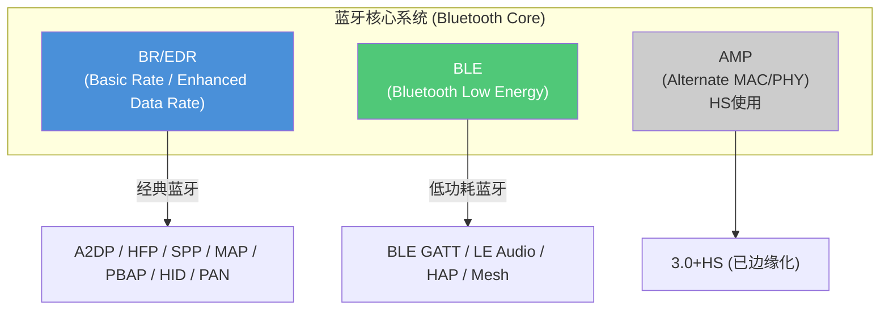
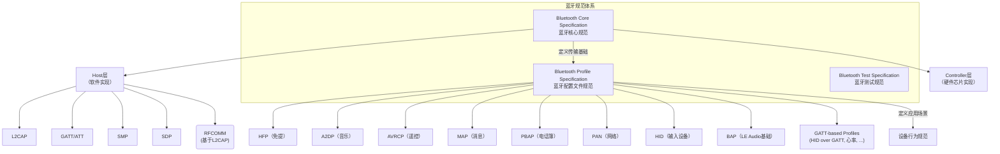
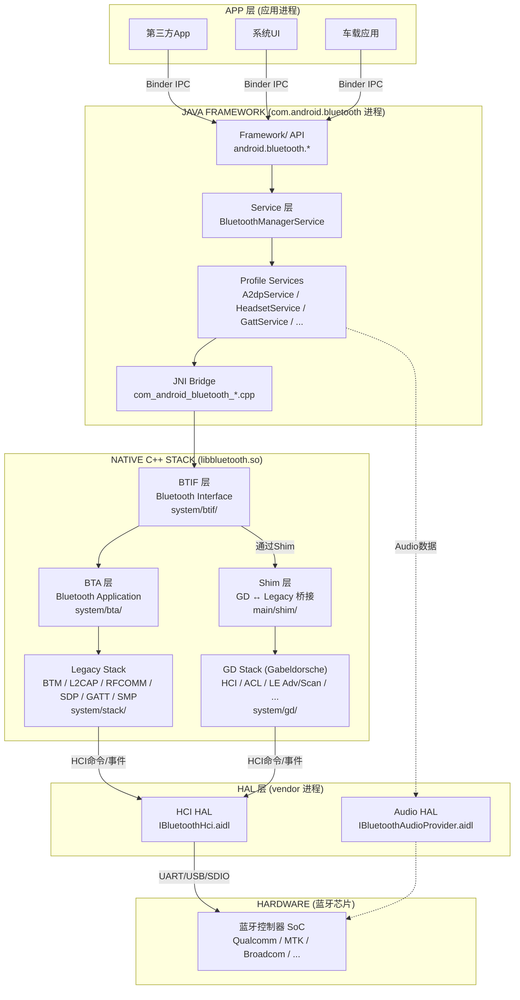
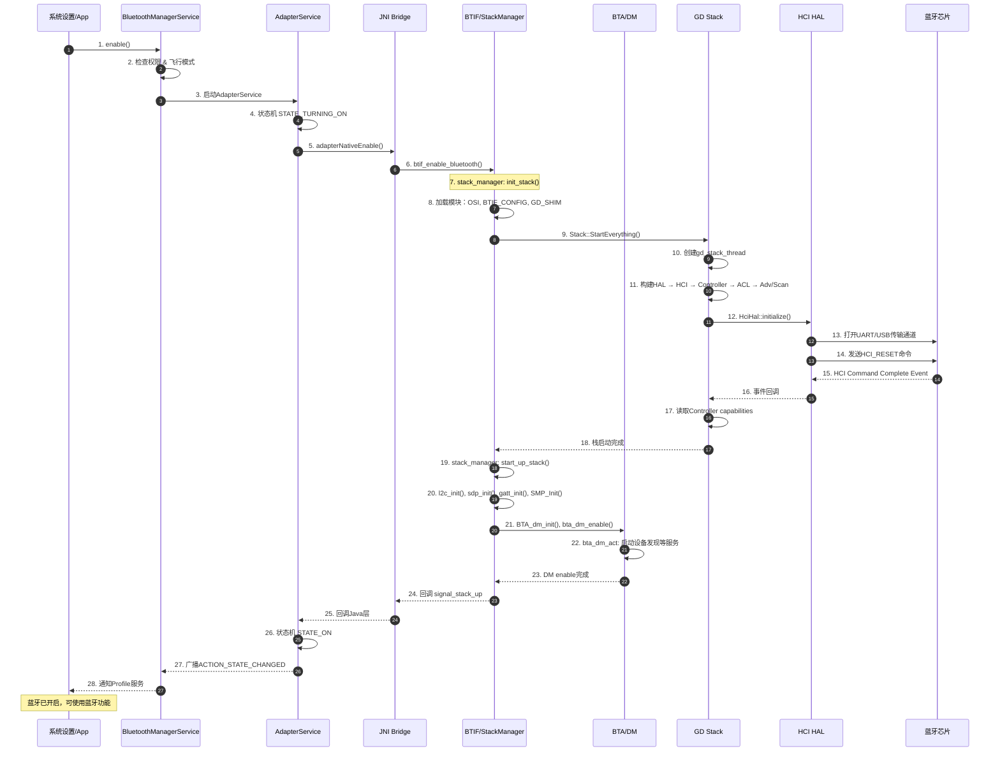
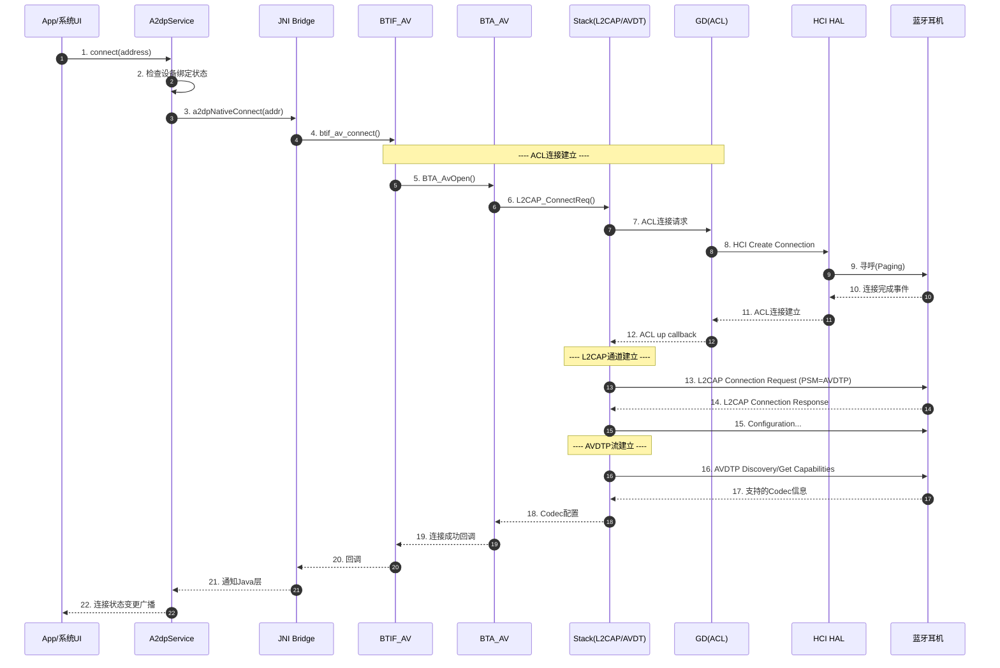

# 第1章：Android Bluetooth 总体架构

> **难度**: ★☆☆☆☆ | **前置知识**: 无 | **C++依赖**: 无
> **预计阅读时间**: 2-3小时 | **预计学习天数**: 2-3天
> **核心作用**: 建立全局认知，为后续学习打地基

---

## 学习目标

- 理解蓝牙技术的基本概念和发展脉络
- 掌握 Android Fluoride 蓝牙栈的完整分层架构
- 能够手绘各层关系图，明确每层代码的物理位置
- 理解一个蓝牙操作（如"打开蓝牙"）穿越各层的完整路径
- 建立对代码仓库的整体方位感，知道找什么代码去哪个目录

---

## 1. 蓝牙技术概览

### 1.1 蓝牙是什么？

蓝牙（Bluetooth）是一种**短距离无线通信技术**，工作在 **2.4GHz ISM 频段**（2.400-2.4835GHz）。它的名字来自10世纪的丹麦国王 Harald Blåtand（Harold Bluetooth），寓意"统一"——就像蓝牙技术统一了各种设备的短距离通信。

### 1.2 蓝牙发展简史

```
Bluetooth 1.0 (1999) ─── 初代规范，速率约1Mbps
       │
Bluetooth 1.2 (2003) ─── AFH（自适应跳频），抗干扰增强
       │
Bluetooth 2.0 + EDR (2004) ─── 增强数据速率，3Mbps
       │
Bluetooth 2.1 (2007) ─── SSP（安全简单配对），大幅改善配对体验
       │
Bluetooth 3.0 + HS (2009) ─── 高速传输（借用WiFi 802.11），24Mbps
       │
Bluetooth 4.0 (2010) ─── ★ 引入 BLE（低功耗蓝牙），划时代版本
       │
Bluetooth 4.2 (2014) ─── LE Data Length Extension，隐私增强
       │
Bluetooth 5.0 (2016) ─── 4倍距离/2倍速度/8倍广播容量
       │
Bluetooth 5.1 (2019) ─── 测向功能（Angle of Arrival/Departure）
       │
Bluetooth 5.2 (2020) ─── LE Audio, LC3编解码, Isochronous Channels
       │
Bluetooth 5.3 (2021) ─── 连接更新改进，频道分类增强
       │
Bluetooth 5.4 (2023) ─── PAwR, Encrypted Advertising Data
       │
Bluetooth 6.0 (2024) ─── Channel Sounding（高精度测距）
```

**关键里程碑**：
- **4.0 (2010)**: BLE 诞生，蓝牙从"连接设备"扩展到"物联网"
- **5.0 (2016)**: BLE 能力的巨大飞跃，广播容量从31字节扩展到255字节
- **5.2 (2020)**: LE Audio 诞生，蓝牙音频迎来革命性变革
- **6.0 (2024)**: Channel Sounding 使厘米级测距成为可能

### 1.3 BR/EDR vs BLE — 两种蓝牙的对比

这是蓝牙领域**最基础、最重要**的概念。几乎整个代码库都是围绕这两种模式的区分来组织。



#### 核心差异表

| 特性 | BR/EDR (经典蓝牙) | BLE (低功耗蓝牙) |
|------|-------------------|-----------------|
| **设计目标** | 持续数据流（音频、文件） | 低功耗、间歇通信 |
| **信道数** | 79个信道 (1MHz间隔) | 40个信道 (2MHz间隔) |
| **调制方式** | GFSK (Basic) / π/4-DQPSK, 8DPSK (EDR) | GFSK |
| **数据速率** | 1-3 Mbps (BR/EDR) | 125 Kbps - 2 Mbps (取决于PHY) |
| **连接建立** | 数秒（含查询/寻呼） | 数毫秒（广播→连接） |
| **功耗** | 数十mA（持续传输） | 数μA-数mA（睡眠占比高） |
| **语音** | 原生支持 (SCO/eSCO) | 通过LE Audio (LC3) |
| **拓扑** | Piconet/Scatternet | 扩展广播、周期性广播 |
| **典型设备** | 耳机、车载、键盘 | 传感器、手表、信标 |
| **Android代码** | `stack/btm/`, `stack/l2cap/`, `bta/ag/` | `gd/hci/`, `stack/gatt/`, `stack/smp/` |

> **车载视角**：车辆蓝牙是典型的**双模**应用。HFP（电话）和A2DP（音乐）使用BR/EDR；数字车钥匙、BLE传感器使用BLE。LE Audio未来可能取代部分HFP/A2DP场景。

### 1.4 蓝牙规范体系

理解蓝牙规范的组织方式，帮助你快速定位问题属于哪一层。



**关键理解**：
- **Core Spec** 定义"怎么传"——协议、数据格式、加密等
- **Profile Spec** 定义"传什么"——特定应用场景下的行为约定
- 在你的代码中，`system/stack/` 实现 Core Spec，`android/app/src/.../` 和 `system/bta/` 实现 Profile

---

## 2. Android Fluoride 蓝牙栈架构

### 2.1 架构演进：从 BlueZ 到 Fluoride

```
Android 1.0 ～ 4.1                    Android 4.2+
┌──────────────────────┐              ┌──────────────────────────┐
│   BlueZ (Linux 原生)  │    ──→      │   Fluoride (Google自研)   │
│                      │              │                          │
│  GPL协议, 更新缓慢    │              │  Apache 2.0, 与AOSP一致  │
│  Linux内核深度绑定    │              │  Java + C++混合架构      │
│  C语言重, 调试困难    │              │  更快迭代, 定制化更强     │
└──────────────────────┘              └──────────────────────────┘
```

**为什么迁移？**
1. **License 问题**: BlueZ 是 GPL，与 Android 的 Apache 协议不兼容
2. **定制需求**: Google需要快速迭代蓝牙功能
3. **架构灵活性**: 新架构使用 Java 实现服务层，降低开发门槛

**2019年后加入 Gabeldorsche (GD)**:
- 在原有 Legacy Stack 基础上，逐步引入现代 C++ 实现的新栈
- 设计理念：更清晰的模块化、更现代的 C++ 风格、更好的可测试性
- 当前状态：**双栈共存，逐步迁移**（由 feature flag `bluetooth.gd.xxx` 控制）

### 2.2 Fluoride 完整分层架构

这是 Android 蓝牙栈最核心的结构图，请务必理解透彻：



### 2.3 物理代码位置与职责

用"包工头"的比喻来理解各层的角色：

| 层 | 代码目录 | 语言 | 角色比喻 |
|----|---------|------|---------|
| **框架API** | `framework/java/android/bluetooth/` | Java | **前台接待** — 给App开发者的标准接口 |
| **系统服务** | `service/src/com/android/server/bluetooth/` | Java | **项目经理** — 管理蓝牙开关、权限、系统级策略 |
| **Profile服务** | `android/app/src/com/android/bluetooth/` | Java | **各工种技术** — A2DP、HFP、GATT等具体功能 |
| **JNI桥梁** | `android/app/jni/` | C++ | **翻译官** — Java ↔ C++ 转换 |
| **BTIF层** | `system/btif/` | C++ | **工长** — 协调调度Native层各模块 |
| **BTA层** | `system/bta/` | C++ | **施工队** — Profile的具体C++实现 |
| **Legacy Stack** | `system/stack/` | C++ | **老工人** — L2CAP/RFCOMM/SDP/GATT等传统协议 |
| **GD Stack** | `system/gd/` | C++ | **新工程师** — 现代C++实现的HCI/ACL/LE等功能 |
| **Shim层** | `system/main/shim/` | C++ | **翻译** — GD与Legacy之间的桥接 |
| **HCI HAL** | `system/gd/hal/` | C++ | **跟硬件打交道的人** — 与蓝牙芯片通信 |

### 2.4 各目录核心文件速查

#### framework/ — 公共API（~93个Java文件）

```
framework/
  └── java/android/bluetooth/
      ├── BluetoothAdapter.java        ← 蓝牙适配器（全局唯一的蓝牙入口）
      ├── BluetoothDevice.java         ← 远程蓝牙设备
      ├── BluetoothManager.java        ← 蓝牙管理器（Context获取）
      ├── BluetoothGatt.java           ← GATT操作接口
      ├── BluetoothGattCallback.java   ← GATT回调
      ├── BluetoothSocket.java         ← RFCOMM/L2CAP Socket
      ├── BluetoothServerSocket.java   ← 服务端Socket
      ├── BluetoothA2dp.java           ← A2DP Profile API
      ├── BluetoothHeadset.java        ← HFP Profile API
      ├── BluetoothHidHost.java        ← HID Host API
      ├── le/BluetoothLeScanner.java   ← BLE扫描
      ├── le/BluetoothLeAdvertiser.java ← BLE广播
      └── le/ScanRecord.java           ← BLE广播数据解析
```

#### service/ — 系统服务

```
service/
  └── src/com/android/server/bluetooth/
      ├── BluetoothManagerService.java   ← 主入口系统服务
      ├── BluetoothServiceBinder.java    ← Binder实现
      └── BtPermissionUtils.java         ← 蓝牙权限工具
```

#### android/app/ — Profile服务 + JNI

```
android/app/
  ├── src/com/android/bluetooth/
  │   ├── btservice/AdapterService.java   ← 核心Adapter服务
  │   ├── btservice/BondStateMachine.java ← 绑定状态机
  │   ├── btservice/ActiveDeviceManager.java ← 活跃设备管理
  │   ├── btservice/PhonePolicy.java      ← 电话策略
  │   ├── a2dp/A2dpService.java           ← A2DP服务
  │   ├── a2dp/A2dpStateMachine.java      ← A2DP状态机
  │   ├── hfp/HeadsetService.java         ← HFP服务
  │   ├── hfp/HeadsetStateMachine.java    ← HFP状态机
  │   ├── gatt/GattService.java           ← GATT服务
  │   ├── gatt/ScanManager.java           ← BLE扫描管理器
  │   ├── pan/PanService.java             ← PAN服务
  │   ├── hid/HidDeviceService.java       ← HID服务
  │   ├── le_audio/LeAudioService.java    ← LE Audio服务
  │   └── hearingaid/HearingAidService.java ← 助听器服务
  └── jni/
      ├── com_android_bluetooth_btservice_AdapterService.cpp ← 核心JNI
      ├── com_android_bluetooth_gatt.cpp   ← GATT JNI
      ├── com_android_bluetooth_hfp.cpp    ← HFP JNI
      ├── com_android_bluetooth_a2dp.cpp   ← A2DP JNI
      └── ... (共23个JNI文件)
```

#### system/btif/ — BTIF层

```
system/btif/
  ├── include/bluetooth.h               ← C层核心接口定义
  ├── include/btif_api.h                ← BTIF对外API
  ├── src/
  │   ├── bluetooth.cc                  ← 接口实现（bt_interface_t）
  │   ├── btif_core.cc                  ← 核心事件分发
  │   ├── btif_dm.cc                    ← 设备管理
  │   ├── btif_hf.cc                    ← HFP
  │   ├── btif_av.cc                    ← A2DP
  │   ├── btif_rc.cc                    ← AVRCP
  │   ├── btif_gatt.cc                  ← GATT
  │   ├── btif_sock.cc                  ← Socket/RFCOMM
  │   ├── btif_pan.cc                   ← PAN
  │   └── stack_manager.cc              ← 栈生命周期管理
```

#### system/bta/ — BTA层

```
system/bta/
  ├── dm/bta_dm_act.cc                 ← 设备管理动作
  ├── dm/bta_dm_sec.cc                 ← 安全管理
  ├── ag/bta_ag_act.cc                 ← HFP AG实现
  ├── av/bta_av_act.cc                 ← A2DP实现
  ├── gatt/bta_gattc_api.cc            ← GATT Client API
  ├── gatt/bta_gatts_api.cc            ← GATT Server API
  ├── hh/bta_hh_act.cc                 ← HID Host
  ├── le_audio/state_machine.cc        ← LE Audio状态机
  └── include/bta_api.h                ← BTA公共头文件
```

#### system/stack/ — 经典协议栈

```
system/stack/
  ├── btm/    ← Bluetooth Manager（设备/连接/SCO/安全管理）
  ├── l2cap/  ← L2CAP协议（逻辑链路控制）
  ├── rfcomm/ ← RFCOMM协议（串口仿真）
  ├── sdp/    ← SDP协议（服务发现）
  ├── gatt/   ← GATT/ATT协议（通用属性）
  ├── smp/    ← SMP协议（安全管理）
  ├── avdt/   ← AVDT协议（音视频分发）
  ├── avct/   ← AVCT协议（音视频控制）
  ├── avrc/   ← AVRC协议（音视频遥控）
  ├── bnep/   ← BNEP协议（网络封装）
  ├── acl/    ← ACL链路管理
  └── hid/    ← HID协议
```

#### system/gd/ — Gabeldorsche 新栈

```
system/gd/
  ├── hci/hci_layer.cc                  ← HCI层
  ├── hci/controller_impl.cc            ← Controller管理
  ├── hci/acl_manager/                  ← ACL连接管理
  ├── hci/le_advertising_manager_impl.cc ← LE广播
  ├── hci/le_scanning_manager_impl.cc   ← LE扫描
  ├── hci/distance_measurement_manager_impl.cc ← 距离测量
  ├── hal/hci_hal_impl_android.cc       ← HAL实现
  ├── hal/snoop_logger.cc               ← Snoop日志
  ├── os/handler.cc                     ← Handler机制
  ├── storage/storage_module.cc         ← 存储模块
  └── packet/                           ← 包解析框架
```

---

### 2.5 线程模型全景

> 来源：V8 架构地图 `V8_Architecture_Map.md` §9 — 基于实际源码 `BluetoothManagerService.java:2448`、`AdapterService.java:5030`、`stack_manager.cc:422` 等 17 个关键文件分析

| # | 线程名称 | 所属进程 | 作用 | 源码入口 |
|---|---------|---------|------|---------|
| 1 | App 主线程 | App | UI 线程，调用 Binder IPC | 任意 App |
| 2 | Binder 线程池 | system_server / com.android.bluetooth | 处理跨进程调用 | `BluetoothManagerService.java` |
| 3 | Binder 回调 | App | 接收异步回调（需 post 到主线程） | `IBluetoothManagerCallback.aidl` |
| 4 | `mHandler` | system_server | BMS 事件处理，状态迁移 | `BluetoothManagerService.java:130` |
| 5 | AdapterService Handler | com.android.bluetooth | 状态机事件调度 | `AdapterService.java` |
| 6 | `mScanThread` | com.android.bluetooth | BLE 扫描专用线程 | `ScanController.java:1631` |
| 7 | bt_jni_thread | Native | Java→JNI 回调中转 | `btif_jni_task.cc:40` |
| 8 | BT Main Thread | Native | JNI→BTIF 主线程 | `stack_manager.cc:198` |
| 9 | BTU Task | Native | 协议栈事件驱动循环 | `btu_task.cc` |
| 10 | gd_stack_thread | Native | GD 栈主线程 (REAL_TIME 优先级) | `stack.cc:320` |
| 11 | gd_hci_thread | Native | HCI 数据收发 | `hci_layer.cc` |
| 12 | gd_l2cap_thread | Native | L2CAP 处理 | `l2cap_classic.cc` |
| 13 | gd_security_thread | Native | SMP/安全处理 | `le_security_module.cc` |
| 14 | StateMachine Handler | com.android.bluetooth | 各 Profile 独立线程 | `ProfileService.java` |
| 15 | Async I/O Worker | Native | 文件操作/蓝牙配置 | `btif_config.cc` |
| 16 | HCI HAL 线程 | Native | UART/USB HCI 传输 | `hci_hal_impl_android.cc` |
| 17 | Audio HAL 线程 | Native | Audio 数据通道 | `audio_hal_interface.cc` |

**数据流向规律**：下行调用（App→Controller）依次经过 `1→2→4/5→6→7→8→9→10/11→16`；上行回调（Controller→App）反向经过 `11→10→9→8→7→3→1`。第 7 行 `bt_jni_thread` 是关键线程切换点——它通过 `do_in_jni_thread()` 将 BTIF 线程的控制权切换到 JNI 线程，再调用 `CallbackEnv` 触发 Java 回调。

---

## 3. 关键数据流全景

### 3.1 调用链模式

蓝牙有两种主要的通信方向：

**Downcall（下行调用）：App → Java → JNI → C++ → 硬件**
- 应用请求蓝牙操作（如"连接耳机"）
- 请求逐层向下传递
- 最终到达蓝牙芯片

**Upcall（上行回调）：硬件 → C++ → JNI → Java → App**
- 蓝牙芯片产生事件（如"耳机连接成功"）
- 事件逐层向上回调
- 最终通知应用层

### 3.2 蓝牙启机完整时序

以"打开蓝牙"为例，展示数据穿越各层的完整路径：



### 3.3 连接耳机完整时序



---

## 4. 蓝牙核心规范体系（补充知识）

### 4.1 核心协议栈分层

从编码规范视角看蓝牙协议栈：

```
┌─────────────────────────────────────────────────────────────┐
│                    PROFILES (应用层)                          │
│  HFP   A2DP   AVRCP   MAP   PBAP   PAN   HID   GATT Profile │
├─────────────────────────────────────────────────────────────┤
│                  HOST (主机 - 软件实现)                       │
│  ┌───────────────────────────────────────────────────────┐  │
│  │  SDP   │  RFCOMM │ GATT/ATT │  AVDT/AVCT │  BNEP    │  │
│  ├───────────────────────────────────────────────────────┤  │
│  │              L2CAP (逻辑链路控制与适配)                 │  │
│  ├───────────────────────────────────────────────────────┤  │
│  │  BTM (基带/链路管理)  │  SMP (安全管理)                │  │
│  ├───────────────────────────────────────────────────────┤  │
│  │              HCI (主机控制器接口)                      │  │
├─────────────────────────────────────────────────────────────┤
│              CONTROLLER (控制器 - 硬件芯片)                  │
│  ┌───────────────────────────────────────────────────────┐  │
│  │  Link Manager (LM)  │  Link Controller (LC)          │  │
│  ├───────────────────────────────────────────────────────┤  │
│  │  Baseband / RF (基带/射频)                            │  │
│  └───────────────────────────────────────────────────────┘  │
└─────────────────────────────────────────────────────────────┘
```

**Android蓝牙代码实现的范围**：从上到下覆盖了 Profiles 到 HCI 的完整 Host 层，HCI 以下交给芯片厂商实现。

### 4.2 各协议在代码中的对应

| 协议 | 全称 | 代码位置 | 核心文件 |
|------|------|---------|---------|
| **HCI** | Host Controller Interface | `gd/hci/`, `stack/include/hcidefs.h` | `hci_layer.cc`, `hcidefs.h` |
| **L2CAP** | Logical Link Control & Adapt. | `stack/l2cap/` | `l2c_main.cc`, `l2c_api.h` |
| **RFCOMM** | Radio Frequency Communication | `stack/rfcomm/` | `port_api.cc`, `rfc_main.cc` |
| **SDP** | Service Discovery Protocol | `stack/sdp/` | `sdp_main.cc`, `sdp_api.h` |
| **GATT** | Generic Attribute Profile | `stack/gatt/` | `gatt_main.cc`, `att_protocol.cc` |
| **ATT** | Attribute Protocol | `stack/gatt/` | `att_protocol.cc` |
| **SMP** | Security Manager Protocol | `stack/smp/` | `smp_main.cc`, `smp_api.h` |
| **AVDT** | Audio/Video Distribution Trans. | `stack/avdt/` | `avdt_main.cc` |
| **AVCT** | Audio/Video Control Transport | `stack/avct/` | `avct_main.cc` |
| **AVRC** | Audio/Video Remote Control | `stack/avrc/` | `avrc_api.cc` |
| **BNEP** | Bluetooth Network Encaps. Proto. | `stack/bnep/` | `bnep_main.cc` |

### 4.3 日志标签速查

> 来源：`V8_Log_Analysis.md` §2 — 基于各 LOG_TAG 定义的实际源码行号验证

| LOG_TAG | 对应模块 | 排查场景 |
|---------|---------|---------|
| `bt_btif_core` | BTIF 核心 | 初始化/关闭 |
| `bt_btif_dm` | 设备管理 | 配对/Bond/IO cap |
| `bt_btif_gattc` | GATT 客户端 | BLE 连接/读写 |
| `bt_btif_gatt` | GATT 接口 | 注册 |
| `bt_btif_hf` | HFP | AT 命令/SCO |
| `bt_btif_av` | A2DP | 音频流/编解码 |
| `bt_shim_scanner` | LE 扫描 (GD) | HCI 扫描命令/事件 |
| `bt_shim_hci` | HCI 层 | HCI 命令/事件 |
| `bt_shim_advertiser` | LE 广播 (GD) | 广播管理 |
| `bt_gd_shim` | GD 栈桥 | 栈桥接生命周期 |
| `bt_btm_sec` | 安全引擎 | Link key/SMP |
| `bt_stack_manager` | Stack 管理层 | 启动/停止 |
| `bt_audio_hal` | 音频 HAL | A2DP/HFP 音频 |
| `bt_hci_hal` | HCI HAL | UART 传输 |

### 4.4 dumpsys 速查

> 来源：`V8_Dumpsys_Analysis.md` §2-3

```bash
# system_server 状态
adb shell dumpsys bluetooth_manager

# com.android.bluetooth 服务状态
adb shell dumpsys bluetooth

# 按模块过滤
adb shell dumpsys bluetooth | grep -A 30 "ScanController"
adb shell dumpsys bluetooth | grep -A 50 "GattService"
adb shell dumpsys bluetooth | grep -A 20 "HeadsetService"
adb shell dumpsys bluetooth | grep -A 20 "A2dpService"
```

> 完整 dumpsys 分析见 `V8_Dumpsys_Analysis.md` | 完整日志标签见 `V8_Log_Analysis.md`

---

## 5. 蓝牙名词与概念速查

### 5.1 BR/EDR 核心概念

| 名词 | 说明 | 车载相关性 |
|------|------|-----------|
| **Piconet** | 一个主设备+最多7个从设备的网络 | 多设备连接场景 |
| **SCO/eSCO** | 同步面向连接链路，用于语音 | **HFP电话核心** |
| **ACL** | 异步无连接链路，用于数据 | A2DP音乐传输 |
| **Paging** | 建立连接的过程（寻呼） | 连接速度体验 |
| **Inquiry** | 发现周围设备（查询） | 首次连接配对 |
| **SSP** | 安全简单配对（2.1+） | 配对体验 |
| **SDP** | 查询远端设备支持的服务 | 连接前的必要步骤 |

### 5.2 BLE 核心概念

| 名词 | 说明 | 车载相关性 |
|------|------|-----------|
| **Advertising** | 广播（设备宣告自己的存在） | 数字车钥匙 |
| **Scanning** | 扫描（发现周围广播的设备） | 车钥匙寻车 |
| **Connection Interval** | 连接间隔（决定功耗） | BLE传感器优化 |
| **GATT** | 通用属性协议（BLE服务的主协议） | 几乎所有BLE应用 |
| **Service/Char/Desc** | 服务/特征/描述符（GATT层级） | BLE设备交互 |
| **RPA** | 可解析私有地址（隐私保护） | 设备隐私安全 |
| **PHY** | 物理层(1M/2M/Coded) | 距离/速率选择 |

### 5.3 蓝牙编址

```
公共地址 (Public Address)    24位公司标识 + 24位公司分配
                             ┌──────────┐┌──────────┐
                             │  Company  ││ Company  │
                             │    ID     ││ Assigned │
                             └──────────┘└──────────┘
                             eg. CC:F5:21:AB:CD:EF

私有地址 (Random Address)    最高2位标识类型
                             00 = Static (静态)
                             01 = Resolvable Private (可解析)
                             11 = Non-Resolvable Private (不可解析)
```

> 代码中的设备地址处理：`system/stack/include/bdaddr.h` 定义了 `RawAddress` 类型，
> `type` 字段区分公共/随机地址。

---

## 6. 实战练习

### 练习1：追踪一个蓝牙调用

**任务**：找到"关闭蓝牙"的完整调用链

提示线索：
1. Java层入口：`BluetoothAdapter.disable()`
2. 通过Binder调用到 `BluetoothManagerService`
3. 再到 `AdapterService`
4. 通过JNI到Native层
5. 最终通过HCI发送 `HCI_RESET` 或关闭传输

**要求**：打开代码目录，定位上述每一步的实际代码文件

> **答案**: 完整调用链为：`BluetoothAdapter.disable()` → `BluetoothManagerService.disable()` → Binder IPC → `AdapterService.disable()` → JNI `disableNative()` → `btif_dm.cc` → `stack_manager.cc` → `shim/stack.cc` → HCI `HCI_RESET` command → `hci_hal.h` → UART/USB传输。每个文件的完整路径：`framework/java/android/bluetooth/BluetoothAdapter.java:2368`, `service/src/com/android/server/bluetooth/BluetoothManagerService.java:968`, `android/app/src/com/android/bluetooth/btservice/AdapterService.java:892`, `system/btif/src/btif_dm.cc:4161`。

### 练习2：定位你的第一个BUG

假设给你一个Snoop Log，显示一个耳机A2DP连接失败的log，你该如何分析？

**步骤指南**：
1. 看Snoop Log的HCI事件（哪一步失败了）
2. 判断是ACL连接失败还是AVDTP协商失败
3. 根据失败阶段定位到代码对应位置

> **答案**: 分析流程：① Wireshark过滤`bthci_evt`查看HCI事件 → ② 查找`HCI_Create_Connection`的`Command Complete`状态(Status=0x00成功，非0失败)。如ACL成功则继续看AVDTP：过滤`btavdtp`查看`AVDTP_Discover`/`AVDTP_Get_Capabilities`响应。ACL失败排查`stack/btm/btm_acl.cc`中`btm_create_acl()`，AVDTP失败排查`stack/avdt/avdt_msg.cc`中`avdt_msg_send_cmd()`。常见的Status codes: 0x04(HCI_ERR_PAGE_TIMEOUT, 设备不在范围内), 0x08(HCI_ERR_CONN_TIMEOUT)。

### 练习3：画架构图

**要求**：闭上眼睛，在白纸上画出：
1. Bluetooth栈的分层架构（至少5层）
2. 每层对应的代码目录
3. 一个"打开蓝牙"请求的数据流向（从App到芯片）

> **答案**: 7层架构：Framework(`framework/java`) → Service(`service/src`) → Profile Service(`app/src`) → JNI(`app/jni`) → BTIF(`system/btif`) → BTA+Stack(`system/bta`,`system/stack`) → GD+HCI(`system/gd`,`gd/hal`)。"打开蓝牙"流向：`BluetoothAdapter.enable()` → `BluetoothManagerService.enable()` → `AdapterService.startService()` → JNI `enableNative()` → `btif_dm.cc:BTIF_Enable()` → `stack_manager.cc:init_stack()` → `bta_dm_init()` → `BTM_DeviceInit()` → `hci_layer.cc:HCI_RESET`。

---

## 本章总结

学完本章后，你应该能回答：

- **Q: BR/EDR和BLE本质上有什么区别？**
  A: 设计目标不同——前者是持续数据流（音乐/语音），后者是低功耗间歇通信（传感器/信标）。

- **Q: Android蓝牙栈有几层？每层在哪个目录？**
  A: 7层：Framework(`framework/java`) → Service(`service/src`) → Profile Service(`app/src`) → JNI(`app/jni`) → BTIF(`system/btif`) → BTA+Stack(`system/bta`,`system/stack`) → GD+HCI(`system/gd`,`gd/hal`)。

- **Q: 蓝牙启动时Native层做了哪些事？**
  A: Init(GD Stack/HAL) → Start(L2CAP/GATT/SDP/SMP init) → Enable(BTA DM init)。

- **Q: 一条蓝牙命令从App到芯片经过多少层？**
  A: ~8层调用，再~8层回调返回。

> 本章建立了全局认知，下一章我们将搭建开发环境，开始实际阅读和分析蓝牙代码。

---

## 车载场景

在车载环境中，Android Bluetooth 架构面临以下特殊挑战：

### 1. BR/EDR + BLE 共存

车载场景下，Classic BT（A2DP/HFP通话）和 BLE（车钥匙/传感器）通常同时工作。它们共享同一根天线和同一条ACL链路：

```
ACL Link (1条物理链路)
├── BR/EDR 信道: HFP SCO + A2DP AVDTP + AVRCP AVCT
└── BLE 信道: GATT 属性 + 扫描结果 + 广播包
    ↑ 时分复用 (TDM) — 蓝牙控制器自动调度
```

> **关键**: BR/EDR的数据传输优先级高于BLE。当A2DP正在流媒体播放时，BLE的GATT读写在控制器侧排队，这可能导致BLE车钥匙响应延迟——这是车载开发需要测试的共存场景。

### 2. WiFi 2.4GHz + 蓝牙 PTA共存

WiFi 2.4GHz与蓝牙共用ISM频段。大多数高通/MTK芯片组通过**PTA(Packet Traffic Arbitration)**机制在硬件层仲裁WiFi和蓝牙的空中时间。车载系统中，WiFi热点+蓝牙通话+BLE车钥匙同时工作是技术挑战最大场景。

### 3. 多Profile并发

车机通常需要同时连接：驾驶员手机(HFP+A2DP+PBAP)、乘客手机(A2DP)、BLE车钥匙、BLE胎压传感器。这要求蓝牙栈在架构层面支持多设备、多Profile的并发管理——详见[第19章](19_Automotive_Scenarios.md)的ActiveDeviceManager分析。

---

## 相关章节

- **各层详细分析**：[第3章C++基础](03_Cpp_Foundation.md)、[第4章Framework API](04_Public_API_Framework.md)、[第8章BTIF层](08_BTIF_Layer.md)、[第15章HCI/HAL层](15_HCI_HAL.md)
- **车载多Profile并发场景**：[第19章](19_Automotive_Scenarios.md)
- **GD架构（现代C++实现）**：[第14章GD架构](14_GD_Architecture.md)

---

## 参考文件清单

| 文件 | 作用 |
|------|------|
| `system/main/shim/entry.cc` | GD Shim层入口点 |
| `system/main/shim/stack.cc` | GD Stack生命周期（Start/Stop） |
| `system/btif/src/stack_manager.cc` | 完整栈生命周期管理（init/start/stop/cleanup） |
| `system/btif/src/bluetooth.cc` | Native层bt_interface_t实现 |
| `framework/java/android/bluetooth/BluetoothAdapter.java` | 公共API入口 |
| `service/src/.../BluetoothManagerService.java` | 系统服务 |
| `android/app/src/.../btservice/AdapterService.java` | Adapter服务 |
| **V8 深度分析报告** | |
| `V8_Architecture_Map.md` | 架构地图（Boot 链 + 调用链 + 线程全景 + pitfall 列表） |
| `V8_Log_Analysis.md` | 各模块 LOG_TAG 定义与排查场景 |
| `V8_Dumpsys_Analysis.md` | bluetooth_manager/bluetooth dumpsys 字段详解 |
| `V8_Enable_Disable_Analysis.md` | Enable/Disable 状态机与 Binder 边界分析 |
| `V8_HAL_JNI_Analysis.md` | JNI 线程模型与 CallbackEnv 模式 |
| `system/gd/docs/architecture/architecture.md` | GD架构文档 |

> **下一步**: 阅读 [第2章：开发环境搭建与代码导航](02_Environment_Setup.md)
