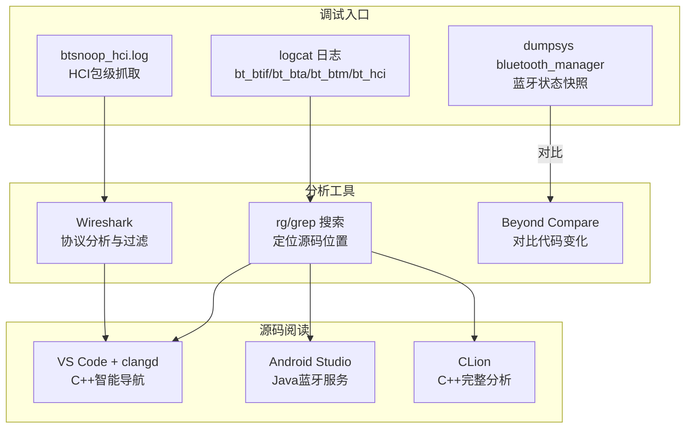
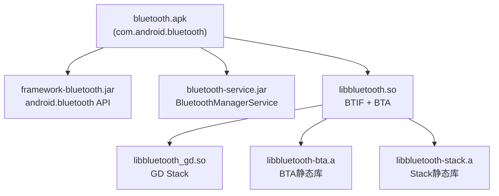
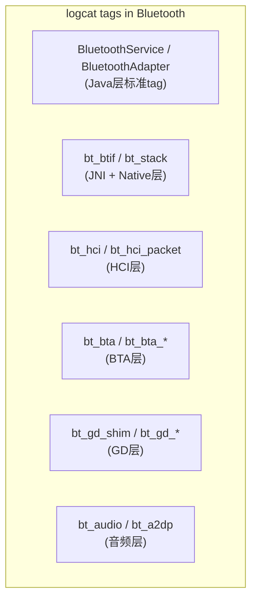
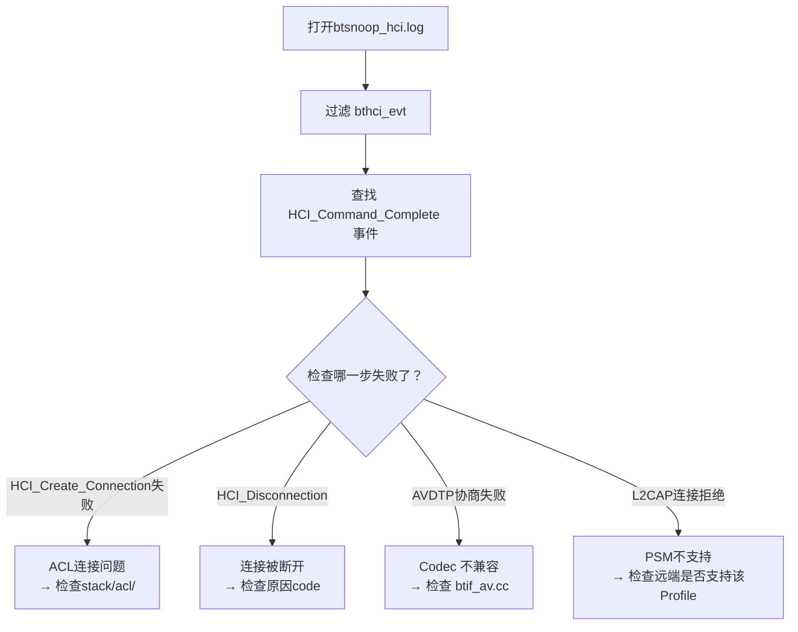

# 第2章：开发环境搭建与代码导航

> **难度**: ★★☆☆☆ | **前置知识**: Ch1 总体架构 | **C++依赖**: 低
> **预计阅读时间**: 2-3小时 | **预计学习天数**: 2-3天
> **核心作用**: 掌握高效阅读和调试蓝牙源码的方法

---

## 学习目标

- 配置好适合阅读蓝牙源码的IDE环境
- 掌握grep/find等命令行搜索技巧
- 理解Android.bp构建系统（能读懂蓝牙的构建规则）
- 掌握蓝牙日志分析（logcat + snoop log）
- 能用Wireshark分析蓝牙抓包
- 能从Log快速定位到源码位置

---

## 1. 调试工具架构总览



---

## 2. IDE环境搭建

### 1.1 推荐方案

Android蓝牙源码体积庞大（Java + C++ 混合），推荐**双IDE方案**：

```
┌──────────────┐     ┌──────────────┐
│ Android       │     │ CLion / VS   │
│ Studio        │     │ Code         │
├──────────────┤     ├──────────────┤
│ Java/Kotlin   │     │ C/C++        │
│ AIDL/Binder   │     │ (.cc/.h)     │
│ .java / .kt   │     │              │
│ 蓝牙Profile    │     │ BTIF/BTA     │
│ 服务层         │     │ Stack/GD     │
└──────────────┘     └──────────────┘
```

#### 方案A（推荐）：VS Code + clangd

```
工具链: VS Code + clangd + cmake-tools + gitlens
优点: 免费、轻量、C++支持好、能打开整个Bluetooth目录
```

**VS Code 插件清单**:

| 插件 | 用途 |
|------|------|
| `clangd` | C++智能补全/跳转/诊断（比C++ IntelliSense准确） |
| `GitLens` | Git blame/历史查看（看谁写的、为什么改） |
| `Markdown Preview Mermaid` | 预览本文档中的Mermaid图表 |
| `ccls` (备选) | C++ LSP服务端 |
| `Java Extension Pack` | Java基础支持 |
| `Rust (rust-analyzer)` | 如果看Rust代码 |

#### 方案B（备选）：Android Studio + CLion

```
Android Studio 看 Java 层
CLion 看 C++ 层
优点: 各自领域最专业的IDE
缺点: 两个IDE切换成本高
```

### 1.2 Android Studio 配置

对于蓝牙中的Java/Kotlin代码：

1. **导入方式**: File → Open → 选择 `Bluetooth/` 根目录
2. **Gradle 配置**: Android蓝牙源码走 AOSP 构建系统，AS只作为代码阅读器（不用于编译）
3. **关键操作**:
   - `Ctrl + N`: 搜索类（如 `BluetoothManagerService`）
   - `Ctrl + Shift + N`: 搜索文件
   - `Ctrl + Alt + ←/→`: 导航历史
   - `Ctrl + Shift + F`: 全局搜索

### 1.3 VS Code C++ 配置（clangd）

对于C++代码，推荐 VS Code + clangd，配置如下：

**`.vscode/settings.json`**:
```json
{
  "clangd.arguments": [
    "--background-index",
    "--compile-commands-dir=${workspaceFolder}/out",
    "--query-driver=D:\\path\\to\\clang.exe",
    "--header-insertion=never"
  ],
  "search.exclude": {
    "**/out/**": true,
    "**/.git/**": true
  },
  "files.associations": {
    "*.cc": "cpp",
    "*.h": "cpp"
  }
}
```

**生成 compile_commands.json**:
蓝牙AOSP代码需要先生成编译数据库。如果你有AOSP构建环境：
```bash
# 在AOSP根目录
source build/envsetup.sh
lunch <target>
make -j24 nothing
# 生成的 compile_commands.json 在 out/ 下
```

**如果没有完整构建环境**，至少配置以下 include path 让 clangd 能解析：

```
${workspaceFolder}/system
${workspaceFolder}/system/gd
${workspaceFolder}/system/include
${workspaceFolder}/system/stack/include
${workspaceFolder}/system/btif/include
```

### 1.4 代码搜索工具

VS Code 搜索固然好用，但命令行工具在某些场景更高效。

**ripgrep (rg)** — 必备神器（比 grep 快10倍）：

```bash
# 基础用法：搜索关键词
rg "BluetoothManagerService" --type java

# 搜索C++中的struct定义
rg "struct bt_interface_t" --type cc

# 只看文件列表（-l）
rg -l "event_init_stack"

# 结合上下文（-C 3 = 前后3行）
rg -C 3 "BT_STATE_ON" system/btif/

# 按文件类型过滤
rg "bta_dm_init" --type cc -g "!*test*"

# 搜索包含特定单词的文件
rg -w "bond_state" android/app/
```

**常用 rg 文件类型快捷方式**：

| 类型 | 匹配扩展名 | 示例 |
|------|-----------|------|
| `--type java` | `*.java` | `rg "BluetoothGatt" --type java` |
| `--type cc` | `*.c, *.h, *.cpp, *.hpp, *.cc, *.hh` | `rg "hci_layer" --type cc` |
| `--type rust` | `*.rs` | `rg "Gatt" --type rust` |
| `-g "*.aidl"` | AIDL文件 | `rg "IBluetooth" -g "*.aidl"` |

**fd** — 文件查找替代 find：

```bash
# 找文件
fd "stack_manager"
fd "bta_av_act"
fd -e java "HeadsetService"

# 忽略某些目录
fd "bluetooth" --exclude out --exclude .git
```

---

## 2. 构建系统理解

### 2.1 Android.bp 基础

Android蓝牙使用 **Blueprint/Soong** 构建系统（`.bp` 文件代替 Android.mk）。

**典型蓝牙 Android.bp 示例** (`system/btif/Android.bp` 风格):

```bp
cc_library_shared {
    name: "libbluetooth",
    defaults: ["fluoride_defaults"],

    srcs: [
        "src/bluetooth.cc",
        "src/btif_core.cc",
        "src/btif_dm.cc",
        "src/btif_hf.cc",
        "src/stack_manager.cc",
    ],

    shared_libs: [
        "libchrome",
        "liblog",
        "libbluetooth_gd",
    ],

    static_libs: [
        "libbluetooth-bta",
        "libbluetooth-stack",
    ],

    include_dirs: [
        "system/include",
        "system/btif/include",
        "system/stack/include",
    ],

    cflags: [
        "-DLOG_TAG=\"bt_btif\"",
        "-Wall",
        "-Werror",
    ],
}
```

### 2.2 关键构建目标

| 构建目标 | 类型 | 包含内容 | 位置 |
|---------|------|---------|------|
| `libbluetooth` | shared lib | BTIF + BTA 的C++代码 | `system/btif/` |
| `libbluetooth_gd` | shared lib | GD Stack代码 | `system/gd/` |
| `bluetooth` | APK | Java Profile Services + JNI | `android/app/` |
| `framework-bluetooth` | Java lib | Public API framework | `framework/` |
| `bluetooth-service` | Java lib | System service | `service/` |

### 2.3 构建产物依赖关系



### 2.4 Rust 构建（补充）

Android 16 蓝牙栈引入了 Rust 组件 (`system/rust/`)，通过 Cargo 和 `cxx` 桥接与 C++ 交互：

```toml
# system/rust/Cargo.toml
[dependencies]
cxx = "1.0"
```

```bash
# 构建 Rust 部分
cargo build
```

---

## 3. 蓝牙日志系统

### 3.1 logcat 日志体系

蓝牙使用 `log.h` (`system/include/log.h`) 定义的日志宏：

| 宏 | logcat tag | 说明 |
|----|-----------|------|
| `log::info()` | `bt_btif` | 信息 |
| `log::warn()` | `bt_btif` | 警告 |
| `log::error()` | `bt_btif` | 错误 |
| `log::fatal()` | `bt_btif` | 致命（会触发 crash） |
| `log::debug()` | `bt_btif` | 调试（需要 eng 版本） |

**各层的 log tag**：



**常用 logcat 过滤命令**:

```bash
# 只看蓝牙相关日志
adb logcat -s BluetoothService:* BluetoothAdapter:* bt_btif:* bt_stack:*

# 只看Native层日志
adb logcat -s bt_btif:* bt_stack:* bt_bta:* bt_gd_shim:*

# 带时间戳
adb logcat -v time -s bt_btif:*

# 保存到文件
adb logcat -s bt_btif:* > bluetooth_log.txt

# 只看错误
adb logcat -s bt_btif:* bt_stack:* *:E
```

### 3.2 蓝牙 Snoop Log 抓取

**Snoop Log** 是最强大的蓝牙调试工具——它会记录所有HCI命令、事件和数据的二进制日志，可以用 Wireshark 分析。

**启用方法**:

```bash
# 方法1：通过开发者选项
# 设置 → 开发者选项 → 启用蓝牙HCI信息收集日志

# 方法2：通过adb命令
adb shell svc bluetooth disable
adb shell setprop persist.bluetooth.btsnoopenable true
adb shell svc bluetooth enable

# 方法3：设置snoop log保存路径（Android 12+）
adb shell cmd bluetooth_manager enable-btsnoop
adb shell setprop persist.bluetooth.btsnooppath /data/misc/bluetooth/logs

# 获取snoop log文件
adb pull /data/misc/bluetooth/logs/btsnoop_hci.log .
```

**Snoop Log 文件位置**:

```
/data/misc/bluetooth/logs/
├── btsnoop_hci.log           ← 完整HCI日志
├── btsnoop_hci.log.old       ← 上一次的日志
└── bt_stack_conf.txt         ← 栈配置信息
```

### 3.3 日志级别动态调整

```bash
# 动态控制日志级别
adb shell setprop persist.log.tag.bt_btif V    # Verbose级别
adb shell setprop persist.log.tag.bt_stack D   # Debug级别

# 查看当前日志级别
adb shell getprop persist.log.tag.bt_btif
```

### 3.4 蓝牙抓包的另一种方式：HCI Tracing

对于分析 HCI 命令/事件交互流程：

```bash
# 使用 hcitool 实时查看
adb shell hcitool cmd 0x03 0x0003   # 发送HCI命令查看

# 使用 btmon（需要Floss Linux环境）
btmon
```

### 3.5 蓝牙进程信息

```bash
# 查看蓝牙进程
adb shell ps -A | grep bluetooth
# 输出: bluetooth  xxxxx  ...  com.android.bluetooth

# 查看蓝牙进程的线程
adb shell ps -T -p <bluetooth_pid> | grep bt

# 蓝牙调试 dump
adb shell dumpsys bluetooth_manager
```

---

## 4. Wireshark 蓝牙抓包分析

### 4.1 打开Snoop Log

```
Wireshark → File → Open → btsnoop_hci.log
```

### 4.2 常用过滤表达式

| 过滤表达式 | 说明 |
|-----------|------|
| `btl2cap` | 只看L2CAP包 |
| `btrfcomm` | 只看RFCOMM包 |
| `btatt` | 只看ATT（GATT）包 |
| `btsdp` | 只看SDP包 |
| `bthci_cmd` | 只看HCI命令 |
| `bthci_evt` | 只看HCI事件 |
| `btavdtp` | 只看AVDTP（A2DP）包 |
| `btsco` | 只看SCO语音包 |
| `btle` | 只看BLE相关包 |
| `btle_advertising` | 只看BLE广播包 |
| `btcommon` | 常见蓝牙包 |
| `btl2cap.cid == 0x0001` | 只看L2CAP信令通道 |
| `btrfcomm.dlci == 0` | 只看RFCOMM控制通道 |

### 4.3 实战分析流程

**例：分析A2DP连接失败**



### 4.4 关键HCI事件码速查

| 事件码 | 名称 | 说明 |
|-------|------|------|
| `0x01` | Inquiry Complete | 查询完成 |
| `0x02` | Inquiry Result | 查询到设备 |
| `0x04` | Disconnection Complete | 断开连接完成 |
| `0x05` | Authentication Complete | 认证完成 |
| `0x07` | Pin Code Request | PIN码请求（老设备） |
| `0x0E` | Command Complete | 命令完成（标准响应） |
| `0x0F` | Command Status | 命令状态（异步响应） |
| `0x10` | Hardware Error | 硬件错误 |
| `0x13` | Number of Completed Packets | 流控相关 |
| `0x3E` | LE Meta Event | BLE事件（需解析子事件码） |

---

## 5. 代码导航实战技巧

### 5.1 从Java API追踪到Native

当你在分析一个蓝牙功能时，从App层API出发追踪到C++层的通用方法：

**步骤模板**：

```
1. 找到Java API入口
   → BluetoothAdapter.methodName() / BluetoothHeadset.methodName()
   ↓ grep 调用链
2. 找到对应的Service实现
   → AdapterService / HeadsetService 等
   ↓ 搜索 NativeInterface 或 .cpp 文件
3. 找到JNI桥接文件
   → com_android_bluetooth_xxx.cpp
   ↓ 搜索 BTIF 函数
4. 找到BTIF层实现
   → btif_xxx.cc
   ↓ 搜索 BTA 函数
5. 找到BTA层实现
   → bta_xxx_act.cc / bta_xxx_api.cc
   ↓ 搜索 Stack API
6. 找到协议栈实现
   → system/stack/xxx/
```

> **一个具体的追踪演示例**：
> 从头像"连接A2DP"的代码路径
> `BluetoothA2dp.java:connect()` →
> `A2dpService.java:connect()` →
> `com_android_bluetooth_a2dp.cpp` →
> `btif_av.cc:btif_av_connect()` →
> `bta_av_api.cc:BTA_AvOpen()` →
> `bta_av_act.cc` →
> `stack/avdt/avdt_main.cc`

### 5.2 从Logcat回溯代码

当遇到蓝牙问题时的标准分析流程：

```bash
# 1. 抓取log
adb logcat -s bt_btif:* bt_stack:* bt_bta:* BluetoothService:* -v time

# 2. 找到关键错误行（如 "failed"、"error"、"unexpected"）
# 3. 根据log中的行号信息找到代码
# 4. 阅读上下文理解失败原因
```

**实际例子**:
```
04-10 14:23:45.123  1234  5678 E bt_btif: btif_av.cc:1234 btif_av_connect() 
  - device XX:XX:XX:XX:XX:XX is already connected
```
→ 到 `system/btif/src/btif_av.cc:1234` 查看连接检查逻辑

### 5.3 关键代码搜索模式

| 场景 | 搜索命令 |
|------|---------|
| 找某个Profile的服务实现 | `rg "class HeadsetService" --type java` |
| 找某个Profile的Native接口 | `rg "btif_hf" --type cc -g "!*test*"` |
| 找某个AIDL接口定义 | `rg "IBluetoothA2dp" -g "*.aidl"` |
| 找某个HCI命令定义 | `rg "HCI_CREATE_CONNECTION" --type cc` |
| 找状态机实现 | `rg "extends StateMachine" --type java` |
| 找某个回调定义 | `rg "btif_dm_sec_evt" --type cc` |

---

## 6. 调试技巧补充

### 6.1 通过Feature Flag控制行为

Android蓝牙使用 `aconfig` 控制特性开关，flag 文件在 `flags/` 目录：

```bash
# 查看一个flag的状态
adb shell device_config get bluetooth hfp_connection_retry

# 设置flag
adb shell device_config put bluetooth hfp_connection_retry true

# 列出所有蓝牙flags
adb shell device_config list bluetooth
```

关键flag文件：
```
flags/hfp.aconfig         ← HFP功能开关
flags/a2dp.aconfig        ← A2DP功能开关
flags/gatt.aconfig        ← GATT功能开关
flags/leaudio.aconfig     ← LE Audio开关
flags/le_advertising.aconfig ← LE广播开关
```

### 6.2 BT属性调试

```bash
# 查看当前蓝牙状态
adb shell dumpsys bluetooth_manager

# 查看蓝牙属性
adb shell dumpsys bluetooth_manager | grep -A 20 "Adapter Properties"

# 查看连接状态
adb shell dumpsys bluetooth_manager | grep -A 30 "Bonded Devices"
```

### 6.3 蓝牙进程crash分析

当 `com.android.bluetooth` 进程崩溃时：

```bash
# 查看crash堆栈
adb logcat -s AndroidRuntime:* bt_btif:* *:F

# 重启蓝牙服务（不用重启手机）
adb shell svc bluetooth disable && sleep 2 && adb shell svc bluetooth enable
```

---

## 7. 实战练习

### 练习1：配置开发环境

- [ ] 安装 VS Code 及 clangd 插件
- [ ] 配置 `settings.json` 包含蓝牙include路径
- [ ] 验证代码跳转（Ctrl+Click）能正常工作

> **答案**: settings.json中clangd要包含蓝牙的include路径：`--compile-commands-dir=${workspaceFolder}/out`。如没有AOSP编译环境，可使用bear生成compile_commands.json，或直接设置`-isystem`路径到蓝牙头文件目录：`system/include/`, `system/btif/include/`, `system/stack/include/`等。验证：Ctrl+Click点击`BluetoothAdapter.disable()`应跳转到声明处，点击JNI函数应跳转到C++实现。

### 练习2：追踪调用链

**任务**：找到 `BluetoothHeadset.connect()` 的完整Native调用链

**步骤**：
1. 在 `framework/` 中搜索 `BluetoothHeadset.java` 的 `connect` 方法
2. 跟踪到 `HeadsetService.java` 的实现
3. 跟踪到 JNI 文件 `com_android_bluetooth_hfp.cpp`
4. 跟踪到 `btif_hf.cc` 中的对应函数
5. 最终到 `bta_ag_api.cc` 的 `BTA_AgOpen()`

**产出**：画出一个8层的调用链图

> **答案**: 完整8层调用链: `BluetoothHeadset.connect(device)` → Binder → `HeadsetService.java:connect(device)` → `mJniNativeInterface.connect(device)` → JNI `connectNative()` → `btif_hf.cc:connect(device)` → `BTA_AgOpen(bd_addr, app_id)` → `bta_ag_api.cc:BTA_AgOpen()` → `bta_ag_sm_execute(BTA_AG_OPEN_EVT)` → RFCOMM/L2CAP连接。代码路径: `framework/java/android/bluetooth/BluetoothHeadset.java:456`, `app/src/.../hfp/HeadsetService.java:152`, `app/jni/com_android_bluetooth_hfp.cpp:465`, `system/btif/src/btif_hf.cc:1251`, `system/bta/ag/bta_ag_api.cc:112`。

### 练习3：抓包分析

- [ ] 启用蓝牙Snoop Log
- [ ] 执行一次连接蓝牙设备的操作
- [ ] 导出 `btsnoop_hci.log`
- [ ] 用Wireshark打开，分析连接过程

> **答案**: 启用：`adb shell settings put global bluetooth_btsnoop_log 1` 和 `adb shell settings put global bluetooth_btsnoop_dump 1`，然后重启蓝牙。操作完成后导出：`adb pull /data/misc/bluetooth/logs/btsnoop_hci.log`。在Wireshark中用过滤表达式 `bthci_cmd`查看发出的HCI命令，`bthci_evt`查看HCI事件。分析连接过程时关注：`HCI_Create_Connection`→`Command Complete(Status)`→`HCI_Connection_Complete`→L2CAP连接请求→SDP查询→Profile连接。可参考Wireshark的"Follow Bluetooth Stream"功能便捷跟踪整个连接。

### 练习4：logcat过滤实战

```bash
# 请执行并分析输出
adb logcat -s bt_btif:* bt_stack:* -v time | grep -i "fail\|error\|warn"
```

> **答案**: `bt_btif:` 和 `bt_stack:` 是蓝牙最重要的两个日志标签。`bt_btif:` 覆盖BTIF层的事件（Profile连接/断开、设备管理），`bt_stack:` 覆盖协议栈核心层（BTM安全、L2CAP、GATT）。"-v time"显示时间戳便于时序分析。`grep -i "fail\|error\|warn"`过滤出异常信息。常见输出：`bt_btif:E/hf-l2c: L2CAP connection failed`表示HFP的L2CAP连接失败；`bt_stack:E/btm_sec: btm_sec_check_pending_enc`表示加密过程异常。根据log中的文件标签(如hf-l2c, btm_sec)能精确定位到源码位置。

---

## 车载场景调试提示

车载蓝牙调试中，以下几个logcat标签特别重要：

```bash
# 车载HFP通话问题
adb logcat -s bt_btif_hf:* bt_bta_ag:* bt_btm:* bta_hf_client:* -v time

# 车载A2DP多音源切换
adb logcat -s bt_btif_av:* bt_bta_av:* BtA2dp:* -v time

# 车载蓝牙共存问题 (A2DP+HFP+BLE同时工作)
adb logcat -s bt_btm:* bt_hci:* bt_btif:* -v time | grep -E "sniff|poll|interval"

# 车载BT唤醒/功耗
adb shell dumpsys bluetooth_manager | grep -i "wake\|sniff\|active"
```

---

## 本章总结

学完本章后，你应该能：
- 配置VS Code + clangd + AOSP编译环境，实现蓝牙代码的跳转和补全
- 使用`adb logcat -s bt_btif:* bt_stack:*`过滤蓝牙日志，定位关键事件
- 启用BTSnoop Log并导出btsnoop_hci.log，用Wireshark分析HCI协议包
- 使用`svc bluetooth disable/enable`快速重启蓝牙服务
- 在Android 16的`flags/*.aconfig`中查看和切换蓝牙功能开关
- 根据Snoop Log中的HCI事件判断连接失败的具体阶段

> 掌握这些工具和技巧是后续章节源码阅读的基础。下一章我们将从C++基础开始，帮助你跨越Java到C++的障碍。

---

## 车载场景

车载蓝牙开发与标准Android开发在环境配置上有以下差异：

### 1. 车机系统调试特殊性
- 车机通常使用**Android Automotive OS (AAOS)**，而非手机Android
- 调试需要通过车载以太网或专用调试接口，而非USB
- 日志输出可能通过车载CAN总线或专用诊断接口

### 2. 车载Snoop Log获取
- 车机蓝牙日志通常持久化存储在`/data/misc/bluetooth/logs/`
- 车载系统可能配置了自动上传日志到云端诊断平台
- 使用`adb bugreport`可获取完整的车载蓝牙诊断信息

### 3. 车载编译环境
- 车厂通常有定制的AOSP分支，包含车载蓝牙扩展
- 需要在车厂提供的编译服务器上构建，而非本地
- 使用`lunch`选择车厂特定的target（如`car_x86_64-userdebug`）

---

## 相关章节

- **蓝牙抓包分析**：[第15章HCI/HAL层](15_HCI_HAL.md)的Snoop Log原理
- **车载调试命令与排查方案**：[第19章](19_Automotive_Scenarios.md)
- **AIDL接口设计**：[第5章Service层](05_Service_Layer.md)

---

## 参考文件清单

| 文件 | 作用 |
|------|------|
| `system/include/log.h` | 日志宏定义 |
| `system/gd/hal/snoop_logger.cc` | Snoop日志实现 |
| `flags/*.aconfig` | 全套配置文件 |
| `system/doc/directory_layout.md` | 目录结构说明 |
| `system/doc/power_management.md` | 电源管理文档 |
| `system/gd/docs/architecture/architecture.md` | GD架构文档 |


| **V8 深度分析报告** | |
| V8_Log_Analysis.md | 见该报告完整分析 |
| V8_Dumpsys_Analysis.md | 见该报告完整分析 |

> **下一步**: 阅读 [第3章：C++基础 for Bluetooth开发者](03_Cpp_Foundation.md)
