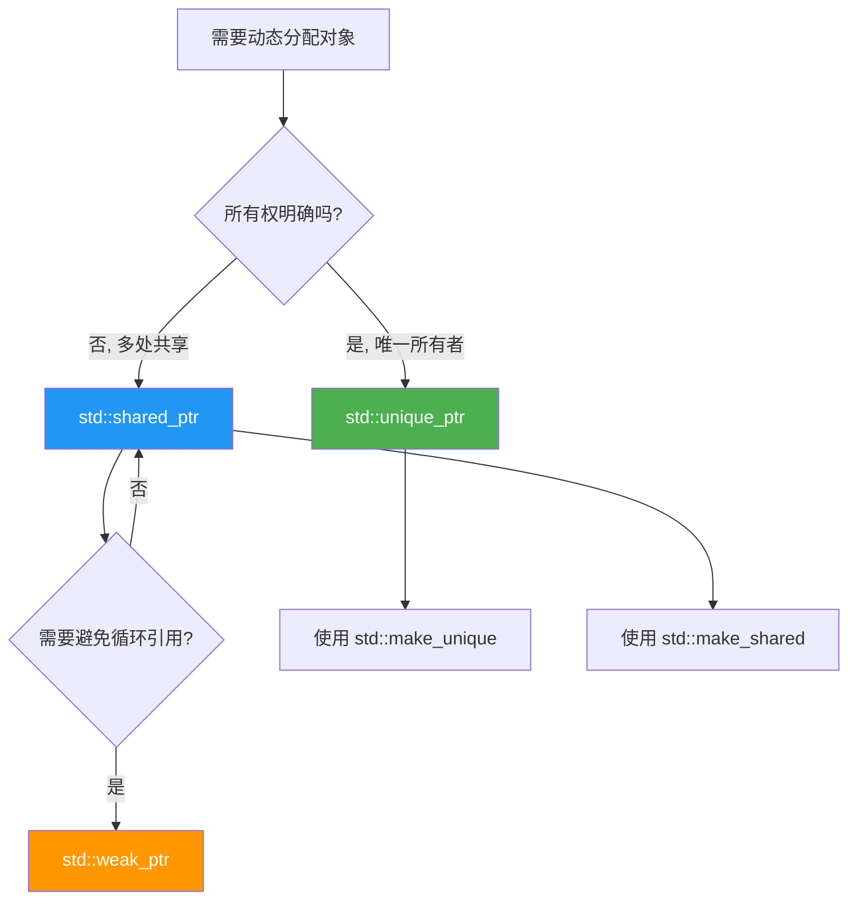
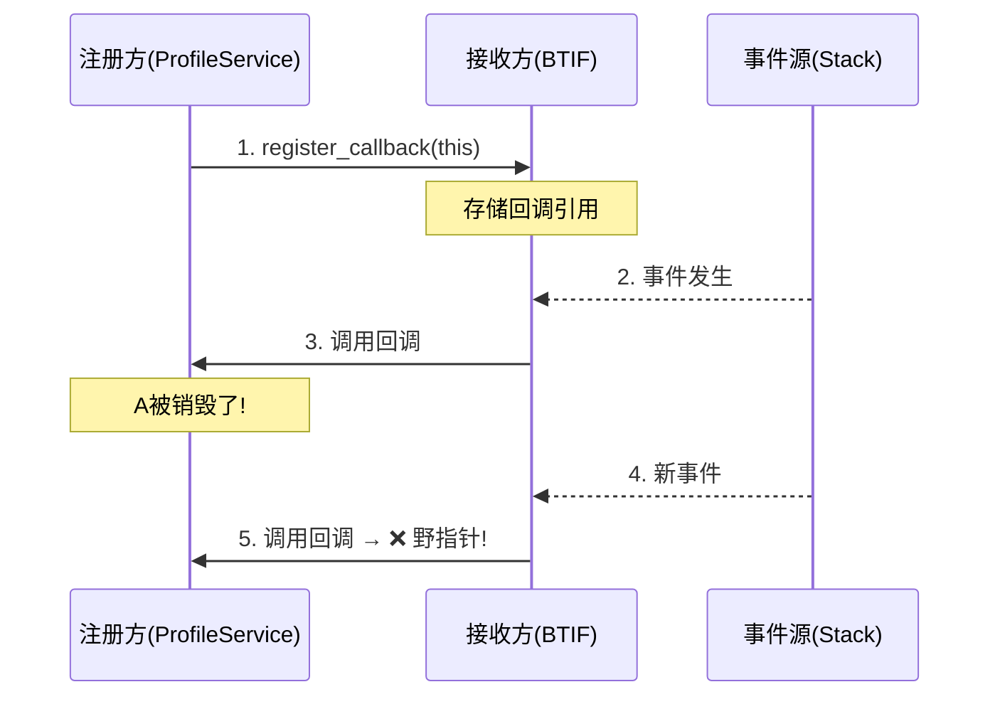
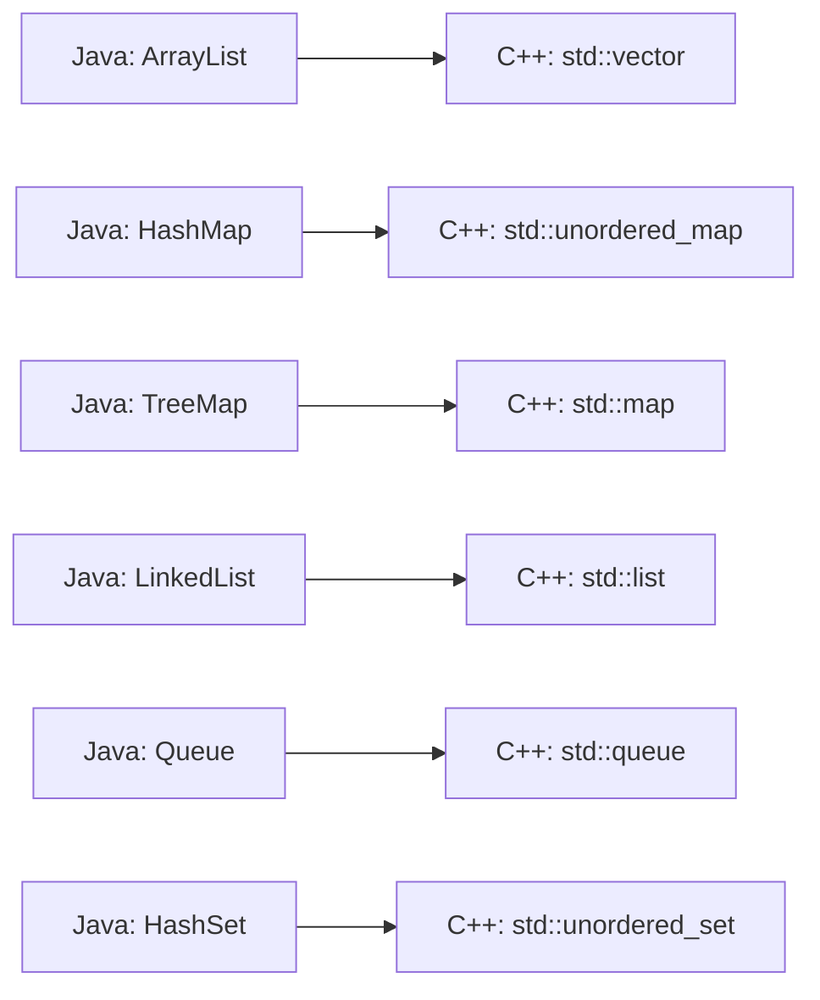
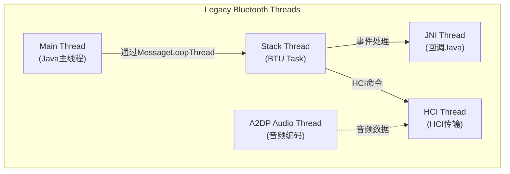
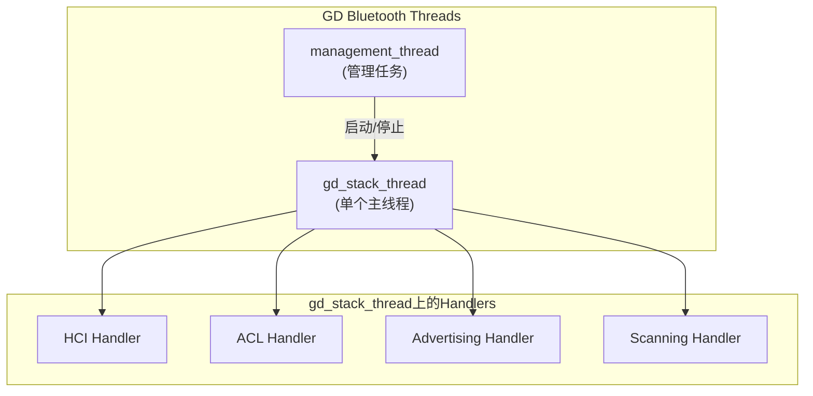

# 第3章：C++基础 for Bluetooth开发者

> **难度**: ★★★☆☆ | **前置知识**: Ch2, 有Java编程经验 | **C++依赖**: 核心
> **预计阅读时间**: 5-7小时 | **预计学习天数**: 5-7天
> **核心作用**: 跨越Java到C++的鸿沟，能独立阅读和理解蓝牙源码

---

## 学习目标

- 理解C++与Java的核心差异，建立C++思维模型
- 掌握蓝牙源码中高频使用的C++特性（智能指针、回调、Lambda）
- 理解消息循环和Handler机制（类比Android Java Handler）
- 能独立分析一个C++函数调用链，理解其内存行为
- 读懂蓝牙源码中Legacy C风格和Modern C++风格的代码

---

## 阅读指南

本章是专门为**有Java基础的C++新手**写的。每节都以"Java类比"开始，然后引入C++的对应概念，最后用**蓝牙源码真实例子**巩固。

| 如果你对以下Java概念熟悉 | 可以直接跳到 |
|-------------------------|-------------|
| 类/接口/继承 | 3.1 (重点看差异) |
| ArrayList/HashMap | 3.3 |
| Thread/synchronized | 3.4 |
| Handler/Looper | 3.5 (蓝牙GD Handler) |
| Lambda/Callback | 3.2 |

---

## 3.1 C++核心语法速通（Java视角）

### 3.1.1 类与对象

**Java → C++ 概念映射**：

```
Java                      C++
─────────────────────────────────────
class Foo                class Foo {}
new Foo()                new Foo() 或 Foo{}
Foo obj = new Foo()      Foo* obj = new Foo() 或 Foo obj{}

没有析构函数              ~Foo() 析构函数
interface                virtual class (纯虚类)
extends                  : public BaseClass
implements               : public BaseClass (C++无专门接口关键字)
@Override                override (关键字, C++11+)
final (class)            final (C++11+)
```

### 3.1.2 头文件（.h）与实现文件（.cc）分离

这是C++区别于Java的**最直观差异**。Java一个文件定义一个类，C++通常分为两个文件：

**`bta_ag_api.h`** — 声明（头文件）：
```cpp
// 告诉编译器"有这样的东西存在"
class BtaAg {
 public:
  // 函数声明（只声明不实现）
  static void Open(const RawAddress& addr);
  static void Close(const RawAddress& addr);

 private:
  static bool is_opened_;
};
```

**`bta_ag_api.cc`** — 实现（源文件）：
```cpp
// 具体实现
#include "bta_ag_api.h"  // 包含自己的头文件

bool BtaAg::is_opened_ = false;  // 静态成员初始化

void BtaAg::Open(const RawAddress& addr) {
  is_opened_ = true;
  // 实际的打开逻辑...
}

void BtaAg::Close(const RawAddress& addr) {
  is_opened_ = false;
  // 关闭逻辑...
}
```

> **蓝牙源码特点**: `system/bta/include/bta_api.h` 是最大的公共头文件之一，定义了BTA层的所有API函数声明。对应的实现在 `system/bta/*/bta_*_act.cc` 中。

### 3.1.3 指针与引用

**指针**：存储地址的变量（类似Java引用，但更底层）
**引用**：变量的别名（更安全，不能为空，不能重新绑定）

```cpp
// ────── 指针 (Pointer) ──────
int value = 42;
int* ptr = &value;   // ptr 存储 value 的地址
*ptr = 100;          // 通过指针修改value（解引用）
// ptr 可以指向别处, 也可以是 nullptr

// ────── 引用 (Reference) ──────
int value = 42;
int& ref = value;    // ref 是 value 的别名
ref = 100;           // 直接修改value
// ref 不能重新绑定, 一定不为空
```

**蓝牙源码中的选择**：
- **Legacy代码**（`system/stack/`）偏好指针：`void bta_dm_act(RawAddress* addr)`
- **GD代码**（`system/gd/`）偏好引用：`void Start(os::Handler* handler, const Module& module)`
- 区别：指针可为空表示可选参数，引用保证必有值

### 3.1.4 const 修饰符

C++的 `const` 比Java的 `final` 强大得多。蓝牙代码中大量使用：

```cpp
const int MAX_CONNECTIONS = 7;                    // 常量

void Process(const RawAddress& addr);              // 承诺不修改addr
// ↑ 蓝牙中最常见的用法：const 引用传递参数（避免拷贝，又保证不改）

const RawAddress* GetDevice();                     // 返回常量指针（不可通过返回值修改对象）
RawAddress* const GetDevice();                     // 常量指针（指针本身不可改，但可修改指向的对象）

class Foo {
  int GetState() const;                            // 常量成员函数：不修改对象状态
  // ↑ 在GD代码中非常常见
};
```

**蓝牙实例** (`system/gd/hci/hci_layer.h`)：
```cpp
class HciLayer {
 public:
  // const 引用传递参数: 高效且安全
  void EnqueueCommand(const std::vector<uint8_t>& packet);
  // const 成员函数: 不修改对象状态
  bool IsEnabled() const;
};
```

### 3.1.5 nullptr vs NULL vs 0

```cpp
// C++11 后用 nullptr（类型安全）
void* ptr = nullptr;     // 正确 ✓
void* ptr = NULL;        // 兼容C，但可能歧义
void* ptr = 0;           // 不推荐

// 检查空指针
if (ptr != nullptr) { /* 安全使用 */ }
if (ptr) { /* 等价于 ptr != nullptr */ }
```

---

## 3.2 智能指针（蓝牙源码最重要的C++特性）

> **为什么重要**: 蓝牙源码大量动态分配对象（设备、连接、回调等），智能指针自动管理生命周期，避免内存泄漏。GD代码强制使用，Legacy代码逐步迁移中。

### 3.2.1 std::unique_ptr — 独占所有权

类比Java的局部对象引用（一个对象只能被一个变量持有）。

```cpp
#include <memory>

// 创建（C++14起推荐用 make_unique）
auto device = std::make_unique<RemoteDevice>();

// 使用和普通指针一样
device->Connect();

// 所有权转移（std::move）
auto other = std::move(device);  // device 现在为空
// 不能拷贝: auto other = device;  // 编译错误！
```

**蓝牙源码实例** (`system/gd/hal/snoop_logger.h`):
```cpp
class SnoopLogger {
 public:
  // 返回 unique_ptr: 调用者拥有对象
  static std::unique_ptr<SnoopLogger> Create();
};
```

**GD Stack中的使用** (`system/main/shim/stack.cc`):
```cpp
struct Stack::impl {
  // socket_hal_ 被 stack 独占拥有
  std::unique_ptr<hal::SocketHal> socket_hal_ = nullptr;
  std::unique_ptr<lpp::LppOffloadManager> lpp_offload_manager_ = nullptr;
  
  ~impl() {
    // 析构时自动释放，无需手动delete
    if (lpp_offload_manager_) lpp_offload_manager_.reset();
    if (socket_hal_) socket_hal_.reset();
  }
};
```

### 3.2.2 std::shared_ptr — 共享所有权

类比Java的普通对象引用（多个变量共享同一对象）。

```cpp
auto device = std::make_shared<RemoteDevice>();
{
  auto another_ref = device;  // 引用计数+1 (可以拷贝)
  another_ref->Connect();
  // 离开作用域, another_ref 销毁, 引用计数-1
}
// device 仍然存活
// 当所有 shared_ptr 都销毁时, 对象自动释放
```

### 3.2.3 std::weak_ptr — 弱引用

用来解决shared_ptr循环引用的问题。类似Java的WeakReference。

```cpp
class DeviceManager {
  std::vector<std::weak_ptr<Device>> devices_;  // 弱引用,不影响生命周期
  
  bool IsDeviceValid(const std::weak_ptr<Device>& wp) {
    if (auto sp = wp.lock()) {  // 尝试提升为shared_ptr
      return sp->IsConnected();
    }
    return false;  // 对象已被释放
  }
};
```

### 3.2.4 蓝牙中智能指针的使用原则



---

## 3.3 std::function、Lambda 与回调模式

> **为什么重要**: 蓝牙是**事件驱动**的——硬件产生事件，通过回调逐层传递到上层。理解回调模式是理解蓝牙源码的关键。

### 3.3.1 Lambda 表达式（匿名函数）

**Java Lambda**:
```java
// Java
button.setOnClickListener(v -> handleClick());
```

**C++ Lambda**:
```cpp
// C++ 基础语法
[capture](parameters) -> return_type { body }

// 蓝牙源码中的实际用法
auto callback = [this]() {
  this->on_connection_complete();
};

// 捕获列表详解
[]           // 不捕获任何外部变量
[&]          // 按引用捕获所有外部变量
[=]          // 按值捕获所有外部变量
[this]       // 捕获当前对象的this指针
[&x, y]      // x按引用, y按值
```

### 3.3.2 std::function — 可调用对象包装器

> `std::function` 可以存储任何可调用对象：函数、lambda、bind表达式、函数指针。

**Java类比**：
```java
// Java 中使用接口实现回调
interface Callback { void onEvent(int code); }
void register(Callback cb) { ... }
```

**C++方式**:
```cpp
#include <functional>

// 定义一个可以存储"int参数，void返回"的可调用对象
std::function<void(int)> callback;

// 可以赋值为lambda
callback = [](int code) { log::info("Event: {}", code); };

// 可以赋值为函数指针
void myHandler(int code);
callback = myHandler;

// 调用
callback(42);
```

### 3.3.3 蓝牙回调模式实战

蓝牙中最常见的模式：**注册回调 + 事件触发 + 回调执行**。

**BTIF层的回调接口** (`system/btif/include/bluetooth.h`):
```cpp
// 定义回调函数类型
using adapter_state_changed_callback = std::function<void(bt_state_t state)>;

struct core_callbacks_t {
  // 存储回调函数
  adapter_state_changed_callback invoke_adapter_state_changed_cb;
  // ... 更多回调
};
```

**注册和使用** (`system/btif/src/bluetooth.cc`):
```cpp
// 注册回调（通常在初始化时）
void register_callbacks(core_callbacks_t* callbacks) {
  g_callbacks = callbacks;
}

// 触发回调（事件发生时）
void on_adapter_state_changed(bt_state_t new_state) {
  if (g_callbacks && g_callbacks->invoke_adapter_state_changed_cb) {
    g_callbacks->invoke_adapter_state_changed_cb(new_state);
    // 调用JNI层的回调函数，通知Java端
  }
}
```

**GD层使用common::Bind** (`system/gd/os/handler.cc`):
```cpp
// 使用 Bind 生成回调（类似 std::bind 但更安全）
reactable_ = thread_->GetReactor()->Register(
    event_->Id(),
    common::Bind(&Handler::handle_next_event, common::Unretained(this)),
    common::Closure());
//   ↑ 绑定this指针（不持有所有权的原始指针）
```

**common::BindOnce 与 common::Unretained**：
```cpp
// BindOnce: 只能调用一次的回调（右值语义）
// Unretained: 传递原始指针，不增加引用计数（调用者保证指针有效）
common::BindOnce(&RepeatingTimer::CancelClosure,
                 base::Unretained(this), std::move(promise));
```

### 3.3.4 回调生命周期管理

这是C++蓝牙开发最容易出错的地方：



**解决方案**：
1. **销毁前注销回调**：`unregister_callback()` （Legacy方式）
2. **使用weak_ptr**：回调持有weak_ptr，调用前lock检查
3. **使用common::Unretained** + 保证生命周期（GD方式，需明确约定）

---

## 3.4 RAII惯用法

> **Resource Acquisition Is Initialization** — 资源获取即初始化。
> 这是C++独有的资源管理哲学，Java没有直接等价物。

### 3.4.1 核心思想

```cpp
class BluetoothSocket {
 public:
  BluetoothSocket() {
    // 构造函数中获取资源
    fd_ = open("/dev/bluetooth", O_RDWR);
  }

  ~BluetoothSocket() {
    // 析构函数中释放资源（RAII的核心！）
    if (fd_ >= 0) close(fd_);
  }

  void Send(const uint8_t* data, size_t len) {
    write(fd_, data, len);
  }

 private:
  int fd_;  // 文件描述符
};

// 使用
{
  BluetoothSocket socket;  // 打开资源
  socket.Send(data, len);
}  // 离开作用域 → 析构函数自动关闭
```

**Java对比**：
```java
// Java 需要 try-finally 手动释放
BluetoothSocket socket = new BluetoothSocket();
try {
    socket.send(data);
} finally {
    socket.close();  // 必须手动调用
}
```

### 3.4.2 std::lock_guard — RAII锁管理

蓝牙源码中最常见的RAII使用：

```cpp
void ProcessData() {
  // 构造时加锁
  std::lock_guard<std::mutex> lock(mutex_);
  // 访问共享资源...
  shared_data_.push_back(new_data);
  // 析构时自动解锁
}
```

**相当于Java的**:
```java
synchronized (this) {
  sharedData.add(newData);
}
```

**蓝牙源码实例** (`system/gd/os/handler.cc`):
```cpp
void Handler::Post(OnceClosure closure) {
  {
    // RAII 自动加解锁
    std::lock_guard<std::mutex> lock(mutex_);
    if (was_cleared()) {
      log::warn("Posting to a handler which has been cleared");
      return;
    }
    tasks_->emplace(std::move(closure));
  }  // 离开作用域自动解锁
  event_->Notify();
}
```

### 3.4.3 蓝牙中的RAII模式总结

| 资源类型 | C++ RAII封装 | 蓝牙使用场景 |
|---------|-------------|-------------|
| 互斥锁 | `std::lock_guard`, `std::unique_lock` | `handler.cc`, `stack.cc` |
| 文件描述符 | `unique_fd` | Socket操作 |
| 动态内存 | `std::unique_ptr`, `std::shared_ptr` | 全栈广泛使用 |
| 定时器 | `Alarm` 对象 | `RepeatingTimer` |
| Handler生命周期 | `Handler::Clear()` | GD Handler清理 |

---

## 3.5 STL容器

### 3.5.1 Java → C++容器映射



### 3.5.2 std::vector 详解

蓝牙中最常用的容器。类似Java的ArrayList，但更轻量。

```cpp
#include <vector>

// 创建
std::vector<int> codes;
std::vector<int> codes = {1, 2, 3};  // 初始化列表（C++11）
std::vector<RawAddress> devices(10); // 预分配10个元素

// 常用操作
codes.push_back(42);        // 末尾添加
codes.pop_back();            // 末尾移除
codes.size();                // 大小
codes.empty();               // 是否为空
codes[0];                    // 下标访问（不检查越界）
codes.at(0);                 // 下标访问（越界抛异常）
codes.clear();               // 清空

// 遍历（范围for，C++11起）
for (const auto& code : codes) {
  log::info("Code: {}", code);
}

// 传统迭代器
for (auto it = codes.begin(); it != codes.end(); ++it) {
  log::info("Code: {}", *it);
}
```

**蓝牙实例** — std::vector 作为HCI包数据：
```cpp
// system/gd/hci/hci_layer.cc
void HciLayer::EnqueueCommand(std::vector<uint8_t> packet) {
  // std::vector<uint8_t> 非常适合表示二进制数据包
  command_queue_.push(std::move(packet));
  // ↑ std::move 避免拷贝
}
```

### 3.5.3 std::unordered_map — 哈希表

类似Java的HashMap。

```cpp
#include <unordered_map>

// 蓝牙中常用: 用地址做key查找设备
std::unordered_map<RawAddress, DeviceInfo> devices;

// 添加/更新
devices[address] = DeviceInfo{...};  // 不存在则插入，存在则覆盖
devices.insert({address, info});     // 存在则不插入

// 查找
auto it = devices.find(address);
if (it != devices.end()) {
  DeviceInfo& info = it->second;  // it->first = key, it->second = value
}

// 删除
devices.erase(address);
```

**蓝牙实例** (`system/gd/hci/le_advertising_manager_impl.cc` 风格):
```cpp
// 用 unordered_map 管理多个广播实例
std::unordered_map<uint16_t, std::unique_ptr<AdvertisingSet>> advertising_sets_;
```

### 3.5.4 蓝牙特有数据结构

Legacy代码（`system/osi/`）中有C风格的数据结构，了解即可：

**fixed_queue_t** — 阻塞队列（C语言实现，非STL）：
```c
// 系统/osi/include/fixed_queue.h
fixed_queue_t* queue = fixed_queue_new(10);
fixed_queue_enqueue(queue, data_ptr);
void* data = fixed_queue_dequeue(queue);  // 队列为空则阻塞
fixed_queue_free(queue, free_cb);
```

**list_t** — 链表：
```c
list_t* list = list_new( free_cb );
list_append(list, data);
list_prepend(list, data);
```

> **提示**: Legacy C代码正在逐步迁移到C++ STL。新代码（GD）**直接使用** `std::queue`, `std::vector`, `std::unordered_map`。

---

## 3.6 多线程与同步

### 3.6.1 std::thread — C++线程

```cpp
#include <thread>

void worker_function() {
  log::info("Running in worker thread");
}

// 启动线程
std::thread worker(worker_function);

// 等待线程结束
worker.join();

// 分离线程（让它在后台运行）
worker.detach();
```

### 3.6.2 std::mutex 与 std::lock_guard — 互斥锁

**Java类比**：
```java
// Java
synchronized (this) { ... }
// 或
Lock lock = new ReentrantLock();
lock.lock();
try { ... } finally { lock.unlock(); }
```

**C++**:
```cpp
#include <mutex>

std::mutex mutex_;

void SafeFunction() {
  // lock_guard: 构造时加锁，析构时解锁（RAII）
  std::lock_guard<std::mutex> lock(mutex_);
  // 访问共享资源...
}
```

**进阶：std::unique_lock**（支持手动解锁、延迟加锁）：
```cpp
std::unique_lock<std::mutex> lock(mutex_, std::defer_lock);
// ... 做一些不需要锁的事 ...
lock.lock();  // 手动加锁
// 访问共享资源
lock.unlock();  // 手动解锁
```

### 3.6.3 std::condition_variable — 条件变量

用于线程间等待/通知。类比Java的 `wait()/notify()`。

```cpp
#include <condition_variable>

std::mutex mutex_;
std::condition_variable cv_;
bool event_occurred_ = false;

// 等待线程
std::unique_lock<std::mutex> lock(mutex_);
cv_.wait(lock, [this]() { return event_occurred_; });
// 当 event_occurred_ == true 时继续执行

// 通知线程
{
  std::lock_guard<std::mutex> lock(mutex_);
  event_occurred_ = true;
}
cv_.notify_one();  // 唤醒一个等待线程
```

**蓝牙实例** — stack_manager中的future等待:
```cpp
// system/btif/src/stack_manager.cc
static void event_init_stack(std::promise<void> promise, ...) {
  // ... 初始化工作 ...
  promise.set_value();  // 通知等待方完成
}

static void init_stack(...) {
  std::promise<void> promise;
  auto future = promise.get_future();
  
  // 在另一线程执行初始化
  event_init_stack(std::move(promise), interface);
  
  future.wait();  // 阻塞等待初始化完成（同步等待）
}
```

### 3.6.4 蓝牙中的线程模型

**Legacy蓝牙的线程**:



**GD蓝牙的线程** (更少线程，更清晰):



---

## 3.7 蓝牙消息循环机制

### 3.7.1 MessageLoopThread

蓝牙的Legacy代码使用 `MessageLoopThread` 实现消息循环。

**Java类比**:
```java
// Android Java 的 HandlerThread
HandlerThread thread = new HandlerThread("bt_worker");
thread.start();
Handler handler = new Handler(thread.getLooper());
handler.post(() -> doWork());
```

**C++ MessageLoopThread** (`system/common/message_loop_thread.h`):
```cpp
#include "common/message_loop_thread.h"

// 创建消息循环线程
MessageLoopThread thread("bt_worker");
thread.StartUp();

// 投递任务到该线程
thread.DoInThread(base::BindOnce(&MyClass::DoWork, base::Unretained(this)));

// 延迟投递
thread.DoInThreadDelayed(
    base::BindOnce(&MyClass::DoLater, base::Unretained(this)),
    std::chrono::milliseconds(100));

// 关闭线程
thread.ShutDown();
```

**蓝牙实际用法** (`system/btif/src/stack_manager.cc`):
```cpp
// 创建栈管理线程
static MessageLoopThread management_thread("bt_stack_manager_thread");

// 投递初始化任务到管理线程
static void event_init_stack(std::promise<void> promise,
                             bluetooth::core::CoreInterface* interface) {
  // 在 management_thread 上执行
  init_stack_internal(interface);
  promise.set_value();
}
```

### 3.7.2 GD Handler 机制

GD代码实现了类似Android Java Handler的机制：

```cpp
// system/gd/os/handler.h
namespace bluetooth::os {

class Handler {
 public:
  // 构造: 绑定到指定线程
  Handler(Thread* thread);

  // 投递任务（类比 Java 的 handler.post()）
  void Post(OnceClosure closure);

  // 延迟投递（类比 Java 的 handler.postDelayed()）
  bool PostWithDelay(OnceClosure closure, std::chrono::milliseconds delay);

  // 清空所有待处理任务
  void Clear();
};

}  // namespace bluetooth::os
```

**Java vs C++ Handler 对比**:

```
┌────────────────────────────────────┬────────────────────────────────────┐
│ Java (android.os.Handler)         │ C++ (bluetooth::os::Handler)      │
├────────────────────────────────────┼────────────────────────────────────┤
│ Handler(Looper)                    │ Handler(Thread*)                  │
│ handler.post(runnable)             │ handler.Post(OnceClosure)         │
│ handler.postDelayed(runnable, ms)  │ handler.PostWithDelay(closure, ms)│
│ handler.removeCallbacks()          │ handler.Clear()                   │
│ Looper.loop()                      │ Reactor (底层事件循环)            │
└────────────────────────────────────┴────────────────────────────────────┘
```

**GD Stack中的使用** (`system/main/shim/stack.cc`):
```cpp
void Stack::StartEverything() {
  // 创建真实线程
  stack_thread_ = new os::Thread("gd_stack_thread",
                                  os::Thread::Priority::REAL_TIME);
  // 在线程上创建 Handler（类似创建绑定线程的Handler）
  stack_handler_ = new os::Handler(stack_thread_);

  // 管理线程（也创建 Handler）
  management_thread_ = new Thread("management_thread",
                                   Thread::Priority::NORMAL);
  management_handler_ = new Handler(management_thread_);

  // 通过Handler投递任务到管理线程
  management_handler_->Post(
      common::BindOnce(&Stack::handle_start_up,
                       common::Unretained(this),
                       std::move(promise)));
}
```

### 3.7.3 为什么GD要自己实现Handler？

1. **避免依赖Android Framework**: GD可在Linux上独立运行（Floss项目）
2. **更清晰的依赖**: 每个模块显式声明依赖的Handler
3. **可测试性**: Handler可被mock，便于单元测试
4. **性能**: 减少线程数量，降低锁竞争

### 3.7.4 JNI 线程模型（V8）

蓝牙中有一个特殊的 `bt_jni_thread`，它使用 `MessageLoopThread` 实现，专门用于 JNI 回调中转：

```cpp
// btif_jni_task.cc:40 — JNI 线程声明
static bluetooth::common::MessageLoopThread jni_thread("bt_jni_thread");

// btif_jni_task.cc:108 — 跨线程投递
bt_status_t do_in_jni_thread(base::OnceClosure task) {
    if (!jni_thread.DoInThread(task)) {
        return BT_STATUS_FAIL;
    }
    return BT_STATUS_SUCCESS;
}
```

**线程切换全景**：App 线程 → Binder → bt_jni_thread → BT Main Thread → BTU/gd_stack_thread，回调反向。这是蓝牙中层数最多的线程切换路径，理解它就能理解整个蓝牙的异步架构。

> 详见 [V8_HAL_JNI_Analysis.md](V8_HAL_JNI_Analysis.md) §3 JNI 线程模型（271 行）

---

## 3.8 Legacy vs Modern — 蓝牙中的两种C++风格

蓝牙代码库中存在两种风格并存的代码，需要学会识别：

### 3.8.1 Legacy C风格（system/stack/, system/osi/）

```c
// 特征:
// 1. C语言风格，甚至不用C++类
// 2. 函数指针代替 std::function
// 3. 裸指针代替智能指针
// 4. 自定义数据结构代替 STL
// 5. 手动内存管理

typedef struct {
  uint8_t* data;
  size_t length;
} BUFFER_Q;

// 函数指针回调
typedef void (*tBTA_DM_SEC_CBACK)(tBTA_DM_SEC_EVT event,
                                   tBTA_DM_SEC* p_data);

// 手动内存管理
void process(void* data) {
  BUFFER_Q* buf = (BUFFER_Q*)malloc(sizeof(BUFFER_Q));
  buf->data = (uint8_t*)malloc(256);
  // ... 使用 ...
  free(buf->data);  // 必须手动释放！
  free(buf);
}
```

### 3.8.2 Modern C++风格（system/gd/）

```cpp
// 特征:
// 1. C++17/20 标准
// 2. 智能指针管理生命周期
// 3. std::function 回调
// 4. STL容器
// 5. RAII资源管理
// 6. 命名空间
// 7. 结构化绑定

namespace bluetooth::hci {

class HciLayer {
 public:
  using CommandCallback = std::function<void(CommandCompleteView)>;

  void EnqueueCommand(std::vector<uint8_t> packet,
                      CommandCallback callback) {
    // std::move高效的转移所有权
    command_queue_.emplace(std::move(packet), std::move(callback));
  }
  
 private:
  // 存储在优先队列中
  std::queue<std::pair<std::vector<uint8_t>, CommandCallback>> command_queue_;
};

}  // namespace bluetooth::hci
```

### 3.8.3 两种风格并存的原因

```
Legacy Stack (保持稳定)         GD Stack (新开发)
    ↓                               ↓
C风格, 难以维护              现代C++, 易于维护
大量裸指针, 容易泄漏          智能指针, 自动管理
函数指针回调                  std::function, lambda
自定义数据结构                STL容器
手动内存管理                  RAII
宏和#if/#ifdef                constexpr/if constexpr

     ↕                           ↕
        Shim 层 (main/shim/)
        桥接两种风格
```

---

## 3.9 GD中的现代C++特性（C++17/20）

对于C++初学者，先了解这些特性以便读懂GD代码即可。

### 3.9.1 auto 类型推导

```cpp
// 让编译器自动推导类型
auto device = std::make_unique<Device>();  // auto → std::unique_ptr<Device>
auto addr = RawAddress::kAny;              // auto → RawAddress
const auto& devices = GetDevices();        // const auto& → const std::vector<Device>&
```

### 3.9.2 结构化绑定 (C++17)

```cpp
// 旧方式
auto pair = std::make_pair(addr, device);
auto addr = pair.first;
auto device = pair.second;

// 结构化绑定
auto [addr, device] = std::make_pair(addr, device);
// 简化map遍历
for (const auto& [addr, info] : device_map) {
  log::info("Device {}: connected={}", addr, info.connected);
}
```

### 3.9.3 nullptr_t 和 optional (C++17)

```cpp
#include <optional>

// 表示可能不存在的值
std::optional<RawAddress> maybe_address;

// 使用
if (maybe_address.has_value()) {
  RawAddress addr = maybe_address.value();
}
maybe_address = RawAddress({0x11, 0x22, 0x33, 0x44, 0x55, 0x66});
maybe_address.reset();  // 清空
```

### 3.9.4 override 和 final

```cpp
class Base {
  virtual void Process() = 0;  // 纯虚函数 = Java abstract
};

class Derived : public Base {
  void Process() override {     // override 明确表示重写（编译检查）
    // ...
  }
};

class FinalClass final {        // final 禁止继承（= Java final class）
  // ...
};
```

### 3.9.5 枚举类 (enum class)

```cpp
// 旧方式（C）
typedef enum { STATE_OFF, STATE_ON } bt_state_t;

// 新方式（C++11）
enum class AdapterState : uint8_t {
  OFF = 0,
  TURNING_ON = 1,
  ON = 2,
  TURNING_OFF = 3,
};

// 使用
AdapterState state = AdapterState::ON;
// 类型安全: 不会意外和int混用
```

---

## 3.10 常见陷阱与调试

### 3.10.1 悬垂指针 （最常见Bug！）

```cpp
// ❌ 错误
Device* GetDevice() {
  Device device;  // 局部对象
  return &device; // 返回局部变量的地址——函数返回后device销毁！
}                 // 指针变成悬垂指针

// ✅ 正确
Device* GetDevice() {
  return new Device();  // 堆上分配，或
}
Device GetDevice() {    // 返回值拷贝，或
  return Device{};
}
std::unique_ptr<Device> GetDevice() {  // 智能指针
  return std::make_unique<Device>();
}
```

### 3.10.2 内存泄漏

```cpp
// ❌ 旧代码可能写
void process() {
  tBTA_DM_SEC* p_data = (tBTA_DM_SEC*)malloc(sizeof(tBTA_DM_SEC));
  // 使用...
  // 忘记 free(p_data) → 内存泄漏！
}

// ✅ 好的做法
void process() {
  auto p_data = std::make_unique<tBTA_DM_SEC>();
  // 离开作用域自动释放
}
```

### 3.10.3 线程安全

```cpp
// ❌ 竞态条件
std::vector<int> data;

void Thread1() {
  data.push_back(1);  // 非原子操作
}

void Thread2() {
  data.push_back(2);  // 同时修改 → 未定义行为！
}

// ✅ 加锁
std::mutex mutex;
std::vector<int> data;

void Thread1() {
  std::lock_guard<std::mutex> lock(mutex);
  data.push_back(1);
}

void Thread2() {
  std::lock_guard<std::mutex> lock(mutex);
  data.push_back(2);
}
```

### 3.10.4 混淆指针和引用

```cpp
// 功能相似，但语义不同
void ByPointer(RawAddress* addr) {
  if (addr != nullptr) { /* 安全检查 */ }
}

void ByReference(RawAddress& addr) {
  // 保证addr有效，无需检查
}

// 蓝牙中的选择:
// 参数可为空 → 指针 (RawAddress*)
// 参数不可为空 → const引用 (const RawAddress&) 
// 需要修改 → 非const引用 (RawAddress&)
```

---

## 3.11 实战练习

### 练习1：解读蓝牙代码

阅读 `system/main/shim/stack.cc` 中的 `Stack::impl` 结构体：

```cpp
// 请回答以下问题:
// 1. hci_layer_ 和 controller_ 为什么按成员顺序这么排列？（依赖关系）
// 2. socket_hal_ 为什么使用 unique_ptr？
// 3. ~impl() 中为什么要 reset()？
```

> **答案**: ① `controller_` 依赖 `hci_layer_` 获取HCI命令接口，所以 `hci_layer_` 必须先初始化，成员按声明顺序构造，因此 `hci_layer_` 排在 `controller_` 前面。② `socket_hal_` 使用 `unique_ptr` 表示独占所有权——栈模块拥有并管理 `SocketHal` 实例的完整生命周期，不允许其它模块共享。③ `~impl()` 中 `reset()` 确保在 `impl` 析构时按逆序释放成员（`unique_ptr`析构时自动delete），避免依赖对象先于被依赖对象释放导致悬垂指针。

### 练习2：回调链分析

在 `system/btif/src/stack_manager.cc` 中：

```cpp
// 1. 找到 event_signal_stack_up 函数
// 2. 它是如何被调用到的（追溯调用链）
// 3. 它在哪个线程上执行？
```

> **答案**: ① `event_signal_stack_up()` 在 `stack_manager.cc:176`。② 调用链：`StackManager::StartUp()` → `start_up_state_client_` → `StartStateMachine::process_event(STACK_UP_EVT)` → `StackManager::on_hcii_server_ready()` → `event_signal_stack_up()`。③ 它在 `StackManager` 的 state machine 线程上执行，该线程由 `MessageLoopThread` 管理（在 `stack_manager.cc:80` 定义），不是主线程也不是BTU线程。可通过 `message_loop_thread_->DoInThread(...)` 确认。

### 练习3：智能指针实践

```cpp
// 阅读 system/gd/hci/hci_layer.h 和 .cc:
// 1. 哪些成员使用 unique_ptr？
// 2. 哪些参数使用 const 引用？
// 3. 回调函数的类型是什么？
```

> **答案**: ① `unique_ptr`成员：`command_queue_` (`CommandQueue`)，`acl_manager_` (`AclManager`)，`state_machine_` (`StateMachine`)。② `const`引用参数：`GetAclManager()`返回`const AclManager&`，所有Getter返回值如`const hci::Address&`，以及`RegisterEventCallback(event_code, const CommandCallback&)`中的命令回调参数。③ 回调函数类型：`using EventCallback = std::function<void(EventView)>;`，`using CommandCallback = std::function<void(CommandCompleteView)>;`，都是接受特定View类型的`std::function`。

### 练习4：翻译

将以下Java代码翻译为C++：
```java
class ConnectionManager {
    private HashMap<String, Device> devices = new HashMap<>();
    
    public void connect(String address) {
        Device device = devices.get(address);
        if (device != null && !device.isConnected()) {
            device.connect();
        }
    }
    
    public interface Callback {
        void onConnected(String address);
    }
    
    private Callback callback;
    
    public void setCallback(Callback cb) {
        this.callback = cb;
    }
}
```

> 答案可参考 `system/btif/src/btif_dm.cc` 中的实现模式。

> **答案**: C++翻译(参考`btif_dm.cc`风格)：
> ```cpp
> class ConnectionManager {
>   public:
>     using Callback = std::function<void(const RawAddress&)>;
> 
>     void Connect(const RawAddress& address) {
>         auto it = devices_.find(address);
>         if (it != devices_.end() && !it->second->IsConnected()) {
>             it->second->Connect();
>         }
>     }
> 
>     void SetCallback(Callback cb) {
>         callback_ = std::move(cb);
>     }
> 
>   private:
>     // HashMap → std::map，Device → unique_ptr表示独占所有权
>     std::map<RawAddress, std::unique_ptr<Device>> devices_;
>     Callback callback_;
> };
> ```
> 对比Java的关键区别：① C++用`std::map`替代`HashMap`；② 使用`unique_ptr`管理Device生命周期（明确所有权）；③ 使用`std::function`替代Java接口回调；④ 参数用`const &`传递避免拷贝；⑤ `find()`返回迭代器而非null，需检查`!= .end()`。

---

## 本章总结

```
学完本章后，你应该能：
┌──────────────────────────────────────────────────────┐
│ ✓ 区分头文件和实现文件，知道#include的作用             │
│ ✓ 理解指针vs引用，能在蓝牙代码中正确识别                │
│ ✓ 识别unique_ptr/shared_ptr/weak_ptr                   │
│ ✓ 读懂std::function回调 + lambda的实际代码              │
│ ✓ 理解RAII（看到lock_guard知道是自动加解锁）             │
│ ✓ 看懂蓝牙的消息循环和Handler机制                       │
│ ✓ 区分Legacy C风格和Modern C++风格的代码               │
│ ✓ 识别常见陷阱（悬垂指针、内存泄漏、竞态条件）           │
└──────────────────────────────────────────────────────┘
```

但最重要的是：**你不必一次性掌握所有C++知识**。先理解本章的内容，然后在阅读后续章节的蓝牙源码过程中，遇到不懂的C++特性随时回来查阅。

---

## 车载场景

车载蓝牙协议栈的C++开发有以下特殊性：

### 1. 车规级C++编码规范
- 车厂通常要求遵循**MISRA C++**或**AUTOSAR C++14**编码规范
- 禁止使用异常（exceptions）、RTTI、动态内存分配（new/delete）在实时路径中
- 蓝牙协议栈的`system/stack/`目录大量使用Legacy C风格代码，正是为了满足车规要求

### 2. 实时性要求
- HFP通话音频路径（SCO）的延迟必须<20ms，否则通话质量下降
- BLE车钥匙解锁响应延迟必须<500ms，否则用户体验差
- 这要求C++代码避免不必要的内存分配和锁竞争

### 3. 功能安全（ASIL）
- 车规蓝牙模块可能需要达到**ASIL-B**等级
- 关键路径（如蓝牙开关、配对、音频路由）需要进行FMEA分析
- GD架构的模块化设计（Handler/ContextualCallback）使得单元测试覆盖率可提升到90%+，满足ASIL要求

---

## 相关章节

- **GD架构的现代C++17/20应用**：[第14章GD架构](14_GD_Architecture.md)
- **C Legacy风格代码对比**：[第8章BTIF](08_BTIF_Layer.md)
- **实战练习对照代码**：`btif_dm.cc`和`hci_layer.h`

---

## 参考文件清单

| 文件 | C++知识点 |
|------|----------|
| `system/main/shim/stack.cc` | 智能指针、Handler、线程、结构化绑定 |
| `system/gd/os/handler.cc` | Handler机制、锁、lambda回调、延迟队列 |
| `system/btif/src/stack_manager.cc` | 回调模式、future/promise、消息循环 |
| `system/common/message_loop_thread.cc` | 消息循环线程实现 |
| `system/common/repeating_timer.cc` | 定时器、BindOnce、线程调度 |
| `system/osi/include/fixed_queue.h` | Legacy C风格API（对比现代C++） |
| `system/include/hardware/bluetooth.h` | C风格回调定义、枚举、结构体 |
| **V8 深度分析报告** | |
| `V8_HAL_JNI_Analysis.md` | JNI 线程模型 + do_in_jni_thread / CallbackEnv 模式 |
| `V8_Architecture_Map.md` | 17线程全景表（理解蓝牙多线程架构的关键） |

> **下一步**: 阅读 [第4章：公共API框架](04_Public_API_Framework.md)
