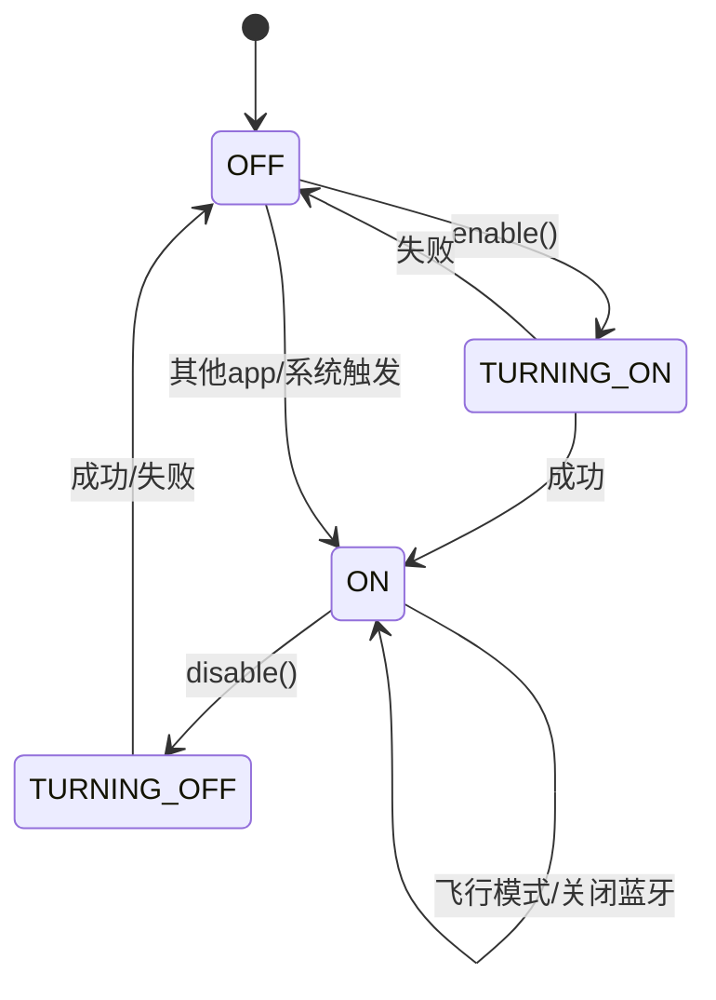
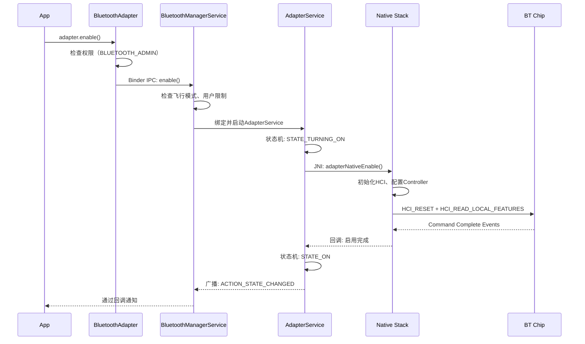
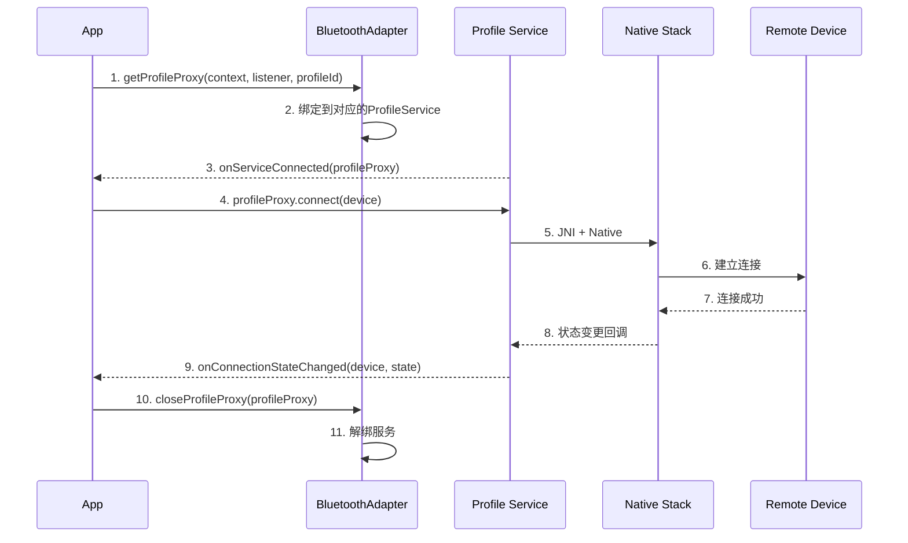
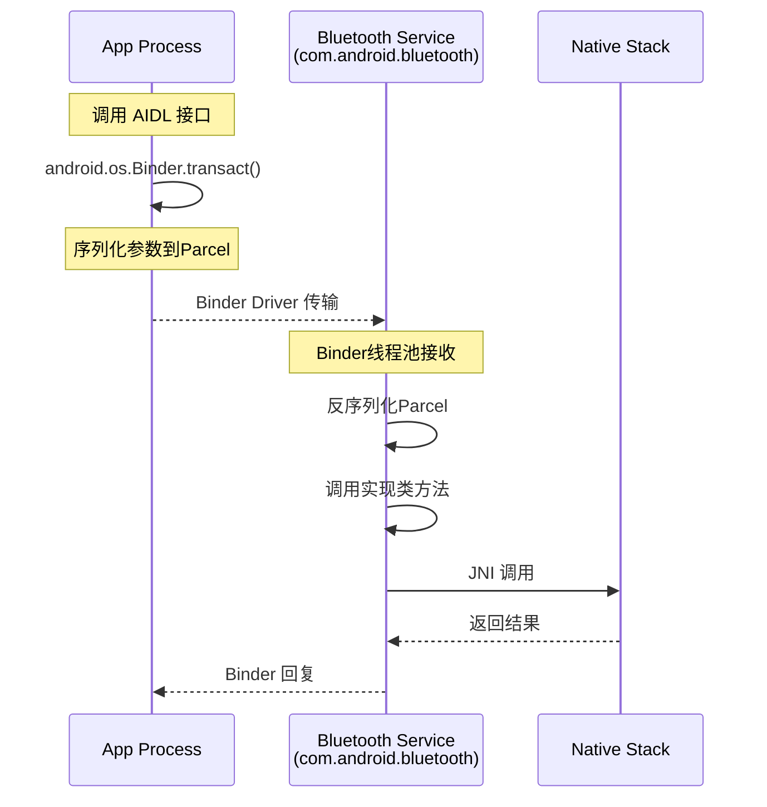
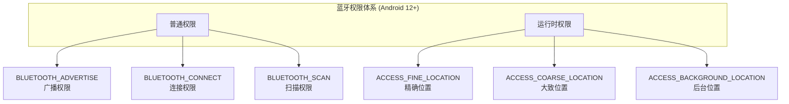

# 第4章：公共API框架 (framework/)

> **难度**: ★★☆☆☆ | **前置知识**: Ch1 | **C++依赖**: 无
> **预计阅读时间**: 2-3小时 | **预计学习天数**: 3-4天
> **核心作用**: 掌握 Android 蓝牙公共 API 的设计体系

---

## 学习目标

- 掌握 android.bluetooth 包的核心类关系
- 理解 BluetoothAdapter 的状态机和生命周期
- 掌握 BluetoothDevice 的地址类型和绑定状态
- 理解 Profile API 体系的设计模式
- 能从 App 开发者视角理解 SDK API 的设计取舍

---

## 1. 包结构总览

`framework/java/android/bluetooth/` 包含约93个Java文件，构成 Android 蓝牙 SDK 的完整 API。

### 1.1 核心类层级

```mermaid
graph TB
    subgraph "App获取蓝牙的入口"
        BluetoothManager["BluetoothManager<br/>getSystemService(BLUETOOTH)"]
    end

    subgraph "核心API"
        BluetoothAdapter["BluetoothAdapter<br/>全局唯一的适配器"]
        BluetoothDevice["BluetoothDevice<br/>远端蓝牙设备"]
        BluetoothServerSocket["BluetoothServerSocket<br/>服务端Socket"]
        BluetoothSocket["BluetoothSocket<br/>客户端Socket"]
        BluetoothClass["BluetoothClass<br/>设备类型"]
    end

    subgraph "Profile API"
        BluetoothProfile["BluetoothProfile (interface)"]
        BluetoothA2dp["BluetoothA2dp"]
        BluetoothHeadset["BluetoothHeadset"]
        BluetoothHidHost["BluetoothHidHost"]
        BluetoothPan["BluetoothPan"]
        BluetoothMap["BluetoothMap"]
        BluetoothPbap["BluetoothPbap"]
        BluetoothGatt["BluetoothGatt"]
        BluetoothLeAudio["BluetoothLeAudio"]
    end

    subgraph "BLE子包"
        BLE["android.bluetooth.le"]
        Scanner["BluetoothLeScanner"]
        Advertiser["BluetoothLeAdvertiser"]
        ScanResult["ScanResult"]
        ScanRecord["ScanRecord"]
        AdvertisingSet["AdvertisingSet"]
    end

    BluetoothManager -->|getAdapter| BluetoothAdapter
    BluetoothAdapter -->|getRemoteDevice| BluetoothDevice
    BluetoothAdapter -->|listenUsingRfcommWithServiceRecord| BluetoothServerSocket
    BluetoothAdapter -->|getProfileProxy| BluetoothProfile
    BluetoothAdapter -->|getBluetoothLeScanner| Scanner
    BluetoothAdapter -->|getBluetoothLeAdvertiser| Advertiser
    BluetoothDevice -->|createRfcommSocketToServiceRecord| BluetoothSocket
    BluetoothProfile --- BluetoothA2dp
    BluetoothProfile --- BluetoothHeadset
    BluetoothProfile --- BluetoothHidHost
    BluetoothProfile --- BluetoothPan
    BluetoothProfile --- BluetoothMap
    BluetoothProfile --- BluetoothPbap
    BluetoothProfile --- BluetoothGatt
    BluetoothProfile --- BluetoothLeAudio
    BLE --- Scanner
    BLE --- Advertiser
    BLE --- ScanResult
    BLE --- ScanRecord
```



### 1.2 类职责速览

| 类 | 职责 | 获取方式 |
|----|------|---------|
| `BluetoothManager` | 系统服务入口 | `Context.getSystemService()` |
| `BluetoothAdapter` | 蓝牙适配器（开关、扫描等） | `BluetoothManager.getAdapter()` |
| `BluetoothDevice` | 表示一个远程设备 | 扫描结果 / `getRemoteDevice()` |
| `BluetoothSocket` | 蓝牙Socket连接 | `device.createRfcommSocket()` |
| `BluetoothServerSocket` | 服务端监听Socket | `adapter.listenUsingRfcomm()` |
| `BluetoothClass` | 设备类型 | `device.getBluetoothClass()` |
| `BluetoothGatt` | BLE GATT客户端 | `device.connectGatt()` |
| `BluetoothProfile` | Profile接口基类 | `adapter.getProfileProxy()` |

---

## 2. BluetoothAdapter 深度分析

### 2.1 获取实例

`BluetoothAdapter` 是**单例模式**，通过 `BluetoothManager` 获取：

```java
// 标准获取方式
BluetoothManager manager = (BluetoothManager) context.getSystemService(Context.BLUETOOTH_SERVICE);
BluetoothAdapter adapter = manager.getAdapter();
```

### 2.2 状态机详解

蓝牙适配器有 4 个状态，定义在 `BluetoothAdapter.java` 中：

```java
// framework/java/android/bluetooth/BluetoothAdapter.java
public static final int STATE_OFF = 10;           // 蓝牙关闭
public static final int STATE_TURNING_ON = 11;    // 正在打开
public static final int STATE_ON = 12;             // 蓝牙已开启
public static final int STATE_TURNING_OFF = 13;   // 正在关闭
```

**状态转换图**：



### 2.3 核心操作

```java
// 启用蓝牙
adapter.enable();                 // 静默开启
adapter.enableBLE();              // 仅开启BLE（Android 5+）

// 禁用蓝牙
adapter.disable();

// 扫描
adapter.startDiscovery();         // 经典蓝牙发现
adapter.cancelDiscovery();

// 获取状态
adapter.isEnabled();              // STATE == STATE_ON
adapter.getState();               // 返回当前状态
adapter.getScanMode();            // 扫描模式（可发现性）

// 本地信息
adapter.getName();                // 蓝牙名称
adapter.getAddress();             // MAC地址（Android 10+ 需要权限）
adapter.getBluetoothLeAdvertiser();  // BLE广播器
adapter.getBluetoothLeScanner();     // BLE扫描器
```

### 2.4 enable() 调用链（回顾Ch1的时序图）



### 2.5 BLE扫描API详解

```java
// 获取BLE扫描器
BluetoothLeScanner scanner = adapter.getBluetoothLeScanner();

// 配置扫描参数
ScanSettings settings = new ScanSettings.Builder()
    .setScanMode(ScanSettings.SCAN_MODE_LOW_LATENCY)  // 低延迟（高功耗）
    .setReportDelay(0)                                  // 实时报告
    .build();

// 配置过滤条件
List<ScanFilter> filters = new ArrayList<>();
filters.add(new ScanFilter.Builder()
    .setServiceUuid(ParcelUuid.fromString("0000180F-0000-1000-8000-00805F9B34FB"))
    .build());

// 启动扫描
ScanCallback callback = new ScanCallback() {
    @Override
    public void onScanResult(int callbackType, ScanResult result) {
        ScanRecord record = result.getScanRecord();
        byte[] manufacturerData = record.getManufacturerSpecificData(0x0075);
        // 处理扫描结果
    }
    @Override
    public void onScanFailed(int errorCode) {
        // 扫描失败处理
    }
};

scanner.startScan(filters, settings, callback);

// 停止扫描
scanner.stopScan(callback);
```

---

## 3. BluetoothDevice 详解

### 3.1 地址类型

```java
// framework/java/android/bluetooth/BluetoothDevice.java
public class BluetoothDevice {
    // 地址类型
    public static final int DEVICE_TYPE_CLASSIC = 1;   // 经典蓝牙 (BR/EDR)
    public static final int DEVICE_TYPE_LE = 2;         // 低功耗蓝牙 (BLE)
    public static final int DEVICE_TYPE_DUAL = 3;       // 双模
    public static final int DEVICE_TYPE_UNKNOWN = 0;    // 未知

    // 地址格式
    @Retention(RetentionPolicy.SOURCE)
    @IntDef(flag = true, value = {
        AddressType.PUBLIC,
        AddressType.RANDOM,
        AddressType.PUBLIC_IDENTITY,
        AddressType.RANDOM_STATIC,
        AddressType.RANDOM_RESOLVABLE,
        AddressType.RANDOM_NON_RESOLVABLE,
    })
    
    public @interface AddressType {
        int PUBLIC = 0;
        int RANDOM = 1;
        int PUBLIC_IDENTITY = 2;
        int RANDOM_STATIC = 3;
        int RANDOM_RESOLVABLE = 4;
        int RANDOM_NON_RESOLVABLE = 5;
    }
}
```

### 3.2 绑定状态

```java
// 绑定状态
public static final int BOND_NONE = 10;       // 未绑定
public static final int BOND_BONDING = 11;    // 正在绑定
public static final int BOND_BONDED = 12;     // 已绑定

// 检查绑定状态
int bondState = device.getBondState();
if (bondState == BluetoothDevice.BOND_BONDED) {
    // 已配对，可以直接连接
}

// 发起绑定
device.createBond();  // 触发配对流程
```

### 3.3 常用操作

```java
// 获取设备信息
String name = device.getName();             // 设备名称（可能为null）
String address = device.getAddress();       // MAC地址
int type = device.getType();                // CLASSIC/LE/DUAL
BluetoothClass btClass = device.getBluetoothClass();  // 设备类型

// 连接Profile
BluetoothHeadset headset = ...;
headset.connect(device);

// 创建RFCOMM Socket
BluetoothSocket socket = device.createRfcommSocketToServiceRecord(uuid);
socket.connect();  // 阻塞调用

// 查询UUID
ParcelUuid[] uuids = device.getUuids();  // 已缓存的UUID
```

---

## 4. Profile API体系

### 4.1 API设计模式

所有 Profile 都遵循相同的设计模式：



### 4.2 主要Profile API一览

| Profile | API类 | 核心功能 |
|---------|-------|---------|
| HFP | `BluetoothHeadset` | 免提电话、AT命令、SCO音频 |
| A2DP | `BluetoothA2dp` | 音乐播放、Codec协商 |
| AVRCP | `BluetoothAvrcpController` | 播放控制、元数据 |
| HID | `BluetoothHidHost` | 键盘/鼠标 |
| PAN | `BluetoothPan` | 网络共享 |
| MAP | `BluetoothMapClient` | 消息访问 |
| PBAP | `BluetoothPbapClient` | 联系人同步 |
| GATT | `BluetoothGatt` | BLE通用属性 |
| LE Audio | `BluetoothLeAudio` | LE音频 |
| HAP | `BluetoothHapClient` | 助听器 |
| CSIP | `BluetoothCsipSetCoordinator` | 协调集标识 |

### 4.3 A2DP API实例

```java
// 获取A2DP Profile代理
adapter.getProfileProxy(context, new ServiceListener() {
    @Override
    public void onServiceConnected(int profile, BluetoothProfile proxy) {
        BluetoothA2dp a2dp = (BluetoothA2dp) proxy;
        
        // 获取已连接的设备
        List<BluetoothDevice> devices = a2dp.getConnectedDevices();
        
        // 连接
        a2dp.connect(device);
        
        // 获取当前Codec
        BluetoothCodecStatus codecStatus = a2dp.getCodecStatus(device);
        BluetoothCodecConfig codecConfig = codecStatus.getCodecConfig();
        int codecType = codecConfig.getCodecType(); // SBC/AAC/aptX/LDAC
    }

    @Override
    public void onServiceDisconnected(int profile) {
        // Profile服务断开
    }
}, BluetoothProfile.A2DP);
```

---

## 5. AIDL接口体系

AIDL（Android Interface Definition Language）是Java层与Service层之间的IPC桥梁。

### 5.1 核心AIDL文件

```
android/app/aidl/android/bluetooth/
├── IBluetooth.aidl           ← 核心蓝牙接口
├── IBluetoothCallback.aidl   ← 蓝牙状态回调
├── IBluetoothA2dp.aidl       ← A2DP接口
├── IBluetoothHeadset.aidl    ← HFP接口
├── IBluetoothGatt.aidl       ← GATT接口
├── IBluetoothSocketManager.aidl ← Socket管理
├── IBluetoothPan.aidl        ← PAN接口
├── IBluetoothMap.aidl        ← MAP接口
├── IBluetoothLeAudio.aidl    ← LE Audio接口
├── ...（约60个AIDL文件）
```

### 5.2 IBluetooth.aidl 示例

```java
// android/app/aidl/android/bluetooth/IBluetooth.aidl
interface IBluetooth {
    boolean enable();
    boolean disable();
    int getState();
    String getAddress();
    String getName();
    boolean setName(String name);
    
    // 设备管理
    boolean createBond(BluetoothDevice device, int transport);
    boolean cancelBondProcess(BluetoothDevice device);
    boolean removeBond(BluetoothDevice device);
    
    // 扫描
    boolean startDiscovery();
    boolean cancelDiscovery();
    boolean isDiscovering();
    
    // 注册回调
    void registerCallback(IBluetoothCallback callback);
    void unregisterCallback(IBluetoothCallback callback);
}
```

### 5.3 Binder IPC 数据流



---

## 6. 权限模型

### 6.1 Android 12+ 细粒度蓝牙权限

Google 在 Android 12 引入了精细化的蓝牙权限模型：



### 6.2 权限对应注解

```java
// framework/java/android/bluetooth/annotations/
@RequiresBluetoothConnectPermission     // 需要 BLUETOOTH_CONNECT
@RequiresBluetoothScanPermission         // 需要 BLUETOOTH_SCAN
@RequiresBluetoothAdvertisePermission    // 需要 BLUETOOTH_ADVERTISE
@RequiresBluetoothLocationPermission     // 需要 ACCESS_FINE_LOCATION
@RequiresLegacyBluetoothAdminPermission  // 需要 BLUETOOTH_ADMIN（传统）
```

### 6.3 权限检查流程

```java
// BluetoothAdapter.java 中的权限检查
public boolean enable() {
    // 1. 注解方式声明
    @RequiresPermission(android.Manifest.permission.BLUETOOTH_CONNECT)
    
    // 2. 运行时检查
    if (checkCallingOrSelfPermission(BLUETOOTH_CONNECT) != PERMISSION_GRANTED) {
        throw new SecurityException("Need BLUETOOTH_CONNECT permission");
    }
    
    // 3. Binder IPC传递权限
    mService.enable(mAttributionSource);
}
```

### 6.1 API → 权限映射（V8）

> 来源：`V8_Permission_Analysis.md` §4 — 基于 Android 12+ 实际权限检查源码

| API | 所需权限 | Android 12+ 替代 |
|-----|---------|-----------------|
| `startScan()` | `BLUETOOTH_SCAN` + `ACCESS_FINE_LOCATION` | `ACCESS_FINE_LOCATION` |
| `startAdvertising()` | `BLUETOOTH_ADVERTISE` | `BLUETOOTH` |
| `connectGatt()` | `BLUETOOTH_CONNECT` | `BLUETOOTH_ADMIN` |
| `createBond()` | `BLUETOOTH_CONNECT` | `BLUETOOTH_ADMIN` |
| `getConnectedDevices()` | `BLUETOOTH_CONNECT` | `BLUETOOTH` |
| `getBondedDevices()` | `BLUETOOTH_CONNECT` | `BLUETOOTH` |
| `enable()` | `BLUETOOTH_CONNECT` | `BLUETOOTH_ADMIN` |
| `listenUsingRfcomm()` | `BLUETOOTH_CONNECT` | `BLUETOOTH` |
| `getProfileProxy()` | `BLUETOOTH_CONNECT` | `BLUETOOTH` |

**典型失败模式**：
- 扫描返回空：未声明 `BLUETOOTH_SCAN` + 未授予 `ACCESS_FINE_LOCATION`
- `SecurityException`: 调用 `connectGatt()` 但未声明 `BLUETOOTH_CONNECT`
- 系统 API 调用失败：非系统应用使用 `@SystemApi` 方法（需 `BLUETOOTH_PRIVILEGED`）

> 完整权限分析见 [V8_Permission_Analysis.md](V8_Permission_Analysis.md)（145 行）

---

## 7. 实战练习

### 练习1：追踪enable()调用链

在 `BluetoothAdapter.java` 中：
```java
// 从 enable() 方法开始
// 1. 找到它的实现
// 2. 追踪到 IBluetoothManager.aidl
// 3. 找到 BluetoothManagerService 的实现
// 完成: 画出调用链图
```

> **答案**: 完整enable()调用链：`BluetoothAdapter.enable()` → `mManagerService.enable()` (`BluetoothManager.java:324`，通过IBluetoothManager.aidl的Binder代理) → 跨进程到 `BluetoothManagerService.enable()` (`service/src/.../btservice/BluetoothManagerService.java:895`) → `BluetoothManagerService.sendEnableMsg()` → handler处理 `MESSAGE_ENABLE` → `BluetoothManagerService.handleEnable()` → `AdapterService.enable()` → `AdapterState.enable()` → JNI → Native。调用链共6层Java跨进程+1层JNI+Native。

### 练习2：分析BluetoothGatt API

阅读 `framework/java/android/bluetooth/BluetoothGatt.java`：

```java
// 回答:
// 1. connect() 和 discoverServices() 的调用关系
// 2. callback 是在哪个线程执行？
// 3. 如何实现自动重连？
```

> **答案**: ① `connect()`触发底层建立GATT连接，`onConnectionStateChange(CONNECTED)`回调后应用再调用`discoverServices()`。注意`BluetoothGatt.java:936`中`connect()`接收一个`autoconnect`参数——`true`表示后台自动重连，`false`表示直连一次。② callback在应用调用`connect()`时传入的`Handler`线程上执行（`BluetoothGatt.java:1015`），如果传`null`则在主线程执行。③ 自动重连通过`connect()`的`autoconnect=true`实现，底层`btif_gatt.cc`维护重连列表，断线后自动发起`BLE_CREATE_LL_CONN`。

### 练习3：权限分析

```java
// 给定以下代码，分析需要哪些权限
adapter.startDiscovery();                       // ?
scanner.startScan(filters, settings, callback); // ?
device.createBond();                             // ?
a2dp.connect(device);                           // ?
```

> **答案**: ① `adapter.startDiscovery()` — 需要 `BLUETOOTH_SCAN` 和 `BLUETOOTH_ADMIN` 权限（`AndroidManifest.xml:3797`），Android 12+还可以加上`BLUETOOTH_PRIVILEGED`。② `scanner.startScan()` — 需要 `BLUETOOTH_SCAN`（Android 12+），Android 11及以下需要 `ACCESS_FINE_LOCATION`。③ `device.createBond()` — 需要 `BLUETOOTH_ADMIN`（Android 12+）或 `BLUETOOTH_PRIVILEGED`。④ `a2dp.connect(device)` — 需要 `BLUETOOTH_CONNECT`，且必须是系统应用（签名权限`BLUETOOTH_PRIVILEGED`）。Android 12起，蓝牙操作需要运行时权限：`BLUETOOTH_SCAN`|`BLUETOOTH_CONNECT`|`BLUETOOTH_ADVERTISE`。

---

## 车载场景API使用要点

| 场景 | 核心API | 注意事项 |
|------|---------|---------|
| 通话 | `BluetoothHeadset` | 使用`acceptCall()`/`rejectCall()`而非模拟按键 |
| 媒体 | `BluetoothA2dp` + `BluetoothAvrcpController` | 多音源需管理`setActiveDevice()` |
| 短信 | `BluetoothMapClient` | 需`BLUETOOTH_PRIVILEGED`权限 |
| 通讯录 | `BluetoothPbapClient` | 下载完成前禁止UI操作 |
| BLE车钥匙 | `BluetoothLeScanner` + `BluetoothGatt` | 使用`SCAN_MODE_LOW_LATENCY` |
| 多设备 | `setActiveDevice()` | 每个Profile独立活跃设备 |

---

## 本章总结

学完本章后，你应该能：
- 理解`BluetoothAdapter`作为入口的三大职责：开关蓝牙、发现设备、查询绑定
- 区分`BluetoothDevice`、`BluetoothManager`、`BluetoothProfile`等核心类的角色
- 读懂AIDL接口 `IBluetooth.aidl` / `IBluetoothManager.aidl` 的跨进程调用设计
- 识别Android 12+的 `BLUETOOTH_SCAN` / `BLUETOOTH_CONNECT` / `BLUETOOTH_ADVERTISE` 权限模型
- 理解Profile API采用**接口+代理**模式：`BluetoothA2dp` 通过 `IBluetoothA2dp` Binder代理调用系统服务
- 知道车载场景下应使用`BluetoothHeadset`的`acceptCall()`而非模拟按键，使用`setActiveDevice()`管理多设备

> Framework API层是你作为Android开发者最熟悉的部分。下一章我们将深入Service层，看这些API如何调用到系统服务内部。

---

## 车载场景

车载环境下Framework API的使用有以下特殊考虑：

### 1. 车载蓝牙权限模型
- 车机通常使用**系统级签名权限**（`android.permission.BLUETOOTH_PRIVILEGED`），而非运行时权限
- 车载应用（如电话、音乐）通常预装为系统应用，无需用户授权
- 但Android 12+的`BLUETOOTH_SCAN`/`BLUETOOTH_CONNECT`权限模型仍然适用

### 2. 车载API使用最佳实践
- **HFP通话**：使用`BluetoothHeadset.acceptCall()`而非模拟按键，确保车载DSP正确处理
- **A2DP音频**：使用`setActiveDevice()`管理多设备切换，避免音频路由混乱
- **BLE车钥匙**：使用`BluetoothLeScanner.startScan()`的精确过滤（按Service UUID），降低功耗

### 3. 车载多用户支持
- Android Automotive支持多用户（驾驶员、乘客、访客）
- 蓝牙绑定设备与用户关联，切换用户时需切换蓝牙配置
- `BluetoothManagerService`的多用户逻辑需要与车载HMI同步

---

## 相关章节

- **API的底层实现**：[第5章Service层](05_Service_Layer.md)和[第7章JNI Bridge](07_JNI_Bridge.md)
- **权限模型的具体规则**：[第18章安全架构](18_Security_Architecture.md)
- **车载API使用场景**：[第19章](19_Automotive_Scenarios.md)

---

## 参考文件清单

| 文件 | 核心内容 |
|------|---------|
| `framework/java/android/bluetooth/BluetoothAdapter.java` | 核心入口（5533行） |
| `framework/java/android/bluetooth/BluetoothDevice.java` | 设备类 |
| `framework/java/android/bluetooth/BluetoothManager.java` | Manager入口 |
| `framework/java/android/bluetooth/BluetoothProfile.java` | Profile基类接口 |
| `framework/java/android/bluetooth/BluetoothGatt.java` | GATT API |
| `framework/java/android/bluetooth/BluetoothA2dp.java` | A2DP API |
| `framework/java/android/bluetooth/BluetoothHeadset.java` | HFP API |
| `framework/java/android/bluetooth/le/BluetoothLeScanner.java` | BLE扫描 |
| `framework/java/android/bluetooth/le/BluetoothLeAdvertiser.java` | BLE广播 |
| `framework/java/android/bluetooth/annotations/*.java` | 权限注解 |
| `android/app/aidl/android/bluetooth/IBluetooth.aidl` | AIDL接口 |

> **下一步**: 阅读 [第5章：Bluetooth Service层](05_Service_Layer.md)
