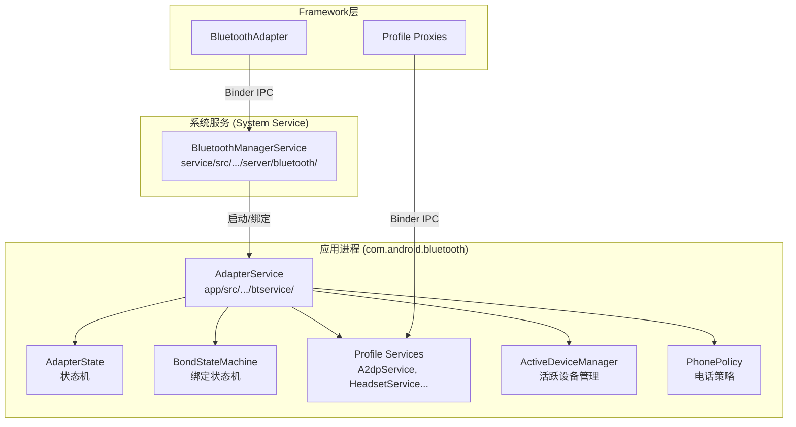
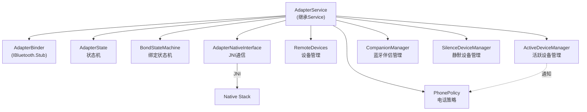
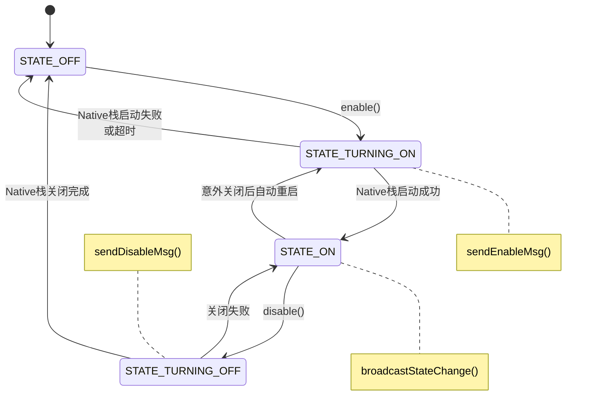
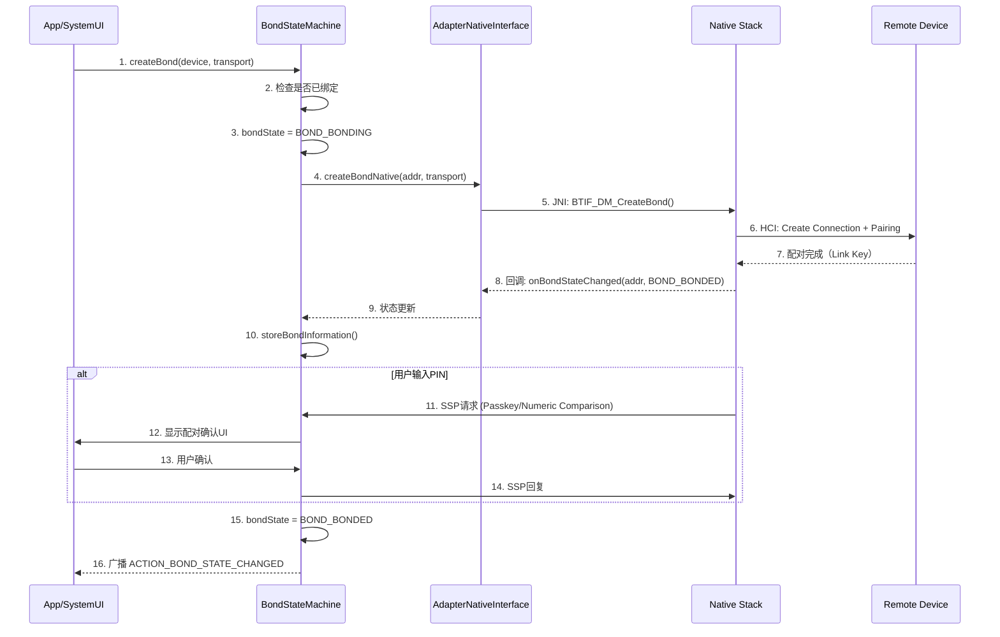
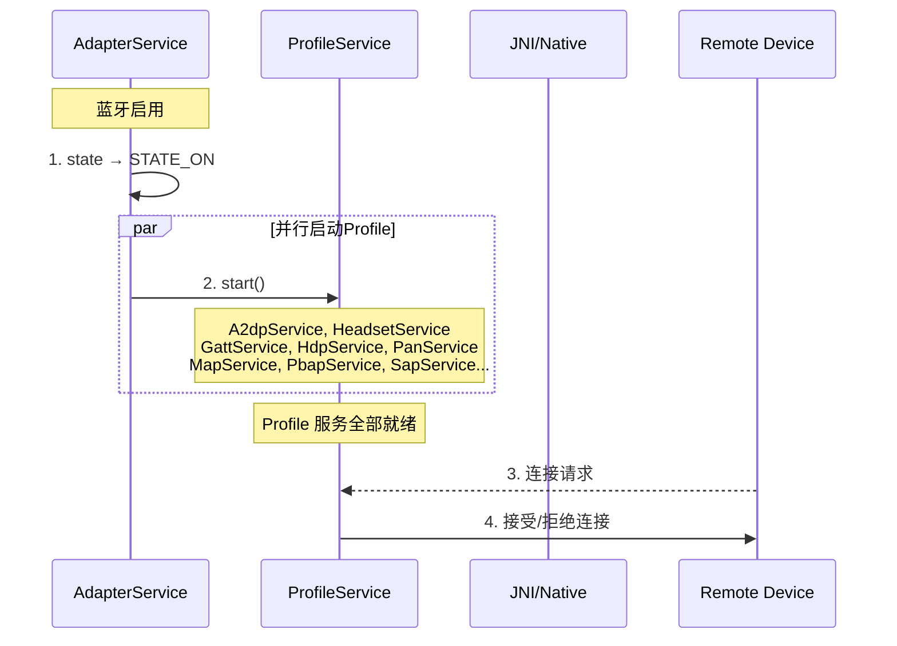

# 第5章：Bluetooth Service层

> **难度**: ★★★☆☆ | **前置知识**: Ch4 公共API | **C++依赖**: 无
> **预计阅读时间**: 2-3小时 | **预计学习天数**: 3-4天
> **核心作用**: 理解 Bluetooth 系统服务的设计与实现

---

## 学习目标

- 理解 BluetoothManagerService 作为系统服务的生命周期
- 掌握 AdapterService 的组件架构
- 理解 Profile 服务的注册与管理
- 理解 AdapterState 状态机的转换逻辑
- 理解 BondStateMachine 绑定流程

---

## 1. Service层架构总览

Service 层位于 `service/` 和 `android/app/` 两个目录中，分为两级服务：



### 1.1 两级服务的职责划分

```
BluetoothManagerService (系统服务)
├── 运行在 system_server 进程
├── 管理蓝牙开关（用户切换）
├── 管理多用户
├── 权限检查
├── 飞行模式处理
└── 启动/停止 AdapterService

AdapterService (蓝牙核心服务)
├── 运行在 com.android.bluetooth 进程
├── 实际蓝牙功能实现
├── 管理所有 Profile 服务
├── 设备管理 (RemoteDevices)
├── 绑定管理 (BondStateMachine)
├── 状态管理 (AdapterState)
├── 策略管理 (PhonePolicy)
└── 音频路由
```

---

## 2. BluetoothManagerService 详解

### 2.1 服务注册

`service/src/com/android/server/bluetooth/BluetoothManagerService.java`

作为系统服务注册在 `system_server` 进程中：

```java
// SystemServer.java (frameworks/base/services/java/com/android/server/SystemServer.java)
// 系统启动时注册
if (getPackageManager().hasSystemFeature(PackageManager.FEATURE_BLUETOOTH)) {
    t.traceBegin("StartBluetoothManagerService");
    mSystemServiceManager.startService(BluetoothManagerService.class);
    t.traceEnd();
}
```

### 2.2 核心状态管理

```mermaid
stateDiagram-v2
    [*] --> INIT: 系统启动
    INIT --> OFF: 蓝牙初始化完成
    OFF --> TURNING_ON: enable()
    TURNING_ON --> ON: AdapterService启动成功
    TURNING_ON --> OFF: 超时/失败
    ON --> TURNING_OFF: disable()
    TURNING_OFF --> OFF: AdapterService停止
    TURNING_OFF --> ON: 取消失败
    ON --> OFF: 飞行模式
    ON --> OFF: 蓝牙崩溃重启

    note right of TURNING_ON: 绑定com.android.bluetooth<br/>启动AdapterService<br/>超时: BLUETOOTH_ON_TIMEOUT_MS=600s
    note right of TURNING_OFF: 停止所有Profile<br/>关闭Native Stack<br/>超时: BLUETOOTH_OFF_TIMEOUT_MS=3000ms
```

### 2.3 enable() 核心流程

```java
// BluetoothManagerService.java (简化)
public boolean enable(String packageName) {
    // 1. 权限检查
    checkIfCallerIsForegroundUser();
    mContext.enforceCallingOrSelfPermission(BLUETOOTH_CONNECT, "Need BLUETOOTH_CONNECT permission");
    
    // 2. 状态检查（避免重复操作）
    if (mState == STATE_ON) return true;
    if (mState == STATE_TURNING_ON) return false;
    
    // 3. 用户限制检查
    if (isAirplaneModeOn() && !isBluetoothAllowedInAirplaneMode()) {
        return false;
    }
    
    // 4. 发送启用消息
    Message msg = mHandler.obtainMessage(MESSAGE_ENABLE);
    msg.arg1 = ENABLE_DELAY_MS;
    mHandler.sendMessage(msg);
    
    return true;
}

// Handler处理
private final Handler mHandler = new Handler() {
    @Override
    public void handleMessage(Message msg) {
        switch (msg.what) {
            case MESSAGE_ENABLE:
                // 5. 绑定AdapterService
                doEnable(msg.arg1);
                break;
            case MESSAGE_STATE_CHANGED:
                // 6. 广播状态变更
                handleStateChange(msg.arg1, msg.arg2);
                break;
        }
    }
};
```

### 2.4 AdapterService 绑定过程

```mermaid
sequenceDiagram
    participant BTMgr as BluetoothManagerService
    participant AMS as ActivityManagerService
    participant AdptSvc as AdapterService
    participant Binder as IBluetooth Binder

    BTMgr->>BTMgr: 1. 检查是否已经绑定
    BTMgr->>AMS: 2. bindService(intent)<br/>无法显式绑定系统服务
    BTMgr->>BTMgr: 3. 设置mBinding=true
    BTMgr->>AMS: 4. 发送延迟绑定Intent
    
    Note over BTMgr: 等待绑定结果...
    
    AMS->>AMS: 5. 创建 com.android.bluetooth 进程
    AMS->>AdptSvc: 6. onCreate()
    AdptSvc->>AdptSvc: 7. 注册 IBluetooth Stub
    AdptSvc-->>BTMgr: 8. onServiceConnected
    
    BTMgr->>BTMgr: 9. mBinding=false; 设置mConnection
    BTMgr->>AdptSvc: 10. 调用 IBluetooth.enable()
    AdptSvc->>AdptSvc: 11. 实际蓝牙启用...
```

### 2.5 多用户管理

```java
// 每个用户有独立的蓝牙状态
private final SparseArray<BluetoothManagerService> mUserManagerStates;

// 用户切换时处理
@Override
public void onUserSwitching(@Nullable Integer previousUser, @NonNull Integer newUser) {
    // 暂停当前用户的蓝牙
    if (previousUser != null) {
        sendDisableMsg(previousUser);
    }
    // 恢复新用户的蓝牙
    sendEnableMsg(newUser);
}
```

### 2.6 Enable 深度参考（V8）

**enable() 完整调用链与线程**（基于实际源码 `BluetoothManagerService.java:2448`, `AdapterService.java:5030`）：

| 步骤 | 代码位置 | 线程 |
|------|---------|------|
| `BluetoothAdapter.enable()` | `BluetoothAdapter.java:1040` | App 任意线程 |
| Binder IPC | — | Binder 线程池 |
| `BluetoothManagerService.handleEnableMessage()` | `BluetoothManagerService.java:1554` | BMS Handler |
| `BluetoothManagerService.handleEnable()` | `BluetoothManagerService.java:1717` | BMS Handler |
| `BluetoothManagerService.bluetoothStateChangeHandler(OFF→BLE_TURNING_ON)` | `BluetoothManagerService.java:1726` | BMS Handler |
| `BluetoothManagerService.bindToAdapter()` | `BluetoothManagerService.java:1744` | BMS Handler |
| `AdapterService.init()` | `AdapterService.java:956` | AdapterService Handler |
| `AdapterService.bringUpBle()` | `AdapterService.java:1114` | AdapterService Handler |
| JNI `enableNative()` | `AdapterNativeInterface.java:112` | BT Main Thread |
| `stack_manager.cc startup()` | `stack_manager.cc:198` | BT Main Thread |

**关键状态迁移**：`OFF` → `handleEnable()` → `BLE_TURNING_ON` → `bindToAdapter()` → `AdapterService.init()` → `bringUpBle()` → `BLE_STARTED` → `BleOnState` → `bleOnToOn()` → `BREDR_STARTED` → `ON`

> `BLE_ON`→`ON` 的提升在 `BluetoothManagerService.bleOnToOn()`（`BluetoothManagerService.java:1815`）中实现。当 `handleEnable()` 检测到已在 `BLE_ON` 状态时，直接调用 `bleOnToOn()` 而不重复绑定。

**Enable 调试要点**：
- `dumpsys bluetooth_manager` 查看当前状态，确认状态迁移进度
- logcat 过滤 `bt_btif_core:*` 看 `initNative()` 是否成功
- logcat 过滤 `bt_stack_manager:*` 看 Start 流程是否完成
- logcat 过滤 `bt_btif_dm:*` 看 `BTIF_Enable()` 是否调用

> 完整 enable/disable 分析见 [V8_Enable_Disable_Analysis.md](V8_Enable_Disable_Analysis.md)（294 行）

---

## 3. AdapterService 分析

`android/app/src/com/android/bluetooth/btservice/AdapterService.java`

### 3.1 组件关系



### 3.2 AdapterService 启动

```java
// AdapterService.java
public class AdapterService extends Service {
    @Override
    public void onCreate() {
        super.onCreate();
        
        // 1. 初始化组件
        mAdapterBinder = new AdapterBinder(this);
        mAdapterState = new AdapterState(this);
        mBondStateMachine = BondStateMachine.init(this);
        mRemoteDevices = new RemoteDevices(this);
        mAdapterNativeInterface = new AdapterNativeInterface();
        
        // 2. Native初始化准备
        mAdapterNativeInterface.init(this, mRemoteDevices);
    }

    @Override
    public IBinder onBind(Intent intent) {
        // 返回Binder接口供BluetoothManagerService调用
        return mAdapterBinder;
    }

    // 来自BluetoothManagerService的enable调用
    public boolean enable() {
        // 委托给状态机
        mAdapterState.enable();
        return true;
    }
}
```

### 3.3 AdapterBinder

```java
// AdapterBinder.java - IBluetooth接口的实现
class AdapterBinder extends IBluetooth.Stub {
    @Override
    public boolean enable() {
        // 权限检查
        checkIfCallerIsForegroundUser();
        checkCallerHasPermission(BLUETOOTH_CONNECT);
        
        // 委托给AdapterService
        return mService.enable();
    }

    @Override
    public boolean disable() { ... }
    
    @Override
    public boolean createBond(BluetoothDevice device, int transport) {
        // 委托给BondStateMachine
        return mService.getBondStateMachine().createBond(device, transport);
    }
}
```

---

## 4. AdapterState 状态机

`android/app/src/com/android/bluetooth/btservice/AdapterState.java`

### 4.1 状态定义

```java
// AdapterState.java
public class AdapterState {
    // 状态定义（对应Framework层的STATE_OFF/ON/TURNING_ON/TURNING_OFF）
    public static final int STATE_OFF = 10;
    public static final int STATE_TURNING_ON = 11;
    public static final int STATE_ON = 12;
    public static final int STATE_TURNING_OFF = 13;
    
    private int mState = STATE_OFF;
    
    // 状态变化的监听器
    private final List<AdapterStateCallback> mCallbacks = new ArrayList<>();
    
    public interface AdapterStateCallback {
        void onStateChanged(int prevState, int newState);
    }
}
```

### 4.2 状态转换



### 4.3 带超时的状态转换

```java
// 状态转换的核心逻辑
private void processStateChange(int newState) {
    synchronized (this) {
        int prevState = mState;
        mState = newState;
        
        // 启动超时计时器
        if (newState == STATE_TURNING_ON) {
            startTimer(BLUETOOTH_ON_TIMEOUT_MS, () -> {
                // 超时处理：回退到OFF状态
                processStateChange(STATE_OFF);
                notifyAdapterStateChange(STATE_OFF);
            });
        }
        
        // 通知所有监听器
        for (AdapterStateCallback cb : mCallbacks) {
            cb.onStateChanged(prevState, newState);
        }
    }
}
```

---

## 5. BondStateMachine — 绑定状态机

`android/app/src/com/android/bluetooth/btservice/BondStateMachine.java`

### 5.1 绑定状态

```java
// 绑定状态（对应Framework层的BOND_*）
public static final int BOND_NONE = 10;       // 未绑定
public static final int BOND_BONDING = 11;    // 绑定中
public static final int BOND_BONDED = 12;     // 已绑定

// 绑定类型
public static final int BOND_TYPE_UNKNOWN = 0;    // 未知
public static final int BOND_TYPE_DEDICATED = 1;  // 专用绑定
public static final int BOND_TYPE_GENERAL = 2;    // 通用绑定
```

### 5.2 绑定流程



### 5.3 绑定信息存储

```java
// 绑定完成后保存设备信息
private void storeBondInformation(DeviceInfo device) {
    // 存储到配置数据库
    String address = device.getAddress();
    
    // 1. 保存Link Key类型
    int keyType = device.getKeyType();
    mConfig.setBondInformation(address, BT_CONFIG_KEY_TYPE, keyType);
    
    // 2. 保存绑定时间
    mConfig.setBondInformation(address, BT_CONFIG_BOND_TIME, System.currentTimeMillis());
    
    // 3. 保存设备名称
    if (device.getName() != null) {
        mConfig.setName(address, device.getName());
    }
    
    // 4. 保存服务UUID（供快速连接使用）
    ParcelUuid[] uuids = device.getUuids();
    mConfig.setUuids(address, uuids);
    
    // 5. 持久化到文件
    Config.save();
}
```

---

### 5.4 绑定深度参考（V8）

**createBond 完整调用链**：

| 步骤 | 代码位置 | 线程 |
|------|---------|------|
| `BluetoothDevice.createBond()` | `BluetoothDevice.java:2050` | App 任意线程 |
| Binder IPC `IAdapter.createBond()` | — | Binder 线程池 |
| `AdapterServiceBinder.createBond()` | `AdapterServiceBinder.java:388` | `mHandler` |
| JNI `bondNative()` | `com_android_bluetooth_adapter.cpp` | BT Main Thread |
| `btif_dm_create_bond()` | `btif_dm.cc:2774` | BT Main Thread |
| `btm_sec_execute_procedure()` | `btm_sec.cc:104` | BTU Task |

> 完整分析见 [V8_Pairing_Analysis.md](V8_Pairing_Analysis.md)（325 行）

---

## 6. Profile 服务管理

### 6.1 ProfileService 基类

```java
// android/app/src/.../btservice/ProfileService.java
public abstract class ProfileService extends Service {
    
    // Profile服务状态
    public enum ProfileState {
        DISABLED,    // 未启动
        ENABLING,    // 启动中
        ENABLED,     // 已启动（可服务）
    }
    
    private ProfileState mState = ProfileState.DISABLED;
    
    // 子类实现的初始化/清理
    abstract boolean start();
    abstract boolean stop();
    
    // 绑定Profile的具体Service时需要实现
    public IInterface getBinder() {
        return null;
    }
}
```

### 6.2 Profile 启动顺序



### 6.3 活跃设备管理

`ActiveDeviceManager` 管理当前活跃的蓝牙设备（正在使用的设备）：

```java
// ActiveDeviceManager.java
public class ActiveDeviceManager {
    // 设置活跃设备
    public void setActiveDevice(BluetoothDevice device) {
        // 1. 通知PhonePolicy（电话策略）
        mPhonePolicy.setActiveDevice(device);
        
        // 2. 通知A2DP（切换音频输出）
        mA2dpService.setActiveDevice(device);
        
        // 3. 通知AVRCP（切换播放控制）
        mAvrcpService.setActiveDevice(device);
        
        // 4. 通知HFP（切换通话）
        mHeadsetService.setActiveDevice(device);
        
        // 5. 通知HearingAid
        mHearingAidService.setActiveDevice(device);
        
        // 6. 通知LE Audio
        mLeAudioService.setActiveDevice(device);
    }
}
```

---

## 7. 权限与安全检查

### 7.1 调用者权限验证

```java
// BluetoothServiceBinder.java
private void checkCallerHasPermission(String permission) {
    if (mService.checkCallingOrSelfPermission(permission) 
            != PackageManager.PERMISSION_GRANTED) {
        throw new SecurityException("Need permission " + permission);
    }
}

private void enforceCallingOrSelfPermission(String permission, String message) {
    mService.enforceCallingOrSelfPermission(permission, message);
}
```

### 7.2 前台用户检查

```java
// 确保只有前台用户可以操作蓝牙
private void checkIfCallerIsForegroundUser() {
    int callingUser = UserHandle.getUserId(Binder.getCallingUid());
    int foregroundUser = mActivityManager.getCurrentUser().id;
    
    if (callingUser != foregroundUser) {
        throw new SecurityException("Only foreground user can access Bluetooth");
    }
}
```

---

## 8. 实战练习

### 练习1：追踪enable流程

```java
// 从 service/src/.../BluetoothManagerService.java 开始
// 1. 找到 MESSAGE_ENABLE 的处理
// 2. 追踪到 AdapterService.java 的 enable()
// 3. 追踪到 AdapterNativeInterface.java
// 完成: 画出BluetoothManagerService到JNI的完整调用链
```

> **答案**: 完整调用链：`BluetoothManagerService.handleEnable()` → `mAdapterService.enable()` → `AdapterState.processMessage(AdapterState.ENABLE)` → 在State机中调用 `mAdapterService.mAdapterNativeInterface.enableNative()` → JNI函数`enableNative(JNIEnv*, jobject)` → `btif_dm.cc:BTIF_Enable()`。代码位置：`BluetoothManagerService.java:1056`, `AdapterState.java:201`, `AdapterNativeInterface.java:112`, `com_android_bluetooth_adapter.cpp:580`, `btif_dm.cc:4161`。关键注意：`BluetoothManagerService`运行在system_server进程，`AdapterService`运行在com.android.bluetooth进程。

### 练习2：分析BondStateMachine

```java
// 阅读 android/app/src/.../btservice/BondStateMachine.java
// 1. 找到 createBond() 的完整路径
// 2. 理解 bonding → bonded 的状态转换条件
// 3. 异常情况如何处理？（配对超时、用户取消）
```

> **答案**: ① `createBond()`路径：`AdapterService.createBond()` → `BondStateMachine.sendMessage(BOND_START)` → `BondStateMachine.processBondStart()` → JNI`bondNative()` → `btif_dm.cc:BTIF_DM_Bond()` → `BTM_SecBond()`。② bonding→bonded转换：收到`BTA_DM_BONDED_EVT`（`btif_dm.cc:event`为`BTIF_DM_CB_BONDED`）→ JNI回调`adapterService.bondStateCallback(BONDED)` → `BondStateMachine`状态变为`BONDED`。③ 异常处理：配对超时通过`BTM_SecBondTimer`的timeout处理，触发`BTA_DM_BOND_TIMEOUT_EVT`；用户取消通过`BTA_DM_CANCEL`事件处理。超时路径：`btm_sec.cc:btm_sec_bond_cancel()` → JNI回调`BOND_NONE`。

### 练习3：Profile生命周期

```java
// 阅读 android/app/src/.../btservice/ProfileService.java
// 1. ProfileService 的start/stop什么时候被调用？
// 2. 如果某个Profile服务崩溃了，AdapterService如何恢复？
```

> **答案**: ① `start()`在蓝牙enable流程的最后阶段被调用（`AdapterState.ENABLED`状态调用`startProfileServices()`）；`stop()`在蓝牙disable流程中被调用（`AdapterState.TURNING_OFF`状态）。具体代码：`AdapterService.java:startProfileServices()`遍历已注册的profile Service调用`onStart()`。② Profile崩溃恢复：`ProfileService.onBind()`中检测Binder死亡（`mBinder.linkToDeath(recipient, 0)`），当Binder所在进程死亡时触发`binderDied()`回调。在`binderDied()`中：记录log → 调用`cleanup()` → 通知`AdapterService` → 重启Profile Service（`startService(new Intent(this, ProfileService.class))`）。代码见`ProfileService.java:355`。

---

## 本章总结

学完本章后，你应该能：
- 理解`BluetoothManagerService`作为系统服务的角色：管理蓝牙开关、权限检查、多用户支持
- 掌握`AdapterService`的四状态机：`INIT`→`ENABLING`→`ENABLED`→`TURNING_OFF`→`OFF`
- 理解`BondStateMachine`的配对流程：`createBond()`→`BOND_START`→`BONDING`→`BONDED`
- 知道Profile Service在蓝牙enable时通过`startProfileServices()`批量启动，crash时通过`binderDied()`自动重启
- 理解C++开发者视角：Service层的`AdapterNativeInterface.java`是通往Native BTIF的最后一站
- 知道车载场景下`ActiveDeviceManager`和`PhonePolicy`管理多设备/通话优先策略

> Service层是Java世界的最底层，从这里往下的JNI和Native层才是蓝牙协议栈的核心。下一章我们深入各Profile Service的具体实现。

---

## 车载场景

车载环境下Service层的特殊设计：

### 1. ActiveDeviceManager多设备管理
- 车机需要同时管理多个已连接设备（驾驶员手机、乘客手机、BLE传感器）
- `ActiveDeviceManager`负责决定哪个设备是"活跃设备"（HFP通话、A2DP音频路由到该设备）
- 车载场景下，驾驶员手机始终优先于乘客手机

### 2. PhonePolicy音频优先策略
- 车载音频优先级：通话(HFP) > 导航音 > 媒体(A2DP) > 游戏音
- 当导航播报时，`PhonePolicy`会暂停A2DP媒体播放，导航结束后自动恢复
- 这种策略在`HeadsetStateMachine`中实现，确保车载音频体验

### 3. 车载服务自恢复
- 车机要求7×24小时运行，蓝牙服务crash后必须自动恢复
- `AdapterService`通过`binderDied()`监听Profile Service死亡，自动重启
- 车载系统通常配置了Watchdog监控蓝牙服务进程

---

## 相关章节

- **Service的JNI接口**：[第7章JNI Bridge](07_JNI_Bridge.md)
- **Service状态机模式与BTA状态机对比**：[第9章BTA层](09_BTA_Layer.md)
- **PhonePolicy的音频优先策略**：[第16章音频系统](16_Audio_System.md)

---

## 参考文件清单

| 文件 | 核心内容 |
|------|---------|
| `service/src/.../BluetoothManagerService.java` | 系统服务入口 |
| `service/src/.../BluetoothServiceBinder.java` | Binder实现 |
| `service/src/.../BtPermissionUtils.java` | 权限工具 |
| `android/app/src/.../btservice/AdapterService.java` | Adapter服务 |
| `android/app/src/.../btservice/AdapterBinder.java` | Adapter Binder |
| `android/app/src/.../btservice/AdapterState.java` | 状态机 |
| `android/app/src/.../btservice/AdapterNativeInterface.java` | Native接口 |
| `android/app/src/.../btservice/BondStateMachine.java` | 绑定状态机 |
| `android/app/src/.../btservice/ProfileService.java` | Profile基类 |
| `android/app/src/.../btservice/ActiveDeviceManager.java` | 活跃设备管理 |
| `android/app/src/.../btservice/PhonePolicy.java` | 电话策略 |
| **V8 深度分析报告** | |
| `V8_Enable_Disable_Analysis.md` | Enable/Disable 状态机 + Binder 边界 + 失败点 |
| `V8_Pairing_Analysis.md` | createBond 完整调用链 + 线程模型 |
| `V8_Dumpsys_Analysis.md` | bluetooth_manager dumpsys 输出字段 |

> **下一步**: 阅读 [第6章：Profile Services详解](06_Profile_Services.md)
