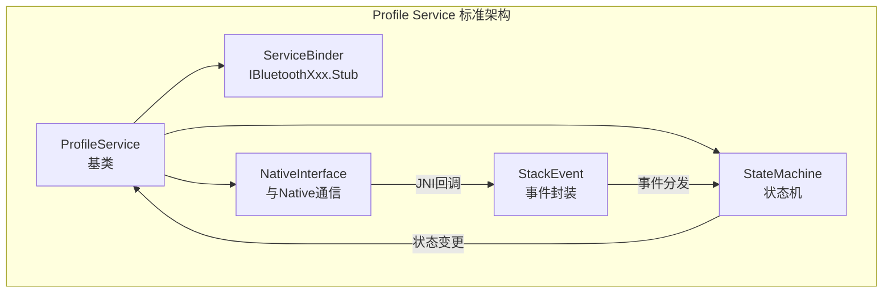
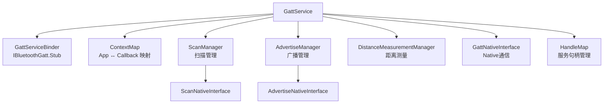
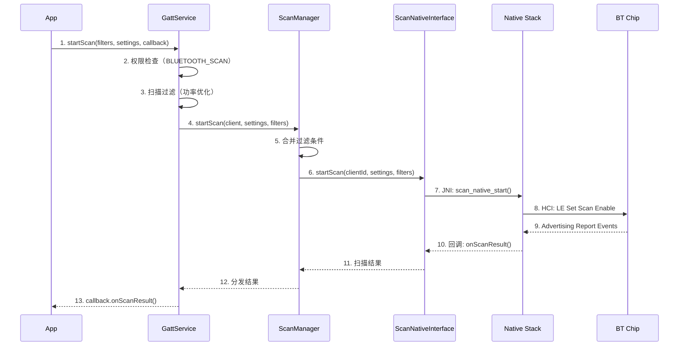
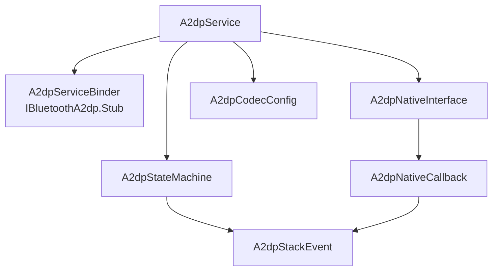
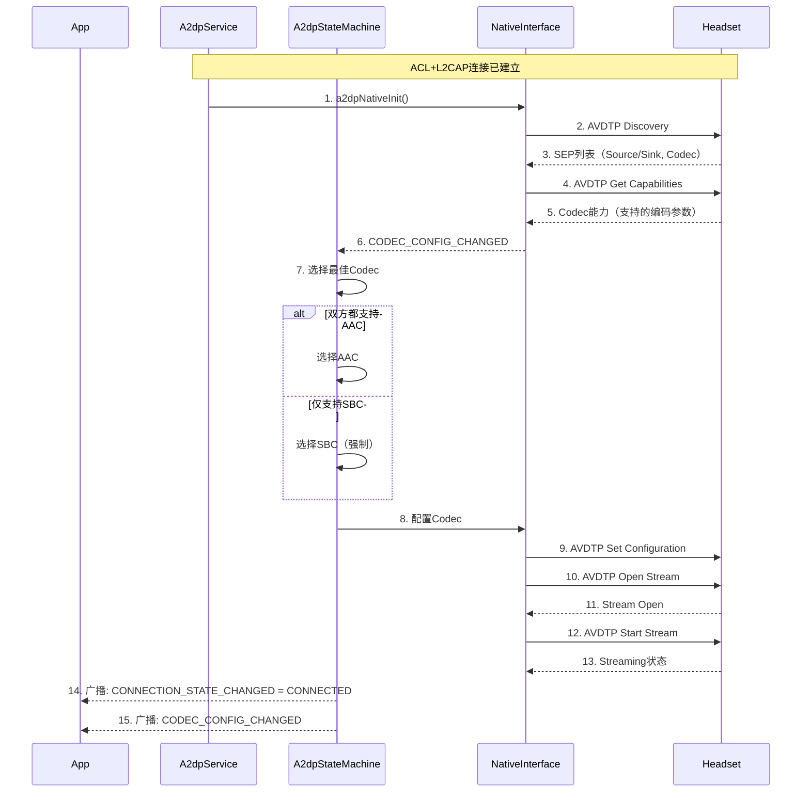
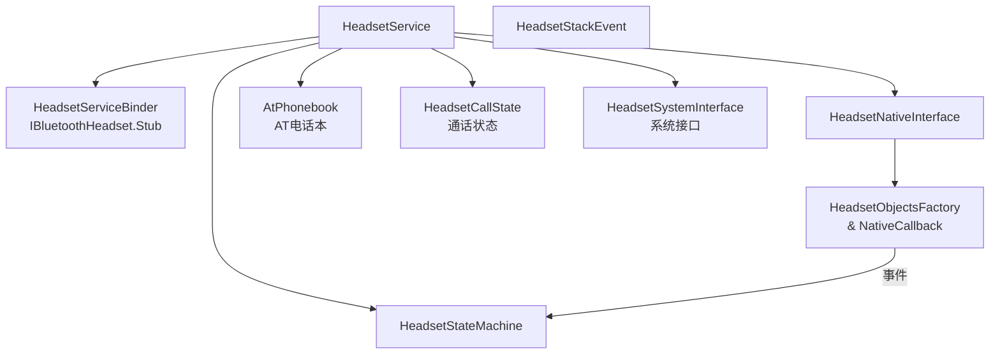
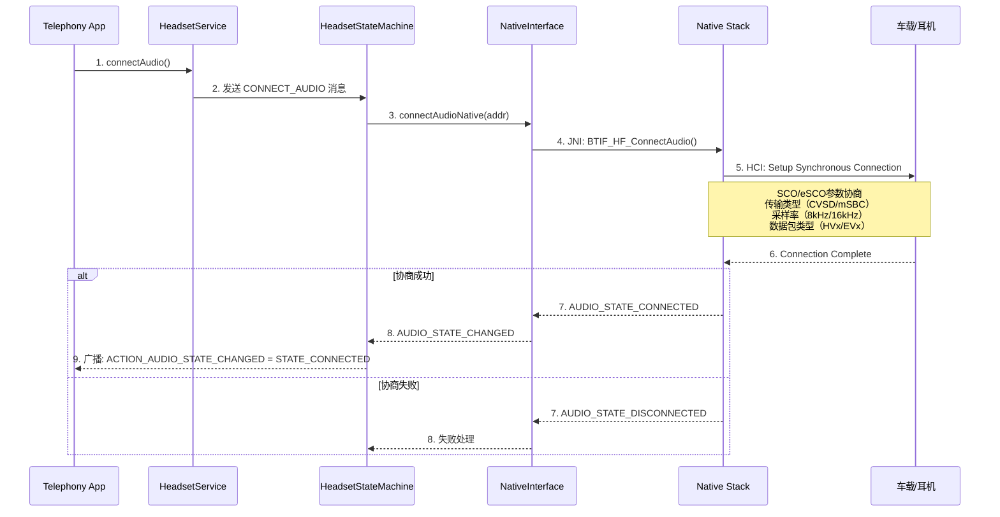
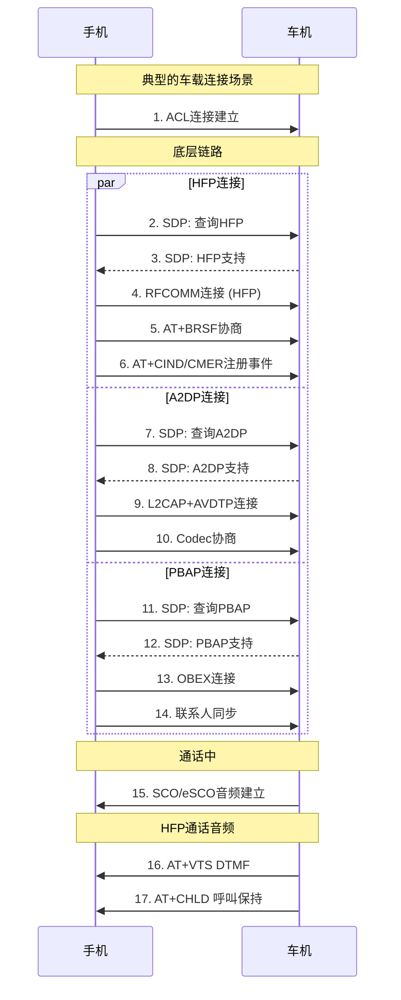

# 第6章：Profile Services 详解

> **难度**: ★★★★☆ | **前置知识**: Ch4-5 Service层 + 公共API | **C++依赖**: 低
> **预计阅读时间**: 3-4小时 | **预计学习天数**: 4-5天
> **核心作用**: 深入理解蓝牙 Profile 在 Java 层的实现

---

## 学习目标

- 理解 Profile Services 的整体架构模式
- 深入掌握 GattService（BLE核心服务）
- 深入掌握 A2DP Service（音频流服务）
- 深入掌握 Headset Service（HFP免提服务）
- 熟悉其他 Profile 的基本架构

---

## 1. Profile Services 架构模式

所有 Profile Service 遵循相同的设计模式：



### 1.1 标准Profile文件结构

以 A2DP 为例：

```
android/app/src/com/android/bluetooth/a2dp/
├── A2dpService.java              ← 主服务类
├── A2dpServiceBinder.java        ← Binder实现
├── A2dpStateMachine.java         ← 状态机
├── A2dpNativeInterface.java      ← JNI通信接口
├── A2dpNativeCallback.java       ← JNI回调处理
├── A2dpStackEvent.java           ← 事件POJO
└── A2dpCodecConfig.java          ← Codec配置
```

### 1.2 NativeInterface 模式

每个 Profile 都有一个 `NativeInterface` 类，封装JNI调用：

```java
// A2dpNativeInterface.java
public class A2dpNativeInterface {
    private static A2dpNativeInterface sInstance;
    
    // 静态注册JNI方法
    static {
        System.loadLibrary("bluetooth_jni");
    }
    
    // 初始化
    public void init(A2dpNativeCallback callback) {
        initNative(callback);
    }
    
    // Native方法声明（在JNI中实现）
    private native void initNative(A2dpNativeCallback callback);
    private native void connectNative(byte[] address);
    private native void disconnectNative(byte[] address);
    private native void setCodecConfigNative(byte[] address, byte[] codecConfig);
}
```

---

## 2. GattService 详解

GattService (`android/app/src/com/android/bluetooth/gatt/`) 是蓝牙中**最复杂的 Java 服务**，处理所有 BLE 相关操作。

### 2.1 GattService 架构



### 2.2 GattService 核心功能

```java
// GattService.java 主要功能
public class GattService extends ProfileService {

    // ===== 扫描 =====
    public void startScan(ScanSettings settings, List<ScanFilter> filters,
                          ScanCallback callback) {
        mScanManager.startScan(callback, settings, filters);
    }

    // ===== 广播 =====
    public void startAdvertising(AdvertisingSetParameters parameters,
                                  AdvertiseData advertiseData,
                                  AdvertisingSetCallback callback) {
        mAdvertiseManager.startAdvertising(parameters, advertiseData, callback);
    }

    // ===== 连接 =====
    public void clientConnect(String address, boolean isDirect, int transport) {
        mGattNativeInterface.clientConnect(appId, address, isDirect, transport);
    }

    // ===== Service Discovery =====
    public void discoverServices(int connId) {
        mGattNativeInterface.discoverServices(connId);
    }

    // ===== 服务端 =====
    public void registerServer(BluetoothGattServerCallback callback) {
        mGattNativeInterface.registerServer(appUuid, callback);
    }
}
```

### 2.3 ContextMap — App与Callback映射

```java
// ContextMap.java
// 每个App连接GattService时注册一个Context，包含该App的所有回调
public class ContextMap {
    private final HashMap<Integer, App> mApps = new HashMap<>();
    
    static class App {
        int id;
        String packageName;
        // 该App注册的所有回调
        HashMap<Integer, CallbackInfo> clientCallbacks = new HashMap<>();
        HashMap<Integer, CallbackInfo> serverCallbacks = new HashMap<>();
    }
    
    public App addApp(int id, String packageName) {
        App app = new App();
        app.id = id;
        app.packageName = packageName;
        mApps.put(id, app);
        return app;
    }
    
    // 通过connId找到对应的App和Callback
    public CallbackInfo getCallBackInfo(int connId) {
        for (App app : mApps.values()) {
            CallbackInfo info = app.clientCallbacks.get(connId);
            if (info != null) return info;
        }
        return null;
    }
}
```

### 2.4 BLE扫描流程



---

## 3. A2DP Service 详解

### 3.1 架构



### 3.2 A2DP状态机

```java
// A2dpStateMachine.java — 简化的状态
public class A2dpStateMachine extends StateMachine {
    
    // 状态
    private final State mDisconnected = new Disconnected();
    private final State mConnecting = new Connecting();
    private final State mConnected = new Connected();
    private final State mDisconnecting = new Disconnecting();
    
    class Disconnected extends State {
        @Override
        public void enter() {
            // 进入断开状态
            broadcastConnectionState(DISCONNECTED);
        }
        @Override
        public boolean processMessage(Message msg) {
            switch (msg.what) {
                case CONNECT:
                    // 发起连接 → 切换到Connecting
                    transitionTo(mConnecting);
                    return HANDLED;
                case CONNECTION_STATE_CHANGED:
                    // 远端发起连接
                    transitionTo(mConnected);
                    return HANDLED;
            }
            return NOT_HANDLED;
        }
    }
    
    class Connected extends State {
        @Override
        public void enter() {
            // 进入连接状态 → 开始Codec协商
            broadcastConnectionState(CONNECTED);
            startCodecNegotiation();
        }
        @Override
        public boolean processMessage(Message msg) {
            switch (msg.what) {
                case DISCONNECT:
                    transitionTo(mDisconnecting);
                    return HANDLED;
                case CODEC_CONFIG_CHANGED:
                    handleCodecConfig(msg.obj);
                    return HANDLED;
            }
            return NOT_HANDLED;
        }
    }
}
```

### 3.3 A2DP Codec协商流程



### 3.4 Codec配置

```java
// A2dpCodecConfig.java
public class A2dpCodecConfig {
    // 支持的Codec类型（定义在Native层）
    public static final int SOURCE_CODEC_TYPE_SBC = 0;
    public static final int SOURCE_CODEC_TYPE_AAC = 1;
    public static final int SOURCE_CODEC_TYPE_APTX = 2;
    public static final int SOURCE_CODEC_TYPE_APTX_HD = 3;
    public static final int SOURCE_CODEC_TYPE_LDAC = 4;
    public static final int SOURCE_CODEC_TYPE_OPUS = 5;
    
    // Codec优先级
    public static final int CODEC_PRIORITY_DISABLED = -1;
    public static final int CODEC_PRIORITY_DEFAULT = 0;
    public static final int CODEC_PRIORITY_HIGHEST = 1000;
    
    // Codec能力（从远端查询）
    public static class CodecCapability {
        int codecType;
        int sampleRate;        // 44100, 48000, 96000
        int bitsPerSample;     // 16, 24, 32
        int channelMode;       // MONO, DUAL, STEREO, JOINT_STEREO
        long codecSpecificCapability; // 不同codec有不同的参数
    }
}
```

---

## 4. Headset Service (HFP) 详解

### 4.1 架构



### 4.2 AT命令处理

HFP 使用 AT 命令进行通信（和传统电话Modem一样的协议）：

```
AT+BRSF=<supported_features>  ← 协商支持的特性
AT+CHLD=?                      ← 查询呼叫保持功能
AT+CIND=?                      ← 查询指示器
AT+CMER=...                     ← 设置事件报告
AT+VTS=<dtmf>                   ← 发送DTMF音
AT+CLCC                         ← 查询当前通话列表
AT+BINP=...                     ← 语音识别号码
```

**AT命令处理** (`HeadsetStateMachine.java`):
```java
// HeadsetStateMachine.java — AT命令处理
private void handleAtCommand(HeadsetStackEvent event) {
    String atCommand = event.valueString;
    
    if (atCommand.startsWith("AT+BRSF=")) {
        // 协商支持的特性
        int features = extractValue(atCommand);
        handleBrsf(features);
        
    } else if (atCommand.equals("AT+CIND?")) {
        // 查询指示器状态
        sendCindResponse();
        
    } else if (atCommand.equals("AT+CLCC")) {
        // 查询当前通话列表
        sendClccResponse();
        
    } else if (atCommand.startsWith("AT+VTS=")) {
        // DTMF音
        handleVts(atCommand);
        
    } else {
        // 未知命令 → 返回ERROR
        sendAtResponse("ERROR");
    }
}
```

### 4.3 SCO/eSCO音频建立



### 4.4 关键HFP参数

```java
// HeadsetHalConstants.java
public class HeadsetHalConstants {
    // SCO传输类型
    public static final int SCO_TRANSPORT_CVSD = 1;     // 8kHz, 窄带
    public static final int SCO_TRANSPORT_MSBC = 2;     // 16kHz, 宽带
    public static final int SCO_TRANSPORT_LC3 = 3;      // 16kHz+, 超宽带 LE Audio
    
    // 通话状态
    public static final int CALL_STATE_ACTIVE = 0;
    public static final int CALL_STATE_HELD = 1;
    public static final int CALL_STATE_DIALING = 2;
    public static final int CALL_STATE_ALERTING = 3;
    public static final int CALL_STATE_INCOMING = 4;
    public static final int CALL_STATE_WAITING = 5;
    public static final int CALL_STATE_IDLE = 6;
    
    // HFP版本
    public static final int HFP_VERSION_1_5 = 0x0105;
    public static final int HFP_VERSION_1_6 = 0x0106;
    public static final int HFP_VERSION_1_7 = 0x0107;
    public static final int HFP_VERSION_1_8 = 0x0108;
    public static final int HFP_VERSION_1_9 = 0x0109;
}
```

---

## 5. 其他Profile一览

### 5.1 PAN Service

```java
// PanService.java — 个人区域网络
public class PanService extends ProfileService {
    
    public boolean connect(BluetoothDevice device) {
        // PAN使用BNEP协议连接
        return mPanNativeInterface.connect(device);
    }
    
    // 车载热点场景：
    // 手机开启热点 → 车机连接 → 通过PAN上网
    // 或：车机开启热点 → 手机连接
    public boolean setBluetoothTethering(boolean enable) {
        return mPanNativeInterface.setTethering(enable);
    }
}
```

### 5.2 MAP Service

```java
// BluetoothMapService.java — 消息访问
public class BluetoothMapService extends ProfileService {
    // 处理接收到的短信/邮件
    public void onNewMessage(BluetoothMapMessage message) {
        // 1. 解析消息内容
        // 2. 发出通知
        // 3. 推送至车机显示
    }
    
    // 处理发送消息请求
    public void onSendMessage(String recipients, String message) {
        // 1. 检查发送者权限
        // 2. 通过SmsManager发送
        // 3. 通知车机发送结果
    }
}
```

### 5.3 PBAP Client Service

```java
// PbapClientService.java — 电话簿访问
public class PbapClientService extends ProfileService {
    // 下载联系人
    public void downloadPhoneBook(BluetoothDevice device) {
        // 1. 通过OBEX查询PhoneBook
        // 2. 接收vCard数据
        // 3. 存入本地联系人数据库
        // 4. 提供给车载系统使用
    }
}
```

### 5.4 HID Service

```java
// HidDeviceService.java — HID设备
public class HidDeviceService extends ProfileService {
    // 发送HID报告（键盘按键、鼠标移动等）
    public boolean sendReport(BluetoothDevice device, int reportId, byte[] data) {
        return mHidNativeInterface.sendReport(device, reportId, data);
    }
}
```

---

## 6. Profile并发管理

### 6.1 多Profile连接时序



### 6.2 并发控制核心问题

```java
// 多Profile连接时的问题：
// 1. ACL共享 — 所有Profile共用一条ACL链路
// 2. SDP冲突 — 多个Profile同时查询SDP
// 3. 音频冲突 — HFP通话 vs A2DP音乐
// 4. 优先级管理 — 电话 > 导航 > 音乐

// PhonePolicy.java — 电话策略
public class PhonePolicy {
    // 音频优先策略
    public void onAudioStateChanged() {
        if (mHeadsetService.isCallActive()) {
            // 通话优先，暂停A2DP
            mA2dpService.suspendStream();
        } else if (mNavigationActive) {
            // 导航提示音优先
            mA2dpService.setFocus(STREAM_NAVIGATION);
        } else {
            // 正常播放音乐
            mA2dpService.resumeStream();
        }
    }
}
```

---

## 7. 实战练习

### 练习1：GattService扫描流程

```java
// 阅读 android/app/src/.../gatt/GattService.java
// 1. startScan() 的完整流程
// 2. ScanManager 如何管理多个扫描请求？
// 3. 扫描结果如何回调给App？
```

> **答案**: ① `GattService.startScan()` 调用链：`GattService$ScannerApp.startScan()` → `GattService.startScanNative()` → JNI `startScanNative()` → `btif_gatt.cc:BTA_GATTC_Scan(true)` → `bta_gattc_co_cache.cc` → BLE HCI `LE_Set_Scan_Parameters`/`LE_Set_Scan_Enable`。② `ScanManager` 管理多个请求：每个App的扫描请求封装为`ScanClient`对象，`ScanManager`用`mScanClients`队列维护；通过合并策略将多个请求合并为一次硬件扫描（取最短interval和最长window）。③ 扫描结果回调路径：硬件扫描结果 → BTA层`BTA_GATTC_ScanResult_cb()` → BTIF层`btif_gatt.cc` → JNI `ScanCallback.result_callback()` → `ScanClient.callback.onScanResult()`。代码位置：`GattService.java:780`, `ScanManager.java:234-350`。

### 练习2：A2DP连接分析

```java
// 阅读 android/app/src/.../a2dp/A2dpService.java
// 1. connect() 方法到 connectNative() 的路径
// 2. A2dpStateMachine 的状态转换
// 3. NativeInterface 的初始化时机
```

> **答案**: ① `A2dpService.connect(device)` → `A2dpNativeInterface.connectA2dp(device)` → JNI `connectA2dpNative()` → `btif_av.cc:BTIF_AV_Connect()` → `BTA_AvOpen()`. ② A2DP状态机转换：`DISCONNECTED` → `CONNECTING`(发起连接) → `CONNECTED`(ACL+AVDTP完成) → `PLAYING`(开始流媒体传输)；断开时反向：`PLAYING`→`CONNECTED`→`DISCONNECTING`→`DISCONNECTED`。`A2dpStateMachine.java:95`定义`setState(A2DP_CONNECTING/A2DP_CONNECTED/A2DP_PLAYING)`。③ NativeInterface初始化：在`A2dpService.onStart()`被调用时初始化（`A2dpNativeInterface.init()` → JNI`initializeNative()` → `btif_av.cc:btif_av_init()`），蓝牙enable流程中`startProfileServices()`依次启动各Profile。

### 练习3：HFP通话场景追踪

```java
// 阅读 android/app/src/.../hfp/HeadsetService.java
// 1. handleCallState() 对几种通话状态的处理
// 2. SCO音频的建立和释放
// 3. AT命令的处理流程
```

> **答案**: ① `handleCallState()` 处理状态：`IDLE`(空闲，释放SCO)、`DIALING`(拨号中，建立SCO发送拨号音)、`ALERTING`(振铃)、`ACTIVE`(通话中，SCO保持)、`INCOMING`(来电，播放铃声)。代码见`HeadsetService.java:1203-1280`。② SCO建立流程：`connectAudio()` → `HeadsetNativeInterface.connectAudioNative()` → JNI → `btif_hf.cc:BTIF_HF_ConnectAudio()` → `bta_ag_sco.cc:BTA_AgScoOpen()` → HCI `Setup_Synchronous_Connection`。SCO释放：`disconnectAudio()`→`BTA_AgScoClose()`→HCI `Setup_Synchronous_Connection_Disconnect`。③ AT命令处理：车机发AT命令 → HFP RFCOMM → `btif_hf.cc`解析AT → 回调JNI `atCommandCallback()` → `HeadsetService.handleAtCommand()` → AT处理器(`AtPhonebookHandler`等)。常见的AT命令：`AT+VTS=1`(DTMF)、`AT+CHLD=1`(挂起通话)、`AT+BRSF=xxx`(能力协商)。

---

## 本章总结

学完本章后，你应该能：
- 理解Profile Service的通用架构模式：`XXXService.java` + `XXXStateMachine.java` + `XXXNativeInterface.java`
- 掌握`GattService`的扫描流程：`ScanManager`合并多App扫描请求为一组硬件参数
- 掌握`A2dpService`的连接流程：`CONNECTING`→`CONNECTED`→`PLAYING`状态转换
- 掌握`HeadsetService`的通话流程：SCO建立/释放、AT命令双向传输、状态通知
- 理解多Profile并发时的冲突管理和资源分配（SDP/RFCOMM通道/ACL链路复用）
- 知道车载场景下`PhonePolicy.java`的音频优先策略：通话 > 导航 > 媒体

> 各Profile Service都有对应的JNI → BTIF → BTA/Stack链路。下一章我们将深入JNI Bridge，理解Java和C++之间的桥梁机制。

---

## 车载场景

车载环境下各Profile Service的特殊需求：

### 1. HFP免提服务（HeadsetService）
- 车载HFP需要支持**双麦克风**（驾驶员+副驾驶），通过SCO链路传输两路音频
- `HeadsetStateMachine`需要处理车载AT命令扩展（如`+XAPL`车厂特定命令）
- 通话时车载DSP的AEC（回声消除）和NR（降噪）必须启用

### 2. A2DP媒体服务（A2dpService）
- 车载A2DP需要支持**多音源**：驾驶员手机媒体 + 乘客手机媒体 + 车载USB音乐
- `A2dpStateMachine`的Codec协商需要考虑车载功放支持的Codec（通常优先LDAC/aptX）
- 导航音插入时，A2DP需要支持"暂停而非断开"策略

### 3. BLE GATT服务（GattService）
- 车载BLE用于车钥匙（Digital Key）、胎压传感器（TPMS）、车内定位
- `ScanManager`需要配置低功耗扫描参数，确保车钥匙在远距离（20m+）能被检测到
- GATT服务器需要支持车载传感器的周期性广播（如胎压每5秒更新）

---

## 相关章节

- **JNI实现**：[第7章](07_JNI_Bridge.md)
- **BTIF镜像实现**：[第8章BTIF层](08_BTIF_Layer.md)
- **BTA层的Profile逻辑**：[第9章BTA层](09_BTA_Layer.md)
- **HFP通话处理的底层协议**：[第10章](10_Classic_Stack_Core.md)的RFCOMM/L2CAP部分

---

## 参考文件清单

| 文件 | 核心内容 |
|------|---------|
| `android/app/src/.../gatt/GattService.java` | GATT服务 |
| `android/app/src/.../gatt/ScanManager.java` | 扫描管理 |
| `android/app/src/.../gatt/AdvertiseManager.java` | 广播管理 |
| `android/app/src/.../gatt/ContextMap.java` | 回调映射 |
| `android/app/src/.../a2dp/A2dpService.java` | A2DP服务 |
| `android/app/src/.../a2dp/A2dpStateMachine.java` | A2DP状态机 |
| `android/app/src/.../a2dp/A2dpNativeInterface.java` | A2DP JNI接口 |
| `android/app/src/.../hfp/HeadsetService.java` | HFP服务 |
| `android/app/src/.../hfp/HeadsetStateMachine.java` | HFP状态机 |
| `android/app/src/.../hfp/HeadsetNativeInterface.java` | HFP JNI接口 |
| `android/app/src/.../pan/PanService.java` | PAN服务 |
| `android/app/src/.../map/BluetoothMapService.java` | MAP服务 |
| `android/app/src/.../pbapclient/PbapClientService.java` | PBAP服务 |
| `android/app/src/.../hid/HidDeviceService.java` | HID服务 |


| **V8 深度分析报告** | |
| V8_Profile_Analysis.md | 见该报告完整分析 |
| V8_GATT_Server_Analysis.md | 见该报告完整分析 |
| V8_BLE_Scan_Analysis.md | 见该报告完整分析 |

> **下一步**: 阅读 [第7章：JNI Bridge](07_JNI_Bridge.md)
