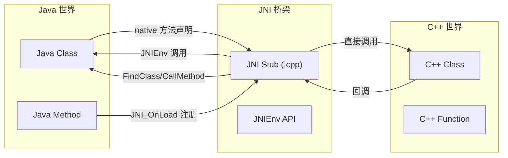
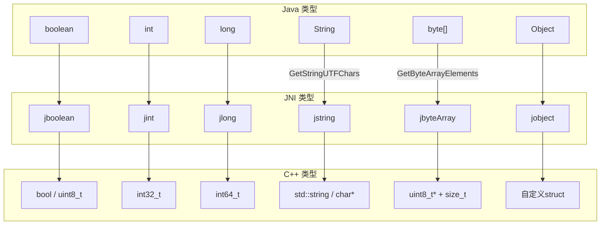
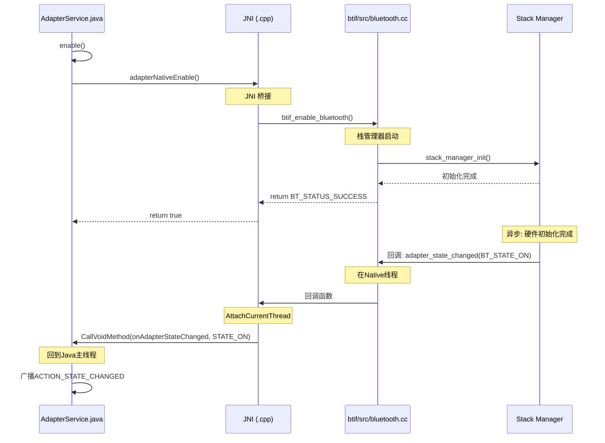
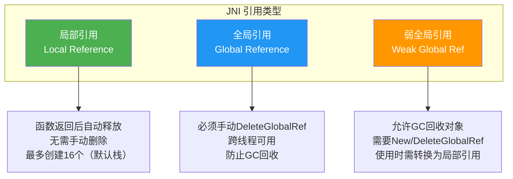
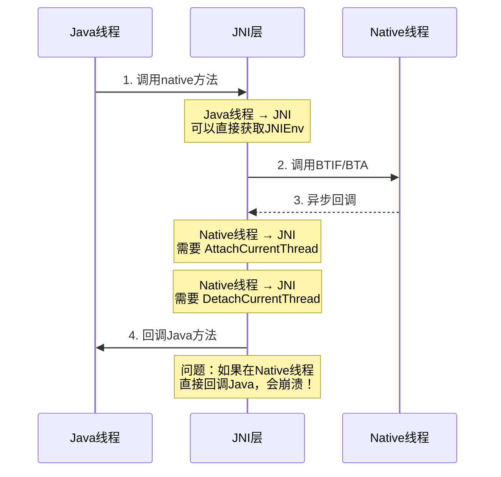
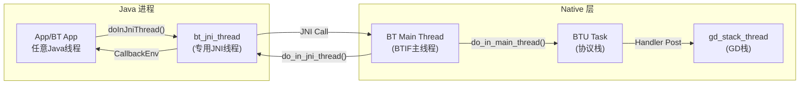

# 第7章：JNI Bridge — Java与C++的桥梁

> **难度**: ★★★★★ | **前置知识**: Ch3 C++基础, Ch4-6 Java层 | **C++依赖**: 高
> **预计阅读时间**: 4-5小时 | **预计学习天数**: 5-7天
> **核心作用**: 打通Java层到C++层的完整调用链，理解JNI在蓝牙中的运作

---

## 学习目标

- 理解JNI (Java Native Interface) 的核心机制
- 掌握蓝牙中23个JNI文件的分类和作用
- 能追踪一个Java API调用到C++ Native层的完整JNI路径
- 理解JNI引用管理及其在蓝牙中的内存泄漏风险
- 能独立添加新的JNI函数

---

## 1. JNI 基础概念

### 1.1 什么是JNI

JNI (Java Native Interface) 是 Java 与 C/C++ 之间的双向接口：



### 1.2 JNI函数命名规则

蓝牙使用**静态注册**（函数名按固定规则命名）：

```
Java_<包名>_<类名>_<方法名>
```

**示例**: `BluetoothAdapter.enable()` 的JNI函数名：

```
包名:     com.android.bluetooth.btservice
类名:     AdapterService
方法名:   adapterNativeEnable

JNI函数名: 
Java_com_android_bluetooth_btservice_AdapterService_adapterNativeEnable
```

对应文件: `com_android_bluetooth_btservice_AdapterService.cpp`

### 1.3 JNI中的类型映射



### 1.4 JNI函数注册方式

蓝牙使用**静态注册**（非动态注册JNI_OnLoad）：

```cpp
// 静态注册：函数名必须遵循Java_<package>_<class>_<method>格式
// 文件: com_android_bluetooth_hfp.cpp

extern "C" JNIEXPORT jboolean JNICALL
Java_com_android_bluetooth_hfp_HeadsetNativeInterface_connectNative(
    JNIEnv* env, jobject thiz, jbyteArray address) {
    
    // 获取参数
    jbyte* addr = env->GetByteArrayElements(address, NULL);
    
    // 调用BTIF层
    bt_status_t status = btif_hf_connect(reinterpret_cast<const RawAddress*>(addr));
    
    // 释放资源
    env->ReleaseByteArrayElements(address, addr, 0);
    
    return (status == BT_STATUS_SUCCESS) ? JNI_TRUE : JNI_FALSE;
}
```

---

## 2. 蓝牙JNI文件总览

### 2.1 文件清单

`android/app/jni/` 下共有23个JNI C++文件：

| 文件 | 对应Java类 | 功能 |
|------|-----------|------|
| `com_android_bluetooth_btservice_AdapterService.cpp` | `AdapterService` | 核心适配器 |
| `com_android_bluetooth_gatt.cpp` | `GattNativeInterface` | BLE GATT |
| `com_android_bluetooth_hfp.cpp` | `HeadsetNativeInterface` | HFP免提 |
| `com_android_bluetooth_hfpclient.cpp` | `HeadsetClientNativeInterface` | HFP客户端 |
| `com_android_bluetooth_a2dp.cpp` | `A2dpNativeInterface` | A2DP Source |
| `com_android_bluetooth_a2dp_sink.cpp` | `A2dpSinkNativeInterface` | A2DP Sink |
| `com_android_bluetooth_avrcp_controller.cpp` | `AvrcpControllerNativeInterface` | AVRCP控制器 |
| `com_android_bluetooth_avrcp_target.cpp` | (AVRCP Target) | AVRCP目标 |
| `com_android_bluetooth_scan.cpp` | `ScanNativeInterface` | BLE扫描 |
| `com_android_bluetooth_pan.cpp` | `PanNativeInterface` | PAN |
| `com_android_bluetooth_hid_host.cpp` | `HidHostNativeInterface` | HID主机 |
| `com_android_bluetooth_hid_device.cpp` | `HidDeviceNativeInterface` | HID设备 |
| `com_android_bluetooth_sdp.cpp` | (SDP) | 服务发现 |
| `com_android_bluetooth_hearing_aid.cpp` | `HearingAidNativeInterface` | 助听器 |
| `com_android_bluetooth_le_audio.cpp` | `LeAudioNativeInterface` | LE音频 |
| `com_android_bluetooth_csip_set_coordinator.cpp` | (CSIS) | 协调集标识 |
| `com_android_bluetooth_hap_client.cpp` | `HapClientNativeInterface` | 助听器客户端 |
| `com_android_bluetooth_vc.cpp` | (VolumeControl) | 音量控制 |
| `com_android_bluetooth_vaps_server.cpp` | (VAPS) | 音量音频策略 |
| `com_android_bluetooth_BluetoothHciVendorSpecific.cpp` | (VSC) | 供应商扩展 |
| `com_android_bluetooth_BluetoothQualityReport.cpp` | (BQR) | 蓝牙质量报告 |
| `com_android_bluetooth_btservice_BluetoothKeystore.cpp` | (KeyStore) | 密钥存储 |
| `com_android_bluetooth.h` | — | 公共JNI头文件 |

### 2.2 公共头文件

```cpp
// com_android_bluetooth.h — 蓝牙JNI公共头文件
#ifndef COM_ANDROID_BLUETOOTH_H
#define COM_ANDROID_BLUETOOTH_H

#include <jni.h>
#include <hardware/bluetooth.h>

// 获取JVM引用（用于跨线程回调）
JavaVM* getJavaVM();

// JNI辅助函数
void addCallbackObjectToMap(JNIEnv* env, jobject obj, const char* key);
void removeCallbackObjectFromMap(const char* key);
jobject getCallbackObjectFromMap(const char* key);

// 回调线程处理
void jni_thread_disable();
void do_in_jni_thread(base::OnceClosure task);

#endif
```

---

## 3. AdapterService JNI 深度分析

### 3.1 JNI初始化流程

```cpp
// com_android_bluetooth_btservice_AdapterService.cpp

// 保存JVM引用（最重要的全局引用）
static JavaVM* sVm = nullptr;

// JNI_OnLoad — 当Java加载libbluetooth_jni.so时自动调用
extern "C" JNIEXPORT jint JNICALL
JNI_OnLoad(JavaVM* vm, void* reserved) {
    sVm = vm;  // 保存JavaVM供后续使用
    
    // 不需要显式注册JNI函数（使用静态注册）
    // 但要确认JNI版本
    JNIEnv* env;
    if (vm->GetEnv((void**)&env, JNI_VERSION_1_6) != JNI_OK) {
        return -1;
    }
    
    return JNI_VERSION_1_6;
}

// enable的JNI实现
extern "C" JNIEXPORT jboolean JNICALL
Java_com_android_bluetooth_btservice_AdapterService_adapterNativeEnable(
    JNIEnv* env, jobject thiz) {
    
    // 调用BTIF层启用蓝牙
    bt_status_t status = btif_enable_bluetooth();
    
    return (status == BT_STATUS_SUCCESS);
}
```

### 3.2 回调从C++到Java

蓝牙的难点在于：**C++层的事件需要回调到Java层**。

```cpp
// 回调机制：从一个C++线程回到Java线程

// JniCallbacks.java — Java端接收回调的类
static JniCallbacks sJniCallbacksObj;  // 全局引用

// 注册回调对象（在Java端调用）
extern "C" JNIEXPORT void JNICALL
Java_com_android_bluetooth_btservice_AdapterService_adapterNativeInit(
    JNIEnv* env, jobject thiz, jobject cb) {
    
    // 创建全局引用 —— 防止GC回收
    sJniCallbacksObj = env->NewGlobalRef(cb);
    
    // 初始化Native栈
    btif_init_bluetooth();
}

// C++端事件回调（在Native线程执行）
static void adapter_state_changed(bt_state_t state) {
    // 获取JNIEnv（需要Attach到当前线程）
    JNIEnv* env = getJNIEnv();
    if (env == nullptr) return;
    
    // 找到Java回调类的类
    jclass cbClass = env->GetObjectClass(sJniCallbacksObj);
    
    // 找到Java方法ID
    jmethodID methodId = env->GetMethodID(cbClass,
        "onAdapterStateChanged",  // Java方法名
        "(I)V");                  // 签名: void(int)
    
    // 调用Java方法
    env->CallVoidMethod(sJniCallbacksObj, methodId, (jint)state);
    
    // 清理局部引用（类引用是局部的）
    env->DeleteLocalRef(cbClass);
}

// 辅助函数：获取当前线程的JNIEnv
JNIEnv* getJNIEnv() {
    JNIEnv* env;
    // AttachCurrentThread: 将当前C++线程注册到JVM
    // 这样Java才能识别这个线程，并允许调用Java方法
    jint result = sVm->AttachCurrentThread(&env, nullptr);
    if (result != JNI_OK) {
        return nullptr;
    }
    return env;
}
```

### 3.3 调用链可视化



---

## 4. GATT JNI 分析

### 4.1 GATT JNI结构

```cpp
// com_android_bluetooth_gatt.cpp — 最复杂的JNI文件之一

// 客户端回调
static jmethodID method_onClientRegistered;
static jmethodID method_onClientConnectionState;
static jmethodID method_onServiceDiscovered;
static jmethodID method_onCharacteristicRead;
static jmethodID method_onCharacteristicWrite;
static jmethodID method_onDescriptorRead;
static jmethodID method_onDescriptorWrite;
static jmethodID method_onNotify;
static jmethodID method_onReadRemoteRssi;

// 服务端回调
static jmethodID method_onServerRegistered;
static jmethodID method_onServerConnectionState;
static jmethodID method_onServiceAdded;
static jmethodID method_onCharacteristicReadRequest;
static jmethodID method_onCharacteristicWriteRequest;
static jmethodID method_onDescriptorReadRequest;
static jmethodID method_onDescriptorWriteRequest;
static jmethodID method_onExecuteWrite;
static jmethodID method_onNotificationSent;

// 全局引用
static jobject sGattCallbackObj;
```

### 4.2 BLE连接建立JNI

```cpp
// connect 的JNI实现
extern "C" JNIEXPORT jboolean JNICALL
Java_com_android_bluetooth_gatt_GattNativeInterface_clientConnectNative(
    JNIEnv* env, jobject thiz,
    jint clientIf,              // GATT客户端ID
    jbyteArray address,         // 设备地址
    jboolean isDirect,          // 直连还是后台连接
    jint transport) {           // 传输类型 (AUTO/BREDR/LE)
    
    // 1. Java byte[] → C++ RawAddress
    jbyte* addrBytes = env->GetByteArrayElements(address, nullptr);
    RawAddress bdaddr;
    memcpy(bdaddr.address, addrBytes, RawAddress::kLength);
    
    // 2. 设置传输类型
    tBT_TRANSPORT transportType = BT_TRANSPORT_LE;
    if (transport == 1) transportType = BT_TRANSPORT_BR_EDR;
    if (transport == 0) transportType = BT_TRANSPORT_AUTO;
    
    // 3. 调用BTIF GATT层
    btif_gattc_open(clientIf, bdaddr, isDirect, transportType);
    
    // 4. 释放资源
    env->ReleaseByteArrayElements(address, addrBytes, 0);
    
    return JNI_TRUE;
}
```

### 4.3 GATT回调到Java

```cpp
// Native层GATT回调 → Java层GattService
void btgattc_connection_cb(uint16_t connId, uint8_t serverIf,
                            tBTA_GATT_ROLE role, bt_status_t status) {
    
    JNIEnv* env = getJNIEnv();
    if (env == nullptr) return;
    
    // 调用Java的onClientConnectionState方法
    env->CallVoidMethod(sGattCallbackObj,
                        method_onClientConnectionState,
                        (jint)status,
                        (jint)connId,
                        (jint)serverIf,
                        (jboolean)(role == BTA_GATT_ROLE_CONTROL));
}
```

---

## 5. JNI引用管理

### 5.1 引用类型

JNI有三种引用类型，理解它们对避免内存泄漏至关重要：



### 5.2 蓝牙中的JNI引用管理

```cpp
// 蓝牙中的引用管理策略

// 1. 全局引用：保存回调对象（防止GC回收）
static jobject sJniCallbacksObj;

// 在init时创建
extern "C" JNIEXPORT void JNICALL
initNative(JNIEnv* env, jobject thiz, jobject cb) {
    // 创建全局引用
    sJniCallbacksObj = env->NewGlobalRef(cb);
    // ↑ 这个引用不会被GC回收，直到显式释放
}

// 在cleanup时释放（非常重要！）
extern "C" JNIEXPORT void JNICALL
cleanupNative(JNIEnv* env, jobject thiz) {
    if (sJniCallbacksObj != nullptr) {
        env->DeleteGlobalRef(sJniCallbacksObj);
        sJniCallbacksObj = nullptr;
    }
}

// 2. 局部引用：函数内临时使用（无需主动释放）
extern "C" JNIEXPORT void JNICALL
someFunction(JNIEnv* env, jobject thiz) {
    // 局部引用 —— 函数返回时自动释放
    jclass clazz = env->GetObjectClass(thiz);
    jmethodID methodId = env->GetMethodID(clazz, "someMethod", "()V");
    env->CallVoidMethod(thiz, methodId);
    // 不需要 DeleteLocalRef(clazz) —— 函数返回时自动释放
}
```

### 5.3 引用泄漏的典型案例

```cpp
// ❌ 错误: 没有释放全局引用（每次都创建新的）
void handleEvent() {
    JNIEnv* env = getJNIEnv();
    jobject ref = env->NewGlobalRef(someObject);
    // 忘记 DeleteGlobalRef → 内存泄漏！
    // 每次调用都会泄漏一个对象
}

// ✅ 正确: 使用static只创建一次
static jobject sGlobalRef = nullptr;

void initRef(JNIEnv* env, jobject obj) {
    if (sGlobalRef == nullptr) {
        sGlobalRef = env->NewGlobalRef(obj);
    }
}

void cleanupRef(JNIEnv* env) {
    if (sGlobalRef != nullptr) {
        env->DeleteGlobalRef(sGlobalRef);
        sGlobalRef = nullptr;
    }
}
```

---

## 6. JNI多线程处理

### 6.1 跨线程回调机制

蓝牙的一个关键挑战：**C++栈的线程不是Java的线程**。



### 6.2 do_in_jni_thread

蓝牙使用 `do_in_jni_thread` 将回调从一个Native线程投递到JNI线程：

```cpp
// 在Native线程收到事件后
void on_event_occurred() {
    // 快速处理，然后投递到JNI线程
    do_in_jni_thread(base::BindOnce([]() {
        JNIEnv* env = getJNIEnv();  // 这个线程已经Attached
        // 安全地调用Java方法
        env->CallVoidMethod(sCallback, methodId, arg);
    }));
}
```

### 6.3 AttachCurrentThread 生命周期

```cpp
// getJNIEnv 的安全实现
JNIEnv* getJNIEnv() {
    JNIEnv* env;
    // 检查当前线程是否已Attach
    jint result = sVm->GetEnv((void**)&env, JNI_VERSION_1_6);
    
    if (result == JNI_EDETACHED) {
        // 未Attach：需要Attach
        JavaVMAttachArgs args;
        args.version = JNI_VERSION_1_6;
        args.name = "bt_jni_thread";
        args.group = nullptr;
        
        if (sVm->AttachCurrentThread(&env, &args) != JNI_OK) {
            return nullptr;
        }
        
        // 注意：Attach后需要在适当时机Detach
        // 否则会泄漏线程引用
    }
    
    return env;
}

// Bluetooth中使用 do_in_jni_thread 管理生命周期
// 在JNI线程上执行完毕后，会自动处理Detach
```

### 6.4 JNI文件 ↔ 车载场景映射

| JNI文件 | 对应Java Service | 车载场景 | 关键回调 |
|---------|-----------------|---------|---------|
| `com_android_bluetooth_hfp.cpp` | HeadsetService | HFP通话、SCO音频 | `connectionStateChanged`, `audioStateChanged` |
| `com_android_bluetooth_a2dp.cpp` | A2dpService | A2DP多音源 | `connectionStateChanged`, `codecConfigChanged` |
| `com_android_bluetooth_gatt.cpp` | GattService | BLE车钥匙、传感器 | `onScanResult`, `onConnectionUpdated` |
| `com_android_bluetooth_btservice_AdapterService.cpp` | AdapterService | 蓝牙开关、配对 | `adapterStateChanged`, `bondStateChanged` |
| `com_android_bluetooth_pan.cpp` | PanService | 车载热点网络 | `connectionStateChanged` |

> **车载调试要点**: HFP和A2DP的JNI回调不能长时间阻塞——它们共享同一个JNI线程。如果GattService的扫描回调处理耗时过长，会延迟HFP的通话状态更新。这是多Profile并发时需要关注的问题。

---


蓝牙中大量使用 `jbyteArray` 传输设备地址和二进制数据：

### 7.1 地址转换

```cpp
// 通用模式：Java byte[] ↔ RawAddress

// Java → C++
RawAddress byteArrayToAddress(JNIEnv* env, jbyteArray addressArray) {
    jbyte* bytes = env->GetByteArrayElements(addressArray, nullptr);
    RawAddress addr;
    memcpy(addr.address, bytes, RawAddress::kLength);
    env->ReleaseByteArrayElements(addressArray, bytes, JNI_ABORT);
    // ↑ JNI_ABORT: 不拷贝回Java（只读）
    return addr;
}

// C++ → Java
jbyteArray addressToByteArray(JNIEnv* env, const RawAddress& addr) {
    jbyteArray result = env->NewByteArray(RawAddress::kLength);
    env->SetByteArrayRegion(result, 0, RawAddress::kLength,
                            reinterpret_cast<const jbyte*>(addr.address));
    return result;
}
```

---

## 7. JNI 深度参考（V8）

### 7.1 JNI 线程模型

> 来源：`V8_HAL_JNI_Analysis.md` §3 — 基于 `btif_jni_task.cc:40-114` 实际源码

JNI 线程模型的核心是 **三层线程切换**：



**关键机制**：

```cpp
// btif_jni_task.cc:40 — JNI 线程声明
static bluetooth::common::MessageLoopThread jni_thread("bt_jni_thread");

// btif_jni_task.cc:108 — 跨线程投递
bt_status_t do_in_jni_thread(base::OnceClosure task) {
    // 确保回调在 bt_jni_thread 上执行
    if (!jni_thread.DoInThread(task)) {
        return BT_STATUS_FAIL;
    }
    return BT_STATUS_SUCCESS;
}
```

### 7.2 CallbackEnv 模式

Java 回调必须在正确的 Java 线程上执行。`CallbackEnv` 模式确保当前 native 线程已 attach 到 Java VM：

```cpp
// 来自 com_android_bluetooth_scan.cpp:150-192
class CallbackEnv {
    CallbackEnv(const char* name) {
        // 尝试获取 JNIEnv
        if (sVm->GetEnv(reinterpret_cast<void**>(&env), JNI_VERSION_1_2) != JNI_OK) {
            // 线程尚未 attach → 动态 attach
            JavaVMAttachArgs args = {JNI_VERSION_1_2, name, nullptr};
            sVm->AttachCurrentThread(&env, &args);
            did_attach = true;
        }
        valid = (env != nullptr);
    }

    ~CallbackEnv() {
        if (did_attach) {
            sVm->DetachCurrentThread();  // 避免线程泄漏
        }
    }
};
```

> 完整分析见 [V8_HAL_JNI_Analysis.md](V8_HAL_JNI_Analysis.md)（271 行）

### 7.3 JNI 常见失败点

| 失败类型 | 现象 | 原因 | 排查 |
|---------|------|------|------|
| `UnsatisfiedLinkError` | native 方法找不到 | `bluetooth_jni.so` 未加载或符号不匹配 | 检查 `System.loadLibrary("bluetooth_jni")` |
| JNI crash | SIGSEGV 闪退 | native 代码访问非法内存 | addr2line 解析 tombstone |
| `CallbackEnv` 失效 | 回调未被调用 | Thread 未正确 attach JVM | 检查 `logcat bt_btif_jni` |
| 死锁 | ANR | `do_in_jni_thread` 死循环 | ANR trace 检查 bt_jni_thread |

---

## 8. 蓝牙JNI性能优化

### 8.1 缓存方法ID

每次 `GetMethodID` 开销较大，蓝牙的做法是**缓存所有方法ID**：

```cpp
// 在init时一次性查找，保存为全局静态变量
static jmethodID method_onConnectionStateChanged;

void initNative(JNIEnv* env, jobject thiz, jobject cb) {
    jclass clazz = env->GetObjectClass(cb);
    
    // 缓存方法ID（一次查找，永久使用）
    method_onConnectionStateChanged = env->GetMethodID(
        clazz, "onConnectionStateChanged", "(II)V");
    
    // 类引用可以释放（方法ID是类引用的弱引用，类卸载前有效）
    env->DeleteLocalRef(clazz);
    
    // 保存全局回调引用
    sCallback = env->NewGlobalRef(cb);
}

// 后续使用：直接调用缓存的方法ID（高性能）
void callConnectionStateChanged(int state, int reason) {
    JNIEnv* env = getJNIEnv();
    env->CallVoidMethod(sCallback,
                        method_onConnectionStateChanged,
                        (jint)state, (jint)reason);
}
```

### 8.2 减少数据拷贝

```cpp
// ❌ 低效：多次调用Get/Release
for (int i = 0; i < count; i++) {
    jbyteArray addr = getAddress(i);
    jbyte* bytes = env->GetByteArrayElements(addr, nullptr);
    process(bytes);
    env->ReleaseByteArrayElements(addr, bytes, JNI_ABORT);
}

// ✅ 高效：批量获取，一次处理
std::vector<jbyteArray> addrs;
for (int i = 0; i < count; i++) {
    addrs.push_back(getAddress(i));
}
processBatch(env, addrs);  // 处理中使用临界区
```

---

## 9. 实战练习

### 练习1：追踪一个完整的JNI调用

```java
// 从 HeadsetService.java 的 connect(device) 开始：
// 1. 找到 connectNative() 的声明
// 2. 在 com_android_bluetooth_hfp.cpp 找到实现
// 3. 追踪到 btif_hf_connect()
// 完成：画出完整的JNI桥接路径
```

> **答案**: 完整路径：`HeadsetService.java:connect(BluetoothDevice)` → `HeadsetNativeInterface.connectHfp(device)` → `HeadsetService`中`native connectNative(String address)`声明(第45行) → JNI函数`Java_com_android_bluetooth_hfp_HeadsetService_connectNative(env, jobject, jstring)`在`com_android_bluetooth_hfp.cpp:465` → `btif_hf.cc:btif_hf_connect()` → `BTA_AgOpen(bd_addr, app_id)`。JNI桥接路径共5层：Java native声明 → JNI注册表 → JNI C++函数 → BTIF API → BTA API。

### 练习2：添加新的JNI函数

```cpp
// 假设Profile服务新增一个 native 方法：
// Java: private native void newFeatureNative(int param);
// 
// 步骤：
// 1. 在Java类中声明 native 方法
// 2. 在对应的 JNI .cpp 文件中实现
// 3. 函数名是什么？
//    Java_com_android_bluetooth_xxx_XxxService_newFeatureNative
```

> **答案**: 函数名为 `Java_com_android_bluetooth_hfp_HeadsetService_newFeatureNative(JNIEnv* env, jobject thiz, jint param)`。函数名遵循`Java_<包名>_<类名>_<方法名>`规则，点号`.`替换为`_`。如果包名中有`_`会冲突，实际实现中会加"1"前缀（如`Java_com_android_bluetooth_hfp_HeadsetService_newFeatureNative`）。注册方式有两种：① 命名规范自动注册（JVM根据函数名查找）；② 在`JNI_OnLoad`中调用`env->RegisterNatives()`手动注册（蓝牙代码采用这种，在`com_android_bluetooth_hfp.cpp:58`的`sMethods`数组）。手动注册更灵活，函数名可以任意取。

### 练习3：JNI引用分析

```cpp
// 分析以下代码中的引用泄漏风险：
static jobject sCallback;

void init(JNIEnv* env, jobject cb) {
    if (sCallback != nullptr) {
        // 这里有问题吗？
    }
    sCallback = env->NewGlobalRef(cb);
}

void cleanup(JNIEnv* env) {
    // 注意：cleanup可能不会被调用！
}
```

> **答案**: 存在**GlobalRef泄漏**风险：① 首次`init()`时`sCallback`为nullptr，`NewGlobalRef`正常创建。② `init()`被**第二次调用**时，`sCallback != nullptr`条件成立，但没有先`DeleteGlobalRef`释放旧的引用，直接覆盖为新GlobalRef，旧引用泄漏。③ `cleanup()`可能不被调用（如蓝牙进程crash），导致permanent GlobalRef泄漏——这类泄漏JVM无法GC回收，会永久驻留。**修复方案**：在`init()`中先检查并释放旧引用：`if (sCallback) { env->DeleteGlobalRef(sCallback); }`。另外建议用RAII包装JNI引用或注册进程退出回调确保`cleanup()`被调用。

### 练习4：阅读与理解

```cpp
// 打开 com_android_bluetooth_btservice_AdapterService.cpp
// 1. 找到 JNI_OnLoad
// 2. 找到 adapterNativeEnable
// 3. 找到 native回调处理
// 回答：什么时候 AttachCurrentThread？什么时候 Detach？
```

> **答案**: `AttachCurrentThread()`在native回调需要调用Java方法时使用——当回调在非Java线程（如蓝牙的`do_in_jni_thread`调用的线程）上执行时，需要将当前native线程附加到JVM才能调用Java方法。`DetachCurrentThread()`在线程退出前调用。蓝牙代码模式：`btif_common.cc:do_in_jni_thread()` 中调用`AttachCurrentThread`获取`JNIEnv*`，执行完JNI回调后**不立即Detach**（线程可能复用），而是在线程结束时（`ThreadPool`析构或`cleanup()`时）才Detach。关键代码：`com_android_bluetooth_btservice_AdapterService.cpp:JNI_OnLoad`中`RegisterNatives`注册所有native函数；`adapterNativeEnable`是`enable`的native实现；回调处理在`JniCallbacks.java`中由`btif_dm.cc`通过JNI调用。

---

## 本章总结

学完本章后，你应该能：
- 理解JNI在蓝牙栈中的角色：Java `native` 方法声明 → JNI `.cpp` 实现 → BTIF/BTA C++ API
- 掌握函数命名规则：`Java_com_android_bluetooth_xxx_XxxService_methodName`
- 理解`RegisterNatives`手动注册方式（蓝牙使用，`JNI_OnLoad`中`sMethods`数组）
- 区分`NewGlobalRef`/`NewLocalRef`/`NewWeakGlobalRef`及其生命周期管理
- 掌握全局引用泄漏的排查和修复（见练习3）
- 理解`do_in_jni_thread()`的线程切换：非Java线程→AttachCurrentThread→Java回调→延迟Detach
- 知道车载场景下JNI回调不应长时间阻塞JNI线程（影响其他Profile的并发回调）

> JNI是Java世界和Native世界的分水岭。下一章我们进入纯Native世界——BTIF层，它是Profile Service在C++侧的镜像。

---

## 车载场景

在车载环境中，JNI桥梁层有以下特殊考虑：

### 1. JNI回调线程共享问题
HFP和A2DP的JNI回调不能长时间阻塞——它们共享同一个JNI线程。如果GattService的扫描回调处理耗时过长，会延迟HFP的通话状态更新。这是多Profile并发时需要关注的问题。

### 2. JNI文件与车载场景映射

| JNI文件 | 对应Java Service | 车载场景 | 关键回调 |
|---------|-----------------|---------|---------|
| `com_android_bluetooth_hfp.cpp` | HeadsetService | HFP通话、SCO音频 | `connectionStateChanged`, `audioStateChanged` |
| `com_android_bluetooth_a2dp.cpp` | A2dpService | A2DP多音源 | `connectionStateChanged`, `codecConfigChanged` |
| `com_android_bluetooth_gatt.cpp` | GattService | BLE车钥匙、传感器 | `onScanResult`, `onConnectionUpdated` |
| `com_android_bluetooth_btservice_AdapterService.cpp` | AdapterService | 蓝牙开关、配对 | `adapterStateChanged`, `bondStateChanged` |
| `com_android_bluetooth_pan.cpp` | PanService | 车载热点网络 | `connectionStateChanged` |

### 3. 车载JNI性能要求
- 车载系统要求JNI回调延迟<5ms，确保HFP通话状态实时更新
- `do_in_jni_thread()`的线程池大小需要根据车载Profile并发数量调整
- GlobalRef泄漏在车机7×24小时运行环境下会导致OOM，必须严格管理

---

## 相关章节

- **BTIF层的回调注册机制**：[第8章BTIF层](08_BTIF_Layer.md)
- **BTA层的事件驱动模型**：[第9章BTA层](09_BTA_Layer.md)
- **JNI的性能优化与ContextualCallback设计**：[第14章GD架构](14_GD_Architecture.md)

---

## 参考文件清单

| 文件 | 核心内容 |
|------|---------|
| `android/app/jni/com_android_bluetooth.h` | JNI公共头文件 |
| `android/app/jni/com_android_bluetooth_btservice_AdapterService.cpp` | 核心Adapter JNI |
| `android/app/jni/com_android_bluetooth_gatt.cpp` | GATT JNI（最复杂） |
| `android/app/jni/com_android_bluetooth_hfp.cpp` | HFP JNI |
| `android/app/jni/com_android_bluetooth_a2dp.cpp` | A2DP JNI |
| `android/app/jni/com_android_bluetooth_scan.cpp` | BLE扫描 JNI |
| `android/app/jni/com_android_bluetooth_pan.cpp` | PAN JNI |
| `system/btif/include/btif_common.h` | do_in_jni_thread 定义 |
| **V8 深度分析报告** | |
| `V8_HAL_JNI_Analysis.md` | JNI 线程模型 + CallbackEnv 模式 + 失败点清单 |
| `V8_BLE_Scan_Analysis.md` | com_android_bluetooth_scan.cpp 完整回调链 |
| `V8_GATT_Client_Analysis.md` | com_android_bluetooth_gatt.cpp 客户端操作 |
| `android/app/src/.../btservice/JniCallbacks.java` | Java端回调接收 |

> **下一步**: 阅读 [第8章：BTIF层](08_BTIF_Layer.md)
