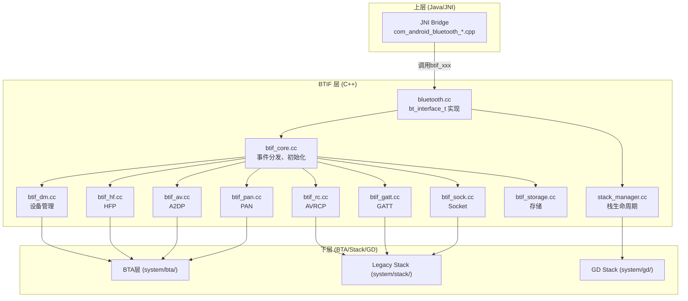
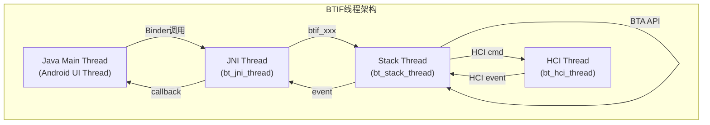
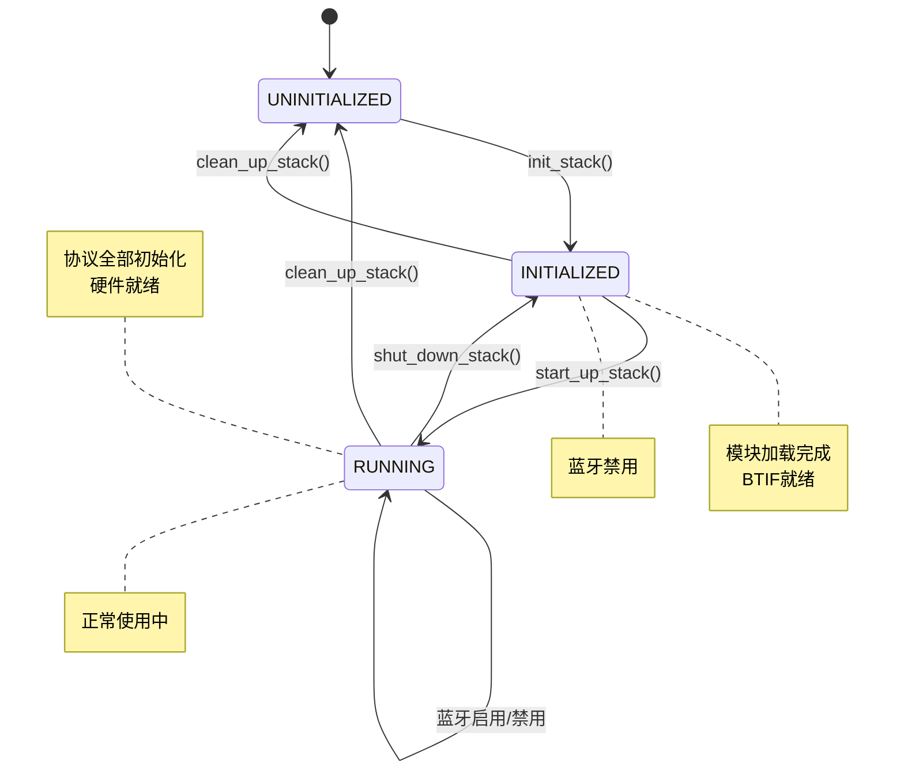
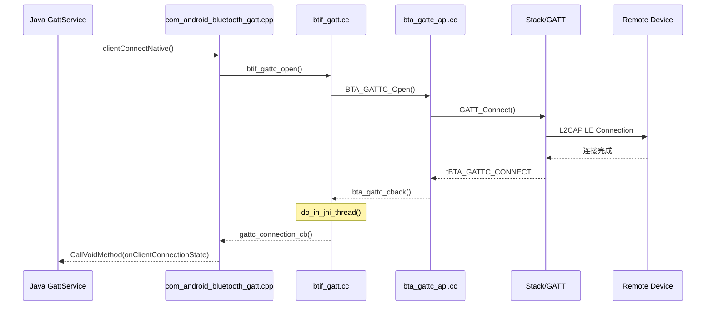

# 第8章：BTIF层 — Bluetooth Interface

> **难度**: ★★★★☆ | **前置知识**: Ch7 JNI Bridge, Ch3 C++基础 | **C++依赖**: 高
> **预计阅读时间**: 3-4小时 | **预计学习天数**: 4-5天
> **核心作用**: 理解JNI到BTA之间的调度层，蓝牙Native栈的"大脑"

---

## 学习目标

- 理解BTIF在蓝牙栈中的枢纽角色
- 掌握 `bluetooth.cc` 的核心接口定义
- 理解 `btif_core.cc` 的事件分发机制
- 掌握各Profile的BTIF实现模式
- 理解 `stack_manager.cc` 的栈生命周期管理

---

## 1. BTIF 架构总览

BTIF = **Bluetooth Interface**，位于JNI与BTA/Stack之间：



### 1.1 BTIF的角色

```
         JNI层（Java调用）
              ↓
          btif_xxx()  ← BTIF API入口
              ↓
     ┌──────────────────┐
     │   btif_core      │ ← 事件分发、线程管理
     │   事件队列         │
     └──────┬───────────┘
            ↓
      ┌─────────────┐
      │   BTA API   │ ← 调用BTA层的函数
      └─────────────┘
```

**核心职责**：
1. **翻译**：将JNI的C函数调用转为BTA的面向对象API调用
2. **调度**：管理事件在JNI线程和Stack线程之间的传递
3. **生命周期**：通过stack_manager管理蓝牙栈的启动/停止
4. **缓存**：缓存设备信息、配置等

---

## 2. bluetooth.cc — 核心接口

### 2.1 bt_interface_t 结构体

这是**Native层蓝牙的唯一入口点**，定义在 `system/include/hardware/bluetooth.h`：

```cpp
// hardware/bluetooth.h — Native层核心接口
typedef struct {
    // 大小
    size_t size;
    
    // 初始化/清理
    bt_status_t (*init)(bt_callbacks_t* callbacks,
                        bool is_common_criteria,
                        int* max_allowable_advertisements);
    void (*cleanup)(void);
    
    // 启用/禁用
    bt_status_t (*enable)(void);
    bt_status_t (*disable)(void);
    
    // 设备管理
    bt_status_t (*create_bond)(const RawAddress* bd_addr, int transport);
    bt_status_t (*cancel_bond)(const RawAddress* bd_addr);
    bt_status_t (*remove_bond)(const RawAddress* bd_addr);
    bt_status_t (*pin_reply)(const RawAddress* bd_addr,
                              uint8_t accept, uint8_t pin_len,
                              bt_pin_code_t* pin_code);
    
    // 扫描
    bt_status_t (*start_discovery)(void);
    bt_status_t (*cancel_discovery)(void);
    
    // 属性
    bt_status_t (*get_adapter_properties)(void);
    bt_status_t (*get_remote_device_properties)(const RawAddress* bd_addr);
    bt_status_t (*set_device_name)(const char* name);
    
    // ... 更多接口
} bt_interface_t;
```

### 2.2 bluetooth.cc 中的实现

```cpp
// system/btif/src/bluetooth.cc

// 静态函数表 —— 所有接口的实现
static bt_status_t btif_init(bt_callbacks_t* callbacks,
                              bool is_common_criteria,
                              int* max_allowable_advertisements) {
    // 保存回调函数（用于JNI回调Java）
    btif_core_init(callbacks);
    
    // 初始化栈
    stack_manager_get_interface()->init_stack(GetInterfaceToProfiles());
    
    *max_allowable_advertisements = 2;  // BLE最多2个广播集
    return BT_STATUS_SUCCESS;
}

static bt_status_t btif_enable(void) {
    // 异步启动栈
    stack_manager_get_interface()->start_up_stack_async(
        GetInterfaceToProfiles(),
        base::BindOnce(btif_enable_profile_services),
        base::BindOnce(btif_disable_profile_services));
    return BT_STATUS_SUCCESS;
}

static bt_status_t btif_create_bond(const RawAddress* bd_addr, int transport) {
    // 委托给btif_dm
    return btif_dm_create_bond(bd_addr, transport);
}

// 接口表 —— JNI调用的入口
static const bt_interface_t bluetoothInterface = {
    sizeof(bt_interface_t),
    btif_init,
    btif_enable,
    btif_disable,
    btif_cleanup,
    btif_get_adapter_properties,
    btif_get_remote_device_properties,
    btif_set_device_name,
    btif_start_discovery,
    btif_cancel_discovery,
    btif_create_bond,
    btif_cancel_bond,
    btif_remove_bond,
    // ...
};

// 获取接口（JNI通过此函数获得bt_interface_t）
const bt_interface_t* bluetooth::get_bluetooth_interface() {
    return &bluetoothInterface;
}
```

### 2.3 回调注册

```cpp
// bt_callbacks_t — 从Native回调Java的接口
typedef struct {
    size_t size;
    
    // 适配器状态变更
    void (*adapter_state_changed_cb)(bt_state_t state);
    
    // 适配器属性变更
    void (*adapter_properties_cb)(bt_status_t status,
                                   int num_properties,
                                   bt_property_t* properties);
    
    // 远端设备属性
    void (*remote_device_properties_cb)(bt_status_t status,
                                         const RawAddress* bd_addr,
                                         int num_properties,
                                         bt_property_t* properties);
    
    // 设备发现
    void (*device_found_cb)(int num_properties,
                             bt_property_t* properties);
    
    // 绑定状态变更（配对结果）
    void (*bond_state_changed_cb)(bt_status_t status,
                                   const RawAddress* bd_addr,
                                   bt_bond_state_t state);
    
    // 连接状态变更
    void (*acl_state_changed_cb)(bt_status_t status,
                                  const RawAddress* bd_addr,
                                  bt_acl_state_t state);
    
    // 线程事件
    void (*thread_evt_cb)(bt_cb_thread_evt evt);
    
    // ... 更多回调
} bt_callbacks_t;
```

---

## 3. btif_core.cc — 核心调度

### 3.1 初始化流程

```cpp
// btif_core.cc — 核心初始化
void btif_core_init(bt_callbacks_t* callbacks) {
    // 1. 保存JNI回调
    btif_core_save_callbacks(callbacks);
    
    // 2. 初始化BTIF的JNI任务队列
    btif_jni_task_init();
    
    // 3. 初始化Profile队列
    btif_queue_init();
    
    // 4. 其他模块初始化
}

// 启用蓝牙
static void btif_enable_bluetooth() {
    // 来自JNI的调用入口
    // 1. 启动栈管理器
    stack_manager_get_interface()->start_up_stack_async(
        GetInterfaceToProfiles(),
        base::BindOnce(btif_enable_profile_services),
        base::BindOnce(btif_disable_profile_services));
}
```

### 3.2 事件分发机制

```cpp
// btif_core 中的事件分发
void btif_transfer_context(tBTA_SYS_CONN_STATUS type,
                           tBTA_SYS_CONN_CBACK* p_cback,
                           tBTA_SYS_CONN_STATUS data) {
    // 将事件从当前线程转移到BTIF上下文
    do_in_jni_thread(base::BindOnce(p_cback, data));
}

// "do_in_jni_thread" 函数
void do_in_jni_thread(base::OnceClosure task) {
    // 获取JNI消息循环线程
    MessageLoopThread* thread = get_jni_thread();
    
    if (thread && thread->IsRunning()) {
        // 投递任务到JNI线程
        thread->DoInThread(std::move(task));
    }
}
```

### 3.3 线程模型



---

## 4. Profile BTIF 实现

### 4.1 btif_hf.cc — HFP实现

```cpp
// btif_hf.cc — HFP的BTIF层

// 来自JNI的连接请求
bt_status_t btif_hf_connect(const RawAddress& bd_addr) {
    // 1. 参数验证
    if (bd_addr.IsEmpty()) return BT_STATUS_PARM_INVALID;
    
    // 2. 转换为BTA调用
    tBTA_AG_PEER_ADDR peer_addr;
    memcpy(&peer_addr, &bd_addr, sizeof(RawAddress));
    
    // 3. 在Stack线程执行BTA调用
    btif_transfer_context(__func__, [](void* data) {
        auto* addr = static_cast<RawAddress*>(data);
        BTA_AgOpen(*addr, BTA_AG_UUID, BTA_AG_SEC_NONE, BTA_AG_FEAT_NONE);
    }, &bd_addr, sizeof(RawAddress));
    
    return BT_STATUS_SUCCESS;
}

// BTA回调 → JNI回调
static void btif_hf_connection_state_cb(tBTA_AG_EVT event,
                                         tBTA_AG* p_data) {
    // 在JNI线程执行
    do_in_jni_thread(base::BindOnce([](tBTA_AG* data) {
        // 调用JNI回调 → Java层
        sBluetoothHfCallbacks->connection_state_cb(
            data->conn.handle,
            data->conn.peer_addr,
            data->conn.state);
    }, p_data));
}
```

### 4.2 btif_av.cc — A2DP实现

```cpp
// btif_av.cc — A2DP的BTIF层

bt_status_t btif_av_connect(const RawAddress& bd_addr) {
    // A2DP Source连接
    LOG_INFO("A2DP Connect to %s", bd_addr.ToString().c_str());
    
    // 1. 检查是否已连接
    if (btif_av_is_connected(bd_addr)) {
        return BT_STATUS_BUSY;
    }
    
    // 2. 调用BTA AV层
    BTA_AvOpen(&bd_addr, BTA_AV_CP, BTA_AV_FEAT_NONE);
    
    return BT_STATUS_SUCCESS;
}

// 流状态变化回调
static void btif_av_state_cb(tBTA_AV_EVT event, tBTA_AV* p_data) {
    do_in_jni_thread(base::BindOnce([event, data = *p_data]() {
        switch (event) {
            case BTA_AV_OPEN_EVT:
                // 流已打开
                sBluetoothAvCallbacks->connection_state_cb(
                    data.open.bd_addr, BTA_AV_CONNECTION_STATE_CONNECTED);
                break;
            case BTA_AV_CLOSE_EVT:
                // 流已关闭
                sBluetoothAvCallbacks->connection_state_cb(
                    data.close.bd_addr, BTA_AV_CONNECTION_STATE_DISCONNECTED);
                break;
            case BTA_AV_START_EVT:
                // 流开始播放
                sBluetoothAvCallbacks->audio_state_cb(
                    data.start.bd_addr, BTA_AV_AUDIO_STATE_STARTED);
                break;
            case BTA_AV_STOP_EVT:
                // 流停止
                sBluetoothAvCallbacks->audio_state_cb(
                    data.stop.bd_addr, BTA_AV_AUDIO_STATE_STOPPED);
                break;
        }
    }));
}
```

### 4.3 btif_dm.cc — 设备管理

设备管理是蓝牙中最核心的功能之一，包括**发现、配对、连接**：

```cpp
// btif_dm.cc — 设备管理

// 发起配对
bt_status_t btif_dm_create_bond(const RawAddress* bd_addr, int transport) {
    // 1. 检查是否已配对
    if (btif_dm_is_bonded(*bd_addr)) {
        return BT_STATUS_DONE;  // 已经配对了
    }
    
    // 2. 设置传输类型（经典/LE/AUTO）
    tBT_TRANSPORT ttransport = BT_TRANSPORT_AUTO;
    if (transport == 0) ttransport = BT_TRANSPORT_BR_EDR;
    else if (transport == 1) ttransport = BT_TRANSPORT_LE;
    
    // 3. 调用BTA层
    BTA_DmBond(*bd_addr, ttransport, nullptr, 0);
    
    return BT_STATUS_SUCCESS;
}

// 设备发现回调
static void btif_dm_device_found_cb(tBTA_DM_SEARCH_EVT event,
                                      tBTA_DM_SEARCH* p_data) {
    do_in_jni_thread(base::BindOnce([data = *p_data]() {
        // 通过JNI回调通知Java层发现设备
        HAL_CBACK(bt_hal_cbacks, device_found_cb,
                  data.inq.num_properties,
                  data.inq.properties);
    }));
}
```

### 4.4 btif_sock.cc — Socket管理

```cpp
// btif_sock.cc — RFCOMM Socket

bt_status_t btif_sock_connect(const RawAddress* bd_addr, int channel) {
    // 建立RFCOMM连接
    return btif_sock_connect(bd_addr, NULL, channel, BTH_FLOW_NONE, 0);
}

bt_status_t btif_sock_listen(const char* name, const Uuid* uuid,
                              int channel, int flag) {
    // 监听RFCOMM连接
    return btsock_listen(name, uuid, channel, &sock_handle, flag);
}
```

---

## 5. stack_manager.cc — 栈生命周期

```cpp
// stack_manager.cc — 栈生命周期管理

static MessageLoopThread management_thread("bt_stack_manager_thread");
static bool stack_is_initialized = false;
static bool stack_is_running = false;

// 初始化栈
static void init_stack_internal(CoreInterface* interface) {
    // 1. 保存Profile接口
    interfaceToProfiles = interface;
    
    // 2. 启动模块管理
    module_management_start();
    main_thread_start_up();
    
    // 3. 按顺序初始化各模块
    module_init(DEVICE_IOT_CONFIG_MODULE);
    module_init(OSI_MODULE);
    module_start_up(GD_SHIM_MODULE);  // ← 启动GD Shim
    module_init(BTIF_CONFIG_MODULE);
    
    // 4. 初始化BTIF
    btif_init_bluetooth();
    
    // 5. 其他模块
    module_init(INTEROP_MODULE);
    module_init(STACK_CONFIG_MODULE);
    
    stack_is_initialized = true;
}

// 启动栈（异步）
static void event_start_up_stack(CoreInterface* interface,
                                  ProfileStartCallback startProfiles,
                                  ProfileStopCallback stopProfiles) {
    // 1. 初始化BTM（蓝牙设备管理）
    get_btm_client_interface().lifecycle.btm_init();
    
    // 2. 初始化各协议
    l2c_init();     // L2CAP
    sdp_init();     // SDP
    gatt_init();    // GATT
    SMP_Init(...);  // SMP
    RFCOMM_Init();  // RFCOMM
    GAP_Init();     // GAP
    
    // 3. 启动Profile服务
    startProfiles();
    
    // 4. 初始化BTA系统
    bta_sys_init();
    BTA_dm_init();
    bta_dm_enable(btif_dm_sec_evt, btif_dm_acl_evt);
    
    // 5. 通知硬件就绪
    BTA_dm_on_hw_on();
    
    // 6. 等待HCI就绪
    if (future_await(local_hack_future) == FUTURE_SUCCESS) {
        stack_is_running = true;
        // 通知JNI线程蓝牙已就绪
        do_in_jni_thread(base::BindOnce(event_signal_stack_up, nullptr));
    }
}
```

### 5.1 栈状态转换



---

## 6. BTIF 回调机制深度分析

### 6.1 回调链全景



### 6.2 回调注册表

```cpp
// BTIF 各模块的回调注册

// btif_hf.cc — HFP回调
static const bt_callbacks_t* bt_hal_cbacks = NULL;

void btif_hf_register_callback(bt_callbacks_t* callbacks) {
    bt_hal_cbacks = callbacks;
}

// btif_av.cc — A2DP回调
static bluetooth::av::A2dpCodecConfig* a2dp_codec_config = NULL;
static btav_callbacks_t* bt_av_callbacks = NULL;

void btif_av_register_callback(btav_callbacks_t* callbacks) {
    bt_av_callbacks = callbacks;
}

// btif_gatt.cc — GATT回调（多个回调表）
static const btgatt_callbacks_t* gatt_callbacks = NULL;
static const btgatt_client_callbacks_t* gatt_client_callbacks = NULL;
static const btgatt_server_callbacks_t* gatt_server_callbacks = NULL;
```

---

## 7. 实战练习

### 练习1：阅读bluetooth.cc

```cpp
// 阅读 system/btif/src/bluetooth.cc
// 1. 找到 btif_enable_bluetooth() 的实现
// 2. 找到 btif_init_bluetooth() 中的初始化顺序
// 3. 找到 bt_interface_t 表的完整定义
```

> **答案**: ① `btif_enable_bluetooth()` (bluetooth.cc:160)：调用`btif_dm.cc:BTIF_Enable()` → `stack_manager.cc:StartUp()` → GD栈启动 → Legacy栈启动。② `btif_init_bluetooth()` (bluetooth.cc:110)初始化顺序：`btif_core_init()` → `btif_dm_init()` → `btif_storage_init()` → `btif_av_init()` → `btif_hf_init()` → `btif_gatt_init()` → `btif_pan_init()` → `btif_sock_init()`。③ `bt_interface_t`表 (bluetooth.cc:412)包含：`init`, `enable`, `disable`, `cleanup`, `get_adapter_properties`, `get_adapter_property`, `set_adapter_property`, `get_remote_device_properties`, `get_remote_device_property`, `set_remote_device_property`, `get_remote_services`, `start_discovery`, `cancel_discovery`, `create_bond`, `remove_bond`等30+函数指针。

### 练习2：分析btif_hf.cc的AT命令处理

```cpp
// 阅读 system/btif/src/btif_hf.cc
// 1. AT命令如何从BTA层传递到JNI？
// 2. btif_hf_connection_state_cb() 处理哪些状态？
// 3. 回调如何在JNI和Stack线程间切换？
```

> **答案**: ① AT命令路径：BTA层`bta_ag_sdp.cc`收到RFCOMM数据 → `BtaAgCback`回调到BTIF → `btif_hf_at.cc:btif_hf_parse_at()`解析AT → `btif_hf.cc:btif_hf_at_command_cback()` → JNI`callAtCommandCallback()`到Java。② `btif_hf_connection_state_cb()`处理状态(btif_hf.cc:780)：`BTA_AG_OPEN_EVT`(连接成功)、`BTA_AG_CLOSE_EVT`(连接断开)、`BTA_AG_CONN_EVT`(SLC建立完成)、`BTA_AG_AUDIO_OPEN_EVT`(SCO音频开启)、`BTA_AG_AUDIO_CLOSE_EVT`(SCO音频关闭)。③ 线程切换：BTA回调在BTU线程上执行 → `btif_hf.cc`用`do_in_jni_thread()`或`btif_transfer_context()`将回调POST到JNI线程 → JNI线程上执行Java回调。`btif_transfer_context()`内部使用`sBtifTaskQueue`做线程切换。

### 练习3：跟踪stack_manager启动流程

```cpp
// 阅读 system/btif/src/stack_manager.cc
// 1. init_stack_internal() 的模块加载顺序
// 2. event_start_up_stack() 的协议初始化顺序（为什么L2CAP早于GATT？）
// 3. event_signal_stack_up() 什么时候被调用？
```

> **答案**: ① `init_stack_internal()` (stack_manager.cc:155)模块顺序：`hci_module` → `btm_module` → `l2cap_module` → `sdp_module` → `gatt_module` → `avdtp_module` → `pan_module` → `rfcomm_module`。② L2CAP早于GATT因为GATT是L2CAP的上层协议（GATT channel在L2CAP的固定CID 0x0004上传输），必须先有L2CAP层才能注册GATT的固定通道。③ `event_signal_stack_up()` (stack_manager.cc:176)在以下情况被调用：`event_start_up_stack()`中所有协议模块初始化完毕后 → `StackManager::on_hcii_server_ready()` → 检查到GD HCII server ready → `event_signal_stack_up()`通知上层栈已就绪。

---

## 车载场景BTIF注意事项

- **HFP优先级**: `btif_hf.cc` 中通话事件(BTA_AG_CIEV_EVT)应比A2DP媒体事件有更高处理优先级
- **多设备状态**: `btif_dm.cc` 中的绑定状态变化`BTA_DM_BOND_CBACK`需要区分设备优先级（主驾驶vs乘客）
- **共存调度**: BTIF回调处理时应避免长时间阻塞，以免影响其他Profile的RF调度
- **调试**: 车载多Profile并发问题时, 重点关注`btif_core.cc`中的`btif_transfer_context`事件队列

---

## 本章总结

学完本章后，你应该能：
- 理解BTIF是"蓝牙接口"层——它是JNI的C++端点，也是Profile Service在Native的镜像
- 掌握`bt_interface_t`回调表结构：`init`/`enable`/`disable`/`cleanup`等30+函数指针
- 理解`stack_manager.cc`的模块初始化顺序：HCI→BTM→L2CAP→SDP→GATT→AVDTP→RFCOMM
- 掌握`btif_transfer_context()`的线程切换机制：BTU线程→JNI线程
- 理解BTIF回调的"回调注册表"模式：`btif_hf_register_callback()`注册 `bt_callbacks_t`
- 知道车载场景下BTIF层是调试多Profile并发问题的关键层

> BTIF是Legacy Native栈的入口点，而GD栈有完全不同的架构。下一章我们深入BTA层——Legacy Java到Native的最后一站。

---

## 车载场景

BTIF层在车载环境中的关键作用：

### 1. 多Profile并发调试
- BTIF层是调试车载多Profile并发问题的关键层
- `btif_transfer_context()`负责将事件从BTU线程切换到JNI线程，车载场景下需要确保线程切换延迟<5ms
- `btif_dm.cc`管理所有设备的配对和连接状态，车载多设备场景下需要关注设备切换逻辑

### 2. 车载初始化顺序
- 车机蓝牙启动时，BTIF层的模块初始化顺序影响启动时间：HCI→BTM→L2CAP→SDP→GATT→AVDTP→RFCOMM
- 车厂可能要求跳过某些不需要的Profile初始化（如PAN、HID）以加快启动速度
- `stack_manager.cc`的初始化日志是排查车机蓝牙启动慢的第一手资料

### 3. 车载回调注册
- `btif_hf_register_callback()`等回调注册机制确保HFP/A2DP事件能正确路由到Java层
- 车载场景下，如果回调注册失败，会导致通话状态不更新——这是车厂常见问题

---

## 相关章节

- **BTIF的回调通过JNI回到Java**：[第7章JNI Bridge](07_JNI_Bridge.md)
- **BTA层的Profile逻辑实现**：[第9章BTA层](09_BTA_Layer.md)
- **GD Shim层的路由决策**：[第14章GD架构](14_GD_Architecture.md)
- **bt_interface_t的结构参考**：[第4章](04_Public_API_Framework.md)的Framework API设计思路

---

## 参考文件清单

| 文件 | 核心内容 |
|------|---------|
| `system/btif/src/bluetooth.cc` | bt_interface_t 实现 |
| `system/btif/src/btif_core.cc` | 核心调度、初始化 |
| `system/btif/src/stack_manager.cc` | 栈生命周期 |
| `system/btif/src/btif_dm.cc` | 设备管理（配对/发现） |
| `system/btif/src/btif_hf.cc` | HFP实现 |
| `system/btif/src/btif_av.cc` | A2DP实现 |
| `system/btif/src/btif_rc.cc` | AVRCP实现 |
| `system/btif/src/btif_gatt.cc` | GATT实现 |
| `system/btif/src/btif_sock.cc` | Socket/RFCOMM |
| `system/btif/src/btif_pan.cc` | PAN实现 |
| `system/btif/src/btif_storage.cc` | 存储管理 |
| `system/btif/include/bluetooth.h` | BTIF核心头文件 |
| `system/btif/include/btif_api.h` | BTIF API头文件 |
| `system/include/hardware/bluetooth.h` | bt_interface_t定义 |


| **V8 深度分析报告** | |
| V8_HAL_JNI_Analysis.md | 见该报告完整分析 |
| V8_Architecture_Map.md | 见该报告完整分析 |

> **下一步**: 阅读 [第9章：BTA层](09_BTA_Layer.md)
