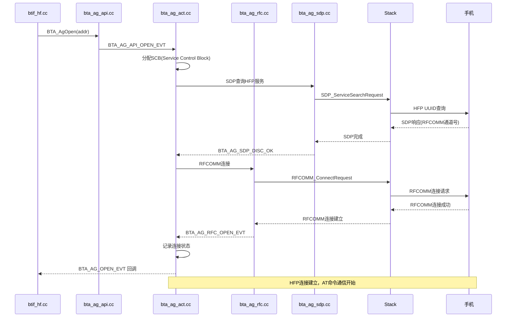
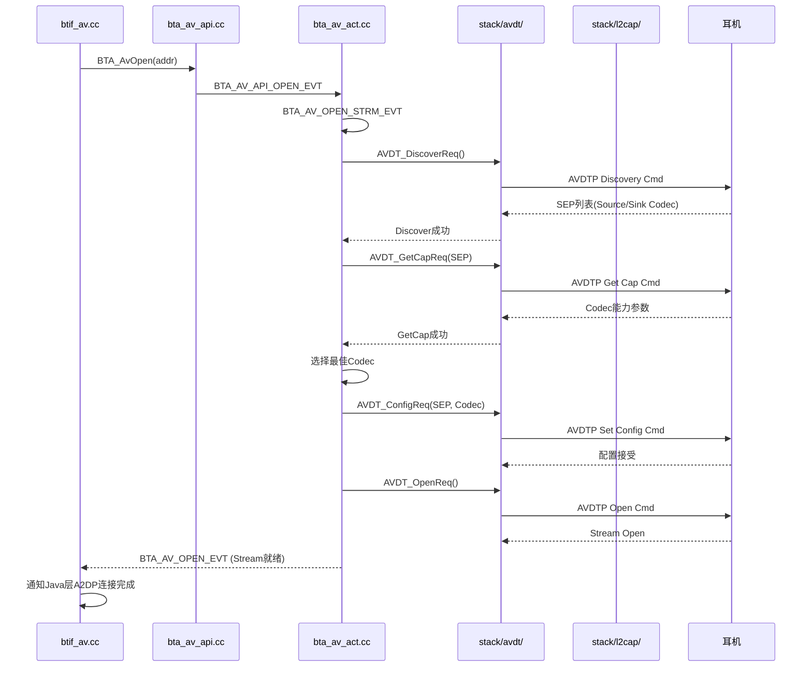

# 第9章：BTA层 — Bluetooth Application

> **难度**: ★★★★★ | **前置知识**: Ch8 BTIF层 | **C++依赖**: 高
> **预计阅读时间**: 3-4小时 | **预计学习天数**: 5-7天
> **核心作用**: 理解Profile的C++实现层，连接BTIF与Legacy Stack

---

## 学习目标

- 理解BTA的事件驱动模型和模块架构
- 掌握BTA DM（设备管理）的实现
- 掌握BTA AG（HFP）的实现
- 掌握BTA AV（A2DP）的实现
- 能分析一个Profile从BTA到Legacy Stack的调用链

---

## 1. BTA 架构总览

BTA = **Bluetooth Application**，位于BTIF与Legacy Stack之间：

```mermaid
graph TB
    subgraph "BTIF层"
        BTIF["btif_hf.cc / btif_av.cc / btif_dm.cc"]
    end

    subgraph "BTA层 (system/bta/)"
        BTA_API["API层<br/>bta_xx_api.cc<br/>对外接口"]
        BTA_ACT["动作层<br/>bta_xx_act.cc<br/>事件处理"]
        BTA_SYS["系统层<br/>bta_sys_main.cc<br/>事件分发"]
    end

    subgraph "Legacy Stack (system/stack/)"
        STACK["BTM / L2CAP / RFCOMM / SDP / GATT"]
    end

    BTIF -->|BTA_ApiXxx()| BTA_API
    BTA_API -->|发送事件| BTA_SYS
    BTA_SYS -->|分发事件| BTA_ACT
    BTA_ACT -->|Stack API| STACK
    STACK -->|回调| BTA_ACT
    BTA_ACT -->|回调| BTA_API
    BTA_API -->|回调| BTIF
```

### 1.1 模块划分

```
system/bta/
├── dm/       ← 设备管理（核心）
├── ag/       ← Audio Gateway (HFP)
├── hf_client/← HFP Client
├── av/       ← Audio/Video (A2DP)
├── gatt/     ← GATT Client/Server
├── hh/       ← HID Host
├── hd/       ← HID Device
├── pan/      ← PAN
├── le_audio/ ← LE Audio
├── hearing_aid/ ← Hearing Aid
├── csis/     ← 协调集标识
├── has/      ← 听力辅助服务
├── vc/       ← 音量控制
├── vaps/     ← 音量音频策略
├── aics/     ← 音频输入控制
├── ras/      ← 渲染调整服务
├── gmap/     ← GMAP
├── sdp/      ← SDP
├── rfcomm/   ← RFCOMM
├── jv/       ← Java Interface
├── sys/      ← 系统管理
├── groups/   ← 组管理
└── include/  ← 公共头文件
```

### 1.2 BTA的事件驱动模型

BTA 使用**事件驱动+状态机**的模式。每个模块：

1. **API层**: 接收BTIF的调用，封装为事件
2. **系统层**: 将事件投递到正确的处理线程
3. **动作层**: 处理事件（可能调用Stack API）

```
BTIF:  BTA_AgOpen(addr)                    ← API调用
        ↓
API:   bta_ag_api.cc: 创建事件 BTA_AG_API_OPEN_EVT
        ↓
SYS:   bta_sys_main.cc: 投递事件到事件队列
        ↓
ACT:   bta_ag_act.cc: 处理 BTA_AG_OPEN_EVT
         ├─ 调用 Stack API (如 RFCOMM_ConnectRequest)
         ├─ 记录状态变更
         └─ 回调 BTIF
```

---

## 2. BTA 系统层 (bta_sys)

### 2.1 事件循环

```cpp
// bta_sys_main.cc — BTA主事件循环
static void bta_sys_event_handler(BTC_HDR* p_msg) {
    // 1. 从事件头中提取模块ID和事件码
    uint8_t module_id = p_msg->event >> 8;
    uint16_t event_code = p_msg->event & 0xFF;
    
    // 2. 根据模块ID分发到对应模块的事件处理
    switch (module_id) {
        case BTA_ID_DM:
            bta_dm_sm_execute(p_msg);
            break;
        case BTA_ID_AG:
            bta_ag_sm_execute(p_msg);
            break;
        case BTA_ID_AV:
            bta_av_sm_execute(p_msg);
            break;
        case BTA_ID_GATTC:
            bta_gattc_sm_execute(p_msg);
            break;
        // ...
    }
}
```

### 2.2 事件结构

```cpp
// 所有BTA事件共享的基础结构
typedef struct {
    uint16_t event;    // 高位: 模块ID, 低位: 事件码
    uint16_t len;      // 数据长度
    uint8_t offset;    // 数据偏移
    uint8_t layer_specific;  // 层特定标志
    uint8_t data[];    // 可变长度数据
} BTC_HDR;

// 事件码定义（例：BTA AG模块）
#define BTA_ID_AG       6          // 模块ID
// 事件码
#define BTA_AG_API_OPEN_EVT    0  // API打开连接
#define BTA_AG_API_CLOSE_EVT   1  // API关闭连接
#define BTA_AG_API_AT_EVT      2  // AT命令
#define BTA_AG_API_AUDIO_OPEN_EVT 3  // 音频打开
#define BTA_AG_NUM_EVTS        4  // 事件总数
```

### 2.3 连接管理

```cpp
// bta_sys_conn.cc — BTA连接管理
void bta_sys_conn_open(uint8_t id, uint8_t app_id, const RawAddress& peer_addr) {
    // 通知系统层某个Profile的连接已打开
    // 用于跨Profile的连接状态跟踪
}

void bta_sys_conn_close(uint8_t id, uint8_t app_id, const RawAddress& peer_addr) {
    // 通知系统层某个Profile的连接已关闭
}

void bta_sys_sco_open(uint8_t id, uint8_t app_id, const RawAddress& peer_addr) {
    // SCO音频连接打开
    // 通知其他Profile（如A2DP）暂停音频
}
```

---

## 3. BTA DM — 设备管理

### 3.1 模块结构

```cpp
// bta/dm/ — 设备管理模块
// bta_dm_api.cc  — 对外API
// bta_dm_act.cc  — 事件处理
// bta_dm_sec.cc  — 安全管理

// 状态
tBTA_DM_STATE bta_dm_state;

// API调用
void BTA_DmInit(void) {
    // 初始化DM模块，注册系统服务
    bta_sys_register(BTA_ID_DM, &bta_dm_reg);
}

void BTA_DmEnable(tBTA_DM_SEC_CBACK* p_sec_cback) {
    // 启用DM（蓝牙启用时的核心调用）
    tBTA_DM_MSG* p_msg = (tBTA_DM_MSG*)osi_malloc(sizeof(tBTA_DM_MSG));
    p_msg->hdr.event = BTA_ID_DM & BTA_DM_API_ENABLE_EVT;
    p_msg->enable.p_sec_cback = p_sec_cback;
    bta_sys_sendmsg(p_msg);  // 投递事件
}
```

### 3.2 事件处理

```cpp
// bta_dm_act.cc — DM事件处理
void bta_dm_enable(tBTA_DM_MSG* p_data) {
    // 1. 设置安全回调
    bta_dm_cb.p_sec_cback = p_data->enable.p_sec_cback;
    
    // 2. 初始化BTM层
    BTM_DeviceReset();  // 重置蓝牙控制器
    
    // 3. 设置设备名称和类
    BTM_SetDeviceClass(btm_cb.dev_class);
    
    // 4. 设置扫描模式
    BTM_SetDiscoverability(BTM_GENERAL_DISCOVERABLE);
    
    // 5. 注册安全回调
    BTM_SecRegister(&bta_dm_sec_cback);
    
    // 6. 注册ACL回调
    BTM_AclRegister(&bta_dm_acl_cback);
}

void bta_dm_disable(tBTA_DM_MSG* p_data) {
    // 1. 断开所有连接
    BTM_RemoveAllAcl();
    
    // 2. 清理安全状态
    BTM_SecClrService();
    
    // 3. 清理DM资源
    bta_dm_cb.p_sec_cback = NULL;
}
```

### 3.3 安全处理 (bta_dm_sec.cc)

```cpp
// bta_dm_sec.cc — 配对/安全

// 配对请求
void bta_dm_sec_bond(const RawAddress& bd_addr, tBT_TRANSPORT transport) {
    // 1. 开始认证
    BTM_SecAddRmtNameNotifyCallback(&bta_dm_sec_name_cback);
    
    // 2. 发起带安全连接的ACL
    BTM_SetSecurityLevel(TRUE, "", BTM_SEC_SERVICE_OPEN,
                          BTM_SEC_NONE, BTM_NO_PAIRING, 0, 0);
    
    // 3. 发起配对
    BTM_SecBondByTransport(bd_addr, transport);
}

// 配对完成回调
static void bta_dm_sec_bond_cback(tBTA_DM_SEC_EVT event,
                                    tBTA_DM_SEC* p_data) {
    switch (event) {
        case BTA_DM_BOND_CREATED_EVT:
            // 配对成功，保存Link Key
            btif_dm_save_bond(p_data->bond.bd_addr);
            break;
        case BTA_DM_AUTH_CMPL_EVT:
            // 认证完成
            break;
        case BTA_DM_PIN_REQ_EVT:
            // PIN码请求（传统配对）
            bta_dm_pin_req(p_data->pin_req.bd_addr);
            break;
        case BTA_DM_SP_CFM_REQ_EVT:
            // 数字比较确认请求
            bta_dm_sp_cfm_req(p_data->sp_cfm.bd_addr, p_data->sp_cfm.just_works);
            break;
    }
}
```

---

## 4. BTA AG (HFP) — Audio Gateway

### 4.1 模块结构

```cpp
// bta/ag/ — HFP Audio Gateway（车载端）
// bta_ag_api.cc  — 对外API
// bta_ag_act.cc  — 事件处理
// bta_ag_at.cc   — AT命令解析
// bta_ag_cmd.cc  — AT命令执行
// bta_ag_main.cc — 主状态机
// bta_ag_sdp.cc  — SDP查询
// bta_ag_rfc.cc  — RFCOMM连接

// API入口
void BTA_AgOpen(const RawAddress& bd_addr, tBTA_SERVICE_ID service_id,
                tBTA_SEC sec_mask, tBTA_AG_FEAT features) {
    tBTA_AG_OPEN* p_msg = (tBTA_AG_OPEN*)osi_malloc(sizeof(tBTA_AG_OPEN));
    p_msg->hdr.event = BTA_ID_AG & BTA_AG_API_OPEN_EVT;
    p_msg->bd_addr = bd_addr;
    p_msg->service_id = service_id;
    p_msg->sec_mask = sec_mask;
    p_msg->features = features;
    bta_sys_sendmsg(p_msg);
}
```

### 4.2 HFP 连接建立



### 4.3 AT命令处理

```cpp
// bta_ag_at.cc — AT命令解析
tBTA_AG_AT_RESULT bta_ag_at_parse(tBTA_AG_SCB* p_scb,
                                    char* p_buf,
                                    uint16_t len) {
    // AT命令格式: AT+<command>[=<value>]
    // 如: AT+BRSF=245 (协商特性)
    
    if (strncmp(p_buf, "AT+BRSF=", 8) == 0) {
        // 解析特性
        uint32_t features = atoi(p_buf + 8);
        p_scb->peer_features = features;
        return BTA_AG_AT_RESULT_OK;
    }
    
    if (strcmp(p_buf, "AT+CIND?") == 0) {
        // 查询指示器状态
        return BTA_AG_AT_RESULT_CIND;
    }
    
    if (strncmp(p_buf, "AT+CHLD", 7) == 0) {
        // 呼叫保持操作
        return BTA_AG_AT_RESULT_CHLD;
    }
    
    // 未知命令
    return BTA_AG_AT_RESULT_ERROR;
}
```

---

## 5. BTA AV (A2DP) — Audio/Video

### 5.1 模块结构

```cpp
// bta/av/ — A2DP (Audio/Video)
// bta_av_api.cc   — 对外API
// bta_av_act.cc   — 事件处理（主要）
// bta_av_aact.cc  — 流控制动作
// bta_av_main.cc  — 主状态机
// bta_av_ci.cc    — 编解码接口
// bta_av_sbc.cc   — SBC编解码

// BTA AV状态
typedef struct {
    tBTA_AV_SCB* p_scb;          // Stream Control Block
    tBTA_AV_DATA* p_data;        // 媒体数据
    tBTA_AV_CBACK* p_cback;      // 回调
    BOOLEAN opened;               // 是否已打开
    uint8_t sep;                  // Stream End Point类型
    tBTA_AV_CODEC codec_type;    // 当前Codec
} tBTA_AV_CB;
```

### 5.2 A2DP 流建立



### 5.3 Codec协商

```cpp
// bta_av_act.cc — Codec协商
void bta_av_set_config(tBTA_AV_SCB* p_scb, tBTA_AV_MSG* p_data) {
    uint8_t* p = (uint8_t*)(p_data + 1);
    
    // 获取远端Codec能力
    tAVDT_CFG cfg;
    memcpy(&cfg, p, sizeof(tAVDT_CFG));
    
    // 对比本地和远端Codec能力
    // 选择双方都支持的最佳Codec
    if (cfg.codec_info[0] == AVDT_MEDIA_SBC) {
        // SBC — 所有设备都支持
        p_scb->codec_type = BTA_AV_CODEC_SBC;
        goto done;
    }
    
    if (cfg.codec_info[0] == AVDT_MEDIA_AAC) {
        if (bta_av_is_codec_supported(AVDT_MEDIA_AAC)) {
            p_scb->codec_type = BTA_AV_CODEC_AAC;
            goto done;
        }
    }
    
    // 默认降级到SBC
    p_scb->codec_type = BTA_AV_CODEC_SBC;
    
done:
    // 配置Codec参数（采样率、比特率等）
    bta_av_codec_config(p_scb, &cfg);
}
```

---

## 6. BTA GATT

### 6.1 模块结构

```cpp
// bta/gatt/ — GATT Client和Server
// bta_gattc_api.cc — GATT Client API
// bta_gatts_api.cc — GATT Server API
// database.cc       — GATT数据库
// bta_gattc_act.cc  — Client事件处理
// bta_gatts_act.cc  — Server事件处理

// GATT Client API
void BTA_GATTC_Open(uint8_t client_if, const RawAddress& remote_bda,
                     tBTA_GATT_TRANSPORT transport) {
    tBTA_GATTC_API_OPEN* p_msg = 
        (tBTA_GATTC_API_OPEN*)osi_malloc(sizeof(tBTA_GATTC_API_OPEN));
    p_msg->hdr.event = BTA_ID_GATTC & BTA_GATTC_API_OPEN_EVT;
    p_msg->client_if = client_if;
    p_msg->remote_bda = remote_bda;
    p_msg->transport = transport;
    bta_sys_sendmsg(p_msg);
}

// GATT Server API
void BTA_GATTS_AddService(uint8_t server_if,
                           btgatt_db_element_t* service,
                           int count) {
    // 添加GATT Service到本地数据库
    bta_gatts_add_service(server_if, service, count);
}
```

### 6.2 GATT属性数据库

```cpp
// database.cc — GATT数据库管理
class GattDatabase {
    struct Attribute {
        uint16_t handle;           // 属性句柄
        uint8_t type[LEN_UUID_128]; // UUID类型
        uint8_t permissions;       // 权限
        std::vector<uint8_t> value; // 属性值
    };
    
    std::vector<Attribute> attributes_;
    
    // 添加属性
    uint16_t AddAttribute(const uint8_t* uuid, uint8_t permissions) {
        Attribute attr;
        memcpy(attr.type, uuid, LEN_UUID_128);
        attr.permissions = permissions;
        attr.handle = next_handle_++;
        attributes_.push_back(attr);
        return attr.handle;
    }
    
    // 根据句柄查找属性
    Attribute* FindByHandle(uint16_t handle) {
        for (auto& attr : attributes_) {
            if (attr.handle == handle) return &attr;
        }
        return nullptr;
    }
};
```

---

## 7. BTA 状态机模式

每个BTA模块使用状态机管理连接生命周期。以AG(HFP)为例：

```mermaid
stateDiagram-v2
    [*] --> AG_INIT_ST
    
    AG_INIT_ST --> AG_OPENING_ST: BTA_AG_API_OPEN_EVT
    note right of AG_OPENING_ST: SDP查询<br/>RFCOMM连接
    
    AG_OPENING_ST --> AG_OPEN_ST: BTA_AG_RFC_OPEN_EVT
    note right of AG_OPEN_ST: 可收发AT命令<bt-&bt;gt;<br/>可建立SCO音频
    
    AG_OPEN_ST --> AG_CLOSING_ST: BTA_AG_API_CLOSE_EVT
    AG_OPEN_ST --> AG_INIT_ST: BTA_AG_RFC_CLOSE_EVT
    
    AG_OPENING_ST --> AG_INIT_ST: BTA_AG_RFC_CLOSE_EVT<br/>(连接失败)
    
    AG_CLOSING_ST --> AG_INIT_ST: BTA_AG_RFC_CLOSE_EVT
    AG_OPEN_ST --> AG_OPEN_ST: SCO连接(通话)
```



```cpp
// BTA AG状态机
static void bta_ag_sm_execute(tBTA_AG_SCB* p_scb, uint16_t event,
                                tBTA_AG_DATA* p_data) {
    switch (p_scb->state) {
        case BTA_AG_INIT_ST:
            switch (event) {
                case BTA_AG_API_OPEN_EVT:
                    bta_ag_open(p_scb, p_data);
                    p_scb->state = BTA_AG_OPENING_ST;
                    break;
            }
            break;
            
        case BTA_AG_OPEN_ST:
            switch (event) {
                case BTA_AG_API_CLOSE_EVT:
                    bta_ag_close(p_scb, p_data);
                    p_scb->state = BTA_AG_CLOSING_ST;
                    break;
                case BTA_AG_API_AUDIO_OPEN_EVT:
                    bta_ag_audio_open(p_scb, p_data);
                    break;
                case BTA_AG_RFC_CLOSE_EVT:
                    bta_ag_rfc_close(p_scb, p_data);
                    p_scb->state = BTA_AG_INIT_ST;
                    break;
            }
            break;
    }
}
```

---

## 8. 实战练习

### 练习1：追踪BTA AG连接

```cpp
// 阅读 system/bta/ag/bta_ag_api.cc 和 bta_ag_act.cc
// 1. BTA_AgOpen() 如何创建事件并投递？
// 2. bta_ag_open() 中做了哪些事情（SDP/RFCOMM初始化）
// 3. 状态机如何从 OPENING 转到 OPEN？
```

> **答案**: ① `BTA_AgOpen()` (bta_ag_api.cc:112)：创建`tBTA_AG_DATA`结构体，填充目标地址和app_id，调用`bta_sys_sendmsg()`将`BTA_AG_API_OPEN_EVT`事件投递到BTA主事件循环（bta_sys_main.cc的`bta_sys_event`处理）。② `bta_ag_open()` (bta_ag_act.cc:85)中：首先通过`bta_ag_sdp_config()`配置SDP记录 → `SDP_InitDiscoveryDb()`发起远端SDP查询（获取RFCOMM通道号） → SDP结果回调`bta_ag_sdp_cback()` → 获取到通道号后调用`RFCOMM_CreateConnection()`建立RFCOMM连接。③ OPENING→OPEN转换：RFCOMM连接成功 → `bta_ag_rfc_open_cback()`被调用 → `bta_ag_sm_execute(BTA_AG_RFC_OPEN_EVT)` → `bta_ag_send_buf()`发送AT+BRSF能力协商 → 收到AT+BRSF响应后SLC建立完成 → 状态切到`BTA_AG_OPEN_ST`。

### 练习2：分析BTA AV Codec协商

```cpp
// 阅读 system/bta/av/bta_av_act.cc
// 1. bta_av_set_config() 中Codec的选择逻辑
// 2. 如果远端只支持SBC，流程如何？
// 3. 如果支持AAC但本地不支持，流程如何？
```

> **答案**: ① `bta_av_set_config()` (bta_av_act.cc:710)中Codec选择逻辑：遍历本地支持的Codec列表(A2DP_SBC_INDEX, A2DP_AAC_INDEX, A2DP_APTX_INDEX, A2DP_LDAC_INDEX等)，通过`AVDT_GetCapabilities()`获取远端能力 → 对每个Codec调用`a2dp_codec_match()`检查交集 → 选择第一个匹配的最高优先级Codec。② 远端只支持SBC时：`AVDT_GetCapabilities`返回SBC能力，`a2dp_codec_match(A2DP_SBC_INDEX)`返回true，选择SBC，配置`tA2DP_SBC_IE`参数（采样率44.1kHz/48kHz、比特率320kbps等）。③ 本地不支持AAC时：遍历跳过AAC（`a2dp_codec_match(A2DP_AAC_INDEX)`返回false），继续尝试aptX、LDAC，如果全不支持则回退到SBC（所有Android设备强制支持的基线Codec），SBC必能匹配。

### 练习3：BTA与BTIF的接口

```cpp
// 对比 btif_hf.cc 和 bta_ag_api.cc
// 1. btif_hf_connect() 如何调用到 BTA_AgOpen()？
// 2. BTA的回调如何回到BTIF？
// 3. 哪些参数在传递中被转换？
```

> **答案**: ① `btif_hf_connect()` (btif_hf.cc:1251)中构造`tBTA_AG_OPEN`参数（包含`bd_addr`即对端地址，`app_id`即应用标识），调用`BTA_AgOpen(&p_bda, app_id)`直接投递事件到BTA。② BTA回调回到BTIF：BTA状态变化 → `bta_ag_cback()`被调用，投递`BTA_AG_OPEN_EVENT` → BTIF层在`btif_hf_handle_evt()`中接收，该函数通过`btif_transfer_context()`将事件从BTU线程切换到JNI线程 → 最终调用`btif_hf_connection_state_cb()`。③ 参数转换包括：`RawAddress`(Native) ↔ `BD_ADDR`(字节数组)的地址格式转换；`tBTA_AG_CONN`结构体中的状态码转换为JNI整数常量；RFCOMM通道号、Codec ID等数值类型在跨层时保持不变。

---

## 本章总结

学完本章后，你应该能：
- 理解BTA（Bluetooth Application）是Profile业务逻辑的实现层，位于BTIF之下、Stack之上
- 掌握BTA的**事件驱动架构**：`bta_sys_sendmsg()`投递BTA事件 → `bta_sys_event`分发 → 对应模块的解耦函数处理
- 理解BTA AG（HFP）状态机：`INIT→OPENING→OPEN→CLOSING`，每个状态处理特定事件集
- 理解BTA AV（A2DP）Codec协商流程：遍历Codec列表 → `AVDT_GetCapabilities`获取远端能力 → `a2dp_codec_match`匹配 → 选择最高优先级
- 理解BTA GATT的双角色（Client/Server）设计
- 知道车载多Profile并发场景下BTA的`btif_transfer_context()`是BTU→JNI线程切换的关键

> BTA以下就是蓝牙的核心协议栈。下一章我们深入Classic Stack核心协议：BTM、L2CAP、RFCOMM、SDP、SMP。

---

## 车载场景

BTA层在车载环境中的特殊设计：

### 1. BTA DM设备管理
- 车载场景下，BTA DM需要管理多个已绑定设备（驾驶员手机、乘客手机、BLE传感器）
- `bta_dm_sec.cc`的安全管理需要支持车厂的快速配对流程（NFC或二维码配对）
- 车机通常配置为"自动重连最近设备"，这在`bta_dm_act.cc`中实现

### 2. BTA AG（HFP）车载扩展
- 车载HFP需要支持双麦克风（驾驶员+副驾驶），BTA AG需要处理两路SCO数据
- `bta_ag_at.cc`的AT命令解析器需要支持车厂特定的AT命令扩展（如`+XAPL`）
- 车载通话优先级最高，BTA AG需要确保通话期间其他Profile的音频被正确暂停

### 3. BTA AV（A2DP）多音源
- 车载A2DP需要支持多音源切换（驾驶员手机→乘客手机→车载USB）
- `bta_av_act.cc`的Codec协商需要考虑车载功放支持的Codec优先级
- 导航音插入时，BTA AV需要支持"暂停而非断开"策略，确保恢复时延迟最低

---

## 相关章节

- **BTA事件由BTIF触发**：[第8章](08_BTIF_Layer.md)
- **BTA AG(HFP)依赖的RFCOMM/L2CAP协议**：[第10章](10_Classic_Stack_Core.md)
- **BTA AV(A2DP)的音频编码处理**：[第16章音频系统](16_Audio_System.md)
- **BTA GATT与BLE协议**：[第12章BLE栈](12_BLE_Stack.md)

---

## 参考文件清单

| **V8 深度分析报告** | 核心内容 |
| V8_Architecture_Map.md | 见该报告完整分析 |
| V8_Pairing_Analysis.md | 见该报告完整分析 |

| 文件 | 核心内容 |
|------|---------|
| `system/bta/sys/bta_sys_main.cc` | BTA主事件循环 |
| `system/bta/sys/bta_sys_conn.cc` | 连接管理 |
| `system/bta/include/bta_api.h` | BTA公共API头 |
| `system/bta/dm/bta_dm_api.cc` | DM API |
| `system/bta/dm/bta_dm_act.cc` | DM动作 |
| `system/bta/dm/bta_dm_sec.cc` | DM安全 |
| `system/bta/ag/bta_ag_api.cc` | HFP API |
| `system/bta/ag/bta_ag_act.cc` | HFP动作 |
| `system/bta/ag/bta_ag_at.cc` | AT命令解析 |
| `system/bta/av/bta_av_api.cc` | A2DP API |
| `system/bta/av/bta_av_act.cc` | A2DP动作 |
| `system/bta/gatt/bta_gattc_api.cc` | GATT Client API |
| `system/bta/gatt/bta_gatts_api.cc` | GATT Server API |
| `system/bta/gatt/database.cc` | GATT数据库 |

> **下一步**: 阅读 [第10章：Classic Stack核心协议](10_Classic_Stack_Core.md)
