# 第10章：Classic Stack 核心协议

> **难度**: ★★★★★ | **前置知识**: Ch9 BTA层 | **C++依赖**: 高
> **预计阅读时间**: 5-7小时 | **预计学习天数**: 7-10天
> **核心作用**: 理解经典蓝牙协议栈各层的功能和实现

---

## 学习目标

- 理解蓝牙协议栈的分层模型及每层职责
- 掌握 L2CAP 协议（通道、MTU、分段重组）
- 掌握 RFCOMM 协议（串口仿真、DLC管理）
- 掌握 SDP 协议（服务发现）
- 掌握 GATT/ATT 协议（属性协议）
- 掌握 SMP 协议（安全管理）
- 了解 AVDT/AVCT/AVRC/BNEP 协议

---

## 汽车开发者协议速查

本章内容密集，涉及8个协议。如果你是汽车开发者，按此顺序阅读更高效：

| 优先级 | 协议 | 理由 | 涉及文件 |
|--------|------|------|---------|
| 🔴 **必读** | **L2CAP** | 所有Profile的传输层基础，HFP/A2DP/AVRCP都依赖 | `stack/l2cap/` |
| 🔴 **必读** | **RFCOMM** | HFP通话、PBAP通讯录同步的核心序列端口协议 | `stack/rfcomm/` |
| 🔴 **必读** | **BTM_SEC** | 配对和安全连接管理，多设备场景核心 | `stack/btm/btm_sec.cc` |
| 🟡 **重要** | **SDP** | 服务发现——决定车机能识别哪些手机服务 | `stack/sdp/` |
| 🟡 **重要** | **GATT/ATT** | BLE车钥匙、传感器、诊断的基础 | `stack/gatt/` |
| 🟢 **了解** | **AVDT/AVCT** | A2DP/AVRCP的传输层，仅需理解基本流程 | `stack/avdt/`, `stack/avct/` |
| ⚪ **参考** | **BNEP** | PAN网络共享，非必读 | `stack/bnep/` |

> **汽车关键知识点**: L2CAP的FlushTimeout配置影响A2DP抗干扰；RFCOMM的多路复用能力决定同时HFP+PBAP连接；BTM_SEC的link key管理决定多手机快速重连体验。

---

## 1. 协议栈分层模型

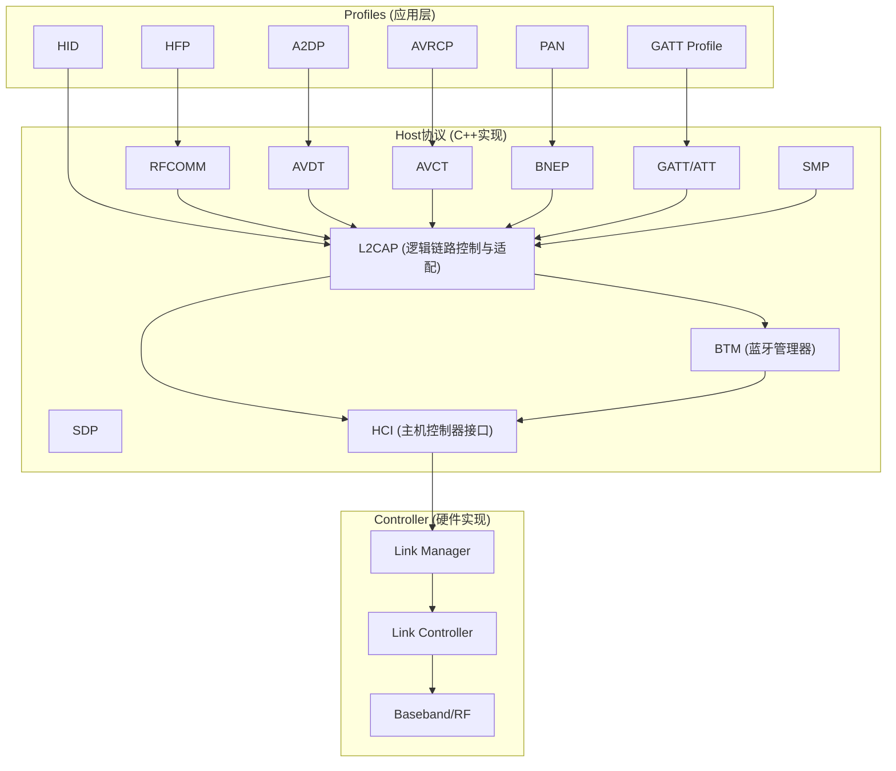

### 1.1 协议依赖关系

```
上层 Profile → 传输协议 → L2CAP → 底层(ACL/SCO) → HCI
```

| 协议 | 依赖 | 典型用途 |
|------|------|---------|
| **RFCOMM** | L2CAP (PSM=3) | HFP, SPP, MAP, PBAP |
| **AVDT** | L2CAP (PSM=0x0019) | A2DP 流媒体 |
| **AVCT** | L2CAP (PSM=0x0017) | AVRCP 遥控 |
| **BNEP** | L2CAP (PSM=0x000F) | PAN 网络 |
| **ATT/GATT** | L2CAP (CID=0x0004 LE) | BLE 应用 |
| **SMP** | L2CAP (CID=0x0006 LE) | BLE 安全 |

---

## 2. BTM — Bluetooth Manager

**位置**: `system/stack/btm/`

BTM 是蓝牙栈中最基础的模块，管理设备、连接、安全和链路：

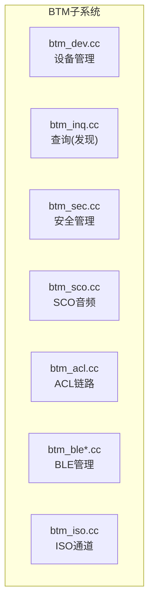

### 2.1 设备管理 (btm_dev.cc)

```cpp
// BTM设备数据库 — 管理所有已知设备
typedef struct {
    RawAddress remote_bdaddr;        // 蓝牙地址
    BD_NAME remote_name;             // 设备名称
    uint16_t hci_handle;             // HCI连接句柄
    tBTM_SEC_DEV_REC* sec_rec;       // 安全记录
    tBTM_INQ_INFO inq_info;          // 查询信息
    DEV_CLASS dev_class;             // 设备类型
    uint8_t num_sniff_attempts;      // Sniff模式尝试次数
    tBTM_ESCO_DATA esco_data;        // eSCO参数
} tBTM_REMOTE_DEV_NAME;

// 查找设备
tBTM_SEC_DEV_REC* btm_find_dev(const RawAddress& bd_addr) {
    for (int i = 0; i < BTM_SEC_MAX_DEVICE_RECORDS; i++) {
        if (btm_cb.sec_dev_rec[i].bd_addr == bd_addr) {
            return &btm_cb.sec_dev_rec[i];
        }
    }
    return nullptr;
}
```

### 2.2 查询/发现 (btm_inq.cc)

```cpp
// 发起查询（发现周围设备）
tBTM_STATUS BTM_StartInquiry(tBTM_INQ_RESULTS_CB* p_results_cb,
                               tBTM_CMPL_CB* p_cmpl_cb) {
    // 1. 设置查询参数
    btm_cb.p_inq_results_cb = p_results_cb;
    btm_cb.p_inq_cmpl_cb = p_cmpl_cb;
    
    // 2. 发送HCI查询命令
    btsnd_hcic_inquiry(btm_cb.btm_inqparms.inq_mode,
                       btm_cb.btm_inqparms.inq_length,
                       btm_cb.btm_inqparms.inq_num_responses);
    
    return BTM_CMD_STARTED;
}

// 查询结果回调（HCI Event → BTM）
void btm_process_inq_results(uint8_t* p, uint8_t inq_res_mode) {
    // 解析HCI查询结果
    RawAddress bd_addr(p);
    DEV_CLASS dev_class(p + 6);
    uint16_t clock_offset = p[9] | (p[10] << 8);
    uint8_t page_scan_rep_mode = p[11];
    
    // 调用上层回调
    if (btm_cb.p_inq_results_cb) {
        tBTM_INQ_RESULTS result;
        result.remote_bd_addr = bd_addr;
        result.dev_class = dev_class;
        // ...
        btm_cb.p_inq_results_cb(&result);
    }
}
```

### 2.3 安全管理 (btm_sec.cc)

```cpp
// 安全记录 — 每个配对设备一个
typedef struct {
    RawAddress bd_addr;            // 设备地址
    uint8_t sec_flags;             // 安全标志
    tBTM_SEC_BOND_TYPE bond_type;  // 绑定类型
    LinkKey link_key;              // Link Key (128位)
    uint8_t key_type;              // 密钥类型
    uint8_t pin_code_length;       // PIN码长度
} tBTM_SEC_DEV_REC;

// 创建绑定
tBTM_STATUS BTM_SecBondByTransport(const RawAddress& bd_addr,
                                     tBT_TRANSPORT transport) {
    // 1. 检查是否已绑定
    tBTM_SEC_DEV_REC* p_dev_rec = btm_find_dev(bd_addr);
    if (p_dev_rec && (p_dev_rec->sec_flags & BTM_SEC_LINK_KEY_KNOWN)) {
        return BTM_SUCCESS;  // 已绑定
    }
    
    // 2. 发起认证
    btm_sec_bond_by_transport(bd_addr, transport);
    
    return BTM_CMD_STARTED;
}
```

---

## 3. L2CAP — 逻辑链路控制与适配

**位置**: `system/stack/l2cap/`

L2CAP 是蓝牙协议栈的"交通枢纽"，所有上层协议都通过它传输。

### 3.1 L2CAP 分层

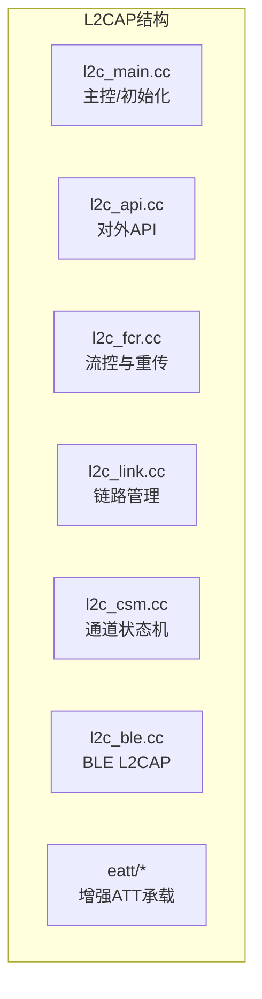

### 3.2 L2CAP 通道

L2CAP 的核心概念是**通道（Channel）**：

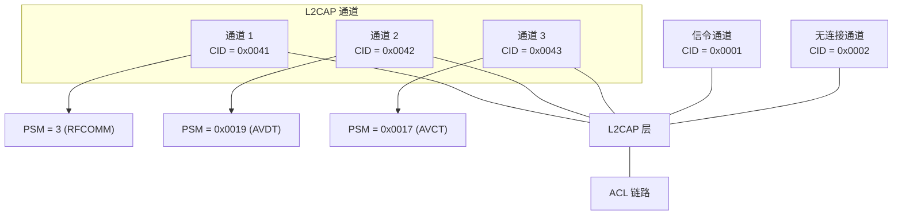

### 3.3 固定CID和动态CID

```
固定通道 (CID < 0x0040):
  CID 0x0001: L2CAP 信令通道
  CID 0x0002: 无连接数据通道
  CID 0x0003: AMP Manager
  CID 0x0004: ATT (BLE)
  CID 0x0005: LE L2CAP 信令
  CID 0x0006: SMP

动态通道 (CID ≥ 0x0040):
  0x0040 - 0x007F: 上层协议动态分配
  由 L2CAP 连接请求分配
```

### 3.4 L2CAP 连接建立

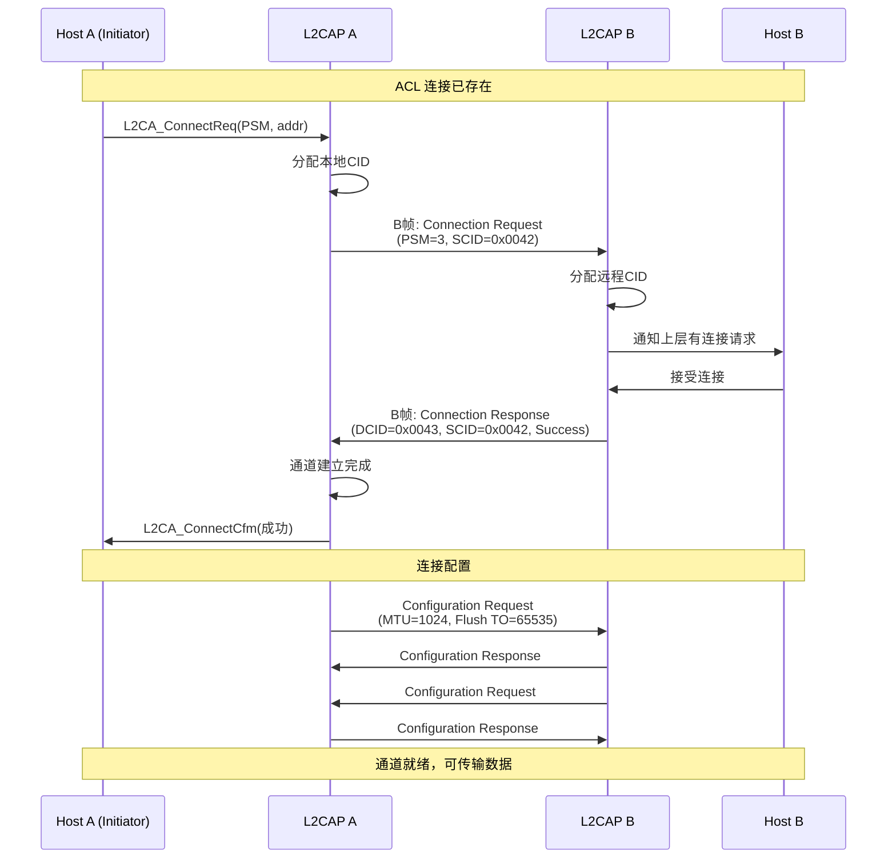

### 3.5 核心数据结构

```cpp
// l2c_api.h — L2CAP API

// 固定PSM (Protocol Service Multiplexer)
#define BT_PSM_RFCOMM      3    // RFCOMM
#define BT_PSM_BNEP        0x000F  // BNEP
#define BT_PSM_AVCTP       0x0017  // AVCTP
#define BT_PSM_AVDTP       0x0019  // AVDTP
#define BT_PSM_ATT         0x001B  // ATT (BR/EDR)

// 连接请求
tL2CAP_CONN* L2CA_ConnectReq(uint16_t psm, const RawAddress& p_bd_addr);

// 配置请求
void L2CA_ConfigReq(uint16_t cid, tL2CAP_CFG_INFO* p_cfg);

// 发送数据
uint8_t L2CA_DataWrite(uint16_t cid, BT_HDR* p_data);

// 注册PSM
uint16_t L2CA_Register(uint16_t psm, tL2CAP_APPL_INFO* p_cb_info);
```

### 3.6 L2CAP 数据包格式

```
L2CAP PDU:
┌─────────┬─────────┬──────────────────────┐
│ Length  │  CID    │       Payload        │
│ (2字节)  │ (2字节)  │     (0-65535字节)     │
└─────────┴─────────┴──────────────────────┘
  ↑         ↑
  实际数据长度  通道标识符

信令命令格式 (CID=0x0001):
┌──────┬──────┬──────┬──────┬─────────────────┐
│ Code │ ID   │ Len  │ Data │    ...更多命令   │
│(1字节)│(1字节)│(2字节)│ (可变)│                  │
└──────┴──────┴──────┴──────┴─────────────────┘
```

---

## 4. RFCOMM — 串口仿真

**位置**: `system/stack/rfcomm/`

RFCOMM 模拟 RS-232 串口，是 HFP、SPP、MAP、PBAP 等Profile的基础。

### 4.1 RFCOMM 层次

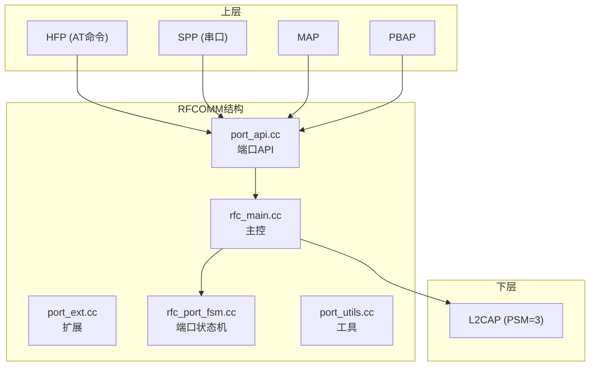

### 4.2 DLC (Data Link Connection)

RFCOMM 的核心是 **DLC**—数据链路连接：

```cpp
// 端口控制块 — 每个DLC一个
typedef struct {
    uint16_t dlci;              // DLC标识符 (0-63)
    uint8_t port_state;         // 端口状态
    uint8_t signals;            // 信号线状态 (RTS/DTR/CTS/DSR/DCD/RI)
    uint16_t mtu;               // 最大传输单元
    tPORT_CALLBACK* p_callback; // 端口回调
    RawAddress bd_addr;         // 远端地址
    tPORT_STATE port_state;     // 端口配置
} tPORT;

// DLCI格式: DLCI = 0xxxyyyyy
//  0    = 方向: 0=发起端, 1=接受端
//  xxx  = 冲突解决
//  yyyyy = 逻辑通道号 (0-30)
```

### 4.3 连接建立

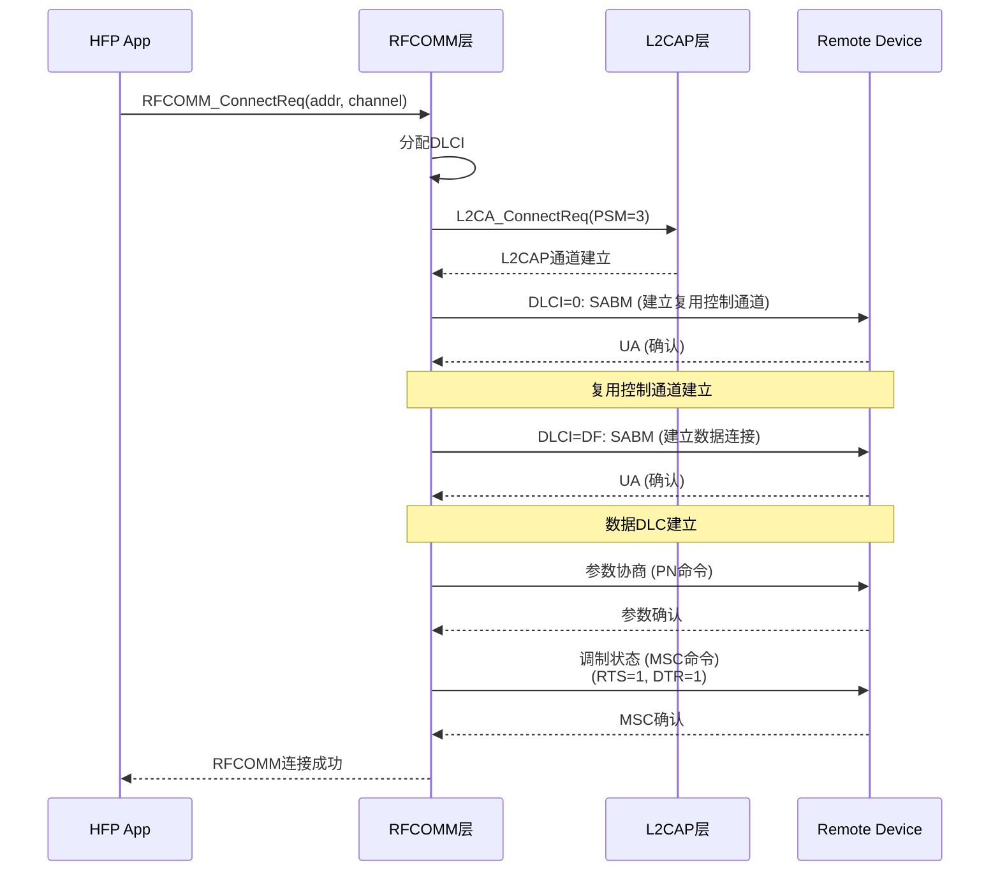

### 4.4 核心API

```cpp
// port_api.h — RFCOMM API

// 注册端口
int RFCOMM_CreateConnection(uint16_t uuid, uint8_t scn,
                              bool is_server, uint16_t mtu,
                              const RawAddress* bd_addr,
                              uint16_t* handle,
                              tPORT_CALLBACK* p_callback);

// 连接请求
int RFCOMM_ConnectReq(const RawAddress& bd_addr, uint8_t scn);

// 发送数据
int RFCOMM_WriteData(uint16_t handle, const uint8_t* data, uint16_t len);

// 断开连接
int RFCOMM_RemoveConnection(uint16_t handle);

// 控制信号
int RFCOMM_Control(uint16_t handle, uint8_t signal);
```

---

## 5. SDP — 服务发现协议

**位置**: `system/stack/sdp/`

SDP 用于查询远端设备支持的服务（UUID）。

### 5.1 SDP 数据库

```cpp
// sdpint.h — SDP内部结构

// 服务记录
typedef struct {
    uint32_t record_handle;       // 服务记录句柄
    uint16_t num_attributes;       // 属性数量
    tSDP_ATTRIBUTE* p_attributes;  // 属性列表
    uint8_t* p_free_mem;           // 动态内存
} tSDP_RECORD;

// 属性
typedef struct {
    uint16_t id;                   // 属性ID
    uint16_t type;                 // 数据类型
    union {
        uint8_t u8;
        uint16_t u16;
        uint32_t u32;
        uint8_t array[6];
        uint8_t* ptr;
    } v;
} tSDP_ATTRIBUTE;
```

### 5.2 服务发现流程

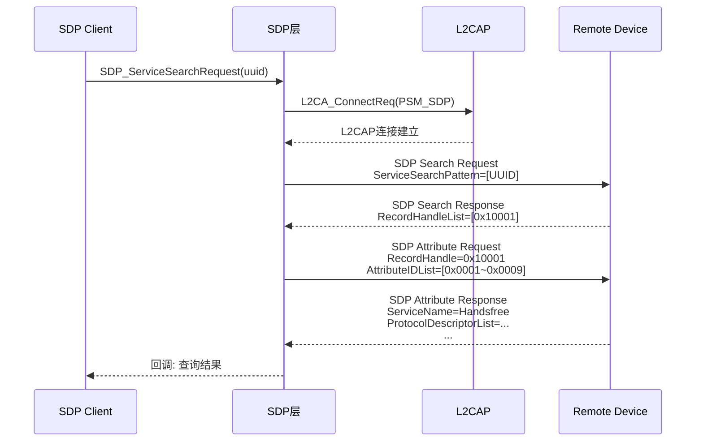

### 5.3 关键UUID

```cpp
// sdpdefs.h — 常用UUID

// 协议UUID
#define UUID_PROTOCOL_SDP        0x0001
#define UUID_PROTOCOL_RFCOMM     0x0003
#define UUID_PROTOCOL_BNEP       0x000F
#define UUID_PROTOCOL_AVCTP      0x0017
#define UUID_PROTOCOL_AVDTP      0x0019
#define UUID_PROTOCOL_ATT        0x001B

// Profile UUID
#define UUID_SERVCLASS_HFP_HF    0x111E  // HFP Handsfree
#define UUID_SERVCLASS_HFP_AG    0x111F  // HFP Audio Gateway
#define UUID_SERVCLASS_A2DP      0x110D  // A2DP Source
#define UUID_SERVCLASS_A2DP_SINK 0x110B  // A2DP Sink
#define UUID_SERVCLASS_AVRCP_TG  0x110C  // AVRCP Target
#define UUID_SERVCLASS_AVRCP_CT  0x110E  // AVRCP Controller
#define UUID_SERVCLASS_PAN_NAP   0x1116  // PAN NAP
#define UUID_SERVCLASS_PANU      0x1115  // PANU
#define UUID_SERVCLASS_MAP       0x1132  // MAP
#define UUID_SERVCLASS_PBAP_PCE  0x112E  // PBAP Client
#define UUID_SERVCLASS_PBAP_PSE  0x112F  // PBAP Server
#define UUID_SERVCLASS_HID       0x1124  // HID
```

---

## 6. GATT/ATT — 通用属性协议

**位置**: `system/stack/gatt/`

GATT/ATT 是 BLE 的核心协议，也支持 BR/EDR。

### 6.1 ATT 协议

```
ATT PDU:
┌──────────┬─────────────────────────┐
│ OpCode   │     Parameters          │
│ (1字节)   │     (可变)              │
└──────────┴─────────────────────────┘

操作码类型:
  请求 (Request):      0x01-0x3F
  响应 (Response):     0x41-0x7F
  命令 (Command):      0x81-0xBF (无需响应)
  通知 (Notification): 0xC1-0xDF (无需响应)
  指示 (Indication):   0xE1-0xFF (需要确认)
```

### 6.2 GATT 层次结构

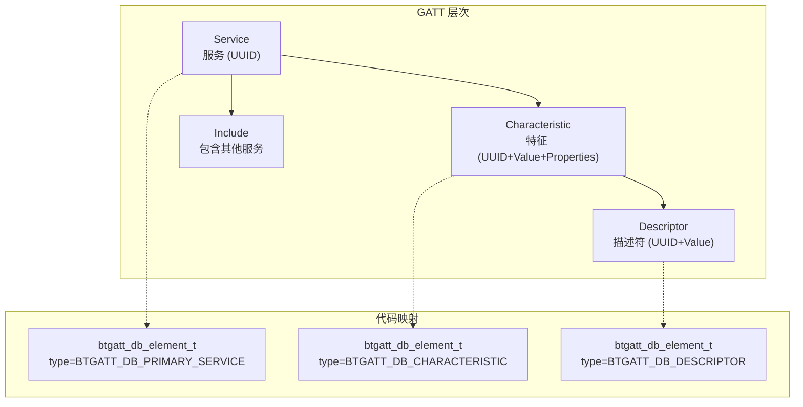

### 6.3 GATT 操作

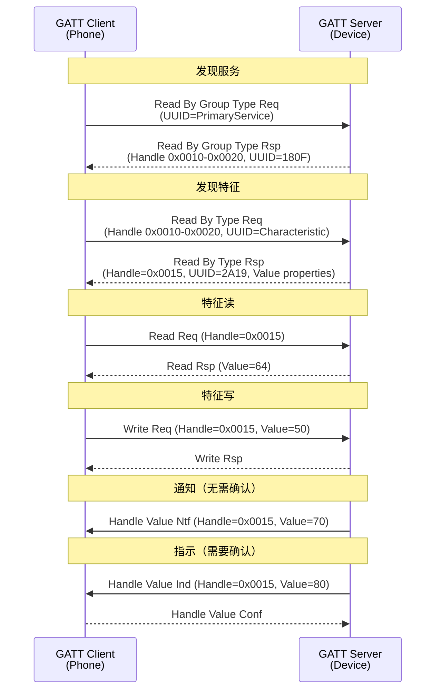

### 6.4 GATT 数据库

```cpp
// gatt_main.cc — GATT API

// GATT数据库元素
typedef struct {
    uint8_t type;                    // PRIMARY_SERVICE / CHARACTERISTIC / DESCRIPTOR
    bt_uuid_t uuid;                  // UUID
    uint8_t properties;              // 属性（Read/Write/Notify/Indicate）
    uint16_t permissions;            // 权限（读权限、写权限）
    uint16_t handle;                 // 句柄
} btgatt_db_element_t;

// 添加服务
bt_status_t GATTS_AddService(uint8_t server_if,
                              btgatt_db_element_t* service,
                              int count);

// 发送响应
bt_status_t GATTS_SendResponse(uint16_t conn_id,
                                uint32_t trans_id,
                                bt_status_t status,
                                uint8_t* value, uint16_t len);

// 发送通知
bt_status_t GATTS_SendIndication(uint16_t conn_id,
                                  uint16_t attr_handle,
                                  uint16_t len,
                                  uint8_t* value,
                                  bool need_confirm);
```

---

## 7. SMP — 安全管理协议

**位置**: `system/stack/smp/`

### 7.1 配对方法

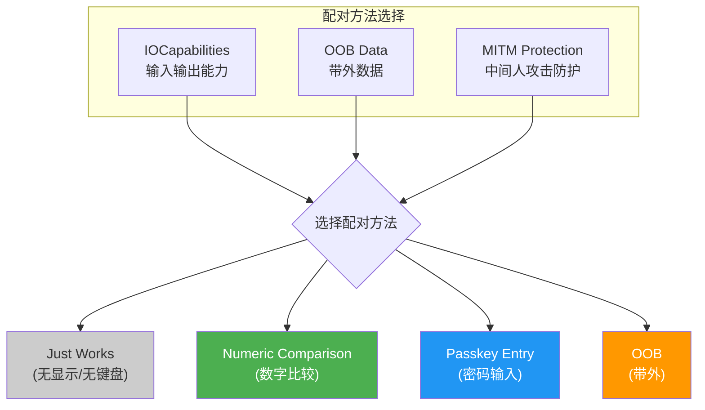

### 7.2 配对流程

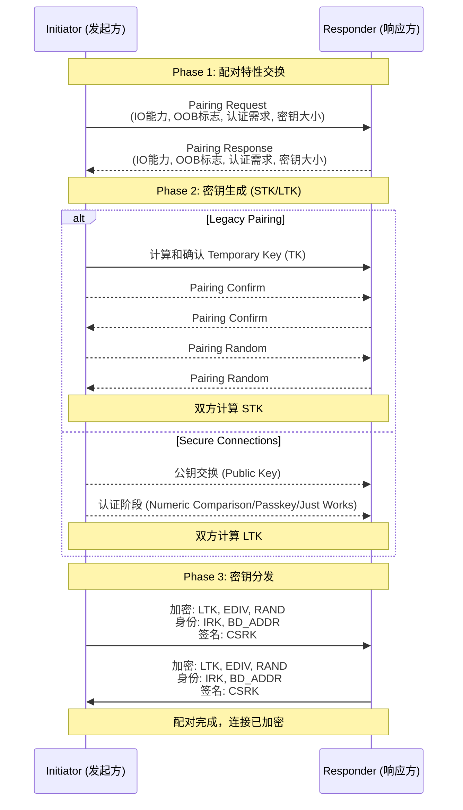

---

## 8. AVDT/AVCT/AVRC/BNEP

### 8.1 AVDT (Audio/Video Distribution Transport)

```cpp
// stack/avdt/ — A2DP的传输层

// AVDTP 信令
typedef enum {
    AVDT_DISCOVER_CMD,       // 发现SEP
    AVDT_GET_CAP_CMD,        // 获取能力
    AVDT_SET_CONFIG_CMD,     // 设置配置
    AVDT_OPEN_CMD,           // 打开流
    AVDT_START_CMD,          // 开始流
    AVDT_CLOSE_CMD,          // 关闭流
    AVDT_SUSPEND_CMD,        // 暂停
    AVDT_RECOVER_CMD,        // 恢复
} tAVDT_CMD;
```

### 8.2 BNEP (Bluetooth Network Encapsulation Protocol)

```cpp
// stack/bnep/ — PAN的底层协议

// BNEP 类型
#define BNEP_FRAME_TYPE_GENERAL      0x00  // 通用以太网
#define BNEP_FRAME_TYPE_CONTROL      0x01  // 控制
#define BNEP_FRAME_TYPE_COMPRESSED   0x02  // 压缩以太网
#define BNEP_FRAME_TYPE_ETHERNET    0x03  // 完整以太网

// BNEP 头格式 (通用以太网):
// ┌──────┬──────────────┬──────────────────────────┐
// │ Type │  EtherType   │      Ethernet Payload    │
// │ 1字节 │  2字节       │        (46-1500字节)      │
// └──────┴──────────────┴──────────────────────────┘
```

---

## 9. 实战练习

### 练习1：追踪RFCOMM连接

```cpp
// 从 HFP 连接开始
// 1. BTA_AgOpen() 如何触发 RFCOMM 连接？
// 2. 找到 stack/rfcomm/port_api.cc 中的 RFCOMM_ConnectReq
// 3. 找到它如何调用 L2CAP 的 L2CA_ConnectReq
// 完成：画出 RFCOMM → L2CAP 的完整调用链
```

> **答案**: 完整调用链：`BTA_AgOpen()` → `bta_ag_start_open(SCB)` → `SDP_InitDiscoveryDb()`查询远端RFCOMM通道号 → `bta_ag_sdp_cback()`获取SCN(Server Channel Number) → `RFCOMM_ConnectReq(port_handle, bd_addr, scn, ...)` (port_api.cc:252) → `rfc_mcb.cc:rfc_alloc_mcb()`分配控制块 → `rfc_port_fsm()`状态机 → RfC建立L2CAP通道：`L2CA_ConnectReq(L2CAP_RFCOMM_CID, bd_addr, p_rmt_mcb)` → 底层`l2c_csm.cc:l2c_csm_execute()`发起ACL连接 → HCI `Create_Connection`。关键代码：`port_api.cc:252`→`rfc_port_fsm.cc:180`→`l2c_api.cc:800`(`L2CA_ConnectReq`)。

### 练习2：分析SDP查询

```cpp
// 用 Wireshark 抓取一个A2DP连接的Snoop log
// 1. 找到 SDP 查询包
// 2. 分析查询了哪些 UUID
// 3. 远端响应了哪些属性？
```

> **答案**: 在Wireshark中用`bthci_cmd || bthci_evt`过滤HCI命令事件，查找SDP包用`btl2cap.cid == 0x0001`(L2CAP信令通道)或`btsdp`过滤。A2DP连接时SDP查询的UUID：① `AV_DISTRIBUTION` (UUID:0x110D) — A2DP Sink/Source服务；② `A/V_REMOTE_CONTROL` (UUID:0x110E) — AVRCP目标；③ `A/V_REMOTE_CONTROL_CONTROLLER` (UUID:0x110F) — AVRCP控制。远端响应属性包括：`ServiceClassIDList`(服务UUID列表)、`ProtocolDescriptorList`(协议栈—L2CAP PSM+AVDTP版本)、`BTProfileDescriptorList`(Profile版本)、`SupportedFeatures`(支持的特性位图)。典型A2DP耳机响应中PSM=0x0019(AVDTP)、Profile版本=0x0106(A2DP 1.6)。

### 练习3：分析配对流程

```cpp
// 阅读 system/stack/smp/smp_main.cc
// 1. SMP 状态机有哪几个状态？
// 2. 从配对请求到密钥分发的完整流程
// 3. 如果配对失败，SMP如何处理？
```

> **答案**: ① SMP状态机状态(smp_main.cc:105)：`SMP_ST_IDLE`(空闲)、`SMP_ST_WAIT_APP_RSP`(等待APP响应IO能力)、`SMP_ST_SEC_REQ_PEND`(安全请求待处理)、`SMP_ST_PAIR_REQ_PEND`(配对请求待处理)、`SMP_ST_WAIT_PAIR_REQ`(等待配对请求)、`SMP_ST_PAIR_CONFIG`(配对参数配置)、`SMP_ST_WAIT_CONFIRM`(等待确认值)、`SMP_ST_CONFIRM`(确认中)、`SMP_ST_WAIT_PAIR_RAND`(等待随机数)、`SMP_ST_RAND`(随机数交换)、`SMP_ST_ENCRYPT_PENDING`(加密待处理)、`SMP_ST_BOND_PENDING`(绑定待处理)。② 完整流程：配对请求(SMP_OPCODE_PAIRING_REQ/PAIRING_RSP) → 双方交换IO能力(SMP_OPCODE_PAIRING_CONFIRM + SMP_OPCODE_PAIRING_RANDOM) → STK计算 → 加密 → 密钥分发(LTK/IRK/CSRK)。③ 配对失败时：SMP状态机触发`smp_sm_event(SMP_AUTH_CMPL_EVENT, &data)`，设置`p_cb->status = SMP_PAIR_FAIL_UNKNOWN`等错误码，通过回调通知上层、释放配对定时器、清理上下文、状态回到`SMP_ST_IDLE`。常见失败码：`SMP_PAIR_FAIL_CONFIRM_VALUE`(确认值不匹配)、`SMP_PAIR_FAIL_UNSPECIFIED`(未指定错误)。

---

## 本章总结

学完本章后，你应该能：
- 理解Classic蓝牙核心协议栈的分层架构：BTM → L2CAP → RFCOMM/SDP/GATT/SMP
- 掌握BTM四大核心模块：设备管理(`btm_dev.cc`)、安全管理(`btm_sec.cc`)、设备发现(`btm_inq.cc`)、电源管理(`btm_pm.cc`)
- 掌握L2CAP的`l2c_csm.cc`状态机：CLOSED→WAIT_CONNECT→CONFIG→CONNECTED→OPEN
- 理解RFCOMM仿真串口的多路复用：一个L2CAP通道承载多个RFCOMM会话
- 理解SDP的C/S查询模型和GATT/ATT的属性读写模型
- 理解SMP的安全配对流程：Legacy vs Secure Connections 的分支机制
- 理解AVDT作为A2DP传输层的流控制：Discover→GetCap→SetConfig→Open→Start
- 知道车载场景下L2CAP的FlushTimeout配置影响A2DP抗干扰能力

> Classic Stack是蓝牙协议栈的基础，本章涵盖了绝大部分Classic BT的核心协议。下一章我们看这些协议如何被组织成具体的Profile。

---

## 车载场景

Classic Stack核心协议在车载环境中的关键配置：

### 1. L2CAP FlushTimeout配置
- 车载A2DP音频流对延迟敏感，L2CAP的`FlushTimeout`配置影响A2DP抗干扰能力
- 车厂通常要求将FlushTimeout设置为较短值（如100ms），确保过期数据包被丢弃而非重传
- `l2c_csm.cc`的状态机需要正确处理FlushTimeout事件，避免A2DP卡顿

### 2. RFCOMM多路复用
- 车载HFP通话通过RFCOMM传输AT命令，RFCOMM的多路复用能力确保HFP和PBAP可共享同一ACL连接
- 车载场景下，RFCOMM的MTU配置影响通讯录同步速度（PBAP传输大量vCard数据）
- `port_api.cc`的流控制需要适配车载DSP的处理速度

### 3. BTM设备发现
- 车载蓝牙需要快速发现附近设备（如乘客上车时手机自动连接）
- `btm_inq.cc`的查询参数（`lap`、`num_resp`、`timeout`）需要针对车载场景优化
- 车厂通常配置为"快速查询+自动重连已绑定设备"，确保用户体验

---

## 相关章节

- **经典协议的Profile应用**：[第11章](11_Classic_Profiles.md)的HFP/A2DP/AVRCP/PAN分析
- **BLE的L2CAP/SMP不同实现**：[第12章BLE栈](12_BLE_Stack.md)
- **BTM电源管理(btm_pm.cc)的详细参数**：[第17章电源管理](17_Power_Management.md)
- **安全性(BTM_SEC+SMP)深入**：[第18章安全架构](18_Security_Architecture.md)

---

## 参考文件清单

| 协议 | 核心文件 | 作用 |
|------|---------|------|
| BTM | `stack/btm/btm_dev.cc` | 设备管理 |
| BTM | `stack/btm/btm_sec.cc` | 安全管理 |
| BTM | `stack/btm/btm_inq.cc` | 设备发现 |
| L2CAP | `stack/l2cap/l2c_main.cc` | 主控 |
| L2CAP | `stack/l2cap/l2c_api.h` | API定义 |
| L2CAP | `stack/l2cap/l2c_csm.cc` | 状态机 |
| RFCOMM | `stack/rfcomm/port_api.cc` | 端口API |
| RFCOMM | `stack/rfcomm/rfc_main.cc` | 主控 |
| SDP | `stack/sdp/sdp_main.cc` | 主控 |
| SDP | `stack/sdp/sdp_api.h` | API |
| GATT | `stack/gatt/gatt_main.cc` | 主控 |
| GATT | `stack/gatt/att_protocol.cc` | ATT协议 |
| SMP | `stack/smp/smp_main.cc` | 主控 |
| SMP | `stack/smp/smp_api.h` | API |
| AVDT | `stack/avdt/avdt_main.cc` | 音视频分发 |
| AVCT | `stack/avct/avct_main.cc` | 音视频控制 |
| BNEP | `stack/bnep/bnep_main.cc` | 网络封装 |


| **V8 深度分析报告** | |
| V8_Pairing_Analysis.md | 见该报告完整分析 |
| V8_Discovery_Analysis.md | 见该报告完整分析 |
| V8_BLE_Connect_Analysis.md | 见该报告完整分析 |

> **下一步**: 阅读 [第11章：经典Profile详解](11_Classic_Profiles.md)
